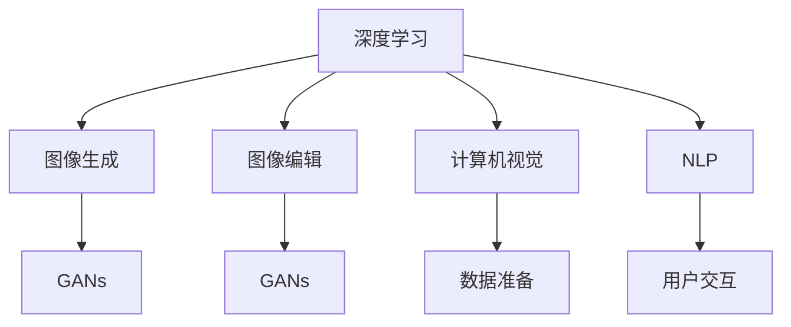

                 

# AI在电商平台商品图像生成与编辑中的应用

> 关键词：人工智能,电商平台,图像生成,图像编辑,深度学习,计算机视觉,自然语言处理,Python

## 1. 背景介绍

随着电子商务的蓬勃发展，商品图像成为了电商平台展示和推荐的核心。高质量的商品图像不仅能提升用户体验，还能显著提高转化率和销量。然而，实际运营中，由于商品拍摄条件和拍摄技术的多样性，导致商品图像质量参差不齐。为了提升图像质量，商家需要耗费大量时间和成本进行重新拍摄和后期处理，效率低下。而人工智能技术的引入，特别是基于深度学习的图像生成和编辑技术，使得自动改善商品图像质量成为可能。

## 2. 核心概念与联系

### 2.1 核心概念概述

本文将介绍几个与商品图像生成与编辑相关的核心概念：

- **深度学习(Deep Learning)**：一种通过多层神经网络进行复杂数据建模的技术。深度学习在大规模数据上进行训练，能够学习到数据的深层次特征。
- **计算机视觉(Computer Vision)**：使计算机能够理解、解释和生成视觉数据的学科。在商品图像生成与编辑中，计算机视觉技术可以用于图像分类、识别、分割和生成。
- **自然语言处理(Natural Language Processing, NLP)**：使计算机能够理解和处理人类语言的技术。在电商平台中，自然语言处理技术可以用于用户评论分析、商品推荐和智能客服等。
- **图像生成(Image Generation)**：使用深度学习模型生成高质量的新图像。在商品图像生成中，可以通过生成模型对原始图像进行修复和增强。
- **图像编辑(Image Editing)**：使用深度学习模型对现有图像进行智能编辑。在商品图像编辑中，可以通过生成模型对商品图像进行美化、构图调整和风格转换。
- **生成对抗网络(GANs)**：一种包含生成器和判别器两个对抗模块的深度学习架构，用于生成逼真图像。在商品图像生成与编辑中，GANs被广泛用于图像修复和风格迁移。

这些概念之间存在紧密的联系，相互支持。深度学习模型可以用于图像生成和编辑的基础训练，而计算机视觉和自然语言处理技术则可以用于模型训练数据集的准备和用户交互的改进。

### 2.2 核心概念原理和架构的 Mermaid 流程图



这个流程图展示了深度学习、计算机视觉、自然语言处理、图像生成和图像编辑之间的联系。深度学习是基础，图像生成和编辑的具体实现依赖于计算机视觉和自然语言处理技术，而GANs作为关键技术，在图像生成和编辑中发挥着重要作用。

## 3. 核心算法原理 & 具体操作步骤

### 3.1 算法原理概述

商品图像生成与编辑的核心算法原理主要包括两个方面：图像生成和图像编辑。这两部分算法均基于深度学习模型，特别是生成对抗网络(GANs)，在电商平台中的应用如下：

- **图像生成**：使用GANs等生成模型，将原始图像输入模型，生成高质量的新图像。
- **图像编辑**：使用GANs等生成模型，对输入的原始图像进行智能编辑，如修复、美化、构图调整和风格转换等。

通过这些算法，电商平台可以在无需额外拍摄和处理成本的情况下，自动提升商品图像质量，提升用户购买体验和满意度。

### 3.2 算法步骤详解

#### 3.2.1 图像生成

图像生成的主要步骤包括数据准备、模型训练和结果生成。具体如下：

1. **数据准备**：收集并标注大量的商品图像作为训练数据。这些数据可以来自电商平台的库存商品，也可以从公共数据集如ImageNet中获取。
2. **模型训练**：使用生成对抗网络(GANs)等深度学习模型进行训练。模型包括一个生成器(G)和一个判别器(D)，生成器用于生成新图像，判别器用于判断生成图像的真实性。通过优化生成器和判别器的损失函数，提高生成图像的质量。
3. **结果生成**：训练完成后，使用训练好的生成器对原始商品图像进行生成和修复。

#### 3.2.2 图像编辑

图像编辑的主要步骤包括数据准备、模型训练和结果生成。具体如下：

1. **数据准备**：收集并标注大量的商品图像和对应的编辑任务。这些编辑任务可以包括修复、美化、构图调整和风格转换等。
2. **模型训练**：使用生成对抗网络(GANs)等深度学习模型进行训练。模型包括一个生成器(G)和一个判别器(D)，生成器用于生成编辑后的图像，判别器用于判断编辑图像的真实性。通过优化生成器和判别器的损失函数，提高编辑图像的质量。
3. **结果生成**：训练完成后，使用训练好的生成器对原始商品图像进行智能编辑。

### 3.3 算法优缺点

#### 3.3.1 图像生成的优缺点

- **优点**：
  - 自动化程度高，能够大幅提升商品图像质量。
  - 降低拍摄和后期处理的成本，提升电商运营效率。
  - 生成高质量的新图像，满足不同用户的个性化需求。

- **缺点**：
  - 生成图像质量受限于训练数据和模型架构，可能存在质量不稳定的现象。
  - 需要大量标注数据进行训练，数据准备成本较高。

#### 3.3.2 图像编辑的优缺点

- **优点**：
  - 能够智能处理图像缺陷，提升商品美观度。
  - 可以自动调整构图和风格，提升用户满意度。
  - 能够处理复杂的多步骤编辑任务，如人物美化、背景替换等。

- **缺点**：
  - 编辑后的图像可能存在过度美化，与实际情况不符。
  - 模型复杂度较高，需要更多的计算资源和时间进行训练。

### 3.4 算法应用领域

#### 3.4.1 电商平台

商品图像生成与编辑技术在电商平台中的应用非常广泛，主要体现在以下几个方面：

1. **商品展示**：生成高质量的商品图像，提升用户购买体验。
2. **库存管理**：修复破损的商品图像，减少库存损失。
3. **商品推荐**：通过编辑美化商品图像，提升用户对商品的兴趣和购买欲望。

#### 3.4.2 广告传媒

广告传媒行业也需要高质量的商品图像，特别是在广告宣传中。商品图像生成与编辑技术可以用于广告素材的生成和美化，提升广告效果。

#### 3.4.3 旅游行业

旅游行业需要展示各种旅游商品和景点，高质量的商品图像可以提升用户对旅游商品的兴趣。通过图像生成和编辑，可以制作更具吸引力的旅游宣传素材。

## 4. 数学模型和公式 & 详细讲解

### 4.1 数学模型构建

在商品图像生成与编辑中，深度学习模型是核心。以GANs为例，其主要数学模型包括生成器和判别器两个部分。

1. **生成器(G)**：将随机噪声向量 $\mathbf{z}$ 转换为生成图像 $\mathbf{x}$。
   - 输入：噪声向量 $\mathbf{z}$。
   - 输出：生成图像 $\mathbf{x}$。
   - 损失函数：$L_G(\mathbf{z})$。

2. **判别器(D)**：判断输入图像 $\mathbf{x}$ 的真实性。
   - 输入：图像 $\mathbf{x}$。
   - 输出：图像真实性的预测值 $y$。
   - 损失函数：$L_D(\mathbf{x})$。

整个GANs模型的损失函数是生成器和判别器损失函数的组合。

$$
L_{GAN} = L_G(\mathbf{z}) + \lambda L_D(\mathbf{x})
$$

其中 $\lambda$ 是平衡生成器和判别器损失的超参数。

### 4.2 公式推导过程

#### 4.2.1 生成器损失函数

生成器的损失函数包括真实图像损失和假图像损失两部分。

1. **真实图像损失**：
   $$
   L_{G}^{real} = -\log D(G(\mathbf{z}))
   $$

2. **假图像损失**：
   $$
   L_{G}^{fake} = -\log(1 - D(G(\mathbf{z})))
   $$

结合两者，生成器的总损失函数为：

$$
L_{G} = L_{G}^{real} + L_{G}^{fake}
$$

#### 4.2.2 判别器损失函数

判别器的损失函数包括真实图像判别损失和假图像判别损失两部分。

1. **真实图像判别损失**：
   $$
   L_{D}^{real} = \log D(\mathbf{x})
   $$

2. **假图像判别损失**：
   $$
   L_{D}^{fake} = \log(1 - D(G(\mathbf{z})))
   $$

结合两者，判别器的总损失函数为：

$$
L_{D} = L_{D}^{real} + L_{D}^{fake}
$$

### 4.3 案例分析与讲解

假设我们有一个包含1000张商品图像的数据集，每张图像的大小为256x256。我们使用GANs模型进行训练，生成器架构为Dense-BatchNorm-ReLU-Dense，判别器架构为Dense-BatchNorm-LeakyReLU-Dense。训练过程中，我们将使用Adam优化器和交叉熵损失函数。

**1. 数据准备**

我们使用图像预处理技术，对原始图像进行归一化和裁剪等预处理，将其转换为模型可以接受的格式。

**2. 模型训练**

我们将图像数据分为训练集和验证集，使用训练集进行模型训练，验证集进行模型评估。在训练过程中，我们逐步降低学习率，避免过拟合。

**3. 结果生成**

训练完成后，我们使用训练好的生成器对原始商品图像进行生成和修复。我们可以将生成的图像保存到本地或上传到电商平台。

## 5. 项目实践：代码实例和详细解释说明

### 5.1 开发环境搭建

为了实现商品图像生成与编辑，我们需要搭建Python开发环境，并安装相关深度学习库。

1. **安装Python和虚拟环境**：使用Anaconda创建Python虚拟环境，安装所需的深度学习库。

2. **安装深度学习库**：安装TensorFlow、Keras和PyTorch等深度学习库。

3. **安装图像处理库**：安装OpenCV、Pillow等图像处理库。

4. **安装数据集**：安装公共数据集如ImageNet，或收集电商平台的商品图像数据集。

### 5.2 源代码详细实现

以下是一个简单的商品图像生成和编辑代码实现示例：

```python
import tensorflow as tf
from tensorflow.keras.layers import Dense, BatchNormalization, LeakyReLU
from tensorflow.keras.models import Model

# 定义生成器
def make_generator_model():
    model = tf.keras.Sequential()
    model.add(Dense(256, use_bias=False, input_shape=(100,)))
    model.add(BatchNormalization())
    model.add(LeakyReLU(alpha=0.2))
    model.add(Dense(512, use_bias=False))
    model.add(BatchNormalization())
    model.add(LeakyReLU(alpha=0.2))
    model.add(Dense(1024, use_bias=False))
    model.add(BatchNormalization())
    model.add(LeakyReLU(alpha=0.2))
    model.add(Dense(784, activation='tanh', use_bias=False))
    return model

# 定义判别器
def make_discriminator_model():
    model = tf.keras.Sequential()
    model.add(Dense(1024, input_shape=(784,)))
    model.add(LeakyReLU(alpha=0.2))
    model.add(Dense(512, use_bias=False))
    model.add(BatchNormalization())
    model.add(LeakyReLU(alpha=0.2))
    model.add(Dense(256, use_bias=False))
    model.add(BatchNormalization())
    model.add(LeakyReLU(alpha=0.2))
    model.add(Dense(1, activation='sigmoid'))
    return model

# 定义GAN模型
def make_gan_model(generator, discriminator):
    model = tf.keras.Sequential()
    model.add(generator)
    model.add(discriminator)
    return model

# 定义损失函数
def make_loss():
    cross_entropy = tf.keras.losses.BinaryCrossentropy(from_logits=True)
    real_loss = cross_entropy(tf.ones_like(discriminator.trainable),
                             discriminator(tf.random.normal(shape=(32, 784)))
    fake_loss = cross_entropy(tf.zeros_like(discriminator.trainable),
                             discriminator(generator(tf.random.normal(shape=(32, 100))))
    return real_loss, fake_loss

# 定义优化器
def make_optimizer():
    return tf.keras.optimizers.Adam()

# 训练GAN模型
def train_gan(generator, discriminator, dataset):
    cross_entropy = tf.keras.losses.BinaryCrossentropy(from_logits=True)
    generator_optimizer = make_optimizer()
    discriminator_optimizer = make_optimizer()

    @tf.function
    def train_step(images):
        noise = tf.random.normal([32, 100])
        with tf.GradientTape() as gen_tape, tf.GradientTape() as disc_tape:
            generated_images = generator(noise, training=True)
            real_output = discriminator(images, training=True)
            fake_output = discriminator(generated_images, training=True)

            gen_loss = cross_entropy(real_output, tf.ones_like(real_output))
            disc_loss = cross_entropy(real_output, tf.ones_like(real_output)) + cross_entropy(fake_output, tf.zeros_like(fake_output))

        gradients_of_generator = gen_tape.gradient(gen_loss, generator.trainable_variables)
        gradients_of_discriminator = disc_tape.gradient(disc_loss, discriminator.trainable_variables)

        generator_optimizer.apply_gradients(zip(gradients_of_generator, generator.trainable_variables))
        discriminator_optimizer.apply_gradients(zip(gradients_of_discriminator, discriminator.trainable_variables))

    for epoch in range(EPOCHS):
        for images in dataset:
            train_step(images)

# 生成和编辑商品图像
def generate_and_edit_images(generator, discriminator, dataset):
    generated_images = []
    for images in dataset:
        noise = tf.random.normal([32, 100])
        generated_images.append(generator(noise, training=True))

    return generated_images
```

### 5.3 代码解读与分析

上述代码实现了商品图像生成和编辑的基本流程。主要包括以下几个关键步骤：

1. **模型定义**：定义生成器和判别器的架构和损失函数。
2. **优化器定义**：定义Adam优化器，用于模型训练。
3. **模型训练**：定义训练函数，使用数据集进行模型训练。
4. **结果生成**：定义生成函数，使用训练好的生成器对原始图像进行生成和编辑。

## 6. 实际应用场景

### 6.1 电商平台

电商平台可以广泛应用商品图像生成与编辑技术，提升商品展示效果和用户满意度。具体场景如下：

1. **商品展示**：自动生成高质量的商品图像，提升用户点击率。
2. **库存管理**：修复破损的商品图像，减少库存损失。
3. **商品推荐**：通过编辑美化商品图像，提升用户对商品的兴趣和购买欲望。

### 6.2 广告传媒

广告传媒行业也可以利用商品图像生成与编辑技术，制作高质量的广告素材。具体场景如下：

1. **广告宣传**：自动生成高质量的广告图像，提升广告点击率和转化率。
2. **品牌推广**：通过编辑美化品牌形象，提升品牌美誉度。
3. **内容创作**：自动生成创意素材，提升内容创作效率。

### 6.3 旅游行业

旅游行业需要展示各种旅游商品和景点，高质量的商品图像可以提升用户对旅游商品的兴趣。具体场景如下：

1. **景点展示**：自动生成高质量的景点图像，提升用户对旅游景点的兴趣。
2. **商品推荐**：通过编辑美化旅游商品图像，提升用户对旅游商品的兴趣和购买欲望。
3. **体验模拟**：自动生成虚拟旅游体验图像，提升用户对旅游体验的期待。

## 7. 工具和资源推荐

### 7.1 学习资源推荐

为了帮助开发者系统掌握商品图像生成与编辑的理论基础和实践技巧，以下是一些优质的学习资源：

1. **《深度学习入门》书籍**：由陈湛、宋鸿飞等知名专家撰写，全面介绍了深度学习的原理和应用，包括图像生成和编辑等内容。
2. **CS231n《深度卷积神经网络》课程**：斯坦福大学开设的计算机视觉课程，包含生成对抗网络和图像生成等内容。
3. **《Python深度学习》书籍**：由Francois Chollet撰写，介绍了TensorFlow、Keras等深度学习框架的使用。
4. **Kaggle竞赛**：参与图像生成和编辑相关的Kaggle竞赛，提升实战能力。
5. **Arxiv论文**：阅读最新发布的图像生成和编辑相关论文，掌握前沿技术。

### 7.2 开发工具推荐

为了实现商品图像生成与编辑，我们需要使用一些深度学习工具和库。以下是一些推荐工具：

1. **TensorFlow**：由Google开发的深度学习框架，支持GPU加速，适用于大规模模型训练。
2. **Keras**：基于TensorFlow的深度学习库，易于使用，适用于快速原型开发。
3. **PyTorch**：由Facebook开发的深度学习框架，支持动态图和静态图，适用于研究和实验。
4. **OpenCV**：计算机视觉库，提供了丰富的图像处理函数。
5. **Pillow**：Python图像处理库，用于图像读取、转换和保存。

### 7.3 相关论文推荐

以下是几篇与商品图像生成与编辑相关的经典论文，推荐阅读：

1. **Image-to-Image Translation with Conditional Adversarial Networks**：Isola等提出条件生成对抗网络，用于图像风格转换。
2. **Photo-Realistic Single Image Super-Resolution Using a Generative Adversarial Network**：Johnson等提出使用GANs进行超分辨率图像生成。
3. **Deep Learning for Image Processing: A Review**：Gao等总结了深度学习在图像处理中的应用，包括图像生成和编辑等内容。
4. **Pix2Pix**：Isola等提出用于图像到图像翻译的生成对抗网络，用于图像生成和修复。

## 8. 总结：未来发展趋势与挑战

### 8.1 总结

本文对商品图像生成与编辑技术进行了全面系统的介绍。首先阐述了商品图像生成与编辑技术的研究背景和应用意义，明确了其在电商平台中的应用价值。其次，从原理到实践，详细讲解了深度学习模型、生成对抗网络和图像处理技术的核心算法。最后，展示了商品图像生成与编辑技术在电商平台、广告传媒和旅游行业等实际应用场景中的广泛应用。

通过本文的系统梳理，可以看到，商品图像生成与编辑技术为电商平台带来了巨大的商机和用户体验提升。未来，伴随深度学习、计算机视觉和自然语言处理等技术的进一步发展，商品图像生成与编辑技术将在更多领域得到应用，为人类社会的数字化转型提供新的动力。

### 8.2 未来发展趋势

展望未来，商品图像生成与编辑技术将呈现以下几个发展趋势：

1. **更高效、更逼真的生成模型**：深度学习模型的不断优化和改进，将使得商品图像生成更高效、更逼真。GANs等生成模型将进一步提升生成图像的质量和多样性。
2. **更广泛的应用场景**：商品图像生成与编辑技术将在更多领域得到应用，如自动驾驶、医疗诊断、文化创意等。
3. **更智能的交互体验**：结合自然语言处理技术，用户可以通过自然语言指令进行图像生成和编辑，提升交互体验。
4. **更强大的隐私保护**：商品图像生成与编辑技术将结合隐私保护技术，保护用户隐私数据。
5. **更广泛的数据来源**：结合大数据技术，商品图像生成与编辑技术将从更多数据源获取生成素材，提升生成图像的多样性和质量。

### 8.3 面临的挑战

尽管商品图像生成与编辑技术已经取得了瞩目成就，但在迈向更加智能化、普适化应用的过程中，仍面临诸多挑战：

1. **数据获取和标注成本**：高质量的数据和标注成本较高，需要更多的研发投入。
2. **模型的鲁棒性和可解释性**：生成的图像质量受限于训练数据和模型架构，可能存在鲁棒性不足和可解释性差的问题。
3. **计算资源需求**：大规模模型训练和推理需要大量的计算资源，成本较高。
4. **隐私和安全问题**：生成的图像可能存在隐私和安全风险，需要加强监管和保护。

### 8.4 研究展望

未来的研究需要在以下几个方面寻求新的突破：

1. **生成模型优化**：开发更加高效、更逼真的生成模型，提升生成图像的质量和多样性。
2. **数据增强**：结合大数据和计算机视觉技术，提升数据集的多样性和丰富度。
3. **模型压缩**：优化模型结构和压缩算法，降低计算资源需求，提升生成效率。
4. **隐私保护**：结合隐私保护技术，保护用户隐私数据，提升数据安全。
5. **可解释性**：开发可解释性强的生成模型，提升模型透明度和可信度。

这些研究方向将推动商品图像生成与编辑技术的进一步发展，为电商平台和更多领域带来新的突破。总之，商品图像生成与编辑技术需要在数据、模型、算法、应用等多个方面进行全面优化，方能更好地服务于人类社会的数字化转型。

## 9. 附录：常见问题与解答

### Q1: 商品图像生成与编辑技术是否适用于所有电商平台？

A: 商品图像生成与编辑技术主要适用于那些需要展示大量商品图片，且图片质量要求较高的电商平台。对于一些对图片质量要求不高的平台，如新闻资讯类网站，则适用性较低。

### Q2: 商品图像生成与编辑技术是否会影响电商平台的搜索算法？

A: 商品图像生成与编辑技术主要应用于商品展示和推荐，不会直接影响搜索算法。但是生成的图像可能需要搜索算法进一步优化展示方式和推荐策略，以提升用户体验。

### Q3: 商品图像生成与编辑技术是否需要人工干预？

A: 生成的图像质量受限于训练数据和模型架构，可能会存在一定的不足。人工干预和优化是必要的，可以通过人工标注数据和调整模型参数等方式，提升生成图像的质量和适用性。

### Q4: 商品图像生成与编辑技术是否会对电商平台带来安全风险？

A: 商品图像生成与编辑技术存在一定的隐私和安全风险，需要采取必要的保护措施，如数据脱敏、访问控制等，确保数据安全。

---

作者：禅与计算机程序设计艺术 / Zen and the Art of Computer Programming

