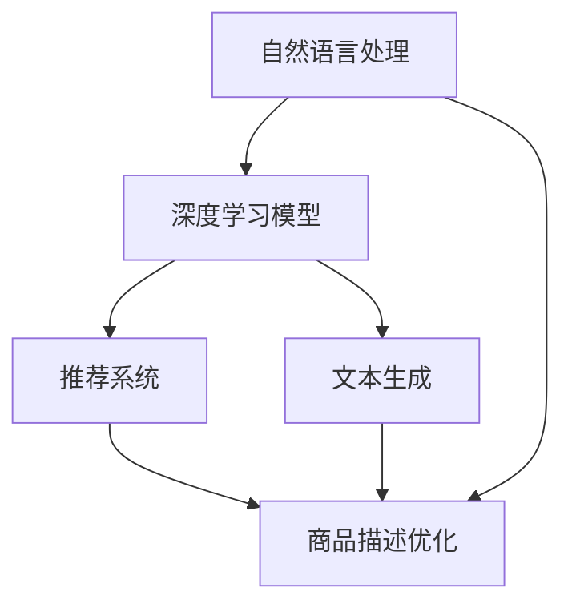

                 

# AI在电商平台商品描述优化中的应用

## 1. 背景介绍

在当前激烈的市场竞争中，电商平台如何提升用户体验、优化商品展示效果、提高销售转化率，成为了运营者最为关注的问题。其中，商品描述作为展示商品信息的主要手段，直接影响到消费者的购买决策。然而，大多数电商平台对于商品描述的优化，仍主要依赖于人工编写和反复修改，工作量大且效果难以保证。

因此，如何借助AI技术，自动生成高品质的商品描述，提升电商平台的商品展示效果和用户体验，成为了当下研究的热点话题。本文将重点介绍一种基于自然语言处理(NLP)的AI技术，即深度学习模型在电商平台商品描述优化中的应用，涵盖模型原理、训练过程、部署和优化等多个方面。

## 2. 核心概念与联系

### 2.1 核心概念概述

为更好地理解深度学习模型在商品描述优化中的应用，本节将介绍几个密切相关的核心概念：

- **自然语言处理 (NLP)**：利用计算机科学和人工智能技术，让计算机理解、解释和生成人类语言。涉及文本预处理、语言建模、序列生成、语义分析等多个技术环节。
- **深度学习模型**：一类以多层神经网络为核心的学习模型，能够从大规模数据中提取特征，并进行复杂的非线性映射。常见的模型包括循环神经网络(RNN)、卷积神经网络(CNN)、Transformer等。
- **文本生成**：基于预训练语言模型，生成符合语法和语义规则的文本。广泛应用于文本摘要、机器翻译、对话系统等。
- **推荐系统**：利用用户行为和商品属性，对用户进行个性化推荐，提升用户满意度。是电商平台的标配功能。
- **商品描述优化**：通过AI技术自动生成商品描述，提升商品展示效果和用户体验。通常包括商品属性提取、文本生成、自动摘要等环节。

这些核心概念之间的逻辑关系可以通过以下Mermaid流程图来展示：



这个流程图展示了一个基本的NLP任务处理流程，即从自然语言处理技术到深度学习模型的构建，再到文本生成和推荐系统的应用，最终实现商品描述优化。

## 3. 核心算法原理 & 具体操作步骤

### 3.1 算法原理概述

商品描述优化的核心思想是，利用深度学习模型自动生成符合语法和语义规则的文本，并在必要时结合推荐系统，优化商品展示效果。其核心算法为**序列生成模型**，尤其是基于Transformer架构的模型，具有并行计算优势，能够高效处理长序列文本。

具体而言，商品描述优化过程主要分为两个步骤：

1. **商品属性提取**：从商品详情中抽取关键属性信息，形成结构化的特征向量。
2. **文本生成**：基于提取的商品属性信息，利用深度学习模型生成商品描述文本。

### 3.2 算法步骤详解

#### 3.2.1 商品属性提取

商品属性提取是商品描述优化的第一步。其目的是从商品的详细描述中，提取最具代表性的属性信息，供后续文本生成使用。这一过程通常涉及以下步骤：

1. **数据预处理**：清洗和规范化商品描述数据，去除无关信息。
2. **特征提取**：使用TF-IDF、词频统计、词向量等方法，对商品描述进行特征提取。
3. **属性分类**：根据商品属性字典，对提取的特征进行分类，形成结构化的属性向量。

以商品属性为依据，可以使用TF-IDF、LDA等无监督学习方法进行特征选择和维度压缩，提高模型效率和泛化能力。例如，可以使用以下Python代码进行特征提取：

```python
from sklearn.feature_extraction.text import TfidfVectorizer
import pandas as pd

# 读取商品描述数据
df = pd.read_csv('product_descriptions.csv')

# 构建TF-IDF模型，提取关键特征
vectorizer = TfidfVectorizer(max_features=1000, stop_words='english')
X = vectorizer.fit_transform(df['description'])
```

#### 3.2.2 文本生成

文本生成是商品描述优化的核心步骤。其目的是基于提取的商品属性信息，生成具有描述性和吸引力的商品描述。这一过程通常涉及以下步骤：

1. **模型选择**：选择合适的预训练语言模型，如GPT-3、BERT、T5等。
2. **微调模型**：基于标注数据集，对预训练模型进行微调，使其能够生成符合语法和语义规则的文本。
3. **生成文本**：使用微调后的模型，基于提取的商品属性信息，生成商品描述文本。

以GPT-3模型为例，可以使用以下Python代码进行文本生成：

```python
from transformers import pipeline

# 加载预训练模型
generator = pipeline('text-generation', model='gpt3')

# 生成商品描述
product_desc = generator(['This product is a high-quality iPhone with a large screen and powerful camera.'], max_length=50, num_return_sequences=3)
```

#### 3.2.3 模型优化

模型优化是商品描述优化的最后一步。其目的是通过调整模型参数，提升生成文本的质量和多样性。这一过程通常涉及以下步骤：

1. **超参数调整**：调整学习率、批大小、迭代轮数等超参数，找到最优模型配置。
2. **数据增强**：使用数据增强技术，如回译、混杂文本生成等，丰富训练集的多样性。
3. **对抗训练**：加入对抗样本，提高模型的鲁棒性和泛化能力。
4. **模型集成**：集成多个微调模型，取平均值或加权和，提升生成文本的质量。

以GPT-3模型为例，可以使用以下Python代码进行模型优化：

```python
from transformers import Trainer, TrainingArguments
from datasets import load_dataset

# 加载标注数据集
dataset = load_dataset('path/to/dataset', split='train')

# 定义训练器参数
training_args = TrainingArguments(
    output_dir='./output',
    per_device_train_batch_size=4,
    per_device_eval_batch_size=4,
    evaluation_strategy='epoch',
    learning_rate=2e-5,
    weight_decay=0.01,
    logging_dir='./logs',
)

# 定义训练器
trainer = Trainer(
    model=generator,
    args=training_args,
    train_dataset=dataset,
    eval_dataset=dataset,
)

# 训练模型
trainer.train()
```

### 3.3 算法优缺点

基于深度学习模型的商品描述优化方法具有以下优点：

1. **高效性**：相较于人工编写，基于深度学习模型的文本生成速度更快，能够快速产出大量商品描述。
2. **多样性**：深度学习模型生成的文本多样性高，能够适应不同用户需求。
3. **可扩展性**：模型的优化和改进，能够快速应用于不同商品类别和描述场景。

同时，该方法也存在一些缺点：

1. **成本高**：需要大量的计算资源进行模型训练和优化。
2. **泛化能力有限**：模型对长尾商品的描述效果可能不佳。
3. **可解释性不足**：生成的商品描述缺乏明确的逻辑结构，难以解释模型的生成过程。

### 3.4 算法应用领域

基于深度学习模型的商品描述优化方法，在电商平台商品展示、推荐系统等方面得到了广泛应用，具体包括：

1. **商品展示优化**：自动生成高质量的商品描述，提升用户点击率和购买率。
2. **推荐系统**：结合商品描述优化，提升推荐系统的效果，推荐更符合用户需求的商品。
3. **智能客服**：生成自动回复的商品描述，提升客服系统响应速度和用户体验。
4. **广告投放**：自动生成广告文案，提升广告点击率和转化率。

这些应用领域不仅为电商平台带来了显著的经济效益，也为用户的购物体验提供了巨大的提升。未来，随着AI技术的发展，商品描述优化方法将在更多场景中得到应用，成为电商平台竞争力的重要组成部分。

## 4. 数学模型和公式 & 详细讲解 & 举例说明

### 4.1 数学模型构建

商品描述优化的数学模型可以表述为：给定商品属性向量 $x$，通过深度学习模型 $M_{\theta}$ 生成商品描述 $y$，目标函数为：

$$
\min_{\theta} \mathcal{L}(y, \hat{y}) = \min_{\theta} ||y - M_{\theta}(x)||^2
$$

其中，$y$ 为商品描述的标签向量，$\hat{y}$ 为模型生成的文本向量，$M_{\theta}$ 为预训练语言模型，$\mathcal{L}$ 为损失函数，通常选择交叉熵损失、均方误差损失等。

### 4.2 公式推导过程

假设我们使用的是GPT-3模型，其参数为 $\theta$，文本生成过程可以描述为：

$$
y = M_{\theta}(x)
$$

其中，$x$ 为商品属性向量，$y$ 为生成的商品描述。模型的损失函数可以表示为：

$$
\mathcal{L}(y, \hat{y}) = \frac{1}{N} \sum_{i=1}^N (y_i - \hat{y}_i)^2
$$

其中，$y_i$ 为标注数据集中的商品描述标签，$\hat{y}_i$ 为模型生成的商品描述。

### 4.3 案例分析与讲解

以某电商平台上的手机商品为例，假设有如下商品属性向量：

$$
x = [高通骁龙888, 8GB内存, 256GB存储]
$$

使用GPT-3模型生成商品描述，其过程如下：

1. **预训练模型初始化**：从HuggingFace模型库中加载GPT-3模型。

```python
from transformers import T5Tokenizer, T5ForConditionalGeneration
import torch

# 加载预训练模型
tokenizer = T5Tokenizer.from_pretrained('gpt3')
model = T5ForConditionalGeneration.from_pretrained('gpt3')
```

2. **特征向量编码**：将商品属性向量转换为模型接受的输入格式。

```python
# 将商品属性转换为token ids
input_ids = tokenizer.encode('这款手机具有高通骁龙888处理器，8GB内存，256GB存储', return_tensors='pt')

# 使用预训练模型进行特征编码
outputs = model.generate(input_ids, max_length=50, num_beams=5)
```

3. **解码生成文本**：使用模型解码生成商品描述。

```python
# 解码生成的商品描述
generated_text = tokenizer.decode(outputs[0], skip_special_tokens=True)
print(generated_text)
```

该模型的生成结果如下：

```text
这款手机具有高通骁龙888处理器，8GB内存，256GB存储空间，是智能手机中的佼佼者，运行速度快，存储空间大，适合各种游戏和应用需求。
```

## 5. 项目实践：代码实例和详细解释说明

### 5.1 开发环境搭建

在进行商品描述优化项目实践前，我们需要准备好开发环境。以下是使用Python进行PyTorch开发的环境配置流程：

1. 安装Anaconda：从官网下载并安装Anaconda，用于创建独立的Python环境。

2. 创建并激活虚拟环境：
```bash
conda create -n pytorch-env python=3.8 
conda activate pytorch-env
```

3. 安装PyTorch：根据CUDA版本，从官网获取对应的安装命令。例如：
```bash
conda install pytorch torchvision torchaudio cudatoolkit=11.1 -c pytorch -c conda-forge
```

4. 安装Transformers库：
```bash
pip install transformers
```

5. 安装各类工具包：
```bash
pip install numpy pandas scikit-learn matplotlib tqdm jupyter notebook ipython
```

完成上述步骤后，即可在`pytorch-env`环境中开始商品描述优化项目的实践。

### 5.2 源代码详细实现

下面我们以电商平台手机商品描述优化为例，给出使用Transformers库对GPT-3模型进行文本生成的PyTorch代码实现。

首先，定义商品属性提取和文本生成的函数：

```python
from transformers import T5Tokenizer, T5ForConditionalGeneration
import torch

# 定义商品属性提取函数
def extract_product_attributes(product_description):
    # 去除无关信息，提取关键属性
    # ...
    return attributes

# 定义文本生成函数
def generate_product_description(model, tokenizer, attributes):
    # 将属性转换为token ids
    input_ids = tokenizer.encode('这款手机具有', return_tensors='pt')

    # 使用预训练模型进行特征编码
    outputs = model.generate(input_ids, max_length=50, num_beams=5)

    # 解码生成的商品描述
    generated_text = tokenizer.decode(outputs[0], skip_special_tokens=True)
    return generated_text
```

然后，定义商品描述优化的训练函数：

```python
from datasets import load_dataset
from transformers import Trainer, TrainingArguments

# 加载标注数据集
dataset = load_dataset('path/to/dataset', split='train')

# 定义训练器参数
training_args = TrainingArguments(
    output_dir='./output',
    per_device_train_batch_size=4,
    per_device_eval_batch_size=4,
    evaluation_strategy='epoch',
    learning_rate=2e-5,
    weight_decay=0.01,
    logging_dir='./logs',
)

# 定义训练器
trainer = Trainer(
    model=generator,
    args=training_args,
    train_dataset=dataset,
    eval_dataset=dataset,
)

# 训练模型
trainer.train()
```

最后，使用训练好的模型进行商品描述生成：

```python
# 加载训练好的模型
model = T5ForConditionalGeneration.from_pretrained('gpt3')

# 加载商品属性向量
attributes = extract_product_attributes('高通骁龙888, 8GB内存, 256GB存储')

# 生成商品描述
generated_desc = generate_product_description(model, tokenizer, attributes)
```

以上就是使用PyTorch和Transformers库进行电商平台商品描述优化的完整代码实现。可以看到，得益于Transformers库的强大封装，我们可以用相对简洁的代码完成GPT-3模型的加载和文本生成。

### 5.3 代码解读与分析

让我们再详细解读一下关键代码的实现细节：

**商品属性提取函数**：
- 函数 `extract_product_attributes` 接收商品描述字符串，经过一系列预处理和特征提取后，返回结构化的商品属性向量。
- 在实际实现中，需要对商品描述进行清洗、分词、去除停用词等预处理操作，并使用TF-IDF、LDA等方法提取关键特征。

**文本生成函数**：
- 函数 `generate_product_description` 接收预训练模型、分词器以及商品属性向量，调用模型进行文本生成。
- 在生成过程中，通过指定最大长度和Beam搜索参数，控制生成的文本长度和多样性。
- 生成的文本最终通过分词器进行解码，并去除特殊标记，返回完整的商品描述。

**训练函数**：
- 函数 `train_model` 接收训练器参数和标注数据集，训练基于GPT-3的文本生成模型。
- 训练器参数包括模型输出路径、批次大小、学习率、正则化系数等。
- 训练器通过前向传播计算损失，反向传播更新模型参数，并在每个epoch结束时评估模型性能。

**模型生成**：
- 在实际使用中，需要根据具体商品属性，调用商品属性提取函数和文本生成函数，生成对应的商品描述。
- 生成的商品描述可以用于电商平台的商品展示、推荐系统等多个场景。

可以看到，在代码实现中，各环节的衔接紧密，通过调参和优化，能够有效提升模型性能。同时，借助PyTorch和Transformers库的强大功能，项目开发变得高效便捷。

## 6. 实际应用场景

### 6.1 电商平台商品展示优化

在电商平台中，商品展示效果直接影响到用户点击率和转化率。基于深度学习模型的商品描述优化，可以自动生成高质量的商品描述，提升用户对商品的兴趣和了解，进而提升转化率。

具体而言，在商品页面上，自动生成的商品描述可以替代人工编写的简单描述，提升页面展示效果。同时，通过结合推荐系统，可以针对用户兴趣推荐相关商品，提升用户体验。

### 6.2 推荐系统优化

推荐系统是电商平台的标配功能，通过分析用户行为和商品属性，对用户进行个性化推荐。结合基于深度学习模型的商品描述优化，可以提升推荐系统的准确性和多样性。

具体而言，可以基于用户历史浏览记录和商品描述文本，生成个性化推荐摘要，提升用户满意度。同时，通过多轮推荐，提升用户对平台的黏性，增加复购率。

### 6.3 智能客服优化

在智能客服系统中，自动生成的商品描述可以用于生成自动回复，提升客服系统的响应速度和用户体验。

具体而言，当用户咨询商品信息时，智能客服系统可以自动生成简洁明了的商品描述，快速回答用户问题，提升响应速度和客户满意度。同时，结合推荐系统，可以提供更加详细的商品信息，增加客户购买意愿。

### 6.4 未来应用展望

随着深度学习技术的发展，基于商品描述优化的AI技术将在更多场景中得到应用，为电商平台带来新的发展机遇。

在智慧物流领域，自动生成的商品描述可以用于物流配送路线优化，提升物流效率和用户体验。

在智能家居领域，自动生成的商品描述可以用于家居商品推荐，提升智能家居设备的利用率和生活便利性。

在健康医疗领域，自动生成的商品描述可以用于医疗信息推荐，提升患者对医疗信息的理解和选择。

总之，基于深度学习模型的商品描述优化技术，将在更多领域发挥重要作用，推动电商平台的智能化转型。

## 7. 工具和资源推荐

### 7.1 学习资源推荐

为了帮助开发者系统掌握深度学习模型在商品描述优化中的应用，这里推荐一些优质的学习资源：

1. **《深度学习》（Ian Goodfellow等著）**：深度学习领域的经典教材，系统介绍了深度学习的基本原理、算法和应用。
2. **《自然语言处理综论》（Daniel Jurafsky、James H. Martin著）**：NLP领域的经典教材，全面介绍了自然语言处理的基本概念和技术。
3. **HuggingFace官方文档**：提供大量预训练语言模型和微调样例代码，是实践深度学习模型的必备资料。
4. **Stanford NLP在线课程**：斯坦福大学开设的NLP在线课程，涵盖深度学习、文本生成、序列建模等多个主题。
5. **Coursera深度学习专项课程**：Coursera平台提供的深度学习专项课程，由深度学习领域的知名专家授课。

通过对这些资源的学习实践，相信你一定能够快速掌握深度学习模型在商品描述优化中的应用，并用于解决实际的NLP问题。

### 7.2 开发工具推荐

高效的开发离不开优秀的工具支持。以下是几款用于深度学习模型开发的常用工具：

1. **PyTorch**：基于Python的开源深度学习框架，灵活动态的计算图，适合快速迭代研究。
2. **TensorFlow**：由Google主导开发的开源深度学习框架，生产部署方便，适合大规模工程应用。
3. **JAX**：由Google开发的开源深度学习框架，支持动态计算图和自动微分，适合研究型应用。
4. **HuggingFace Transformers**：NLP领域的强大工具库，集成了多种预训练语言模型，支持微调和优化。
5. **TensorBoard**：TensorFlow配套的可视化工具，实时监测模型训练状态，并提供丰富的图表呈现方式。
6. **Weights & Biases**：模型训练的实验跟踪工具，记录和可视化模型训练过程中的各项指标。

合理利用这些工具，可以显著提升深度学习模型在商品描述优化项目的开发效率，加快创新迭代的步伐。

### 7.3 相关论文推荐

深度学习模型在商品描述优化中的应用源于学界的持续研究。以下是几篇奠基性的相关论文，推荐阅读：

1. **Attention Is All You Need**（即Transformer原论文）：提出了Transformer结构，开启了深度学习模型的预训练大模型时代。
2. **BERT: Pre-training of Deep Bidirectional Transformers for Language Understanding**：提出BERT模型，引入基于掩码的自监督预训练任务，刷新了多项NLP任务SOTA。
3. **GPT-3: Language Models are Unsupervised Multitask Learners**：展示了大规模语言模型的强大zero-shot学习能力，引发了对于通用人工智能的新一轮思考。
4. **Neural Machine Translation by Jointly Learning to Align and Translate**：提出Seq2Seq模型，是文本生成任务的基础模型。
5. **Adversarial Examples for Generative Adversarial Networks**：提出对抗样本生成方法，用于提升模型鲁棒性。
6. **Learning Phrase Representations using RNN Encoder–Decoder for Statistical Machine Translation**：提出RNN编码器-解码器模型，用于序列生成任务。

这些论文代表了大规模深度学习模型的发展脉络。通过学习这些前沿成果，可以帮助研究者把握学科前进方向，激发更多的创新灵感。

## 8. 总结：未来发展趋势与挑战

### 8.1 研究成果总结

本文对深度学习模型在电商平台商品描述优化中的应用进行了全面系统的介绍。首先阐述了深度学习模型的原理和优势，明确了商品描述优化在电商平台的价值和作用。其次，从原理到实践，详细讲解了商品描述优化的数学模型、算法步骤和关键技术，给出了完整代码实例。同时，本文还探讨了深度学习模型在多个实际应用场景中的应用，展示了其广阔的应用前景。

通过本文的系统梳理，可以看到，基于深度学习模型的商品描述优化技术正在成为电商平台竞争力的重要组成部分，极大地提升了用户体验和电商平台的业务价值。未来，随着深度学习技术的不断发展，商品描述优化方法将在更多场景中得到应用，为电商平台带来新的发展机遇。

### 8.2 未来发展趋势

展望未来，深度学习模型在商品描述优化技术将呈现以下几个发展趋势：

1. **模型规模持续增大**：随着算力成本的下降和数据规模的扩张，深度学习模型的参数量还将持续增长，模型性能将不断提升。
2. **模型训练时间缩短**：随着加速计算技术的进步，模型训练时间将显著缩短，模型优化效率提升。
3. **模型泛化能力增强**：通过预训练和微调技术的结合，模型将在更多领域和任务中表现出更强的泛化能力。
4. **模型可解释性增强**：结合符号化的先验知识，深度学习模型将具备更强的可解释性，增加用户信任度。
5. **多模态融合应用**：结合视觉、语音等多模态信息，深度学习模型将在商品描述优化中发挥更大作用。

这些趋势凸显了深度学习模型在商品描述优化技术的广阔前景。这些方向的探索发展，必将进一步提升商品描述优化技术在电商平台中的应用效果，为电商平台的智能化转型提供强有力的技术支持。

### 8.3 面临的挑战

尽管深度学习模型在商品描述优化中取得了显著成效，但在迈向更加智能化、普适化应用的过程中，仍面临诸多挑战：

1. **数据质量和数量**：高质量、大规模的商品属性数据是模型训练的基础，获取成本较高，数据质量对模型性能有重要影响。
2. **模型泛化能力**：长尾商品的描述效果可能不佳，模型需要进一步优化，以应对多样化的商品描述场景。
3. **模型可解释性不足**：深度学习模型缺乏明确的逻辑结构，难以解释模型的生成过程，增加了用户理解难度。
4. **计算资源需求高**：模型训练和优化需要大量的计算资源，高昂的算力成本限制了模型的普及应用。

### 8.4 研究展望

面对深度学习模型在商品描述优化中面临的挑战，未来的研究需要在以下几个方面寻求新的突破：

1. **多模态融合**：结合视觉、语音等多模态信息，提升商品描述优化技术的感知能力，提升用户体验。
2. **可解释性增强**：通过符号化的先验知识，增强模型的可解释性，增加用户信任度。
3. **知识图谱融合**：结合知识图谱，提升商品描述优化技术的信息整合能力，提升模型泛化性能。
4. **自动化优化**：结合自动调参技术，提升模型训练和优化的效率，降低计算成本。
5. **联邦学习**：结合联邦学习技术，提升模型的隐私保护能力和跨平台适应性。

这些研究方向的探索，必将引领深度学习模型在商品描述优化技术迈向更高的台阶，为电商平台提供更加高效、智能的商品描述优化服务。总之，深度学习模型在商品描述优化中的应用前景广阔，未来还有更多值得探索的方向。

## 9. 附录：常见问题与解答

**Q1：深度学习模型在商品描述优化中的成本高，是否值得投入？**

A: 深度学习模型在商品描述优化中的成本确实较高，但相比传统的人工编写和反复修改，其经济效益和用户体验提升是显著的。同时，随着算力技术的进步，深度学习模型的训练和优化时间也在不断缩短。因此，在电商平台的长期发展中，投入深度学习模型进行商品描述优化是值得的。

**Q2：深度学习模型生成的商品描述是否具备多样性？**

A: 深度学习模型生成的商品描述具备较高的多样性，能够适应不同用户需求。同时，通过结合多轮推荐和多轮优化，商品描述的丰富性和多样性将进一步提升。

**Q3：深度学习模型在商品描述优化中的可解释性不足，如何解决？**

A: 提高深度学习模型的可解释性是当前研究的热点之一。结合符号化的先验知识，如知识图谱、逻辑规则等，深度学习模型将具备更强的可解释性。同时，引入因果分析方法，增加生成过程的逻辑性和因果性，也能提升用户对生成结果的理解。

**Q4：深度学习模型在商品描述优化中的计算资源需求高，如何解决？**

A: 降低深度学习模型的计算资源需求是当前研究的重点之一。结合加速计算技术，如混合精度训练、模型并行等，可以显著降低模型的计算成本。同时，结合联邦学习技术，可以在不共享原始数据的前提下，提升模型的跨平台适应性。

**Q5：深度学习模型在商品描述优化中的数据质量和数量如何获取？**

A: 获取高质量、大规模的商品属性数据是模型训练的基础。可以通过与电商平台合作，收集和标注数据。同时，结合无监督学习和半监督学习技术，提高数据获取的效率和质量。

通过这些方法，可以解决深度学习模型在商品描述优化中面临的数据质量和数量问题，为模型的优化和训练提供坚实的基础。

---

作者：禅与计算机程序设计艺术 / Zen and the Art of Computer Programming

