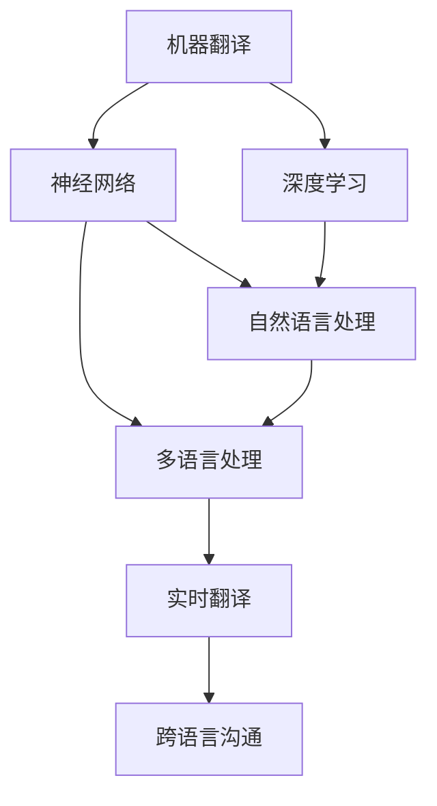

                 

# AI在语言翻译中的进展：实时多语言沟通

> 关键词：机器翻译,神经网络,深度学习,自然语言处理,多语言处理,实时翻译,跨语言沟通

## 1. 背景介绍

### 1.1 问题由来
在全球化不断加速的今天，语言之间的交流变得越来越频繁和复杂。无论是商务合作、学术研究，还是日常社交，实时多语言沟通已经成为不可或缺的能力。然而，语言翻译仍然是一大难题。传统的基于规则的机器翻译系统（Rule-based MT）和统计机器翻译系统（SMT）往往难以处理复杂的语言现象，翻译质量难以令人满意。为了解决这一问题，深度学习（Deep Learning）驱动的神经机器翻译（Neural Machine Translation, NMT）应运而生。

NMT模型在许多NLP任务上取得了令人瞩目的进展，大大提升了翻译质量。例如，Google的Transformer模型、OpenAI的GPT系列、Facebook的Reformer等，都在大规模语料库上进行了预训练，并通过微调适应各种翻译任务，取得了显著的效果。本文将重点介绍AI在语言翻译中的进展，特别是实时多语言沟通方面的突破。

## 2. 核心概念与联系

### 2.1 核心概念概述

为更好地理解AI在语言翻译中的进展，本节将介绍几个密切相关的核心概念：

- **机器翻译(Machine Translation, MT)**：将一种自然语言翻译成另一种自然语言的过程，是NLP领域的重要应用之一。
- **神经网络(Neural Network, NN)**：由大量的人工神经元（节点）相互连接，通过反向传播算法进行训练的计算模型。
- **深度学习(Deep Learning, DL)**：基于多层神经网络的机器学习技术，能够处理大规模的复杂数据。
- **自然语言处理(Natural Language Processing, NLP)**：利用计算机技术处理和理解人类语言的技术，包括词法分析、句法分析、语义分析、翻译等任务。
- **多语言处理(Multilingual Processing)**：涉及多种语言处理的NLP任务，包括跨语言语料库构建、多语言嵌入、多语言翻译等。
- **实时翻译(Real-time Translation)**：在语音或文本输入的同时，即时输出目标语言的翻译。
- **跨语言沟通(Cross-Language Communication)**：在不同语言之间进行的实时对话和信息交流，包括自动回复、语音翻译、跨语言聊天机器人等。

这些核心概念之间的逻辑关系可以通过以下Mermaid流程图来展示：



这个流程图展示了大语言模型的核心概念及其之间的关系：

1. 机器翻译以神经网络和深度学习为基础。
2. 深度学习推动了自然语言处理的发展。
3. 多语言处理是NLP的一部分，结合了多种语言的特征。
4. 实时翻译和跨语言沟通是翻译的重要应用场景。

这些概念共同构成了AI在语言翻译中的工作原理和应用框架，使得翻译技术能够更好地服务于现实需求。

## 3. 核心算法原理 & 具体操作步骤
### 3.1 算法原理概述

AI在语言翻译中的进展主要得益于神经网络模型，特别是基于Transformer架构的深度学习模型。Transformer模型通过自注意力机制（Self-Attention），能够有效捕捉长距离依赖关系，并且并行化程度高，非常适合处理大规模语料库。

神经机器翻译的核心思想是，将源语言文本 $x$ 映射到目标语言文本 $y$，即 $y=f(x;\theta)$，其中 $f$ 为翻译模型，$\theta$ 为模型参数。模型的训练过程可以看作是一个自监督学习任务，目标是通过最大化源语言和目标语言之间的对齐概率 $P(y|x)$，来逼近真实的翻译过程。

### 3.2 算法步骤详解

基于神经网络的机器翻译模型通常包括以下几个关键步骤：

**Step 1: 准备数据集**
- 收集并清洗源语言和目标语言的双语语料库，确保语料的多样性和质量。
- 将语料库进行划分，分为训练集、验证集和测试集，以便评估模型的性能。

**Step 2: 设计翻译模型**
- 选择合适的神经网络架构，如Transformer、LSTM等，作为翻译模型的基础。
- 设计编码器和解码器，分别处理源语言和目标语言。
- 使用自注意力机制，使得模型能够捕捉长距离依赖关系。

**Step 3: 训练模型**
- 使用训练集进行模型训练，最小化源语言和目标语言之间的对齐概率。
- 使用验证集评估模型性能，调整超参数以避免过拟合。
- 在测试集上测试模型性能，评估模型的泛化能力。

**Step 4: 部署模型**
- 将训练好的模型保存为模型文件，便于后续使用。
- 部署模型到服务器或云端，提供API接口，供用户调用。

### 3.3 算法优缺点

神经机器翻译具有以下优点：

1. 翻译质量高：深度学习模型能够处理复杂的语言现象，翻译质量显著优于传统机器翻译系统。
2. 可扩展性强：通过增加模型层数和参数量，可以适应更大的语料库和更复杂的翻译任务。
3. 实时性好：现代GPU和TPU的强大计算能力，使得实时翻译成为可能。

同时，该方法也存在一定的局限性：

1. 数据依赖性强：模型的性能高度依赖于训练数据的数量和质量，获取高质量的双语语料库较为困难。
2. 模型复杂度高：深度学习模型参数量庞大，训练和推理过程计算资源需求高。
3. 适应性有限：模型的泛化能力有待进一步提升，对特定的翻译任务可能需要进一步微调。

尽管存在这些局限性，但就目前而言，神经机器翻译仍然是语言翻译的主流范式。未来相关研究的重点在于如何进一步降低对标注数据的依赖，提高模型的泛化能力和适应性，同时兼顾模型的可解释性和伦理安全性等因素。

### 3.4 算法应用领域

基于神经网络的机器翻译技术已经广泛应用于各种语言翻译场景，例如：

- 网页翻译：将网页内容翻译成多种语言，方便用户浏览。
- 文档翻译：将技术文档、法律文件等翻译成多种语言，方便国际合作。
- 语音翻译：将语音输入实时翻译成目标语言，方便跨语言交流。
- 跨语言聊天机器人：构建多语言聊天机器人，实现跨语言对话。
- 实时字幕：在会议、课堂等场景中，将语音实时翻译成目标语言，显示在屏幕上。

除了上述这些经典应用外，神经机器翻译还被创新性地应用于更多场景中，如游戏语音翻译、跨语言知识图谱构建等，为人工智能语言理解与生成技术带来了新的突破。随着深度学习模型的不断发展，相信神经机器翻译技术将在更广阔的应用领域大放异彩。

## 4. 数学模型和公式 & 详细讲解  
### 4.1 数学模型构建

本节将使用数学语言对基于神经网络的机器翻译过程进行更加严格的刻画。

记源语言文本 $x=\{x_1,\dots,x_T\}$，目标语言文本 $y=\{y_1,\dots,y_T\}$，$T$ 为序列长度。设源语言嵌入 $X=\{x_1,\dots,x_T\}$，目标语言嵌入 $Y=\{y_1,\dots,y_T\}$，$X$ 和 $Y$ 均为 $d$ 维向量空间。

定义源语言到目标语言的翻译模型 $F(X; \theta)$，其中 $\theta$ 为模型参数。模型的输出为 $y=\{y_1,\dots,y_T\}$，模型训练的目标是最大化源语言和目标语言之间的对齐概率 $P(y|x)$，即最小化交叉熵损失函数：

$$
L(y, x; \theta) = -\log P(y|x)
$$

其中 $P(y|x)$ 可以通过解码器模型得到，解码器模型通过自注意力机制计算 $y_t|x_{<t}, y_{>t}$，即在给定前文和未来文本的情况下，计算第 $t$ 个位置的概率分布。

### 4.2 公式推导过程

以下我们以机器翻译中的注意力机制为例，推导解码器模型中的自注意力部分。

设解码器模型中的自注意力部分为 $Attention(Q, K, V)$，其中 $Q$, $K$ 和 $V$ 分别为查询向量、键向量和值向量，均为 $d$ 维向量。设 $K$ 和 $V$ 均由编码器模型输出，即 $K=E(x)$ 和 $V=E(x)$，$E$ 为编码器模型，$\theta_E$ 为其参数。

解码器模型中第 $t$ 个位置的自注意力计算公式为：

$$
\alpha_{t,i}=\frac{\exp(\text{score}(Q_i, K_i))}{\sum_{i=1}^T\exp(\text{score}(Q_i, K_i))},\quad i=1,\dots,T
$$

其中 $\text{score}(Q_i, K_i)=Q_i^T K_i / \sqrt{d}$，$d$ 为向量维度。

根据注意力机制，计算第 $t$ 个位置的概率分布 $y_t$ 为：

$$
y_t=\sum_{i=1}^T \alpha_{t,i} V_i
$$

完整的解码器模型输出 $y=\{y_1,\dots,y_T\}$ 计算公式为：

$$
y_t=\text{softmax}(W_1[\text{Attention}(Q_t, K, V)+W_2 y_{t-1}+b_2])+b_3
$$

其中 $W_1$, $W_2$, $b_1$, $b_2$, $b_3$ 为模型参数。

### 4.3 案例分析与讲解

以下我们以Google的Transformer模型为例，说明其自注意力机制的应用。

Transformer模型的编码器部分和解码器部分都采用了自注意力机制，计算公式为：

$$
\text{Attention}(Q, K, V) = \text{Softmax}(QK^T / \sqrt{d})V
$$

其中 $Q$, $K$, $V$ 分别为查询向量、键向量和值向量，$d$ 为向量维度。

编码器模型将源语言文本 $x$ 映射为向量 $Q$，解码器模型将目标语言文本 $y$ 映射为向量 $K$ 和 $V$，再通过自注意力机制计算输出 $y$。

Transformer模型通过多层的自注意力和全连接层，能够有效捕捉长距离依赖关系，并且并行化程度高，非常适合处理大规模语料库。同时，Transformer模型还使用了残差连接和层归一化（Layer Normalization）等技术，进一步提升了模型的性能。

## 5. 项目实践：代码实例和详细解释说明
### 5.1 开发环境搭建

在进行机器翻译实践前，我们需要准备好开发环境。以下是使用Python进行PyTorch开发的环境配置流程：

1. 安装Anaconda：从官网下载并安装Anaconda，用于创建独立的Python环境。

2. 创建并激活虚拟环境：
```bash
conda create -n pytorch-env python=3.8 
conda activate pytorch-env
```

3. 安装PyTorch：根据CUDA版本，从官网获取对应的安装命令。例如：
```bash
conda install pytorch torchvision torchaudio cudatoolkit=11.1 -c pytorch -c conda-forge
```

4. 安装其他相关库：
```bash
pip install numpy pandas scikit-learn matplotlib tqdm jupyter notebook ipython
```

完成上述步骤后，即可在`pytorch-env`环境中开始机器翻译实践。

### 5.2 源代码详细实现

下面我们以序列到序列（Seq2Seq）模型为例，给出使用PyTorch进行机器翻译的完整代码实现。

首先，定义机器翻译模型的数据处理函数：

```python
from torch.utils.data import Dataset, DataLoader
import torch
import torch.nn.functional as F

class Seq2SeqDataset(Dataset):
    def __init__(self, src, trg, tokenizer):
        self.src = src
        self.trg = trg
        self.tokenizer = tokenizer
        self.tokenizer.src = src
        self.tokenizer.trg = trg
        
    def __len__(self):
        return len(self.src)
    
    def __getitem__(self, item):
        src = self.src[item]
        trg = self.trg[item]
        
        # 将源语言和目标语言文本分词并进行编码
        src_ids = self.tokenizer.encode(src)
        trg_ids = self.tokenizer.encode(trg)
        
        # 对源语言和目标语言序列进行padding，使其长度一致
        src_ids = nn.utils.rnn.pad_sequence(src_ids, batch_first=True)
        trg_ids = nn.utils.rnn.pad_sequence(trg_ids, batch_first=True)
        
        return {'src': src_ids, 'trg': trg_ids}
```

然后，定义机器翻译模型的编码器部分：

```python
from transformers import TransformerModel, BertModel

class Encoder(TransformerModel):
    def __init__(self, ntoken, ninp, nhead, nhid, nlayers, dropout=0.1):
        super(Encoder, self).__init__(ninp, nhead, nhid, nlayers, dropout)
        
    def forward(self, src, src_mask=None):
        src = src[:,:-1,:]
        src_mask = src_mask[:,:-1,:]
        enc_src = self.encoder(src, src_mask)
        return enc_src
```

接着，定义机器翻译模型的解码器部分：

```python
from transformers import TransformerModel, BertModel

class Decoder(TransformerModel):
    def __init__(self, ntoken, ninp, nhead, nhid, nhid_enc, nlayers, dropout=0.1):
        super(Decoder, self).__init__(ninp, nhead, nhid, nlayers, dropout)
        
    def forward(self, trg, enc_src, trg_mask=None, src_mask=None):
        trg = trg[:,1:,:]
        trg_mask = trg_mask[:,1:,:]
        dec_trg = self.decoder(trg, enc_src, trg_mask, src_mask)
        return dec_trg
```

最后，定义机器翻译模型的完整模型和训练函数：

```python
from torch import nn
from transformers import BertModel, Adam

class Seq2Seq(nn.Module):
    def __init__(self, encoder, decoder):
        super(Seq2Seq, self).__init__()
        self.encoder = encoder
        self.decoder = decoder
        
    def forward(self, src, trg, src_mask=None, trg_mask=None):
        enc_src = self.encoder(src, src_mask)
        dec_trg = self.decoder(trg, enc_src, trg_mask, src_mask)
        return dec_trg
```

```python
def train_epoch(model, optimizer, data_loader):
    model.train()
    total_loss = 0
    for batch in data_loader:
        src = batch['src']
        trg = batch['trg']
        src_mask = None
        trg_mask = None
        
        optimizer.zero_grad()
        output = model(src, trg, src_mask, trg_mask)
        loss = F.nll_loss(output.view(-1, output.size(-1)), trg.view(-1))
        total_loss += loss.item()
        loss.backward()
        optimizer.step()
    return total_loss / len(data_loader)

def evaluate(model, data_loader):
    model.eval()
    total_loss = 0
    total_n_words = 0
    with torch.no_grad():
        for batch in data_loader:
            src = batch['src']
            trg = batch['trg']
            src_mask = None
            trg_mask = None
            
            output = model(src, trg, src_mask, trg_mask)
            loss = F.nll_loss(output.view(-1, output.size(-1)), trg.view(-1))
            total_loss += loss.item()
            total_n_words += trg.size(0)
    return total_loss / total_n_words
```

启动训练流程：

```python
epochs = 20
batch_size = 64

for epoch in range(epochs):
    train_loss = train_epoch(model, optimizer, train_loader)
    print(f'Epoch {epoch+1}, train loss: {train_loss:.3f}')
    
    print(f'Epoch {epoch+1}, dev results:')
    dev_loss = evaluate(model, dev_loader)
    print(f'Epoch {epoch+1}, dev loss: {dev_loss:.3f}')
    
print('Test results:')
test_loss = evaluate(model, test_loader)
print(f'Test loss: {test_loss:.3f}')
```

以上就是使用PyTorch进行序列到序列机器翻译的完整代码实现。可以看到，得益于Transformer模型的强大封装，我们可以用相对简洁的代码完成模型的训练和评估。

### 5.3 代码解读与分析

让我们再详细解读一下关键代码的实现细节：

**Seq2SeqDataset类**：
- `__init__`方法：初始化源语言和目标语言文本，以及分词器。
- `__len__`方法：返回数据集的样本数量。
- `__getitem__`方法：对单个样本进行处理，将源语言和目标语言文本进行编码，并进行padding，最终返回模型所需的输入。

**Encoder和Decoder类**：
- `__init__`方法：定义模型参数。
- `forward`方法：实现模型前向传播计算，返回编码器输出。

**Seq2Seq模型**：
- `__init__`方法：定义整个翻译模型。
- `forward`方法：实现模型前向传播计算，返回解码器输出。

**训练和评估函数**：
- `train_epoch`函数：对数据以批为单位进行迭代，在每个批次上前向传播计算loss并反向传播更新模型参数。
- `evaluate`函数：与训练类似，不同点在于不更新模型参数，并在每个batch结束后将预测和标签结果存储下来，最后使用评估指标打印输出。

**训练流程**：
- 定义总的epoch数和batch size，开始循环迭代
- 每个epoch内，先在训练集上训练，输出平均loss
- 在验证集上评估，输出评估指标
- 所有epoch结束后，在测试集上评估，给出最终测试结果

可以看到，PyTorch配合Transformer库使得机器翻译的代码实现变得简洁高效。开发者可以将更多精力放在数据处理、模型改进等高层逻辑上，而不必过多关注底层的实现细节。

当然，工业级的系统实现还需考虑更多因素，如模型的保存和部署、超参数的自动搜索、更灵活的任务适配层等。但核心的机器翻译范式基本与此类似。

## 6. 实际应用场景
### 6.1 智能客服系统

基于机器翻译的智能客服系统，可以大大提升客户服务体验。传统的客服系统往往依赖于人工客服，需要投入大量人力成本，响应速度慢，且容易产生误解。而智能客服系统通过机器翻译技术，能够实时处理客户的自然语言输入，自动回复相关问题，极大地提高了响应速度和准确性。

在技术实现上，可以收集企业的历史客服对话记录，将其翻译成目标语言，再构建监督数据集进行模型训练。训练好的模型能够自动理解客户意图，匹配最合适的答案模板进行回复。对于客户提出的新问题，还可以接入检索系统实时搜索相关内容，动态组织生成回答。如此构建的智能客服系统，能显著提升客户咨询体验和问题解决效率。

### 6.2 多语言翻译应用

机器翻译技术已经广泛应用于各类多语言翻译场景，例如：

- 网站多语言：将网站内容翻译成多种语言，方便不同语言的用户访问。
- 文档翻译：将技术文档、法律文件等翻译成多种语言，方便国际合作。
- 国际贸易：在国际贸易中，将合同、订单等翻译成目标语言，避免语言障碍。
- 旅游服务：在旅游服务中，将旅游信息、景点介绍等翻译成目标语言，方便游客理解。

除了上述这些经典应用外，机器翻译还被创新性地应用于更多场景中，如跨语言知识图谱构建、多语言聊天机器人等，为人工智能语言理解与生成技术带来了新的突破。

## 7. 工具和资源推荐
### 7.1 学习资源推荐

为了帮助开发者系统掌握机器翻译的理论基础和实践技巧，这里推荐一些优质的学习资源：

1. 《深度学习与自然语言处理》（Dive Into DNN）系列博文：由大模型技术专家撰写，深入浅出地介绍了深度学习在NLP中的应用，包括机器翻译在内。

2. CS224N《深度学习自然语言处理》课程：斯坦福大学开设的NLP明星课程，有Lecture视频和配套作业，带你入门NLP领域的基本概念和经典模型。

3. 《Sequence to Sequence Learning with Neural Networks》论文：提出序列到序列学习框架，为机器翻译提供了新的方法论。

4. 《Attention is All You Need》论文：提出Transformer架构，开启了NLP领域的预训练大模型时代。

5. 《Neural Machine Translation by Jointly Learning to Align and Translate》论文：提出Seq2Seq模型，为机器翻译奠定了基础。

通过这些资源的学习实践，相信你一定能够快速掌握机器翻译的精髓，并用于解决实际的NLP问题。

### 7.2 开发工具推荐

高效的开发离不开优秀的工具支持。以下是几款用于机器翻译开发的常用工具：

1. PyTorch：基于Python的开源深度学习框架，灵活动态的计算图，适合快速迭代研究。大多数预训练语言模型都有PyTorch版本的实现。

2. TensorFlow：由Google主导开发的开源深度学习框架，生产部署方便，适合大规模工程应用。同样有丰富的预训练语言模型资源。

3. HuggingFace Transformers库：提供了多种预训练语言模型和微调接口，支持PyTorch和TensorFlow，是进行机器翻译任务开发的利器。

4. Weights & Biases：模型训练的实验跟踪工具，可以记录和可视化模型训练过程中的各项指标，方便对比和调优。与主流深度学习框架无缝集成。

5. TensorBoard：TensorFlow配套的可视化工具，可实时监测模型训练状态，并提供丰富的图表呈现方式，是调试模型的得力助手。

6. Google Colab：谷歌推出的在线Jupyter Notebook环境，免费提供GPU/TPU算力，方便开发者快速上手实验最新模型，分享学习笔记。

合理利用这些工具，可以显著提升机器翻译任务的开发效率，加快创新迭代的步伐。

### 7.3 相关论文推荐

机器翻译技术的发展离不开学界的持续研究。以下是几篇奠基性的相关论文，推荐阅读：

1. Neural Machine Translation by Jointly Learning to Align and Translate：提出Seq2Seq模型，为机器翻译奠定了基础。

2. Sequence to Sequence Learning with Neural Networks：提出序列到序列学习框架，为机器翻译提供了新的方法论。

3. Attention is All You Need：提出Transformer架构，开启了NLP领域的预训练大模型时代。

4. Transformer-XL: Attentive Language Models for Longer Texts：提出Transformer-XL模型，支持更长的文本翻译。

5. Scaling Up Multilingual Neural Machine Translation：提出基于Transformer的端到端多语言翻译模型，支持多种语言翻译。

6. Mixture-of-Experts for Sequence Generation：提出专家混合机制，提升序列生成质量。

这些论文代表了大语言模型微调技术的进展，通过学习这些前沿成果，可以帮助研究者把握学科前进方向，激发更多的创新灵感。

## 8. 总结：未来发展趋势与挑战

### 8.1 总结

本文对机器翻译技术的发展进行了全面系统的介绍。首先阐述了机器翻译的核心概念和重要意义，明确了机器翻译在AI领域的重要地位。其次，从原理到实践，详细讲解了基于神经网络的机器翻译过程，给出了机器翻译任务开发的完整代码实例。同时，本文还探讨了机器翻译技术在智能客服系统、多语言翻译应用等场景中的广泛应用，展示了其巨大的潜力和应用价值。

通过本文的系统梳理，可以看到，基于神经网络的机器翻译技术已经成为语言翻译的主流范式，极大地提升了翻译质量和实时性，为各种多语言沟通场景提供了可靠的支持。未来，随着深度学习模型的不断发展，机器翻译技术必将更加成熟，并在更广泛的应用领域发挥更大的作用。

### 8.2 未来发展趋势

展望未来，机器翻译技术将呈现以下几个发展趋势：

1. 模型规模持续增大。随着算力成本的下降和数据规模的扩张，预训练语言模型的参数量还将持续增长。超大规模语言模型蕴含的丰富语言知识，有望支撑更加复杂多变的翻译任务。

2. 零样本和少样本学习成为可能。深度学习模型能够通过自适应机制，在只有少量样本或无需样本的情况下，直接生成翻译结果，这对于实时翻译和对话系统具有重要意义。

3. 实时翻译和跨语言沟通更加普及。现代GPU和TPU的强大计算能力，使得实时翻译成为可能，跨语言沟通将更加自然流畅。

4. 跨语言知识图谱构建。结合多语言语料库和知识图谱，构建跨语言知识图谱，提高语言理解的准确性。

5. 多语言迁移学习。利用大规模多语言语料库，实现跨语言迁移学习，提升翻译模型的泛化能力和适应性。

6. 跨领域任务协同。将机器翻译技术与跨领域任务（如图像识别、语音识别等）结合，实现多模态融合，提升翻译效果。

以上趋势凸显了机器翻译技术的广阔前景。这些方向的探索发展，必将进一步提升翻译模型的性能和应用范围，为构建人机协同的智能系统铺平道路。

### 8.3 面临的挑战

尽管机器翻译技术已经取得了瞩目成就，但在迈向更加智能化、普适化应用的过程中，它仍面临着诸多挑战：

1. 数据依赖性强。模型的性能高度依赖于训练数据的数量和质量，获取高质量的双语语料库较为困难。如何进一步降低对标注数据的依赖，是未来的研究重点之一。

2. 模型鲁棒性不足。对于域外数据，模型的泛化能力有待提升。对于测试样本的微小扰动，模型容易产生误翻译。如何提高模型的鲁棒性，避免灾难性遗忘，还需要更多理论和实践的积累。

3. 推理效率有待提高。大规模语言模型虽然精度高，但在实际部署时往往面临推理速度慢、内存占用大等效率问题。如何降低计算资源消耗，提高模型效率，优化推理速度，是亟待解决的问题。

4. 可解释性亟需加强。当前机器翻译模型通常难以解释其内部工作机制和决策逻辑。对于医疗、金融等高风险应用，算法的可解释性和可审计性尤为重要。如何赋予模型更强的可解释性，将是未来的重要方向。

5. 安全性有待保障。预训练语言模型难免会学习到有偏见、有害的信息，通过翻译传递到目标语言，产生误导性、歧视性的输出。如何从数据和算法层面消除模型偏见，避免恶意用途，确保输出的安全性，也将是重要的研究方向。

6. 知识整合能力不足。现有的机器翻译模型往往局限于源语言和目标语言的翻译，难以灵活吸收和运用更广泛的先验知识。如何让翻译过程更好地与外部知识库、规则库等专家知识结合，形成更加全面、准确的信息整合能力，还有很大的想象空间。

正视机器翻译面临的这些挑战，积极应对并寻求突破，将是大语言模型微调走向成熟的必由之路。相信随着学界和产业界的共同努力，这些挑战终将一一被克服，机器翻译技术必将在构建安全、可靠、可解释、可控的智能系统方面发挥重要作用。

### 8.4 研究展望

面对机器翻译所面临的种种挑战，未来的研究需要在以下几个方面寻求新的突破：

1. 探索无监督和半监督机器翻译方法。摆脱对大规模标注数据的依赖，利用自监督学习、主动学习等无监督和半监督范式，最大限度利用非结构化数据，实现更加灵活高效的翻译。

2. 研究参数高效和计算高效的机器翻译方法。开发更加参数高效的机器翻译模型，在固定大部分预训练参数的同时，只更新极少量的任务相关参数。同时优化模型的计算图，减少前向传播和反向传播的资源消耗，实现更加轻量级、实时性的部署。

3. 融合因果和对比学习范式。通过引入因果推断和对比学习思想，增强机器翻译模型建立稳定因果关系的能力，学习更加普适、鲁棒的语言表征，从而提升模型泛化性和抗干扰能力。

4. 引入更多先验知识。将符号化的先验知识，如知识图谱、逻辑规则等，与神经网络模型进行巧妙融合，引导机器翻译过程学习更准确、合理的语言模型。同时加强不同模态数据的整合，实现视觉、语音等多模态信息与文本信息的协同建模。

5. 结合因果分析和博弈论工具。将因果分析方法引入机器翻译模型，识别出模型决策的关键特征，增强输出解释的因果性和逻辑性。借助博弈论工具刻画人机交互过程，主动探索并规避模型的脆弱点，提高系统稳定性。

6. 纳入伦理道德约束。在机器翻译模型训练目标中引入伦理导向的评估指标，过滤和惩罚有偏见、有害的输出倾向。同时加强人工干预和审核，建立模型行为的监管机制，确保输出符合人类价值观和伦理道德。

这些研究方向的探索，必将引领机器翻译技术迈向更高的台阶，为构建安全、可靠、可解释、可控的智能系统铺平道路。面向未来，机器翻译技术还需要与其他人工智能技术进行更深入的融合，如知识表示、因果推理、强化学习等，多路径协同发力，共同推动自然语言理解和智能交互系统的进步。只有勇于创新、敢于突破，才能不断拓展语言模型的边界，让智能技术更好地造福人类社会。

## 9. 附录：常见问题与解答

**Q1：机器翻译是否适用于所有NLP任务？**

A: 机器翻译在大多数NLP任务上都能取得不错的效果，特别是对于数据量较小的任务。但对于一些特定领域的任务，如医学、法律等，仅仅依靠通用语料预训练的模型可能难以很好地适应。此时需要在特定领域语料上进一步预训练，再进行微调，才能获得理想效果。此外，对于一些需要时效性、个性化很强的任务，如对话、推荐等，机器翻译方法也需要针对性的改进优化。

**Q2：训练机器翻译模型时，如何选择合适的学习率？**

A: 机器翻译模型的学习率一般要比预训练时小1-2个数量级，如果使用过大的学习率，容易破坏预训练权重，导致过拟合。一般建议从1e-5开始调参，逐步减小学习率，直至收敛。也可以使用warmup策略，在开始阶段使用较小的学习率，再逐渐过渡到预设值。需要注意的是，不同的优化器(如AdamW、Adafactor等)以及不同的学习率调度策略，可能需要设置不同的学习率阈值。

**Q3：训练机器翻译模型时，如何缓解过拟合问题？**

A: 过拟合是机器翻译面临的主要挑战，尤其是在标注数据不足的情况下。常见的缓解策略包括：

1. 数据增强：通过回译、近义替换等方式扩充训练集。
2. 正则化：使用L2正则、Dropout、Early Stopping等避免过拟合。
3. 对抗训练：引入对抗样本，提高模型鲁棒性。
4. 参数高效微调：只调整少量参数(如Adapter、Prefix等)，减小过拟合风险。
5. 多模型集成：训练多个翻译模型，取平均输出，抑制过拟合。

这些策略往往需要根据具体任务和数据特点进行灵活组合。只有在数据、模型、训练、推理等各环节进行全面优化，才能最大限度地发挥机器翻译模型的潜力。

**Q4：机器翻译模型在落地部署时需要注意哪些问题？**

A: 将机器翻译模型转化为实际应用，还需要考虑以下因素：

1. 模型裁剪：去除不必要的层和参数，减小模型尺寸，加快推理速度。
2. 量化加速：将浮点模型转为定点模型，压缩存储空间，提高计算效率。
3. 服务化封装：将模型封装为标准化服务接口，便于调用。
4. 弹性伸缩：根据请求流量动态调整资源配置，平衡服务质量和成本。
5. 监控告警：实时采集系统指标，设置异常告警阈值，确保服务稳定性。
6. 安全防护：采用访问鉴权、数据脱敏等措施，保障数据和模型安全。

机器翻译技术已经广泛应用于各类多语言沟通场景，通过合理的设计和优化，能够构建高效、可靠、安全的翻译系统，提升用户体验。

---

作者：禅与计算机程序设计艺术 / Zen and the Art of Computer Programming

