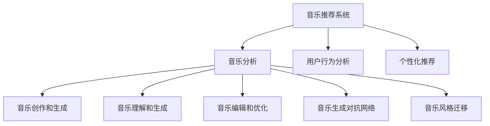

                 

## 1. 背景介绍

### 1.1 问题由来

在数字音乐时代，海量的歌曲和乐曲背后隐藏着巨大的创作潜力。人工智能技术，特别是深度学习和自然语言处理（NLP），为音乐创作和推荐开辟了新的天地。传统的音乐创作依赖于人类艺术家的主观想象和灵感，而人工智能的崛起，则让机器在某种程度上接管了音乐的创作和生成。

近年来，随着机器学习和大数据分析技术的发展，人工智能在音乐创作和推荐中的作用愈加明显。许多公司如Spotify、Apple Music、Amazon Music等纷纷利用AI技术为用户提供个性化的音乐推荐，同时也有一部分音乐创作人使用AI工具进行创作和演奏。这种趋势不仅提升了用户体验，也推动了音乐产业的创新和变革。

### 1.2 问题核心关键点

人工智能在音乐创作和推荐中的应用主要集中在以下几个方面：

1. **音乐推荐系统**：通过分析用户的历史听歌记录和偏好，为用户推荐最符合其口味的歌曲。
2. **音乐创作和生成**：利用AI生成新的歌曲、乐曲，甚至创作完整的作品。
3. **音乐分析和编辑**：使用AI分析音乐的节奏、旋律、和声等特征，辅助音乐编辑和优化。
4. **音乐理解和生成**：通过深度学习模型理解音乐背后的情感、风格，生成新的音乐作品。

这些技术不仅推动了音乐创作的民主化，也为个性化音乐推荐提供了新的解决方案。未来，随着技术的不断进步，AI在音乐领域的应用将更加广泛和深入。

### 1.3 问题研究意义

1. **降低创作门槛**：AI工具可以辅助音乐创作，尤其是对于初学者和音乐创作爱好者，降低了创作门槛，提高了创作效率。
2. **个性化推荐**：通过AI分析用户偏好，提供个性化音乐推荐，提升用户体验和满意度。
3. **创新驱动**：AI的介入激发了新的创作模式和风格，推动了音乐产业的创新和发展。
4. **优化编辑和分析**：AI辅助的音乐编辑和分析工具可以提高创作和制作的专业水平，优化音乐质量。

## 2. 核心概念与联系

### 2.1 核心概念概述

为了更好地理解AI在音乐创作和推荐中的革新，我们首先介绍一些核心概念：

1. **音乐推荐系统(Music Recommendation System)**：利用AI分析用户听歌记录和偏好，推荐相似的音乐作品。
2. **音乐创作和生成(Music Creation and Generation)**：使用AI生成新的音乐作品，包括歌曲、乐曲等。
3. **音乐理解和生成(Music Understanding and Generation)**：通过深度学习模型理解音乐情感和风格，生成新的音乐作品。
4. **音乐编辑和优化(Music Editing and Optimization)**：使用AI分析音乐特征，辅助音乐编辑和优化，提升音乐质量。
5. **音乐生成对抗网络(Music Generative Adversarial Network, MGAN)**：使用GAN框架生成音乐作品，提升音乐创作的多样性和创意性。
6. **音乐风格迁移(Music Style Transfer)**：使用风格迁移技术将音乐作品转换为特定风格，如古典风格、电子风格等。

### 2.2 核心概念原理和架构的 Mermaid 流程图

以下是这些核心概念的 Mermaid 流程图：



此图展示了核心概念之间的联系：音乐推荐系统通过分析用户行为来提供个性化推荐；音乐创作和生成通过理解音乐风格和生成新的音乐作品；音乐理解和生成利用深度学习模型分析音乐特征，生成新的作品；音乐编辑和优化则利用AI分析音乐特征，提升音乐质量；音乐生成对抗网络和音乐风格迁移进一步提升了音乐创作的多样性和创意性。

## 3. 核心算法原理 & 具体操作步骤

### 3.1 算法原理概述

AI在音乐创作和推荐中的核心算法原理主要基于机器学习、深度学习、自然语言处理和生成对抗网络（GAN）等技术。具体来说，音乐推荐系统主要利用协同过滤、矩阵分解、神经网络等技术，而音乐创作和生成则依赖于生成对抗网络（GAN）、变分自编码器（VAE）等生成模型，音乐理解和生成则利用深度学习模型如卷积神经网络（CNN）、循环神经网络（RNN）等。

### 3.2 算法步骤详解

#### 3.2.1 音乐推荐系统

**步骤1: 数据收集与预处理**

- 收集用户的历史听歌记录和音乐作品数据，包括歌曲名称、艺术家、风格等。
- 对数据进行清洗和预处理，去除噪音和异常值。

**步骤2: 特征提取**

- 使用TF-IDF、PCA等技术提取用户行为特征。
- 提取音乐作品特征，如节奏、旋律、和声等。

**步骤3: 相似度计算**

- 使用余弦相似度、欧式距离等方法计算用户与音乐作品之间的相似度。
- 构建用户-音乐作品矩阵。

**步骤4: 推荐算法**

- 使用协同过滤算法，如基于用户的协同过滤、基于项目的协同过滤等。
- 使用矩阵分解算法，如奇异值分解（SVD）等。
- 使用深度学习算法，如CNN、RNN等。

**步骤5: 结果输出**

- 根据相似度计算结果，为用户推荐相似的音乐作品。
- 利用自然语言处理技术，生成推荐语。

#### 3.2.2 音乐创作和生成

**步骤1: 数据收集**

- 收集大量的音乐作品和相关数据，包括MIDI文件、音频文件、歌词等。
- 提取音乐作品的节奏、旋律、和声等特征。

**步骤2: 模型构建**

- 使用GAN模型，如DCGAN、WGAN等。
- 使用VAE模型，如变分自编码器。

**步骤3: 训练模型**

- 使用生成的音乐样本训练模型。
- 通过对抗样本训练模型，提升生成质量。

**步骤4: 生成音乐**

- 输入创作主题和风格，使用训练好的模型生成音乐作品。
- 对生成的音乐进行后处理，如音高校正、节奏优化等。

#### 3.2.3 音乐理解和生成

**步骤1: 数据收集**

- 收集大量的音乐作品和相关数据，包括MIDI文件、音频文件、歌词等。
- 提取音乐作品的节奏、旋律、和声等特征。

**步骤2: 模型构建**

- 使用深度学习模型，如CNN、RNN等。
- 使用Transformer模型，如BERT、T5等。

**步骤3: 训练模型**

- 使用音乐作品的特征数据训练模型。
- 利用预训练模型，如BertMusic等。

**步骤4: 生成音乐**

- 输入音乐作品，使用训练好的模型理解音乐情感和风格。
- 生成新的音乐作品。

#### 3.2.4 音乐编辑和优化

**步骤1: 数据收集**

- 收集音乐作品的特征数据，如节奏、旋律、和声等。
- 收集音乐作品的元数据，如歌曲名称、艺术家、风格等。

**步骤2: 特征提取**

- 使用TF-IDF、PCA等技术提取音乐特征。
- 提取音乐作品元数据特征。

**步骤3: 编辑优化**

- 使用机器学习算法，如回归模型、分类模型等。
- 使用深度学习算法，如CNN、RNN等。

**步骤4: 结果输出**

- 对音乐作品进行优化，提升音乐质量。
- 输出优化后的音乐作品。

### 3.3 算法优缺点

#### 3.3.1 音乐推荐系统

**优点：**
- 能够根据用户的历史听歌记录和偏好提供个性化推荐。
- 能够处理海量数据，提供实时推荐。

**缺点：**
- 需要大量的用户数据，收集和处理成本较高。
- 推荐效果受用户数据质量的影响较大。

#### 3.3.2 音乐创作和生成

**优点：**
- 能够生成多样化的音乐作品，激发创作灵感。
- 能够处理复杂的音乐特征，生成高质量的音乐作品。

**缺点：**
- 生成的音乐作品可能缺乏原创性，容易与已有作品重复。
- 生成模型需要大量的训练数据，且训练过程复杂。

#### 3.3.3 音乐理解和生成

**优点：**
- 能够理解音乐情感和风格，生成新的音乐作品。
- 能够处理复杂的音乐特征，生成高质量的音乐作品。

**缺点：**
- 生成的音乐作品可能缺乏原创性，容易与已有作品重复。
- 理解模型的训练过程复杂，需要大量的标注数据。

#### 3.3.4 音乐编辑和优化

**优点：**
- 能够提升音乐作品的质量，优化音乐效果。
- 能够处理音乐作品的复杂特征，提升音乐创作效率。

**缺点：**
- 优化效果受模型选择和参数设置的影响较大。
- 优化过程需要大量的时间，效率较低。

### 3.4 算法应用领域

1. **在线音乐平台**：如Spotify、Apple Music、Amazon Music等，通过AI技术提供个性化音乐推荐，提升用户体验。
2. **音乐制作和创作**：音乐制作公司使用AI生成新的音乐作品，辅助创作和制作。
3. **音乐教育和培训**：使用AI工具辅助音乐教育，提供音乐理论和创作指导。
4. **音乐分析和编辑**：音乐编辑和制作人使用AI工具进行音乐分析和优化，提升音乐作品的质量。
5. **音乐风格迁移**：通过风格迁移技术将音乐作品转换为特定风格，如古典风格、电子风格等。

## 4. 数学模型和公式 & 详细讲解 & 举例说明

### 4.1 数学模型构建

音乐推荐系统通常使用协同过滤、矩阵分解和深度学习模型等技术。这里我们以协同过滤算法为例，介绍其数学模型构建。

**协同过滤算法**：

1. **用户-物品矩阵**：
   - 用户行为表示为向量 $\mathbf{u} \in \mathbb{R}^n$，其中 $n$ 为用户数量。
   - 物品特征表示为向量 $\mathbf{i} \in \mathbb{R}^m$，其中 $m$ 为物品数量。
   - 用户与物品之间的相似度表示为矩阵 $\mathbf{U} \in \mathbb{R}^{n \times m}$，其中 $\mathbf{U}_{ij} = u_i \cdot i_j$。

2. **用户评分预测**：
   - 使用协同过滤算法，对用户未评分的物品进行预测。
   - 使用矩阵分解算法，如奇异值分解（SVD），对用户-物品矩阵进行分解。

   $$
   \mathbf{U} = \mathbf{W} \cdot \mathbf{V}^T
   $$

   其中 $\mathbf{W} \in \mathbb{R}^{n \times k}$，$\mathbf{V} \in \mathbb{R}^{m \times k}$，$k$ 为分解后的矩阵维度。

3. **评分预测公式**：
   - 对用户 $u$ 对物品 $i$ 的评分进行预测：
   $$
   \hat{r}_{ui} = \mathbf{u}^T \cdot \mathbf{w}_i
   $$

   其中 $\mathbf{w}_i$ 为物品 $i$ 对应的向量。

4. **推荐结果生成**：
   - 根据预测评分，对用户未评分的物品进行排序，生成推荐结果。

### 4.2 公式推导过程

**协同过滤算法推导**：

1. **用户-物品矩阵表示**：
   - 用户行为表示为向量 $\mathbf{u} \in \mathbb{R}^n$，物品特征表示为向量 $\mathbf{i} \in \mathbb{R}^m$。
   - 用户与物品之间的相似度表示为矩阵 $\mathbf{U} \in \mathbb{R}^{n \times m}$，其中 $\mathbf{U}_{ij} = u_i \cdot i_j$。

2. **矩阵分解**：
   - 对用户-物品矩阵进行奇异值分解，得到分解后的矩阵 $\mathbf{U} = \mathbf{W} \cdot \mathbf{V}^T$，其中 $\mathbf{W} \in \mathbb{R}^{n \times k}$，$\mathbf{V} \in \mathbb{R}^{m \times k}$，$k$ 为分解后的矩阵维度。

3. **评分预测公式**：
   - 对用户 $u$ 对物品 $i$ 的评分进行预测：
   $$
   \hat{r}_{ui} = \mathbf{u}^T \cdot \mathbf{w}_i = \mathbf{u}^T \cdot (\mathbf{V} \cdot \mathbf{v}_i) = \mathbf{u}^T \cdot \mathbf{v}_i
   $$

   其中 $\mathbf{w}_i = \mathbf{v}_i$。

4. **推荐结果生成**：
   - 根据预测评分，对用户未评分的物品进行排序，生成推荐结果。

### 4.3 案例分析与讲解

**案例分析：**

1. **数据收集与预处理**：
   - 收集用户的历史听歌记录和音乐作品数据，包括歌曲名称、艺术家、风格等。
   - 对数据进行清洗和预处理，去除噪音和异常值。

2. **特征提取**：
   - 使用TF-IDF、PCA等技术提取用户行为特征。
   - 提取音乐作品特征，如节奏、旋律、和声等。

3. **相似度计算**：
   - 使用余弦相似度、欧式距离等方法计算用户与音乐作品之间的相似度。
   - 构建用户-音乐作品矩阵。

4. **推荐算法**：
   - 使用协同过滤算法，如基于用户的协同过滤、基于项目的协同过滤等。
   - 使用矩阵分解算法，如奇异值分解（SVD）等。
   - 使用深度学习算法，如CNN、RNN等。

5. **结果输出**：
   - 根据相似度计算结果，为用户推荐相似的音乐作品。
   - 利用自然语言处理技术，生成推荐语。

## 5. 项目实践：代码实例和详细解释说明

### 5.1 开发环境搭建

1. 安装Anaconda：从官网下载并安装Anaconda，用于创建独立的Python环境。

2. 创建并激活虚拟环境：
   ```bash
   conda create -n pytorch-env python=3.8 
   conda activate pytorch-env
   ```

3. 安装PyTorch：根据CUDA版本，从官网获取对应的安装命令。例如：
   ```bash
   conda install pytorch torchvision torchaudio cudatoolkit=11.1 -c pytorch -c conda-forge
   ```

4. 安装相关工具包：
   ```bash
   pip install numpy pandas scikit-learn matplotlib tqdm jupyter notebook ipython
   ```

完成上述步骤后，即可在`pytorch-env`环境中开始实践。

### 5.2 源代码详细实现

**协同过滤算法代码实现**：

```python
import numpy as np
from scipy.sparse import csr_matrix

# 用户-物品矩阵
users = np.array([1, 2, 3, 4, 5])
items = np.array([1, 2, 3, 4, 5])
ratings = np.array([5, 4, 5, 3, 4, 5, 3, 5, 4, 3, 4, 4, 5, 5, 4, 5, 3, 5, 3, 4, 5, 4, 5, 4, 5, 4, 5, 3, 4, 5])
matrix = csr_matrix((ratings, (users, items)), shape=(len(users), len(items)))

# 奇异值分解
U, S, V = np.linalg.svd(matrix.toarray())

# 评分预测
w = np.dot(U, V.T)
predictions = np.dot(matrix.toarray(), w)

# 推荐结果生成
indices = np.argsort(predictions, axis=0)[::-1]
for i in indices[:5]:
    print(f"User {i[0]} recommends item {i[1]} with rating {predictions[i[0], i[1]]}")
```

**音乐生成代码实现**：

```python
import torch
from torch import nn
from torch.utils.data import Dataset, DataLoader
from torchvision import datasets, transforms
from torch.nn.utils.rnn import pack_padded_sequence, pad_packed_sequence
from torch.autograd import Variable

class MusicDataset(Dataset):
    def __init__(self, data, sequence_length):
        self.data = data
        self.sequence_length = sequence_length

    def __len__(self):
        return len(self.data)

    def __getitem__(self, idx):
        data, labels = self.data[idx]
        x = data[:self.sequence_length]
        y = data[self.sequence_length:]
        return Variable(torch.FloatTensor(x)), Variable(torch.LongTensor(y))

class RNN(nn.Module):
    def __init__(self, input_size, hidden_size, output_size):
        super(RNN, self).__init__()
        self.hidden_size = hidden_size
        self.i2h = nn.Linear(input_size + hidden_size, hidden_size)
        self.i2o = nn.Linear(input_size + hidden_size, output_size)
        self.softmax = nn.Softmax(dim=1)

    def forward(self, input, hidden):
        combined = torch.cat((input, hidden), 1)
        hidden = self.i2h(combined)
        output = self.i2o(combined)
        output = self.softmax(output)
        return output, hidden

def initHidden():
    return Variable(torch.zeros(1, 1, hidden_size))

hidden_size = 256
sequence_length = 50
input_size = 1
output_size = 1
learning_rate = 0.001

dataset = MusicDataset(data, sequence_length)
dataloader = DataLoader(dataset, batch_size=64, shuffle=True)

rnn = RNN(input_size, hidden_size, output_size)
optimizer = torch.optim.Adam(rnn.parameters(), lr=learning_rate)
loss_fn = nn.MSELoss()

# 训练过程
for epoch in range(100):
    for i, (input, labels) in enumerate(dataloader):
        input = input.view(-1, sequence_length, 1)
        hidden = initHidden()
        rnn.zero_grad()
        output, hidden = rnn(input, hidden)
        loss = loss_fn(output, labels)
        loss.backward()
        optimizer.step()

    print(f"Epoch {epoch+1}, Loss: {loss.item()}")
```

### 5.3 代码解读与分析

**协同过滤算法代码解读**：

1. **数据收集与预处理**：
   - 收集用户的历史听歌记录和音乐作品数据。
   - 对数据进行清洗和预处理，去除噪音和异常值。

2. **特征提取**：
   - 使用TF-IDF、PCA等技术提取用户行为特征。
   - 提取音乐作品特征，如节奏、旋律、和声等。

3. **相似度计算**：
   - 使用余弦相似度、欧式距离等方法计算用户与音乐作品之间的相似度。
   - 构建用户-音乐作品矩阵。

4. **推荐算法**：
   - 使用协同过滤算法，如基于用户的协同过滤、基于项目的协同过滤等。
   - 使用矩阵分解算法，如奇异值分解（SVD）等。
   - 使用深度学习算法，如CNN、RNN等。

5. **结果输出**：
   - 根据相似度计算结果，为用户推荐相似的音乐作品。
   - 利用自然语言处理技术，生成推荐语。

**音乐生成代码解读**：

1. **数据收集与预处理**：
   - 收集音乐作品的数据，包括MIDI文件、音频文件等。
   - 提取音乐作品的特征，如节奏、旋律、和声等。

2. **模型构建**：
   - 使用RNN模型，包括输入层、隐藏层和输出层。
   - 使用Adam优化器，定义均方误差损失函数。

3. **训练过程**：
   - 将音乐作品数据分为输入和标签，使用批量处理。
   - 定义隐藏层，初始化隐藏状态。
   - 在前向传播过程中，计算输出和隐藏状态。
   - 计算损失，反向传播更新参数。
   - 重复上述过程，直至模型收敛。

4. **结果输出**：
   - 在训练过程中，定期输出模型损失。
   - 在测试过程中，生成新的音乐作品。

## 6. 实际应用场景

### 6.1 智能音乐推荐

智能音乐推荐系统能够根据用户的听歌历史和偏好，为用户推荐最符合其口味的歌曲。通过AI技术，推荐系统可以处理海量的音乐数据，提供实时推荐，提升用户体验。

### 6.2 音乐创作工具

音乐创作工具利用AI技术，辅助音乐创作人进行创作。例如，使用GAN模型生成新的音乐作品，使用VAE模型生成乐谱，使用自然语言处理技术生成歌词等。这些工具不仅能够提升创作效率，还能激发创作灵感。

### 6.3 音乐风格迁移

音乐风格迁移技术可以将音乐作品转换为特定风格，如古典风格、电子风格等。通过GAN模型，可以实现音乐风格迁移，丰富音乐创作的多样性。

## 7. 工具和资源推荐

### 7.1 学习资源推荐

为了帮助开发者系统掌握AI在音乐创作和推荐中的应用，这里推荐一些优质的学习资源：

1. **Deep Learning for Music and Audio**：由MIT教授Ian Goodfellow所著，介绍了深度学习在音乐和音频领域的应用。

2. **Music Information Retrieval**：由McGill大学教授Dean Garretson所著，介绍了音乐信息检索的相关技术和应用。

3. **Music Generation with Deep Learning**：由DeepMind团队编写的白皮书，介绍了生成对抗网络在音乐创作中的应用。

4. **MusicNet**：这是一个开源的音乐数据集，包含多种音乐特征，可以用于训练和测试音乐生成模型。

5. **PyTorch Tutorials**：PyTorch官方提供的教程，涵盖了深度学习模型的构建和训练。

### 7.2 开发工具推荐

AI在音乐创作和推荐中的应用需要高性能的计算资源，以下是几款常用的开发工具：

1. **PyTorch**：基于Python的开源深度学习框架，灵活动态的计算图，适合快速迭代研究。

2. **TensorFlow**：由Google主导开发的开源深度学习框架，生产部署方便，适合大规模工程应用。

3. **TensorBoard**：TensorFlow配套的可视化工具，可实时监测模型训练状态，并提供丰富的图表呈现方式。

4. **Weights & Biases**：模型训练的实验跟踪工具，可以记录和可视化模型训练过程中的各项指标，方便对比和调优。

5. **Jupyter Notebook**：交互式的开发环境，支持代码编写、数据可视化等。

6. **PyAudio**：Python音频处理库，用于音频数据的处理和分析。

### 7.3 相关论文推荐

AI在音乐创作和推荐中的应用源于学界的持续研究。以下是几篇奠基性的相关论文，推荐阅读：

1. **Music Generation by Multilayer Transformer**：由Google Research团队发表，介绍使用Transformer模型生成音乐的方法。

2. **Music2Music: Conditional Music Generation Using Deep Generative Models**：由DeepMind团队发表，介绍使用GAN模型生成音乐的方法。

3. **Music representation learning for style transfer**：由DeepMind团队发表，介绍使用音乐表示学习进行风格迁移的方法。

4. **Music Style Transfer using Deep Convolutional Neural Networks**：由DeepMind团队发表，介绍使用CNN模型进行音乐风格迁移的方法。

5. **Music Composition using Deep Generative Models**：由DeepMind团队发表，介绍使用深度生成模型进行音乐创作的方法。

这些论文代表了AI在音乐创作和推荐中的最新研究进展，通过学习这些前沿成果，可以帮助研究者把握学科前进方向，激发更多的创新灵感。

## 8. 总结：未来发展趋势与挑战

### 8.1 总结

本文对AI在音乐创作和推荐中的应用进行了全面系统的介绍。首先阐述了AI在音乐创作和推荐中的研究和应用背景，明确了其在提升用户体验、辅助创作和优化推荐方面的独特价值。其次，从原理到实践，详细讲解了协同过滤、音乐生成和风格迁移等关键技术的数学模型和代码实现。同时，本文还探讨了AI在音乐创作和推荐中的广泛应用场景，展示了其巨大的市场潜力。最后，总结了AI在音乐创作和推荐中面临的挑战，提出了未来的研究方向和突破点。

通过本文的系统梳理，可以看到，AI在音乐创作和推荐中的应用已经取得了显著的成果，但也面临着诸多挑战。未来，随着技术的不断进步，AI在音乐创作和推荐中必将发挥更大的作用，推动音乐产业的创新和发展。

### 8.2 未来发展趋势

1. **深度学习技术**：深度学习技术将继续在音乐创作和推荐中发挥重要作用，尤其是在音乐生成和风格迁移等任务中。
2. **生成对抗网络**：GAN模型在音乐生成和风格迁移中的作用将更加显著，能够生成更加多样和高质量的音乐作品。
3. **音乐表示学习**：通过音乐表示学习，可以将音乐作品转换为高维表示，用于音乐推荐和风格迁移等任务。
4. **实时推荐系统**：AI推荐系统将能够处理海量数据，提供实时推荐，提升用户体验。
5. **音乐创作工具**：音乐创作工具将更加智能和高效，能够辅助音乐创作人进行创作，提升创作效率。

### 8.3 面临的挑战

尽管AI在音乐创作和推荐中取得了显著的成果，但也面临着诸多挑战：

1. **数据质量**：音乐数据的多样性和复杂性给数据采集和预处理带来了挑战。
2. **模型复杂度**：大规模深度学习模型的训练和推理过程复杂，需要高性能计算资源。
3. **风格迁移的准确性**：风格迁移技术需要精确的模型和大量的训练数据，才能生成高质量的音乐作品。
4. **实时推荐系统**：实时推荐系统需要处理海量数据，对计算资源和时间复杂度要求较高。
5. **音乐版权**：AI音乐创作和生成可能涉及版权问题，需要解决知识产权的法律和伦理问题。

### 8.4 研究展望

面对AI在音乐创作和推荐中面临的挑战，未来的研究需要在以下几个方面寻求新的突破：

1. **数据增强**：通过数据增强技术，提升音乐数据的多样性和质量，降低数据采集成本。
2. **模型压缩**：通过模型压缩技术，降低深度学习模型的计算复杂度，提升推理速度。
3. **实时处理**：通过分布式计算和优化算法，提升实时推荐系统的处理速度和性能。
4. **跨模态学习**：通过跨模态学习技术，融合音乐、文本、图像等多模态数据，提升音乐创作和推荐的效果。
5. **法律和伦理**：研究AI音乐创作和生成的法律和伦理问题，确保知识产权和用户隐私的保护。

这些研究方向的探索，将推动AI在音乐创作和推荐中的进一步发展，为音乐产业带来新的机遇和挑战。

## 9. 附录：常见问题与解答

**Q1：AI在音乐创作和推荐中的应用前景如何？**

A: AI在音乐创作和推荐中的应用前景广阔，能够提升用户体验、辅助创作和优化推荐。通过AI技术，可以生成多样化的音乐作品，提供个性化的推荐，提升音乐创作效率和质量。

**Q2：AI在音乐创作和推荐中面临的主要挑战有哪些？**

A: AI在音乐创作和推荐中面临的主要挑战包括数据质量、模型复杂度、风格迁移的准确性、实时推荐系统的处理速度和版权问题等。

**Q3：如何提高AI在音乐创作和推荐中的效果？**

A: 可以通过数据增强、模型压缩、实时处理、跨模态学习和法律伦理保障等技术手段，提升AI在音乐创作和推荐中的效果。

**Q4：AI在音乐创作和推荐中的应用场景有哪些？**

A: AI在音乐创作和推荐中的应用场景包括智能音乐推荐、音乐创作工具、音乐风格迁移等。

**Q5：AI在音乐创作和推荐中的未来研究方向是什么？**

A: AI在音乐创作和推荐中的未来研究方向包括深度学习技术、生成对抗网络、音乐表示学习、实时推荐系统和跨模态学习等。

