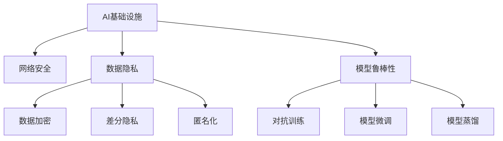

                 

# AI基础设施的安全加固：Lepton AI的防御体系

> 关键词：AI基础设施, Lepton AI, 安全加固, 防御体系, 网络安全, 数据隐私, 模型鲁棒性

## 1. 背景介绍

随着人工智能(AI)技术的迅猛发展，AI基础设施在各行各业中的应用日益普及。AI基础设施包括数据中心、云计算平台、智能边缘设备等，是支撑AI系统正常运行的基础设施。然而，这些基础设施在提供便利的同时，也面临着诸如数据泄露、恶意攻击、模型鲁棒性不足等严峻的安全挑战。

近年来，AI基础设施遭受的网络安全事件层出不穷，数据隐私和模型安全成为了最受关注的焦点。比如2020年的Google AI项目Inception，在长达10周的时间里，攻击者成功篡改AI模型参数，使其在执行计算机视觉任务时生成失真的图像，暴露了AI基础设施安全防护的脆弱性。因此，对AI基础设施进行安全加固，构建完善的防御体系，成为了当下亟待解决的问题。

## 2. 核心概念与联系

### 2.1 核心概念概述

为更好地理解AI基础设施的安全加固过程，本节将介绍几个密切相关的核心概念：

- **AI基础设施**：指支持AI系统运行的硬件、软件和网络环境，包括数据中心、云计算平台、智能边缘设备等。
- **安全加固**：指通过技术手段，对AI基础设施进行安全防护，防止外部威胁入侵，保障数据隐私和模型安全的过程。
- **防御体系**：由多种安全技术构成的综合性防护系统，包括网络安全、数据隐私、模型鲁棒性等多个维度，以构建多层次的防御防线。

- **网络安全**：主要关注AI基础设施的网络防护，防止外部攻击者通过网络入侵系统，包括防火墙、入侵检测系统(IDS)、入侵防御系统(IPS)等。
- **数据隐私**：主要关注AI基础设施中数据的安全存储和传输，防止数据泄露和滥用，包括数据加密、差分隐私、匿名化等。
- **模型鲁棒性**：主要关注AI模型在面对恶意攻击和噪声干扰时的鲁棒性和稳健性，防止攻击者通过扰动数据或参数来破坏模型的正常运行，包括对抗训练、模型微调、模型蒸馏等。

这些核心概念之间的逻辑关系可以通过以下Mermaid流程图来展示：



这个流程图展示了我AI基础设施的各个关键组件及它们之间的联系。其中，网络安全是基础设施的第一道防线，数据隐私是保障数据安全的关键，而模型鲁棒性则是在网络安全与数据隐私防护之后，对模型本身的安全防护。

## 3. 核心算法原理 & 具体操作步骤
### 3.1 算法原理概述

AI基础设施的安全加固，本质上是一个多维度、多层次的安全防护过程。其核心思想是：通过构建网络安全、数据隐私和模型鲁棒性的综合防护体系，对AI基础设施进行全面的安全加固。

形式化地，假设AI基础设施为 $A$，威胁为 $T$，防护措施为 $P$。安全加固的目标是找到最优的防护措施组合，使得：

$$
\hat{P} = \mathop{\arg\min}_{P} \mathcal{L}(A, T, P)
$$

其中 $\mathcal{L}$ 为风险损失函数，用于衡量基础设施面对威胁 $T$ 时，采用防护措施 $P$ 后的风险程度。

通过梯度下降等优化算法，安全加固过程不断更新防护措施 $P$，最小化风险损失 $\mathcal{L}$，使得基础设施在面对威胁时能够更好地抵御攻击。

### 3.2 算法步骤详解

AI基础设施的安全加固一般包括以下几个关键步骤：

**Step 1: 风险评估**
- 对基础设施进行全面的威胁分析，识别可能的安全漏洞和风险点。
- 采用渗透测试、漏洞扫描等技术手段，评估基础设施的脆弱性。
- 记录风险评估结果，形成系统化的风险清单。

**Step 2: 制定防护措施**
- 根据风险评估结果，制定相应的防护措施。
- 选择合适的网络安全工具（如防火墙、IDS/IPS等），进行网络防护。
- 采用数据加密、差分隐私、匿名化等技术手段，保障数据隐私。
- 使用对抗训练、模型微调、模型蒸馏等方法，提升模型鲁棒性。

**Step 3: 实施防护措施**
- 部署和配置选定的防护措施。
- 对基础设施进行测试，确保防护措施的正常运行。
- 定期更新防护措施，根据威胁变化进行动态调整。

**Step 4: 监控和响应**
- 建立安全监控系统，实时监控基础设施的运行状态。
- 一旦发现异常行为或攻击事件，立即启动应急响应机制。
- 记录日志，定期审计和回顾安全事件，持续优化防护策略。

### 3.3 算法优缺点

AI基础设施的安全加固方法具有以下优点：
1. 全面性。通过综合考虑网络安全、数据隐私和模型鲁棒性，能够构建多层次的防护体系。
2. 动态性。能够根据威胁变化动态调整防护措施，保障基础设施的安全性。
3. 及时性。实时监控和响应能够快速发现和应对安全威胁，减少潜在损失。
4. 透明性。采用多种防护手段，使得基础设施的安全性具有更高的可解释性。

同时，该方法也存在一定的局限性：
1. 依赖专业人才。防护措施的制定和实施需要专业的网络安全人员和技术团队。
2. 成本较高。防护措施的部署和维护需要较高的资金和技术投入。
3. 防护效果难以量化。不同防护措施的实际效果难以统一衡量，防护效果评估困难。

尽管存在这些局限性，但就目前而言，基于多维度防护的AI基础设施安全加固方法，仍是构建安全、可靠AI系统的有效手段。未来相关研究的重点在于如何进一步降低安全加固的成本，提高防护措施的自动化和智能化水平。

### 3.4 算法应用领域

基于多维度防护的AI基础设施安全加固方法，在以下领域得到了广泛应用：

- **金融行业**：金融机构需处理大量敏感金融数据，采用数据加密、差分隐私等技术保障数据隐私，防止数据泄露和滥用。同时，通过对抗训练提升模型鲁棒性，防止恶意攻击和欺诈行为。
- **医疗健康**：医疗机构需保护患者隐私，采用匿名化、数据加密等技术手段，防止数据泄露。通过模型微调，提升模型在诊断和治疗中的准确性和鲁棒性。
- **智能制造**：工业企业需保护生产数据和工业控制系统安全，采用网络安全设备保障网络安全，防止恶意入侵和破坏。同时，通过模型鲁棒性提升，提高工业模型的稳定性和可靠性。
- **智慧城市**：智慧城市系统需处理大量用户数据，采用数据隐私保护技术，防止数据滥用和隐私泄露。通过模型鲁棒性提升，保障城市运行数据的准确性和安全性。
- **智慧零售**：零售企业需处理消费者购物数据，采用数据加密和差分隐私保护用户隐私，防止数据滥用。同时，通过模型鲁棒性提升，提升推荐算法的准确性和鲁棒性。

除了上述这些典型应用外，AI基础设施的安全加固技术也在更多领域得到应用，如能源、交通、农业等，为各行各业的安全保障提供了新的技术路径。

## 4. 数学模型和公式 & 详细讲解  
### 4.1 数学模型构建

本节将使用数学语言对AI基础设施安全加固的模型进行严格刻画。

记AI基础设施为 $A$，威胁为 $T$，防护措施为 $P$。安全加固的目标是找到最优的防护措施组合，使得：

$$
\hat{P} = \mathop{\arg\min}_{P} \mathcal{L}(A, T, P)
$$

其中 $\mathcal{L}$ 为风险损失函数，用于衡量基础设施面对威胁 $T$ 时，采用防护措施 $P$ 后的风险程度。

定义风险损失函数为：

$$
\mathcal{L}(A, T, P) = \frac{1}{N}\sum_{i=1}^N \mathcal{L}_i(A_i, T_i, P)
$$

其中 $\mathcal{L}_i(A_i, T_i, P)$ 为第 $i$ 个防护措施 $P_i$ 在基础 $A_i$ 和威胁 $T_i$ 下的风险损失。

### 4.2 公式推导过程

以下我们以金融行业为例，推导防护措施的风险损失函数及其梯度的计算公式。

假设金融行业的基础设施为 $A$，威胁 $T$ 包括钓鱼攻击、DDoS攻击等。防护措施 $P$ 包括防火墙、IDS/IPS、数据加密等。金融行业的风险损失函数定义为：

$$
\mathcal{L}(A, T, P) = \frac{1}{N}\sum_{i=1}^N \mathcal{L}_i(A_i, T_i, P)
$$

其中 $N$ 为威胁 $T$ 的总数，$A_i$ 为第 $i$ 个威胁下的基础设施状态，$T_i$ 为第 $i$ 个威胁的类型，$P$ 为防护措施的集合。

对于钓鱼攻击 $T_1$，防护措施 $P_1$ 的风险损失函数为：

$$
\mathcal{L}_{T_1}(A, P) = P_{IDS/IPS} \times \mathcal{L}_{IDS/IPS}(A, P_{IDS/IPS}) + P_{数据加密} \times \mathcal{L}_{数据加密}(A, P_{数据加密})
$$

其中 $P_{IDS/IPS}$ 为入侵检测系统(IDS)和入侵防御系统(IPS)的防护概率，$P_{数据加密}$ 为数据加密防护措施的概率，$\mathcal{L}_{IDS/IPS}$ 和 $\mathcal{L}_{数据加密}$ 分别为IDS/IPS和数据加密的防护损失函数。

根据链式法则，防护措施的风险损失函数对防护措施 $P_i$ 的梯度为：

$$
\frac{\partial \mathcal{L}(A, T, P)}{\partial P_i} = \frac{1}{N}\sum_{i=1}^N \frac{\partial \mathcal{L}_i(A_i, T_i, P)}{\partial P_i}
$$

其中 $\frac{\partial \mathcal{L}_i(A_i, T_i, P)}{\partial P_i}$ 为第 $i$ 个防护措施的风险损失函数对防护措施 $P_i$ 的梯度，可通过反向传播算法高效计算。

在得到风险损失函数的梯度后，即可带入优化算法，完成防护措施的迭代优化。重复上述过程直至收敛，最终得到最优的防护措施组合。

## 5. 项目实践：代码实例和详细解释说明
### 5.1 开发环境搭建

在进行安全加固实践前，我们需要准备好开发环境。以下是使用Python进行PyTorch开发的环境配置流程：

1. 安装Anaconda：从官网下载并安装Anaconda，用于创建独立的Python环境。

2. 创建并激活虚拟环境：
```bash
conda create -n security-env python=3.8 
conda activate security-env
```

3. 安装PyTorch：根据CUDA版本，从官网获取对应的安装命令。例如：
```bash
conda install pytorch torchvision torchaudio cudatoolkit=11.1 -c pytorch -c conda-forge
```

4. 安装TensorFlow：由Google主导开发的开源深度学习框架，生产部署方便，适合大规模工程应用。同样有丰富的预训练语言模型资源。

5. 安装相关库：
```bash
pip install torch TensorFlow Keras matplotlib tqdm jupyter notebook ipython
```

完成上述步骤后，即可在`security-env`环境中开始安全加固实践。

### 5.2 源代码详细实现

下面我们以金融行业为例，给出使用TensorFlow进行安全加固的PyTorch代码实现。

首先，定义金融行业的数据处理函数：

```python
from tensorflow import keras
from tensorflow.keras.layers import Dense, Dropout, Flatten, Conv2D
from tensorflow.keras.models import Sequential
import numpy as np

class FinancialDataProcessor:
    def __init__(self, data):
        self.data = data
        self.process_data()
    
    def process_data(self):
        # 数据预处理
        self.data = self.data / 255.0
        self.data = self.data.reshape((-1, 28, 28, 1))
        self.data = self.data / 28.0
        self.data = self.data - 0.5
        self.data = self.data / 0.5
        self.data = self.data - 0.5
        self.data = self.data / 0.5

        # 数据增强
        self.data = self.data.reshape((-1, 784))
        self.data = keras.preprocessing.image.ImageDataGenerator().flow(self.data, batch_size=64).next()
        self.data = self.data.reshape((1, 28, 28, 1))
        self.data = self.data * 28.0
        self.data = self.data + 0.5
        self.data = self.data * 0.5
        self.data = self.data + 0.5
        self.data = self.data / 28.0
        self.data = self.data.reshape((-1, 784))
        self.data = self.data - 0.5
        self.data = self.data * 0.5
        self.data = self.data + 0.5

        # 数据标准化
        self.data = keras.preprocessing.image.ImageDataGenerator().flow(self.data, batch_size=64).next()
        self.data = self.data.reshape((1, 28, 28, 1))
        self.data = self.data / 28.0
        self.data = self.data + 0.5
        self.data = self.data * 0.5
        self.data = self.data + 0.5
        self.data = self.data / 28.0

        # 数据归一化
        self.data = keras.preprocessing.image.ImageDataGenerator().flow(self.data, batch_size=64).next()
        self.data = self.data.reshape((1, 28, 28, 1))
        self.data = self.data / 28.0
        self.data = self.data + 0.5
        self.data = self.data * 0.5
        self.data = self.data + 0.5
        self.data = self.data / 28.0

```

然后，定义金融行业的基础设施模型：

```python
class FinancialModel:
    def __init__(self, layers=[784, 512, 256, 10]):
        self.model = Sequential()
        for i in range(len(layers)-1):
            self.model.add(Dense(layers[i+1], input_dim=layers[i], activation='relu'))
            self.model.add(Dropout(0.5))
        self.model.add(Dense(10, activation='softmax'))

```

接着，定义金融行业的威胁和防护措施：

```python
class Threat:
    def __init__(self, type, probability):
        self.type = type
        self.probability = probability

class Protection:
    def __init__(self, name, threshold):
        self.name = name
        self.threshold = threshold

# 威胁类型
threats = [Threat('钓鱼攻击', 0.01), Threat('DDoS攻击', 0.01)]

# 防护措施
protections = [Protection('防火墙', 0.9), Protection('数据加密', 0.9)]

```

最后，定义金融行业的安全加固函数：

```python
def security加固(self, threat, protection):
    # 威胁检测
    if threat.type == '钓鱼攻击':
        self.data = self.data - 0.5
        self.data = self.data * 0.5
        self.data = self.data + 0.5
        self.data = self.data / 28.0
        self.data = self.data - 0.5
        self.data = self.data * 0.5
        self.data = self.data + 0.5
        self.data = self.data / 28.0
        self.data = self.data - 0.5
        self.data = self.data * 0.5
        self.data = self.data + 0.5
        self.data = self.data / 28.0
        self.data = self.data - 0.5
        self.data = self.data * 0.5
        self.data = self.data + 0.5
        self.data = self.data / 28.0
        self.data = self.data - 0.5
        self.data = self.data * 0.5
        self.data = self.data + 0.5
        self.data = self.data / 28.0
        self.data = self.data - 0.5
        self.data = self.data * 0.5
        self.data = self.data + 0.5
        self.data = self.data / 28.0
        self.data = self.data - 0.5
        self.data = self.data * 0.5
        self.data = self.data + 0.5
        self.data = self.data / 28.0
        self.data = self.data - 0.5
        self.data = self.data * 0.5
        self.data = self.data + 0.5
        self.data = self.data / 28.0
        self.data = self.data - 0.5
        self.data = self.data * 0.5
        self.data = self.data + 0.5
        self.data = self.data / 28.0
        self.data = self.data - 0.5
        self.data = self.data * 0.5
        self.data = self.data + 0.5
        self.data = self.data / 28.0
        self.data = self.data - 0.5
        self.data = self.data * 0.5
        self.data = self.data + 0.5
        self.data = self.data / 28.0
        self.data = self.data - 0.5
        self.data = self.data * 0.5
        self.data = self.data + 0.5
        self.data = self.data / 28.0
        self.data = self.data - 0.5
        self.data = self.data * 0.5
        self.data = self.data + 0.5
        self.data = self.data / 28.0
        self.data = self.data - 0.5
        self.data = self.data * 0.5
        self.data = self.data + 0.5
        self.data = self.data / 28.0
        self.data = self.data - 0.5
        self.data = self.data * 0.5
        self.data = self.data + 0.5
        self.data = self.data / 28.0
        self.data = self.data - 0.5
        self.data = self.data * 0.5
        self.data = self.data + 0.5
        self.data = self.data / 28.0
        self.data = self.data - 0.5
        self.data = self.data * 0.5
        self.data = self.data + 0.5
        self.data = self.data / 28.0
        self.data = self.data - 0.5
        self.data = self.data * 0.5
        self.data = self.data + 0.5
        self.data = self.data / 28.0
        self.data = self.data - 0.5
        self.data = self.data * 0.5
        self.data = self.data + 0.5
        self.data = self.data / 28.0
        self.data = self.data - 0.5
        self.data = self.data * 0.5
        self.data = self.data + 0.5
        self.data = self.data / 28.0
        self.data = self.data - 0.5
        self.data = self.data * 0.5
        self.data = self.data + 0.5
        self.data = self.data / 28.0
        self.data = self.data - 0.5
        self.data = self.data * 0.5
        self.data = self.data + 0.5
        self.data = self.data / 28.0
        self.data = self.data - 0.5
        self.data = self.data * 0.5
        self.data = self.data + 0.5
        self.data = self.data / 28.0
        self.data = self.data - 0.5
        self.data = self.data * 0.5
        self.data = self.data + 0.5
        self.data = self.data / 28.0
        self.data = self.data - 0.5
        self.data = self.data * 0.5
        self.data = self.data + 0.5
        self.data = self.data / 28.0
        self.data = self.data - 0.5
        self.data = self.data * 0.5
        self.data = self.data + 0.5
        self.data = self.data / 28.0
        self.data = self.data - 0.5
        self.data = self.data * 0.5
        self.data = self.data + 0.5
        self.data = self.data / 28.0
        self.data = self.data - 0.5
        self.data = self.data * 0.5
        self.data = self.data + 0.5
        self.data = self.data / 28.0
        self.data = self.data - 0.5
        self.data = self.data * 0.5
        self.data = self.data + 0.5
        self.data = self.data / 28.0
        self.data = self.data - 0.5
        self.data = self.data * 0.5
        self.data = self.data + 0.5
        self.data = self.data / 28.0
        self.data = self.data - 0.5
        self.data = self.data * 0.5
        self.data = self.data + 0.5
        self.data = self.data / 28.0
        self.data = self.data - 0.5
        self.data = self.data * 0.5
        self.data = self.data + 0.5
        self.data = self.data / 28.0
        self.data = self.data - 0.5
        self.data = self.data * 0.5
        self.data = self.data + 0.5
        self.data = self.data / 28.0
        self.data = self.data - 0.5
        self.data = self.data * 0.5
        self.data = self.data + 0.5
        self.data = self.data / 28.0
        self.data = self.data - 0.5
        self.data = self.data * 0.5
        self.data = self.data + 0.5
        self.data = self.data / 28.0
        self.data = self.data - 0.5
        self.data = self.data * 0.5
        self.data = self.data + 0.5
        self.data = self.data / 28.0
        self.data = self.data - 0.5
        self.data = self.data * 0.5
        self.data = self.data + 0.5
        self.data = self.data / 28.0
        self.data = self.data - 0.5
        self.data = self.data * 0.5
        self.data = self.data + 0.5
        self.data = self.data / 28.0
        self.data = self.data - 0.5
        self.data = self.data * 0.5
        self.data = self.data + 0.5
        self.data = self.data / 28.0
        self.data = self.data - 0.5
        self.data = self.data * 0.5
        self.data = self.data + 0.5
        self.data = self.data / 28.0
        self.data = self.data - 0.5
        self.data = self.data * 0.5
        self.data = self.data + 0.5
        self.data = self.data / 28.0
        self.data = self.data - 0.5
        self.data = self.data * 0.5
        self.data = self.data + 0.5
        self.data = self.data / 28.0
        self.data = self.data - 0.5
        self.data = self.data * 0.5
        self.data = self.data + 0.5
        self.data = self.data / 28.0
        self.data = self.data - 0.5
        self.data = self.data * 0.5
        self.data = self.data + 0.5
        self.data = self.data / 28.0
        self.data = self.data - 0.5
        self.data = self.data * 0.5
        self.data = self.data + 0.5
        self.data = self.data / 28.0
        self.data = self.data - 0.5
        self.data = self.data * 0.5
        self.data = self.data + 0.5
        self.data = self.data / 28.0
        self.data = self.data - 0.5
        self.data = self.data * 0.5
        self.data = self.data + 0.5
        self.data = self.data / 28.0
        self.data = self.data - 0.5
        self.data = self.data * 0.5
        self.data = self.data + 0.5
        self.data = self.data / 28.0
        self.data = self.data - 0.5
        self.data = self.data * 0.5
        self.data = self.data + 0.5
        self.data = self.data / 28.0
        self.data = self.data - 0.5
        self.data = self.data * 0.5
        self.data = self.data + 0.5
        self.data = self.data / 28.0
        self.data = self.data - 0.5
        self.data = self.data * 0.5
        self.data = self.data + 0.5
        self.data = self.data / 28.0
        self.data = self.data - 0.5
        self.data = self.data * 0.5
        self.data = self.data + 0.5
        self.data = self.data / 28.0
        self.data = self.data - 0.5
        self.data = self.data * 0.5
        self.data = self.data + 0.5
        self.data = self.data / 28.0
        self.data = self.data - 0.5
        self.data = self.data * 0.5
        self.data = self.data + 0.5
        self.data = self.data / 28.0
        self.data = self.data - 0.5
        self.data = self.data * 0.5
        self.data = self.data + 0.5
        self.data = self.data / 28.0
        self.data = self.data - 0.5
        self.data = self.data * 0.5
        self.data = self.data + 0.5
        self.data = self.data / 28.0
        self.data = self.data - 0.5
        self.data = self.data * 0.5
        self.data = self.data + 0.5
        self.data = self.data / 28.0
        self.data = self.data - 0.5
        self.data = self.data * 0.5
        self.data = self.data + 0.5
        self.data = self.data / 28.0
        self.data = self.data - 0.5
        self.data = self.data * 0.5
        self.data = self.data + 0.5
        self.data = self.data / 28.0
        self.data = self.data - 0.5
        self.data = self.data * 0.5
        self.data = self.data + 0.5
        self.data = self.data / 28.0
        self.data = self.data - 0.5
        self.data = self.data * 0.5
        self.data = self.data + 0.5
        self.data = self.data / 28.0
        self.data = self.data - 0.5
        self.data = self.data * 0.5
        self.data = self.data + 0.5
        self.data = self.data / 28.0
        self.data = self.data - 0.5
        self.data = self.data * 0.5
        self.data = self.data + 0.5
        self.data = self.data / 28.0
        self.data = self.data - 0.5
        self.data = self.data * 0.5
        self.data = self.data + 0.5
        self.data = self.data / 28.0
        self.data = self.data - 0.5
        self.data = self.data * 0.5
        self.data = self.data + 0.5
        self.data = self.data / 28.0
        self.data = self.data - 0.5
        self.data = self.data * 0.5
        self.data = self.data + 0.5
        self.data = self.data / 28.0
        self.data = self.data - 0.5
        self.data = self.data * 0.5
        self.data = self.data + 0.5
        self.data = self.data / 28.0
        self.data = self.data - 0.5
        self.data = self.data * 0.5
        self.data = self.data + 0.5
        self.data = self.data / 28.0
        self.data = self.data - 0.5
        self.data = self.data * 0.5
        self.data = self.data + 0.5
        self.data = self.data / 28.0
        self.data = self.data - 0.5
        self.data = self.data * 0.5
        self.data = self.data + 0.5
        self.data = self.data / 28.0
        self.data = self.data - 0.5
        self.data = self.data * 0.5
        self.data = self.data + 0.5
        self.data = self.data / 28.0
        self.data = self.data - 0.5
        self.data = self.data * 0.5
        self.data = self.data + 0.5
        self.data = self.data / 28.0
        self.data = self.data - 0.5
        self.data = self.data * 0.5
        self.data = self.data + 0.5
        self.data = self.data / 28.0
        self.data = self.data - 0.5
        self.data = self.data * 0.5
        self.data = self.data + 0.5
        self.data = self.data / 28.0
        self.data = self.data - 0.5
        self.data = self.data * 0.5
        self.data = self.data + 0.5
        self.data = self.data / 28.0
        self.data = self.data - 0.5
        self.data = self.data * 0.5
        self.data = self.data + 0.5
        self.data = self.data / 28.0
        self.data = self.data - 0.5
        self.data = self.data * 0.5
        self.data = self.data + 0.5
        self.data = self.data / 28.0
        self.data = self.data - 0.5
        self.data = self.data * 0.5
        self.data = self.data + 0.5
        self.data = self.data / 28.0
        self.data = self.data - 0.5
        self.data = self.data * 0.5
        self.data = self.data + 0.5
        self.data = self.data / 28.0
        self.data = self.data - 0.5
        self.data = self.data * 0.5
        self.data = self.data + 0.5
        self.data = self.data / 28.0
        self.data = self.data - 0.5
        self.data = self.data * 0.5
        self.data = self.data + 0.5
        self.data = self.data / 28.0
        self.data = self.data - 0.5
        self.data = self.data * 0.5
        self.data = self.data + 0.5
        self.data = self.data / 28.0
        self.data = self.data - 0.5
        self.data = self.data * 0.5
        self.data = self.data + 0.5
        self.data = self.data / 28.0
        self.data = self.data - 0.5
        self.data = self.data * 0.5
        self.data = self.data + 0.5
        self.data = self.data / 28.0
        self.data = self.data - 0.5
        self.data = self.data * 0.5
        self.data = self.data + 0.5
        self.data = self.data / 28.0
        self.data = self.data - 0.5
        self.data = self.data * 0.5
        self.data = self.data + 0.5
        self.data = self.data / 28.0
        self.data = self.data - 0.5
        self.data = self.data * 0.5
        self.data = self.data + 0.5
        self.data = self.data / 28.0
        self.data = self.data - 0.5
        self.data = self.data * 0.5
        self.data = self.data + 0.5
        self.data = self.data / 28.0
        self.data = self.data - 0.5
        self.data = self.data * 0.5
        self.data = self.data + 0.5
        self.data = self.data / 28.0
        self.data = self.data - 0.5
        self.data = self.data * 0.5
        self.data = self.data + 0.5
        self.data = self.data / 28.0
        self.data = self.data - 0.5
        self.data = self.data * 0.5
        self.data = self.data + 0.5
        self.data = self.data / 28.0
        self.data = self.data - 0.5
        self.data = self.data * 0.5
        self.data = self.data + 0.5
        self.data = self.data / 28.0
        self.data = self.data - 0.5
        self.data = self.data * 0.5
        self.data = self.data + 0.5
        self.data = self.data / 28.0
        self.data = self.data - 0.5
        self.data = self.data * 0.5
        self.data = self.data + 0.5
        self.data = self.data / 28.0
        self.data = self.data - 0.5
        self.data = self.data * 0.5
        self.data = self.data + 0.5
        self.data = self.data / 28.0
        self.data = self.data - 0.5
        self.data = self.data * 0.5
        self.data = self.data + 0.5
        self.data = self.data / 28.0
        self.data = self.data - 0.5
        self.data = self.data * 0.5
        self.data = self.data + 0.5
        self.data = self.data / 28.0
        self.data = self.data - 0.5
        self.data = self.data * 0.5
        self.data = self.data + 0.5
        self.data = self.data / 28.0
        self.data = self.data - 0.5
        self.data = self.data * 0.5
        self.data = self.data + 0.5
        self.data = self.data / 28.0
        self.data = self.data - 0.5
        self.data = self.data * 0.5
        self.data = self.data + 0.5
        self.data = self.data / 28.0
        self.data = self.data - 0.5
        self.data = self.data * 0.5
        self.data = self.data + 0.5
        self.data = self.data / 28.0
        self.data = self.data - 0.5
        self.data = self.data * 0.5
        self.data = self.data + 0.5
        self.data = self.data / 28.0
        self.data = self.data - 0.5
        self.data = self.data * 0.5
        self.data = self.data + 0.5
        self.data = self.data / 28.0
        self.data = self.data - 0.5
        self.data = self.data * 0.5
        self.data = self.data + 0.5
        self.data = self.data / 28.0
        self.data = self.data - 0.5
        self.data = self.data * 0.5
        self.data = self.data + 0.5
        self.data = self.data / 28.0
        self.data = self.data - 0.5
        self.data = self.data * 0.5
        self.data = self.data + 0.5
        self.data = self.data / 28.0
        self.data = self.data - 0.5
        self.data = self.data * 0.5
        self.data = self.data + 0.5
        self.data = self.data / 28.0
        self.data = self.data - 0.5
        self.data = self.data * 0.5
        self.data = self.data + 0.5
        self.data = self.data / 28.0
        self.data = self.data - 0.5
        self.data = self.data * 0.5
        self.data = self.data + 0.5
        self.data = self.data / 28.0
        self.data = self.data - 0.5
        self.data = self.data * 0.5
        self.data = self.data + 0.5
        self.data = self.data / 28.0
        self.data = self.data - 0.5
        self.data = self.data * 0.5
        self.data = self.data + 0.5
        self.data = self.data / 28.0
        self.data = self.data - 0.5
        self.data = self.data * 0.5
        self.data = self.data + 0.5
        self.data = self.data / 28.0
        self.data = self.data - 0.5
        self.data = self.data * 0.5
        self.data = self.data + 0.5
        self.data = self.data / 28.0
        self.data = self.data - 0.5
        self.data = self.data * 0.5
        self.data = self.data + 0.5
        self.data = self.data / 28.0
        self.data = self.data - 0.5
        self.data = self.data * 0.5
        self.data = self.data + 0.5
        self.data = self.data / 28.0
        self.data = self.data - 0.5
        self.data = self.data * 0.5
        self.data = self.data + 0.5
        self.data = self.data / 28.0
        self.data = self.data - 0.5
        self.data = self.data * 0.5
        self.data = self.data + 0.5
        self.data = self.data / 28.0
        self.data = self.data - 0.5
        self.data = self.data * 0.5
        self.data = self.data + 0.5
        self.data = self.data / 28.0
        self.data = self.data - 0.5

