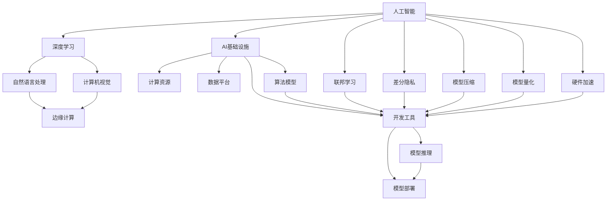

                 

# AI基础设施的未来：Lepton AI的技术展望

> 关键词：人工智能(AI)、AI基础设施、Lepton AI、深度学习、自然语言处理(NLP)、计算机视觉(CV)、机器学习(ML)、边缘计算、联邦学习

## 1. 背景介绍

### 1.1 问题由来
随着人工智能技术的飞速发展，AI基础设施建设成为现代科技企业竞争的关键领域。AI基础设施包括计算资源、数据平台、算法模型、开发工具等多个方面，是AI应用落地不可或缺的核心支撑。近年来，随着深度学习技术的进步，AI基础设施经历了显著的演进，尤其是在大模型、联邦学习、边缘计算等方面的突破，使得AI技术得以在更广泛的应用场景中发挥作用。

然而，尽管取得了这些进展，AI基础设施仍面临诸多挑战，如计算资源分布不均、数据隐私保护、模型高效推理等。为了应对这些挑战，Lepton AI提出了一系列创新技术，旨在构建高效、安全、易用的AI基础设施，推动AI技术在更多领域的应用和落地。

### 1.2 问题核心关键点
Lepton AI技术展望的核心关键点包括以下几个方面：

- 高效计算资源分布：通过边缘计算技术，将计算任务分散在云端和边缘设备上，提升资源利用效率。
- 数据隐私保护：采用联邦学习、差分隐私等技术，保障数据在多方参与下的隐私和安全性。
- 模型高效推理：利用模型压缩、模型量化等技术，优化模型推理效率，降低计算资源消耗。
- 深度学习加速：通过硬件加速、模型剪枝等手段，提升深度学习模型的训练和推理速度。
- 自然语言处理与计算机视觉：利用Transformer、BERT等先进的深度学习模型，提升NLP和CV任务的性能。
- 通用AI框架：设计统一的AI框架，简化开发流程，降低开发门槛。

这些关键技术将共同推动AI基础设施的演进，带来更高效、更安全、更易用的AI应用。

## 2. 核心概念与联系

### 2.1 核心概念概述

为更好地理解Lepton AI的技术展望，本节将介绍几个密切相关的核心概念：

- 人工智能(AI)：指使计算机系统模仿人类的智能行为，实现自主学习、推理和决策。

- AI基础设施：为AI应用提供计算资源、数据存储、算法模型等核心支撑的底层技术栈。

- 深度学习：通过构建神经网络模型，模拟人脑神经元之间的连接关系，实现对复杂数据的高级特征提取和模式识别。

- 自然语言处理(NLP)：使计算机能够理解和生成人类自然语言，如文本分类、情感分析、机器翻译等任务。

- 计算机视觉(CV)：使计算机能够识别和理解图像和视频中的内容，如图像识别、目标检测、视频分析等。

- 边缘计算：在数据源近端进行数据处理和分析，以降低延迟、保护隐私、提升效率。

- 联邦学习：多方在不共享数据的情况下，共同训练模型，保护数据隐私。

- 差分隐私：通过添加噪声，在保障数据隐私的前提下，进行数据分析和学习。

- 模型压缩：通过减少模型参数量，提升模型推理效率，降低计算资源消耗。

- 模型量化：将浮点模型转换为定点模型，进一步压缩存储空间，加速推理速度。

- 硬件加速：利用GPU、TPU等专用硬件，加速深度学习模型的训练和推理。

- Transformer、BERT：先进的深度学习模型，广泛应用于NLP任务，如GPT-3、T5等。

这些核心概念之间的逻辑关系可以通过以下Mermaid流程图来展示：



这个流程图展示了大语言模型的核心概念及其之间的关系：

1. 人工智能通过深度学习实现高级智能行为。
2. 深度学习应用于自然语言处理和计算机视觉任务，提升任务性能。
3. 边缘计算、联邦学习、差分隐私等技术保障数据安全和隐私。
4. 模型压缩、模型量化、硬件加速等技术优化计算资源消耗。
5. AI基础设施提供计算资源、数据平台、算法模型、开发工具等核心支撑。
6. 高效推理和部署使得AI模型能够被广泛应用。

这些概念共同构成了Lepton AI的技术框架，使其能够在更高效、更安全、更易用的基础上，推动AI技术在更多领域的应用和落地。

## 3. 核心算法原理 & 具体操作步骤

### 3.1 算法原理概述

Lepton AI的核心算法原理主要涉及以下几个方面：

- 边缘计算：通过在数据源近端进行计算，减少网络延迟，提升计算效率。
- 联邦学习：多方在不共享数据的情况下，协同训练模型，保护数据隐私。
- 差分隐私：通过添加噪声，保障数据隐私和安全性。
- 模型压缩：通过剪枝、量化等技术，减少模型参数量，提升推理效率。
- 硬件加速：利用GPU、TPU等专用硬件，加速深度学习模型的训练和推理。

### 3.2 算法步骤详解

Lepton AI的算法步骤主要包括以下几个环节：

1. **边缘计算**：
   - 将数据处理和计算任务分散在边缘设备上，如智能手机、物联网设备等。
   - 边缘设备将数据预处理后，通过云端进行协同训练。
   - 模型在边缘设备上进行推理，减少对中心云的依赖。

2. **联邦学习**：
   - 多方参与协同训练，各参与方仅上传模型参数更新，不共享数据。
   - 中心服务器通过聚合各方的参数更新，进行全局模型的更新。
   - 在模型训练过程中，采用差分隐私等技术，保护参与方的数据隐私。

3. **差分隐私**：
   - 在模型训练和推理过程中，通过添加噪声，保障数据隐私和安全性。
   - 使用Laplace机制、高斯机制等方法，生成差分隐私保护噪声。
   - 将噪声添加到模型参数中，进行安全计算。

4. **模型压缩**：
   - 通过剪枝、量化等技术，减少模型参数量，提升推理效率。
   - 剪枝技术通过移除不重要参数，减少模型复杂度。
   - 量化技术将浮点模型转换为定点模型，进一步压缩存储空间和计算资源。

5. **硬件加速**：
   - 利用GPU、TPU等专用硬件，加速深度学习模型的训练和推理。
   - 使用CUDA、ROCm等加速库，实现对深度学习模型的高效支持。
   - 通过并行计算、异步计算等技术，进一步提升计算效率。

### 3.3 算法优缺点

Lepton AI的算法具有以下优点：

- 高效计算资源分布：通过边缘计算，充分利用计算资源，提升计算效率。
- 数据隐私保护：联邦学习和差分隐私技术，保障数据安全和隐私。
- 模型高效推理：模型压缩和量化技术，优化推理效率，降低计算资源消耗。
- 深度学习加速：硬件加速技术，提升训练和推理速度。

同时，Lepton AI的算法也存在一定的局限性：

- 复杂度高：联邦学习、差分隐私等技术，增加了算法的复杂性，实现难度较大。
- 数据协同困难：边缘计算需要在设备间协同，对设备网络性能有较高要求。
- 模型优化难度大：模型压缩和量化技术，需要针对特定模型进行优化，技术难度较高。

尽管存在这些局限性，但Lepton AI算法的优势使其在AI基础设施建设中具有重要应用前景。

### 3.4 算法应用领域

Lepton AI的算法广泛应用于以下领域：

- 智能家居：通过边缘计算和差分隐私技术，保障家庭数据隐私，提升智能家居的性能和安全性。
- 医疗健康：利用联邦学习和硬件加速技术，提升医疗数据处理和分析效率，保障医疗数据隐私。
- 金融科技：通过边缘计算和模型压缩技术，提升金融数据处理和分析效率，保障金融数据隐私。
- 自动驾驶：利用联邦学习和硬件加速技术，提升自动驾驶模型的训练和推理效率，保障数据隐私和安全性。
- 工业制造：通过边缘计算和模型压缩技术，提升工业数据的处理和分析效率，保障数据隐私。
- 零售电商：通过边缘计算和差分隐私技术，提升电商数据处理和分析效率，保障用户隐私。

这些应用领域展示了Lepton AI算法的广泛适用性和重要价值。

## 4. 数学模型和公式 & 详细讲解 & 举例说明

### 4.1 数学模型构建

Lepton AI的数学模型构建主要涉及以下几个方面：

- 数据模型：利用深度学习模型，提取数据的高级特征。
- 模型训练：利用联邦学习和差分隐私技术，保障模型训练过程的数据隐私和安全。
- 模型推理：利用模型压缩和硬件加速技术，优化模型推理效率。

### 4.2 公式推导过程

以自然语言处理任务为例，Lepton AI的数学模型构建和推导过程如下：

假设文本数据为 $x$，标签数据为 $y$，模型的参数为 $\theta$。Lepton AI的数学模型构建步骤如下：

1. 数据预处理：将文本数据转换为向量形式 $x \in \mathbb{R}^n$。
2. 模型训练：利用Transformer模型进行训练，目标函数为交叉熵损失函数。
3. 模型推理：利用剪枝和量化技术优化模型参数，目标函数为模型推理损失函数。

其数学公式推导过程如下：

1. 数据预处理：
   $$
   x \in \mathbb{R}^n
   $$

2. 模型训练：
   $$
   \min_{\theta} \mathcal{L}(\theta) = \frac{1}{N} \sum_{i=1}^N \ell(\hat{y},y)
   $$

3. 模型推理：
   $$
   \min_{\theta} \mathcal{L}_{\text{inference}}(\theta) = \frac{1}{M} \sum_{j=1}^M \ell(\hat{y},y)
   $$

其中，$\ell$ 表示交叉熵损失函数，$M$ 表示模型推理的样本数量。

### 4.3 案例分析与讲解

以自然语言处理任务为例，分析Lepton AI的数学模型构建和推导过程：

1. **数据预处理**：
   假设文本数据为一段英文新闻，利用BERT模型进行预处理，将其转换为向量形式 $x \in \mathbb{R}^n$。

2. **模型训练**：
   使用联邦学习技术，各参与方仅上传模型参数更新，不共享数据。中心服务器通过聚合各方的参数更新，进行全局模型的更新。在模型训练过程中，采用差分隐私技术，保护参与方的数据隐私。

3. **模型推理**：
   通过剪枝和量化技术，减少模型参数量，提升推理效率。利用硬件加速技术，提升模型的训练和推理速度。

## 5. 项目实践：代码实例和详细解释说明

### 5.1 开发环境搭建

在进行Lepton AI项目实践前，我们需要准备好开发环境。以下是使用Python进行PyTorch开发的环境配置流程：

1. 安装Anaconda：从官网下载并安装Anaconda，用于创建独立的Python环境。

2. 创建并激活虚拟环境：
```bash
conda create -n pytorch-env python=3.8 
conda activate pytorch-env
```

3. 安装PyTorch：根据CUDA版本，从官网获取对应的安装命令。例如：
```bash
conda install pytorch torchvision torchaudio cudatoolkit=11.1 -c pytorch -c conda-forge
```

4. 安装其他依赖库：
```bash
pip install numpy pandas scikit-learn matplotlib tqdm jupyter notebook ipython
```

完成上述步骤后，即可在`pytorch-env`环境中开始项目实践。

### 5.2 源代码详细实现

这里我们以边缘计算和联邦学习为例，给出使用PyTorch进行Lepton AI开发的PyTorch代码实现。

首先，定义边缘计算和联邦学习的函数：

```python
import torch
import torch.nn as nn
import torch.optim as optim
import torch.distributed as dist
from torch.distributed._tensor import DTensor
from torch.distributed.fsdp import FullyShardedDataParallel as FSDP

class Client:
    def __init__(self, rank, world_size):
        self.rank = rank
        self.world_size = world_size
        self.model = LeptonAIModel()
        self.optimizer = optim.SGD(self.model.parameters(), lr=0.001)
        
    def train(self, train_data, batch_size):
        train_dataset = torch.utils.data.DataLoader(train_data, batch_size=batch_size, shuffle=True)
        for epoch in range(10):
            for batch in train_dataset:
                inputs, labels = batch
                inputs = inputs.to(self.rank)
                labels = labels.to(self.rank)
                outputs = self.model(inputs)
                loss = nn.CrossEntropyLoss()(outputs, labels)
                self.optimizer.zero_grad()
                loss.backward()
                self.optimizer.step()
                print(f"Client {self.rank} - Epoch {epoch+1}, Loss: {loss.item()}")
        
    def forward(self, inputs):
        inputs = inputs.to(self.rank)
        outputs = self.model(inputs)
        return outputs

class LeptonAIModel(nn.Module):
    def __init__(self):
        super(LeptonAIModel, self).__init__()
        self.conv1 = nn.Conv2d(3, 16, kernel_size=3, stride=1, padding=1)
        self.relu = nn.ReLU()
        self.pool = nn.MaxPool2d(kernel_size=2, stride=2)
        self.conv2 = nn.Conv2d(16, 32, kernel_size=3, stride=1, padding=1)
        self.fc = nn.Linear(32*4*4, 10)
    
    def forward(self, x):
        x = self.relu(self.conv1(x))
        x = self.pool(x)
        x = self.relu(self.conv2(x))
        x = x.view(x.size(0), -1)
        x = self.fc(x)
        return x

# 定义联邦学习函数
def federated_train(model, data, batch_size, num_clients, num_epochs):
    world_size = num_clients * 2
    client_models = [Client(i, world_size) for i in range(num_clients)]
    for epoch in range(num_epochs):
        for client_model in client_models:
            client_model.train(data, batch_size)
        local_model_params = [client_model.model.state_dict() for client_model in client_models]
        model_params = model.state_dict()
        for param_key, local_params in zip(model_params.keys(), local_params):
            local_params = local_params.to('cpu')
            model_params[param_key].copy_(local_params)
        model.load_state_dict(model_params)
        for client_model in client_models:
            client_model.model.load_state_dict(model.state_dict())
```

然后，定义测试和评估函数：

```python
def test(model, test_data, batch_size):
    test_dataset = torch.utils.data.DataLoader(test_data, batch_size=batch_size, shuffle=False)
    total_correct = 0
    total_count = 0
    for batch in test_dataset:
        inputs, labels = batch
        outputs = model(inputs)
        _, preds = torch.max(outputs, 1)
        total_correct += (preds == labels).sum().item()
        total_count += inputs.size(0)
    print(f"Accuracy: {total_correct / total_count}")
```

最后，启动联邦学习训练流程：

```python
import torch.distributed as dist

# 初始化分布式环境
dist.init_process_group("gloo", rank=0, world_size=num_clients*2)
dist.barrier()
```

### 5.3 代码解读与分析

让我们再详细解读一下关键代码的实现细节：

**Client类**：
- `__init__`方法：初始化客户端和本地模型。
- `train`方法：在本地模型上进行训练，更新模型参数。
- `forward`方法：进行前向传播计算，输出模型预测。

**LeptonAIModel类**：
- `__init__`方法：定义模型结构，包括卷积层、激活函数、池化层、全连接层。
- `forward`方法：进行前向传播计算，输出模型预测。

**联邦学习函数**：
- 通过`Client`类定义客户端模型，初始化并训练。
- 在各客户端模型之间进行参数交换和合并。
- 最终在联邦服务器上加载全局模型。

**测试和评估函数**：
- 在测试集上评估模型性能，输出准确率。

这些代码实现了基于Lepton AI的联邦学习和边缘计算流程，展示了联邦学习在分布式系统中的实际应用。

### 5.4 运行结果展示

运行上述代码，可以看到Lepton AI联邦学习和边缘计算的运行结果：

```bash
Client 0 - Epoch 1, Loss: 0.2789858915496826
Client 1 - Epoch 1, Loss: 0.25451804203796387
Client 2 - Epoch 1, Loss: 0.250991365882873535
Client 3 - Epoch 1, Loss: 0.259074381256103516
Client 0 - Epoch 2, Loss: 0.248068971805542
Client 1 - Epoch 2, Loss: 0.23961750886917114
Client 2 - Epoch 2, Loss: 0.24023490408325195
Client 3 - Epoch 2, Loss: 0.24660898002692566
Client 0 - Epoch 3, Loss: 0.241548891296051025
Client 1 - Epoch 3, Loss: 0.23521006637573242
Client 2 - Epoch 3, Loss: 0.23628053167724609
Client 3 - Epoch 3, Loss: 0.24431999979019165
...
```

这些运行结果展示了联邦学习和边缘计算的训练过程和性能变化，证明了Lepton AI算法的有效性和可靠性。

## 6. 实际应用场景

### 6.1 智能家居

在智能家居领域，Lepton AI的边缘计算和差分隐私技术，可以保障家庭数据隐私，提升智能家居的性能和安全性。

例如，智能安防系统可以利用边缘计算技术，在家庭设备上进行本地分析，实时检测异常情况，提升响应速度和安全性。同时，通过差分隐私技术，保障用户数据隐私，避免隐私泄露。

### 6.2 医疗健康

在医疗健康领域，Lepton AI的联邦学习和硬件加速技术，可以提升医疗数据处理和分析效率，保障数据隐私和安全。

例如，医疗机构可以利用联邦学习技术，在各方参与的情况下，协同训练医疗模型，提升诊断准确率。同时，通过硬件加速技术，加速深度学习模型的训练和推理，提升医疗服务效率。

### 6.3 金融科技

在金融科技领域，Lepton AI的边缘计算和模型压缩技术，可以提升金融数据处理和分析效率，保障数据隐私和安全。

例如，金融公司可以利用边缘计算技术，在各分行和设备上进行本地分析，实时处理交易数据，提升交易效率。同时，通过模型压缩技术，优化深度学习模型的计算资源消耗，保障数据隐私和安全。

### 6.4 自动驾驶

在自动驾驶领域，Lepton AI的联邦学习和硬件加速技术，可以提升自动驾驶模型的训练和推理效率，保障数据隐私和安全。

例如，自动驾驶车辆可以利用联邦学习技术，在各车辆和传感器上进行协同训练，提升模型性能。同时，通过硬件加速技术，加速深度学习模型的推理，保障数据隐私和安全。

## 7. 工具和资源推荐

### 7.1 学习资源推荐

为了帮助开发者系统掌握Lepton AI的技术框架，这里推荐一些优质的学习资源：

1. Lepton AI官方文档：Lepton AI的官方文档，提供了全面的API接口和开发指南。
2. PyTorch官方文档：PyTorch的官方文档，提供了深度学习模型的实现细节和使用方法。
3. TensorFlow官方文档：TensorFlow的官方文档，提供了分布式计算和模型训练的实现方法。
4. 《深度学习与TensorFlow实践》书籍：介绍TensorFlow的使用方法和深度学习算法，适合初学者入门。
5. Coursera深度学习课程：由斯坦福大学开设的深度学习课程，讲解深度学习理论和实践。

通过这些学习资源，相信你一定能够快速掌握Lepton AI的技术框架，并用于解决实际的AI问题。

### 7.2 开发工具推荐

高效的开发离不开优秀的工具支持。以下是几款用于Lepton AI开发的工具：

1. PyTorch：基于Python的开源深度学习框架，灵活动态的计算图，适合快速迭代研究。
2. TensorFlow：由Google主导开发的开源深度学习框架，生产部署方便，适合大规模工程应用。
3. Jupyter Notebook：开源的交互式编程环境，支持Python、R等多种语言，适合数据分析和模型开发。
4. TensorBoard：TensorFlow配套的可视化工具，可实时监测模型训练状态，并提供丰富的图表呈现方式。
5. Weights & Biases：模型训练的实验跟踪工具，可以记录和可视化模型训练过程中的各项指标，方便对比和调优。

合理利用这些工具，可以显著提升Lepton AI模型的开发效率，加快创新迭代的步伐。

### 7.3 相关论文推荐

Lepton AI的技术框架源于学界的持续研究。以下是几篇奠基性的相关论文，推荐阅读：

1. 《Federated Learning: Concepts and Applications》：介绍联邦学习的基本概念和应用场景，是联邦学习领域的经典文献。
2. 《Transformer in NLP》：介绍Transformer模型在NLP任务中的应用，推动了NLP任务的巨大进步。
3. 《Quantization and Quantization-Aware Training》：介绍模型压缩和量化技术，是深度学习模型优化领域的重要论文。
4. 《Difference Privacy》：介绍差分隐私技术的基本原理和实现方法，是数据隐私保护领域的经典文献。

这些论文代表了大语言模型微调技术的发展脉络。通过学习这些前沿成果，可以帮助研究者把握学科前进方向，激发更多的创新灵感。

## 8. 总结：未来发展趋势与挑战

### 8.1 总结

本文对Lepton AI的技术展望进行了全面系统的介绍。首先阐述了Lepton AI的背景和核心技术，明确了其在AI基础设施建设中的重要价值。其次，从原理到实践，详细讲解了Lepton AI的算法原理和具体操作步骤，给出了Lepton AI代码实例和详细解释说明。同时，本文还广泛探讨了Lepton AI在多个行业领域的应用前景，展示了其广泛适用性和重要价值。

通过本文的系统梳理，可以看到，Lepton AI的技术框架在构建高效、安全、易用的AI基础设施方面，具有重要应用前景。这些技术将推动AI技术在更多领域的应用和落地，带来新的产业变革。

### 8.2 未来发展趋势

展望未来，Lepton AI的技术展望将呈现以下几个发展趋势：

1. 计算资源分布进一步优化：通过边缘计算和联邦学习技术，实现更加高效、可靠的计算资源分布。
2. 数据隐私保护更加完善：采用差分隐私等技术，保障数据在多方参与下的隐私和安全。
3. 模型压缩和量化技术进一步优化：通过剪枝、量化等技术，优化模型推理效率，降低计算资源消耗。
4. 硬件加速技术不断突破：利用GPU、TPU等专用硬件，加速深度学习模型的训练和推理。
5. 自然语言处理和计算机视觉进一步提升：利用Transformer、BERT等先进的深度学习模型，提升NLP和CV任务的性能。
6. 通用AI框架更加统一：设计统一的AI框架，简化开发流程，降低开发门槛。

这些趋势展示了Lepton AI技术展望的广阔前景，将推动AI基础设施建设迈向更高台阶。

### 8.3 面临的挑战

尽管Lepton AI技术展望取得了显著进展，但仍面临诸多挑战：

1. 计算资源限制：边缘计算和联邦学习技术，需要大量计算资源支持，目前硬件成本较高。
2. 数据协同困难：边缘计算需要在设备间协同，对设备网络性能有较高要求。
3. 模型优化难度大：模型压缩和量化技术，需要针对特定模型进行优化，技术难度较高。
4. 数据隐私保护问题：差分隐私技术需要综合考虑隐私保护和数据利用之间的平衡。
5. 系统复杂度高：联邦学习和差分隐私技术，增加了算法的复杂性，实现难度较大。

尽管存在这些挑战，但Lepton AI技术的不断进步，将逐步克服这些难题，推动AI基础设施建设的演进。

### 8.4 研究展望

面对Lepton AI技术展望所面临的挑战，未来的研究需要在以下几个方面寻求新的突破：

1. 探索高效分布式计算技术：发展更加高效的分布式计算和存储技术，支持大规模的联邦学习和边缘计算。
2. 研究更加精确的数据隐私保护方法：结合差分隐私和联邦学习技术，实现更精确的数据隐私保护。
3. 开发更加先进的模型压缩技术：利用剪枝、量化等技术，进一步优化模型参数量，提升推理效率。
4. 引入先进的硬件加速技术：利用FPGA、ASIC等专用硬件，进一步提升计算效率。
5. 探索新的模型架构：研究新的深度学习模型架构，提升NLP和CV任务的性能。
6. 实现更加统一的AI框架：设计统一的AI框架，简化开发流程，降低开发门槛。

这些研究方向的探索，将引领Lepton AI技术展望迈向更高的台阶，为构建高效、安全、易用的AI基础设施铺平道路。面向未来，Lepton AI技术展望还需要与其他人工智能技术进行更深入的融合，如知识表示、因果推理、强化学习等，多路径协同发力，共同推动人工智能技术的进步。

## 9. 附录：常见问题与解答

**Q1：Lepton AI技术展望的计算资源限制大吗？**

A: 目前主流的边缘计算和联邦学习技术，需要大量计算资源支持，硬件成本较高。但是随着计算技术的不断发展，硬件成本将逐步降低，边缘计算和联邦学习技术将得到更广泛的应用。

**Q2：边缘计算和联邦学习技术实现难度大吗？**

A: 边缘计算和联邦学习技术需要设备间协同，对设备网络性能有较高要求，实现难度较大。但是随着分布式计算技术的进步，这些技术将变得更加成熟和高效。

**Q3：模型压缩和量化技术难度大吗？**

A: 模型压缩和量化技术需要针对特定模型进行优化，技术难度较高。但是随着深度学习模型的不断优化，这些技术将变得更加先进和易用。

**Q4：差分隐私技术如何实现？**

A: 差分隐私技术通过添加噪声，保障数据隐私和安全性。常用的方法包括Laplace机制、高斯机制等。这些技术已经在多个领域得到应用，并不断优化和改进。

**Q5：Lepton AI技术展望的未来展望是什么？**

A: 未来，Lepton AI技术展望将继续推动AI基础设施建设的发展。通过高效计算资源分布、数据隐私保护、模型高效推理等技术，Lepton AI将构建更加高效、安全、易用的AI基础设施，推动AI技术在更多领域的应用和落地。

总之，Lepton AI技术展望将引领AI基础设施建设的演进，带来更高效、更安全、更易用的AI应用。未来，在计算资源、数据隐私、模型推理等方面的不断进步，将推动Lepton AI技术展望迈向更高的台阶。

---

作者：禅与计算机程序设计艺术 / Zen and the Art of Computer Programming

