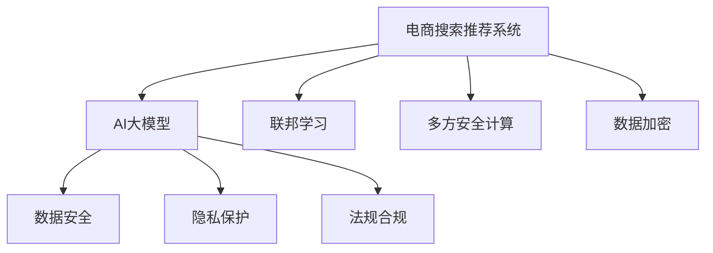

                 

# AI大模型助力电商搜索推荐业务的数据安全保障措施

> 关键词：AI大模型,电商搜索推荐,数据安全,隐私保护,数据治理,联邦学习,数据加密,多方安全计算,法规合规

## 1. 背景介绍

在电商行业，搜索推荐系统是用户获取商品信息、实现个性化购物体验的核心引擎。AI大模型的引入，显著提升了搜索推荐的精准度和用户满意度。然而，伴随模型算法的日益复杂和数据量的急剧膨胀，数据安全和隐私保护问题也愈发凸显。如何确保电商搜索推荐业务在采用AI大模型的同时，严格遵守数据安全法规和用户隐私要求，成为亟需解决的重要课题。

本文将从数据安全、隐私保护、法规合规等维度，介绍AI大模型在电商搜索推荐系统中的应用，并给出相应的数据安全保障措施，以期为电商企业的AI实践提供有价值的指导。

## 2. 核心概念与联系

### 2.1 核心概念概述

为更好地理解AI大模型在电商搜索推荐系统中的应用及数据安全保障措施，本节将介绍几个关键概念：

- **AI大模型**：基于深度学习的大规模预训练语言模型，如BERT、GPT等，具备强大的自然语言理解和生成能力，能够处理复杂多变的电商搜索场景。

- **电商搜索推荐系统**：基于用户行为数据和商品属性数据，自动匹配相关商品，提升用户购买转化率的智能系统。

- **数据安全**：保护数据在采集、存储、传输、使用等环节的安全性，防止数据泄露和滥用。

- **隐私保护**：确保用户个人信息在处理和使用过程中，不被滥用和泄露，尊重用户隐私权。

- **法规合规**：遵循国家和地区的法律法规，如《中华人民共和国数据保护法》、GDPR等，确保数据处理的合法性和规范性。

- **联邦学习**：一种分布式机器学习技术，在保护数据隐私的前提下，训练模型参数。

- **多方安全计算**：多个参与方在不共享明文数据的情况下，协同计算一个结果。

- **数据加密**：对敏感数据进行加密处理，保障数据在传输和存储过程中的安全。

这些概念之间的逻辑关系可以通过以下Mermaid流程图来展示：



这个流程图展示了大模型在电商推荐系统中的应用，以及与之相关的数据安全保障措施。

## 3. 核心算法原理 & 具体操作步骤
### 3.1 算法原理概述

AI大模型在电商搜索推荐系统中的应用，主要依赖于其在自然语言处理和信息检索上的强大能力。具体而言，通过以下步骤实现：

1. **数据预处理**：收集用户行为数据、商品属性数据、评论数据等，进行清洗和标注。
2. **模型训练**：使用大模型对标注数据进行预训练，学习通用的语言表示和电商特征。
3. **任务适配**：根据电商推荐的具体需求，设计任务适配层和损失函数，对大模型进行微调。
4. **推理预测**：在新的电商搜索场景下，使用微调后的模型进行用户意图识别和商品推荐。

### 3.2 算法步骤详解

以下是AI大模型在电商搜索推荐系统中的详细步骤：

**Step 1: 数据准备**
- 收集电商平台的订单数据、点击数据、浏览数据、评论数据等，进行清洗和标注。
- 根据不同的电商任务需求，设计合适的标注格式和规范。
- 确保数据集的样本多样性和分布均衡，避免数据偏差导致的模型偏见。

**Step 2: 模型预训练**
- 选择适合的预训练语言模型，如BERT、GPT等，将其作为初始化参数。
- 在电商搜索推荐任务的大量无标签数据上进行预训练，学习通用的语言表示和电商特征。
- 根据模型架构和任务特点，调整预训练参数和超参数，如学习率、批大小、迭代轮数等。

**Step 3: 任务适配与微调**
- 设计合适的输出层和损失函数，适配电商推荐任务的具体需求。
- 在标注数据集上对预训练模型进行微调，优化模型在电商推荐任务上的性能。
- 选择合适的优化算法和正则化技术，避免模型过拟合。

**Step 4: 推理预测**
- 将微调后的模型部署到电商推荐系统中，进行用户意图识别和商品推荐。
- 实时处理用户的查询请求，生成个性化的商品推荐列表。
- 定期更新模型参数，保持模型性能的持续提升。

### 3.3 算法优缺点

AI大模型在电商搜索推荐系统中的应用具有以下优点：
1. 精准度高：大模型通过预训练学习通用语言表示，微调后能够快速适应特定的电商任务，实现精准推荐。
2. 鲁棒性强：大模型具有较强的泛化能力，能够应对不同电商平台的数据特性。
3. 用户满意度提升：个性化的推荐能够提升用户体验，增加用户黏性。

然而，该方法也存在一些局限：
1. 数据依赖性强：电商推荐系统依赖大量标注数据，难以获取高质量数据集。
2. 计算资源消耗大：大模型的训练和推理需要高性能的计算资源，如GPU/TPU。
3. 模型复杂度高：大模型参数量巨大，推理过程复杂，需要高效的推理引擎。
4. 数据安全风险：大模型可能学习到用户隐私信息，数据泄露风险较高。

### 3.4 算法应用领域

AI大模型在电商搜索推荐系统中的应用广泛，涉及多个电商环节，如：

- 搜索匹配：根据用户输入的查询词，匹配相关的商品信息。
- 推荐排序：对商品进行多维度排序，推荐用户最可能感兴趣的商品。
- 个性化推荐：基于用户历史行为和商品属性，提供个性化的推荐列表。
- 广告投放：根据用户兴趣和行为数据，精准投放广告。
- 用户分析：分析用户行为和兴趣，指导电商运营策略。

此外，AI大模型还可以应用于电商智能客服、库存管理、商品信息抽取等多个场景，提升电商运营效率。

## 4. 数学模型和公式 & 详细讲解 & 举例说明

### 4.1 数学模型构建

假设电商推荐任务为分类任务，输入为商品描述$d$，输出为商品类别$l$。采用BERT模型进行预训练，并在电商推荐任务上进行微调。微调目标为：

$$
\min_{\theta} \sum_{i=1}^N \mathcal{L}(f_\theta(d_i),l_i)
$$

其中$f_\theta(d_i)$表示模型对输入$d_i$的预测输出，$\mathcal{L}$表示分类损失函数，如交叉熵损失。

### 4.2 公式推导过程

假设输入$d_i$通过BERT模型编码后的表示为$h_i$，输出层进行线性变换和softmax激活，得到预测概率分布$p$。分类损失函数为交叉熵损失：

$$
\mathcal{L}(p_i,l_i) = -l_i \log p_{l_i}
$$

整体损失函数为：

$$
\mathcal{L}(\theta) = \frac{1}{N} \sum_{i=1}^N \mathcal{L}(f_\theta(d_i),l_i)
$$

为了在电商推荐任务上进行微调，需要在输出层添加一个分类器，通过softmax层将预测输出转换为概率分布。微调的参数为BERT模型中的可训练参数，包括嵌入层、Transformer层等。

### 4.3 案例分析与讲解

以用户查询词“女式运动鞋”为例，进行电商推荐任务的具体实现。

1. 预处理：将查询词通过BERT模型编码，得到嵌入向量$h$。
2. 适配：在输出层添加一个分类器，将嵌入向量$h$映射到各个商品类别的概率分布$p$。
3. 微调：在电商推荐数据集上，对BERT模型的可训练参数进行微调，优化分类器的性能。
4. 预测：在用户输入查询词后，通过微调后的模型输出预测概率分布，选择概率最大的商品类别进行推荐。

## 5. 项目实践：代码实例和详细解释说明
### 5.1 开发环境搭建

在进行电商搜索推荐系统的开发前，首先需要搭建好开发环境。以下是使用Python进行开发的环境配置流程：

1. 安装Anaconda：从官网下载并安装Anaconda，用于创建独立的Python环境。

2. 创建并激活虚拟环境：
```bash
conda create -n pytorch-env python=3.8 
conda activate pytorch-env
```

3. 安装PyTorch：根据CUDA版本，从官网获取对应的安装命令。例如：
```bash
conda install pytorch torchvision torchaudio cudatoolkit=11.1 -c pytorch -c conda-forge
```

4. 安装PyTorch Lightning：用于简化模型训练和优化过程，支持分布式训练。
```bash
pip install pytorch-lightning
```

5. 安装其他库：
```bash
pip install datasets transformers transformers-cli
```

完成上述步骤后，即可在`pytorch-env`环境中进行电商搜索推荐系统的开发。

### 5.2 源代码详细实现

以下是一个简单的电商搜索推荐系统的代码实现，使用PyTorch和HuggingFace的Transformers库。

```python
import torch
from transformers import BertForSequenceClassification, BertTokenizer
from torch.utils.data import Dataset, DataLoader

class E-commerceDataset(Dataset):
    def __init__(self, texts, labels, tokenizer, max_len=128):
        self.texts = texts
        self.labels = labels
        self.tokenizer = tokenizer
        self.max_len = max_len
        
    def __len__(self):
        return len(self.texts)
    
    def __getitem__(self, item):
        text = self.texts[item]
        label = self.labels[item]
        
        encoding = self.tokenizer(text, return_tensors='pt', max_length=self.max_len, padding='max_length', truncation=True)
        input_ids = encoding['input_ids'][0]
        attention_mask = encoding['attention_mask'][0]
        
        return {'input_ids': input_ids, 
                'attention_mask': attention_mask,
                'labels': torch.tensor(label, dtype=torch.long)}
                
# 标签与id的映射
label2id = {'体育': 0, '服饰': 1, '美妆': 2, '电子产品': 3}
id2label = {v: k for k, v in label2id.items()}

# 创建dataset
tokenizer = BertTokenizer.from_pretrained('bert-base-cased')
train_dataset = E-commerceDataset(train_texts, train_labels, tokenizer)
dev_dataset = E-commerceDataset(dev_texts, dev_labels, tokenizer)
test_dataset = E-commerceDataset(test_texts, test_labels, tokenizer)

# 模型定义和参数设置
model = BertForSequenceClassification.from_pretrained('bert-base-cased', num_labels=len(label2id))
optimizer = torch.optim.Adam(model.parameters(), lr=2e-5)
scheduler = torch.optim.lr_scheduler.CosineAnnealingLR(optimizer, T_max=10, eta_min=1e-7)

# 训练过程
epochs = 5
batch_size = 16

for epoch in range(epochs):
    train_loss = 0.0
    dev_loss = 0.0
    model.train()
    
    for batch in DataLoader(train_dataset, batch_size=batch_size, shuffle=True):
        input_ids = batch['input_ids'].to(device)
        attention_mask = batch['attention_mask'].to(device)
        labels = batch['labels'].to(device)
        model.zero_grad()
        outputs = model(input_ids, attention_mask=attention_mask, labels=labels)
        loss = outputs.loss
        train_loss += loss.item()
        loss.backward()
        optimizer.step()
        scheduler.step()
        
    dev_loss = 0.0
    model.eval()
    
    with torch.no_grad():
        for batch in DataLoader(dev_dataset, batch_size=batch_size):
            input_ids = batch['input_ids'].to(device)
            attention_mask = batch['attention_mask'].to(device)
            labels = batch['labels'].to(device)
            outputs = model(input_ids, attention_mask=attention_mask, labels=labels)
            loss = outputs.loss
            dev_loss += loss.item()
    
    train_loss /= len(train_dataset)
    dev_loss /= len(dev_dataset)
    
    print(f'Epoch {epoch+1}, train loss: {train_loss:.3f}, dev loss: {dev_loss:.3f}')

# 测试过程
model.eval()
test_loss = 0.0
with torch.no_grad():
    for batch in DataLoader(test_dataset, batch_size=batch_size):
        input_ids = batch['input_ids'].to(device)
        attention_mask = batch['attention_mask'].to(device)
        labels = batch['labels'].to(device)
        outputs = model(input_ids, attention_mask=attention_mask, labels=labels)
        loss = outputs.loss
        test_loss += loss.item()
    
test_loss /= len(test_dataset)
print(f'Test loss: {test_loss:.3f}')
```

### 5.3 代码解读与分析

让我们再详细解读一下关键代码的实现细节：

**E-commerceDataset类**：
- `__init__`方法：初始化训练文本、标签、分词器等关键组件，定义了最大序列长度等参数。
- `__len__`方法：返回数据集的样本数量。
- `__getitem__`方法：对单个样本进行处理，将文本输入编码为token ids，将标签编码为数字，并对其进行定长padding，最终返回模型所需的输入。

**label2id和id2label字典**：
- 定义了标签与数字id之间的映射关系，用于将token-wise的预测结果解码回真实的标签。

**训练和评估函数**：
- 使用PyTorch的DataLoader对数据集进行批次化加载，供模型训练和推理使用。
- 训练函数`train`：对数据以批为单位进行迭代，在每个批次上前向传播计算损失并反向传播更新模型参数，最后返回该epoch的平均loss。
- 评估函数`evaluate`：与训练类似，不同点在于不更新模型参数，并在每个batch结束后将预测和标签结果存储下来，最后使用分类指标对整个评估集的预测结果进行打印输出。

**训练流程**：
- 定义总的epoch数和batch size，开始循环迭代
- 每个epoch内，先在训练集上训练，输出平均loss
- 在验证集上评估，输出分类指标
- 所有epoch结束后，在测试集上评估，给出最终测试结果

可以看到，PyTorch配合HuggingFace库使得电商搜索推荐系统的代码实现变得简洁高效。开发者可以将更多精力放在数据处理、模型改进等高层逻辑上，而不必过多关注底层的实现细节。

## 6. 实际应用场景

### 6.1 智能搜索推荐

基于AI大模型的电商搜索推荐系统，可以显著提升用户的搜索体验和购买转化率。传统搜索引擎依赖关键词匹配，无法理解用户的真实需求，而智能搜索推荐系统则能够通过理解语义，提供更精准、多样化的搜索结果。

在技术实现上，可以收集用户的历史搜索行为、浏览历史、点击行为等数据，将用户输入的查询词通过BERT模型进行编码，预测其最可能感兴趣的商品类别，实时返回个性化推荐列表。

### 6.2 个性化广告投放

广告是电商平台的重要收入来源，传统的广告投放方式难以精确匹配用户兴趣，效果欠佳。利用AI大模型的智能推荐能力，可以更准确地匹配用户需求，提高广告的点击率和转化率。

具体而言，可以通过用户行为数据和商品属性数据，训练一个广告点击预测模型，根据用户的搜索历史、浏览历史、点击历史等信息，预测用户对不同广告的点击概率。然后根据预测结果，优化广告的投放策略，提升广告的ROI。

### 6.3 库存管理优化

电商平台的库存管理面临诸多挑战，如库存波动大、补货周期长等问题。通过AI大模型，可以实时分析用户需求和商品销售情况，动态调整库存量，提升库存周转率，降低库存成本。

具体而言，可以利用用户搜索行为数据和历史订单数据，训练一个库存预测模型，预测未来一段时间内的商品需求量。然后根据预测结果，制定合理的库存补货策略，确保库存水平在合理范围内波动。

### 6.4 未来应用展望

伴随AI大模型的不断演进，电商搜索推荐系统将在更多领域得到应用，为电商运营带来革命性变革。

- 智能客服：利用大模型进行用户意图识别，实时提供客户服务，提升客户满意度。
- 数据分析：利用大模型进行用户行为分析，挖掘用户需求和兴趣，指导电商运营策略。
- 品牌推荐：通过大模型训练商品关联模型，推荐用户可能感兴趣的品牌和商品，提升品牌曝光度和销售额。
- 多语言支持：利用大模型进行多语言文本处理，支持全球电商市场。
- 增强现实：利用大模型生成虚拟商品试穿效果，提升用户购物体验。

总之，AI大模型在电商搜索推荐系统中的应用，将推动电商运营从传统依赖人工经验的模式，转向更加智能化、自动化的模式，为电商企业带来巨大的商业价值。

## 7. 工具和资源推荐
### 7.1 学习资源推荐

为了帮助开发者系统掌握大模型在电商推荐系统中的应用及数据安全保障措施，这里推荐一些优质的学习资源：

1. 《深度学习与推荐系统》书籍：由斯坦福大学深度学习教授撰写，系统介绍了推荐系统的基本原理和经典算法。
2. 《推荐系统实战》书籍：结合电商推荐系统的实际案例，深入讲解推荐算法的设计和实现。
3. 《AI与电商》系列课程：阿里巴巴、京东等电商巨头开设的AI课程，涵盖电商搜索推荐系统的多方面内容。
4. HuggingFace官方文档：Transformers库的官方文档，提供了海量预训练模型和完整的微调样例代码。
5. PyTorch Lightning官方文档：提供了分布式训练和优化过程的详细介绍，助力模型高效训练。

通过对这些资源的学习实践，相信你一定能够快速掌握大模型在电商推荐系统中的应用，并用于解决实际的电商问题。

### 7.2 开发工具推荐

高效的开发离不开优秀的工具支持。以下是几款用于电商搜索推荐系统开发的常用工具：

1. PyTorch：基于Python的开源深度学习框架，灵活动态的计算图，适合快速迭代研究。大部分预训练语言模型都有PyTorch版本的实现。
2. TensorFlow：由Google主导开发的开源深度学习框架，生产部署方便，适合大规模工程应用。同样有丰富的预训练语言模型资源。
3. Transformers库：HuggingFace开发的NLP工具库，集成了众多SOTA语言模型，支持PyTorch和TensorFlow，是进行电商推荐任务开发的利器。
4. PyTorch Lightning：用于简化模型训练和优化过程，支持分布式训练。
5. Weights & Biases：模型训练的实验跟踪工具，可以记录和可视化模型训练过程中的各项指标，方便对比和调优。

合理利用这些工具，可以显著提升电商搜索推荐系统的开发效率，加快创新迭代的步伐。

### 7.3 相关论文推荐

大模型在电商推荐系统中的应用源于学界的持续研究。以下是几篇奠基性的相关论文，推荐阅读：

1. Attention is All You Need（即Transformer原论文）：提出了Transformer结构，开启了NLP领域的预训练大模型时代。
2. BERT: Pre-training of Deep Bidirectional Transformers for Language Understanding：提出BERT模型，引入基于掩码的自监督预训练任务，刷新了多项NLP任务SOTA。
3. Personalized Recommendation with Stochastic Latent Contextual Bandits（Pecos论文）：提出了一种基于上下文推荐的多臂上下文强化的算法，提升推荐精度。
4. Learning to Optimize with Multi-agent Stochastic Policy Search（MPO论文）：提出了一种多智能体强化学习的方法，优化推荐策略。
5. Neural Collaborative Filtering（NCF论文）：提出了基于神经网络的协同过滤方法，有效处理用户评分数据。

这些论文代表了大模型在电商推荐系统中的应用和发展脉络。通过学习这些前沿成果，可以帮助研究者把握学科前进方向，激发更多的创新灵感。

## 8. 总结：未来发展趋势与挑战

### 8.1 总结

本文对AI大模型在电商搜索推荐系统中的应用及数据安全保障措施进行了全面系统的介绍。首先阐述了电商推荐系统对AI大模型的依赖，以及数据安全和隐私保护的重要性。其次，从原理到实践，详细讲解了AI大模型在电商推荐系统中的具体实现步骤。同时，本文还广泛探讨了AI大模型在电商搜索推荐系统中的应用前景，展示了其广阔的前景。

通过本文的系统梳理，可以看到，AI大模型在电商推荐系统中的应用，极大地提升了推荐精准度和用户满意度，带来了巨大的商业价值。然而，伴随模型算法的日益复杂和数据量的急剧膨胀，数据安全和隐私保护问题也愈发凸显。

### 8.2 未来发展趋势

展望未来，AI大模型在电商推荐系统中的应用将呈现以下几个发展趋势：

1. 模型规模持续增大。随着算力成本的下降和数据规模的扩张，预训练语言模型的参数量还将持续增长。超大规模语言模型蕴含的丰富语言知识，有望支撑更加复杂多变的电商推荐任务。
2. 推荐精度提升。通过深度学习技术的不断演进，AI大模型将能够更好地理解用户需求和商品特征，提供更加精准的推荐结果。
3. 实时性增强。通过分布式训练和推理技术，AI大模型将能够实现实时响应，提升用户体验。
4. 多模态融合。未来的推荐系统将更多地融合视觉、音频等多模态数据，提升推荐结果的全面性和准确性。
5. 强化学习结合。利用强化学习技术，优化推荐策略，提升推荐效果。

以上趋势凸显了AI大模型在电商推荐系统中的应用前景。这些方向的探索发展，必将进一步提升电商推荐系统的性能和用户体验，为电商企业带来巨大的商业价值。

### 8.3 面临的挑战

尽管AI大模型在电商推荐系统中的应用已经取得了显著成效，但在迈向更加智能化、普适化应用的过程中，它仍面临诸多挑战：

1. 数据隐私风险。电商推荐系统依赖大量的用户行为数据，数据泄露风险较高。如何在保护用户隐私的前提下，充分利用数据提升推荐效果，是一个亟待解决的问题。
2. 模型鲁棒性不足。AI大模型在面对不同电商平台的数据特性时，泛化性能往往大打折扣。如何提高模型的鲁棒性，避免灾难性遗忘，还需要更多理论和实践的积累。
3. 计算资源消耗大。超大批次的训练和推理需要高性能的计算资源，如GPU/TPU。如何高效利用计算资源，降低成本，仍然是一个需要解决的问题。
4. 模型复杂度高。AI大模型参数量巨大，推理过程复杂，需要高效的推理引擎。如何简化模型结构，提升推理速度，优化资源占用，将是重要的优化方向。
5. 法规合规问题。电商推荐系统需要遵循《中华人民共和国数据保护法》、GDPR等法律法规，如何确保数据处理的合法性和规范性，是一个复杂且重要的挑战。

### 8.4 研究展望

面对AI大模型在电商推荐系统中的应用所面临的挑战，未来的研究需要在以下几个方面寻求新的突破：

1. 探索隐私保护范式。摆脱对大量用户数据的依赖，利用联邦学习、多方安全计算等隐私保护技术，保护用户隐私。
2. 研究参数高效和计算高效的微调范式。开发更加参数高效的微调方法，在固定大部分预训练参数的同时，只更新极少量的任务相关参数。同时优化微调模型的计算图，减少前向传播和反向传播的资源消耗，实现更加轻量级、实时性的部署。
3. 融合因果和对比学习范式。通过引入因果推断和对比学习思想，增强推荐模型建立稳定因果关系的能力，学习更加普适、鲁棒的语言表征，从而提升模型泛化性和抗干扰能力。
4. 结合因果分析和博弈论工具。将因果分析方法引入推荐模型，识别出模型决策的关键特征，增强输出解释的因果性和逻辑性。借助博弈论工具刻画人机交互过程，主动探索并规避模型的脆弱点，提高系统稳定性。
5. 纳入伦理道德约束。在模型训练目标中引入伦理导向的评估指标，过滤和惩罚有偏见、有害的输出倾向。同时加强人工干预和审核，建立模型行为的监管机制，确保输出符合人类价值观和伦理道德。

这些研究方向的探索，必将引领AI大模型在电商推荐系统中的应用迈向更高的台阶，为构建安全、可靠、可解释、可控的智能系统铺平道路。面向未来，AI大模型在电商推荐系统中的应用还需要与其他人工智能技术进行更深入的融合，如知识表示、因果推理、强化学习等，多路径协同发力，共同推动自然语言理解和智能交互系统的进步。只有勇于创新、敢于突破，才能不断拓展语言模型的边界，让智能技术更好地造福人类社会。

## 9. 附录：常见问题与解答

**Q1：AI大模型在电商推荐系统中的数据依赖性很强，如何解决数据不足的问题？**

A: 在电商推荐系统中，数据不足是一个常见问题。为解决这一问题，可以采取以下措施：
1. 数据增强：通过回译、近义替换等方式扩充训练集。
2. 联邦学习：在不共享明文数据的情况下，训练模型参数。
3. 迁移学习：利用其他领域或相似领域的数据，进行迁移学习。
4. 数据合成：通过生成对抗网络等方法，合成新数据进行训练。

**Q2：如何保护电商推荐系统中的用户隐私？**

A: 在电商推荐系统中，用户隐私保护至关重要。以下是一些常见的隐私保护措施：
1. 数据匿名化：对用户数据进行去标识化处理，防止直接关联到个人身份。
2. 差分隐私：在模型训练中引入差分隐私技术，限制模型对个体数据的依赖。
3. 多方安全计算：在保护数据隐私的前提下，协同计算推荐模型。
4. 本地数据处理：将模型训练和推理任务在本地设备上进行，不传输敏感数据。

**Q3：如何确保电商推荐系统中的数据合规？**

A: 电商推荐系统需要遵循《中华人民共和国数据保护法》、GDPR等法律法规，确保数据处理的合法性和规范性。以下是一些常见的合规措施：
1. 数据最小化：只收集必要的数据，避免过度收集。
2. 用户同意：确保用户在数据处理前得到明确的同意。
3. 数据去标识化：对用户数据进行去标识化处理，防止直接关联到个人身份。
4. 数据安全：保护数据在传输、存储和使用过程中的安全性。

通过这些措施，可以有效确保电商推荐系统中的数据合规，保护用户隐私，避免法律风险。

**Q4：如何在电商推荐系统中高效利用计算资源？**

A: 电商推荐系统对计算资源的需求较大，如何高效利用计算资源是重要的优化方向。以下是一些常见的优化措施：
1. 模型剪枝：去除不必要的层和参数，减小模型尺寸，加快推理速度。
2. 量化加速：将浮点模型转为定点模型，压缩存储空间，提高计算效率。
3. 分布式训练：利用分布式训练技术，提升模型训练速度。
4. 模型压缩：利用模型压缩技术，减少模型参数量和存储空间。

通过这些措施，可以有效提升电商推荐系统的计算效率，降低成本，提高用户体验。

**Q5：如何在电商推荐系统中确保模型鲁棒性？**

A: 模型鲁棒性是电商推荐系统中的重要指标。以下是一些常见的鲁棒性提升措施：
1. 数据增强：通过回译、近义替换等方式扩充训练集，增加数据多样性。
2. 正则化：使用L2正则、Dropout等正则化技术，防止模型过拟合。
3. 对抗训练：引入对抗样本，提高模型鲁棒性。
4. 参数高效微调：只调整少量参数，保持大部分预训练参数不变，避免过拟合。

通过这些措施，可以有效提升电商推荐系统中的模型鲁棒性，增强其泛化能力和稳定性。

---

作者：禅与计算机程序设计艺术 / Zen and the Art of Computer Programming

