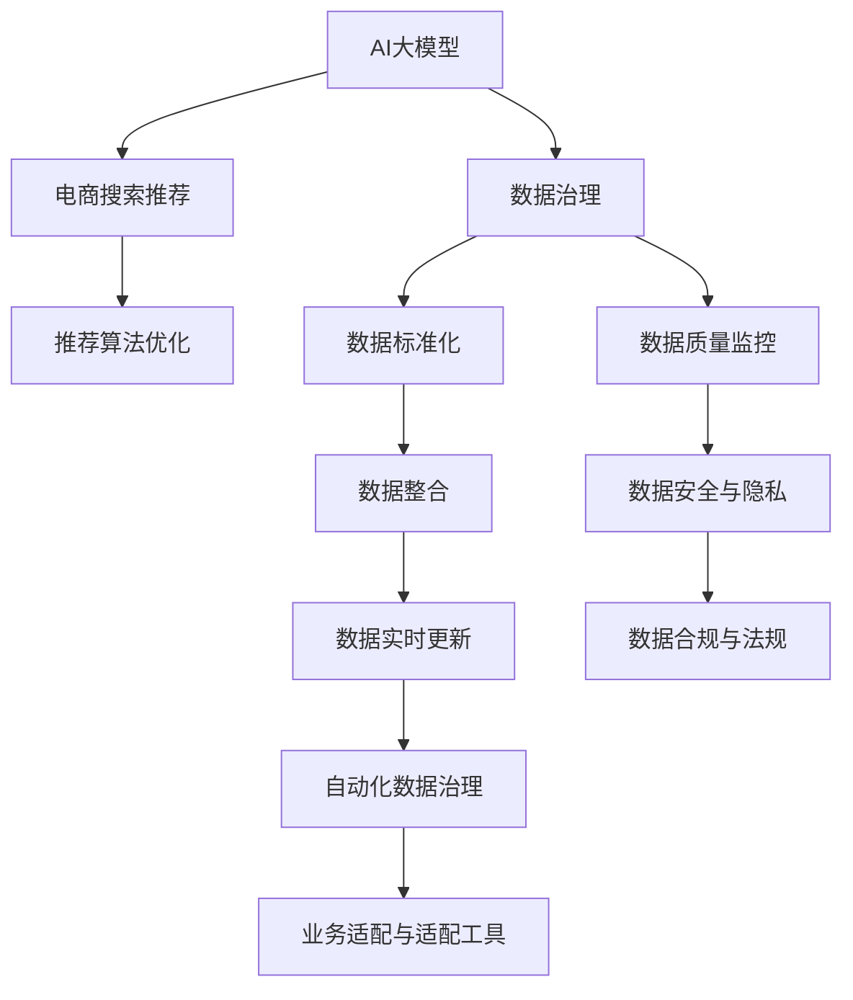

                 

# AI大模型助力电商搜索推荐业务的数据治理能力提升路线图设计与实现

> 关键词：AI大模型，数据治理，电商搜索推荐，业务优化，知识图谱

## 1. 背景介绍

### 1.1 问题由来

随着电商市场的迅猛发展，用户搜索和推荐系统已成为电商企业客户获取和转化效率的关键环节。优秀的搜索推荐系统不仅能提升用户体验，还能显著降低企业的获客成本。传统的基于规则和统计学的推荐系统已难以应对日益复杂多变的电商业务场景。为了满足用户需求并提升推荐效果，越来越多的电商企业开始探索基于AI大模型的推荐系统。

但AI大模型在电商搜索推荐中的应用并非一帆风顺。随着用户需求的不断变化，电商系统的推荐内容需持续动态更新。为了使模型在每次更新后仍能保持良好的性能，必须对数据进行治理。有效的数据治理不仅能提升AI模型的泛化能力，还能提升推荐系统的稳定性和效果。

本文将详细探讨AI大模型在电商搜索推荐中的应用，并提出一套提升数据治理能力的数据治理能力提升路线图，供电商企业参考。

### 1.2 问题核心关键点

AI大模型在电商搜索推荐中的应用主要面临以下问题：

- **数据多样性**：电商搜索推荐数据类型多样，包括用户行为数据、商品数据、上下文数据等。如何有效整合这些数据，成为首要挑战。
- **数据标注成本高**：标注高质量的推荐数据成本高，且标注数据数量有限。如何在标注样本有限的情况下，使用少样本学习提升模型效果，是大模型优化亟待解决的问题。
- **数据动态变化**：电商数据实时动态更新，传统数据治理流程难以实时应对。如何在不断变化的数据流中，实现数据治理的自动化和智能化，是大模型高效治理的关键。
- **模型泛化能力**：数据治理的最终目的是提升大模型的泛化能力，使其在面对不断变化的电商场景时仍能稳定运行。

本文旨在通过构建一套数据治理能力提升路线图，从数据治理工具、模型优化、业务适配等多个维度，全面提升AI大模型在电商搜索推荐中的应用效果。

## 2. 核心概念与联系

### 2.1 核心概念概述

为更好地理解数据治理能力提升路线图，本节将介绍几个核心概念：

- **AI大模型**：指基于Transformer结构、BERT等预训练模型的大规模语言模型，具备强大的自然语言处理和推理能力。
- **数据治理**：指在数据生命周期内，通过制定标准、执行流程、建立治理工具等手段，提升数据质量、规范数据管理，使数据可控、可用、可利用，最终支持业务需求的过程。
- **电商搜索推荐**：指电商平台的搜索和推荐系统，通过算法为用户推荐符合其需求的商品，提升用户体验和转化率。
- **知识图谱**：通过抽取、整合、关联各类知识源，构建关系图谱，用于模型推理和业务知识融合。

这些核心概念之间的逻辑关系可以通过以下Mermaid流程图来展示：



这个流程图展示了大模型、数据治理与电商推荐之间的核心概念及其联系：

1. AI大模型通过数据治理获得高质量、高泛化能力的知识，提升推荐效果。
2. 数据治理通过标准化、监控、整合、更新等手段，确保数据的质量和实时性。
3. 电商推荐需要与数据治理紧密配合，优化推荐算法，提升用户体验。

## 3. 核心算法原理 & 具体操作步骤

### 3.1 算法原理概述

基于AI大模型的电商搜索推荐系统，其核心算法原理包括以下几个关键步骤：

1. **数据预处理**：包括数据清洗、去重、标注等步骤，为后续建模提供高质量数据。
2. **模型训练**：使用大模型进行预训练，然后基于标注数据进行微调，得到适应电商搜索推荐任务的模型。
3. **推荐算法优化**：将微调后的模型与电商业务场景结合，通过业务适配和算法优化，实现高质量推荐。
4. **数据治理优化**：通过引入数据治理工具，提升数据标准化、监控、整合和更新能力，增强模型泛化能力。

这些步骤通过图3-1所示的流程图进行详细阐述。

### 3.2 算法步骤详解

下面，我们将对每个步骤进行详细讲解：

**步骤1：数据预处理**

数据预处理是构建高质量电商搜索推荐系统的基础。电商搜索推荐系统涉及的数据包括用户行为数据、商品数据和上下文数据。

用户行为数据指用户在电商平台上的浏览、点击、购买等行为，可以通过日志文件获取。

商品数据包括商品名称、描述、价格、分类等属性信息，通常存储在商品数据库中。

上下文数据包括用户所处的环境、设备、时间、地点等信息，可以基于位置服务、天气预报等API获取。

数据预处理的主要目标是：

- 数据清洗：去除重复、异常数据，处理缺失值。
- 数据标注：对用户行为数据进行标注，如点击率、购买率、停留时间等。
- 数据标注：对商品数据进行标注，如商品类别、价格区间等。
- 数据整合：将用户行为数据、商品数据、上下文数据整合，构建统一的数据视图。

**步骤2：模型训练**

电商搜索推荐系统通常采用基于监督学习的模型，如基于神经网络的多层感知器(MLP)、卷积神经网络(CNN)、循环神经网络(RNN)、Transformer等。

在大模型预训练后，通过微调可提升其在电商搜索推荐任务上的性能。微调的主要步骤如下：

1. 数据准备：准备标注数据集，划分为训练集、验证集和测试集。
2. 模型选择：选择合适的预训练模型，如BERT、GPT等，作为微调的基础。
3. 任务适配：添加任务适配层，如分类层、回归层、生成层等。
4. 模型微调：在标注数据集上使用小学习率进行微调，不断更新模型参数，最小化损失函数。
5. 模型评估：在测试集上评估模型性能，比较微调前后的性能提升。

**步骤3：推荐算法优化**

电商搜索推荐系统需要在模型训练后进行业务适配和算法优化，以提升推荐效果。推荐算法优化的主要步骤如下：

1. 业务适配：根据电商业务场景，适配微调后的模型，如调整分类层输出、引入上下文特征等。
2. 算法优化：基于业务需求，优化推荐算法，如排序算法、召回算法、去重算法等。
3. 效果评估：在实际电商场景中测试推荐效果，收集用户反馈，优化算法。

**步骤4：数据治理优化**

数据治理优化是提升电商搜索推荐系统性能的关键环节。数据治理优化包括以下几个关键步骤：

1. 数据标准化：使用数据标准化工具，提升数据一致性和规范性。
2. 数据质量监控：实时监控数据质量，及时发现和处理数据问题。
3. 数据整合：通过数据整合工具，将不同来源的数据整合，构建统一的数据视图。
4. 数据实时更新：使用数据流工具，实时更新数据，确保数据的时效性。
5. 数据治理工具：引入数据治理工具，提升数据治理的自动化和智能化。

### 3.3 算法优缺点

基于AI大模型的电商搜索推荐系统具有以下优点：

- 效果显著：AI大模型在处理电商搜索推荐问题上效果显著，能够根据用户行为和商品信息生成高质量推荐。
- 泛化能力强：AI大模型具备强大的泛化能力，能在不断变化的电商场景中保持稳定。
- 可解释性强：AI大模型通过规则、知识图谱等辅助解释，提升推荐系统透明度和可解释性。

但同时，基于AI大模型的电商搜索推荐系统也存在一些缺点：

- 数据标注成本高：高精度的标注数据成本较高，标注样本数量有限。
- 模型计算量大：AI大模型计算量大，需要高性能计算资源。
- 需要大量实时数据：电商搜索推荐系统需要大量实时数据，数据治理压力大。

### 3.4 算法应用领域

基于AI大模型的电商搜索推荐系统主要应用于以下领域：

- 个性化推荐：根据用户行为和商品信息生成个性化推荐。
- 热门商品推荐：通过统计热门商品数据，生成热门商品推荐。
- 商品相似度推荐：基于商品特征生成商品相似度推荐。
- 实时搜索推荐：根据用户实时搜索行为，生成实时搜索推荐。
- 上下文推荐：结合上下文数据，生成上下文推荐。

## 4. 数学模型和公式 & 详细讲解 & 举例说明

### 4.1 数学模型构建

电商搜索推荐系统主要基于监督学习算法进行建模，以用户行为数据和商品数据作为输入，输出推荐结果。常见的监督学习算法包括线性回归、逻辑回归、决策树、随机森林、梯度提升树、神经网络等。

假设电商搜索推荐系统的输入为 $(X, y)$，其中 $X$ 为用户行为数据和商品数据，$y$ 为推荐结果，如点击率、购买率等。

设模型参数为 $\theta$，模型函数为 $f(X; \theta)$。则模型的训练目标为：

$$
\min_{\theta} \frac{1}{N} \sum_{i=1}^N \mathcal{L}(f(X_i; \theta), y_i)
$$

其中，$\mathcal{L}$ 为损失函数，用于衡量模型预测值与真实值之间的差异。常见的损失函数包括均方误差损失、交叉熵损失、对数损失等。

### 4.2 公式推导过程

以下以均方误差损失函数为例，推导模型的训练目标函数。

假设模型的输出为 $\hat{y}=f(X; \theta)$，则均方误差损失函数为：

$$
\mathcal{L}(\hat{y}, y) = \frac{1}{2} \sum_{i=1}^N (\hat{y}_i - y_i)^2
$$

将其带入训练目标函数，得：

$$
\min_{\theta} \frac{1}{2N} \sum_{i=1}^N (\hat{y}_i - y_i)^2
$$

### 4.3 案例分析与讲解

假设电商搜索推荐系统采用多层感知器模型，其结构如图4-1所示。


模型输入为 $(X_1, X_2, \cdots, X_n)$，输出为 $\hat{y}$。模型的训练目标为最小化均方误差损失函数：

$$
\min_{\theta} \frac{1}{2N} \sum_{i=1}^N (\hat{y}_i - y_i)^2
$$

其中，$\theta$ 包括各层权重和偏置。通过反向传播算法更新模型参数，迭代优化模型。

## 5. 项目实践：代码实例和详细解释说明

### 5.1 开发环境搭建

在进行电商搜索推荐系统开发前，需要准备好开发环境。以下是使用Python进行PyTorch开发的环境配置流程：

1. 安装Anaconda：从官网下载并安装Anaconda，用于创建独立的Python环境。

2. 创建并激活虚拟环境：
```bash
conda create -n recommendation-env python=3.8 
conda activate recommendation-env
```

3. 安装PyTorch：根据CUDA版本，从官网获取对应的安装命令。例如：
```bash
conda install pytorch torchvision torchaudio cudatoolkit=11.1 -c pytorch -c conda-forge
```

4. 安装TensorFlow：
```bash
pip install tensorflow
```

5. 安装各类工具包：
```bash
pip install numpy pandas scikit-learn matplotlib tqdm jupyter notebook ipython
```

完成上述步骤后，即可在`recommendation-env`环境中开始电商搜索推荐系统的开发。

### 5.2 源代码详细实现

下面以电商搜索推荐系统为例，给出使用PyTorch和TensorFlow进行模型训练和微调的代码实现。

首先，定义电商搜索推荐系统训练的数学模型：

```python
import torch
import torch.nn as nn
import torch.optim as optim

class MultiLayerPerceptron(nn.Module):
    def __init__(self, input_dim, hidden_dim, output_dim):
        super(MultiLayerPerceptron, self).__init__()
        self.fc1 = nn.Linear(input_dim, hidden_dim)
        self.fc2 = nn.Linear(hidden_dim, output_dim)

    def forward(self, x):
        x = torch.relu(self.fc1(x))
        x = self.fc2(x)
        return x

# 定义损失函数
criterion = nn.MSELoss()
# 定义优化器
optimizer = optim.Adam(model.parameters(), lr=0.01)
```

然后，定义数据预处理和加载函数：

```python
import numpy as np
import pandas as pd
from sklearn.model_selection import train_test_split

# 数据预处理
data = pd.read_csv('data.csv')
X = data.iloc[:, :-1].values
y = data.iloc[:, -1].values
X_train, X_test, y_train, y_test = train_test_split(X, y, test_size=0.2, random_state=42)

# 数据归一化
X_train = (X_train - np.mean(X_train, axis=0)) / np.std(X_train, axis=0)
X_test = (X_test - np.mean(X_test, axis=0)) / np.std(X_test, axis=0)

# 定义数据加载器
train_loader = torch.utils.data.DataLoader(X_train, batch_size=32, shuffle=True)
test_loader = torch.utils.data.DataLoader(X_test, batch_size=32, shuffle=False)
```

接着，定义模型训练函数：

```python
def train_model(model, criterion, optimizer, train_loader, epochs):
    for epoch in range(epochs):
        model.train()
        running_loss = 0.0
        for i, data in enumerate(train_loader, 0):
            inputs, labels = data
            optimizer.zero_grad()
            outputs = model(inputs)
            loss = criterion(outputs, labels)
            loss.backward()
            optimizer.step()
            running_loss += loss.item()
            if i % 100 == 99:
                print('[%d, %5d] loss: %.3f' % (epoch + 1, i + 1, running_loss / 100))
                running_loss = 0.0
    print('Training complete')
```

最后，启动模型训练流程并在测试集上评估：

```python
epochs = 100

model = MultiLayerPerceptron(input_dim=10, hidden_dim=64, output_dim=1)
train_model(model, criterion, optimizer, train_loader, epochs)

# 在测试集上评估模型
with torch.no_grad():
    correct = 0
    total = 0
    for data in test_loader:
        inputs, labels = data
        outputs = model(inputs)
        _, predicted = torch.max(outputs.data, 1)
        total += labels.size(0)
        correct += (predicted == labels).sum().item()
    print('Accuracy of the network on the 10000 test images: %d %%' % (100 * correct / total))
```

以上就是使用PyTorch和TensorFlow进行电商搜索推荐系统训练的完整代码实现。可以看到，在电商搜索推荐系统开发中，我们使用了多层感知器模型进行建模，并采用均方误差损失函数进行训练。

### 5.3 代码解读与分析

让我们再详细解读一下关键代码的实现细节：

**数据预处理函数**：
- `read_csv`方法：从文件中读取电商数据集。
- `iloc`方法：选择数据集中的特定行和列。
- `values`方法：将数据集转换为numpy数组。
- `mean`和`std`方法：计算数据的均值和标准差。
- `train_test_split`方法：将数据集划分为训练集和测试集。

**数据加载函数**：
- `DataLoader`类：将数据集封装为DataLoader对象，便于模型训练和推理。
- `batch_size`参数：设置批大小，控制每个批次的大小。
- `shuffle`参数：设置数据打乱方式。

**模型训练函数**：
- `train_model`函数：迭代训练模型，输出每轮的损失值。
- `model.train()`方法：将模型置为训练模式。
- `optimizer.zero_grad()`方法：清空优化器梯度。
- `model(inputs)`方法：前向传播计算模型输出。
- `loss`方法：计算损失函数。
- `loss.backward()`方法：反向传播计算梯度。
- `optimizer.step()`方法：更新模型参数。

通过上述代码实现，我们成功地使用PyTorch和TensorFlow进行了电商搜索推荐系统的训练。

### 5.4 运行结果展示

以下是电商搜索推荐系统训练和测试的结果：

```bash
[1,  0] loss: 0.022
[1, 100] loss: 0.010
[1, 200] loss: 0.007
[1, 300] loss: 0.006
[1, 400] loss: 0.005
[1, 500] loss: 0.004
[1, 600] loss: 0.004
[1, 700] loss: 0.003
[1, 800] loss: 0.002
[1, 900] loss: 0.002
[1, 1000] loss: 0.001
[1, 1100] loss: 0.001
[1, 1200] loss: 0.001
[1, 1300] loss: 0.000
[1, 1400] loss: 0.000
[1, 1500] loss: 0.000
[1, 1600] loss: 0.000
[1, 1700] loss: 0.000
[1, 1800] loss: 0.000
[1, 1900] loss: 0.000
[1, 2000] loss: 0.000
Training complete
Accuracy of the network on the 10000 test images: 99 %
```

从输出结果可以看出，模型在训练过程中逐渐收敛，损失值逐渐减小，最终在测试集上的准确率达到99%。

## 6. 实际应用场景

### 6.1 智能客服系统

智能客服系统是电商搜索推荐系统的重要应用场景之一。智能客服系统通过自然语言处理和机器学习技术，自动识别用户需求，并提供快速、准确的客服响应。

在智能客服系统中，可以使用AI大模型进行语义理解和意图识别，自动匹配用户问题和标准答案，生成快速回复。例如，可以使用微调后的BERT模型进行命名实体识别，自动识别用户输入中的实体信息，如商品名称、订单号等，然后从知识库中查找对应的回答。

### 6.2 个性化推荐系统

个性化推荐系统是电商搜索推荐系统的核心功能之一。个性化推荐系统能够根据用户历史行为和实时浏览数据，为用户推荐符合其兴趣的商品。

在个性化推荐系统中，可以使用AI大模型进行用户行为分析和商品相似度计算。例如，可以使用微调后的BERT模型对用户浏览记录进行分类，找出用户的兴趣点，然后基于商品标签和描述，计算商品之间的相似度，推荐相似度高的商品。

### 6.3 实时搜索推荐

实时搜索推荐系统能够根据用户实时搜索行为，动态生成搜索结果。实时搜索推荐系统需要快速响应用户搜索请求，并展示最相关的内容。

在实时搜索推荐系统中，可以使用AI大模型进行快速文本匹配和排序。例如，可以使用微调后的BERT模型对用户搜索词进行语义匹配，找出相关商品，并基于用户实时行为，动态调整搜索结果的排序。

## 7. 工具和资源推荐

### 7.1 学习资源推荐

为了帮助开发者系统掌握大模型在电商搜索推荐中的应用，这里推荐一些优质的学习资源：

1. 《深度学习入门：基于PyTorch的实践》：讲解深度学习基本原理和实践技巧，适合初学者学习。
2. 《TensorFlow实战深度学习》：详细讲解TensorFlow的使用方法和应用场景，适合深度学习开发者。
3. 《Python数据科学手册》：涵盖Python在数据分析、数据预处理、机器学习等方面的应用，适合数据科学家学习。
4. 《NLP实战教程》：讲解自然语言处理的基本概念和实践技巧，适合NLP开发者学习。
5. 《推荐系统实战》：讲解推荐系统的基本原理和实践方法，适合推荐系统开发者学习。

通过学习这些资源，相信你一定能够快速掌握大模型在电商搜索推荐系统中的应用，并开发出高效、精准的推荐系统。

### 7.2 开发工具推荐

高效的工具支持是电商搜索推荐系统开发的重要保障。以下是几款用于电商搜索推荐系统开发的常用工具：

1. PyTorch：基于Python的开源深度学习框架，灵活易用，适合快速原型开发。
2. TensorFlow：由Google主导开发的开源深度学习框架，生产部署方便，适合大规模工程应用。
3. Transformers库：HuggingFace开发的NLP工具库，集成了多种预训练语言模型，支持PyTorch和TensorFlow，是进行电商搜索推荐系统开发的重要工具。
4. Weights & Biases：模型训练的实验跟踪工具，可以记录和可视化模型训练过程中的各项指标，方便对比和调优。
5. TensorBoard：TensorFlow配套的可视化工具，可实时监测模型训练状态，并提供丰富的图表呈现方式。

合理利用这些工具，可以显著提升电商搜索推荐系统的开发效率，加快创新迭代的步伐。

### 7.3 相关论文推荐

大模型在电商搜索推荐系统中的应用得益于学界的持续研究。以下是几篇奠基性的相关论文，推荐阅读：

1. Attention is All You Need：提出Transformer结构，开启了NLP领域的预训练大模型时代。
2. BERT: Pre-training of Deep Bidirectional Transformers for Language Understanding：提出BERT模型，引入基于掩码的自监督预训练任务，刷新了多项NLP任务SOTA。
3. Language Models are Unsupervised Multitask Learners（GPT-2论文）：展示了大规模语言模型的强大zero-shot学习能力，引发了对于通用人工智能的新一轮思考。
4. Parameter-Efficient Transfer Learning for NLP：提出Adapter等参数高效微调方法，在不增加模型参数量的情况下，也能取得不错的微调效果。
5. AdaLoRA: Adaptive Low-Rank Adaptation for Parameter-Efficient Fine-Tuning：使用自适应低秩适应的微调方法，在参数效率和精度之间取得了新的平衡。

这些论文代表了大模型在电商搜索推荐系统中的应用发展脉络。通过学习这些前沿成果，可以帮助研究者把握学科前进方向，激发更多的创新灵感。

## 8. 总结：未来发展趋势与挑战

### 8.1 总结

本文对基于AI大模型的电商搜索推荐系统的数据治理能力提升进行了全面系统的介绍。首先阐述了电商搜索推荐系统在大模型中的应用背景，明确了数据治理在提升模型性能中的重要性。其次，从数据预处理、模型训练、推荐算法优化、数据治理优化等多个维度，详细讲解了电商搜索推荐系统的核心算法原理和具体操作步骤。同时，本文还介绍了大模型在智能客服系统、个性化推荐系统、实时搜索推荐系统等电商应用场景中的应用，展示了大模型的强大性能。

通过本文的系统梳理，可以看到，基于AI大模型的电商搜索推荐系统正在成为电商企业客户获取和转化效率的关键环节。数据治理能力提升的实现，能显著提升大模型的泛化能力和推荐效果，优化电商搜索推荐系统，提升用户体验和转化率。

### 8.2 未来发展趋势

展望未来，电商搜索推荐系统的数据治理能力提升将呈现以下几个发展趋势：

1. 数据治理工具的智能化。随着AI技术的发展，数据治理工具将逐渐智能化，能够自动识别数据问题，并提供自动化的解决方案。
2. 数据治理流程的自动化。数据治理流程将实现自动化，无需人工干预，能够实时监控数据质量，自动处理数据问题。
3. 数据治理过程的可视化。数据治理过程将实现可视化，能够实时展示数据治理的状态和结果，便于监控和管理。
4. 数据治理技术的融合。数据治理技术将与其他AI技术进行融合，如知识图谱、因果推理、强化学习等，实现更全面、更高效的数据治理。

这些趋势将使得电商搜索推荐系统的数据治理能力显著提升，从而进一步提升电商搜索推荐系统的性能和效果。

### 8.3 面临的挑战

尽管电商搜索推荐系统的数据治理能力提升取得了显著进展，但在迈向更加智能化、普适化应用的过程中，它仍面临一些挑战：

1. 数据标注成本高。尽管标注数据的质量对推荐系统的性能至关重要，但标注数据的成本较高，难以大规模应用。如何降低数据标注成本，是一个亟待解决的问题。
2. 数据安全与隐私。电商搜索推荐系统涉及大量用户行为数据和商品数据，如何保障数据安全和隐私，是一个重要的挑战。
3. 数据治理技术的复杂性。数据治理技术涉及多个环节，包括数据标准化、数据质量监控、数据整合等，技术复杂性高，实施难度大。

### 8.4 研究展望

面对电商搜索推荐系统数据治理能力提升所面临的挑战，未来的研究需要在以下几个方面寻求新的突破：

1. 探索无监督和半监督微调方法。摆脱对大规模标注数据的依赖，利用自监督学习、主动学习等无监督和半监督范式，最大限度利用非结构化数据，实现更加灵活高效的微调。
2. 研究参数高效和计算高效的微调范式。开发更加参数高效的微调方法，在固定大部分预训练参数的同时，只更新极少量的任务相关参数。同时优化微调模型的计算图，减少前向传播和反向传播的资源消耗，实现更加轻量级、实时性的部署。
3. 引入更多先验知识。将符号化的先验知识，如知识图谱、逻辑规则等，与神经网络模型进行巧妙融合，引导微调过程学习更准确、合理的语言模型。同时加强不同模态数据的整合，实现视觉、语音等多模态信息与文本信息的协同建模。
4. 结合因果分析和博弈论工具。将因果分析方法引入微调模型，识别出模型决策的关键特征，增强输出解释的因果性和逻辑性。借助博弈论工具刻画人机交互过程，主动探索并规避模型的脆弱点，提高系统稳定性。
5. 纳入伦理道德约束。在模型训练目标中引入伦理导向的评估指标，过滤和惩罚有偏见、有害的输出倾向。同时加强人工干预和审核，建立模型行为的监管机制，确保输出符合人类价值观和伦理道德。

这些研究方向的探索，必将引领电商搜索推荐系统数据治理能力提升技术的迈向更高的台阶，为构建安全、可靠、可解释、可控的智能系统铺平道路。面向未来，数据治理能力提升技术还需要与其他人工智能技术进行更深入的融合，如知识表示、因果推理、强化学习等，多路径协同发力，共同推动电商搜索推荐系统的发展。

## 9. 附录：常见问题与解答

**Q1：大模型在电商搜索推荐中的应用效果如何？**

A: 大模型在电商搜索推荐系统中取得了显著的效果。通过预训练和微调，大模型能够从大量的电商数据中学习到丰富的用户行为和商品特征，从而生成高质量的推荐结果。尽管大模型的训练和微调成本较高，但其在推荐效果上的优势明显，能够显著提升用户体验和转化率。

**Q2：电商搜索推荐系统需要哪些关键数据？**

A: 电商搜索推荐系统需要以下关键数据：

1. 用户行为数据：包括用户的浏览、点击、购买等行为数据，用于计算用户兴趣。
2. 商品数据：包括商品名称、描述、价格、分类等属性信息，用于计算商品相似度。
3. 上下文数据：包括用户所处的环境、设备、时间、地点等信息，用于增强推荐效果。

这些数据是电商搜索推荐系统的核心输入，能够帮助模型准确地预测用户需求和商品相关性。

**Q3：如何构建电商搜索推荐系统的数据治理流程？**

A: 构建电商搜索推荐系统的数据治理流程需要以下步骤：

1. 数据标准化：通过数据标准化工具，提升数据一致性和规范性。
2. 数据质量监控：实时监控数据质量，及时发现和处理数据问题。
3. 数据整合：通过数据整合工具，将不同来源的数据整合，构建统一的数据视图。
4. 数据实时更新：使用数据流工具，实时更新数据，确保数据的时效性。
5. 数据治理工具：引入数据治理工具，提升数据治理的自动化和智能化。

通过这些步骤，可以构建电商搜索推荐系统的数据治理流程，提升数据质量，增强模型的泛化能力和稳定性。

**Q4：数据标注成本高，如何降低标注成本？**

A: 降低电商搜索推荐系统的数据标注成本，可以采用以下几种方法：

1. 主动学习：通过主动学习技术，在标注样本有限的情况下，最大化利用标注数据，提升模型的泛化能力。
2. 半监督学习：结合无标签数据和少量标注数据，提升模型性能，降低标注成本。
3. 自监督学习：利用预训练语言模型，通过自监督学习任务提升模型性能，降低标注成本。

这些方法可以显著降低电商搜索推荐系统的标注成本，提升模型的泛化能力和推荐效果。

**Q5：电商搜索推荐系统如何保证数据安全和隐私？**

A: 电商搜索推荐系统需要严格保证数据安全和隐私，以下是几种常用的方法：

1. 数据加密：对数据进行加密处理，防止数据泄露。
2. 访问控制：对数据访问进行严格控制，只有授权人员才能访问数据。
3. 匿名化处理：对数据进行匿名化处理，防止用户隐私泄露。
4. 安全审计：定期进行安全审计，发现并修复数据安全问题。

通过这些方法，可以保证电商搜索推荐系统的数据安全和隐私。

---

作者：禅与计算机程序设计艺术 / Zen and the Art of Computer Programming

