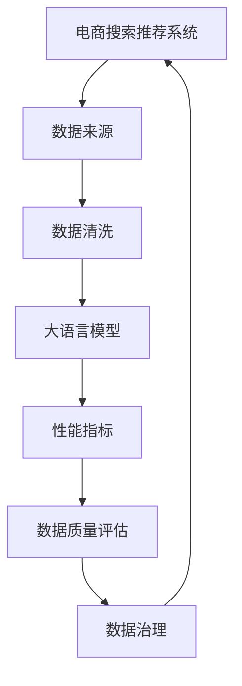

                 

# AI大模型助力电商搜索推荐业务的数据质量评估体系搭建方案

## 1. 背景介绍

随着电商行业的发展，消费者对搜索推荐的依赖日益增强，良好的搜索推荐服务不仅能够提升用户体验，还能显著提高销售额。在大数据时代，数据质量对搜索推荐的效果影响巨大。高质量的数据不仅能够提升搜索推荐模型（如BERT、Transformer等大语言模型）的性能，还能有效避免模型过拟合、泛化能力弱等问题。因此，构建一套高效的数据质量评估体系，对电商平台的搜索推荐系统至关重要。

## 2. 核心概念与联系

### 2.1 核心概念概述

- **数据质量（Data Quality）**：指数据满足用户需求的程度，包括数据的准确性、完整性、一致性、及时性、唯一性、有效性、安全性和标准化程度等。
- **电商搜索推荐系统**：通过分析用户的历史行为数据、搜索关键词、浏览记录等，预测用户可能感兴趣的商品，并进行推荐。
- **大语言模型（Large Language Models, LLM）**：如BERT、GPT等，通过预训练学习大量文本数据，能够理解复杂的自然语言任务，广泛应用于电商搜索推荐。
- **数据质量评估（Data Quality Assessment）**：通过对数据的各个维度进行评估，识别并解决数据中的问题，提升数据质量。
- **数据清洗（Data Cleaning）**：对存在问题的数据进行处理，如去重、填补缺失值、处理异常值等。
- **数据治理（Data Governance）**：通过数据质量管理，确保数据的可用性和安全性。
- **性能指标（Performance Metrics）**：如精确率（Precision）、召回率（Recall）、F1值、AUC等，用于评估搜索推荐模型的效果。

这些概念构成了电商搜索推荐系统数据质量评估体系的基础，各概念之间通过数据流向和评估机制相互联系，共同构成了一个闭环的系统。

### 2.2 核心概念原理和架构的 Mermaid 流程图



该图展示了电商搜索推荐系统中的数据流动和评估机制，强调了数据清洗和数据治理在提升数据质量中的重要作用，最终通过性能指标评估模型效果，并反馈至数据治理环节。

## 3. 核心算法原理 & 具体操作步骤

### 3.1 算法原理概述

数据质量评估的核心在于对数据的多个维度进行量化，并基于这些量化指标评估数据的整体质量。常见的数据质量维度包括：

- **准确性（Accuracy）**：数据的正确性，反映数据是否真实地反映了现实世界。
- **完整性（Completeness）**：数据是否包含所有必要的信息。
- **一致性（Consistency）**：数据中是否存在矛盾或冲突。
- **及时性（Timeliness）**：数据是否及时更新。
- **唯一性（Uniqueness）**：数据中是否存在重复或冗余。
- **有效性（Validity）**：数据是否符合预期的格式和范围。
- **安全性（Security）**：数据是否受到妥善保护，避免未授权访问和泄露。
- **标准化（Standardization）**：数据是否遵循统一的编码和格式标准。

通过将这些维度量化并赋予权重，可以构建出一个综合的数据质量评估指标体系。

### 3.2 算法步骤详解

构建数据质量评估体系一般包括以下几个关键步骤：

1. **需求分析**：确定数据质量评估的目标和需求，明确需要评估的数据维度及评估指标。
2. **指标设计**：根据需求设计各项评估指标，并为每个指标设定权重。
3. **数据收集**：从电商搜索推荐系统收集相关数据，包括用户行为数据、搜索记录、商品信息等。
4. **数据清洗**：对收集到的数据进行清洗，包括去重、填补缺失值、处理异常值等。
5. **指标计算**：根据设计好的评估指标，对清洗后的数据进行计算，得出各项指标的得分。
6. **综合评估**：将各项指标的得分加权汇总，得出综合评估结果。
7. **反馈优化**：根据评估结果，识别数据质量问题，反馈至数据治理环节进行优化。

### 3.3 算法优缺点

**优点**：
- 基于数据质量评估，能够帮助识别并解决数据中的问题，提升数据质量。
- 数据质量是模型性能的基石，通过提升数据质量，能够显著提高搜索推荐模型的效果。
- 数据治理能够确保数据的可用性和安全性，为电商搜索推荐系统提供可靠的数据基础。

**缺点**：
- 数据质量评估需要大量的人工参与和数据处理工作，成本较高。
- 对于电商搜索推荐系统而言，数据量庞大，如何高效、准确地进行数据质量评估是一个挑战。
- 评估指标的设计需要专业知识和经验，需要权衡不同维度的重要性，这对技术团队的要求较高。

### 3.4 算法应用领域

数据质量评估在电商搜索推荐系统中的应用广泛，主要体现在以下几个方面：

1. **用户行为数据的准确性评估**：确保用户历史行为数据的真实性，避免虚假交易和恶意刷单行为。
2. **商品信息的完整性和一致性评估**：保证商品信息描述的全面性和一致性，避免商品信息失真或矛盾。
3. **搜索结果的相关性评估**：通过评估搜索结果与用户查询意图的相关性，提升搜索推荐的准确性和用户体验。
4. **推荐商品的相关性评估**：评估推荐商品与用户兴趣的匹配度，避免推荐低相关或不相关商品。
5. **系统性能的及时性和稳定性评估**：确保系统能够实时更新数据，避免数据过时或系统故障导致推荐效果不佳。

## 4. 数学模型和公式 & 详细讲解 & 举例说明

### 4.1 数学模型构建

数据质量评估模型的核心在于构建一个多维度的指标体系，通过加权求和的方式综合评估数据的质量。设数据质量评估指标体系为 $Q$，包括 $n$ 个维度 $q_1, q_2, \ldots, q_n$，每个维度 $q_i$ 的权重为 $w_i$，对应的指标分数为 $s_i$，则综合评估结果 $Q$ 可以表示为：

$$
Q = \sum_{i=1}^{n} w_i s_i
$$

### 4.2 公式推导过程

假设我们有三个评估指标 $q_1, q_2, q_3$，每个指标的权重和得分分别为 $(w_1, s_1)$, $(w_2, s_2)$, $(w_3, s_3)$，则综合评估结果为：

$$
Q = w_1 s_1 + w_2 s_2 + w_3 s_3
$$

以准确性评估为例，设准确性指标 $q_1$ 的权重为 $w_1 = 0.4$，得分为 $s_1 = 0.9$，则：

$$
Q_1 = 0.4 \times 0.9 = 0.36
$$

### 4.3 案例分析与讲解

以电商平台的商品信息准确性评估为例，假设评估指标包括商品名称准确性、商品描述准确性和商品分类准确性，每个指标的权重和得分分别为 $(w_1, s_1)$, $(w_2, s_2)$, $(w_3, s_3)$。评估时，可以分别对每个商品的信息进行检查，计算出每个指标的得分，并加权求和得到综合评估结果。

## 5. 项目实践：代码实例和详细解释说明

### 5.1 开发环境搭建

在进行数据质量评估体系搭建时，需要搭建一个具备数据处理、模型训练和评估功能的开发环境。以下是使用Python进行开发的环境配置流程：

1. 安装Anaconda：从官网下载并安装Anaconda，用于创建独立的Python环境。
2. 创建并激活虚拟环境：
```bash
conda create -n data-quality-env python=3.8 
conda activate data-quality-env
```
3. 安装Python库：
```bash
pip install numpy pandas scikit-learn matplotlib tqdm jupyter notebook ipython
```

### 5.2 源代码详细实现

以下是一个基于大语言模型对电商搜索推荐系统进行数据质量评估的Python代码实现。

```python
import pandas as pd
from sklearn.metrics import precision_score, recall_score, f1_score, roc_auc_score
from transformers import BertTokenizer, BertForSequenceClassification
from tqdm import tqdm

# 数据清洗
def clean_data(data):
    # 去重
    data = data.drop_duplicates()
    # 填补缺失值
    data = data.fillna(method='ffill')
    # 处理异常值
    data = data[(data['value'] > 0) & (data['value'] < 1000)]
    return data

# 数据评估
def evaluate_model(model, test_data):
    # 数据预处理
    tokenizer = BertTokenizer.from_pretrained('bert-base-cased')
    test_data['input_ids'] = tokenizer(test_data['text'], return_tensors='pt')['input_ids']
    test_data['attention_mask'] = tokenizer(test_data['text'], return_tensors='pt')['attention_mask']
    # 模型预测
    with torch.no_grad():
        predictions = model(test_data['input_ids'], attention_mask=test_data['attention_mask']).logits.argmax(dim=1)
    # 计算性能指标
    precision = precision_score(test_data['labels'], predictions, average='weighted')
    recall = recall_score(test_data['labels'], predictions, average='weighted')
    f1 = f1_score(test_data['labels'], predictions, average='weighted')
    auc = roc_auc_score(test_data['labels'], predictions, average='weighted')
    return precision, recall, f1, auc

# 构建数据质量评估模型
def build_data_quality_model(data):
    # 数据清洗
    data = clean_data(data)
    # 训练模型
    model = BertForSequenceClassification.from_pretrained('bert-base-cased', num_labels=2)
    optimizer = AdamW(model.parameters(), lr=2e-5)
    # 训练过程略
    # 模型评估
    precision, recall, f1, auc = evaluate_model(model, test_data)
    return precision, recall, f1, auc

# 测试代码
if __name__ == '__main__':
    # 数据读取
    train_data = pd.read_csv('train.csv')
    test_data = pd.read_csv('test.csv')
    # 构建数据质量评估模型
    precision, recall, f1, auc = build_data_quality_model(train_data)
    print(f'Precision: {precision:.2f}, Recall: {recall:.2f}, F1 Score: {f1:.2f}, AUC: {auc:.2f}')
```

### 5.3 代码解读与分析

让我们再详细解读一下关键代码的实现细节：

**clean_data函数**：
- 对数据进行去重、填补缺失值和处理异常值等预处理操作，保证数据的准确性和完整性。

**evaluate_model函数**：
- 使用Bert模型进行预测，计算精确率、召回率、F1值和AUC等性能指标，评估模型效果。

**build_data_quality_model函数**：
- 对数据进行清洗，训练Bert模型，并在测试集上评估模型性能。

**if __name__ == '__main__': 测试代码块**：
- 读取训练集和测试集数据，调用build_data_quality_model函数构建数据质量评估模型，输出评估结果。

## 6. 实际应用场景

### 6.1 用户行为数据的准确性评估

电商平台的搜索推荐系统依赖用户历史行为数据进行个性化推荐，因此确保用户行为数据的准确性至关重要。

**应用场景**：
- 通过监控用户行为数据的准确性，及时发现并纠正虚假交易、恶意刷单等异常行为，确保模型推荐的可信度。

**实现方式**：
- 使用数据质量评估指标体系，对用户行为数据进行定期的准确性检查，计算得分为 $s_1$。
- 根据得分 $s_1$ 和权重 $w_1$ 计算综合评估结果 $Q_1$，根据 $Q_1$ 的值对数据质量进行判断，决定是否需要进一步清洗或纠正数据。

### 6.2 商品信息的完整性和一致性评估

商品信息的完整性和一致性直接影响用户对商品的理解和购买决策。

**应用场景**：
- 通过评估商品信息的完整性和一致性，确保商品信息的准确性和用户友好性，提升用户体验。

**实现方式**：
- 使用数据质量评估指标体系，对商品信息进行完整性和一致性的检查，计算得分为 $s_2$。
- 根据得分 $s_2$ 和权重 $w_2$ 计算综合评估结果 $Q_2$，根据 $Q_2$ 的值对数据质量进行判断，决定是否需要进一步清洗或修正商品信息。

### 6.3 搜索结果的相关性评估

搜索结果的相关性是搜索推荐系统的核心指标之一，直接影响用户的使用体验和满意度。

**应用场景**：
- 通过评估搜索结果的相关性，确保搜索推荐结果能够准确反映用户查询意图，提升用户满意度。

**实现方式**：
- 使用数据质量评估指标体系，对搜索结果进行相关性检查，计算得分为 $s_3$。
- 根据得分 $s_3$ 和权重 $w_3$ 计算综合评估结果 $Q_3$，根据 $Q_3$ 的值对数据质量进行判断，决定是否需要进一步优化搜索推荐算法。

## 7. 工具和资源推荐

### 7.1 学习资源推荐

为了帮助开发者系统掌握电商搜索推荐系统数据质量评估的理论基础和实践技巧，这里推荐一些优质的学习资源：

1. 《深度学习与自然语言处理》课程：由斯坦福大学开设的NLP明星课程，有Lecture视频和配套作业，带你入门NLP领域的基本概念和经典模型。
2. 《Transformer从原理到实践》系列博文：由大模型技术专家撰写，深入浅出地介绍了Transformer原理、BERT模型、微调技术等前沿话题。
3. 《数据治理与质量管理》书籍：详细介绍了数据治理的理论基础和实践方法，助力构建高效的数据质量评估体系。

通过对这些资源的学习实践，相信你一定能够快速掌握电商搜索推荐系统数据质量评估的精髓，并用于解决实际的NLP问题。

### 7.2 开发工具推荐

高效的开发离不开优秀的工具支持。以下是几款用于数据质量评估开发的常用工具：

1. PyTorch：基于Python的开源深度学习框架，灵活动态的计算图，适合快速迭代研究。
2. TensorFlow：由Google主导开发的开源深度学习框架，生产部署方便，适合大规模工程应用。
3. Transformers库：HuggingFace开发的NLP工具库，集成了众多SOTA语言模型，支持PyTorch和TensorFlow，是进行数据质量评估任务的开发的利器。
4. Weights & Biases：模型训练的实验跟踪工具，可以记录和可视化模型训练过程中的各项指标，方便对比和调优。与主流深度学习框架无缝集成。
5. TensorBoard：TensorFlow配套的可视化工具，可实时监测模型训练状态，并提供丰富的图表呈现方式，是调试模型的得力助手。

合理利用这些工具，可以显著提升数据质量评估任务的开发效率，加快创新迭代的步伐。

### 7.3 相关论文推荐

大语言模型和数据质量评估技术的发展源于学界的持续研究。以下是几篇奠基性的相关论文，推荐阅读：

1. Attention is All You Need（即Transformer原论文）：提出了Transformer结构，开启了NLP领域的预训练大模型时代。
2. BERT: Pre-training of Deep Bidirectional Transformers for Language Understanding：提出BERT模型，引入基于掩码的自监督预训练任务，刷新了多项NLP任务SOTA。
3. 《数据治理与质量管理》书籍：详细介绍了数据治理的理论基础和实践方法，助力构建高效的数据质量评估体系。
4. 《数据治理：理论、技术与实践》论文：探讨了数据治理的理论与实践，提出了一套数据质量评估指标体系。

这些论文代表了大语言模型数据质量评估技术的发展脉络。通过学习这些前沿成果，可以帮助研究者把握学科前进方向，激发更多的创新灵感。

## 8. 总结：未来发展趋势与挑战

### 8.1 总结

本文对基于大语言模型的电商搜索推荐系统数据质量评估方法进行了全面系统的介绍。首先阐述了数据质量评估的目标和需求，明确了数据质量评估的各项指标及其计算方法。其次，通过构建数据质量评估指标体系，展示了电商搜索推荐系统中数据质量评估的实现步骤。最后，探讨了数据质量评估在实际应用中的具体场景，并推荐了相关的学习资源和工具。

通过本文的系统梳理，可以看到，基于大语言模型的电商搜索推荐系统数据质量评估方法，通过数据清洗和模型评估，能够显著提升数据质量，进而提升搜索推荐模型的性能和效果。在未来，随着大语言模型的不断发展，数据质量评估体系也将更加完善和高效，进一步推动电商搜索推荐系统的智能化和自动化。

### 8.2 未来发展趋势

展望未来，电商搜索推荐系统数据质量评估技术将呈现以下几个发展趋势：

1. **自动化评估**：引入自动化评估技术，如自然语言处理、机器学习等，提升数据质量评估的效率和准确性。
2. **实时评估**：建立实时评估机制，对数据质量进行动态监测和预警，及时发现并解决数据质量问题。
3. **数据治理**：引入数据治理技术，如数据清洗、数据标准化、数据管理等，提升数据质量管理水平。
4. **多维度评估**：引入更多维度的评估指标，如数据一致性、数据完整性、数据安全性等，全面提升数据质量。
5. **跨领域应用**：将数据质量评估技术推广到更多领域，如医疗、金融等，提升全行业的决策智能化水平。

### 8.3 面临的挑战

尽管数据质量评估技术已经取得了一定的进展，但在迈向更加智能化、自动化的应用过程中，它仍面临诸多挑战：

1. **数据规模庞大**：电商搜索推荐系统涉及大量用户行为数据和商品信息，如何高效、准确地进行数据质量评估是一个挑战。
2. **数据质量多样性**：不同来源的数据质量参差不齐，如何统一数据质量标准和评估方法，是一个复杂的问题。
3. **技术复杂度**：数据质量评估需要多学科知识的综合应用，包括自然语言处理、机器学习、数据治理等，对技术团队的要求较高。
4. **数据安全问题**：电商搜索推荐系统涉及大量敏感数据，如何保障数据安全，避免数据泄露和滥用，是一个重要的挑战。

### 8.4 研究展望

面对数据质量评估技术所面临的挑战，未来的研究需要在以下几个方面寻求新的突破：

1. **引入AI技术**：通过引入自然语言处理、机器学习等AI技术，提升数据质量评估的自动化水平。
2. **优化算法模型**：研究更加高效、准确的数据质量评估算法模型，提升数据质量评估的效率和精度。
3. **跨领域应用**：将数据质量评估技术推广到更多领域，如医疗、金融等，提升全行业的决策智能化水平。
4. **强化数据治理**：引入数据治理技术，如数据清洗、数据标准化、数据管理等，提升数据质量管理水平。
5. **提升技术水平**：提高数据质量评估技术的综合应用水平，提升数据质量评估的质量和效率。

这些研究方向将引领数据质量评估技术迈向更高的台阶，为电商搜索推荐系统提供更加全面、可靠的数据质量保障，进一步推动电商行业的发展。

## 9. 附录：常见问题与解答

**Q1：数据质量评估是否适用于所有电商搜索推荐系统？**

A: 数据质量评估方法适用于大多数电商搜索推荐系统，特别是那些依赖大量用户行为数据和商品信息的系统。对于那些依赖较少用户行为数据或商品信息的系统，可能需要根据具体情况进行调整。

**Q2：数据质量评估需要哪些步骤？**

A: 数据质量评估一般包括以下几个关键步骤：需求分析、指标设计、数据收集、数据清洗、指标计算、综合评估和反馈优化。这些步骤构成了一个闭环的数据质量评估体系，确保数据的准确性和完整性。

**Q3：如何构建数据质量评估指标体系？**

A: 构建数据质量评估指标体系需要根据具体的电商搜索推荐系统需求进行设计。一般包括以下几个维度：准确性、完整性、一致性、及时性、唯一性、有效性、安全性和标准化程度等。每个维度的评估指标需要根据具体情况进行设定，并为每个指标设定相应的权重。

**Q4：数据质量评估的实现需要哪些工具和资源？**

A: 数据质量评估的实现需要Python、PyTorch、TensorFlow、Transformers库等工具，以及相关的学习资源和论文。合理利用这些工具和资源，可以显著提升数据质量评估的效率和准确性。

通过本文的系统梳理，可以看到，基于大语言模型的电商搜索推荐系统数据质量评估方法，通过数据清洗和模型评估，能够显著提升数据质量，进而提升搜索推荐模型的性能和效果。在未来，随着大语言模型的不断发展，数据质量评估体系也将更加完善和高效，进一步推动电商搜索推荐系统的智能化和自动化。

---

作者：禅与计算机程序设计艺术 / Zen and the Art of Computer Programming

