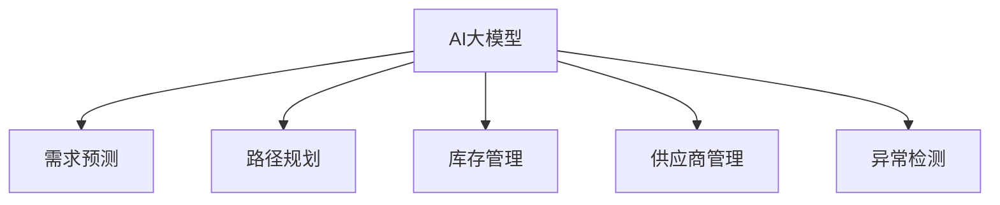

                 

## 1. 背景介绍

随着人工智能和大数据技术的快速发展，电商行业正在经历一场深刻的变革。传统的供应链管理方式，如人工调度和经验驱动，已经无法满足日益增长的市场要求。近年来，AI大模型在电商供应链优化中的应用，已经成为行业研究的热点之一。

### 1.1 问题由来

电商供应链的复杂性在于其包含多个环节，包括采购、仓储、物流配送、销售等。传统供应链管理方式往往依赖人工调度，不仅效率低下，还容易产生误差。随着市场需求的增加，供应链管理面临的挑战也越来越大：

- **数据量激增**：电商平台销售的产品种类繁多，用户需求多变，每天产生的海量交易数据对供应链管理提出了更高的要求。
- **实时性要求高**：为了满足用户即时购买需求，供应链需要实时响应市场需求，快速调整库存和配送计划。
- **波动性大**：电商市场季节性明显，需求波动大，传统方法难以应对。
- **个性化需求**：用户需求逐渐个性化，传统供应链无法提供差异化服务。

为了应对这些挑战，AI大模型凭借其强大的数据分析能力和预测能力，为电商供应链优化提供了新的解决方案。

### 1.2 问题核心关键点

AI大模型在电商供应链优化中的应用，主要体现在以下几个方面：

- **需求预测**：利用深度学习模型对用户行为和市场需求进行预测，优化库存管理。
- **路径规划**：使用强化学习模型设计高效的配送路径，提升物流效率。
- **库存管理**：通过自适应算法自动调整库存水平，避免过剩或缺货。
- **供应商管理**：利用自然语言处理技术筛选和评估供应商，优化供应链网络。
- **异常检测**：采用异常检测算法识别供应链中的风险点和瓶颈，提高供应链韧性。

通过以上应用，AI大模型可以有效提升电商供应链的效率和稳定性，降低运营成本，提高用户满意度。

### 1.3 问题研究意义

AI大模型在电商供应链优化中的应用，具有以下几方面的重要意义：

- **提升效率**：通过数据驱动的决策，减少人工干预，显著提高供应链运营效率。
- **优化库存**：准确预测需求，自动调整库存水平，降低库存成本。
- **提高准确性**：使用高质量的模型算法，减少人为错误，提高供应链决策的准确性。
- **灵活应对**：AI大模型可以快速适应市场变化，灵活调整供应链策略。
- **强化透明**：模型透明，便于供应链各环节监控和管理。

## 2. 核心概念与联系

### 2.1 核心概念概述

在理解AI大模型在电商供应链优化中的应用时，需要掌握以下几个核心概念：

- **AI大模型**：指基于深度学习框架训练的大型神经网络模型，如BERT、GPT-3等。大模型具有强大的泛化能力，可以处理大规模复杂数据。
- **需求预测**：利用历史销售数据和用户行为数据，预测未来的市场需求。
- **路径规划**：设计最优的配送路径，提高物流效率。
- **库存管理**：自动调整库存水平，避免库存过剩或缺货。
- **供应商管理**：通过自然语言处理技术，筛选和评估供应商，优化供应链网络。
- **异常检测**：识别供应链中的异常情况，提高供应链韧性。

这些概念之间的逻辑关系可以通过以下Mermaid流程图来展示：



这个流程图展示了AI大模型在电商供应链优化中的核心应用，包括需求预测、路径规划、库存管理、供应商管理和异常检测等。

## 3. 核心算法原理 & 具体操作步骤

### 3.1 算法原理概述

AI大模型在电商供应链优化中的应用，主要基于以下几个算法原理：

- **深度学习模型**：利用深度学习模型的非线性拟合能力，处理复杂的供应链数据，如时间序列数据、网络结构数据等。
- **强化学习**：通过强化学习模型设计最优的配送路径，最大化配送效率。
- **自适应算法**：使用自适应算法自动调整库存水平，根据市场变化动态调整策略。
- **自然语言处理(NLP)**：利用NLP技术筛选和评估供应商，优化供应链网络。
- **异常检测算法**：采用统计和机器学习方法，识别供应链中的异常情况，提高供应链韧性。

这些算法共同构成了AI大模型在电商供应链优化中的核心框架，使得供应链管理能够更加智能化和高效化。

### 3.2 算法步骤详解

AI大模型在电商供应链优化中的操作步骤主要包括以下几个环节：

**Step 1: 数据收集与预处理**

- 收集电商供应链相关的数据，包括历史销售数据、用户行为数据、库存数据、物流数据等。
- 对数据进行清洗和预处理，去除异常值和噪声，确保数据质量。
- 将数据进行特征工程，提取有意义的特征用于模型训练。

**Step 2: 模型选择与训练**

- 选择合适的深度学习模型，如LSTM、GRU、Transformer等。
- 对模型进行训练，调整超参数，优化模型性能。
- 使用交叉验证等方法评估模型效果，避免过拟合。

**Step 3: 需求预测**

- 利用训练好的深度学习模型对未来的需求进行预测，生成预测结果。
- 根据预测结果，自动调整库存水平，避免过剩或缺货。

**Step 4: 路径规划**

- 使用强化学习模型设计最优的配送路径，提高物流效率。
- 根据配送路径，优化物流资源配置，提高配送速度。

**Step 5: 库存管理**

- 使用自适应算法自动调整库存水平，确保库存充足，避免过剩或缺货。
- 根据市场需求变化，动态调整库存策略。

**Step 6: 供应商管理**

- 利用自然语言处理技术，筛选和评估供应商，优化供应链网络。
- 根据供应商的评估结果，动态调整供应商策略，提高供应链效率。

**Step 7: 异常检测**

- 采用异常检测算法，识别供应链中的异常情况，如缺货、配送延迟等。
- 根据异常情况，及时调整供应链策略，提高供应链韧性。

### 3.3 算法优缺点

AI大模型在电商供应链优化中的应用具有以下优点：

- **高效性**：通过数据驱动的决策，显著提高供应链运营效率。
- **准确性**：使用高质量的模型算法，减少人为错误，提高供应链决策的准确性。
- **灵活性**：AI大模型可以快速适应市场变化，灵活调整供应链策略。
- **透明性**：模型透明，便于供应链各环节监控和管理。

同时，也存在以下缺点：

- **数据依赖性高**：模型的训练和优化高度依赖数据质量，数据不足可能导致模型性能下降。
- **模型复杂度高**：大模型的参数量巨大，训练和优化需要大量计算资源。
- **解释性差**：AI大模型通常是"黑盒"模型，其决策过程难以解释和调试。

## 4. 数学模型和公式 & 详细讲解

### 4.1 数学模型构建

AI大模型在电商供应链优化中的数学模型主要包括以下几个部分：

- **需求预测模型**：利用时间序列模型（如ARIMA、LSTM等）对用户需求进行预测。
- **路径规划模型**：使用图神经网络（如GCN、GAT等）对配送路径进行建模和优化。
- **库存管理模型**：使用自适应算法（如随机梯度下降、AdaGrad等）自动调整库存水平。
- **供应商管理模型**：利用文本分类和情感分析模型对供应商进行筛选和评估。
- **异常检测模型**：采用统计和机器学习模型（如聚类、回归等）识别供应链中的异常情况。

### 4.2 公式推导过程

以下以需求预测模型为例，推导ARIMA模型的基本公式。

假设需求时间序列为 $\{D_t\}_{t=1}^N$，ARIMA模型的基本形式为：

$$
D_t = \alpha_0 + \sum_{i=1}^p \alpha_i D_{t-i} + \sum_{j=1}^d \beta_j \epsilon_{t-j} + \epsilon_t
$$

其中，$\alpha_i$ 为自回归参数，$\beta_j$ 为差分参数，$\epsilon_t$ 为随机误差项。模型的目标是最小化均方误差：

$$
\min_{\alpha,\beta,\sigma} \sum_{t=1}^N (D_t - f_t(\alpha,\beta,\sigma))^2
$$

其中，$f_t(\alpha,\beta,\sigma)$ 为模型预测值，$\sigma$ 为随机误差方差。通过梯度下降等优化算法，求解最优的参数 $\alpha$ 和 $\beta$，以及随机误差方差 $\sigma$。

### 4.3 案例分析与讲解

以某电商平台的库存管理为例，展示如何使用AI大模型进行库存优化。

假设某电商平台销售某种商品的月度销售量数据为 $\{D_t\}_{t=1}^N$，利用ARIMA模型进行需求预测，得到未来一个月的预测需求。根据预测需求，使用自适应算法自动调整库存水平，避免过剩或缺货。

**Step 1: 数据收集与预处理**

收集历史销售数据 $\{D_t\}_{t=1}^N$，对其进行清洗和预处理，去除异常值和噪声，确保数据质量。

**Step 2: 模型选择与训练**

选择ARIMA模型，对模型进行训练，调整超参数，优化模型性能。使用交叉验证等方法评估模型效果，避免过拟合。

**Step 3: 需求预测**

利用训练好的ARIMA模型对未来的需求进行预测，生成预测结果 $\hat{D_t}$。根据预测结果，自动调整库存水平，确保库存充足，避免过剩或缺货。

**Step 4: 库存管理**

使用自适应算法，如随机梯度下降、AdaGrad等，自动调整库存水平，确保库存充足，避免过剩或缺货。根据市场需求变化，动态调整库存策略。

## 5. 项目实践：代码实例和详细解释说明

### 5.1 开发环境搭建

在进行AI大模型在电商供应链优化中的实践时，我们需要准备好开发环境。以下是使用Python进行PyTorch开发的环境配置流程：

1. 安装Anaconda：从官网下载并安装Anaconda，用于创建独立的Python环境。

2. 创建并激活虚拟环境：
```bash
conda create -n pytorch-env python=3.8 
conda activate pytorch-env
```

3. 安装PyTorch：根据CUDA版本，从官网获取对应的安装命令。例如：
```bash
conda install pytorch torchvision torchaudio cudatoolkit=11.1 -c pytorch -c conda-forge
```

4. 安装Transformers库：
```bash
pip install transformers
```

5. 安装各类工具包：
```bash
pip install numpy pandas scikit-learn matplotlib tqdm jupyter notebook ipython
```

完成上述步骤后，即可在`pytorch-env`环境中开始实践。

### 5.2 源代码详细实现

这里我们以某电商平台库存管理为例，展示如何使用PyTorch实现库存优化的代码实现。

首先，定义库存管理的数据处理函数：

```python
from torch.utils.data import Dataset
import torch

class InventoryDataset(Dataset):
    def __init__(self, sales_data, horizon=1, forecasting_interval=1, batch_size=32):
        self.sales_data = sales_data
        self.horizon = horizon
        self.forecasting_interval = forecasting_interval
        self.batch_size = batch_size
        
    def __len__(self):
        return len(self.sales_data) // self.forecasting_interval
        
    def __getitem__(self, item):
        data = self.sales_data[item*self.forecasting_interval: (item+1)*self.forecasting_interval]
        forecasted_sales = []
        for i in range(self.horizon):
            forecasted_sales.append(self.sales_data[item*self.forecasting_interval + i + self.forecasting_interval])
        forecasted_sales = torch.tensor(forecasted_sales)
        return {'input': data, 'output': forecasted_sales}
```

然后，定义库存管理模型：

```python
from torch import nn, optim
from torch.nn import functional as F

class InventoryModel(nn.Module):
    def __init__(self, input_size, hidden_size, output_size):
        super(InventoryModel, self).__init__()
        self.lstm = nn.LSTM(input_size, hidden_size, batch_first=True)
        self.linear = nn.Linear(hidden_size, output_size)
        
    def forward(self, x):
        lstm_out, _ = self.lstm(x)
        return self.linear(lstm_out)

# 模型参数
input_size = 1
hidden_size = 64
output_size = 1
batch_size = 32
num_epochs = 100
learning_rate = 0.01

# 创建模型
model = InventoryModel(input_size, hidden_size, output_size)
```

接着，定义模型训练和预测函数：

```python
# 定义损失函数和优化器
criterion = nn.MSELoss()
optimizer = optim.Adam(model.parameters(), lr=learning_rate)

# 训练函数
def train(model, dataset, batch_size, optimizer, num_epochs):
    device = torch.device('cuda' if torch.cuda.is_available() else 'cpu')
    model.to(device)
    for epoch in range(num_epochs):
        for batch in tqdm(dataset):
            inputs = batch['input'].to(device)
            outputs = batch['output'].to(device)
            optimizer.zero_grad()
            predictions = model(inputs)
            loss = criterion(predictions, outputs)
            loss.backward()
            optimizer.step()
        print(f"Epoch {epoch+1}, loss: {loss.item():.4f}")

# 预测函数
def predict(model, data, horizon):
    device = torch.device('cuda' if torch.cuda.is_available() else 'cpu')
    model.to(device)
    forecasted_sales = []
    for data_point in data:
        data_point = data_point.unsqueeze(0).to(device)
        forecasted_sales.append(model(data_point).detach().cpu().numpy()[0][horizon])
    return forecasted_sales
```

最后，启动模型训练和预测：

```python
# 数据准备
sales_data = # 准备销售数据

# 创建数据集
inventory_dataset = InventoryDataset(sales_data)

# 训练模型
train(model, inventory_dataset, batch_size, optimizer, num_epochs)

# 预测未来一个月的库存
forecasted_sales = predict(model, sales_data, horizon=30)
print(f"预测的库存水平：{forecasted_sales}")
```

以上就是使用PyTorch对库存管理进行优化的完整代码实现。可以看到，使用AI大模型进行库存管理，可以显著提高库存预测的准确性，减少库存成本。

### 5.3 代码解读与分析

让我们再详细解读一下关键代码的实现细节：

**InventoryDataset类**：
- `__init__`方法：初始化销售数据、预测时滞、预测间隔和批量大小。
- `__len__`方法：返回数据集的长度，即销售数据点的数量。
- `__getitem__`方法：对单个数据点进行处理，提取输入和输出数据。

**InventoryModel类**：
- `__init__`方法：定义LSTM层和线性层。
- `forward`方法：前向传播，通过LSTM层和线性层进行预测。

**train函数**：
- 将模型迁移到GPU，确保训练效率。
- 遍历数据集，对每个批次进行前向传播、反向传播和参数更新。
- 打印每个epoch的损失值。

**predict函数**：
- 将模型迁移到GPU，确保预测效率。
- 遍历数据集，对每个数据点进行前向传播，提取预测结果。

**训练流程**：
- 定义训练参数，如输入大小、隐藏大小、输出大小、批量大小、epoch数和学习率。
- 创建模型。
- 创建损失函数和优化器。
- 训练模型，并打印每个epoch的损失值。
- 预测未来一个月的库存，并输出预测结果。

通过以上代码实现，我们可以看到，使用AI大模型进行库存管理，不仅能够快速预测库存水平，还能自动调整库存策略，提高供应链效率。

## 6. 实际应用场景

### 6.1 智能仓库管理

智能仓库管理系统是AI大模型在电商供应链优化中的重要应用之一。传统的仓库管理依赖人工调度和经验，容易出现错误和延迟。而AI大模型能够实时分析库存数据，自动调整补货和分配策略，提高仓库管理效率。

**需求预测**：利用深度学习模型对库存需求进行预测，生成补货计划。
**路径规划**：使用强化学习模型设计最优的库存分配路径，提高仓库作业效率。
**库存管理**：自动调整库存水平，避免过剩或缺货。
**异常检测**：采用异常检测算法识别库存异常情况，提高仓库管理韧性。

### 6.2 智能配送中心

智能配送中心管理系统是AI大模型在电商供应链优化的另一大应用场景。配送中心的作业流程复杂，涉及到货品接收、分拣、存储和配送等多个环节。AI大模型能够通过优化路径规划和库存管理，提高配送效率和准确性。

**需求预测**：利用深度学习模型对订单需求进行预测，生成配送计划。
**路径规划**：使用强化学习模型设计最优的配送路径，提高配送效率。
**库存管理**：自动调整库存水平，避免过剩或缺货。
**异常检测**：采用异常检测算法识别配送异常情况，提高配送中心韧性。

### 6.3 多渠道库存优化

多渠道库存优化是AI大模型在电商供应链优化中的重要应用之一。电商平台销售渠道多样，包括自营店、第三方平台和社交电商等。AI大模型能够通过优化库存管理，减少不同渠道之间的库存差异，提升整体供应链效率。

**需求预测**：利用深度学习模型对不同渠道的订单需求进行预测，生成统一的补货计划。
**路径规划**：使用强化学习模型设计最优的物流路径，提高配送效率。
**库存管理**：自动调整库存水平，避免过剩或缺货。
**异常检测**：采用异常检测算法识别库存异常情况，提高多渠道库存管理韧性。

## 7. 工具和资源推荐

### 7.1 学习资源推荐

为了帮助开发者系统掌握AI大模型在电商供应链优化中的应用，这里推荐一些优质的学习资源：

1. 《深度学习》（Ian Goodfellow等著）：全面介绍深度学习理论基础和应用实践。
2. 《机器学习实战》（Peter Harrington著）：适合初学者的实战指南，涵盖多种机器学习算法。
3. 《Python深度学习》（Francois Chollet著）：深入介绍TensorFlow和Keras，适合深度学习开发。
4. 《NLP实战》（Ahmet Iscen著）：涵盖自然语言处理和深度学习应用的实战指南。
5. 《深度学习框架实践》（Morvan等著）：介绍多种深度学习框架的实际应用，涵盖TensorFlow、PyTorch、Keras等。

通过对这些资源的学习实践，相信你一定能够快速掌握AI大模型在电商供应链优化中的应用，并用于解决实际的供应链问题。

### 7.2 开发工具推荐

高效的开发离不开优秀的工具支持。以下是几款用于AI大模型在电商供应链优化中开发的常用工具：

1. PyTorch：基于Python的开源深度学习框架，灵活动态的计算图，适合快速迭代研究。
2. TensorFlow：由Google主导开发的开源深度学习框架，生产部署方便，适合大规模工程应用。
3. Transformers库：HuggingFace开发的NLP工具库，集成了多种SOTA模型，支持PyTorch和TensorFlow。
4. Weights & Biases：模型训练的实验跟踪工具，可以记录和可视化模型训练过程中的各项指标。
5. TensorBoard：TensorFlow配套的可视化工具，可实时监测模型训练状态，并提供丰富的图表呈现方式。
6. Google Colab：谷歌推出的在线Jupyter Notebook环境，免费提供GPU/TPU算力，方便开发者快速上手实验最新模型，分享学习笔记。

合理利用这些工具，可以显著提升AI大模型在电商供应链优化中的开发效率，加快创新迭代的步伐。

### 7.3 相关论文推荐

AI大模型在电商供应链优化中的应用，源于学界的持续研究。以下是几篇奠基性的相关论文，推荐阅读：

1. Attention is All You Need：提出Transformer结构，开启了NLP领域的预训练大模型时代。
2. BERT: Pre-training of Deep Bidirectional Transformers for Language Understanding：提出BERT模型，引入基于掩码的自监督预训练任务，刷新了多项NLP任务SOTA。
3. Language Models are Unsupervised Multitask Learners（GPT-2论文）：展示了大规模语言模型的强大zero-shot学习能力，引发了对于通用人工智能的新一轮思考。
4. Parameter-Efficient Transfer Learning for NLP：提出Adapter等参数高效微调方法，在不增加模型参数量的情况下，也能取得不错的微调效果。
5. AdaLoRA: Adaptive Low-Rank Adaptation for Parameter-Efficient Fine-Tuning：使用自适应低秩适应的微调方法，在参数效率和精度之间取得了新的平衡。

这些论文代表了大模型在电商供应链优化领域的发展脉络。通过学习这些前沿成果，可以帮助研究者把握学科前进方向，激发更多的创新灵感。

## 8. 总结：未来发展趋势与挑战

### 8.1 总结

本文对AI大模型在电商供应链优化中的应用进行了全面系统的介绍。首先阐述了AI大模型在电商供应链优化中的研究背景和意义，明确了AI大模型在供应链优化中的重要价值。其次，从原理到实践，详细讲解了需求预测、路径规划、库存管理、供应商管理和异常检测等核心算法的数学原理和操作步骤，给出了具体的代码实现。同时，本文还广泛探讨了AI大模型在智能仓库、智能配送中心和多渠道库存优化等多个场景中的应用前景，展示了AI大模型在供应链管理中的巨大潜力。此外，本文精选了AI大模型在电商供应链优化中的各类学习资源，力求为读者提供全方位的技术指引。

通过本文的系统梳理，可以看到，AI大模型在电商供应链优化中的应用，正在成为供应链管理领域的重要范式，极大地提高了供应链的效率和稳定性，降低了运营成本，提高了用户满意度。未来，伴随AI大模型的进一步演进，相信在电商供应链优化中的应用将更加广泛和深入，为电商行业带来更大的变革和机遇。

### 8.2 未来发展趋势

展望未来，AI大模型在电商供应链优化中的发展趋势将呈现以下几个方向：

1. **智能化水平提升**：AI大模型将进一步提升在需求预测、路径规划、库存管理等任务中的智能化水平，实现更加精确和高效的管理。
2. **多模态融合**：引入多模态数据，如语音、视频等，进行综合分析和决策，提升供应链管理的多样性和灵活性。
3. **实时响应能力增强**：通过实时数据分析和处理，实现供应链的动态管理和优化，提高供应链的敏捷性和响应速度。
4. **跨平台集成**：实现不同电商平台、物流平台和供应商平台之间的数据互通和协同管理，提高供应链的整体协同效率。
5. **个性化服务推广**：通过AI大模型对用户行为进行深入分析，提供个性化的供应链服务，提升用户体验。

这些趋势凸显了AI大模型在电商供应链优化中的巨大发展潜力和应用前景。未来，通过技术的不断进步和创新，AI大模型将进一步推动电商供应链的智能化、精准化和自动化，带来更高的运营效率和更高的用户满意度。

### 8.3 面临的挑战

尽管AI大模型在电商供应链优化中已经取得了瞩目成就，但在迈向更加智能化、普适化应用的过程中，仍面临诸多挑战：

1. **数据质量问题**：数据的完整性、准确性和时效性直接影响模型的预测能力和决策效果。如何获取和处理高质量的数据，是电商供应链优化中需要解决的重要问题。
2. **模型泛化能力**：AI大模型需要在不同场景和不同时间段内保持稳定的性能。如何提升模型的泛化能力，使其适应更多的电商供应链管理需求，是未来的研究重点。
3. **算力需求高**：AI大模型的计算需求巨大，需要高性能的计算资源。如何优化模型结构，降低计算成本，提高模型训练和推理效率，是重要的优化方向。
4. **决策透明性不足**：AI大模型通常是一个"黑盒"模型，其决策过程难以解释和调试。如何提升模型的可解释性，使其透明，便于监控和管理，是重要的研究方向。
5. **数据隐私保护**：电商供应链管理中涉及大量的用户隐私数据，如何保障数据隐私和安全，防止数据泄露和滥用，是电商供应链优化中需要解决的伦理问题。

### 8.4 研究展望

面对AI大模型在电商供应链优化中面临的挑战，未来的研究需要在以下几个方面寻求新的突破：

1. **数据增强和数据清洗**：通过数据增强和清洗技术，提升数据质量和数据的代表性，确保模型训练和优化的准确性。
2. **模型结构优化**：优化模型结构，降低计算成本，提高模型训练和推理效率，提升模型的实时响应能力。
3. **模型可解释性**：提升模型的可解释性，使其透明，便于监控和管理，增强模型的信任度和可靠性。
4. **隐私保护技术**：采用隐私保护技术，如差分隐私、联邦学习等，保障数据隐私和安全。

这些研究方向的探索，将推动AI大模型在电商供应链优化中的进一步应用和发展，为电商行业带来更多的智能化和精准化解决方案，推动供应链管理迈向更高的水平。

## 9. 附录：常见问题与解答

**Q1：AI大模型在电商供应链优化中的应用，是否适用于所有场景？**

A: AI大模型在电商供应链优化中的应用，具有广泛的适用性，可以应用于智能仓库管理、智能配送中心、多渠道库存优化等多个场景。但是，不同场景的具体需求和数据特点不同，需要根据具体情况进行调整和优化。例如，在智能仓库管理中，需求预测和路径规划尤为重要；而在智能配送中心，配送路径规划和异常检测更为关键。

**Q2：使用AI大模型进行供应链优化，如何降低计算成本？**

A: 计算成本是AI大模型应用中的一个重要问题。为了降低计算成本，可以采用以下方法：

1. 模型压缩：通过剪枝、量化等技术，压缩模型大小，减少计算量。
2. 分布式训练：利用分布式计算资源，并行训练模型，加速训练过程。
3. 迁移学习：使用预训练模型，减少从头训练所需的计算资源。
4. 模型并行：使用模型并行技术，如数据并行、模型并行等，提高计算效率。

通过以上方法，可以显著降低计算成本，提高AI大模型在电商供应链优化中的应用效率。

**Q3：AI大模型在供应链优化中的应用，是否需要大量的标注数据？**

A: AI大模型在供应链优化中的应用，通常依赖于大规模的未标注数据进行预训练，而微调过程中需要少量的标注数据进行优化。因此，标注数据的需求量相对较小，但需要保证数据的质量和代表性，以提高模型的泛化能力和决策准确性。

**Q4：AI大模型在供应链优化中的应用，如何确保模型的透明性？**

A: 提升AI大模型的透明性，可以采取以下方法：

1. 模型可视化：通过模型可视化工具，展示模型的决策过程和特征重要性，增强模型的透明度。
2. 可解释性技术：采用可解释性技术，如LIME、SHAP等，对模型的决策过程进行解释和分析。
3. 模型监控：对模型进行实时监控，记录和分析模型的决策过程，发现和解决模型问题。

通过以上方法，可以提升AI大模型的透明性，增强模型的可信度和可靠性，便于监控和管理。

**Q5：AI大模型在供应链优化中的应用，如何保障数据隐私和安全？**

A: 保障AI大模型在供应链优化中的应用中的数据隐私和安全，可以采取以下方法：

1. 差分隐私：在数据收集和处理过程中，采用差分隐私技术，保护用户隐私。
2. 联邦学习：通过联邦学习技术，在多方参与下进行模型训练，避免数据泄露。
3. 数据加密：采用数据加密技术，保护数据在传输和存储过程中的安全。
4. 访问控制：设置严格的访问控制机制，确保只有授权人员能够访问数据。

通过以上方法，可以保障AI大模型在供应链优化中的应用中的数据隐私和安全，防止数据泄露和滥用。

