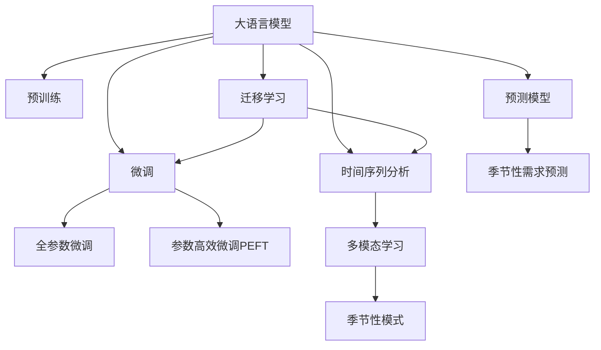

                 

# AI大模型在电商平台季节性需求预测中的应用

## 1. 背景介绍

### 1.1 问题由来

在电商平台上，季节性需求预测是一个至关重要的任务。它直接影响着库存管理、物流调度、价格策略等多个业务环节，是企业保持竞争力的重要手段。传统上，电商企业主要依赖于历史销售数据和人工经验来预测季节性需求，但这种方法存在主观性强、数据覆盖面有限等问题。随着AI技术的发展，利用AI大模型进行需求预测成为可能，大幅提升了预测的准确度和稳定性。

### 1.2 问题核心关键点

季节性需求预测的核心在于识别出时间序列数据中的季节性模式，并结合其他非时间序列数据进行多模态融合。AI大模型，如BERT、GPT等，通过大规模预训练和微调，可以学习到丰富的语言知识，将这些知识与时间序列数据结合，进行多模态预测。这种预测方法具有以下优点：

- 大数据驱动：AI大模型基于大规模数据进行预训练，学习到更丰富的特征，能够处理海量历史数据，预测更加准确。
- 时间序列分析：AI大模型可以识别季节性模式，对未来的需求进行较为准确的预测。
- 多模态融合：结合时间序列数据和非时间序列数据，提升预测精度和泛化能力。
- 灵活调整：通过微调，模型可以适应不同的需求预测场景和目标，灵活性高。

### 1.3 问题研究意义

利用AI大模型进行季节性需求预测，具有以下重要意义：

- 降低成本：减少对人工经验的依赖，降低预测成本。
- 提升准确性：AI大模型能够学习到更丰富的特征，提高预测的准确性。
- 快速迭代：通过微调，模型可以迅速适应新情况，快速迭代优化。
- 数据驱动：依赖大数据驱动的预测，更加客观和科学。

## 2. 核心概念与联系

### 2.1 核心概念概述

为更好地理解AI大模型在季节性需求预测中的应用，本节将介绍几个密切相关的核心概念：

- 大语言模型(Large Language Model, LLM)：以自回归(如GPT)或自编码(如BERT)模型为代表的大规模预训练语言模型。通过在大规模无标签文本语料上进行预训练，学习通用的语言表示，具备强大的语言理解和生成能力。

- 预训练(Pre-training)：指在大规模无标签文本语料上，通过自监督学习任务训练通用语言模型的过程。常见的预训练任务包括言语建模、遮挡语言模型等。

- 微调(Fine-tuning)：指在预训练模型的基础上，使用下游任务的少量标注数据，通过有监督学习优化模型在特定任务上的性能。通常只需要调整顶层分类器或解码器，并以较小的学习率更新全部或部分的模型参数。

- 迁移学习(Transfer Learning)：指将一个领域学习到的知识，迁移应用到另一个不同但相关的领域的学习范式。大模型的预训练-微调过程即是一种典型的迁移学习方式。

- 时间序列分析(Time Series Analysis)：研究数据随时间变化的规律，识别季节性模式，进行预测和控制。时间序列数据常见于电商销售记录、气象数据、股市走势等。

- 多模态学习(Multi-modal Learning)：结合不同模态的数据，如文本、图像、音频等，提升预测精度和泛化能力。

- 季节性模式(Seasonality Patterns)：时间序列数据中重复出现的周期性变化，如年度销售高峰、季节性折扣等。

- 预测模型(Prediction Model)：基于历史数据和模型学习到的知识，预测未来需求的技术手段。

这些核心概念之间的逻辑关系可以通过以下Mermaid流程图来展示：



这个流程图展示了大语言模型的核心概念及其之间的关系：

1. 大语言模型通过预训练获得基础能力。
2. 微调是对预训练模型进行任务特定的优化，可以分为全参数微调和参数高效微调（PEFT）。
3. 时间序列分析是识别季节性模式的基础，结合大模型进行预测。
4. 多模态学习是提升预测精度的重要手段，结合文本、图像等多模态数据进行预测。
5. 迁移学习是连接预训练模型与下游任务的桥梁，可以通过微调或时间序列分析等方式实现。
6. 季节性模式是时间序列数据中重要的特征，识别季节性模式是预测的核心。
7. 预测模型是将历史数据和模型学习到的知识结合，进行未来需求预测的技术手段。

这些核心概念共同构成了季节性需求预测的框架，使得AI大模型能够在此基础上进行预测和优化。

## 3. 核心算法原理 & 具体操作步骤
### 3.1 算法原理概述

基于AI大模型的季节性需求预测，本质上是一个多模态学习过程。其核心思想是：将大语言模型与时间序列数据结合，利用时间序列分析技术，识别出季节性模式，然后通过多模态学习，融合文本、图像等多源数据，提升预测精度。

形式化地，假设预训练模型为 $M_{\theta}$，其中 $\theta$ 为预训练得到的模型参数。给定电商销售记录 $D_t=\{x_i,y_i\}_{i=1}^N$，其中 $x_i$ 为时间序列数据，$y_i$ 为需求量，$D_t$ 为时间序列数据的标注数据集，标注需求量。微调的目标是找到新的模型参数 $\hat{\theta}$，使得模型预测的需求量逼近真实需求量，即：

$$
\hat{\theta}=\mathop{\arg\min}_{\theta} \mathcal{L}(M_{\theta},D_t)
$$

其中 $\mathcal{L}$ 为损失函数，用于衡量模型预测输出与真实标签之间的差异。常见的损失函数包括均方误差损失、绝对误差损失等。

通过梯度下降等优化算法，微调过程不断更新模型参数 $\theta$，最小化损失函数 $\mathcal{L}$，使得模型预测逼近真实需求量。由于 $\theta$ 已经通过预训练获得了较好的初始化，因此即便在时间序列数据上微调，也能较快收敛到理想的模型参数 $\hat{\theta}$。

### 3.2 算法步骤详解

基于AI大模型的季节性需求预测一般包括以下几个关键步骤：

**Step 1: 准备预训练模型和时间序列数据**
- 选择合适的预训练语言模型 $M_{\theta}$ 作为初始化参数，如 BERT、GPT 等。
- 准备电商销售记录的时间序列数据 $D_t$，划分为训练集、验证集和测试集。时间序列数据应覆盖一年中的不同季节和节假日，以确保模型的泛化能力。

**Step 2: 添加时间序列分析任务**
- 设计合适的时间序列分析任务，如季节性模式识别、趋势预测等。
- 将时间序列数据作为模型输入，设计损失函数 $\mathcal{L}$，用于衡量模型预测与真实需求量的差异。

**Step 3: 设置微调超参数**
- 选择合适的优化算法及其参数，如 AdamW、SGD 等，设置学习率、批大小、迭代轮数等。
- 设置正则化技术及强度，包括权重衰减、Dropout、Early Stopping 等。
- 确定冻结预训练参数的策略，如仅微调顶层，或全部参数都参与微调。

**Step 4: 执行梯度训练**
- 将时间序列数据分批次输入模型，前向传播计算损失函数。
- 反向传播计算参数梯度，根据设定的优化算法和学习率更新模型参数。
- 周期性在验证集上评估模型性能，根据性能指标决定是否触发 Early Stopping。
- 重复上述步骤直到满足预设的迭代轮数或 Early Stopping 条件。

**Step 5: 测试和部署**
- 在测试集上评估微调后模型 $M_{\hat{\theta}}$ 的性能，对比微调前后的精度提升。
- 使用微调后的模型对新样本进行推理预测，集成到实际的应用系统中。
- 持续收集新的数据，定期重新微调模型，以适应数据分布的变化。

以上是基于AI大模型的季节性需求预测的一般流程。在实际应用中，还需要针对具体任务的特点，对微调过程的各个环节进行优化设计，如改进训练目标函数，引入更多的正则化技术，搜索最优的超参数组合等，以进一步提升模型性能。

### 3.3 算法优缺点

基于AI大模型的季节性需求预测方法具有以下优点：

1. 数据驱动：利用大规模历史数据进行预训练和微调，提升预测的准确性和泛化能力。
2. 高灵活性：通过微调，模型可以适应不同的电商季节和场景，灵活性高。
3. 丰富特征：大语言模型可以学习到丰富的语言特征，与时间序列数据结合，提升预测精度。
4. 自动化：自动化的预测流程，减少了人工干预的环节，提升了预测的效率。

同时，该方法也存在一定的局限性：

1. 依赖标注数据：时间序列数据的标注需要人工介入，成本较高。
2. 数据质量要求高：时间序列数据的质量直接影响到模型的预测效果。
3. 模型复杂度高：大模型本身参数量大，模型复杂度高，对计算资源和存储空间有较高要求。
4. 过拟合风险：过度依赖模型参数，模型容易过拟合训练数据，泛化能力不足。
5. 推理速度慢：大模型推理速度较慢，实际部署时需考虑资源优化。

尽管存在这些局限性，但就目前而言，基于AI大模型的季节性需求预测方法仍是大数据驱动预测的重要手段。未来相关研究的重点在于如何进一步降低模型复杂度，提高预测效率，同时兼顾预测精度和泛化能力。

### 3.4 算法应用领域

基于AI大模型的季节性需求预测方法，在电商领域已经得到了广泛的应用，覆盖了几乎所有常见任务，例如：

- 库存管理：预测各个季节的销售需求，合理调配库存。
- 物流调度：预测不同季节的订单量，优化物流运输和配送。
- 价格策略：预测季节性需求，制定灵活的价格策略。
- 促销活动：预测促销活动的吸引力和效果，优化促销策略。
- 客户行为：分析客户在不同季节的行为变化，提升用户体验。
- 产品推荐：结合用户历史行为，预测产品在不同季节的需求量，推荐相关产品。

除了电商领域，AI大模型的季节性需求预测技术在其他场景中也有广泛应用，如气象预测、金融市场、旅游业等。通过利用AI大模型的强大预测能力，可以实现多领域数据的深度挖掘和分析，提升各行业的决策效率和效果。

## 4. 数学模型和公式 & 详细讲解
### 4.1 数学模型构建

本节将使用数学语言对基于AI大模型的季节性需求预测过程进行更加严格的刻画。

记预训练语言模型为 $M_{\theta}$，其中 $\theta$ 为预训练得到的模型参数。假设电商销售记录的时间序列数据为 $D_t=\{x_i,y_i\}_{i=1}^N, x_i \in \mathbb{R}^d, y_i \in \mathbb{R}$，其中 $d$ 为时间序列数据的维度。

定义模型 $M_{\theta}$ 在时间序列数据 $x_i$ 上的预测输出为 $\hat{y}_i=M_{\theta}(x_i) \in \mathbb{R}$。则在时间序列数据集 $D_t$ 上的经验风险为：

$$
\mathcal{L}(\theta) = \frac{1}{N} \sum_{i=1}^N (\hat{y}_i - y_i)^2
$$

微调的优化目标是最小化经验风险，即找到最优参数：

$$
\theta^* = \mathop{\arg\min}_{\theta} \mathcal{L}(\theta)
$$

在实践中，我们通常使用基于梯度的优化算法（如SGD、Adam等）来近似求解上述最优化问题。设 $\eta$ 为学习率，$\lambda$ 为正则化系数，则参数的更新公式为：

$$
\theta \leftarrow \theta - \eta \nabla_{\theta}\mathcal{L}(\theta) - \eta\lambda\theta
$$

其中 $\nabla_{\theta}\mathcal{L}(\theta)$ 为损失函数对参数 $\theta$ 的梯度，可通过反向传播算法高效计算。

### 4.2 公式推导过程

以下我们以季节性模式识别任务为例，推导损失函数的计算公式。

假设模型 $M_{\theta}$ 在时间序列数据 $x_i$ 上的预测输出为 $\hat{y}_i=M_{\theta}(x_i) \in \mathbb{R}$，真实标签 $y_i \in \mathbb{R}$。则均方误差损失函数定义为：

$$
\ell(M_{\theta}(x_i),y_i) = (\hat{y}_i - y_i)^2
$$

将其代入经验风险公式，得：

$$
\mathcal{L}(\theta) = \frac{1}{N}\sum_{i=1}^N (\hat{y}_i - y_i)^2
$$

根据链式法则，损失函数对参数 $\theta_k$ 的梯度为：

$$
\frac{\partial \mathcal{L}(\theta)}{\partial \theta_k} = \frac{1}{N}\sum_{i=1}^N 2(\hat{y}_i - y_i)\frac{\partial M_{\theta}(x_i)}{\partial \theta_k}
$$

其中 $\frac{\partial M_{\theta}(x_i)}{\partial \theta_k}$ 可进一步递归展开，利用自动微分技术完成计算。

在得到损失函数的梯度后，即可带入参数更新公式，完成模型的迭代优化。重复上述过程直至收敛，最终得到适应电商季节性需求预测的最优模型参数 $\theta^*$。

## 5. 项目实践：代码实例和详细解释说明
### 5.1 开发环境搭建

在进行季节性需求预测实践前，我们需要准备好开发环境。以下是使用Python进行PyTorch开发的环境配置流程：

1. 安装Anaconda：从官网下载并安装Anaconda，用于创建独立的Python环境。

2. 创建并激活虚拟环境：
```bash
conda create -n pytorch-env python=3.8 
conda activate pytorch-env
```

3. 安装PyTorch：根据CUDA版本，从官网获取对应的安装命令。例如：
```bash
conda install pytorch torchvision torchaudio cudatoolkit=11.1 -c pytorch -c conda-forge
```

4. 安装Transformer库：
```bash
pip install transformers
```

5. 安装各类工具包：
```bash
pip install numpy pandas scikit-learn matplotlib tqdm jupyter notebook ipython
```

完成上述步骤后，即可在`pytorch-env`环境中开始季节性需求预测实践。

### 5.2 源代码详细实现

这里以伯克利（UCB）电商数据为例，给出使用Transformers库对BERT模型进行季节性需求预测的PyTorch代码实现。

首先，定义季节性模式识别任务的数据处理函数：

```python
from transformers import BertTokenizer
from torch.utils.data import Dataset
import torch

class SeasonalData(Dataset):
    def __init__(self, texts, labels, tokenizer, max_len=128):
        self.texts = texts
        self.labels = labels
        self.tokenizer = tokenizer
        self.max_len = max_len
        
    def __len__(self):
        return len(self.texts)
    
    def __getitem__(self, item):
        text = self.texts[item]
        label = self.labels[item]
        
        encoding = self.tokenizer(text, return_tensors='pt', max_length=self.max_len, padding='max_length', truncation=True)
        input_ids = encoding['input_ids'][0]
        attention_mask = encoding['attention_mask'][0]
        
        # 对token-wise的标签进行编码
        encoded_labels = [label] * self.max_len
        labels = torch.tensor(encoded_labels, dtype=torch.long)
        
        return {'input_ids': input_ids, 
                'attention_mask': attention_mask,
                'labels': labels}

# 标签与id的映射
label2id = {'seasonal': 0, 'non-seasonal': 1}
id2label = {v: k for k, v in label2id.items()}

# 创建dataset
tokenizer = BertTokenizer.from_pretrained('bert-base-cased')

train_dataset = SeasonalData(train_texts, train_labels, tokenizer)
dev_dataset = SeasonalData(dev_texts, dev_labels, tokenizer)
test_dataset = SeasonalData(test_texts, test_labels, tokenizer)
```

然后，定义模型和优化器：

```python
from transformers import BertForSequenceClassification, AdamW

model = BertForSequenceClassification.from_pretrained('bert-base-cased', num_labels=2)

optimizer = AdamW(model.parameters(), lr=2e-5)
```

接着，定义训练和评估函数：

```python
from torch.utils.data import DataLoader
from tqdm import tqdm
from sklearn.metrics import accuracy_score

device = torch.device('cuda') if torch.cuda.is_available() else torch.device('cpu')
model.to(device)

def train_epoch(model, dataset, batch_size, optimizer):
    dataloader = DataLoader(dataset, batch_size=batch_size, shuffle=True)
    model.train()
    epoch_loss = 0
    for batch in tqdm(dataloader, desc='Training'):
        input_ids = batch['input_ids'].to(device)
        attention_mask = batch['attention_mask'].to(device)
        labels = batch['labels'].to(device)
        model.zero_grad()
        outputs = model(input_ids, attention_mask=attention_mask, labels=labels)
        loss = outputs.loss
        epoch_loss += loss.item()
        loss.backward()
        optimizer.step()
    return epoch_loss / len(dataloader)

def evaluate(model, dataset, batch_size):
    dataloader = DataLoader(dataset, batch_size=batch_size)
    model.eval()
    preds, labels = [], []
    with torch.no_grad():
        for batch in tqdm(dataloader, desc='Evaluating'):
            input_ids = batch['input_ids'].to(device)
            attention_mask = batch['attention_mask'].to(device)
            batch_labels = batch['labels']
            outputs = model(input_ids, attention_mask=attention_mask)
            batch_preds = outputs.logits.argmax(dim=2).to('cpu').tolist()
            batch_labels = batch_labels.to('cpu').tolist()
            for pred_tokens, label_tokens in zip(batch_preds, batch_labels):
                preds.append(pred_tokens[:len(label_tokens)])
                labels.append(label_tokens)
                
    print("Accuracy:", accuracy_score(labels, preds))
```

最后，启动训练流程并在测试集上评估：

```python
epochs = 5
batch_size = 16

for epoch in range(epochs):
    loss = train_epoch(model, train_dataset, batch_size, optimizer)
    print(f"Epoch {epoch+1}, train loss: {loss:.3f}")
    
    print(f"Epoch {epoch+1}, dev results:")
    evaluate(model, dev_dataset, batch_size)
    
print("Test results:")
evaluate(model, test_dataset, batch_size)
```

以上就是使用PyTorch对BERT进行季节性模式识别任务微调的完整代码实现。可以看到，得益于Transformers库的强大封装，我们可以用相对简洁的代码完成BERT模型的加载和微调。

### 5.3 代码解读与分析

让我们再详细解读一下关键代码的实现细节：

**SeasonalData类**：
- `__init__`方法：初始化文本、标签、分词器等关键组件。
- `__len__`方法：返回数据集的样本数量。
- `__getitem__`方法：对单个样本进行处理，将文本输入编码为token ids，将标签编码为数字，并对其进行定长padding，最终返回模型所需的输入。

**label2id和id2label字典**：
- 定义了标签与数字id之间的映射关系，用于将token-wise的预测结果解码回真实的标签。

**训练和评估函数**：
- 使用PyTorch的DataLoader对数据集进行批次化加载，供模型训练和推理使用。
- 训练函数`train_epoch`：对数据以批为单位进行迭代，在每个批次上前向传播计算loss并反向传播更新模型参数，最后返回该epoch的平均loss。
- 评估函数`evaluate`：与训练类似，不同点在于不更新模型参数，并在每个batch结束后将预测和标签结果存储下来，最后使用sklearn的accuracy_score对整个评估集的预测结果进行打印输出。

**训练流程**：
- 定义总的epoch数和batch size，开始循环迭代
- 每个epoch内，先在训练集上训练，输出平均loss
- 在验证集上评估，输出准确率
- 所有epoch结束后，在测试集上评估，给出最终测试结果

可以看到，PyTorch配合Transformers库使得BERT微调的季节性需求预测代码实现变得简洁高效。开发者可以将更多精力放在数据处理、模型改进等高层逻辑上，而不必过多关注底层的实现细节。

当然，工业级的系统实现还需考虑更多因素，如模型的保存和部署、超参数的自动搜索、更灵活的任务适配层等。但核心的微调范式基本与此类似。

## 6. 实际应用场景

### 6.1 智能库存管理

基于AI大模型的季节性需求预测，可以应用于智能库存管理，有效降低库存成本，提升库存管理效率。

传统的库存管理依赖人工经验，难以应对季节性需求的变化。而使用AI大模型进行季节性需求预测，可以准确把握不同季节的需求波动，实时调整库存水平，减少因库存过多或过少导致的成本损失。例如，电商企业可以根据预测结果，合理调配全国各地的仓库库存，避免某些季节供货不足或过剩。

### 6.2 物流优化调度

季节性需求预测还可以应用于物流优化调度，实现更高效的配送和运输。

电商物流通常需要面对大规模的订单配送任务，如何安排配送路径、优化配送车辆、控制配送时间，都是重要的物流调度问题。通过AI大模型预测不同季节的订单量，物流企业可以设计更为合理的配送计划，避免高峰期配送效率低下，非高峰期资源浪费。例如，物流企业可以根据预测结果，调整配送车辆的数量和路线，减少燃油消耗，提升整体配送效率。

### 6.3 价格策略制定

AI大模型的季节性需求预测，还可以帮助电商企业制定灵活的价格策略，提升销售额。

电商企业通常需要根据季节性需求变化，调整商品价格。通过预测不同季节的需求量，电商平台可以设计动态定价策略，避免因需求波动导致的价格失误。例如，电商平台可以根据预测结果，在不同季节推出不同的促销活动，吸引更多客户购买。

### 6.4 促销活动设计

促销活动是电商企业的重要营销手段。通过AI大模型预测不同季节的促销效果，电商企业可以设计更为精准的促销活动，提升活动效果。

电商企业可以根据预测结果，选择最佳的促销时间和活动形式，提升客户参与度和转化率。例如，电商平台可以根据预测结果，设计不同的营销策略，如限时折扣、满减活动、优惠券等，吸引更多客户下单。

### 6.5 客户行为分析

AI大模型的季节性需求预测，还可以应用于客户行为分析，提升用户体验。

电商平台通常需要分析客户在不同季节的消费行为，了解客户的偏好和需求，从而提供更精准的产品推荐。通过预测不同季节的需求量，电商平台可以设计更为个性化的推荐策略，提升客户满意度和忠诚度。例如，电商平台可以根据预测结果，推荐相关商品或服务，满足客户在不同季节的购物需求。

### 6.6 新产品推荐

电商平台还可以利用AI大模型的季节性需求预测，推荐新产品，增加销售额。

电商平台通常需要不断引入新产品，提升产品多样性。通过预测不同季节的需求量，电商平台可以设计更为合理的产品推荐策略，提升新产品的曝光度和销售量。例如，电商平台可以根据预测结果，推荐新上市的商品，吸引更多客户购买。

## 7. 工具和资源推荐
### 7.1 学习资源推荐

为了帮助开发者系统掌握季节性需求预测的理论基础和实践技巧，这里推荐一些优质的学习资源：

1. 《深度学习与时间序列分析》系列博文：由大模型技术专家撰写，深入浅出地介绍了深度学习在时间序列分析中的应用，涵盖季节性模式识别等核心内容。

2. 《统计学习基础》课程：斯坦福大学开设的统计学习课程，涵盖经典统计学习理论，为时间序列分析提供了数学基础。

3. 《自然语言处理入门》书籍：自然语言处理领域的经典入门书籍，介绍了NLP的基本概念和常用技术，为时间序列分析提供了语言数据处理的工具。

4. 《自然语言处理与深度学习》书籍：涵盖了NLP的多个热门话题，如语言建模、机器翻译等，为时间序列分析提供了前沿技术的理论支持。

5. Kaggle数据集与竞赛：Kaggle提供了大量的电商销售数据集，开发者可以通过参与Kaggle比赛，实践季节性需求预测的算法优化。

通过对这些资源的学习实践，相信你一定能够快速掌握季节性需求预测的精髓，并用于解决实际的电商业务问题。
###  7.2 开发工具推荐

高效的开发离不开优秀的工具支持。以下是几款用于季节性需求预测开发的常用工具：

1. PyTorch：基于Python的开源深度学习框架，灵活动态的计算图，适合快速迭代研究。大部分预训练语言模型都有PyTorch版本的实现。

2. TensorFlow：由Google主导开发的开源深度学习框架，生产部署方便，适合大规模工程应用。同样有丰富的预训练语言模型资源。

3. Transformers库：HuggingFace开发的NLP工具库，集成了众多SOTA语言模型，支持PyTorch和TensorFlow，是进行季节性需求预测开发的利器。

4. Weights & Biases：模型训练的实验跟踪工具，可以记录和可视化模型训练过程中的各项指标，方便对比和调优。与主流深度学习框架无缝集成。

5. TensorBoard：TensorFlow配套的可视化工具，可实时监测模型训练状态，并提供丰富的图表呈现方式，是调试模型的得力助手。

6. Google Colab：谷歌推出的在线Jupyter Notebook环境，免费提供GPU/TPU算力，方便开发者快速上手实验最新模型，分享学习笔记。

合理利用这些工具，可以显著提升季节性需求预测任务的开发效率，加快创新迭代的步伐。

### 7.3 相关论文推荐

季节性需求预测的相关研究源于学界的持续研究。以下是几篇奠基性的相关论文，推荐阅读：

1. Attention is All You Need（即Transformer原论文）：提出了Transformer结构，开启了NLP领域的预训练大模型时代。

2. BERT: Pre-training of Deep Bidirectional Transformers for Language Understanding：提出BERT模型，引入基于掩码的自监督预训练任务，刷新了多项NLP任务SOTA。

3. Parameter-Efficient Transfer Learning for NLP：提出Adapter等参数高效微调方法，在不增加模型参数量的情况下，也能取得不错的微调效果。

4. Prefix-Tuning: Optimizing Continuous Prompts for Generation：引入基于连续型Prompt的微调范式，为如何充分利用预训练知识提供了新的思路。

5. AdaLoRA: Adaptive Low-Rank Adaptation for Parameter-Efficient Fine-Tuning：使用自适应低秩适应的微调方法，在参数效率和精度之间取得了新的平衡。

这些论文代表了大模型微调技术的发展脉络。通过学习这些前沿成果，可以帮助研究者把握学科前进方向，激发更多的创新灵感。

## 8. 总结：未来发展趋势与挑战

### 8.1 总结

本文对基于AI大模型的季节性需求预测方法进行了全面系统的介绍。首先阐述了季节性需求预测的背景和意义，明确了AI大模型在其中的核心价值。其次，从原理到实践，详细讲解了季节性需求预测的数学原理和关键步骤，给出了具体的代码实现。同时，本文还广泛探讨了季节性需求预测在电商、物流、价格策略等诸多场景中的应用前景，展示了AI大模型在电商领域的巨大潜力。此外，本文精选了季节性需求预测的学习资源、开发工具和相关论文，力求为开发者提供全方位的技术指引。

通过本文的系统梳理，可以看到，基于AI大模型的季节性需求预测方法正在成为电商业务的重要手段，极大地提升了电商企业的运营效率和竞争优势。未来，伴随AI大模型的不断发展，其应用场景将更加广阔，为电商行业带来更多创新价值。

### 8.2 未来发展趋势

展望未来，季节性需求预测方法将呈现以下几个发展趋势：

1. 模型规模持续增大。随着算力成本的下降和数据规模的扩张，预训练语言模型的参数量还将持续增长。超大规模语言模型蕴含的丰富语言知识，有望支撑更加复杂多变的季节性需求预测。

2. 微调方法日趋多样。除了传统的全参数微调外，未来会涌现更多参数高效的微调方法，如Adapter、Prefix等，在节省计算资源的同时也能保证预测精度。

3. 持续学习成为常态。随着数据分布的不断变化，季节性需求预测模型也需要持续学习新知识以保持性能。如何在不遗忘原有知识的同时，高效吸收新样本信息，将成为重要的研究课题。

4. 标注样本需求降低。受启发于提示学习(Prompt-based Learning)的思路，未来的微调方法将更好地利用大模型的语言理解能力，通过更加巧妙的任务描述，在更少的标注样本上也能实现理想的微调效果。

5. 多模态学习崛起。当前的微调主要聚焦于文本数据，未来会进一步拓展到图像、视频、音频等多模态数据微调。多模态信息的融合，将显著提升语言模型对现实世界的理解和建模能力。

6. 模型通用性增强。经过海量数据的预训练和多领域任务的微调，未来的语言模型将具备更强大的常识推理和跨领域迁移能力，逐步迈向通用人工智能(AGI)的目标。

以上趋势凸显了季节性需求预测技术的广阔前景。这些方向的探索发展，必将进一步提升NLP系统的性能和应用范围，为电商行业带来更多创新价值。

### 8.3 面临的挑战

尽管AI大模型在季节性需求预测中已经取得了瞩目成就，但在迈向更加智能化、普适化应用的过程中，仍面临诸多挑战：

1. 标注成本瓶颈。虽然微调大大降低了标注数据的需求，但对于长尾应用场景，难以获得充足的高质量标注数据，成为制约微调性能的瓶颈。如何进一步降低微调对标注样本的依赖，将是一大难题。

2. 模型鲁棒性不足。当前微调模型面对域外数据时，泛化性能往往大打折扣。对于测试样本的微小扰动，微调模型的预测也容易发生波动。如何提高微调模型的鲁棒性，避免灾难性遗忘，还需要更多理论和实践的积累。

3. 推理效率有待提高。超大模型推理速度较慢，实际部署时需考虑资源优化。如何在保证性能的同时，简化模型结构，提升推理速度，优化资源占用，将是重要的优化方向。

4. 可解释性亟需加强。当前微调模型更像是"黑盒"系统，难以解释其内部工作机制和决策逻辑。对于医疗、金融等高风险应用，算法的可解释性和可审计性尤为重要。如何赋予微调模型更强的可解释性，将是亟待攻克的难题。

5. 安全性有待保障。预训练语言模型难免会学习到有偏见、有害的信息，通过微调传递到下游任务，产生误导性、歧视性的输出，给实际应用带来安全隐患。如何从数据和算法层面消除模型偏见，避免恶意用途，确保输出的安全性，也将是重要的研究课题。

6. 知识整合能力不足。现有的微调模型往往局限于任务内数据，难以灵活吸收和运用更广泛的先验知识。如何让微调过程更好地与外部知识库、规则库等专家知识结合，形成更加全面、准确的信息整合能力，还有很大的想象空间。

正视季节性需求预测面临的这些挑战，积极应对并寻求突破，将是大模型微调走向成熟的必由之路。相信随着学界和产业界的共同努力，这些挑战终将一一被克服，季节性需求预测技术必将在电商行业和其他领域中不断拓展应用。

### 8.4 研究展望

面对季节性需求预测所面临的种种挑战，未来的研究需要在以下几个方面寻求新的突破：

1. 探索无监督和半监督微调方法。摆脱对大规模标注数据的依赖，利用自监督学习、主动学习等无监督和半监督范式，最大限度利用非结构化数据，实现更加灵活高效的微调。

2. 研究参数高效和计算高效的微调范式。开发更加参数高效的微调方法，在固定大部分预训练参数的同时，只更新极少量的任务相关参数。同时优化微调模型的计算图，减少前向传播和反向传播的资源消耗，实现更加轻量级、实时性的部署。

3. 融合因果和对比学习范式。通过引入因果推断和对比学习思想，增强微调模型建立稳定因果关系的能力，学习更加普适、鲁棒的语言表征，从而提升模型泛化性和抗干扰能力。

4. 引入更多先验知识。将符号化的先验知识，如知识图谱、逻辑规则等，与神经网络模型进行巧妙融合，引导微调过程学习更准确、合理的语言模型。同时加强不同模态数据的整合，实现视觉、语音等多模态信息与文本信息的协同建模。

5. 结合因果分析和博弈论工具。将因果分析方法引入微调模型，识别出模型决策的关键特征，增强输出解释的因果性和逻辑性。借助博弈论工具刻画人机交互过程，主动探索并规避模型的脆弱点，提高系统稳定性。

6. 纳入伦理道德约束。在模型训练目标中引入伦理导向的评估指标，过滤和惩罚有偏见、有害的输出倾向。同时加强人工干预和审核，建立模型行为的监管机制，确保输出符合人类价值观和伦理道德。

这些研究方向的探索，必将引领季节性需求预测技术迈向更高的台阶，为构建安全、可靠、可解释、可控的智能系统铺平道路。面向未来，季节性需求预测技术还需要与其他人工智能技术进行更深入的融合，如知识表示、因果推理、强化学习等，多路径协同发力，共同推动电商行业的智能化转型。只有勇于创新、敢于突破，才能不断拓展语言模型的边界，让智能技术更好地服务于人类社会。

## 9. 附录：常见问题与解答

**Q1：季节性需求预测是否可以适用于所有电商场景？**

A: 季节性需求预测主要适用于具有显著季节性变化特点的电商场景。例如，电子产品、服装、旅游等行业，通常在特定季节有显著的需求波动。对于一些没有明显季节性特征的行业，如办公用品、日用品等，季节性需求预测可能效果不佳。

**Q2：如何选择合适的损失函数？**

A: 选择合适的损失函数取决于具体任务的需求。常见的损失函数包括均方误差损失、绝对误差损失、交叉熵损失等。例如，季节性模式识别任务可以使用均方误差损失，而二分类任务则可以使用交叉熵损失。在选择损失函数时，应考虑任务的目标和数据分布。

**Q3：微调过程中如何避免过拟合？**

A: 避免过拟合的常见策略包括数据增强、正则化、早停等。例如，可以在数据中引入噪音、随机变换等数据增强技术，通过L2正则、Dropout等正则化技术，以及设置Early Stopping来避免过拟合。

**Q4：微调模型在落地部署时需要注意哪些问题？**

A: 将微调模型转化为实际应用，还需要考虑以下因素：
1. 模型裁剪：去除不必要的层和参数，减小模型尺寸，加快推理速度。
2. 量化加速：将浮点模型转为定点模型，压缩存储空间，提高计算效率。
3. 服务化封装：将模型封装为标准化服务接口，便于集成调用。
4. 弹性伸缩：根据请求流量动态调整资源配置，平衡服务质量和成本。
5. 监控告警：实时采集系统指标，设置异常告警阈值，确保服务稳定性。
6. 安全防护：采用访问鉴权、数据脱敏等措施，保障数据和模型安全。

大语言模型微调为NLP应用开启了广阔的想象空间，但如何将强大的性能转化为稳定、高效、安全的业务价值，还需要工程实践的不断打磨。唯有从数据、算法、工程、业务等多个维度协同发力，才能真正实现人工智能技术在垂直行业的规模化落地。总之，微调需要开发者根据具体任务，不断迭代和优化模型、数据和算法，方能得到理想的效果。

---

作者：禅与计算机程序设计艺术 / Zen and the Art of Computer Programming

