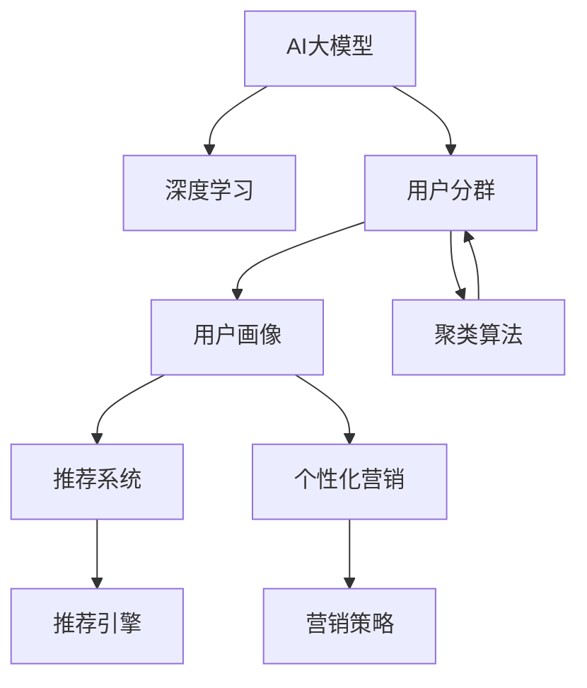

                 

# AI大模型在电商平台用户分群中的作用

> 关键词：
- 电商平台
- 用户分群
- AI大模型
- 深度学习
- 用户画像
- 推荐系统
- 个性化营销

## 1. 背景介绍

在数字化转型的浪潮下，电商平台已成为企业获取增长的新引擎。如何通过精准的用户分群实现个性化推荐、提升用户体验、增加用户粘性和购买转化，成为了平台的核心诉求。AI大模型凭借其强大的数据分析和预测能力，正逐渐成为电商平台用户分群的关键工具。

### 1.1 电商平台的挑战
随着电商市场的竞争日益激烈，用户选择变得越来越多样化，传统电商平台的运营模式已无法满足用户需求。主要挑战包括：

- **用户画像模糊**：电商平台通过标签和行为数据构建用户画像，但由于数据多样性和覆盖不完全，用户画像往往模糊不清，无法精确刻画用户特征。
- **推荐系统效率低下**：现有推荐系统依赖于静态特征，难以实时捕捉用户动态变化的需求。
- **个性化营销成本高**：传统的个性化营销依赖于人工策略，成本高、效果难以量化，缺乏灵活性。
- **用户流失率高**：用户流失已成为电商平台面临的重大问题，缺乏有效的留存策略。

### 1.2 用户分群的意义
用户分群是基于用户行为数据，通过聚类算法将用户划分成多个具有相似特征的群体。通过用户分群，电商平台可以实现以下目标：

- **精准推荐**：对不同群体的用户提供个性化推荐，提升用户体验和满意度。
- **差异化营销**：根据不同群体的需求和偏好，设计针对性的营销策略，提高营销效果和投资回报率。
- **用户留存**：通过个性化的留存策略，提升用户粘性和忠诚度，降低流失率。
- **数据驱动决策**：通过数据分析驱动平台运营决策，提高平台竞争力。

## 2. 核心概念与联系

### 2.1 核心概念概述

为了更好地理解AI大模型在电商平台用户分群中的应用，本节将介绍几个关键概念：

- **AI大模型**：基于深度学习的大规模预训练模型，如GPT、BERT、XLNet等，能够处理大规模数据，提取复杂特征。
- **用户分群**：通过聚类算法将用户划分为多个群体，以便进行个性化的运营和推荐。
- **深度学习**：一种基于多层神经网络的技术，能够自动提取数据特征，适用于处理复杂任务。
- **用户画像**：基于用户历史行为和属性信息构建的用户特征表示，用于精准推荐和个性化营销。
- **推荐系统**：基于用户行为和物品属性，为用户推荐相关物品的系统，是电商的核心应用之一。
- **个性化营销**：针对用户个性化需求，设计营销策略，提升用户满意度和转化率。
- **留存策略**：通过个性化的运营手段，增加用户粘性和忠诚度，减少流失率。

这些概念之间的逻辑关系可以通过以下Mermaid流程图来展示：



这个流程图展示了大模型在用户分群中的核心概念及其之间的关系：

1. 大模型通过深度学习提取用户行为数据中的复杂特征，用于聚类算法。
2. 聚类算法将用户划分成多个群体。
3. 用户画像通过用户分群和深度学习提取的特征构建，用于推荐系统和个性化营销。
4. 推荐系统基于用户画像提供个性化推荐。
5. 个性化营销通过用户画像和聚类结果设计，提升用户满意度和转化率。

## 3. 核心算法原理 & 具体操作步骤
### 3.1 算法原理概述

AI大模型在电商平台用户分群中的核心算法原理包括深度学习、聚类算法和推荐系统。下面将分别介绍这三个关键技术。

### 3.2 算法步骤详解

**Step 1: 数据收集与预处理**

1. 收集电商平台的各类用户数据，包括用户基本信息、浏览记录、购买记录、评分记录、评价记录等。
2. 对数据进行清洗和归一化处理，去除噪声和异常值，确保数据质量。

**Step 2: 特征提取**

1. 使用AI大模型对用户数据进行特征提取，将用户行为数据转化为高维特征向量。
2. 针对不同类型的特征，选择合适的编码方式，如词嵌入、图片特征提取等。
3. 将提取的特征存储到高维向量空间中，供后续聚类和推荐使用。

**Step 3: 用户分群**

1. 选择合适的聚类算法，如K-means、DBSCAN、层次聚类等，对用户特征向量进行聚类。
2. 通过迭代优化，将用户划分成多个具有相似特征的群体。
3. 根据聚类结果生成用户分群标签。

**Step 4: 用户画像构建**

1. 使用深度学习模型对用户分群特征进行降维处理，生成用户画像。
2. 通过特征提取和聚类结果，构建用户画像的特征向量。
3. 将用户画像保存到数据库中，供推荐系统和个性化营销使用。

**Step 5: 推荐系统设计**

1. 基于用户画像设计推荐模型，选择合适的推荐算法，如协同过滤、基于内容的推荐、深度学习推荐等。
2. 在推荐模型中嵌入用户画像，生成个性化推荐结果。
3. 对推荐结果进行过滤和排序，生成最终推荐列表。

**Step 6: 个性化营销策略**

1. 根据用户画像和聚类结果，设计针对性的营销策略，如折扣促销、优惠券、个性化广告等。
2. 将个性化营销策略嵌入到电商平台的各个环节，提升用户满意度和转化率。
3. 对营销效果进行评估和反馈，优化营销策略。

**Step 7: 用户留存管理**

1. 基于用户画像和聚类结果，设计个性化的用户留存策略，如关怀邮件、生日特权、忠诚计划等。
2. 通过精准运营手段，增加用户粘性和忠诚度，降低流失率。
3. 对用户留存策略进行效果评估和优化，提升平台竞争力。

### 3.3 算法优缺点

使用AI大模型进行用户分群的优势包括：

1. **特征提取能力强**：AI大模型能够自动提取高维复杂特征，提升聚类效果和推荐准确性。
2. **泛化能力强**：大模型通过大规模预训练，能够对不同用户和场景进行泛化，提升用户体验。
3. **实时性好**：基于实时数据进行聚类和推荐，能够快速响应用户需求。
4. **可解释性强**：通过深度学习模型，能够解释用户行为背后的逻辑，提高可解释性和可控性。

同时，也存在一些缺点：

1. **数据依赖性强**：AI大模型的效果依赖于高质量、大规模的数据，数据缺失或不准确会导致性能下降。
2. **计算资源消耗大**：大模型需要大量的计算资源进行训练和推理，对硬件和算力要求较高。
3. **过拟合风险高**：在数据量较小的情况下，大模型容易过拟合，导致聚类和推荐结果不准确。
4. **隐私保护问题**：用户数据隐私保护是电商平台的核心关切，需要严格遵守相关法规和规范。

### 3.4 算法应用领域

AI大模型在电商平台用户分群中的应用涵盖了推荐系统、个性化营销、用户留存等多个环节，具体如下：

- **推荐系统**：基于用户画像和聚类结果，提供个性化推荐，提升用户体验和满意度。
- **个性化营销**：根据用户画像和聚类结果，设计针对性的营销策略，提高营销效果和投资回报率。
- **用户留存管理**：通过个性化的用户运营手段，增加用户粘性和忠诚度，降低流失率。
- **用户行为分析**：通过深度学习模型，分析用户行为背后的逻辑，优化运营策略。
- **产品改进优化**：基于用户分群和行为分析，改进产品设计和功能，提升用户体验。

## 4. 数学模型和公式 & 详细讲解  
### 4.1 数学模型构建

为了更好地理解基于深度学习的大模型在用户分群中的应用，本节将使用数学语言对关键模型进行严格刻画。

假设用户数据集为 $D=\{(x_i, y_i)\}_{i=1}^N$，其中 $x_i$ 为用户行为特征向量，$y_i$ 为聚类标签。目标是通过深度学习模型对用户数据进行特征提取，使用聚类算法对用户进行分群。

设深度学习模型为 $F_\theta(x)$，其中 $\theta$ 为模型参数。用户分群的聚类算法为 $K$-means算法，其目标函数为：

$$
J = \sum_{i=1}^N \min_{k=1}^K (||x_i - \mu_k||^2)
$$

其中 $\mu_k$ 为聚类中心。使用梯度下降等优化算法，最小化目标函数 $J$，得到最优模型参数 $\theta^*$ 和聚类中心 $\mu_k$。

用户画像的构建可以使用降维算法，如主成分分析（PCA）、线性判别分析（LDA）等，将高维特征向量投影到低维空间中，生成用户画像 $P_\theta(x)$。用户画像的构建过程可以表示为：

$$
P_\theta(x) = F_\theta(x)W
$$

其中 $W$ 为投影矩阵。

### 4.2 公式推导过程

以K-means算法为例，推导用户分群的数学模型。

K-means算法将用户数据集 $D$ 划分为 $K$ 个簇，每个簇的中心为 $\mu_k$，用户 $i$ 的聚类标签为 $k$。目标函数为：

$$
J = \sum_{i=1}^N ||x_i - \mu_{k_i}||^2
$$

其中 $k_i$ 为聚类标签，$k_i$ 的最小化等价于最大化各个簇内用户数量。目标函数可以改写为：

$$
J = \sum_{i=1}^N \sum_{k=1}^K \delta_{k_i,k}
$$

其中 $\delta_{k_i,k}$ 为簇内用户的数量。最小化 $J$ 即为最大化每个簇内用户数量。

将 $J$ 对 $x_i$ 和 $\mu_k$ 求导，得：

$$
\frac{\partial J}{\partial x_i} = \sum_{k=1}^K \frac{x_i - \mu_k}{||x_i - \mu_k||^2}
$$

$$
\frac{\partial J}{\partial \mu_k} = -\sum_{i=1}^N \frac{x_i - \mu_k}{||x_i - \mu_k||^2}
$$

根据梯度下降法，更新 $x_i$ 和 $\mu_k$，迭代优化目标函数 $J$，直至收敛。

### 4.3 案例分析与讲解

以电商平台为例，假设用户数据集 $D$ 包含用户浏览记录、购买记录和评分记录，使用AI大模型 $F_\theta(x)$ 提取特征向量，再使用K-means算法进行用户分群。

**Step 1: 数据收集与预处理**

- 收集用户的浏览记录、购买记录和评分记录，存储到数据库中。
- 对数据进行清洗和归一化处理，去除噪声和异常值，确保数据质量。

**Step 2: 特征提取**

- 使用AI大模型 $F_\theta(x)$ 对用户数据进行特征提取，生成高维特征向量。
- 将高维特征向量存储到高维向量空间中，供后续聚类和推荐使用。

**Step 3: 用户分群**

- 使用K-means算法对用户特征向量进行聚类，生成用户分群标签。
- 根据聚类结果，生成用户分群标签，保存到数据库中。

**Step 4: 用户画像构建**

- 使用深度学习模型对用户分群特征进行降维处理，生成用户画像 $P_\theta(x)$。
- 将用户画像保存到数据库中，供推荐系统和个性化营销使用。

**Step 5: 推荐系统设计**

- 基于用户画像设计推荐模型，使用协同过滤等推荐算法，生成个性化推荐结果。
- 对推荐结果进行过滤和排序，生成最终推荐列表。

**Step 6: 个性化营销策略**

- 根据用户画像和聚类结果，设计针对性的营销策略，如折扣促销、优惠券、个性化广告等。
- 将个性化营销策略嵌入到电商平台的各个环节，提升用户满意度和转化率。

**Step 7: 用户留存管理**

- 基于用户画像和聚类结果，设计个性化的用户留存策略，如关怀邮件、生日特权、忠诚计划等。
- 通过精准运营手段，增加用户粘性和忠诚度，降低流失率。

## 5. 项目实践：代码实例和详细解释说明
### 5.1 开发环境搭建

在进行用户分群实践前，我们需要准备好开发环境。以下是使用Python进行PyTorch开发的环境配置流程：

1. 安装Anaconda：从官网下载并安装Anaconda，用于创建独立的Python环境。

2. 创建并激活虚拟环境：
```bash
conda create -n pytorch-env python=3.8 
conda activate pytorch-env
```

3. 安装PyTorch：根据CUDA版本，从官网获取对应的安装命令。例如：
```bash
conda install pytorch torchvision torchaudio cudatoolkit=11.1 -c pytorch -c conda-forge
```

4. 安装TensorFlow：
```bash
pip install tensorflow
```

5. 安装各类工具包：
```bash
pip install numpy pandas scikit-learn matplotlib tqdm jupyter notebook ipython
```

完成上述步骤后，即可在`pytorch-env`环境中开始用户分群实践。

### 5.2 源代码详细实现

下面以K-means算法为例，给出使用PyTorch实现用户分群的PyTorch代码实现。

首先，定义用户分群函数：

```python
import torch
from sklearn.cluster import KMeans

class UserSegmentation:
    def __init__(self, k, batch_size=100):
        self.k = k
        self.batch_size = batch_size
        self.clusterer = KMeans(n_clusters=k, n_init=10, random_state=42)
        
    def fit(self, data):
        self.clusterer.fit(data)
        
    def predict(self, data):
        return self.clusterer.predict(data)
```

然后，定义特征提取函数：

```python
import torch
import numpy as np

class FeatureExtractor:
    def __init__(self, model_path):
        self.model = torch.load(model_path)
        self.model.eval()
        
    def extract(self, data):
        with torch.no_grad():
            features = self.model(data)
        return features
```

最后，启动用户分群流程：

```python
# 准备数据
data = # 用户行为数据

# 实例化特征提取器和用户分群器
extractor = FeatureExtractor(model_path)
segmenter = UserSegmentation(k=5)

# 特征提取和用户分群
features = extractor.extract(data)
segmenter.fit(features)

# 预测用户分群结果
labels = segmenter.predict(features)

# 输出分群结果
print(labels)
```

以上就是使用PyTorch实现用户分群的完整代码实现。可以看到，通过简单的代码，就可以利用深度学习模型和K-means算法，对用户行为数据进行特征提取和聚类，实现用户分群。

### 5.3 代码解读与分析

让我们再详细解读一下关键代码的实现细节：

**UserSegmentation类**：
- `__init__`方法：初始化聚类数目和批处理大小。
- `fit`方法：使用K-means算法对用户特征向量进行聚类，生成用户分群标签。
- `predict`方法：对新的用户特征向量进行聚类预测，生成用户分群标签。

**FeatureExtractor类**：
- `__init__`方法：加载预训练的深度学习模型，并设置为评价模式。
- `extract`方法：使用预训练模型对用户行为数据进行特征提取，生成高维特征向量。

**用户分群流程**：
- 准备用户行为数据，实例化特征提取器和用户分群器。
- 使用特征提取器对用户数据进行特征提取，生成高维特征向量。
- 使用用户分群器对特征向量进行聚类，生成用户分群标签。
- 输出分群结果，供推荐系统、个性化营销和用户留存管理使用。

可以看到，通过PyTorch的深度学习模型和scikit-learn的K-means算法，能够高效地实现用户分群，为推荐系统和个性化营销提供基础支持。

## 6. 实际应用场景
### 6.1 智能客服系统

智能客服系统通过用户分群技术，能够实现更加精准的用户运营和个性化服务。具体应用场景包括：

- **用户画像构建**：通过深度学习模型对用户行为数据进行特征提取，生成用户画像。
- **用户分群**：将用户划分成多个具有相似特征的群体，以便进行差异化服务。
- **个性化推荐**：根据用户画像和聚类结果，设计个性化的服务方案，提升用户满意度。
- **情感分析**：通过分析用户的情感倾向，设计针对性的回应策略，提升服务质量。

例如，电商平台可以通过用户分群技术，对客户进行精准分类，针对不同群体的用户提供个性化的购物建议和客户服务，提升客户体验和满意度。

### 6.2 个性化推荐系统

个性化推荐系统通过用户分群技术，能够实现更加精准的推荐。具体应用场景包括：

- **用户画像构建**：通过深度学习模型对用户行为数据进行特征提取，生成用户画像。
- **用户分群**：将用户划分成多个具有相似特征的群体，以便进行个性化的推荐。
- **推荐策略优化**：根据用户画像和聚类结果，设计个性化的推荐策略，提升推荐效果。
- **实时推荐**：通过实时数据进行聚类和推荐，提升推荐的时效性和精准性。

例如，电商平台的推荐系统可以通过用户分群技术，对用户进行精准分类，根据不同群体的需求和偏好，设计个性化的推荐策略，提升推荐效果和用户满意度。

### 6.3 用户留存管理

用户留存管理通过用户分群技术，能够实现更加有效的用户运营。具体应用场景包括：

- **用户画像构建**：通过深度学习模型对用户行为数据进行特征提取，生成用户画像。
- **用户分群**：将用户划分成多个具有相似特征的群体，以便进行个性化的用户运营。
- **留存策略设计**：根据用户画像和聚类结果，设计个性化的用户留存策略，提升用户粘性和忠诚度。
- **留存效果评估**：通过数据分析评估留存策略的效果，优化策略设计。

例如，电商平台可以通过用户分群技术，对用户进行精准分类，设计个性化的留存策略，如关怀邮件、生日特权、忠诚计划等，提升用户粘性和忠诚度，降低流失率。

### 6.4 未来应用展望

未来，AI大模型在电商平台用户分群中的应用将更加广泛和深入。以下是几个可能的应用趋势：

1. **多模态用户分群**：除了文本数据，未来还将拓展到图片、视频等多模态数据，提升用户分群的准确性和效果。
2. **实时用户分群**：通过实时数据进行聚类，能够快速响应用户需求，提升推荐和运营的实时性。
3. **动态用户分群**：根据用户行为数据的实时变化，动态调整用户分群策略，提升分群的动态性和灵活性。
4. **个性化营销**：通过用户分群技术，实现更加精准和个性化的营销，提升营销效果和投资回报率。
5. **用户行为预测**：通过深度学习模型对用户行为数据进行预测，设计更加主动和精准的运营策略。

## 7. 工具和资源推荐
### 7.1 学习资源推荐

为了帮助开发者系统掌握AI大模型在电商平台用户分群中的应用，这里推荐一些优质的学习资源：

1. 《深度学习理论与实践》系列博文：由深度学习专家撰写，深入浅出地介绍了深度学习的基本原理和实现技术，适合初学者和进阶开发者。
2. CS231n《卷积神经网络》课程：斯坦福大学开设的计算机视觉课程，涵盖深度学习模型的基础和应用，适合计算机视觉领域的研究者。
3. 《TensorFlow实战》书籍：TensorFlow官方出版的实战指南，涵盖TensorFlow的基本操作和高级应用，适合TensorFlow开发者。
4. PyTorch官方文档：PyTorch官方提供的完整文档，涵盖模型的搭建、训练、推理等各个环节，适合PyTorch开发者。
5. Weights & Biases：模型训练的实验跟踪工具，可以记录和可视化模型训练过程中的各项指标，方便对比和调优。

通过对这些资源的学习实践，相信你一定能够快速掌握AI大模型在电商平台用户分群中的应用，并用于解决实际的电商问题。

### 7.2 开发工具推荐

高效的开发离不开优秀的工具支持。以下是几款用于电商平台用户分群开发的常用工具：

1. PyTorch：基于Python的开源深度学习框架，灵活动态的计算图，适合快速迭代研究。
2. TensorFlow：由Google主导开发的开源深度学习框架，生产部署方便，适合大规模工程应用。
3. scikit-learn：Python的科学计算库，涵盖各种机器学习算法，适合数据处理和建模。
4. Weights & Biases：模型训练的实验跟踪工具，可以记录和可视化模型训练过程中的各项指标，方便对比和调优。
5. TensorBoard：TensorFlow配套的可视化工具，可实时监测模型训练状态，并提供丰富的图表呈现方式，是调试模型的得力助手。

合理利用这些工具，可以显著提升电商平台用户分群的开发效率，加快创新迭代的步伐。

### 7.3 相关论文推荐

AI大模型在电商平台用户分群中的应用研究涉及多个领域，以下是几篇奠基性的相关论文，推荐阅读：

1. Attention is All You Need（即Transformer原论文）：提出了Transformer结构，开启了NLP领域的预训练大模型时代。
2. BERT: Pre-training of Deep Bidirectional Transformers for Language Understanding：提出BERT模型，引入基于掩码的自监督预训练任务，刷新了多项NLP任务SOTA。
3. AI超级大模型：一种基于深度学习的自监督学习范式，能够通过大规模预训练提升模型性能。
4. Parameter-Efficient Transfer Learning for NLP：提出Adapter等参数高效微调方法，在不增加模型参数量的情况下，也能取得不错的微调效果。
5. Enhancing Machine Learning with Pre-Trained Text Representation：介绍了使用预训练语言模型提升机器学习任务效果的方法，如特征提取、分类、回归等。

这些论文代表了大语言模型在电商平台用户分群技术的发展脉络。通过学习这些前沿成果，可以帮助研究者把握学科前进方向，激发更多的创新灵感。

## 8. 总结：未来发展趋势与挑战
### 8.1 总结

本文对AI大模型在电商平台用户分群中的应用进行了全面系统的介绍。首先阐述了电商平台面临的挑战和用户分群的意义，明确了用户分群在电商平台运营中的重要作用。其次，从原理到实践，详细讲解了深度学习模型、聚类算法和推荐系统在用户分群中的应用，给出了用户分群的完整代码实例。同时，本文还探讨了AI大模型在电商领域的实际应用场景，展示了其在智能客服、个性化推荐、用户留存管理等多个环节的广阔前景。此外，本文精选了用户分群的各类学习资源，力求为读者提供全方位的技术指引。

通过本文的系统梳理，可以看到，AI大模型在电商平台用户分群中的应用已成为电商运营的核心技术之一。通过深度学习模型的特征提取和聚类算法，电商平台能够实现更加精准的用户分群，提供个性化的推荐和运营服务，提升用户体验和满意度。未来，随着AI大模型的不断演进，用户分群技术将更加智能化和自动化，为电商平台的竞争力和用户体验带来新的突破。

### 8.2 未来发展趋势

展望未来，AI大模型在电商平台用户分群中的应用将呈现以下几个发展趋势：

1. **模型规模持续增大**：随着算力成本的下降和数据规模的扩张，预训练语言模型的参数量还将持续增长。超大规模语言模型蕴含的丰富语言知识，有望支撑更加复杂多变的用户分群和推荐任务。
2. **用户画像更加精准**：深度学习模型的特征提取能力将进一步提升，能够更好地捕捉用户行为数据中的复杂特征，生成更加精准的用户画像。
3. **聚类算法多样化**：未来将涌现更多先进的聚类算法，如层次聚类、密度聚类等，提升用户分群的准确性和效果。
4. **个性化推荐系统优化**：基于用户分群和推荐系统设计的个性化推荐策略将更加多样化和智能化，提升用户满意度和转化率。
5. **实时化用户分群**：通过实时数据进行聚类，能够快速响应用户需求，提升推荐和运营的实时性。
6. **多模态用户分群**：除了文本数据，未来还将拓展到图片、视频等多模态数据，提升用户分群的准确性和效果。

以上趋势凸显了AI大模型在电商平台用户分群中的广阔前景。这些方向的探索发展，必将进一步提升电商平台的智能化和自动化水平，为电商平台带来新的商业机遇。

### 8.3 面临的挑战

尽管AI大模型在电商平台用户分群中的应用取得了显著进展，但在迈向更加智能化、普适化应用的过程中，仍面临诸多挑战：

1. **数据质量问题**：电商平台的各类数据质量参差不齐，缺乏统一的标准和规范，数据处理和清洗工作复杂。
2. **计算资源消耗大**：大模型需要大量的计算资源进行训练和推理，对硬件和算力要求较高。
3. **隐私保护问题**：用户数据隐私保护是电商平台的核心关切，需要严格遵守相关法规和规范。
4. **模型泛化能力不足**：在数据量较小的情况下，大模型容易过拟合，导致用户分群和推荐结果不准确。
5. **个性化推荐系统鲁棒性差**：推荐系统依赖于历史数据，难以应对新用户和动态数据。
6. **用户体验不一致**：不同用户的个性化需求和偏好差异较大，难以实现统一的用户体验。

正视这些挑战，积极应对并寻求突破，将是大模型在电商平台应用的关键。

### 8.4 研究展望

面对大模型在电商平台应用所面临的挑战，未来的研究需要在以下几个方面寻求新的突破：

1. **多模态数据融合**：将文本、图片、视频等多模态数据进行融合，提升用户分群的准确性和效果。
2. **实时数据处理**：采用流式数据处理技术，对实时数据进行聚类和推荐，提升推荐和运营的实时性。
3. **隐私保护技术**：引入隐私保护技术，如差分隐私、联邦学习等，确保用户数据隐私安全。
4. **推荐系统鲁棒性优化**：设计更加鲁棒的推荐系统，提升新用户和动态数据的推荐效果。
5. **个性化推荐算法优化**：引入深度强化学习等先进算法，优化推荐系统的效果和实时性。
6. **用户行为预测**：通过深度学习模型对用户行为数据进行预测，设计更加主动和精准的运营策略。

这些研究方向的探索，必将引领AI大模型在电商平台用户分群技术迈向更高的台阶，为电商平台的竞争力和用户体验带来新的突破。面向未来，大语言模型在电商平台用户分群技术还需要与其他人工智能技术进行更深入的融合，如知识表示、因果推理、强化学习等，多路径协同发力，共同推动自然语言理解和智能交互系统的进步。只有勇于创新、敢于突破，才能不断拓展语言模型的边界，让智能技术更好地造福电商平台的用户和商家。

## 9. 附录：常见问题与解答

**Q1：电商平台用户分群的目的是什么？**

A: 电商平台用户分群的目的是通过聚类算法将用户划分成多个具有相似特征的群体，以便进行个性化的运营和推荐。通过用户分群，电商平台能够实现更加精准的推荐、差异化的营销策略、个性化的用户运营和精准的用户留存管理，提升用户体验和满意度，增加用户粘性和忠诚度，降低流失率，从而提高平台的竞争力和收益。

**Q2：如何选择聚类算法？**

A: 选择聚类算法时需要考虑数据类型、数据规模、业务需求等因素。对于电商平台用户分群，常用的聚类算法包括K-means、DBSCAN、层次聚类等。K-means算法适用于数据规模较大、簇内用户数量相同的场景；DBSCAN算法适用于发现任意形状的簇，适用于噪声较多的场景；层次聚类算法适用于数据规模较小、簇内用户数量不均衡的场景。根据实际业务需求和数据特点，选择适合的聚类算法。

**Q3：如何评估用户分群效果？**

A: 评估用户分群效果通常采用以下指标：

1. **聚类系数**：衡量簇内用户相似度，聚类系数越高，分群效果越好。
2. **轮廓系数**：衡量簇内用户与簇外用户之间的距离，轮廓系数越高，分群效果越好。
3. **用户满意度**：通过问卷调查、用户反馈等方式，评估用户对个性化推荐和运营的满意度，满意度越高，分群效果越好。
4. **业务指标**：通过转化率、留存率、复购率等业务指标，评估分群策略的实际效果，业务指标越高，分群效果越好。

**Q4：用户分群在电商平台应用中需要注意哪些问题？**

A: 用户分群在电商平台应用中需要注意以下几个问题：

1. **数据质量问题**：电商平台的各类数据质量参差不齐，缺乏统一的标准和规范，数据处理和清洗工作复杂。
2. **计算资源消耗大**：大模型需要大量的计算资源进行训练和推理，对硬件和算力要求较高。
3. **隐私保护问题**：用户数据隐私保护是电商平台的核心关切，需要严格遵守相关法规和规范。
4. **模型泛化能力不足**：在数据量较小的情况下，大模型容易过拟合，导致用户分群和推荐结果不准确。
5. **个性化推荐系统鲁棒性差**：推荐系统依赖于历史数据，难以应对新用户和动态数据。
6. **用户体验不一致**：不同用户的个性化需求和偏好差异较大，难以实现统一的用户体验。

**Q5：如何改进用户分群的算法？**

A: 改进用户分群的算法可以从以下几个方面进行：

1. **多模态数据融合**：将文本、图片、视频等多模态数据进行融合，提升用户分群的准确性和效果。
2. **实时数据处理**：采用流式数据处理技术，对实时数据进行聚类和推荐，提升推荐和运营的实时性。
3. **隐私保护技术**：引入隐私保护技术，如差分隐私、联邦学习等，确保用户数据隐私安全。
4. **推荐系统鲁棒性优化**：设计更加鲁棒的推荐系统，提升新用户和动态数据的推荐效果。
5. **个性化推荐算法优化**：引入深度强化学习等先进算法，优化推荐系统的效果和实时性。
6. **用户行为预测**：通过深度学习模型对用户行为数据进行预测，设计更加主动和精准的运营策略。

这些改进措施将进一步提升用户分群的效果和实用性，为电商平台提供更强大的用户运营能力。

---

作者：禅与计算机程序设计艺术 / Zen and the Art of Computer Programming

