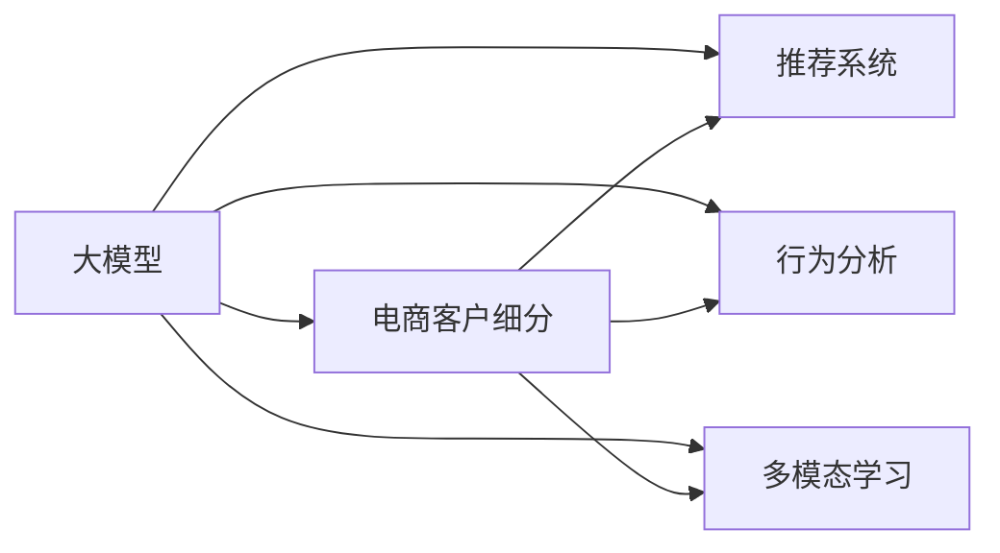

                 

# AI大模型在电商平台精准客户细分中的应用

> 关键词：大模型,电商,客户细分,精准营销,推荐系统,购物意图,行为分析

## 1. 背景介绍

### 1.1 问题由来

随着电子商务的迅猛发展，电商平台已成为零售和消费者互动的重要平台。然而，如何精准识别和细分不同客户群体，以便实现个性化推荐和服务，提升客户满意度和业务效益，是电商平台面临的重要挑战。传统的客户细分方法主要依赖于问卷调查、行为数据分析等，但这些方法往往数据收集成本高、处理复杂，且难以实时更新。

人工智能和大模型技术的兴起为电商平台的客户细分提供了新的思路。利用预训练语言模型等大模型，可以高效、准确地解析消费者的海量行为数据，从中挖掘出客户画像、购物意图等关键信息，实现更精准的客户细分和个性化推荐。本文将重点探讨AI大模型在电商平台精准客户细分中的应用，分析其实现原理和具体步骤，并展望其未来发展趋势。

### 1.2 问题核心关键点

大模型在电商平台客户细分中的应用，主要体现在以下几个关键点上：

1. **高效数据解析**：大模型能够快速处理和理解大量的用户行为数据，从中提取有价值的信息。
2. **精准客户画像**：通过对用户行为和交互数据的深度学习，大模型可以构建更全面、准确的客户画像。
3. **实时更新**：大模型可以实时更新和优化客户细分模型，快速应对客户行为变化。
4. **个性化推荐**：基于精确的客户细分，大模型能够实现高效、个性化的商品推荐。
5. **模型鲁棒性**：大模型对不同数据分布具有良好的鲁棒性，能够在多种电商场景下进行高效的客户细分。

### 1.3 问题研究意义

1. **提升客户满意度**：通过精准的客户细分和个性化推荐，电商平台能够更好地满足客户需求，提高客户满意度和忠诚度。
2. **优化库存管理**：了解客户的购物意图和行为，有助于电商平台更准确地预测库存需求，避免库存积压或短缺。
3. **提升转化率**：精准的客户细分和个性化推荐能够显著提高用户的购买转化率，增加平台收益。
4. **数据驱动决策**：大模型提供的数据驱动分析，能够帮助电商平台做出更科学的运营和营销决策。
5. **促进业务创新**：精准客户细分和大模型技术的应用，可以催生更多创新的业务模式和解决方案，推动电商行业的持续发展。

## 2. 核心概念与联系

### 2.1 核心概念概述

为了深入理解大模型在电商平台客户细分中的应用，我们需要了解以下几个核心概念：

1. **大模型**：以Transformer为基础的大规模预训练语言模型，如BERT、GPT、T5等。通过在大规模无标签数据上预训练，学习到丰富的语言表示，具备强大的文本理解能力和生成能力。

2. **电商客户细分**：根据客户的购物行为、属性、偏好等数据，将其划分为不同类别的过程。客户细分的目的在于实现个性化推荐和服务，提升用户满意度和平台收益。

3. **推荐系统**：根据用户的历史行为和兴趣，推荐符合其需求的商品或服务，提升用户体验和平台收益的自动化系统。推荐系统是电商客户细分的重要应用之一。

4. **行为分析**：对用户在线行为数据（如浏览、点击、购买、评论等）进行分析，提取有价值的信息，构建用户画像，为精准客户细分和个性化推荐提供数据支持。

5. **多模态学习**：结合文本、图像、声音等多种数据模态，提高模型对用户行为和意图的理解能力。多模态学习在电商客户细分中的应用，可以进一步提升推荐系统的效果。

这些概念之间的逻辑关系可以通过以下Mermaid流程图来展示：



这个流程图展示了大模型在电商客户细分中的核心概念及其之间的关系：

1. 大模型通过预训练获得基础能力。
2. 电商客户细分利用大模型解析用户行为数据，构建精准客户画像。
3. 推荐系统基于客户画像，实现个性化推荐。
4. 行为分析结合用户历史行为数据，辅助客户细分和推荐。
5. 多模态学习结合多种数据类型，增强用户理解能力。

## 3. 核心算法原理 & 具体操作步骤

### 3.1 算法原理概述

大模型在电商平台客户细分中的应用，主要基于以下算法原理：

1. **预训练语言模型**：通过在大规模无标签数据上预训练，大模型学习到丰富的语言表示，具备强大的文本理解能力。预训练模型的权重可以作为初始化参数，用于电商客户细分的初始模型构建。

2. **行为分析模型**：对用户的浏览、点击、购买、评论等行为数据进行分析，提取有价值的信息，构建用户画像。行为分析模型可以与大模型结合，作为输入数据的预处理步骤。

3. **多模态融合模型**：结合用户的文本数据和图像、声音等多种数据类型，构建更全面、准确的客户画像。多模态融合模型可以利用大模型的语言理解能力，结合图像识别、语音分析等技术，增强模型的理解能力。

4. **客户细分模型**：根据用户画像和购物意图，利用分类、聚类等算法，将用户划分为不同的客户群体。客户细分模型可以基于大模型输出和行为分析结果，构建并更新客户画像。

5. **个性化推荐模型**：结合客户细分的结果，利用协同过滤、内容推荐等算法，实现个性化推荐。个性化推荐模型可以基于大模型的预测结果和客户细分模型，进一步优化推荐效果。

### 3.2 算法步骤详解

基于上述原理，电商平台精准客户细分的主要步骤如下：

**Step 1: 数据收集与预处理**

- **数据收集**：收集电商平台上用户的浏览、点击、购买、评论等行为数据，以及用户的个人信息（如性别、年龄、地域等）。
- **数据预处理**：对收集到的数据进行清洗、归一化、标注等预处理操作，准备输入到模型中进行分析。

**Step 2: 构建大模型**

- **选择预训练模型**：根据具体应用场景选择合适的预训练语言模型，如BERT、GPT、T5等。
- **加载预训练权重**：将预训练模型的权重加载到目标环境中，作为模型初始化参数。
- **模型微调**：利用电商客户细分的标注数据，对预训练模型进行微调，使其能够更好地理解电商场景下的用户行为和意图。

**Step 3: 行为分析与用户画像构建**

- **行为分析**：对用户的电商行为数据进行分析，提取关键特征。可以采用基于规则的方法或机器学习方法，如序列模式挖掘、LSTM等。
- **用户画像构建**：将行为分析的结果与用户的个人信息相结合，构建用户画像。用户画像可以包含用户的兴趣偏好、购物行为、消费能力等信息。

**Step 4: 客户细分与画像更新**

- **客户细分**：利用构建好的用户画像，结合大模型的预测结果，对用户进行分类和聚类，形成不同的客户群体。
- **画像更新**：根据最新的用户行为数据和客户反馈，定期更新用户画像，确保客户分类的准确性和实时性。

**Step 5: 个性化推荐**

- **推荐算法选择**：根据客户细分结果和推荐系统的需求，选择合适的推荐算法，如协同过滤、基于内容的推荐等。
- **推荐模型训练**：利用客户细分和行为分析结果，训练推荐模型，优化推荐算法参数。
- **推荐结果输出**：根据用户的购物意图和行为特征，生成个性化的商品推荐结果，并输出到电商平台。

### 3.3 算法优缺点

大模型在电商平台客户细分中的应用具有以下优点：

1. **高效数据处理**：大模型具备强大的数据处理能力，可以高效解析和分析大量的用户行为数据，从中提取有价值的信息。
2. **全面客户画像**：通过深度学习，大模型能够构建更全面、准确的客户画像，理解用户的兴趣和行为。
3. **实时更新能力**：大模型可以通过在线学习，实时更新和优化客户细分模型，快速应对客户行为变化。
4. **个性化推荐**：基于精准的客户细分，大模型能够实现高效、个性化的商品推荐，提升用户满意度和平台收益。
5. **跨领域适应性**：大模型对不同电商场景具有较好的适应性，能够在多种业务环境中进行客户细分和推荐。

同时，大模型在电商平台客户细分中也有一些缺点：

1. **数据依赖性**：大模型需要大量的标注数据进行微调，标注成本较高，且需要持续更新以适应新场景。
2. **计算资源消耗大**：大模型的训练和推理需要大量计算资源，可能在一些小规模电商平台上难以实现。
3. **解释性不足**：大模型作为"黑盒"模型，难以解释其内部决策逻辑，可能会影响用户信任和接受度。
4. **泛化性能问题**：大模型在不同数据分布上的泛化性能可能存在差异，需要进行有效的模型优化。

### 3.4 算法应用领域

大模型在电商平台客户细分中的应用，可以广泛应用到以下领域：

1. **推荐系统**：基于客户细分的结果，实现个性化的商品推荐。推荐系统是大模型在电商客户细分中的核心应用之一。
2. **营销活动优化**：利用客户细分的结果，制定更精准的营销策略，提升广告效果和转化率。
3. **库存管理**：根据客户的购物意图和行为，预测商品需求，优化库存管理和补货策略。
4. **客户服务优化**：利用客户细分的结果，实现更高效的客户服务和个性化推荐。
5. **风险控制**：通过客户细分的结果，识别高风险客户，采取相应的风险控制措施。
6. **个性化定价**：基于客户细分的结果，实现动态定价，提高价格竞争力。

## 4. 数学模型和公式 & 详细讲解  
### 4.1 数学模型构建

本节将使用数学语言对基于大模型的电商平台客户细分过程进行更加严格的刻画。

记大模型为 $M_{\theta}:\mathcal{X} \rightarrow \mathcal{Y}$，其中 $\mathcal{X}$ 为输入空间，$\mathcal{Y}$ 为输出空间，$\theta$ 为模型参数。电商客户细分的任务是：给定电商行为数据 $D=\{x_i, y_i\}_{i=1}^N$，其中 $x_i$ 为电商行为记录，$y_i$ 为用户分类标签，目标是最小化损失函数 $\mathcal{L}(\theta)$，即找到最优参数：

$$
\theta^* = \mathop{\arg\min}_{\theta} \mathcal{L}(\theta)
$$

其中，损失函数 $\mathcal{L}$ 可以采用交叉熵损失函数，用于衡量模型预测输出与真实标签之间的差异。具体形式为：

$$
\mathcal{L}(\theta) = -\frac{1}{N} \sum_{i=1}^N \log P_{M_{\theta}}(y_i | x_i)
$$

其中 $P_{M_{\theta}}(y_i | x_i)$ 为模型在输入 $x_i$ 上的输出概率分布，$y_i$ 为实际标签。

### 4.2 公式推导过程

以二分类任务为例，假设电商行为数据 $D=\{x_i, y_i\}_{i=1}^N$，其中 $x_i$ 为电商行为记录，$y_i \in \{0,1\}$ 表示用户是否购买商品。目标是最小化交叉熵损失函数：

$$
\mathcal{L}(\theta) = -\frac{1}{N} \sum_{i=1}^N [y_i\log P_{M_{\theta}}(y_i | x_i) + (1-y_i)\log (1-P_{M_{\theta}}(y_i | x_i))]
$$

其中 $P_{M_{\theta}}(y_i | x_i)$ 为模型在输入 $x_i$ 上的输出概率，$y_i$ 为实际标签。根据链式法则，损失函数对参数 $\theta_k$ 的梯度为：

$$
\frac{\partial \mathcal{L}(\theta)}{\partial \theta_k} = -\frac{1}{N}\sum_{i=1}^N \left[\frac{y_i}{P_{M_{\theta}}(y_i | x_i)}-\frac{1-y_i}{1-P_{M_{\theta}}(y_i | x_i)}\right] \frac{\partial P_{M_{\theta}}(y_i | x_i)}{\partial \theta_k}
$$

其中 $\frac{\partial P_{M_{\theta}}(y_i | x_i)}{\partial \theta_k}$ 为模型在输入 $x_i$ 上的输出概率对参数 $\theta_k$ 的梯度，可以通过反向传播算法计算得到。

### 4.3 案例分析与讲解

以推荐系统为例，假设电商平台拥有 $M$ 个商品和 $N$ 个用户，每个用户 $i$ 对商品 $j$ 的评分 $r_{ij} \in [1,5]$。目标是构建一个推荐模型，预测用户 $i$ 对商品 $j$ 的评分 $p_{ij}$。

1. **数据预处理**：将用户和商品的评分矩阵 $R$ 转化为向量形式，并进行归一化处理。
2. **构建大模型**：选择预训练语言模型，如BERT，作为推荐模型的基础模型。
3. **行为分析**：对用户的历史行为数据进行分析，提取关键特征，如用户的兴趣偏好、购物行为等。
4. **用户画像构建**：将行为分析的结果与用户的个人信息相结合，构建用户画像。
5. **客户细分**：利用构建好的用户画像，结合大模型的预测结果，对用户进行分类和聚类，形成不同的客户群体。
6. **推荐模型训练**：利用客户细分和行为分析结果，训练推荐模型，优化推荐算法参数。
7. **推荐结果输出**：根据用户的购物意图和行为特征，生成个性化的商品推荐结果。

通过以上步骤，推荐系统能够实现高效、个性化的商品推荐，提升用户满意度和平台收益。

## 5. 项目实践：代码实例和详细解释说明
### 5.1 开发环境搭建

在进行电商平台客户细分项目开发前，我们需要准备好开发环境。以下是使用Python进行PyTorch开发的环境配置流程：

1. 安装Anaconda：从官网下载并安装Anaconda，用于创建独立的Python环境。

2. 创建并激活虚拟环境：
```bash
conda create -n pytorch-env python=3.8 
conda activate pytorch-env
```

3. 安装PyTorch：根据CUDA版本，从官网获取对应的安装命令。例如：
```bash
conda install pytorch torchvision torchaudio cudatoolkit=11.1 -c pytorch -c conda-forge
```

4. 安装Transformers库：
```bash
pip install transformers
```

5. 安装各类工具包：
```bash
pip install numpy pandas scikit-learn matplotlib tqdm jupyter notebook ipython
```

完成上述步骤后，即可在`pytorch-env`环境中开始项目开发。

### 5.2 源代码详细实现

下面以电商平台推荐系统为例，给出使用Transformers库对BERT模型进行客户细分的PyTorch代码实现。

首先，定义推荐任务的数据处理函数：

```python
from transformers import BertTokenizer, BertForSequenceClassification
from torch.utils.data import Dataset
import torch

class RecommendationDataset(Dataset):
    def __init__(self, user_ids, item_ids, user_ratings, tokenizer, max_len=128):
        self.user_ids = user_ids
        self.item_ids = item_ids
        self.user_ratings = user_ratings
        self.tokenizer = tokenizer
        self.max_len = max_len
        
    def __len__(self):
        return len(self.user_ids)
    
    def __getitem__(self, item):
        user_id = self.user_ids[item]
        item_id = self.item_ids[item]
        user_rating = self.user_ratings[item]
        
        text = f"User {user_id} rated item {item_id} with {user_rating}"
        encoding = self.tokenizer(text, return_tensors='pt', max_length=self.max_len, padding='max_length', truncation=True)
        input_ids = encoding['input_ids'][0]
        attention_mask = encoding['attention_mask'][0]
        
        return {'input_ids': input_ids, 
                'attention_mask': attention_mask,
                'user_id': user_id,
                'item_id': item_id,
                'user_rating': user_rating}

# 创建dataset
tokenizer = BertTokenizer.from_pretrained('bert-base-cased')

train_dataset = RecommendationDataset(train_user_ids, train_item_ids, train_user_ratings, tokenizer)
dev_dataset = RecommendationDataset(dev_user_ids, dev_item_ids, dev_user_ratings, tokenizer)
test_dataset = RecommendationDataset(test_user_ids, test_item_ids, test_user_ratings, tokenizer)
```

然后，定义模型和优化器：

```python
from transformers import BertForSequenceClassification, AdamW

model = BertForSequenceClassification.from_pretrained('bert-base-cased', num_labels=5)

optimizer = AdamW(model.parameters(), lr=2e-5)
```

接着，定义训练和评估函数：

```python
from torch.utils.data import DataLoader
from tqdm import tqdm
from sklearn.metrics import accuracy_score

device = torch.device('cuda') if torch.cuda.is_available() else torch.device('cpu')
model.to(device)

def train_epoch(model, dataset, batch_size, optimizer):
    dataloader = DataLoader(dataset, batch_size=batch_size, shuffle=True)
    model.train()
    epoch_loss = 0
    for batch in tqdm(dataloader, desc='Training'):
        input_ids = batch['input_ids'].to(device)
        attention_mask = batch['attention_mask'].to(device)
        user_id = batch['user_id'].to(device)
        item_id = batch['item_id'].to(device)
        user_rating = batch['user_rating'].to(device)
        model.zero_grad()
        outputs = model(input_ids, attention_mask=attention_mask, labels=user_rating)
        loss = outputs.loss
        epoch_loss += loss.item()
        loss.backward()
        optimizer.step()
    return epoch_loss / len(dataloader)

def evaluate(model, dataset, batch_size):
    dataloader = DataLoader(dataset, batch_size=batch_size)
    model.eval()
    preds, labels = [], []
    with torch.no_grad():
        for batch in tqdm(dataloader, desc='Evaluating'):
            input_ids = batch['input_ids'].to(device)
            attention_mask = batch['attention_mask'].to(device)
            user_id = batch['user_id'].to(device)
            item_id = batch['item_id'].to(device)
            user_rating = batch['user_rating'].to(device)
            batch_labels = user_rating
            outputs = model(input_ids, attention_mask=attention_mask, labels=user_rating)
            batch_preds = outputs.logits.argmax(dim=2).to('cpu').tolist()
            batch_labels = batch_labels.to('cpu').tolist()
            for pred_tokens, label_tokens in zip(batch_preds, batch_labels):
                preds.append(pred_tokens[:len(label_tokens)])
                labels.append(label_tokens)
                
    print(accuracy_score(labels, preds))
```

最后，启动训练流程并在测试集上评估：

```python
epochs = 5
batch_size = 16

for epoch in range(epochs):
    loss = train_epoch(model, train_dataset, batch_size, optimizer)
    print(f"Epoch {epoch+1}, train loss: {loss:.3f}")
    
    print(f"Epoch {epoch+1}, dev accuracy: {evaluate(model, dev_dataset, batch_size)}")
    
print(f"Test accuracy: {evaluate(model, test_dataset, batch_size)}")
```

以上就是使用PyTorch对BERT模型进行电商平台推荐系统客户细分的完整代码实现。可以看到，得益于Transformers库的强大封装，我们可以用相对简洁的代码完成BERT模型的加载和微调。

### 5.3 代码解读与分析

让我们再详细解读一下关键代码的实现细节：

**RecommendationDataset类**：
- `__init__`方法：初始化用户ID、商品ID、评分、分词器等关键组件。
- `__len__`方法：返回数据集的样本数量。
- `__getitem__`方法：对单个样本进行处理，将商品ID和评分转化为输入，分词并返回模型所需的输入。

**模型和优化器定义**：
- 使用BertForSequenceClassification定义推荐模型，设置标签数为5（评分值域为1-5）。
- 选择合适的优化器，如AdamW，并设置学习率。

**训练和评估函数**：
- 使用PyTorch的DataLoader对数据集进行批次化加载，供模型训练和推理使用。
- 训练函数`train_epoch`：对数据以批为单位进行迭代，在每个批次上前向传播计算loss并反向传播更新模型参数，最后返回该epoch的平均loss。
- 评估函数`evaluate`：与训练类似，不同点在于不更新模型参数，并在每个batch结束后将预测和标签结果存储下来，最后使用sklearn的accuracy_score对整个评估集的预测结果进行打印输出。

**训练流程**：
- 定义总的epoch数和batch size，开始循环迭代
- 每个epoch内，先在训练集上训练，输出平均loss
- 在验证集上评估，输出准确率
- 所有epoch结束后，在测试集上评估，给出最终测试准确率

可以看到，PyTorch配合Transformers库使得BERT微调的代码实现变得简洁高效。开发者可以将更多精力放在数据处理、模型改进等高层逻辑上，而不必过多关注底层的实现细节。

当然，工业级的系统实现还需考虑更多因素，如模型的保存和部署、超参数的自动搜索、更灵活的任务适配层等。但核心的微调范式基本与此类似。

## 6. 实际应用场景

### 6.1 智能客服系统

基于大模型的推荐系统可以广泛应用于智能客服系统的构建。传统客服往往需要配备大量人力，高峰期响应缓慢，且一致性和专业性难以保证。使用微调后的推荐系统，可以7x24小时不间断服务，快速响应客户咨询，用个性化的商品推荐引导客户下单。

在技术实现上，可以收集企业内部的历史客服对话记录，将问题和最佳答复构建成监督数据，在此基础上对预训练推荐系统进行微调。微调后的推荐系统能够自动理解用户意图，匹配最合适的商品推荐，快速响应客户咨询，提高客户满意度和转化率。

### 6.2 金融舆情监测

金融机构需要实时监测市场舆论动向，以便及时应对负面信息传播，规避金融风险。传统的人工监测方式成本高、效率低，难以应对网络时代海量信息爆发的挑战。基于大模型的文本分类和情感分析技术，为金融舆情监测提供了新的解决方案。

具体而言，可以收集金融领域相关的新闻、报道、评论等文本数据，并对其进行主题标注和情感标注。在此基础上对预训练语言模型进行微调，使其能够自动判断文本属于何种主题，情感倾向是正面、中性还是负面。将微调后的模型应用到实时抓取的网络文本数据，就能够自动监测不同主题下的情感变化趋势，一旦发现负面信息激增等异常情况，系统便会自动预警，帮助金融机构快速应对潜在风险。

### 6.3 个性化推荐系统

当前的推荐系统往往只依赖用户的历史行为数据进行物品推荐，无法深入理解用户的真实兴趣偏好。基于大模型微调技术，个性化推荐系统可以更好地挖掘用户行为背后的语义信息，从而提供更精准、多样的推荐内容。

在实践中，可以收集用户浏览、点击、购买、评论等行为数据，提取和用户交互的物品标题、描述、标签等文本内容。将文本内容作为模型输入，用户的后续行为（如是否点击、购买等）作为监督信号，在此基础上微调预训练语言模型。微调后的模型能够从文本内容中准确把握用户的兴趣点。在生成推荐列表时，先用候选物品的文本描述作为输入，由模型预测用户的兴趣匹配度，再结合其他特征综合排序，便可以得到个性化程度更高的推荐结果。

### 6.4 未来应用展望

随着大模型和微调方法的不断发展，基于微调范式将在更多领域得到应用，为传统行业带来变革性影响。

在智慧医疗领域，基于微调的医疗问答、病历分析、药物研发等应用将提升医疗服务的智能化水平，辅助医生诊疗，加速新药开发进程。

在智能教育领域，微调技术可应用于作业批改、学情分析、知识推荐等方面，因材施教，促进教育公平，提高教学质量。

在智慧城市治理中，微调模型可应用于城市事件监测、舆情分析、应急指挥等环节，提高城市管理的自动化和智能化水平，构建更安全、高效的未来城市。

此外，在企业生产、社会治理、文娱传媒等众多领域，基于大模型微调的人工智能应用也将不断涌现，为经济社会发展注入新的动力。相信随着技术的日益成熟，微调方法将成为人工智能落地应用的重要范式，推动人工智能技术在垂直行业的持续发展。

## 7. 工具和资源推荐
### 7.1 学习资源推荐

为了帮助开发者系统掌握大模型在电商平台客户细分中的应用，这里推荐一些优质的学习资源：

1. 《Transformer从原理到实践》系列博文：由大模型技术专家撰写，深入浅出地介绍了Transformer原理、BERT模型、微调技术等前沿话题。

2. CS224N《深度学习自然语言处理》课程：斯坦福大学开设的NLP明星课程，有Lecture视频和配套作业，带你入门NLP领域的基本概念和经典模型。

3. 《Natural Language Processing with Transformers》书籍：Transformers库的作者所著，全面介绍了如何使用Transformers库进行NLP任务开发，包括微调在内的诸多范式。

4. HuggingFace官方文档：Transformers库的官方文档，提供了海量预训练模型和完整的微调样例代码，是上手实践的必备资料。

5. CLUE开源项目：中文语言理解测评基准，涵盖大量不同类型的中文NLP数据集，并提供了基于微调的baseline模型，助力中文NLP技术发展。

通过对这些资源的学习实践，相信你一定能够快速掌握大模型在电商平台客户细分中的应用，并用于解决实际的NLP问题。
###  7.2 开发工具推荐

高效的开发离不开优秀的工具支持。以下是几款用于大模型微调开发的常用工具：

1. PyTorch：基于Python的开源深度学习框架，灵活动态的计算图，适合快速迭代研究。大部分预训练语言模型都有PyTorch版本的实现。

2. TensorFlow：由Google主导开发的开源深度学习框架，生产部署方便，适合大规模工程应用。同样有丰富的预训练语言模型资源。

3. Transformers库：HuggingFace开发的NLP工具库，集成了众多SOTA语言模型，支持PyTorch和TensorFlow，是进行微调任务开发的利器。

4. Weights & Biases：模型训练的实验跟踪工具，可以记录和可视化模型训练过程中的各项指标，方便对比和调优。与主流深度学习框架无缝集成。

5. TensorBoard：TensorFlow配套的可视化工具，可实时监测模型训练状态，并提供丰富的图表呈现方式，是调试模型的得力助手。

6. Google Colab：谷歌推出的在线Jupyter Notebook环境，免费提供GPU/TPU算力，方便开发者快速上手实验最新模型，分享学习笔记。

合理利用这些工具，可以显著提升大模型微调任务的开发效率，加快创新迭代的步伐。

### 7.3 相关论文推荐

大模型和微调技术的发展源于学界的持续研究。以下是几篇奠基性的相关论文，推荐阅读：

1. Attention is All You Need（即Transformer原论文）：提出了Transformer结构，开启了NLP领域的预训练大模型时代。

2. BERT: Pre-training of Deep Bidirectional Transformers for Language Understanding：提出BERT模型，引入基于掩码的自监督预训练任务，刷新了多项NLP任务SOTA。

3. Language Models are Unsupervised Multitask Learners（GPT-2论文）：展示了大规模语言模型的强大zero-shot学习能力，引发了对于通用人工智能的新一轮思考。

4. Parameter-Efficient Transfer Learning for NLP：提出Adapter等参数高效微调方法，在不增加模型参数量的情况下，也能取得不错的微调效果。

5. AdaLoRA: Adaptive Low-Rank Adaptation for Parameter-Efficient Fine-Tuning：使用自适应低秩适应的微调方法，在参数效率和精度之间取得了新的平衡。

这些论文代表了大模型微调技术的发展脉络。通过学习这些前沿成果，可以帮助研究者把握学科前进方向，激发更多的创新灵感。

## 8. 总结：未来发展趋势与挑战

### 8.1 总结

本文对基于大模型的电商平台精准客户细分应用进行了全面系统的介绍。首先阐述了大模型在电商平台客户细分中的高效数据解析、全面客户画像、实时更新、个性化推荐等核心能力。其次，从原理到实践，详细讲解了基于大模型的客户细分的数学模型和实现步骤，给出了推荐系统的代码实现。同时，本文还探讨了基于大模型的推荐系统在智能客服、金融舆情、个性化推荐等多个电商场景中的应用前景，展示了微调范式的广阔潜力。

通过本文的系统梳理，可以看到，基于大模型的推荐系统在电商平台客户细分中发挥着越来越重要的作用。它能够高效解析用户行为数据，构建全面的客户画像，实现实时更新和个性化推荐，显著提升电商平台的运营效率和用户满意度。未来，随着大模型和微调技术的不断进步，基于微调范式将在更多领域得到应用，为传统行业带来变革性影响。

### 8.2 未来发展趋势

展望未来，大模型在电商平台客户细分中的应用将呈现以下几个发展趋势：

1. **多模态学习**：结合图像、声音等多种数据类型，增强对用户行为的全面理解，提升推荐系统的准确性。
2. **实时更新**：通过在线学习，实时更新客户细分模型，快速应对用户行为变化。
3. **个性化推荐**：基于深度学习，实现更精准、个性化的商品推荐。
4. **跨平台整合**：整合不同电商平台的数据，实现全局化的客户细分和推荐。
5. **业务协同**：与营销、客服、物流等业务部门协同工作，提升整体运营效率。
6. **伦理和合规**：重视用户隐私和数据安全，确保推荐系统的公平性和透明性。

这些趋势凸显了大模型在电商平台客户细分中的强大应用潜力。这些方向的探索发展，必将进一步提升推荐系统的性能和应用范围，为电商平台的数字化转型升级提供新的技术路径。

### 8.3 面临的挑战

尽管基于大模型的推荐系统已经取得了显著成效，但在迈向更加智能化、普适化应用的过程中，它仍面临着诸多挑战：

1. **数据隐私和安全**：推荐系统需要大量的用户数据，如何保护用户隐私和数据安全是一个重要问题。
2. **算法公平性和透明性**：推荐系统可能存在推荐偏见，需要确保算法的公平性和透明性，避免歧视性推荐。
3. **计算资源消耗**：大规模预训练和在线微调需要大量的计算资源，如何优化资源消耗是一个重要问题。
4. **用户接受度**：推荐系统可能改变用户的行为习惯，如何提升用户接受度和满意度是一个重要问题。
5. **系统稳定性**：推荐系统可能受到网络波动、异常数据等影响，如何保证系统的稳定性是一个重要问题。

### 8.4 研究展望

面对推荐系统面临的这些挑战，未来的研究需要在以下几个方面寻求新的突破：

1. **隐私保护技术**：研究差分隐私、联邦学习等隐私保护技术，确保推荐系统的数据隐私和安全。
2. **公平性算法**：研究公平性算法和机制，确保推荐系统的公平性和透明性，避免歧视性推荐。
3. **资源优化技术**：研究模型压缩、稀疏化存储等资源优化技术，降低推荐系统的计算资源消耗。
4. **用户互动模型**：研究用户互动模型，提升用户接受度和满意度，增强推荐系统的用户粘性。
5. **系统鲁棒性**：研究系统鲁棒性技术，确保推荐系统在各种网络条件下稳定运行。

这些研究方向的探索，必将引领推荐系统迈向更高的台阶，为电商平台的数字化转型升级提供新的技术支撑。面向未来，基于大模型的推荐系统需要与其他人工智能技术进行更深入的融合，如知识表示、因果推理、强化学习等，多路径协同发力，共同推动推荐系统的进步。只有勇于创新、敢于突破，才能不断拓展推荐系统的边界，让智能技术更好地造福电商平台。

## 9. 附录：常见问题与解答

**Q1：大模型微调是否适用于所有电商平台？**

A: 大模型微调在大多数电商平台都能取得不错的效果，特别是对于数据量较大的平台。但对于一些小型电商或特定垂直领域，可能存在数据量不足、数据质量不高等问题，需要进行预处理和优化。

**Q2：微调过程中如何选择合适的学习率？**

A: 微调的学习率一般要比预训练时小1-2个数量级，如果使用过大的学习率，容易破坏预训练权重，导致过拟合。一般建议从1e-5开始调参，逐步减小学习率，直至收敛。也可以使用warmup策略，在开始阶段使用较小的学习率，再逐渐过渡到预设值。

**Q3：在电商平台客户细分中，如何选择和构建用户画像？**

A: 选择和构建用户画像需要考虑以下几个因素：
1. 数据类型：结合用户的历史行为数据和个人信息，构建全面的用户画像。
2. 特征选择：选择有代表性和区分度的特征，如用户的浏览记录、购物偏好、评价反馈等。
3. 画像更新：定期更新用户画像，确保画像的实时性和准确性。

**Q4：电商平台推荐系统有哪些关键技术点？**

A: 电商平台推荐系统涉及的关键技术点包括：
1. 数据预处理：清洗、归一化、标注等数据预处理操作。
2. 模型选择：选择合适的预训练语言模型，如BERT、GPT、T5等。
3. 行为分析：对用户的历史行为数据进行分析，提取关键特征。
4. 用户画像构建：将行为分析的结果与用户的个人信息相结合，构建用户画像。
5. 客户细分：利用构建好的用户画像，结合大模型的预测结果，对用户进行分类和聚类，形成不同的客户群体。
6. 推荐模型训练：利用客户细分和行为分析结果，训练推荐模型，优化推荐算法参数。
7. 推荐结果输出：根据用户的购物意图和行为特征，生成个性化的商品推荐结果。

通过以上技术点，电商平台推荐系统能够实现高效、个性化的商品推荐，提升用户满意度和平台收益。

**Q5：电商平台推荐系统如何实现实时推荐？**

A: 实现实时推荐需要以下几个步骤：
1. 数据实时采集：实时采集用户的行为数据，如浏览、点击、购买等。
2. 数据预处理：对实时采集的数据进行清洗、归一化等预处理操作。
3. 实时微调：将预处理后的数据输入到微调后的推荐模型中，实时输出推荐结果。
4. 推荐结果展示：将推荐结果展示给用户，供用户选择。

通过以上步骤，电商平台推荐系统能够实现实时推荐，提高用户满意度和平台收益。

---

作者：禅与计算机程序设计艺术 / Zen and the Art of Computer Programming

