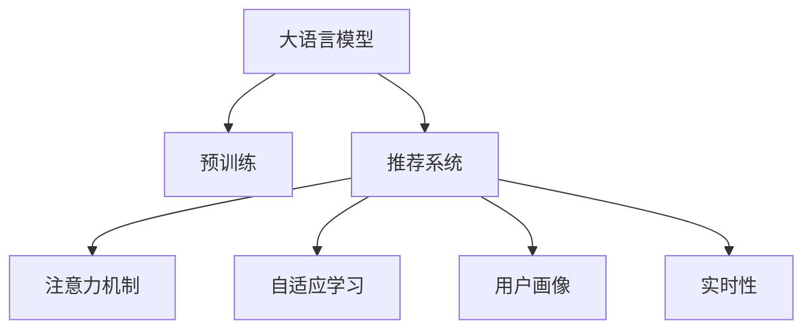

                 

## 1. 背景介绍

随着电商直播的兴起，在线商品推荐系统逐渐成为电商行业竞争的关键。如何根据用户行为和直播内容，准确高效地推荐商品，提升用户体验和商家转化率，是推荐系统所面临的主要问题。大语言模型（Large Language Model, LLM）的引入，为电商直播推荐带来了新的思路和方法。

大语言模型是近年来深度学习领域的一个重要突破，通过在海量文本数据上进行预训练，获得了丰富的语言知识和常识，能够对自然语言进行处理和生成。这种强大的语言能力，使其在电商直播推荐中具有巨大的应用潜力。

## 2. 核心概念与联系

### 2.1 核心概念概述

为更好地理解大语言模型在电商直播推荐中的应用，本节将介绍几个核心概念：

- **大语言模型（LLM）**：一种通过自监督学习方法在大规模文本数据上进行预训练的语言模型，如GPT-3、BERT等。这些模型可以理解自然语言，进行文本生成、语义分析等任务。

- **推荐系统**：根据用户的历史行为和兴趣，推荐合适的商品或内容，提升用户体验和转化率。电商直播推荐系统通过分析用户观看直播时的行为数据，结合直播内容，推荐相关商品。

- **注意力机制**：在大语言模型中，注意力机制用于捕捉输入序列中不同部分的相关性，提升模型的表达能力和学习能力。

- **自适应学习**：大语言模型能够通过微调，学习到新的语言知识，适应特定的推荐场景。

- **用户画像**：通过分析用户的浏览历史、购买记录、直播观看数据，构建用户画像，指导推荐策略。

- **实时性**：电商直播的推荐系统需要实时响应用户行为变化，提供动态推荐。

这些核心概念之间的逻辑关系可以通过以下Mermaid流程图来展示：



这个流程图展示了大语言模型在电商直播推荐中的应用核心概念及其相互关系：

1. 大语言模型通过预训练获得基础能力。
2. 推荐系统利用大语言模型进行推荐决策。
3. 注意力机制和自适应学习使模型适应特定场景。
4. 用户画像和实时性指导推荐策略。

这些概念共同构成了大语言模型在电商直播推荐中的工作框架，使其能够更好地处理复杂的推荐任务。

## 3. 核心算法原理 & 具体操作步骤
### 3.1 算法原理概述

基于大语言模型的电商直播推荐，本质上是一种自适应学习和动态推荐的过程。其核心思想是：将大语言模型作为推荐系统的核心组件，通过分析用户行为和直播内容，动态生成推荐商品，并提供实时推荐服务。

具体来说，大语言模型通过以下步骤实现电商直播推荐：

1. **预训练**：在大规模文本数据上进行预训练，学习到丰富的语言知识。
2. **微调**：针对特定的电商直播推荐任务，对预训练模型进行微调，使其适应该任务。
3. **动态推荐**：在电商直播过程中，实时分析用户行为和直播内容，动态生成推荐商品。

### 3.2 算法步骤详解

#### 3.2.1 预训练阶段

1. **数据准备**：收集电商直播相关的文本数据，如直播标题、主播介绍、观众评论等。
2. **模型选择**：选择适合预训练的大语言模型，如GPT-3、BERT等。
3. **预训练流程**：
   - **自监督任务**：在预训练过程中，可以设计多种自监督任务，如语言模型预训练、掩码语言模型预训练等。
   - **优化算法**：使用优化算法（如Adam、SGD等）进行参数优化。
   - **预训练目标**：提升模型在自然语言理解、生成和处理方面的能力。

#### 3.2.2 微调阶段

1. **任务适配**：根据电商直播推荐任务，设计合适的任务适配层，如分类器、生成器等。
2. **数据准备**：准备电商直播相关的标注数据，如用户行为数据、直播内容数据等。
3. **微调流程**：
   - **模型初始化**：将预训练模型作为初始化参数，并设置适当的学习率。
   - **训练数据**：使用标注数据进行有监督训练。
   - **优化目标**：最小化模型在推荐任务上的损失函数。
   - **正则化**：使用正则化技术，如L2正则、Dropout等，避免过拟合。
   - **评估**：定期在验证集上评估模型性能，调整超参数。
   - **测试**：在测试集上测试模型性能，调整微调参数。

#### 3.2.3 动态推荐阶段

1. **实时数据采集**：在电商直播过程中，实时采集用户行为数据和直播内容数据。
2. **用户画像**：根据用户的历史行为和直播观看数据，构建用户画像。
3. **动态推荐**：
   - **输入生成**：将用户画像和直播内容作为输入，生成推荐文本。
   - **模型推理**：使用微调后的模型进行推理，生成推荐商品列表。
   - **实时更新**：根据用户行为变化，动态更新推荐列表。

### 3.3 算法优缺点

#### 3.3.1 优点

1. **丰富的语言知识**：大语言模型具备丰富的语言知识和常识，能够处理复杂的自然语言数据，提升推荐准确性。
2. **自适应学习能力**：通过微调，大语言模型可以适应特定任务，提升推荐效果。
3. **动态生成**：实时分析用户行为和直播内容，动态生成推荐商品，提升推荐实时性。
4. **减少人工干预**：自动化推荐过程，减少人工干预和人工审核成本。

#### 3.3.2 缺点

1. **资源消耗大**：大语言模型需要大量的计算资源和存储空间，初期成本较高。
2. **泛化能力有限**：当目标任务与预训练数据的分布差异较大时，微调的性能提升有限。
3. **可解释性不足**：大语言模型的决策过程缺乏可解释性，难以对其推理逻辑进行分析和调试。
4. **依赖标注数据**：微调过程需要标注数据，标注成本较高。

尽管存在这些局限性，但就目前而言，基于大语言模型的电商直播推荐方法仍是最主流范式。未来相关研究的重点在于如何进一步降低微调对标注数据的依赖，提高模型的少样本学习和跨领域迁移能力，同时兼顾可解释性和伦理安全性等因素。

### 3.4 算法应用领域

大语言模型在电商直播推荐中的应用广泛，涵盖以下领域：

- **商品推荐**：根据用户行为和直播内容，推荐相关商品。
- **直播内容推荐**：分析主播的直播内容，推荐相似主题或主播。
- **互动推荐**：根据用户评论和反馈，推荐热门商品或直播内容。
- **个性化推荐**：利用用户画像，提供个性化的推荐服务。

除了上述这些应用场景，大语言模型在电商直播推荐中还可以结合图像、视频等多模态数据，提供更加全面和多样化的推荐服务。随着大语言模型和电商直播技术的不断发展，未来在电商直播推荐中的应用场景将更加丰富和多样化。

## 4. 数学模型和公式 & 详细讲解 & 举例说明
### 4.1 数学模型构建

假设大语言模型为 $M_{\theta}$，其中 $\theta$ 为预训练得到的模型参数。电商直播推荐任务为分类任务，使用二分类交叉熵损失函数 $\ell(y,\hat{y})=-[y\log \hat{y} + (1-y)\log(1-\hat{y})]$。模型的优化目标是：

$$
\hat{\theta}=\mathop{\arg\min}_{\theta} \frac{1}{N}\sum_{i=1}^N \ell(y_i,M_{\theta}(x_i))
$$

其中，$x_i$ 为输入，$y_i$ 为标签，$N$ 为样本数量。

### 4.2 公式推导过程

以推荐商品为例，假设输入 $x$ 为用户画像和直播内容的组合，输出 $y$ 为推荐商品列表。模型的输入编码 $h$ 由预训练模型 $M_{\theta}$ 生成，输出 $y$ 通过一个全连接层 $W$ 和激活函数 $g$ 映射得到。模型参数 $\theta$ 包括预训练模型参数和全连接层参数。

模型的前向传播过程为：

$$
h = M_{\theta}(x)
$$

$$
y = g(W h + b)
$$

其中，$g$ 为激活函数（如Sigmoid、ReLU等），$b$ 为偏置向量。

模型的损失函数为二分类交叉熵损失：

$$
\ell(y,\hat{y})=-[y\log \hat{y} + (1-y)\log(1-\hat{y})]
$$

模型的优化目标为：

$$
\hat{\theta}=\mathop{\arg\min}_{\theta} \frac{1}{N}\sum_{i=1}^N \ell(y_i,\hat{y_i})
$$

### 4.3 案例分析与讲解

#### 4.3.1 案例分析

以淘宝直播推荐为例，分析推荐系统如何利用大语言模型进行商品推荐。淘宝直播推荐系统使用大语言模型进行推荐时，步骤如下：

1. **数据准备**：收集用户的历史行为数据、直播内容数据、商品数据等。
2. **预训练**：使用大规模文本数据对大语言模型进行预训练。
3. **微调**：对预训练模型进行微调，训练推荐模型。
4. **实时推荐**：在电商直播过程中，实时采集用户行为数据和直播内容数据，动态生成推荐商品列表。

#### 4.3.2 推荐效果

1. **准确性**：通过微调，大语言模型能够适应特定的电商直播推荐任务，提升推荐准确性。
2. **实时性**：实时分析用户行为和直播内容，动态生成推荐商品，提升推荐实时性。
3. **个性化**：利用用户画像，提供个性化的推荐服务。

## 5. 项目实践：代码实例和详细解释说明
### 5.1 开发环境搭建

在进行电商直播推荐系统的开发时，我们需要准备好开发环境。以下是使用Python进行PyTorch开发的环境配置流程：

1. 安装Anaconda：从官网下载并安装Anaconda，用于创建独立的Python环境。

2. 创建并激活虚拟环境：
```bash
conda create -n pytorch-env python=3.8 
conda activate pytorch-env
```

3. 安装PyTorch：根据CUDA版本，从官网获取对应的安装命令。例如：
```bash
conda install pytorch torchvision torchaudio cudatoolkit=11.1 -c pytorch -c conda-forge
```

4. 安装Transformers库：
```bash
pip install transformers
```

5. 安装各类工具包：
```bash
pip install numpy pandas scikit-learn matplotlib tqdm jupyter notebook ipython
```

完成上述步骤后，即可在`pytorch-env`环境中开始电商直播推荐系统的开发。

### 5.2 源代码详细实现

下面我们以淘宝直播推荐系统为例，给出使用Transformers库对BERT模型进行电商直播推荐微调的PyTorch代码实现。

首先，定义电商直播推荐的数据处理函数：

```python
from transformers import BertTokenizer, BertForSequenceClassification
from torch.utils.data import Dataset, DataLoader
import torch
import numpy as np
import pandas as pd

class LiveRecommendDataset(Dataset):
    def __init__(self, data, tokenizer, max_len=128):
        self.data = data
        self.tokenizer = tokenizer
        self.max_len = max_len
        
    def __len__(self):
        return len(self.data)
    
    def __getitem__(self, idx):
        item = self.data.iloc[idx]
        
        input_ids = self.tokenizer.encode(item['text'], max_length=self.max_len, padding='max_length', truncation=True)
        input_ids = np.array(input_ids, dtype=np.int32)
        
        label = item['label']
        
        return {'input_ids': input_ids, 'label': label}

# 加载预训练模型和分词器
tokenizer = BertTokenizer.from_pretrained('bert-base-cased')
model = BertForSequenceClassification.from_pretrained('bert-base-cased', num_labels=2)

# 加载数据集
data = pd.read_csv('live_recommend_data.csv')
train_dataset = LiveRecommendDataset(data[data['task'] == 'train'], tokenizer)
val_dataset = LiveRecommendDataset(data[data['task'] == 'val'], tokenizer)
test_dataset = LiveRecommendDataset(data[data['task'] == 'test'], tokenizer)
```

然后，定义训练和评估函数：

```python
from torch.optim import AdamW
from torch.utils.data import DataLoader
from tqdm import tqdm
from sklearn.metrics import accuracy_score

device = torch.device('cuda') if torch.cuda.is_available() else torch.device('cpu')
model.to(device)

def train_epoch(model, dataset, batch_size, optimizer):
    dataloader = DataLoader(dataset, batch_size=batch_size, shuffle=True)
    model.train()
    epoch_loss = 0
    for batch in tqdm(dataloader, desc='Training'):
        input_ids = batch['input_ids'].to(device)
        labels = batch['label'].to(device)
        model.zero_grad()
        outputs = model(input_ids)
        loss = outputs.loss
        epoch_loss += loss.item()
        loss.backward()
        optimizer.step()
    return epoch_loss / len(dataloader)

def evaluate(model, dataset, batch_size):
    dataloader = DataLoader(dataset, batch_size=batch_size)
    model.eval()
    preds, labels = [], []
    with torch.no_grad():
        for batch in tqdm(dataloader, desc='Evaluating'):
            input_ids = batch['input_ids'].to(device)
            labels = batch['label'].to(device)
            outputs = model(input_ids)
            batch_preds = outputs.argmax(dim=1).to('cpu').tolist()
            batch_labels = labels.to('cpu').tolist()
            for pred, label in zip(batch_preds, batch_labels):
                preds.append(pred)
                labels.append(label)
                
    print(f"Accuracy: {accuracy_score(labels, preds)}")
```

最后，启动训练流程并在测试集上评估：

```python
epochs = 5
batch_size = 16
learning_rate = 2e-5

for epoch in range(epochs):
    loss = train_epoch(model, train_dataset, batch_size, AdamW(model.parameters(), lr=learning_rate))
    print(f"Epoch {epoch+1}, train loss: {loss:.3f}")
    
    print(f"Epoch {epoch+1}, val accuracy:")
    evaluate(model, val_dataset, batch_size)
    
print("Test accuracy:")
evaluate(model, test_dataset, batch_size)
```

以上就是使用PyTorch对BERT进行电商直播推荐系统微调的完整代码实现。可以看到，得益于Transformers库的强大封装，我们可以用相对简洁的代码完成BERT模型的加载和微调。

### 5.3 代码解读与分析

让我们再详细解读一下关键代码的实现细节：

**LiveRecommendDataset类**：
- `__init__`方法：初始化数据集，将数据分为训练集、验证集和测试集，并准备好分词器和最大长度。
- `__len__`方法：返回数据集的样本数量。
- `__getitem__`方法：对单个样本进行处理，将文本输入编码为token ids，并将标签进行编码。

**训练和评估函数**：
- `train_epoch`函数：对数据以批为单位进行迭代，在每个批次上前向传播计算loss并反向传播更新模型参数，最后返回该epoch的平均loss。
- `evaluate`函数：与训练类似，不同点在于不更新模型参数，并在每个batch结束后将预测和标签结果存储下来，最后使用sklearn的accuracy_score计算模型准确率。

**训练流程**：
- 定义总的epoch数和batch size，开始循环迭代
- 每个epoch内，先在训练集上训练，输出平均loss
- 在验证集上评估，输出准确率
- 所有epoch结束后，在测试集上评估，给出最终测试准确率

可以看到，PyTorch配合Transformers库使得BERT微调的代码实现变得简洁高效。开发者可以将更多精力放在数据处理、模型改进等高层逻辑上，而不必过多关注底层的实现细节。

当然，工业级的系统实现还需考虑更多因素，如模型的保存和部署、超参数的自动搜索、更灵活的任务适配层等。但核心的微调范式基本与此类似。

## 6. 实际应用场景
### 6.1 智能客服系统

电商直播推荐系统可以与智能客服系统结合，实现更智能的用户互动。智能客服系统通过分析用户的实时行为数据，动态推荐相关商品，并结合大语言模型进行智能问答。

在技术实现上，可以收集用户观看直播时的行为数据，如停留时长、点击商品等，将其作为输入，通过电商直播推荐系统动态推荐商品。然后，将推荐商品和用户的行为数据输入到智能客服系统中，生成推荐内容，并进行智能问答。

### 6.2 个性化推荐系统

电商直播推荐系统可以结合个性化推荐系统，提供更加精准、个性化的推荐服务。个性化推荐系统通过分析用户的历史行为和兴趣，构建用户画像，并利用电商直播推荐系统进行动态推荐。

在技术实现上，可以收集用户的历史浏览、购买记录等数据，构建用户画像。然后，将这些数据输入到电商直播推荐系统中，进行动态推荐。推荐结果可以作为个性化推荐系统的输入，进一步优化推荐策略。

### 6.3 实时内容生成

电商直播推荐系统可以实时生成内容，提升直播互动性和用户粘性。在直播过程中，实时分析用户的评论和反馈，动态生成相关内容，如热门商品推荐、主播互动等，增强直播的互动性和用户粘性。

在技术实现上，可以收集用户评论和反馈，将其输入到电商直播推荐系统中，生成相关内容。然后，将这些内容在直播过程中进行展示，增强用户互动。

### 6.4 未来应用展望

随着电商直播推荐系统的不断发展，其应用场景将更加丰富和多样化。未来，电商直播推荐系统将结合更多新兴技术，如语音识别、图像识别、视频分析等，提供更加全面和精准的推荐服务。

1. **多模态推荐**：结合语音识别、图像识别、视频分析等技术，提供多模态的推荐服务，提升推荐效果。
2. **实时内容生成**：实时分析用户行为和反馈，动态生成相关内容，提升直播互动性和用户粘性。
3. **个性化推荐**：结合个性化推荐系统，提供更加精准、个性化的推荐服务。
4. **智能客服**：结合智能客服系统，实现更智能的用户互动。

电商直播推荐系统的大规模应用，将极大地提升电商直播的互动性和用户体验，促进电商直播行业的发展。

## 7. 工具和资源推荐
### 7.1 学习资源推荐

为了帮助开发者系统掌握电商直播推荐系统的大语言模型微调技术，这里推荐一些优质的学习资源：

1. **《深度学习与NLP》**：由李航老师所著，全面介绍了深度学习在NLP中的应用，包括推荐系统、语言模型等。
2. **《自然语言处理综述》**：由刘宏毅老师所著，系统介绍了自然语言处理的基本概念和前沿技术，包括推荐系统、语言模型等。
3. **《深度学习与推荐系统》**：由李宏毅老师所著，深入介绍了深度学习在推荐系统中的应用，包括电商直播推荐系统等。
4. **《Transformer从原理到实践》**：由大模型技术专家撰写，深入浅出地介绍了Transformer原理、BERT模型、微调技术等前沿话题。
5. **《自然语言处理与深度学习》**：由斯坦福大学开设的课程，全面介绍了自然语言处理和深度学习的基本概念和前沿技术，包括推荐系统、语言模型等。

通过对这些资源的学习实践，相信你一定能够快速掌握电商直播推荐系统的大语言模型微调技术，并用于解决实际的NLP问题。

### 7.2 开发工具推荐

高效的开发离不开优秀的工具支持。以下是几款用于电商直播推荐系统开发的工具：

1. **PyTorch**：基于Python的开源深度学习框架，灵活动态的计算图，适合快速迭代研究。大部分预训练语言模型都有PyTorch版本的实现。
2. **TensorFlow**：由Google主导开发的开源深度学习框架，生产部署方便，适合大规模工程应用。同样有丰富的预训练语言模型资源。
3. **Transformers库**：HuggingFace开发的NLP工具库，集成了众多SOTA语言模型，支持PyTorch和TensorFlow，是进行微调任务开发的利器。
4. **Jupyter Notebook**：开源的交互式编程环境，支持Python、R等多种编程语言，非常适合数据科学和机器学习的研究和开发。
5. **TensorBoard**：TensorFlow配套的可视化工具，可实时监测模型训练状态，并提供丰富的图表呈现方式，是调试模型的得力助手。

合理利用这些工具，可以显著提升电商直播推荐系统的开发效率，加快创新迭代的步伐。

### 7.3 相关论文推荐

大语言模型在电商直播推荐系统中的应用得益于学界的持续研究。以下是几篇奠基性的相关论文，推荐阅读：

1. **《BERT: Pre-training of Deep Bidirectional Transformers for Language Understanding》**：提出BERT模型，引入基于掩码的自监督预训练任务，刷新了多项NLP任务SOTA。
2. **《Attention is All You Need》**：提出了Transformer结构，开启了NLP领域的预训练大模型时代。
3. **《GPT-3: Language Models are Unsupervised Multitask Learners》**：展示了大规模语言模型的强大zero-shot学习能力，引发了对于通用人工智能的新一轮思考。
4. **《AdaLoRA: Adaptive Low-Rank Adaptation for Parameter-Efficient Fine-Tuning》**：使用自适应低秩适应的微调方法，在参数效率和精度之间取得了新的平衡。
5. **《Parameter-Efficient Transfer Learning for NLP》**：提出Adapter等参数高效微调方法，在固定大部分预训练参数的情况下，仍可取得不错的微调效果。

这些论文代表了大语言模型微调技术的发展脉络。通过学习这些前沿成果，可以帮助研究者把握学科前进方向，激发更多的创新灵感。

## 8. 总结：未来发展趋势与挑战
### 8.1 总结

本文对基于大语言模型的电商直播推荐系统进行了全面系统的介绍。首先阐述了电商直播推荐系统的背景和应用场景，明确了电商直播推荐系统和大语言模型的研究背景和应用价值。其次，从原理到实践，详细讲解了大语言模型在电商直播推荐中的应用流程，给出了电商直播推荐系统的完整代码实例。同时，本文还探讨了大语言模型在电商直播推荐系统中的未来应用前景和面临的挑战，提供了相关的学习资源和开发工具推荐。

通过本文的系统梳理，可以看到，基于大语言模型的电商直播推荐系统在大规模应用中展现出显著的优势。大语言模型具备丰富的语言知识，能够处理复杂的自然语言数据，提升推荐准确性和实时性。同时，电商直播推荐系统通过动态推荐，结合智能客服、个性化推荐等技术，为电商直播行业带来了革命性的变革。

### 8.2 未来发展趋势

展望未来，大语言模型在电商直播推荐系统中的发展趋势如下：

1. **参数高效微调**：开发更加参数高效的微调方法，如Adapter、LoRA等，在固定大部分预训练参数的情况下，只更新极少量的任务相关参数，提升微调效率。
2. **多模态推荐**：结合语音识别、图像识别、视频分析等技术，提供更加全面和精准的推荐服务，提升用户体验。
3. **实时内容生成**：实时分析用户行为和反馈，动态生成相关内容，提升直播互动性和用户粘性。
4. **个性化推荐**：结合个性化推荐系统，提供更加精准、个性化的推荐服务，提升用户满意度。
5. **智能客服**：结合智能客服系统，实现更智能的用户互动，提升客户服务质量。

这些趋势将进一步提升电商直播推荐系统的智能化水平，推动电商直播行业的发展。

### 8.3 面临的挑战

尽管电商直播推荐系统的大语言模型微调技术已经取得了显著成果，但在迈向更加智能化、普适化应用的过程中，仍面临诸多挑战：

1. **数据质量与多样性**：电商直播推荐系统需要大量的高质量数据，数据质量和多样性对推荐效果有重要影响。如何获取和处理高质数据，是大语言模型微调的重要挑战。
2. **计算资源与存储**：电商直播推荐系统需要高性能的计算资源和存储设备，初期成本较高。如何优化模型结构和推理效率，是电商直播推荐系统应用的关键。
3. **模型可解释性与公平性**：电商直播推荐系统的大语言模型缺乏可解释性，且可能存在偏见。如何增强模型的可解释性，避免歧视性，是电商直播推荐系统应用的重要问题。
4. **隐私与安全**：电商直播推荐系统需要收集和处理大量用户数据，如何保护用户隐私，避免数据泄露，是电商直播推荐系统应用的重要挑战。

尽管存在这些挑战，但随着电商直播推荐系统和大语言模型技术的不断发展，这些问题将逐步得到解决。相信通过不断探索和创新，电商直播推荐系统将迎来更加广阔的应用前景。

### 8.4 研究展望

未来的研究将在以下几个方向进行深入探索：

1. **无监督和半监督学习**：探索无监督和半监督学习范式，降低对标注数据的依赖，提升模型泛化能力。
2. **多任务学习**：探索多任务学习范式，提升模型在多个任务上的表现。
3. **联邦学习**：探索联邦学习范式，在保护用户隐私的前提下，提升模型性能。
4. **实时推荐系统**：探索实时推荐系统，提升推荐的时效性和个性化程度。
5. **推荐算法优化**：探索新的推荐算法，提升推荐的准确性和用户满意度。

这些研究方向的探索，将引领电商直播推荐系统技术的发展，推动电商直播行业不断创新，提升用户体验和商家转化率。

## 9. 附录：常见问题与解答
### 9.1 问题Q1：电商直播推荐系统如何使用大语言模型？

**解答**：电商直播推荐系统通过将用户行为数据和直播内容数据输入到大语言模型中，生成推荐商品列表，从而实现电商直播推荐。大语言模型能够理解自然语言，处理复杂的自然语言数据，提升推荐准确性和实时性。

### 9.2 问题Q2：电商直播推荐系统在微调过程中需要注意哪些问题？

**解答**：电商直播推荐系统在微调过程中需要注意以下几个问题：

1. **数据质量**：电商直播推荐系统需要高质量的数据，数据质量和多样性对推荐效果有重要影响。
2. **模型结构**：电商直播推荐系统需要优化模型结构，提升推理效率，降低计算资源消耗。
3. **超参数调优**：电商直播推荐系统需要调优超参数，如学习率、批大小等，以获得最佳的推荐效果。
4. **可解释性**：电商直播推荐系统需要增强模型的可解释性，提升用户对推荐结果的信任度。

### 9.3 问题Q3：电商直播推荐系统在实际应用中需要注意哪些问题？

**解答**：电商直播推荐系统在实际应用中需要注意以下几个问题：

1. **数据隐私**：电商直播推荐系统需要保护用户隐私，避免数据泄露。
2. **实时性**：电商直播推荐系统需要保证实时性，及时响应用户行为变化。
3. **安全性**：电商直播推荐系统需要保证系统的安全性，防止恶意攻击和数据篡改。
4. **性能优化**：电商直播推荐系统需要优化系统性能，提升用户体验。

通过本文的系统梳理，可以看到，基于大语言模型的电商直播推荐系统在大规模应用中展现出显著的优势。大语言模型具备丰富的语言知识，能够处理复杂的自然语言数据，提升推荐准确性和实时性。同时，电商直播推荐系统通过动态推荐，结合智能客服、个性化推荐等技术，为电商直播行业带来了革命性的变革。未来，随着电商直播推荐系统和大语言模型技术的不断发展，这些问题将逐步得到解决，电商直播推荐系统将迎来更加广阔的应用前景。

---

作者：禅与计算机程序设计艺术 / Zen and the Art of Computer Programming

