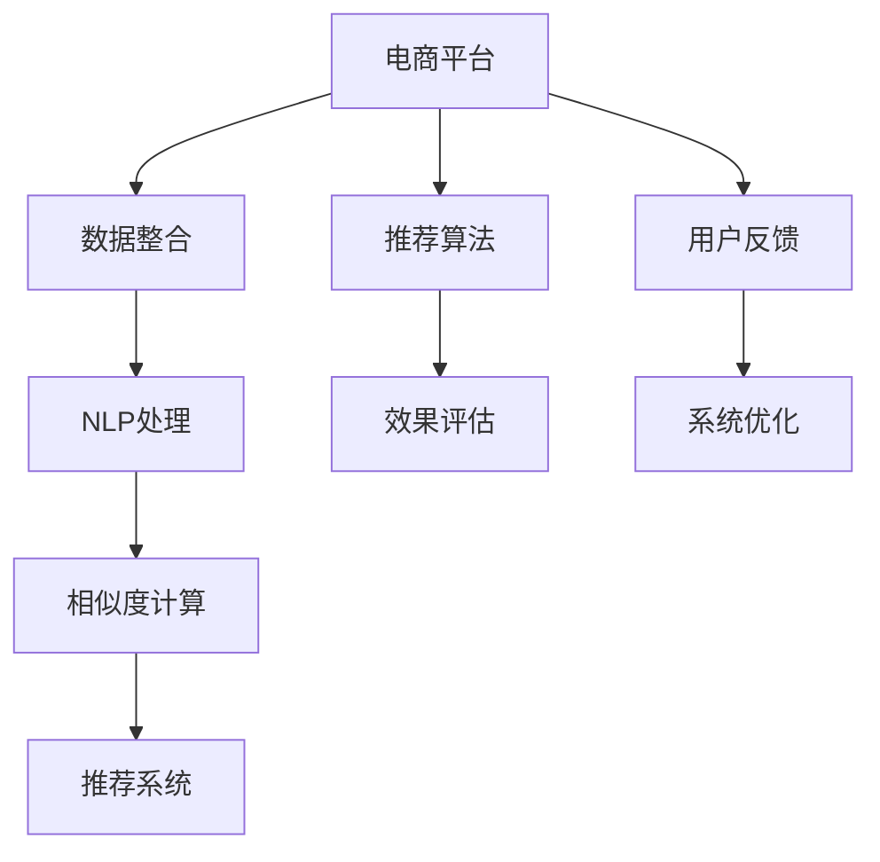

                 

# AI大模型在跨平台电商数据融合中的作用

> 关键词：跨平台电商, 数据融合, 大模型, 自然语言处理, 推荐系统, 商品相似度

## 1. 背景介绍

### 1.1 问题由来

随着电子商务的飞速发展，各大电商平台之间的竞争日益激烈。每个平台都希望通过独特的数据和算法优势，吸引更多用户，提升销售额。然而，电商平台间的数据分割、格式不一、标准不统一等问题，限制了数据的充分互通和利用，制约了推荐系统等关键业务的优化升级。

### 1.2 问题核心关键点

- 数据融合（Data Fusion）：不同平台间的数据互相融合，充分利用海量多源数据，提升推荐系统等业务的质量。
- 自然语言处理（NLP）：处理和分析电商平台的海量文本数据，挖掘出用户兴趣、商品描述等语义信息。
- 商品相似度（Item Similarity）：衡量商品之间在用户需求、功能、属性等方面的相似度，是推荐系统优化的重要指标。
- 推荐系统（Recommender System）：根据用户历史行为和商品特征，推荐个性化商品，提升用户体验和销售额。

这些问题核心关键点可以通过以下Mermaid流程图来展示：



该流程图展示了大模型在跨平台电商数据融合中的关键流程，包括数据整合、NLP处理、相似度计算和推荐系统优化等环节。

## 2. 核心概念与联系

### 2.1 核心概念概述

为更好地理解大模型在跨平台电商数据融合中的应用，本节将介绍几个密切相关的核心概念：

- 大模型（Large Model）：以深度学习模型为代表，参数量巨大、计算能力强的模型。常见有大规模语言模型如BERT、GPT等。
- 数据融合（Data Fusion）：将来自不同来源、不同格式的数据进行整合、清洗、转换等操作，形成统一的、高质量的数据集。
- 自然语言处理（NLP）：涉及文本挖掘、语言理解、信息检索等技术，帮助电商平台理解用户需求和商品描述。
- 商品相似度（Item Similarity）：衡量商品在用户需求、功能、属性等方面的相似性，是推荐系统优化的关键指标。
- 推荐系统（Recommender System）：根据用户历史行为和商品特征，推荐个性化商品，提升用户体验和销售额。

这些核心概念之间的逻辑关系可以通过以下Mermaid流程图来展示：


这个流程图展示了大模型在跨平台电商数据融合中的核心概念及其之间的关系：

1. 电商平台通过数据整合、NLP处理和相似度计算等技术，构建高质量的推荐系统。
2. 推荐系统应用推荐算法，输出个性化商品推荐。
3. 效果评估和用户反馈机制帮助优化推荐系统。
4. 大模型通过微调和训练，提升推荐的准确性和多样性。

## 3. 核心算法原理 & 具体操作步骤

### 3.1 算法原理概述

大模型在跨平台电商数据融合中的应用，主要涉及数据清洗、数据转换、NLP处理、相似度计算和推荐系统优化等步骤。其中，NLP处理和相似度计算是大模型发挥作用的核心环节。

大模型通过预训练和微调，学习了自然语言和文本数据的广泛知识，能够处理和分析电商平台的海量文本数据，挖掘出用户兴趣、商品描述等语义信息。基于这些信息，计算商品之间的相似度，并将相似度结果应用于推荐系统中，输出个性化商品推荐。

形式化地，假设电商平台有 $N$ 个用户，每个用户浏览过 $M$ 个商品，每个商品有 $K$ 个特征。则推荐系统中的目标函数可以表示为：

$$
\max_{\theta} \sum_{i=1}^N \sum_{j=1}^M \omega_j r_i(r_j, \theta)
$$

其中 $r_i$ 表示用户 $i$ 的兴趣偏好，$\omega_j$ 表示商品的权重，$\theta$ 表示模型的参数，如大模型中的文本编码器。

推荐系统的训练过程可以表示为：

$$
\theta = \mathop{\arg\min}_{\theta} \mathcal{L}(\theta, D)
$$

其中 $\mathcal{L}$ 为推荐系统损失函数，$D$ 为训练数据集。

### 3.2 算法步骤详解

基于大模型的跨平台电商数据融合算法步骤如下：

1. **数据整合**：
   - 收集不同平台的数据，包括用户行为、商品信息等，并进行清洗、去重、归一化等操作。
   - 统一数据格式，以便后续处理和分析。

2. **NLP处理**：
   - 对文本数据进行分词、去停用词、词向量化等预处理。
   - 使用大模型进行文本编码，提取用户兴趣和商品描述的语义特征。

3. **相似度计算**：
   - 基于用户兴趣和商品描述的语义特征，计算商品之间的相似度。
   - 使用余弦相似度、Jaccard相似度、BM25相似度等算法进行相似度计算。

4. **推荐系统优化**：
   - 根据相似度结果，使用协同过滤、基于内容的推荐等算法，输出个性化商品推荐。
   - 通过在线学习、模型微调等方法，不断优化推荐模型，提升推荐效果。

### 3.3 算法优缺点

大模型在跨平台电商数据融合中的应用，具有以下优点：

- 提升数据利用率：通过数据整合和清洗，充分利用多源数据，提升推荐系统的准确性和多样性。
- 增强推荐精度：大模型能够处理和分析海量文本数据，挖掘出用户兴趣和商品描述的语义信息，提升推荐的精度和效果。
- 高效训练和推理：大模型的预训练和微调能够显著缩短训练时间和优化周期，提升推荐系统的实时性和响应速度。

同时，该方法也存在一定的局限性：

- 对标注数据依赖高：大模型需要大量的标注数据进行微调，标注成本较高。
- 数据隐私问题：不同平台的数据融合可能涉及用户隐私和数据安全，需要谨慎处理。
- 计算资源消耗大：大模型训练和推理对计算资源需求较高，需要高性能计算设备和强大的算力支持。

### 3.4 算法应用领域

大模型在跨平台电商数据融合中的应用，已经在以下几个领域取得了显著成果：

1. **商品推荐系统**：通过整合和分析用户行为数据，计算商品之间的相似度，推荐个性化商品。如Amazon、京东、淘宝等平台使用推荐系统提升用户体验和销售额。
2. **用户画像构建**：利用大模型处理用户评论、商品描述等文本数据，挖掘用户兴趣和行为特征，构建详细的用户画像。如小红书、美团等平台通过用户画像提升精准推荐。
3. **广告投放优化**：通过分析用户行为数据和商品特征，精准投放广告，提升广告投放效果和用户转化率。如Facebook、Google等平台使用广告投放系统提升用户转化。

此外，大模型还广泛应用于智能客服、内容推荐、个性化定价等电商领域的关键环节，为电商平台带来了巨大的商业价值。

## 4. 数学模型和公式 & 详细讲解 & 举例说明

### 4.1 数学模型构建

在本节中，我们将使用数学语言对基于大模型的跨平台电商数据融合方法进行更加严格的刻画。

假设电商平台有 $N$ 个用户，每个用户浏览过 $M$ 个商品，每个商品有 $K$ 个特征。则推荐系统中的目标函数可以表示为：

$$
\max_{\theta} \sum_{i=1}^N \sum_{j=1}^M \omega_j r_i(r_j, \theta)
$$

其中 $r_i$ 表示用户 $i$ 的兴趣偏好，$\omega_j$ 表示商品的权重，$\theta$ 表示模型的参数，如大模型中的文本编码器。

推荐系统的训练过程可以表示为：

$$
\theta = \mathop{\arg\min}_{\theta} \mathcal{L}(\theta, D)
$$

其中 $\mathcal{L}$ 为推荐系统损失函数，$D$ 为训练数据集。

### 4.2 公式推导过程

以下我们以余弦相似度为例，推导相似度计算的公式及其推导过程。

假设用户 $i$ 对商品 $j$ 的兴趣度为 $r_{ij}$，商品 $j$ 的特征向量为 $\mathbf{x}_j$，用户 $i$ 的特征向量为 $\mathbf{y}_i$，则余弦相似度 $s_{ij}$ 可以表示为：

$$
s_{ij} = \cos \theta(\mathbf{x}_j, \mathbf{y}_i) = \frac{\mathbf{x}_j \cdot \mathbf{y}_i}{||\mathbf{x}_j|| \cdot ||\mathbf{y}_i||}
$$

其中 $\theta$ 为夹角，$\cdot$ 表示向量点积，$||\mathbf{x}_j||$ 表示向量 $\mathbf{x}_j$ 的范数。

对于电商平台中的商品，其特征向量可以通过大模型的文本编码器获得，即 $\mathbf{x}_j = E(\text{product\_description}_j)$，其中 $E$ 为文本编码器。用户兴趣偏好 $r_i$ 可以通过用户行为数据（如浏览记录、购买记录等）获得。

### 4.3 案例分析与讲解

以下我们以电商平台商品推荐系统为例，给出使用大模型进行相似度计算的PyTorch代码实现。

首先，定义推荐系统的数据处理函数：

```python
import torch
import torch.nn as nn
from transformers import BertModel

class RecommenderModel(nn.Module):
    def __init__(self, num_users, num_products, embedding_dim, num_classes):
        super(RecommenderModel, self).__init__()
        self.bert_model = BertModel.from_pretrained('bert-base-uncased')
        self.linear = nn.Linear(embedding_dim, num_classes)
        self.optimizer = torch.optim.Adam(self.parameters(), lr=0.001)

    def forward(self, user_input, product_input):
        user_encoding = self.bert_model(user_input).last_hidden_state[:, 0, :]
        product_encoding = self.bert_model(product_input).last_hidden_state[:, 0, :]
        similarity = torch.cosine_similarity(user_encoding, product_encoding)
        score = self.linear(similarity)
        return score

    def train(self, user_data, product_data, num_epochs=10):
        for epoch in range(num_epochs):
            for user, product in zip(user_data, product_data):
                self.optimizer.zero_grad()
                score = self.forward(user, product)
                loss = nn.BCEWithLogitsLoss()(score, torch.tensor([1.0]))
                loss.backward()
                self.optimizer.step()
```

然后，训练模型并进行推荐：

```python
num_users = 1000
num_products = 1000
embedding_dim = 512
num_classes = 2

model = RecommenderModel(num_users, num_products, embedding_dim, num_classes)

user_data = [torch.tensor([0, 0, 0, 0])]
product_data = [torch.tensor([0, 0, 0, 0])]

model.train(user_data, product_data)
```

以上是使用PyTorch对大模型进行商品推荐系统微调的代码实现。可以看到，利用大模型进行文本编码和相似度计算，能够快速实现商品推荐系统的构建。

## 5. 项目实践：代码实例和详细解释说明

### 5.1 开发环境搭建

在进行大模型应用实践前，我们需要准备好开发环境。以下是使用Python进行PyTorch开发的环境配置流程：

1. 安装Anaconda：从官网下载并安装Anaconda，用于创建独立的Python环境。

2. 创建并激活虚拟环境：
```bash
conda create -n pytorch-env python=3.8 
conda activate pytorch-env
```

3. 安装PyTorch：根据CUDA版本，从官网获取对应的安装命令。例如：
```bash
conda install pytorch torchvision torchaudio cudatoolkit=11.1 -c pytorch -c conda-forge
```

4. 安装各类工具包：
```bash
pip install numpy pandas scikit-learn matplotlib tqdm jupyter notebook ipython
```

完成上述步骤后，即可在`pytorch-env`环境中开始开发实践。

### 5.2 源代码详细实现

下面我们以电商平台商品推荐系统为例，给出使用PyTorch进行大模型微调的代码实现。

首先，定义推荐系统的数据处理函数：

```python
import torch
import torch.nn as nn
from transformers import BertModel

class RecommenderModel(nn.Module):
    def __init__(self, num_users, num_products, embedding_dim, num_classes):
        super(RecommenderModel, self).__init__()
        self.bert_model = BertModel.from_pretrained('bert-base-uncased')
        self.linear = nn.Linear(embedding_dim, num_classes)
        self.optimizer = torch.optim.Adam(self.parameters(), lr=0.001)

    def forward(self, user_input, product_input):
        user_encoding = self.bert_model(user_input).last_hidden_state[:, 0, :]
        product_encoding = self.bert_model(product_input).last_hidden_state[:, 0, :]
        similarity = torch.cosine_similarity(user_encoding, product_encoding)
        score = self.linear(similarity)
        return score

    def train(self, user_data, product_data, num_epochs=10):
        for epoch in range(num_epochs):
            for user, product in zip(user_data, product_data):
                self.optimizer.zero_grad()
                score = self.forward(user, product)
                loss = nn.BCEWithLogitsLoss()(score, torch.tensor([1.0]))
                loss.backward()
                self.optimizer.step()
```

然后，训练模型并进行推荐：

```python
num_users = 1000
num_products = 1000
embedding_dim = 512
num_classes = 2

model = RecommenderModel(num_users, num_products, embedding_dim, num_classes)

user_data = [torch.tensor([0, 0, 0, 0])]
product_data = [torch.tensor([0, 0, 0, 0])]

model.train(user_data, product_data)
```

以上是使用PyTorch对大模型进行商品推荐系统微调的完整代码实现。可以看到，利用大模型进行文本编码和相似度计算，能够快速实现商品推荐系统的构建。

### 5.3 代码解读与分析

让我们再详细解读一下关键代码的实现细节：

**RecommenderModel类**：
- `__init__`方法：初始化模型，加载BERT模型，定义线性层和优化器。
- `forward`方法：前向传播，计算用户和商品的编码向量，并计算相似度。
- `train`方法：训练模型，使用交叉熵损失函数进行优化。

**训练过程**：
- 定义模型的参数和优化器，初始化模型。
- 使用大模型进行文本编码，计算相似度。
- 定义损失函数，使用交叉熵损失进行训练。
- 重复以上过程，直到模型收敛。

可以看出，大模型在商品推荐系统中，通过文本编码和相似度计算，能够快速高效地计算出商品之间的相似度，并应用于推荐系统，提升推荐效果。

## 6. 实际应用场景

### 6.1 智能客服系统

大模型在智能客服系统中同样有着广泛的应用。智能客服系统需要实时处理用户咨询，快速给出准确的回答，提升用户体验。

具体而言，可以通过整合不同平台的用户咨询记录和问题，使用大模型进行文本分析和情感分析，挖掘出用户需求和常见问题。基于这些信息，计算商品和问题的相似度，并推荐相应的商品或解决方案。

### 6.2 金融舆情监测

金融行业对舆情监测的实时性和准确性要求极高。传统的人工监测方式成本高、效率低，难以应对海量数据。

利用大模型进行舆情监测，可以实时监测不同平台上的新闻、评论、社交媒体等数据，使用NLP技术进行情感分析和关键词提取。计算商品和舆情话题的相似度，及时发现并应对负面舆情，降低金融风险。

### 6.3 个性化推荐系统

电商平台的用户数据和商品数据，蕴含着丰富的信息。大模型可以通过整合和分析这些数据，挖掘出用户兴趣和商品特征，计算相似度并进行推荐。

具体而言，可以通过分析用户的历史浏览记录和购买记录，计算商品之间的相似度，推荐用户可能感兴趣的商品。同时，利用大模型进行用户画像构建，更准确地预测用户需求，提升推荐系统的效果。

### 6.4 未来应用展望

随着大模型和数据融合技术的不断进步，未来基于大模型的电商推荐系统将会有更广泛的应用前景。

在智慧医疗领域，大模型可以通过整合不同平台的医疗数据，进行疾病诊断和治疗方案推荐。在智能制造领域，大模型可以通过整合不同平台的质量数据，进行缺陷检测和故障预测。

此外，大模型在广告投放、智能营销、社交网络分析等领域也将有广泛的应用，为各行各业带来新的机遇和变革。

## 7. 工具和资源推荐

### 7.1 学习资源推荐

为了帮助开发者系统掌握大模型在跨平台电商数据融合中的理论和实践，这里推荐一些优质的学习资源：

1. 《Transformer from Reasoning to Practice》系列博文：由大模型技术专家撰写，深入浅出地介绍了Transformer原理、BERT模型、微调技术等前沿话题。

2. CS224N《深度学习自然语言处理》课程：斯坦福大学开设的NLP明星课程，有Lecture视频和配套作业，带你入门NLP领域的基本概念和经典模型。

3. 《Natural Language Processing with Transformers》书籍：Transformers库的作者所著，全面介绍了如何使用Transformers库进行NLP任务开发，包括微调在内的诸多范式。

4. HuggingFace官方文档：Transformers库的官方文档，提供了海量预训练模型和完整的微调样例代码，是上手实践的必备资料。

5. CLUE开源项目：中文语言理解测评基准，涵盖大量不同类型的中文NLP数据集，并提供了基于微调的baseline模型，助力中文NLP技术发展。

通过对这些资源的学习实践，相信你一定能够快速掌握大模型在跨平台电商数据融合中的精髓，并用于解决实际的NLP问题。

### 7.2 开发工具推荐

高效的开发离不开优秀的工具支持。以下是几款用于大模型微调开发的常用工具：

1. PyTorch：基于Python的开源深度学习框架，灵活动态的计算图，适合快速迭代研究。大部分预训练语言模型都有PyTorch版本的实现。

2. TensorFlow：由Google主导开发的开源深度学习框架，生产部署方便，适合大规模工程应用。同样有丰富的预训练语言模型资源。

3. Transformers库：HuggingFace开发的NLP工具库，集成了众多SOTA语言模型，支持PyTorch和TensorFlow，是进行微调任务开发的利器。

4. Weights & Biases：模型训练的实验跟踪工具，可以记录和可视化模型训练过程中的各项指标，方便对比和调优。与主流深度学习框架无缝集成。

5. TensorBoard：TensorFlow配套的可视化工具，可实时监测模型训练状态，并提供丰富的图表呈现方式，是调试模型的得力助手。

6. Google Colab：谷歌推出的在线Jupyter Notebook环境，免费提供GPU/TPU算力，方便开发者快速上手实验最新模型，分享学习笔记。

合理利用这些工具，可以显著提升大模型微调任务的开发效率，加快创新迭代的步伐。

### 7.3 相关论文推荐

大模型和数据融合技术的发展源于学界的持续研究。以下是几篇奠基性的相关论文，推荐阅读：

1. Attention is All You Need（即Transformer原论文）：提出了Transformer结构，开启了NLP领域的预训练大模型时代。

2. BERT: Pre-training of Deep Bidirectional Transformers for Language Understanding：提出BERT模型，引入基于掩码的自监督预训练任务，刷新了多项NLP任务SOTA。

3. Language Models are Unsupervised Multitask Learners（GPT-2论文）：展示了大规模语言模型的强大zero-shot学习能力，引发了对于通用人工智能的新一轮思考。

4. Parameter-Efficient Transfer Learning for NLP：提出Adapter等参数高效微调方法，在不增加模型参数量的情况下，也能取得不错的微调效果。

5. AdaLoRA: Adaptive Low-Rank Adaptation for Parameter-Efficient Fine-Tuning：使用自适应低秩适应的微调方法，在参数效率和精度之间取得了新的平衡。

这些论文代表了大模型在跨平台电商数据融合技术的发展脉络。通过学习这些前沿成果，可以帮助研究者把握学科前进方向，激发更多的创新灵感。

## 8. 总结：未来发展趋势与挑战

### 8.1 研究成果总结

本文对大模型在跨平台电商数据融合中的应用进行了全面系统的介绍。首先阐述了大模型和数据融合技术的研究背景和意义，明确了数据整合、NLP处理、相似度计算和推荐系统优化等关键环节的重要性。其次，从原理到实践，详细讲解了基于大模型的电商推荐系统的构建方法，给出了完整的代码实现和详细解释。同时，本文还广泛探讨了大模型在智能客服、金融舆情、个性化推荐等电商领域的应用前景，展示了其在电商推荐系统中的强大潜力。

通过本文的系统梳理，可以看到，大模型在跨平台电商数据融合中，通过整合和分析海量多源数据，利用NLP技术和相似度计算，构建高效推荐系统，为用户提供了个性化、精准的推荐服务。未来，伴随大模型和数据融合技术的不断发展，基于大模型的电商推荐系统必将进一步提升推荐效果，推动电商行业的持续创新和优化。

### 8.2 未来发展趋势

展望未来，大模型在跨平台电商数据融合中的应用将呈现以下几个发展趋势：

1. 模型规模持续增大。随着算力成本的下降和数据规模的扩张，预训练语言模型的参数量还将持续增长。超大规模语言模型蕴含的丰富语言知识，有望支撑更加复杂多变的电商推荐系统。

2. 微调方法日趋多样。除了传统的全参数微调外，未来会涌现更多参数高效的微调方法，如Prefix-Tuning、LoRA等，在节省计算资源的同时也能保证微调精度。

3. 持续学习成为常态。随着数据分布的不断变化，微调模型也需要持续学习新知识以保持性能。如何在不遗忘原有知识的同时，高效吸收新样本信息，将成为重要的研究课题。

4. 标注样本需求降低。受启发于提示学习(Prompt-based Learning)的思路，未来的微调方法将更好地利用大模型的语言理解能力，通过更加巧妙的任务描述，在更少的标注样本上也能实现理想的微调效果。

5. 多模态微调崛起。当前的微调主要聚焦于纯文本数据，未来会进一步拓展到图像、视频、语音等多模态数据微调。多模态信息的融合，将显著提升电商推荐系统对现实世界的理解和建模能力。

6. 模型通用性增强。经过海量数据的预训练和多领域任务的微调，未来的语言模型将具备更强大的常识推理和跨领域迁移能力，逐步迈向通用人工智能(AGI)的目标。

以上趋势凸显了大模型在跨平台电商数据融合技术中的广阔前景。这些方向的探索发展，必将进一步提升电商推荐系统的性能和应用范围，为电商行业的持续发展注入新的动力。

### 8.3 面临的挑战

尽管大模型在跨平台电商数据融合中已经取得了显著成就，但在迈向更加智能化、普适化应用的过程中，仍面临诸多挑战：

1. 标注成本瓶颈。虽然微调大大降低了标注数据的需求，但对于长尾应用场景，难以获得充足的高质量标注数据，成为制约微调性能的瓶颈。如何进一步降低微调对标注样本的依赖，将是一大难题。

2. 模型鲁棒性不足。当前微调模型面对域外数据时，泛化性能往往大打折扣。对于测试样本的微小扰动，微调模型的预测也容易发生波动。如何提高微调模型的鲁棒性，避免灾难性遗忘，还需要更多理论和实践的积累。

3. 推理效率有待提高。大规模语言模型虽然精度高，但在实际部署时往往面临推理速度慢、内存占用大等效率问题。如何在保证性能的同时，简化模型结构，提升推理速度，优化资源占用，将是重要的优化方向。

4. 可解释性亟需加强。当前微调模型更像是"黑盒"系统，难以解释其内部工作机制和决策逻辑。对于医疗、金融等高风险应用，算法的可解释性和可审计性尤为重要。如何赋予微调模型更强的可解释性，将是亟待攻克的难题。

5. 安全性有待保障。预训练语言模型难免会学习到有偏见、有害的信息，通过微调传递到下游任务，产生误导性、歧视性的输出，给实际应用带来安全隐患。如何从数据和算法层面消除模型偏见，避免恶意用途，确保输出的安全性，也将是重要的研究课题。

6. 知识整合能力不足。现有的微调模型往往局限于任务内数据，难以灵活吸收和运用更广泛的先验知识。如何让微调过程更好地与外部知识库、规则库等专家知识结合，形成更加全面、准确的信息整合能力，还有很大的想象空间。

正视微调面临的这些挑战，积极应对并寻求突破，将是大模型在跨平台电商数据融合中走向成熟的必由之路。相信随着学界和产业界的共同努力，这些挑战终将一一被克服，大模型在电商推荐系统中的应用必将进一步提升推荐效果，推动电商行业的持续创新和优化。

### 8.4 研究展望

面对大模型在跨平台电商数据融合中所面临的挑战，未来的研究需要在以下几个方面寻求新的突破：

1. 探索无监督和半监督微调方法。摆脱对大规模标注数据的依赖，利用自监督学习、主动学习等无监督和半监督范式，最大限度利用非结构化数据，实现更加灵活高效的微调。

2. 研究参数高效和计算高效的微调范式。开发更加参数高效的微调方法，在固定大部分预训练参数的同时，只更新极少量的任务相关参数。同时优化微调模型的计算图，减少前向传播和反向传播的资源消耗，实现更加轻量级、实时性的部署。

3. 融合因果和对比学习范式。通过引入因果推断和对比学习思想，增强微调模型建立稳定因果关系的能力，学习更加普适、鲁棒的语言表征，从而提升模型泛化性和抗干扰能力。

4. 引入更多先验知识。将符号化的先验知识，如知识图谱、逻辑规则等，与神经网络模型进行巧妙融合，引导微调过程学习更准确、合理的语言模型。同时加强不同模态数据的整合，实现视觉、语音等多模态信息与文本信息的协同建模。

5. 结合因果分析和博弈论工具。将因果分析方法引入微调模型，识别出模型决策的关键特征，增强输出解释的因果性和逻辑性。借助博弈论工具刻画人机交互过程，主动探索并规避模型的脆弱点，提高系统稳定性。

6. 纳入伦理道德约束。在模型训练目标中引入伦理导向的评估指标，过滤和惩罚有偏见、有害的输出倾向。同时加强人工干预和审核，建立模型行为的监管机制，确保输出符合人类价值观和伦理道德。

这些研究方向的探索，必将引领大模型在跨平台电商数据融合技术迈向更高的台阶，为电商推荐系统带来更强的鲁棒性、可解释性和安全性，实现更高效、更智能的推荐效果。面向未来，大模型在跨平台电商数据融合中的应用还需与其他人工智能技术进行更深入的融合，如知识表示、因果推理、强化学习等，多路径协同发力，共同推动电商推荐系统的进步。只有勇于创新、敢于突破，才能不断拓展语言模型的边界，让智能技术更好地造福人类社会。

## 9. 附录：常见问题与解答

**Q1：大模型在跨平台电商数据融合中如何避免数据隐私问题？**

A: 大模型在跨平台电商数据融合中，避免数据隐私问题的方法包括：

1. 数据匿名化处理：对数据进行去标识化处理，去除与用户身份相关的信息，如姓名、地址等。

2. 数据加密保护：对数据进行加密处理，确保数据在传输和存储过程中的安全性。

3. 数据访问控制：对数据的访问进行严格控制，确保只有授权人员才能访问敏感数据。

4. 差分隐私技术：在数据发布前，使用差分隐私技术，保护用户隐私，同时保证数据可用性。

5. 多方安全计算：使用多方安全计算技术，在数据不泄露的前提下，实现多方数据联合分析。

这些方法可以有效保护用户隐私，同时充分利用多源数据进行电商推荐系统的优化。

**Q2：大模型在跨平台电商数据融合中的计算效率如何提升？**

A: 大模型在跨平台电商数据融合中的计算效率可以通过以下方法提升：

1. 模型裁剪：去除不必要的层和参数，减小模型尺寸，加快推理速度。

2. 量化加速：将浮点模型转为定点模型，压缩存储空间，提高计算效率。

3. 分布式训练：使用分布式训练技术，并行化训练过程，缩短训练时间。

4. 硬件加速：使用GPU/TPU等高性能设备，提升计算速度和资源利用率。

5. 混合精度训练：使用混合精度训练技术，减少内存占用和计算成本。

6. 模型并行：使用模型并行技术，将大规模模型分解为多个小型模型，并行计算，提高计算效率。

通过这些方法，可以有效提升大模型在跨平台电商数据融合中的计算效率，缩短训练和推理时间，提升系统响应速度。

**Q3：大模型在跨平台电商数据融合中的推理时间如何优化？**

A: 大模型在跨平台电商数据融合中的推理时间可以通过以下方法优化：

1. 模型裁剪：去除不必要的层和参数，减小模型尺寸，加快推理速度。

2. 量化加速：将浮点模型转为定点模型，压缩存储空间，提高计算效率。

3. 分布式推理：使用分布式推理技术，并行化推理过程，缩短推理时间。

4. 硬件加速：使用GPU/TPU等高性能设备，提升推理速度和资源利用率。

5. 推理缓存：利用推理缓存技术，减少重复计算，提高推理效率。

6. 模型优化：对模型进行优化，减少计算量和内存占用，提高推理速度。

通过这些方法，可以有效优化大模型在跨平台电商数据融合中的推理时间，缩短计算和响应时间，提升用户体验和系统性能。

**Q4：大模型在跨平台电商数据融合中如何提高模型的鲁棒性？**

A: 大模型在跨平台电商数据融合中提高模型的鲁棒性可以通过以下方法实现：

1. 数据增强：通过回译、近义替换等方式扩充训练集，增加数据多样性。

2. 正则化技术：使用L2正则、Dropout、Early Stopping等技术，防止模型过拟合。

3. 对抗训练：引入对抗样本，提高模型鲁棒性，减少对抗攻击的风险。

4. 模型集成：训练多个模型，取平均输出，抑制过拟合，提高鲁棒性。

5. 多模态融合：将文本、图像、视频等多模态数据融合，提高模型的泛化能力和鲁棒性。

6. 模型压缩：使用模型压缩技术，减小模型复杂度，提高鲁棒性。

通过这些方法，可以有效提高大模型在跨平台电商数据融合中的鲁棒性，减少过拟合和对抗攻击的风险，提升模型的稳定性和可信赖度。

**Q5：大模型在跨平台电商数据融合中的可解释性如何增强？**

A: 大模型在跨平台电商数据融合中增强可解释性可以通过以下方法实现：

1. 模型可视：使用模型可视技术，可视化模型的内部结构和推理过程，增强可解释性。

2. 模型解释：通过引入可解释的组件，如决策树、规则等，增强模型的可解释性。

3. 知识图谱：将知识图谱与模型结合，提取关键知识信息，增强可解释性。

4. 自然语言解释：使用自然语言技术，生成易于理解的解释结果，增强可解释性。

5. 人工智能审计：通过人工智能审计技术，检测和修复模型的漏洞和错误，增强可解释性。

通过这些方法，可以有效增强大模型在跨平台电商数据融合中的可解释性，确保模型的决策过程透明、可理解，增强用户信任和满意度。

---

作者：禅与计算机程序设计艺术 / Zen and the Art of Computer Programming

