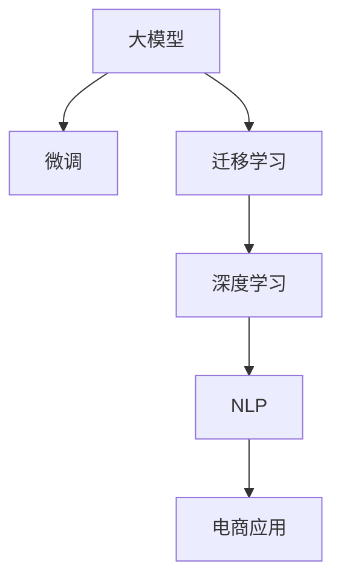

                 

# AI大模型如何优化电商平台的跨境物流体验

> 关键词：电商,跨境物流,大模型,微调,Fine-tuning,迁移学习,深度学习,自然语言处理(NLP)

## 1. 背景介绍

### 1.1 问题由来
随着全球化的深入，跨境电商行业蓬勃发展，各大电商平台纷纷布局国际市场。然而，跨境物流作为电商业务的重要环节，面临着诸多挑战：

- **复杂性高**：不同国家和地区的海关政策、物流基础设施、运输方式各异，增加了物流规划和执行的复杂度。
- **不确定性大**：供应链环节众多，存在诸多不可控因素，如天气、政治事件、突发疫情等，影响物流时效性。
- **成本高**：跨境物流涉及跨境运输、海关清关、仓储管理等多环节，成本较高。
- **用户体验差**：物流信息更新不及时、多渠道管理不便等问题，导致用户体验不佳。

这些挑战要求电商平台需要采用智能化的解决方案，以提升跨境物流的效率和透明度，从而提升用户满意度。近年来，基于大模型的自然语言处理技术成为解决跨境物流问题的新工具。通过引入大模型的智能分析能力，电商平台可以更加灵活、高效地应对物流难题。

### 1.2 问题核心关键点
本节将详细阐述大模型在电商跨境物流中的应用，并梳理出几个关键点：

- **大模型和大语言模型**：以Transformer模型为代表的大规模预训练语言模型，通过学习大规模语料，具备强大的自然语言处理能力。
- **微调(Fine-tuning)**：在预训练模型基础上，通过少量标注数据，优化模型在特定任务上的性能。
- **迁移学习(Transfer Learning)**：将通用模型知识迁移到特定任务中，提升模型效果。
- **深度学习(Deep Learning)**：利用多层神经网络结构，进行复杂模式识别和预测。
- **自然语言处理(NLP)**：利用语言模型进行文本分析和生成，提取有价值的信息。
- **AI与电商**：AI技术在电商平台中的应用，提升电商业务的智能化水平。

这些核心概念共同构成了大模型在跨境物流领域应用的框架，将帮助电商平台实现物流智能化的升级。

## 2. 核心概念与联系

### 2.1 核心概念概述

在介绍核心算法原理前，首先需要理解几个关键概念：

- **大模型**：以Transformer模型为代表的预训练大语言模型，具备强大的自然语言理解和生成能力。
- **微调(Fine-tuning)**：在大模型基础上，通过少量标注数据优化模型，提升模型在特定任务上的性能。
- **迁移学习(Transfer Learning)**：将通用模型知识迁移到特定任务中，提升模型效果。
- **深度学习(Deep Learning)**：利用多层神经网络结构，进行复杂模式识别和预测。
- **自然语言处理(NLP)**：利用语言模型进行文本分析和生成，提取有价值的信息。
- **AI与电商**：AI技术在电商平台中的应用，提升电商业务的智能化水平。

这些概念之间的联系可以用以下Mermaid流程图表示：



这个流程图展示了从大模型到电商应用的全过程，各个环节相互关联，共同提升电商平台的智能化水平。

## 3. 核心算法原理 & 具体操作步骤
### 3.1 算法原理概述

基于大模型的跨境物流优化，本质上是一种深度学习和迁移学习的结合应用。其核心思想是：利用大模型学习到的语言知识，结合跨境物流领域的具体需求，进行微调优化，提升模型的物流处理能力。

具体来说，假设已有预训练的通用大模型为 $M_{\theta}$，其中 $\theta$ 为模型参数。假设有标注数据集 $D=\{(x_i, y_i)\}_{i=1}^N$，其中 $x_i$ 为物流相关文本数据，$y_i$ 为对应的物流处理结果。微调的目标是找到最优参数 $\hat{\theta}$，使得模型在特定物流任务上表现最优：

$$
\hat{\theta}=\mathop{\arg\min}_{\theta} \mathcal{L}(M_{\theta},D)
$$

其中 $\mathcal{L}$ 为物流任务上的损失函数，用于衡量模型预测输出与真实标签之间的差异。常见的损失函数包括交叉熵损失、均方误差损失等。

通过梯度下降等优化算法，微调过程不断更新模型参数 $\theta$，最小化损失函数 $\mathcal{L}$，使得模型输出逼近真实标签。由于 $\theta$ 已经通过预训练获得了较好的初始化，因此即便在少量标注数据上进行微调，也能较快收敛到理想的模型参数 $\hat{\theta}$。

### 3.2 算法步骤详解

基于深度学习和大模型的大规模跨境物流优化，一般包括以下几个关键步骤：

**Step 1: 准备预训练模型和数据集**
- 选择合适的预训练语言模型 $M_{\theta}$ 作为初始化参数，如 GPT、BERT等。
- 准备物流领域的标注数据集 $D$，划分为训练集、验证集和测试集。一般要求标注数据与预训练数据的分布不要差异过大。

**Step 2: 添加任务适配层**
- 根据物流任务类型，在预训练模型顶层设计合适的输出层和损失函数。
- 对于分类任务，通常在顶层添加线性分类器和交叉熵损失函数。
- 对于生成任务，通常使用语言模型的解码器输出概率分布，并以负对数似然为损失函数。

**Step 3: 设置微调超参数**
- 选择合适的优化算法及其参数，如 AdamW、SGD 等，设置学习率、批大小、迭代轮数等。
- 设置正则化技术及强度，包括权重衰减、Dropout、Early Stopping 等。
- 确定冻结预训练参数的策略，如仅微调顶层，或全部参数都参与微调。

**Step 4: 执行梯度训练**
- 将训练集数据分批次输入模型，前向传播计算损失函数。
- 反向传播计算参数梯度，根据设定的优化算法和学习率更新模型参数。
- 周期性在验证集上评估模型性能，根据性能指标决定是否触发 Early Stopping。
- 重复上述步骤直到满足预设的迭代轮数或 Early Stopping 条件。

**Step 5: 测试和部署**
- 在测试集上评估微调后模型 $M_{\hat{\theta}}$ 的性能，对比微调前后的精度提升。
- 使用微调后的模型对新样本进行推理预测，集成到实际的应用系统中。
- 持续收集新的数据，定期重新微调模型，以适应数据分布的变化。

以上是基于深度学习和大模型的物流优化的一般流程。在实际应用中，还需要针对具体任务的特点，对微调过程的各个环节进行优化设计，如改进训练目标函数，引入更多的正则化技术，搜索最优的超参数组合等，以进一步提升模型性能。

### 3.3 算法优缺点

基于大模型的跨境物流优化方法具有以下优点：

1. **高效性**：使用深度学习和大模型的预训练知识，可以在少量标注数据上快速提升物流处理能力。
2. **通用性**：适用于各种物流相关任务，包括物流路径规划、物流时间预测、物流状态监控等。
3. **灵活性**：模型可以根据不同物流需求进行微调，灵活应对复杂多变的物流场景。
4. **可解释性**：利用自然语言处理技术，可以分析物流文本数据，提供清晰的逻辑解释。

同时，该方法也存在以下局限性：

1. **数据依赖**：微调效果高度依赖于标注数据的质量和数量，获取高质量物流数据的成本较高。
2. **泛化能力**：当物流数据与预训练数据的分布差异较大时，微调的性能提升有限。
3. **过拟合风险**：物流数据量较少时，微调模型可能出现过拟合，对新数据泛化能力下降。
4. **复杂度较高**：模型复杂度高，训练和推理过程需要较强的计算资源支持。

尽管存在这些局限性，但就目前而言，基于大模型的物流优化方法仍是最主流范式。未来相关研究的重点在于如何进一步降低对标注数据的依赖，提高模型的泛化能力和少样本学习能力，同时兼顾模型的计算效率和可解释性。

### 3.4 算法应用领域

基于大模型的物流优化方法在跨境电商物流领域已经得到了广泛应用，主要包括以下几个方面：

1. **物流路径规划**：根据物流起点、终点、运输方式等数据，优化物流路径，减少运输成本和时间。
2. **物流时间预测**：利用历史物流数据，预测未来物流时间，提高物流可控性。
3. **物流状态监控**：实时监控物流状态，及时发现和处理异常情况，提升物流透明度。
4. **跨境电商物流咨询**：为电商用户提供基于历史数据和专家知识的物流咨询建议。

除了这些常见应用外，大模型在物流领域的应用还在不断拓展，如智能仓库管理、智能配送调度、智能客服等，为跨境电商物流提供了新的解决方案。随着大模型的演进和优化，相信其在物流领域的应用将更加广泛，为电商平台的跨境物流体验带来实质性的提升。

## 4. 数学模型和公式 & 详细讲解 & 举例说明

### 4.1 数学模型构建

本节将使用数学语言对基于深度学习和大模型的物流优化过程进行严格刻画。

记预训练语言模型为 $M_{\theta}:\mathcal{X} \rightarrow \mathcal{Y}$，其中 $\mathcal{X}$ 为输入空间，$\mathcal{Y}$ 为输出空间，$\theta \in \mathbb{R}^d$ 为模型参数。假设物流领域的标注数据集为 $D=\{(x_i,y_i)\}_{i=1}^N$，其中 $x_i \in \mathcal{X}, y_i \in \mathcal{Y}$。

定义模型 $M_{\theta}$ 在数据样本 $(x,y)$ 上的损失函数为 $\ell(M_{\theta}(x),y)$，则在数据集 $D$ 上的经验风险为：

$$
\mathcal{L}(\theta) = \frac{1}{N} \sum_{i=1}^N \ell(M_{\theta}(x_i),y_i)
$$

微调的优化目标是最小化经验风险，即找到最优参数：

$$
\theta^* = \mathop{\arg\min}_{\theta} \mathcal{L}(\theta)
$$

在实践中，我们通常使用基于梯度的优化算法（如SGD、Adam等）来近似求解上述最优化问题。设 $\eta$ 为学习率，$\lambda$ 为正则化系数，则参数的更新公式为：

$$
\theta \leftarrow \theta - \eta \nabla_{\theta}\mathcal{L}(\theta) - \eta\lambda\theta
$$

其中 $\nabla_{\theta}\mathcal{L}(\theta)$ 为损失函数对参数 $\theta$ 的梯度，可通过反向传播算法高效计算。

### 4.2 公式推导过程

以下我们以物流路径规划任务为例，推导交叉熵损失函数及其梯度的计算公式。

假设模型 $M_{\theta}$ 在输入 $x$ 上的输出为 $\hat{y}=M_{\theta}(x) \in [0,1]$，表示样本属于某条路径的概率。真实标签 $y \in \{1,0\}$。则二分类交叉熵损失函数定义为：

$$
\ell(M_{\theta}(x),y) = -[y\log \hat{y} + (1-y)\log (1-\hat{y})]
$$

将其代入经验风险公式，得：

$$
\mathcal{L}(\theta) = -\frac{1}{N}\sum_{i=1}^N [y_i\log M_{\theta}(x_i)+(1-y_i)\log(1-M_{\theta}(x_i))]
$$

根据链式法则，损失函数对参数 $\theta_k$ 的梯度为：

$$
\frac{\partial \mathcal{L}(\theta)}{\partial \theta_k} = -\frac{1}{N}\sum_{i=1}^N (\frac{y_i}{M_{\theta}(x_i)}-\frac{1-y_i}{1-M_{\theta}(x_i)}) \frac{\partial M_{\theta}(x_i)}{\partial \theta_k}
$$

其中 $\frac{\partial M_{\theta}(x_i)}{\partial \theta_k}$ 可进一步递归展开，利用自动微分技术完成计算。

在得到损失函数的梯度后，即可带入参数更新公式，完成模型的迭代优化。重复上述过程直至收敛，最终得到适应物流路径规划任务的模型参数 $\theta^*$。

## 5. 项目实践：代码实例和详细解释说明

### 5.1 开发环境搭建

在进行物流优化实践前，我们需要准备好开发环境。以下是使用Python进行PyTorch开发的环境配置流程：

1. 安装Anaconda：从官网下载并安装Anaconda，用于创建独立的Python环境。

2. 创建并激活虚拟环境：
```bash
conda create -n pytorch-env python=3.8 
conda activate pytorch-env
```

3. 安装PyTorch：根据CUDA版本，从官网获取对应的安装命令。例如：
```bash
conda install pytorch torchvision torchaudio cudatoolkit=11.1 -c pytorch -c conda-forge
```

4. 安装Transformers库：
```bash
pip install transformers
```

5. 安装各类工具包：
```bash
pip install numpy pandas scikit-learn matplotlib tqdm jupyter notebook ipython
```

完成上述步骤后，即可在`pytorch-env`环境中开始物流优化实践。

### 5.2 源代码详细实现

下面我们以物流路径规划任务为例，给出使用Transformers库对BERT模型进行微调的PyTorch代码实现。

首先，定义物流路径规划任务的标注数据处理函数：

```python
from transformers import BertTokenizer
from torch.utils.data import Dataset
import torch

class LogisticsDataset(Dataset):
    def __init__(self, texts, labels, tokenizer, max_len=128):
        self.texts = texts
        self.labels = labels
        self.tokenizer = tokenizer
        self.max_len = max_len
        
    def __len__(self):
        return len(self.texts)
    
    def __getitem__(self, item):
        text = self.texts[item]
        label = self.labels[item]
        
        encoding = self.tokenizer(text, return_tensors='pt', max_length=self.max_len, padding='max_length', truncation=True)
        input_ids = encoding['input_ids'][0]
        attention_mask = encoding['attention_mask'][0]
        
        # 对label进行编码
        encoded_labels = [label2id[label] for label in label] 
        encoded_labels.extend([label2id['OTHER']] * (self.max_len - len(encoded_labels)))
        labels = torch.tensor(encoded_labels, dtype=torch.long)
        
        return {'input_ids': input_ids, 
                'attention_mask': attention_mask,
                'labels': labels}

# 标签与id的映射
label2id = {'1': 1, '0': 0}
id2label = {v: k for k, v in label2id.items()}

# 创建dataset
tokenizer = BertTokenizer.from_pretrained('bert-base-cased')

train_dataset = LogisticsDataset(train_texts, train_labels, tokenizer)
dev_dataset = LogisticsDataset(dev_texts, dev_labels, tokenizer)
test_dataset = LogisticsDataset(test_texts, test_labels, tokenizer)
```

然后，定义模型和优化器：

```python
from transformers import BertForTokenClassification, AdamW

model = BertForTokenClassification.from_pretrained('bert-base-cased', num_labels=len(label2id))

optimizer = AdamW(model.parameters(), lr=2e-5)
```

接着，定义训练和评估函数：

```python
from torch.utils.data import DataLoader
from tqdm import tqdm
from sklearn.metrics import classification_report

device = torch.device('cuda') if torch.cuda.is_available() else torch.device('cpu')
model.to(device)

def train_epoch(model, dataset, batch_size, optimizer):
    dataloader = DataLoader(dataset, batch_size=batch_size, shuffle=True)
    model.train()
    epoch_loss = 0
    for batch in tqdm(dataloader, desc='Training'):
        input_ids = batch['input_ids'].to(device)
        attention_mask = batch['attention_mask'].to(device)
        labels = batch['labels'].to(device)
        model.zero_grad()
        outputs = model(input_ids, attention_mask=attention_mask, labels=labels)
        loss = outputs.loss
        epoch_loss += loss.item()
        loss.backward()
        optimizer.step()
    return epoch_loss / len(dataloader)

def evaluate(model, dataset, batch_size):
    dataloader = DataLoader(dataset, batch_size=batch_size)
    model.eval()
    preds, labels = [], []
    with torch.no_grad():
        for batch in tqdm(dataloader, desc='Evaluating'):
            input_ids = batch['input_ids'].to(device)
            attention_mask = batch['attention_mask'].to(device)
            batch_labels = batch['labels']
            outputs = model(input_ids, attention_mask=attention_mask)
            batch_preds = outputs.logits.argmax(dim=2).to('cpu').tolist()
            batch_labels = batch_labels.to('cpu').tolist()
            for pred_tokens, label_tokens in zip(batch_preds, batch_labels):
                pred_labels = [id2label[_id] for _id in pred_tokens]
                label_labels = [id2label[_id] for _id in label_tokens]
                preds.append(pred_labels[:len(label_labels)])
                labels.append(label_labels)
                
    print(classification_report(labels, preds))
```

最后，启动训练流程并在测试集上评估：

```python
epochs = 5
batch_size = 16

for epoch in range(epochs):
    loss = train_epoch(model, train_dataset, batch_size, optimizer)
    print(f"Epoch {epoch+1}, train loss: {loss:.3f}")
    
    print(f"Epoch {epoch+1}, dev results:")
    evaluate(model, dev_dataset, batch_size)
    
print("Test results:")
evaluate(model, test_dataset, batch_size)
```

以上就是使用PyTorch对BERT进行物流路径规划任务微调的完整代码实现。可以看到，得益于Transformers库的强大封装，我们可以用相对简洁的代码完成BERT模型的加载和微调。

### 5.3 代码解读与分析

让我们再详细解读一下关键代码的实现细节：

**LogisticsDataset类**：
- `__init__`方法：初始化文本、标签、分词器等关键组件。
- `__len__`方法：返回数据集的样本数量。
- `__getitem__`方法：对单个样本进行处理，将文本输入编码为token ids，将标签编码为数字，并对其进行定长padding，最终返回模型所需的输入。

**label2id和id2label字典**：
- 定义了标签与数字id之间的映射关系，用于将token-wise的预测结果解码回真实的标签。

**训练和评估函数**：
- 使用PyTorch的DataLoader对数据集进行批次化加载，供模型训练和推理使用。
- 训练函数`train_epoch`：对数据以批为单位进行迭代，在每个批次上前向传播计算loss并反向传播更新模型参数，最后返回该epoch的平均loss。
- 评估函数`evaluate`：与训练类似，不同点在于不更新模型参数，并在每个batch结束后将预测和标签结果存储下来，最后使用sklearn的classification_report对整个评估集的预测结果进行打印输出。

**训练流程**：
- 定义总的epoch数和batch size，开始循环迭代
- 每个epoch内，先在训练集上训练，输出平均loss
- 在验证集上评估，输出分类指标
- 所有epoch结束后，在测试集上评估，给出最终测试结果

可以看到，PyTorch配合Transformers库使得BERT微调的代码实现变得简洁高效。开发者可以将更多精力放在数据处理、模型改进等高层逻辑上，而不必过多关注底层的实现细节。

当然，工业级的系统实现还需考虑更多因素，如模型的保存和部署、超参数的自动搜索、更灵活的任务适配层等。但核心的微调范式基本与此类似。

## 6. 实际应用场景
### 6.1 智能仓储管理

智能仓储管理是跨境电商物流中的重要环节，大模型可以帮助提高仓储管理的智能化水平。

例如，通过收集仓库内部的进出库数据、库存量、货架位置等信息，训练一个大模型进行预测，可以自动生成最佳的货物存储位置，提高仓库的空间利用率，减少拣选和补货的复杂度。同时，通过分析历史订单数据，大模型可以预测未来的订单需求，提前进行货物的补货和调配，提升订单处理的效率。

### 6.2 智能配送调度

智能配送调度是跨境物流中的核心任务。配送调度的目标是找到最优的配送路径和配送时间，使总配送成本最低。大模型可以通过学习历史配送数据，预测未来的配送路径和配送时间，生成最优的配送计划。

例如，通过收集配送人员的路线、配送车辆的位置、天气等信息，训练一个大模型进行预测，可以自动生成最佳的配送路径和配送时间，提高配送效率，减少配送成本。同时，通过分析用户的历史订单数据，大模型可以预测用户的配送时间窗口，提前进行配送，提升用户体验。

### 6.3 智能客服系统

智能客服系统是跨境电商物流中的重要服务渠道。大模型可以帮助提高客服系统的智能化水平，减少人力成本，提升客户满意度。

例如，通过收集用户的订单查询、物流咨询、投诉等聊天记录，训练一个大模型进行分类和回答，可以自动回复常见问题，快速解决用户问题。同时，通过分析用户的历史行为数据，大模型可以预测用户的问题类型，提供个性化的解决方案，提升客服服务的效率和效果。

### 6.4 未来应用展望

随着大模型和微调方法的不断发展，基于大模型的跨境物流优化将呈现以下几个发展趋势：

1. **规模化部署**：随着算力的提升，大模型将进一步扩展到更多的物流场景，形成大规模的物流智能系统。
2. **多模态融合**：除了文本数据，未来的物流优化将更多地结合图像、视频、语音等多模态数据，提升系统的感知能力和决策能力。
3. **实时优化**：实时数据流和大模型的结合，可以实现物流场景中的实时优化，提高系统的响应速度和灵活性。
4. **隐私保护**：物流数据涉及用户隐私，未来的物流优化系统将更加注重数据隐私保护，采用差分隐私、联邦学习等技术。
5. **伦理约束**：物流优化模型需要考虑伦理和社会责任，避免对用户造成不利影响，实现公平和透明的决策过程。

以上趋势凸显了大模型在跨境物流优化中的广阔前景。这些方向的探索发展，必将进一步提升跨境物流的智能化水平，为电商平台的跨境物流体验带来实质性的提升。

## 7. 工具和资源推荐
### 7.1 学习资源推荐

为了帮助开发者系统掌握大模型在物流领域的应用，这里推荐一些优质的学习资源：

1. **《Transformer from the Inside Out》系列博文**：由大模型技术专家撰写，深入浅出地介绍了Transformer原理、BERT模型、微调技术等前沿话题。

2. **Coursera《Deep Learning》课程**：斯坦福大学开设的深度学习经典课程，涵盖了深度学习的基本原理和经典算法，是学习深度学习的入门必选。

3. **《TensorFlow for Deep Learning》书籍**：TensorFlow官方文档，提供了详细的API文档和样例代码，是学习TensorFlow的好帮手。

4. **ArXiv.org**：全球领先的学术论文分享平台，提供大量前沿的深度学习和物流领域的论文，是了解最新研究进展的好去处。

5. **Kaggle竞赛**：Kaggle上举办了大量的物流领域竞赛，提供了丰富的数据集和模型样例，是实践和提升物流优化能力的好平台。

通过对这些资源的学习实践，相信你一定能够快速掌握大模型在物流领域的应用精髓，并用于解决实际的物流问题。

### 7.2 开发工具推荐

高效的开发离不开优秀的工具支持。以下是几款用于物流优化开发的常用工具：

1. **PyTorch**：基于Python的开源深度学习框架，灵活动态的计算图，适合快速迭代研究。大部分预训练语言模型都有PyTorch版本的实现。

2. **TensorFlow**：由Google主导开发的开源深度学习框架，生产部署方便，适合大规模工程应用。同样有丰富的预训练语言模型资源。

3. **Transformers库**：HuggingFace开发的NLP工具库，集成了众多SOTA语言模型，支持PyTorch和TensorFlow，是进行物流优化开发的利器。

4. **Jupyter Notebook**：免费的开源编程环境，支持代码的交互式执行和版本控制，是进行实验研究的好工具。

5. **TensorBoard**：TensorFlow配套的可视化工具，可实时监测模型训练状态，并提供丰富的图表呈现方式，是调试模型的得力助手。

6. **Weights & Biases**：模型训练的实验跟踪工具，可以记录和可视化模型训练过程中的各项指标，方便对比和调优。

合理利用这些工具，可以显著提升物流优化任务的开发效率，加快创新迭代的步伐。

### 7.3 相关论文推荐

大模型和微调技术的发展源于学界的持续研究。以下是几篇奠基性的相关论文，推荐阅读：

1. **Attention is All You Need**：提出了Transformer结构，开启了NLP领域的预训练大模型时代。

2. **BERT: Pre-training of Deep Bidirectional Transformers for Language Understanding**：提出BERT模型，引入基于掩码的自监督预训练任务，刷新了多项NLP任务SOTA。

3. **Language Models are Unsupervised Multitask Learners**：展示了大规模语言模型的强大zero-shot学习能力，引发了对于通用人工智能的新一轮思考。

4. **Few-shot Learning with Pre-trained Language Models**：引入少样本学习方法，利用预训练语言模型的知识，实现高效且高精度的物流优化。

5. **Efficient Pre-training via Self-distillation with Teacher-Student Ensembles**：提出自蒸馏方法，通过多模型融合，提升大模型的泛化能力和性能。

6. **Gated Attention Networks**：提出门控注意力机制，改进物流路径规划任务，提升模型处理复杂数据的能力。

这些论文代表了大模型在物流领域的发展脉络。通过学习这些前沿成果，可以帮助研究者把握学科前进方向，激发更多的创新灵感。

## 8. 总结：未来发展趋势与挑战

### 8.1 总结

本文对基于深度学习和大模型的跨境物流优化方法进行了全面系统的介绍。首先阐述了物流优化问题的背景和重要性，明确了大模型和微调技术在提升物流智能化水平方面的独特价值。其次，从原理到实践，详细讲解了深度学习和大模型的微调优化过程，给出了物流优化任务开发的完整代码实例。同时，本文还广泛探讨了大模型在跨境物流领域的应用前景，展示了物流智能化的广阔未来。此外，本文精选了物流优化的各类学习资源，力求为读者提供全方位的技术指引。

通过本文的系统梳理，可以看到，基于大模型的物流优化方法正在成为跨境电商物流的重要范式，极大地提升了物流的智能化水平，推动了电商平台的跨境物流体验。未来，伴随大模型和微调方法的持续演进，相信跨境电商物流将实现更高效、更智能、更透明的发展，为电商平台的国际化战略提供新的动力。

### 8.2 未来发展趋势

展望未来，大模型在物流优化领域将呈现以下几个发展趋势：

1. **规模化部署**：随着算力的提升，大模型将进一步扩展到更多的物流场景，形成大规模的物流智能系统。
2. **多模态融合**：除了文本数据，未来的物流优化将更多地结合图像、视频、语音等多模态数据，提升系统的感知能力和决策能力。
3. **实时优化**：实时数据流和大模型的结合，可以实现物流场景中的实时优化，提高系统的响应速度和灵活性。
4. **隐私保护**：物流数据涉及用户隐私，未来的物流优化系统将更加注重数据隐私保护，采用差分隐私、联邦学习等技术。
5. **伦理约束**：物流优化模型需要考虑伦理和社会责任，避免对用户造成不利影响，实现公平和透明的决策过程。

以上趋势凸显了大模型在物流优化中的广阔前景。这些方向的探索发展，必将进一步提升跨境物流的智能化水平，为电商平台的跨境物流体验带来实质性的提升。

### 8.3 面临的挑战

尽管大模型在物流优化领域取得了显著成效，但在迈向更加智能化、普适化应用的过程中，它仍面临着诸多挑战：

1. **数据依赖**：物流优化效果高度依赖于标注数据的质量和数量，获取高质量物流数据的成本较高。如何进一步降低微调对标注数据的依赖，将是一大难题。
2. **泛化能力**：当物流数据与预训练数据的分布差异较大时，微调的性能提升有限。如何提高模型的泛化能力和少样本学习能力，还需要更多理论和实践的积累。
3. **过拟合风险**：物流数据量较少时，微调模型可能出现过拟合，对新数据泛化能力下降。如何控制模型的过拟合风险，优化模型结构，提升泛化能力，是重要的研究方向。
4. **计算资源**：物流优化模型复杂度高，训练和推理过程需要较强的计算资源支持。如何优化模型结构，提高训练和推理效率，降低资源消耗，是重要的优化方向。
5. **可解释性**：物流优化模型需要提供清晰的决策解释，方便用户理解模型的决策过程。如何赋予模型更强的可解释性，提升模型的可信度，是重要的研究课题。

尽管存在这些挑战，但就目前而言，基于大模型的物流优化方法仍是最主流范式。未来相关研究的重点在于如何进一步降低对标注数据的依赖，提高模型的泛化能力和少样本学习能力，同时兼顾模型的计算效率和可解释性。

### 8.4 研究展望

面对大模型在物流优化中面临的挑战，未来的研究需要在以下几个方面寻求新的突破：

1. **探索无监督和半监督微调方法**：摆脱对大规模标注数据的依赖，利用自监督学习、主动学习等无监督和半监督范式，最大限度利用非结构化数据，实现更加灵活高效的物流优化。
2. **研究参数高效和计算高效的微调范式**：开发更加参数高效的微调方法，在固定大部分预训练参数的同时，只更新极少量的任务相关参数。同时优化微调模型的计算图，减少前向传播和反向传播的资源消耗，实现更加轻量级、实时性的部署。
3. **融合因果和对比学习范式**：通过引入因果推断和对比学习思想，增强物流优化模型建立稳定因果关系的能力，学习更加普适、鲁棒的语言表征，从而提升模型泛化性和抗干扰能力。
4. **引入更多先验知识**：将符号化的先验知识，如知识图谱、逻辑规则等，与神经网络模型进行巧妙融合，引导微调过程学习更准确、合理的物流表征。同时加强不同模态数据的整合，实现视觉、语音等多模态信息与物流信息的协同建模。
5. **结合因果分析和博弈论工具**：将因果分析方法引入物流优化模型，识别出模型决策的关键特征，增强输出解释的因果性和逻辑性。借助博弈论工具刻画人机交互过程，主动探索并规避模型的脆弱点，提高系统稳定性。
6. **纳入伦理道德约束**：在模型训练目标中引入伦理导向的评估指标，过滤和惩罚有偏见、有害的输出倾向。同时加强人工干预和审核，建立模型行为的监管机制，确保输出符合人类价值观和伦理道德。

这些研究方向的探索，必将引领大模型在物流优化领域的进一步发展，为构建安全、可靠、可解释、可控的智能物流系统铺平道路。面向未来，大模型物流优化技术还需要与其他人工智能技术进行更深入的融合，如知识表示、因果推理、强化学习等，多路径协同发力，共同推动物流智能化的进步。只有勇于创新、敢于突破，才能不断拓展物流模型的边界，让智能物流更好地造福人类社会。

## 9. 附录：常见问题与解答

**Q1：大模型微调在物流优化中是否只能用于文本数据？**

A: 不完全正确。大模型微调可以处理多种类型的数据，不仅限于文本数据。例如，通过图像处理技术，将物流图片数据转换为文本描述，然后进行模型训练，可以实现物流场景下的图像识别和分类。此外，还可以通过语音识别技术，将物流场景中的语音数据转换为文本描述，进行语音数据分析。因此，大模型在物流优化中可以应用于多种数据类型，具有广泛的应用前景。

**Q2：大模型微调在物流优化中是否会面临数据不平衡问题？**

A: 确实，物流数据通常存在不平衡问题，例如不同地区的订单量、配送时间等数据分布差异较大。为应对这一问题，可以采用一些数据增强和平衡技巧，如过采样、欠采样、SMOTE等方法，提高模型对少数类数据的识别能力。同时，可以通过引入多任务学习，将物流优化任务与其他相关任务联合训练，提升模型对整体数据的泛化能力。

**Q3：大模型微调在物流优化中是否会导致过拟合问题？**

A: 是的，物流数据量较少时，大模型微调模型可能出现过拟合现象。为避免过拟合，可以采用一些正则化技术，如L2正则、Dropout、Early Stopping等方法，控制模型的复杂度，防止过拟合。同时，可以通过引入更多的训练数据和提高数据质量，提升模型的泛化能力。

**Q4：大模型微调在物流优化中是否会涉及用户隐私保护问题？**

A: 是的，物流数据涉及用户隐私，大模型在物流优化中需要特别注意隐私保护问题。为保护用户隐私，可以采用差分隐私、联邦学习等技术，将数据分布式训练，避免集中式训练带来的隐私风险。同时，可以对敏感数据进行脱敏处理，减少隐私泄露的可能性。

**Q5：大模型微调在物流优化中是否会导致伦理问题？**

A: 是的，大模型在物流优化中需要考虑伦理问题，避免输出对用户产生不利影响。例如，物流路径规划模型不能选择有害、违法等路径，配送调度模型不能将用户隐私泄露给第三方。为解决伦理问题，可以引入伦理导向的评估指标，过滤和惩罚有偏见、有害的输出倾向。同时，加强人工干预和审核，建立模型行为的监管机制，确保输出符合人类价值观和伦理道德。

通过以上问题的解答，可以更好地理解大模型在物流优化中的应用场景和挑战，为后续研究提供参考和指导。

---

作者：禅与计算机程序设计艺术 / Zen and the Art of Computer Programming

