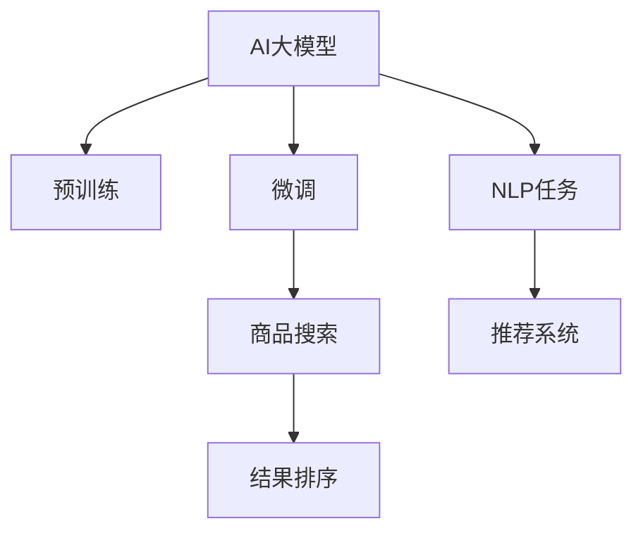

                 

# AI大模型如何提升电商平台的商品搜索排名

## 1. 背景介绍

在电商领域，商品搜索功能是用户体验的核心环节，直接影响着平台的流量和转化率。传统的搜索算法依赖关键词匹配，难以应对海量商品和用户查询的多样性。近年来，基于AI大模型的自然语言处理技术（NLP）正在改变这一格局，能够更准确地理解用户查询意图，提供更精准的搜索结果。

AI大模型通常指深度学习模型，其通过大规模无标签数据预训练学习通用语言表示，再通过有监督的数据微调学习特定任务。在电商平台的商品搜索排名中，AI大模型能够学习用户查询与商品描述的语义关系，实现更精确的匹配和排序。

## 2. 核心概念与联系

### 2.1 核心概念概述

为了更好地理解AI大模型在电商搜索中的应用，本节将介绍几个关键概念：

- **AI大模型**：如BERT、GPT-3、T5等，通过大规模数据预训练学习通用的语言表示，具备强大的语言理解和生成能力。
- **预训练**：指在大规模无标签数据上进行自监督学习，学习通用的语言表示。
- **微调**：指在大模型基础上，通过有监督数据进行任务适配，优化模型在特定任务上的性能。
- **自然语言处理（NLP）**：涉及语音、文本和图像的计算机处理，AI大模型常用于语义理解、情感分析、命名实体识别等任务。
- **推荐系统**：利用AI大模型理解用户行为，为用户推荐个性化商品。

这些概念共同构成了一个AI大模型在电商搜索中的应用框架，使其能够通过学习和理解用户查询和商品描述，实现更精准的搜索匹配和排序。

### 2.2 核心概念原理和架构的 Mermaid 流程图



此流程图展示了大模型从预训练到微调，最终应用于电商搜索的架构：

1. 大模型在无标签数据上预训练，学习通用的语言表示。
2. 通过有标签的电商商品搜索数据进行微调，学习特定任务。
3. 在搜索时，输入用户查询和商品描述，利用大模型进行语义理解。
4. 结合推荐系统，输出个性化排序结果。

## 3. 核心算法原理 & 具体操作步骤

### 3.1 算法原理概述

AI大模型提升电商搜索排名的核心思想是通过自然语言处理技术，理解用户查询和商品描述的语义关系，进而实现更精准的匹配和排序。其核心算法主要包括：

- **预训练模型**：使用如BERT、GPT等大模型，在通用语料上进行预训练。
- **微调任务**：针对电商搜索任务，使用少量标注数据对预训练模型进行微调，学习商品与查询的语义匹配。
- **文本表示**：将用户查询和商品描述转换为模型可理解的形式，如向量表示。
- **匹配和排序**：通过模型计算查询与商品之间的相似度，进行排序推荐。

### 3.2 算法步骤详解

#### 3.2.1 数据准备

- **数据采集**：收集电商平台的商品信息，包括商品名称、描述、分类等。同时，收集用户搜索记录，标注查询意图。
- **数据清洗**：清洗数据中的噪声和不相关内容，如去除拼写错误和停用词。
- **数据标注**：对用户查询进行意图标注，如“打折商品”、“高端品牌”等。

#### 3.2.2 预训练模型选择

- **模型选择**：选择适合的预训练模型，如BERT、GPT-3等。
- **模型加载**：使用模型的开源库进行加载，如TensorFlow、PyTorch等。
- **微调配置**：设置微调的超参数，如学习率、批大小等。

#### 3.2.3 微调过程

- **数据预处理**：将查询和商品描述进行分词、转换为模型所需的格式。
- **模型微调**：使用微调数据进行训练，优化模型在电商搜索任务上的性能。
- **结果验证**：在验证集上评估模型效果，调整参数。

#### 3.2.4 模型应用

- **输入处理**：将用户查询和商品描述输入到模型中，进行语义理解。
- **相似度计算**：计算查询与商品描述之间的相似度。
- **结果排序**：根据相似度排序，推荐商品。

### 3.3 算法优缺点

AI大模型提升电商搜索排名的优点在于：

- **语义理解能力**：能够理解复杂的用户查询和商品描述，提供更准确的匹配结果。
- **泛化能力**：通过大规模预训练和少量微调，模型具有较强的泛化能力，适应不同查询和商品。
- **实时处理**：模型可以实时处理用户查询，提供即时反馈。

但其缺点也显而易见：

- **计算成本高**：大模型的计算需求较大，需要高性能计算资源。
- **数据需求高**：需要大量的商品信息和查询数据进行预训练和微调。
- **模型复杂**：大模型的结构复杂，难以解释其内部工作机制。

### 3.4 算法应用领域

AI大模型在电商搜索中的应用领域广泛，主要包括：

- **商品推荐**：通过理解用户查询，推荐相关商品。
- **广告投放**：根据用户查询和浏览记录，投放个性化广告。
- **用户行为分析**：分析用户搜索行为，优化搜索体验。
- **客服对话**：通过自然语言处理，提供智能客服功能。
- **市场分析**：分析市场趋势和用户需求，优化产品策略。

## 4. 数学模型和公式 & 详细讲解

### 4.1 数学模型构建

假设有一个电商平台，商品数量为 $N$，查询数量为 $M$。用户的查询 $q$ 和商品描述 $d$ 均表示为向量形式，$v_q$ 和 $v_d$ 分别表示查询和商品描述的向量表示。模型的输出 $y_i$ 表示商品 $i$ 与查询 $q$ 的匹配程度。

### 4.2 公式推导过程

- **嵌入表示**：使用预训练模型将查询 $q$ 和商品 $d_i$ 转换为向量表示 $v_q$ 和 $v_{d_i}$。
- **相似度计算**：计算查询与商品描述的余弦相似度，得到匹配度 $s_i = \cos(v_q, v_{d_i})$。
- **排序**：根据匹配度 $s_i$ 对商品进行排序，推荐相似度最高的商品。

余弦相似度的计算公式如下：

$$
s_i = \frac{v_q \cdot v_{d_i}}{\|v_q\| \cdot \|v_{d_i}\|}
$$

其中 $\cdot$ 表示向量点乘，$\|v_q\|$ 和 $\|v_{d_i}\|$ 分别表示向量的模长。

### 4.3 案例分析与讲解

假设有一个电商平台，商品数量为1000，用户查询为"打折商品"。我们使用BERT模型进行预训练，然后对模型进行微调，学习商品描述和查询的语义匹配。最后，输入查询"打折商品"，计算每个商品的匹配度，排序推荐前5个商品。

通过这种方式，平台能够实现更精准的商品搜索排序，提升用户体验和转化率。

## 5. 项目实践：代码实例和详细解释说明

### 5.1 开发环境搭建

为了进行AI大模型在电商搜索中的应用，我们需要搭建一个开发环境：

- **Python**：选择Python作为开发语言，便于使用深度学习库和NLP工具。
- **深度学习框架**：选择TensorFlow或PyTorch，便于加载和使用预训练模型。
- **数据处理工具**：选择Pandas和NumPy，便于数据预处理和分析。
- **自然语言处理工具**：选择NLTK或SpaCy，便于分词和文本预处理。

### 5.2 源代码详细实现

以下是使用TensorFlow和BERT模型进行电商搜索排名的代码实现：

```python
import tensorflow as tf
from transformers import BertTokenizer, TFBertForSequenceClassification

# 加载模型和分词器
tokenizer = BertTokenizer.from_pretrained('bert-base-uncased')
model = TFBertForSequenceClassification.from_pretrained('bert-base-uncased', num_labels=1)

# 输入查询和商品描述
query = "打折商品"
items = ["打折商品A", "高端品牌B", "时尚服饰C", "运动器材D", "折扣商品E"]

# 分词和转换为模型格式
inputs = tokenizer([query] + items, padding=True, truncation=True, return_tensors="tf")

# 前向传播计算相似度
with tf.GradientTape() as tape:
    outputs = model(inputs["input_ids"], attention_mask=inputs["attention_mask"])
    logits = outputs.logits

# 计算相似度并排序
cosine_sim = tf.nn.cosine_similarity(logits[:, 0], logits[:, 1:])
top_5_indices = tf.argsort(cosine_sim)[-5:]

# 推荐商品
recommended_items = [items[i] for i in top_5_indices.numpy()]
print(recommended_items)
```

### 5.3 代码解读与分析

- **分词和转换**：使用分词器将查询和商品描述转换为模型所需的格式，并使用padding和truncation处理长度差异。
- **前向传播**：输入模型计算输出向量，使用余弦相似度计算匹配度。
- **相似度排序**：对商品进行排序，推荐相似度最高的商品。

## 6. 实际应用场景

### 6.1 电商平台商品搜索

在电商平台的商品搜索功能中，AI大模型可以实时处理用户查询，推荐相关商品。例如，用户输入"新款手机"，模型能够理解查询意图，推荐最新的手机型号和评价。

### 6.2 广告投放

通过分析用户的搜索历史和点击行为，AI大模型能够推荐个性化的广告。例如，用户经常搜索"运动鞋"，系统可以投放相关的运动鞋广告，提高点击率和转化率。

### 6.3 用户行为分析

通过分析用户的搜索记录，AI大模型可以识别出用户的偏好和行为模式。例如，用户经常搜索"健康食品"，系统可以推送相关的健康食品推荐，提升用户满意度和平台忠诚度。

## 7. 工具和资源推荐

### 7.1 学习资源推荐

为了深入了解AI大模型在电商搜索中的应用，以下是几部推荐的学习资源：

1. **《深度学习入门》**：介绍深度学习的基本概念和算法，适合初学者入门。
2. **《自然语言处理综论》**：全面介绍自然语言处理的理论和方法，适合进阶学习。
3. **《TensorFlow实战》**：详细介绍TensorFlow的开发环境和API，适合TensorFlow开发者。
4. **《Transformers从原理到实践》**：详细讲解Transformers模型和应用，适合NLP开发者。

### 7.2 开发工具推荐

以下是几个常用的开发工具：

1. **TensorFlow**：深度学习开发框架，支持GPU和TPU计算。
2. **PyTorch**：深度学习开发框架，灵活性高，易于部署。
3. **NLTK**：自然语言处理工具库，支持分词、词性标注等。
4. **SpaCy**：自然语言处理工具库，支持分词、命名实体识别等。

### 7.3 相关论文推荐

以下是几篇相关领域的论文，推荐阅读：

1. **Attention is All You Need**：提出Transformer模型，开启预训练语言模型时代。
2. **BERT: Pre-training of Deep Bidirectional Transformers for Language Understanding**：提出BERT模型，通过掩码自监督预训练学习语言表示。
3. **GPT-3: Language Models are Unsupervised Multitask Learners**：提出GPT-3模型，展示大模型在零样本学习上的能力。
4. **BERT Pretraining with Masked Sequence Modeling**：介绍BERT的预训练方法，如何通过掩码自监督任务学习语言表示。
5. **AdaLoRA: Adaptive Low-Rank Adaptation for Parameter-Efficient Fine-Tuning**：提出AdaLoRA方法，参数高效微调大模型。

## 8. 总结：未来发展趋势与挑战

### 8.1 总结

本文系统介绍了AI大模型在电商搜索中的应用，从算法原理到具体操作步骤，提供了完整的代码实现和案例分析。通过使用AI大模型，电商平台能够实现更精准的商品搜索排名，提升用户体验和平台效益。

### 8.2 未来发展趋势

未来，AI大模型在电商搜索中的应用将呈现以下几个趋势：

1. **多模态融合**：结合视觉、音频等多模态数据，提升商品搜索的精度和广度。
2. **个性化推荐**：通过学习用户行为和偏好，提供更个性化的推荐服务。
3. **实时计算**：通过实时计算和优化，提升搜索排序的实时性和效率。
4. **联邦学习**：在保证数据隐私的前提下，利用分布式计算优化搜索排序模型。
5. **模型解释性**：通过可解释性模型和可视化工具，提高搜索排序的透明度和可信度。

### 8.3 面临的挑战

尽管AI大模型在电商搜索中已经取得了显著进展，但仍面临一些挑战：

1. **数据隐私**：电商平台需要保护用户隐私，防止数据泄露。
2. **计算资源**：大模型的计算需求较大，需要高性能计算资源。
3. **模型公平性**：确保搜索排序模型公平，避免歧视和偏见。
4. **用户接受度**：用户需要适应AI推荐和搜索，提高接受度。
5. **模型可解释性**：提高模型的可解释性，让用户信任和接受。

### 8.4 研究展望

未来的研究方向可能包括：

1. **多模态数据融合**：结合视觉、音频等多模态数据，提升搜索排序的精度和广度。
2. **联邦学习**：在保证数据隐私的前提下，利用分布式计算优化搜索排序模型。
3. **模型可解释性**：通过可解释性模型和可视化工具，提高搜索排序的透明度和可信度。
4. **智能客服**：结合NLP和AI技术，提供智能客服功能，提升用户满意度和平台效益。
5. **推荐系统**：通过学习用户行为和偏好，提供更个性化的推荐服务。

## 9. 附录：常见问题与解答

### Q1: 电商搜索排序需要哪些数据？

A: 电商搜索排序需要商品信息、用户查询和用户行为数据。商品信息包括商品名称、描述、分类等，用户查询包括用户的搜索记录和搜索意图，用户行为数据包括用户的点击、购买等行为。

### Q2: 如何评估搜索排序模型的效果？

A: 可以使用各种指标来评估搜索排序模型的效果，如精确率、召回率、F1分数等。在实际应用中，可以设计A/B测试，对比新旧模型的性能，选择更好的模型。

### Q3: 如何优化搜索排序模型的计算效率？

A: 可以使用分布式计算、GPU加速、量化加速等技术优化搜索排序模型的计算效率。在模型设计中，可以通过剪枝、量化等方法减小模型大小，提高计算效率。

### Q4: 如何保证搜索排序模型的公平性？

A: 可以通过设置公平性约束、样本平衡等方法保证搜索排序模型的公平性。在模型训练中，可以加入公平性约束，确保模型不偏向某一类用户或商品。

---

作者：禅与计算机程序设计艺术 / Zen and the Art of Computer Programming

