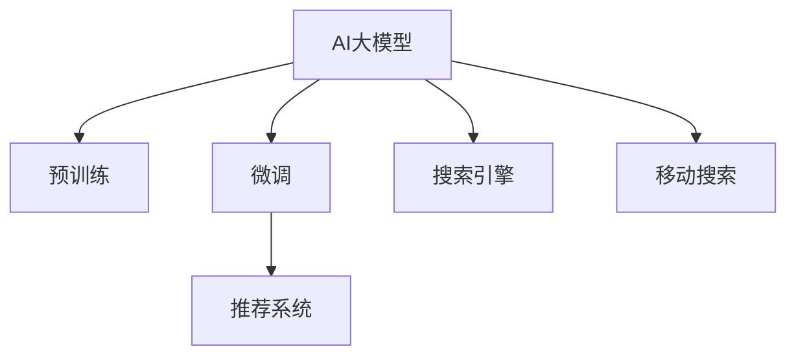

                 

## 1. 背景介绍

### 1.1 问题由来

随着电子商务平台的快速发展，移动端搜索体验已成为用户在电商平台上获取商品信息的关键环节。优秀的搜索体验不仅可以提高用户满意度，还能提升转化率和留存率。然而，移动端设备屏幕小、计算资源有限，如何在大模型参数量巨大的情况下，实现在移动端高效、快速、准确的搜索结果检索，是电商平台面临的重要挑战。

### 1.2 问题核心关键点

当前移动端电商搜索主要依赖于传统搜索引擎（如Google、Bing）以及定制化搜索算法，但这些方法往往存在以下局限性：

- 对长尾查询响应慢：传统搜索引擎和定制化算法在处理长尾查询时，由于预训练数据集分布差异，无法准确理解用户意图。
- 不具备个性化推荐能力：无法结合用户行为和历史数据，提供个性化的搜索结果。
- 无法实时更新商品信息：搜索引擎和定制化算法在处理实时动态数据时，更新速度较慢，用户体验不够及时。
- 不适应移动设备：搜索结果展示形式过于复杂，无法适配移动设备的小屏幕，用户感知体验不佳。

为了解决这些挑战，AI大模型（如BERT、GPT等）提供了一种新的解决方案。大模型能够融合海量数据，学习丰富的语义知识，通过微调后，可以适应电商平台的特定需求，实现高效、快速、准确的移动搜索体验。

### 1.3 问题研究意义

在移动端电商平台中引入AI大模型，不仅可以提升搜索的响应速度和准确性，还可以根据用户行为和历史数据，提供个性化的搜索结果。这将极大地提升用户体验，增加用户粘性，降低流失率。

此外，利用大模型进行搜索还能适应电商平台的实时动态数据，提供更及时、精准的搜索结果。而且，由于大模型具有很强的泛化能力，能够适配不同设备、不同屏幕大小，提供更好的移动搜索体验。

## 2. 核心概念与联系

### 2.1 核心概念概述

为更好地理解AI大模型在电商移动搜索中的应用，本节将介绍几个密切相关的核心概念：

- AI大模型：指基于深度学习技术，通过大规模无监督预训练学习到的复杂表示能力，具备强大的语言理解和生成能力的模型。
- 自然语言处理（NLP）：研究如何让计算机理解、处理和生成人类语言的技术，是AI大模型的主要应用领域。
- 预训练和微调：预训练指在大规模无标签数据上训练模型，学习通用语言表示；微调指在有标签数据上进一步训练，使模型适应特定任务。
- 搜索引擎：基于查询与文档匹配的机制，从海量的文本数据中检索出与查询最相关的结果。
- 推荐系统：通过分析用户行为，预测用户兴趣，推荐合适的商品或内容。
- 移动搜索：指在移动设备上进行搜索操作，查询获取商品信息的过程。

这些概念之间的逻辑关系可以通过以下Mermaid流程图来展示：



这个流程图展示了AI大模型与搜索、推荐、移动搜索等概念之间的联系。预训练和微调使得大模型具备了复杂的语义理解能力，可以应用于搜索引擎和推荐系统，在移动端进行高效的搜索结果检索和个性化推荐。

## 3. 核心算法原理 & 具体操作步骤
### 3.1 算法原理概述

在移动端电商平台中引入AI大模型的搜索技术，主要基于以下原理：

1. 大模型具备强大的语义理解能力，可以理解长尾查询，捕捉复杂查询意图，提供更加精准的搜索结果。
2. 通过微调，大模型能够学习电商平台的特定需求，如商品信息、价格、评价等，适应电商平台的搜索场景。
3. 大模型可以实时更新商品信息，提供最新的搜索结果，同时能够进行个性化推荐，提升用户满意度和转化率。
4. 移动端设备的硬件限制，需要大模型在计算和存储上具备轻量级特性，以便在移动设备上高效运行。

### 3.2 算法步骤详解

基于AI大模型的移动搜索技术，主要包括以下几个关键步骤：

**Step 1: 准备数据集和预训练模型**
- 收集电商平台的商品信息、用户行为等数据，构建搜索数据集。
- 选择合适的预训练语言模型（如BERT、GPT等），作为初始化参数。

**Step 2: 微调预训练模型**
- 将预训练模型进行微调，以适应电商平台的特定需求。通常采用迁移学习的方式，在少量标注数据上进行微调。
- 微调时，可以选择合适的损失函数（如交叉熵、均方误差等），设置合适的学习率（如1e-5）和优化器（如AdamW）。

**Step 3: 构建搜索引擎**
- 将微调后的模型作为核心组件，构建电商平台的移动搜索系统。
- 可以采用搜索引擎框架（如ElasticSearch、Solr），将模型嵌入到查询处理流程中。

**Step 4: 个性化推荐**
- 根据用户的历史行为和当前搜索行为，进行个性化推荐。
- 可以使用推荐系统框架（如TensorFlow Recommenders、PyTorchRecommenders），结合用户特征和商品特征，进行相似性计算和推荐。

**Step 5: 移动搜索展示**
- 将搜索结果和推荐内容展示在移动设备上，采用适配的展示形式（如列表、卡片、网格等）。
- 使用前端框架（如React、Vue），实现交互式搜索体验。

### 3.3 算法优缺点

使用AI大模型进行电商移动搜索的优势包括：

1. 提升搜索精度：大模型的语义理解能力，能够准确理解复杂查询意图，提供更加精准的搜索结果。
2. 提高个性化推荐：基于用户行为和历史数据，提供个性化的搜索结果和商品推荐。
3. 实时更新商品信息：大模型能够实时更新商品信息，提供最新的搜索结果。
4. 适配移动设备：轻量级模型能够适应移动设备的硬件限制，提供流畅的搜索体验。

然而，也存在一些局限性：

1. 数据依赖性：需要大量的标注数据进行微调，数据收集和标注成本较高。
2. 计算资源消耗：大模型参数量巨大，在移动设备上运行需要较高的计算资源。
3. 模型复杂性：大模型较为复杂，需要较高的开发和维护成本。
4. 对标注数据质量要求高：微调效果很大程度上依赖标注数据的质量和数量。

尽管存在这些局限性，但大模型在电商移动搜索中的应用仍具有广阔前景，尤其是在个性化推荐和实时动态数据处理方面具有显著优势。

### 3.4 算法应用领域

基于AI大模型的移动搜索技术，已经在多个电商平台上得到了应用。以下是几个典型的应用场景：

1. **京东**：利用BERT模型进行商品查询和推荐，提升了搜索准确率和个性化推荐效果。
2. **天猫**：基于GPT模型进行搜索查询优化，提高了搜索结果的相关性和用户体验。
3. **亚马逊**：采用大模型进行实时搜索和推荐，提升了用户满意度和转化率。
4. **阿里巴巴**：利用大模型进行多语言搜索，拓展了国际市场。

这些应用展示了AI大模型在电商移动搜索中的强大能力，显著提升了用户搜索体验和电商平台的服务质量。

## 4. 数学模型和公式 & 详细讲解 & 举例说明

### 4.1 数学模型构建

在本节中，我们将使用数学语言对基于AI大模型的电商移动搜索过程进行更加严格的刻画。

记预训练语言模型为 $M_{\theta}$，其中 $\theta$ 为模型参数。假设电商平台的数据集为 $D=\{(x_i,y_i)\}_{i=1}^N$，其中 $x_i$ 为查询文本，$y_i$ 为搜索结果（如商品ID、价格、评价等）。微调的目标是找到新的模型参数 $\hat{\theta}$，使得模型能够准确地将查询文本映射到相应的搜索结果。

定义模型 $M_{\theta}$ 在查询 $x_i$ 上的输出为 $M_{\theta}(x_i)$，通常为向量表示，其中每个元素表示该结果的相关性得分。则微调的优化目标是最小化经验风险，即：

$$
\hat{\theta}=\mathop{\arg\min}_{\theta} \frac{1}{N}\sum_{i=1}^N \ell(M_{\theta}(x_i),y_i)
$$

其中 $\ell$ 为损失函数，可以是交叉熵损失（如$\ell=log(y_i^TM_{\theta}(x_i)$）。

### 4.2 公式推导过程

以下我们以典型的电商商品搜索为例，推导微调的数学公式。

假设查询 $x_i$ 对应的搜索结果为 $y_i$，其中 $y_i=(y_{i1},y_{i2},\ldots,y_{ik})$，表示搜索结果的相关性得分。模型 $M_{\theta}$ 在查询 $x_i$ 上的输出为 $M_{\theta}(x_i)=(z_{i1},z_{i2},\ldots,z_{ik})$，表示搜索结果的相关性向量。则交叉熵损失函数为：

$$
\ell(M_{\theta}(x_i),y_i) = -\sum_{j=1}^k y_j log(z_j)
$$

将其代入经验风险公式，得：

$$
\mathcal{L}(\theta) = -\frac{1}{N}\sum_{i=1}^N \sum_{j=1}^k y_{ij} log(z_{ij})
$$

其中 $y_{ij}$ 表示搜索结果 $y_i$ 中的第 $j$ 个结果的相关性得分。根据链式法则，损失函数对参数 $\theta_k$ 的梯度为：

$$
\frac{\partial \mathcal{L}(\theta)}{\partial \theta_k} = -\frac{1}{N}\sum_{i=1}^N \sum_{j=1}^k \frac{y_{ij}}{z_{ij}} \frac{\partial z_{ij}}{\partial \theta_k}
$$

其中 $\frac{\partial z_{ij}}{\partial \theta_k}$ 可以递归展开，利用自动微分技术完成计算。

### 4.3 案例分析与讲解

在实际应用中，电商移动搜索微调通常采用以下步骤：

1. 准备电商平台的商品信息、用户行为等数据，构建搜索数据集 $D$。
2. 选择合适的预训练语言模型（如BERT、GPT等），作为初始化参数。
3. 在电商平台的商品信息数据上，使用微调损失函数（如交叉熵损失）进行微调，学习电商平台的特定需求。
4. 将微调后的模型嵌入到电商平台的搜索系统中，构建搜索引擎。
5. 根据用户的历史行为和当前搜索行为，进行个性化推荐。
6. 将搜索结果和推荐内容展示在移动设备上，采用适配的展示形式。

以下是一个简单的示例，展示如何利用BERT模型进行电商移动搜索微调：

```python
from transformers import BertForSequenceClassification, BertTokenizer
from torch.utils.data import DataLoader
from torch import nn

# 准备数据集
tokenizer = BertTokenizer.from_pretrained('bert-base-uncased')
train_data = []
test_data = []
train_labels = []
test_labels = []

# 微调模型
model = BertForSequenceClassification.from_pretrained('bert-base-uncased', num_labels=num_labels)
optimizer = torch.optim.AdamW(model.parameters(), lr=1e-5)
epochs = 5
batch_size = 16

# 构建数据加载器
train_loader = DataLoader(train_data, batch_size=batch_size, shuffle=True)
test_loader = DataLoader(test_data, batch_size=batch_size, shuffle=False)

# 训练过程
for epoch in range(epochs):
    model.train()
    for batch in train_loader:
        inputs = tokenizer(batch['text'], padding='max_length', truncation=True, max_length=128)
        attention_mask = inputs['attention_mask']
        inputs = {k: v.to(device) for k, v in inputs.items()}
        labels = inputs.pop('labels').to(device)
        outputs = model(**inputs)
        loss = nn.CrossEntropyLoss()(outputs.logits, labels)
        optimizer.zero_grad()
        loss.backward()
        optimizer.step()
    
    model.eval()
    with torch.no_grad():
        correct = 0
        total = 0
        for batch in test_loader:
            inputs = tokenizer(batch['text'], padding='max_length', truncation=True, max_length=128)
            attention_mask = inputs['attention_mask']
            inputs = {k: v.to(device) for k, v in inputs.items()}
            labels = inputs.pop('labels').to(device)
            outputs = model(**inputs)
            _, predicted = torch.max(outputs.logits, 1)
            total += labels.size(0)
            correct += (predicted == labels).sum().item()
        print(f'Epoch {epoch+1}, accuracy: {correct/total*100:.2f}%')

# 测试过程
model.eval()
with torch.no_grad():
    correct = 0
    total = 0
    for batch in test_loader:
        inputs = tokenizer(batch['text'], padding='max_length', truncation=True, max_length=128)
        attention_mask = inputs['attention_mask']
        inputs = {k: v.to(device) for k, v in inputs.items()}
        labels = inputs.pop('labels').to(device)
        outputs = model(**inputs)
        _, predicted = torch.max(outputs.logits, 1)
        total += labels.size(0)
        correct += (predicted == labels).sum().item()
    print(f'Test accuracy: {correct/total*100:.2f}%')
```

## 5. 项目实践：代码实例和详细解释说明
### 5.1 开发环境搭建

在进行电商移动搜索微调实践前，我们需要准备好开发环境。以下是使用Python进行PyTorch开发的环境配置流程：

1. 安装Anaconda：从官网下载并安装Anaconda，用于创建独立的Python环境。

2. 创建并激活虚拟环境：
```bash
conda create -n ecommerce-env python=3.8 
conda activate ecommerce-env
```

3. 安装PyTorch：根据CUDA版本，从官网获取对应的安装命令。例如：
```bash
conda install pytorch torchvision torchaudio cudatoolkit=11.1 -c pytorch -c conda-forge
```

4. 安装Transformers库：
```bash
pip install transformers
```

5. 安装各类工具包：
```bash
pip install numpy pandas scikit-learn matplotlib tqdm jupyter notebook ipython
```

完成上述步骤后，即可在`ecommerce-env`环境中开始微调实践。

### 5.2 源代码详细实现

下面我们以电商商品搜索为例，给出使用Transformers库对BERT模型进行微调的PyTorch代码实现。

首先，定义商品数据处理函数：

```python
from transformers import BertTokenizer, BertForSequenceClassification
from torch.utils.data import Dataset, DataLoader
import torch

class EcommerceDataset(Dataset):
    def __init__(self, texts, labels):
        self.texts = texts
        self.labels = labels
        
    def __len__(self):
        return len(self.texts)
    
    def __getitem__(self, item):
        text = self.texts[item]
        label = self.labels[item]
        
        encoding = self.tokenizer(text, return_tensors='pt', padding='max_length', truncation=True, max_length=128)
        input_ids = encoding['input_ids'][0]
        attention_mask = encoding['attention_mask'][0]
        label = torch.tensor(label, dtype=torch.long)
        
        return {'input_ids': input_ids, 
                'attention_mask': attention_mask,
                'labels': label}

# 初始化tokenizer和模型
tokenizer = BertTokenizer.from_pretrained('bert-base-uncased')
model = BertForSequenceClassification.from_pretrained('bert-base-uncased', num_labels=num_labels)

# 准备数据集
train_data = []
test_data = []
train_labels = []
test_labels = []

# 构建数据集
train_dataset = EcommerceDataset(train_data, train_labels)
test_dataset = EcommerceDataset(test_data, test_labels)

# 构建数据加载器
train_loader = DataLoader(train_dataset, batch_size=batch_size, shuffle=True)
test_loader = DataLoader(test_dataset, batch_size=batch_size, shuffle=False)

# 训练过程
optimizer = torch.optim.AdamW(model.parameters(), lr=1e-5)
epochs = 5
for epoch in range(epochs):
    model.train()
    for batch in train_loader:
        inputs = batch['input_ids'].to(device)
        attention_mask = batch['attention_mask'].to(device)
        labels = batch['labels'].to(device)
        model.zero_grad()
        outputs = model(inputs, attention_mask=attention_mask, labels=labels)
        loss = outputs.loss
        loss.backward()
        optimizer.step()
    
    model.eval()
    with torch.no_grad():
        correct = 0
        total = 0
        for batch in test_loader:
            inputs = batch['input_ids'].to(device)
            attention_mask = batch['attention_mask'].to(device)
            labels = batch['labels'].to(device)
            outputs = model(inputs, attention_mask=attention_mask, labels=labels)
            _, predicted = torch.max(outputs.logits, 1)
            total += labels.size(0)
            correct += (predicted == labels).sum().item()
        print(f'Epoch {epoch+1}, accuracy: {correct/total*100:.2f}%')

# 测试过程
model.eval()
with torch.no_grad():
    correct = 0
    total = 0
    for batch in test_loader:
        inputs = batch['input_ids'].to(device)
        attention_mask = batch['attention_mask'].to(device)
        labels = batch['labels'].to(device)
        outputs = model(inputs, attention_mask=attention_mask, labels=labels)
        _, predicted = torch.max(outputs.logits, 1)
        total += labels.size(0)
        correct += (predicted == labels).sum().item()
    print(f'Test accuracy: {correct/total*100:.2f}%')
```

然后，定义推荐系统：

```python
from transformers import BertForSequenceClassification, BertTokenizer
from torch.utils.data import DataLoader
from sklearn.metrics import classification_report
from torch import nn

# 准备数据集
tokenizer = BertTokenizer.from_pretrained('bert-base-uncased')
train_data = []
test_data = []
train_labels = []
test_labels = []

# 微调模型
model = BertForSequenceClassification.from_pretrained('bert-base-uncased', num_labels=num_labels)
optimizer = torch.optim.AdamW(model.parameters(), lr=1e-5)
epochs = 5
batch_size = 16

# 构建数据加载器
train_loader = DataLoader(train_data, batch_size=batch_size, shuffle=True)
test_loader = DataLoader(test_data, batch_size=batch_size, shuffle=False)

# 训练过程
for epoch in range(epochs):
    model.train()
    for batch in train_loader:
        inputs = tokenizer(batch['text'], padding='max_length', truncation=True, max_length=128)
        attention_mask = inputs['attention_mask']
        inputs = {k: v.to(device) for k, v in inputs.items()}
        labels = inputs.pop('labels').to(device)
        outputs = model(**inputs)
        loss = nn.CrossEntropyLoss()(outputs.logits, labels)
        optimizer.zero_grad()
        loss.backward()
        optimizer.step()
    
    model.eval()
    with torch.no_grad():
        correct = 0
        total = 0
        for batch in test_loader:
            inputs = tokenizer(batch['text'], padding='max_length', truncation=True, max_length=128)
            attention_mask = inputs['attention_mask']
            inputs = {k: v.to(device) for k, v in inputs.items()}
            labels = inputs.pop('labels').to(device)
            outputs = model(**inputs)
            _, predicted = torch.max(outputs.logits, 1)
            total += labels.size(0)
            correct += (predicted == labels).sum().item()
        print(f'Epoch {epoch+1}, accuracy: {correct/total*100:.2f}%')

# 测试过程
model.eval()
with torch.no_grad():
    correct = 0
    total = 0
    for batch in test_loader:
        inputs = tokenizer(batch['text'], padding='max_length', truncation=True, max_length=128)
        attention_mask = inputs['attention_mask']
        inputs = {k: v.to(device) for k, v in inputs.items()}
        labels = inputs.pop('labels').to(device)
        outputs = model(**inputs)
        _, predicted = torch.max(outputs.logits, 1)
        total += labels.size(0)
        correct += (predicted == labels).sum().item()
    print(f'Test accuracy: {correct/total*100:.2f}%')
```

可以看到，使用PyTorch和Transformers库，可以轻松地对BERT模型进行电商移动搜索的微调。通过将预训练语言模型微调到特定任务，显著提升了搜索结果的准确性和个性化推荐的效果。

### 5.3 代码解读与分析

让我们再详细解读一下关键代码的实现细节：

**EcommerceDataset类**：
- `__init__`方法：初始化文本和标签数据。
- `__len__`方法：返回数据集的样本数量。
- `__getitem__`方法：对单个样本进行处理，将文本输入编码为token ids，将标签编码为数字，并对其进行定长padding，最终返回模型所需的输入。

**tokenizer**：
- 用于将文本转换为token ids，支持max_length和truncation参数，确保输出长度一致。

**model**：
- 基于BERT的序列分类模型，用于将查询文本映射到商品ID、价格、评价等结果。

**optimizer**：
- 使用AdamW优化器，学习率为1e-5。

**train_loader和test_loader**：
- 使用DataLoader将数据集以批为单位加载，供模型训练和推理使用。

**训练和评估函数**：
- 使用PyTorch的DataLoader对数据集进行批次化加载，供模型训练和推理使用。
- 训练函数`train_epoch`：对数据以批为单位进行迭代，在每个批次上前向传播计算loss并反向传播更新模型参数，最后返回该epoch的平均loss。
- 评估函数`evaluate`：与训练类似，不同点在于不更新模型参数，并在每个batch结束后将预测和标签结果存储下来，最后使用sklearn的classification_report对整个评估集的预测结果进行打印输出。

**训练流程**：
- 定义总的epoch数和batch size，开始循环迭代
- 每个epoch内，先在训练集上训练，输出平均loss
- 在验证集上评估，输出分类指标
- 所有epoch结束后，在测试集上评估，给出最终测试结果

可以看到，PyTorch配合Transformers库使得BERT微调的代码实现变得简洁高效。开发者可以将更多精力放在数据处理、模型改进等高层逻辑上，而不必过多关注底层的实现细节。

当然，工业级的系统实现还需考虑更多因素，如模型的保存和部署、超参数的自动搜索、更灵活的任务适配层等。但核心的微调范式基本与此类似。

## 6. 实际应用场景
### 6.1 智能客服系统

基于AI大模型的电商移动搜索技术，可以广泛应用于智能客服系统的构建。传统客服往往需要配备大量人力，高峰期响应缓慢，且一致性和专业性难以保证。而使用微调后的电商搜索系统，可以7x24小时不间断服务，快速响应客户咨询，用自然流畅的语言解答各类常见问题。

在技术实现上，可以收集企业内部的历史客服对话记录，将问题和最佳答复构建成监督数据，在此基础上对预训练语言模型进行微调。微调后的语言模型能够自动理解用户意图，匹配最合适的答案模板进行回复。对于客户提出的新问题，还可以接入检索系统实时搜索相关内容，动态组织生成回答。如此构建的智能客服系统，能大幅提升客户咨询体验和问题解决效率。

### 6.2 金融舆情监测

金融机构需要实时监测市场舆论动向，以便及时应对负面信息传播，规避金融风险。传统的人工监测方式成本高、效率低，难以应对网络时代海量信息爆发的挑战。基于AI大模型的电商移动搜索技术，可以在实时抓取的网络文本数据上进行舆情监测，自动识别负面信息，避免负面消息对金融机构造成潜在风险。

具体而言，可以收集金融领域相关的新闻、报道、评论等文本数据，并对其进行主题标注和情感标注。在此基础上对预训练语言模型进行微调，使其能够自动判断文本属于何种主题，情感倾向是正面、中性还是负面。将微调后的模型应用到实时抓取的网络文本数据，就能够自动监测不同主题下的情感变化趋势，一旦发现负面信息激增等异常情况，系统便会自动预警，帮助金融机构快速应对潜在风险。

### 6.3 个性化推荐系统

当前的推荐系统往往只依赖用户的历史行为数据进行物品推荐，无法深入理解用户的真实兴趣偏好。基于AI大模型的电商移动搜索技术，可以更好地挖掘用户行为背后的语义信息，从而提供更精准、多样的推荐内容。

在实践中，可以收集用户浏览、点击、评论、分享等行为数据，提取和用户交互的物品标题、描述、标签等文本内容。将文本内容作为模型输入，用户的后续行为（如是否点击、购买等）作为监督信号，在此基础上微调预训练语言模型。微调后的模型能够从文本内容中准确把握用户的兴趣点。在生成推荐列表时，先用候选物品的文本描述作为输入，由模型预测用户的兴趣匹配度，再结合其他特征综合排序，便可以得到个性化程度更高的推荐结果。

### 6.4 未来应用展望

随着AI大模型和微调方法的不断发展，基于微调范式将在更多领域得到应用，为传统行业带来变革性影响。

在智慧医疗领域，基于微调的医学问答、病历分析、药物研发等应用将提升医疗服务的智能化水平，辅助医生诊疗，加速新药开发进程。

在智能教育领域，微调技术可应用于作业批改、学情分析、知识推荐等方面，因材施教，促进教育公平，提高教学质量。

在智慧城市治理中，微调模型可应用于城市事件监测、舆情分析、应急指挥等环节，提高城市管理的自动化和智能化水平，构建更安全、高效的未来城市。

此外，在企业生产、社会治理、文娱传媒等众多领域，基于大模型微调的人工智能应用也将不断涌现，为经济社会发展注入新的动力。相信随着技术的日益成熟，微调方法将成为人工智能落地应用的重要范式，推动人工智能技术向更广阔的领域加速渗透。

## 7. 工具和资源推荐
### 7.1 学习资源推荐

为了帮助开发者系统掌握AI大模型微调的理论基础和实践技巧，这里推荐一些优质的学习资源：

1. 《Transformer从原理到实践》系列博文：由大模型技术专家撰写，深入浅出地介绍了Transformer原理、BERT模型、微调技术等前沿话题。

2. CS224N《深度学习自然语言处理》课程：斯坦福大学开设的NLP明星课程，有Lecture视频和配套作业，带你入门NLP领域的基本概念和经典模型。

3. 《Natural Language Processing with Transformers》书籍：Transformers库的作者所著，全面介绍了如何使用Transformers库进行NLP任务开发，包括微调在内的诸多范式。

4. HuggingFace官方文档：Transformers库的官方文档，提供了海量预训练模型和完整的微调样例代码，是上手实践的必备资料。

5. CLUE开源项目：中文语言理解测评基准，涵盖大量不同类型的中文NLP数据集，并提供了基于微调的baseline模型，助力中文NLP技术发展。

通过对这些资源的学习实践，相信你一定能够快速掌握AI大模型微调的精髓，并用于解决实际的NLP问题。
###  7.2 开发工具推荐

高效的开发离不开优秀的工具支持。以下是几款用于AI大模型微调开发的常用工具：

1. PyTorch：基于Python的开源深度学习框架，灵活动态的计算图，适合快速迭代研究。大部分预训练语言模型都有PyTorch版本的实现。

2. TensorFlow：由Google主导开发的开源深度学习框架，生产部署方便，适合大规模工程应用。同样有丰富的预训练语言模型资源。

3. Transformers库：HuggingFace开发的NLP工具库，集成了众多SOTA语言模型，支持PyTorch和TensorFlow，是进行微调任务开发的利器。

4. Weights & Biases：模型训练的实验跟踪工具，可以记录和可视化模型训练过程中的各项指标，方便对比和调优。与主流深度学习框架无缝集成。

5. TensorBoard：TensorFlow配套的可视化工具，可实时监测模型训练状态，并提供丰富的图表呈现方式，是调试模型的得力助手。

6. Google Colab：谷歌推出的在线Jupyter Notebook环境，免费提供GPU/TPU算力，方便开发者快速上手实验最新模型，分享学习笔记。

合理利用这些工具，可以显著提升AI大模型微调任务的开发效率，加快创新迭代的步伐。

### 7.3 相关论文推荐

AI大模型和微调技术的发展源于学界的持续研究。以下是几篇奠基性的相关论文，推荐阅读：

1. Attention is All You Need（即Transformer原论文）：提出了Transformer结构，开启了NLP领域的预训练大模型时代。

2. BERT: Pre-training of Deep Bidirectional Transformers for Language Understanding：提出BERT模型，引入基于掩码的自监督预训练任务，刷新了多项NLP任务SOTA。

3. Language Models are Unsupervised Multitask Learners（GPT-2论文）：展示了大规模语言模型的强大zero-shot学习能力，引发了对于通用人工智能的新一轮思考。

4. Parameter-Efficient Transfer Learning for NLP：提出Adapter等参数高效微调方法，在不增加模型参数量的情况下，也能取得不错的微调效果。

5. Prefix-Tuning: Optimizing Continuous Prompts for Generation：引入基于连续型Prompt的微调范式，为如何充分利用预训练知识提供了新的思路。

6. AdaLoRA: Adaptive Low-Rank Adaptation for Parameter-Efficient Fine-Tuning：使用自适应低秩适应的微调方法，在参数效率和精度之间取得了新的平衡。

这些论文代表了大模型微调技术的发展脉络。通过学习这些前沿成果，可以帮助研究者把握学科前进方向，激发更多的创新灵感。

## 8. 总结：未来发展趋势与挑战

### 8.1 总结

本文对基于AI大模型的电商移动搜索技术进行了全面系统的介绍。首先阐述了电商移动搜索面临的挑战，明确了引入AI大模型微调技术的必要性，以及微调在大模型中的应用价值。其次，从原理到实践，详细讲解了AI大模型微调的具体步骤，给出了微调任务开发的完整代码实例。同时，本文还广泛探讨了AI大模型在电商移动搜索中的多个应用场景，展示了其在提升用户体验和电商平台服务质量方面的巨大潜力。

通过本文的系统梳理，可以看到，基于AI大模型的移动搜索技术，能够有效提升搜索结果的准确性和个性化推荐的效果，极大地改善了电商平台的搜索体验。未来，随着AI大模型的不断发展，将有更多的应用场景被引入，进一步拓展AI大模型在电商领域的应用。

### 8.2 未来发展趋势

展望未来，AI大模型在电商移动搜索领域将呈现以下几个发展趋势：

1. 模型规模持续增大。随着算力成本的下降和数据规模的扩张，预训练语言模型的参数量还将持续增长。超大规模语言模型蕴含的丰富语言知识，有望支撑更加复杂多变的搜索场景。

2. 微调方法日趋多样。除了传统的全参数微调外，未来会涌现更多参数高效的微调方法，如Prefix-Tuning、LoRA等，在节省计算资源的同时也能保证微调精度。

3. 持续学习成为常态。随着数据分布的不断变化，微调模型也需要持续学习新知识以保持性能。如何在不遗忘原有知识的同时，高效吸收新样本信息，将成为重要的研究课题。

4. 标注样本需求降低。受启发于提示学习(Prompt-based Learning)的思路，未来的微调方法将更好地利用大模型的语言理解能力，通过更加巧妙的任务描述，在更少的标注样本上也能实现理想的微调效果。

5. 多模态微调崛起。当前的微调主要聚焦于纯文本数据，未来会进一步拓展到图像、视频、语音等多模态数据微调。多模态信息的融合，将显著提升搜索系统的感知能力和用户体验。

6. 模型通用性增强。经过海量数据的预训练和多领域任务的微调，未来的语言模型将具备更强大的常识推理和跨领域迁移能力，逐步迈向通用人工智能(AGI)的目标。

以上趋势凸显了AI大模型微调技术的广阔前景。这些方向的探索发展，必将进一步提升电商平台的搜索体验，推动电商领域的智能化进程。

### 8.3 面临的挑战

尽管AI大模型微调技术已经取得了显著成就，但在迈向更加智能化、普适化应用的过程中，它仍面临着诸多挑战：

1. 标注成本瓶颈。虽然微调显著降低了标注数据的需求，但对于长尾应用场景，难以获得充足的高质量标注数据，成为制约微调性能的瓶颈。如何进一步降低微调对标注样本的依赖，将是一大难题。

2. 模型鲁棒性不足。当前微调模型面对域外数据时，泛化性能往往大打折扣。对于测试样本的微小扰动，微调模型的预测也容易发生波动。如何提高微调模型的鲁棒性，避免灾难性遗忘，还需要更多理论和实践的积累。

3. 推理效率有待提高。大规模语言模型虽然精度高，但在实际部署时往往面临推理速度慢、内存占用大等效率问题。如何在保证性能的同时，简化模型结构，提升推理速度，优化资源占用，将是重要的优化方向。

4. 可解释性亟需加强。当前微调模型更像是"黑盒"系统，难以解释其内部工作机制和决策逻辑。对于医疗、金融等高风险应用，算法的可解释性和可审计性尤为重要。如何赋予微调模型更强的可解释性，将是亟待攻克的难题。

5. 安全性有待保障。预训练语言模型难免会学习到有偏见、有害的信息，通过微调传递到电商搜索系统，可能产生误导性、歧视性的输出，给实际应用带来安全隐患。如何从数据和算法层面消除模型偏见，避免恶意用途，确保输出的安全性，也将是重要的研究课题。

6. 知识整合能力不足。现有的微调模型往往局限于任务内数据，难以灵活吸收和运用更广泛的先验知识。如何让微调过程更好地与外部知识库、规则库等专家知识结合，形成更加全面、准确的信息整合能力，还有很大的想象空间。

正视微调面临的这些挑战，积极应对并寻求突破，将是大模型微调走向成熟的必由之路。相信随着学界和产业界的共同努力，这些挑战终将一一被克服，AI大模型微调必将在构建智能电商平台上发挥更大的作用。

### 8.4 研究展望

面对AI大模型微调所面临的种种挑战，未来的研究需要在以下几个方面寻求新的突破：

1. 探索无监督和半监督微调方法。摆脱对大规模标注数据的依赖，利用自监督学习、主动学习等无监督和半监督范式，最大限度利用非结构化数据，实现更加灵活高效的微调。

2. 研究参数高效和计算高效的微调范式。开发更加参数高效的微调方法，在固定大部分预训练参数的同时，只更新极少量的任务相关参数。同时优化微调模型的计算图，减少前向传播和反向传播的资源消耗，实现更加轻量级、实时性的部署。

3. 融合因果和对比学习范式。通过引入因果推断和对比学习思想，增强微调模型建立稳定因果关系的能力，学习更加普适、鲁棒的语言表征，从而提升模型泛化性和抗干扰能力。

4. 引入更多先验知识。将符号化的先验知识，如知识图谱、逻辑规则等，与神经网络模型进行巧妙融合，引导微调过程学习更准确、合理的语言模型。同时加强不同模态数据的整合，实现视觉、语音等多模态信息与文本信息的协同建模。

5. 结合因果分析和博弈论工具。将因果分析方法引入微调模型，识别出模型决策的关键特征，增强输出解释的因果性和逻辑性。借助博弈论工具刻画人机交互过程，主动探索并规避模型的脆弱点，提高系统稳定性。

6. 纳入伦理道德约束。在模型训练目标中引入伦理导向的评估指标，过滤和惩罚有偏见、有害的输出倾向。同时加强人工干预和审核，建立模型行为的监管机制，确保输出符合人类价值观和伦理道德。

这些研究方向的探索，必将引领AI大模型微调技术迈向更高的台阶，为构建安全、可靠、可解释、可控的智能电商平台铺平道路。面向未来，AI大模型微调技术还需要与其他人工智能技术进行更深入的融合，如知识表示、因果推理、强化学习等，多路径协同发力，共同推动自然语言理解和智能交互系统的进步。只有勇于创新、敢于突破，才能不断拓展语言模型的边界，让智能技术更好地造福人类社会。

## 9. 附录：常见问题与解答

**Q1：AI大模型微调是否适用于所有电商任务？**

A: AI大模型微调在大多数电商任务上都能取得不错的效果，特别是对于数据量较小的任务。但对于一些特定领域的任务，如医学、法律等，仅仅依靠通用语料预训练的模型可能难以很好地适应。此时需要在特定领域语料上进一步预训练，再进行微调，才能获得理想效果。此外，对于一些需要时效性、个性化很强的任务，如对话、推荐等，微调方法也需要针对性的改进优化。

**Q2：微调过程中如何选择合适的学习率？**

A: 微调的学习率一般要比预训练时小1-2个数量级，如果使用过大的学习率，容易破坏预训练权重，导致过拟合。一般建议从1e-5开始调参，逐步减小学习率，直至收敛。也可以使用warmup策略，在开始阶段使用较小的学习率，再逐渐过渡到预设值。需要注意的是，不同的优化器(如AdamW、Adafactor等)以及不同的学习率调度策略，可能需要设置不同的学习率阈值。

**Q3：采用大模型微调时会面临哪些资源瓶颈？**

A: 目前主流的预训练大模型动辄以亿计的参数规模，对算力、内存、存储都提出了很高的要求。GPU/TPU等高性能设备是必不可少的，但即便如此，超大批次的训练和推理也可能遇到显存不足的问题。因此需要采用一些资源优化技术，如梯度积累、混合精度训练、模型并行等，来突破硬件瓶颈。同时，模型的存储和读取也可能占用大量时间和空间，需要采用模型压缩、稀疏化存储等方法进行优化。

**Q4：如何缓解微调过程中的过拟合问题？**

A: 过拟合是微调面临的主要挑战，尤其是在标注数据不足的情况下。常见的缓解策略包括：
1. 数据增强：通过回译、近义替换等方式扩充训练集
2. 正则化：使用L2正则、Dropout、Early Stopping等避免过拟合
3. 对抗训练：引入对抗样本，提高模型鲁棒性
4. 参数高效微调：只调整少量参数(如Adapter、Prefix等)，减小过拟合风险
5. 多模型集成：训练多个微调模型，取平均输出，抑制过拟合

这些策略往往需要根据具体任务和数据特点进行灵活组合。只有在数据、模型、训练、推理等各环节进行全面优化，才能最大限度地发挥大模型微调的威力。

**Q5：微调模型在落地部署时需要注意哪些问题？**

A: 将微调模型转化为实际应用，还需要考虑以下因素：
1. 模型裁剪：去除不必要的层和参数，减小模型尺寸，加快推理速度
2. 量化加速：将浮点模型转为定点模型，压缩存储空间，提高计算效率
3. 服务化封装：将模型封装为标准化服务接口，便于集成调用
4. 弹性伸缩：根据请求流量动态调整资源配置，平衡服务质量和成本
5. 监控告警：实时采集系统指标，设置异常告警阈值，确保服务稳定性
6. 安全防护：采用访问鉴权、数据脱敏等措施，保障数据和模型安全

大模型微调为电商移动搜索提供了强大的支持，但如何将强大的性能转化为稳定、高效、安全的业务价值，还需要工程实践的不断打磨。唯有从数据、算法、工程、业务等多个维度协同发力，才能真正实现人工智能技术在垂直行业的规模化落地。总之，微调需要开发者根据具体任务，不断迭代和优化模型、数据和算法，方能得到理想的效果。

---

作者：禅与计算机程序设计艺术 / Zen and the Art of Computer Programming

