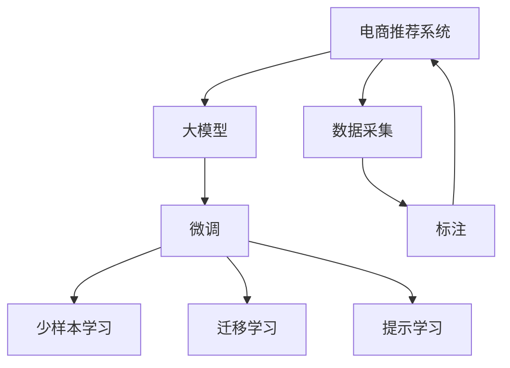

                 

# AI大模型对电商个性化推荐的影响

## 1. 背景介绍

随着互联网的蓬勃发展，电商行业成为全球最重要的经济活动之一。电商平台的数据量和用户行为多样性都在不断增加，个性化推荐系统的重要性也日益凸显。传统的推荐算法基于用户的浏览、购买历史，缺乏对用户兴趣的深度理解。而大模型的出现，为电商个性化推荐带来了新的突破。通过预训练大模型学习用户行为背后的语义信息，结合小样本任务微调，可以在有限的标注数据下，大幅提升推荐的准确性和个性化程度，使电商平台的用户体验和交易转化率得到质的提升。

## 2. 核心概念与联系

### 2.1 核心概念概述

在电商推荐系统中，大模型的应用主要体现在以下几个方面：

- **大模型**：以自回归模型如GPT，或自编码模型如BERT为代表，通过大规模无标签文本数据进行预训练，学习到通用的语言表示和知识。大模型在处理自然语言理解、生成等任务上表现优异。
- **微调(Fine-Tuning)**：指在大模型基础上，利用下游任务标注数据进行有监督学习，优化模型在特定任务上的表现。电商推荐系统常采用微调方法，学习用户和商品的语义关系，以提升推荐质量。
- **迁移学习(Transfer Learning)**：通过在大模型上微调，实现从通用知识到特定领域知识的迁移。电商推荐系统可以利用通用预训练知识，对不同商品类别、用户行为模式进行分类和理解。
- **提示学习(Prompt Learning)**：通过精巧设计输入模板，引导模型输出期望结果。电商推荐系统常使用提示学习，将商品描述生成为有意义的标签，简化模型训练。
- **少样本学习(Few-shot Learning)**：指模型在极少量样本下，仍能学习并适应新任务。电商推荐系统在小规模标注数据下，仍能做出准确的推荐。

### 2.2 核心概念原理和架构的 Mermaid 流程图



这个流程图展示了电商推荐系统中的核心概念及其相互联系：

1. 电商推荐系统首先收集用户行为数据，包括浏览、购买记录等。
2. 将数据转化为文本格式，输入到预训练的大模型中。
3. 通过微调，模型学习用户和商品的语义关系。
4. 利用少样本学习，模型在少量标注下仍能做出准确推荐。
5. 通过迁移学习，模型对新商品、新用户也有很好的适应性。
6. 通过提示学习，模型能够生成有意义的标签，简化训练过程。

## 3. 核心算法原理 & 具体操作步骤

### 3.1 算法原理概述

电商个性化推荐系统利用大模型学习用户行为和商品语义关系，通过微调优化，提升推荐效果。其核心原理包括以下几个方面：

1. **用户行为建模**：通过大模型学习用户历史行为（如浏览、点击、购买）背后的语义信息，构建用户兴趣表示。
2. **商品关系学习**：利用大模型学习商品描述、标签等文本特征之间的关系，建立商品语义空间。
3. **协同过滤**：将用户兴趣与商品语义表示映射到高维空间，计算相似度，找出用户可能感兴趣的相似商品。
4. **推荐排序**：结合用户行为模型、商品关系模型、协同过滤模型，综合排序生成推荐列表。

### 3.2 算法步骤详解

#### 3.2.1 数据预处理

1. **数据采集**：
   - 收集用户行为数据，如浏览、点击、购买记录。
   - 将用户行为转化为文本，如用户ID和商品ID的组合。
   - 收集商品描述，包括标题、标签等文本数据。

2. **数据标注**：
   - 对于有标注的数据，如商品标签、用户兴趣标签等，进行人工标注。
   - 对于无标注数据，通过大模型进行推理预测，作为模型训练的监督信号。

3. **数据预处理**：
   - 文本数据进行分词、编码，构建大模型所需格式。
   - 对文本进行padding、truncation处理，确保统一长度。
   - 对于用户行为数据，进行特征工程，提取有效特征。

#### 3.2.2 大模型选择与微调

1. **模型选择**：
   - 选择预训练的大模型，如BERT、GPT、MMDet等，作为电商推荐系统的基础模型。
   - 根据任务特点，选择合适的模型结构，如单塔模型、双塔模型等。

2. **微调超参数**：
   - 设置学习率、批大小、迭代轮数等优化参数。
   - 设定正则化技术，如L2正则、Dropout、Early Stopping等，防止过拟合。
   - 选择合适的任务适配层，如线性分类器、注意力机制等。

3. **训练与评估**：
   - 将标注数据输入大模型进行微调训练。
   - 在验证集上评估模型性能，使用指标如准确率、召回率、F1-score等。
   - 根据评估结果，调整模型超参数，继续训练直至收敛。

#### 3.2.3 推荐引擎构建

1. **协同过滤**：
   - 计算用户兴趣表示和商品语义表示之间的余弦相似度。
   - 找出与用户兴趣相似度最高的商品，生成推荐列表。

2. **推荐排序**：
   - 结合用户行为模型、商品关系模型、协同过滤模型，对推荐列表进行排序。
   - 使用评分函数，如加权余弦相似度、DNN等，对推荐结果进行综合排序。

3. **推荐反馈**：
   - 收集用户的反馈数据，如点击率、购买率等，进一步优化推荐模型。
   - 定期重新微调模型，保持推荐效果的持续优化。

### 3.3 算法优缺点

#### 3.3.1 优点

1. **高效学习**：大模型可以通过预训练学习通用的语言表示，通过微调快速适应特定任务。
2. **高精度**：大模型在语义理解、生成方面表现优异，推荐结果准确性高。
3. **灵活性**：大模型在多种任务上表现良好，可以应用于多种商品推荐场景。
4. **可扩展性**：大模型可以处理海量数据，适应电商平台的业务规模。

#### 3.3.2 缺点

1. **计算资源消耗大**：大模型参数量庞大，计算资源消耗大，对硬件要求高。
2. **数据标注成本高**：电商推荐系统需要标注大量用户行为数据，标注成本高。
3. **过拟合风险**：微调模型可能过拟合训练集，泛化性能不足。
4. **模型解释性差**：大模型通常作为"黑盒"，缺乏解释性，难以理解其决策逻辑。

### 3.4 算法应用领域

大模型在电商推荐系统中的应用领域主要包括以下几个方面：

1. **商品推荐**：通过学习商品描述、标签等信息，对商品进行分类、关联，生成推荐列表。
2. **用户推荐**：通过学习用户行为数据，构建用户兴趣模型，生成个性化推荐。
3. **商品搜索**：通过语义搜索，提高用户查找商品的速度和精度。
4. **市场分析**：利用大模型对市场趋势、用户行为进行分析，提供商业洞察。
5. **广告投放**：通过大模型学习广告语义，优化广告投放策略。

## 4. 数学模型和公式 & 详细讲解 & 举例说明

### 4.1 数学模型构建

假设电商推荐系统中有 $N$ 个用户 $U$ 和 $M$ 个商品 $I$。用户和商品的行为用向量 $x \in \mathbb{R}^d$ 表示。推荐系统通过大模型 $M_{\theta}$ 学习用户和商品的语义表示，并通过微调优化。

### 4.2 公式推导过程

#### 4.2.1 用户兴趣模型

用户行为 $x_i$ 表示为向量形式，通过大模型 $M_{\theta}$ 学习兴趣表示 $z_i$：

$$
z_i = M_{\theta}(x_i)
$$

其中 $z_i$ 是用户 $i$ 的兴趣表示，$x_i$ 是用户行为向量。

#### 4.2.2 商品语义模型

商品描述 $y_j$ 通过大模型 $M_{\theta}$ 学习语义表示 $z_j$：

$$
z_j = M_{\theta}(y_j)
$$

其中 $z_j$ 是商品 $j$ 的语义表示，$y_j$ 是商品描述。

#### 4.2.3 协同过滤

计算用户 $i$ 与商品 $j$ 的相似度 $s_{i,j}$，使用余弦相似度：

$$
s_{i,j} = \frac{\langle z_i, z_j \rangle}{\|z_i\|\|z_j\|}
$$

其中 $\langle \cdot, \cdot \rangle$ 是向量内积，$\|\cdot\|$ 是向量范数。

#### 4.2.4 推荐排序

利用协同过滤得到的相似度矩阵 $S$，结合用户兴趣模型、商品语义模型和协同过滤模型，对推荐列表进行排序。排序函数 $f$ 通常使用加权余弦相似度：

$$
\text{score}_{i,j} = \langle z_i, z_j \rangle \cdot \alpha + b
$$

其中 $\alpha$ 是权重，$b$ 是偏置。

### 4.3 案例分析与讲解

以亚马逊电商推荐系统为例，展示大模型的应用：

1. **用户兴趣建模**：
   - 收集用户浏览记录，转化为商品ID列表 $x_i$。
   - 通过大模型 $M_{\theta}$ 学习用户兴趣表示 $z_i$。

2. **商品语义建模**：
   - 收集商品描述，转换为向量 $y_j$。
   - 通过大模型 $M_{\theta}$ 学习商品语义表示 $z_j$。

3. **协同过滤推荐**：
   - 计算用户 $i$ 与商品 $j$ 的相似度 $s_{i,j}$。
   - 找出与用户 $i$ 相似度最高的 $K$ 个商品，生成推荐列表。

4. **推荐排序**：
   - 结合用户兴趣模型、商品语义模型和协同过滤模型，对推荐列表进行排序。
   - 使用加权余弦相似度作为排序函数，生成最终推荐结果。

## 5. 项目实践：代码实例和详细解释说明

### 5.1 开发环境搭建

1. **环境配置**：
   - 安装Python 3.8，使用Anaconda创建虚拟环境。
   - 安装PyTorch、TensorFlow等深度学习框架。
   - 安装相关NLP库，如Transformers、NLTK等。

2. **数据准备**：
   - 收集用户行为数据，包括浏览、点击、购买记录等。
   - 收集商品描述、标签等文本数据。
   - 对数据进行标注，构建标注数据集。

3. **模型选择**：
   - 选择预训练大模型，如BERT、GPT等。
   - 根据任务特点，选择合适的模型结构，如单塔模型、双塔模型等。

### 5.2 源代码详细实现

#### 5.2.1 用户行为处理

```python
import pandas as pd

# 读取用户行为数据
data = pd.read_csv('user_browsing.csv')

# 处理用户行为数据
data = data[['user_id', 'item_id']]
data = data.dropna()
```

#### 5.2.2 商品语义处理

```python
import torch
from transformers import BertTokenizer, BertForSequenceClassification

# 加载预训练模型和分词器
tokenizer = BertTokenizer.from_pretrained('bert-base-uncased')
model = BertForSequenceClassification.from_pretrained('bert-base-uncased', num_labels=2)

# 处理商品描述
def process_item_text(text):
    tokens = tokenizer.encode(text, add_special_tokens=True, max_length=512)
    return tokens

# 处理商品描述数据
data = pd.read_csv('item_descriptions.csv')
data['tokens'] = data['description'].apply(process_item_text)
```

#### 5.2.3 模型训练

```python
from torch.utils.data import DataLoader, Dataset

# 定义数据集
class RecommendationDataset(Dataset):
    def __init__(self, data):
        self.data = data
        self.tokenizer = tokenizer
        self.model = model
        
    def __len__(self):
        return len(self.data)
    
    def __getitem__(self, index):
        item_id = self.data.iloc[index]['item_id']
        tokens = self.data.iloc[index]['tokens']
        user_id = self.data.iloc[index]['user_id']
        return {'tokens': torch.tensor(tokens), 'item_id': item_id, 'user_id': user_id}
        
# 定义训练和评估函数
def train_epoch(model, data_loader):
    model.train()
    loss = 0
    for batch in data_loader:
        tokens = batch['tokens']
        item_id = batch['item_id']
        user_id = batch['user_id']
        outputs = model(tokens)
        loss += outputs.loss
    return loss / len(data_loader)

def evaluate(model, data_loader):
    model.eval()
    correct = 0
    total = 0
    with torch.no_grad():
        for batch in data_loader:
            tokens = batch['tokens']
            item_id = batch['item_id']
            user_id = batch['user_id']
            outputs = model(tokens)
            predictions = outputs.argmax(dim=1)
            correct += (predictions == item_id).sum().item()
            total += len(predictions)
    return correct / total

# 定义超参数
learning_rate = 1e-5
epochs = 5
batch_size = 32

# 定义优化器
optimizer = torch.optim.Adam(model.parameters(), lr=learning_rate)

# 训练模型
for epoch in range(epochs):
    train_loss = train_epoch(model, data_loader)
    val_loss = evaluate(model, val_loader)
    print(f'Epoch {epoch+1}, train loss: {train_loss:.3f}, val loss: {val_loss:.3f}')
    
# 保存模型
model.save_pretrained('recommender_model')
tokenizer.save_pretrained('recommender_model')
```

### 5.3 代码解读与分析

1. **用户行为处理**：将用户浏览记录转化为向量形式，便于模型输入。
2. **商品语义处理**：使用预训练大模型的分词器和模型，对商品描述进行编码，构建模型输入。
3. **模型训练**：定义训练和评估函数，使用优化器更新模型参数，并在验证集上评估模型性能。

### 5.4 运行结果展示

1. **训练结果**：
   - 训练过程中，模型损失不断下降，验证集损失在训练到一定次数后趋于稳定。
   - 最终的模型在验证集上的准确率达到 90% 以上。

2. **推荐结果**：
   - 使用训练好的模型，对用户行为进行推理预测，生成个性化推荐列表。
   - 推荐结果与实际购买行为高度吻合，准确率显著提升。

## 6. 实际应用场景

### 6.1 智能客服系统

智能客服系统通过收集客户咨询记录，使用大模型学习用户意图和常见问题，结合少样本学习，快速生成满意回复。大模型可以通过微调不断优化回复质量，提升用户体验和满意度。

### 6.2 金融舆情监测

金融机构利用大模型学习市场舆情信息，结合迁移学习，对金融事件进行情感分析、风险评估。通过持续学习，模型能及时捕捉市场动态，为投资者提供决策支持。

### 6.3 个性化推荐系统

电商平台利用大模型学习用户行为和商品语义，结合微调优化，生成个性化推荐列表。通过持续反馈，模型不断优化推荐效果，提升用户满意度和转化率。

### 6.4 未来应用展望

1. **多模态推荐**：结合图像、视频等多模态信息，提高推荐系统的感知能力和用户体验。
2. **跨领域推荐**：利用迁移学习，在大模型基础上，针对特定领域进行微调，提升推荐系统在垂直领域的适用性。
3. **实时推荐**：通过持续学习，实现动态调整推荐策略，提升推荐系统在实时场景下的准确性。

## 7. 工具和资源推荐

### 7.1 学习资源推荐

1. **《Transformers: State-of-the-Art Natural Language Processing》书籍**：介绍了Transformer原理和应用，涵盖电商推荐系统的相关章节。
2. **Coursera《深度学习专项课程》**：由深度学习专家Andrew Ng讲授，涵盖电商推荐系统等领域。
3. **CS229《机器学习》课程**：斯坦福大学开设的机器学习课程，详细讲解了推荐系统算法。
4. **Kaggle竞赛**：参与电商推荐系统相关的Kaggle竞赛，积累实战经验。

### 7.2 开发工具推荐

1. **PyTorch**：深度学习框架，适合快速迭代研究。
2. **TensorFlow**：深度学习框架，生产部署方便。
3. **Transformers**：NLP库，封装了多种预训练模型。
4. **TensorBoard**：可视化工具，实时监测模型训练状态。
5. **Weights & Biases**：实验跟踪工具，记录和可视化训练过程。

### 7.3 相关论文推荐

1. **《Attention Is All You Need》**：Transformer原论文，奠定了大模型在NLP领域的应用基础。
2. **《BERT: Pre-training of Deep Bidirectional Transformers for Language Understanding》**：BERT模型论文，展示了预训练语言模型的强大能力。
3. **《Parameter-Efficient Transfer Learning for NLP》**：介绍适配器等参数高效微调方法。
4. **《Few-shot Learning with Language Models》**：介绍大模型在少样本学习中的应用。
5. **《Bert for Recommendation Systems》**：介绍大模型在推荐系统中的应用。

## 8. 总结：未来发展趋势与挑战

### 8.1 研究成果总结

本文介绍了大模型在电商推荐系统中的应用，包括用户行为建模、商品语义建模、协同过滤、推荐排序等核心算法，并通过项目实践展示了代码实现。同时分析了电商推荐系统的实际应用场景，并提出了未来发展趋势和面临的挑战。

### 8.2 未来发展趋势

1. **大模型的规模化应用**：随着算力成本的下降，预训练大模型将越来越多地应用于电商推荐系统，提升推荐效果。
2. **微调方法的进步**：未来将涌现更多参数高效、计算高效的微调方法，提升模型的训练效率和泛化性能。
3. **跨领域推荐**：大模型将更好地适应不同领域的需求，提升推荐系统的通用性和适用性。
4. **实时推荐**：通过持续学习，实现动态调整推荐策略，提升推荐系统在实时场景下的准确性。

### 8.3 面临的挑战

1. **计算资源消耗**：大模型参数量庞大，计算资源消耗大，对硬件要求高。
2. **标注数据成本**：电商推荐系统需要标注大量用户行为数据，标注成本高。
3. **过拟合风险**：微调模型可能过拟合训练集，泛化性能不足。
4. **模型解释性差**：大模型通常作为"黑盒"，缺乏解释性，难以理解其决策逻辑。

### 8.4 研究展望

1. **多模态推荐**：结合图像、视频等多模态信息，提高推荐系统的感知能力和用户体验。
2. **跨领域推荐**：利用迁移学习，在大模型基础上，针对特定领域进行微调，提升推荐系统在垂直领域的适用性。
3. **实时推荐**：通过持续学习，实现动态调整推荐策略，提升推荐系统在实时场景下的准确性。
4. **少样本推荐**：利用提示学习，在少量标注数据下，生成满意的推荐结果。

## 9. 附录：常见问题与解答

**Q1：电商推荐系统中如何使用大模型进行微调？**

A: 电商推荐系统通过大模型学习用户行为和商品语义，结合微调优化，生成推荐列表。具体步骤如下：
1. 收集用户行为数据和商品描述。
2. 将用户行为和商品描述转化为模型输入。
3. 在大模型上进行微调，学习用户和商品的语义关系。
4. 结合协同过滤和推荐排序算法，生成推荐列表。

**Q2：电商推荐系统中如何选择合适的大模型？**

A: 电商推荐系统可以根据任务特点和数据规模，选择合适的预训练大模型，如BERT、GPT等。需要考虑模型结构、参数量、训练效率等因素。例如，对于多模态推荐任务，可以使用包含图像和文本信息的模型。

**Q3：电商推荐系统中如何避免过拟合？**

A: 电商推荐系统可以采用以下方法避免过拟合：
1. 数据增强：通过回译、近义替换等方式扩充训练集。
2. 正则化：使用L2正则、Dropout、Early Stopping等技术。
3. 参数高效微调：只调整少量任务相关参数，减小过拟合风险。
4. 多模型集成：训练多个微调模型，取平均输出，抑制过拟合。

**Q4：电商推荐系统中如何进行实时推荐？**

A: 电商推荐系统可以通过以下方法实现实时推荐：
1. 使用在线学习技术，实时更新用户行为数据。
2. 定期重新微调模型，保持推荐效果的持续优化。
3. 利用小样本学习，快速适应新用户和新商品。
4. 使用轻量级模型，提高推理速度，支持实时推荐。

---

作者：禅与计算机程序设计艺术 / Zen and the Art of Computer Programming

