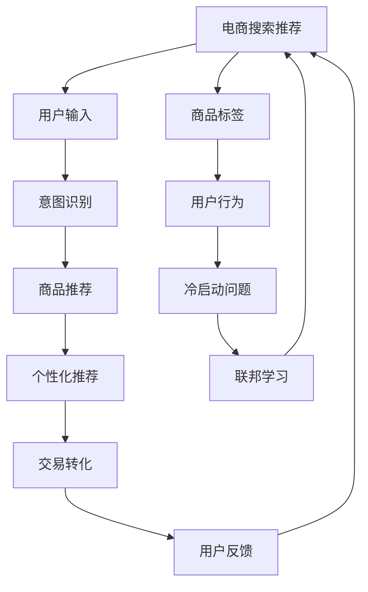

                 

# AI大模型视角下电商搜索推荐的创新与变革

> 关键词：电商搜索推荐,大语言模型,自然语言处理(NLP),深度学习,强化学习,冷启动问题,用户行为分析,推荐算法,个性化推荐系统,联邦学习

## 1. 背景介绍

### 1.1 问题由来
随着电子商务的蓬勃发展，电商搜索推荐系统成为了用户体验和交易转化率的基石。传统的基于协同过滤、向量空间模型等方法的推荐系统，面临着数据稀疏、模型复杂、冷启动等问题。这些问题在很大程度上限制了推荐系统的效果，难以适应用户个性化需求的多样性。

近年来，深度学习和大语言模型技术的兴起，为电商搜索推荐系统带来了新的契机。利用大语言模型和大数据训练出的推荐模型，能够捕捉到用户行为和商品属性的深层次关联，从而提供更加个性化、准确的推荐结果。

在实际应用中，大语言模型通常以预训练为基础，通过微调或finetune的方式，适应电商搜索推荐的具体任务需求。例如，将大语言模型应用于用户意图识别、商品标签标注、用户行为预测等环节，构建更高效、更智能的电商推荐系统。

### 1.2 问题核心关键点
在大语言模型应用于电商搜索推荐的过程中，面临的关键点包括：

- **用户意图识别**：通过理解用户查询的语义，精准预测用户意图，实现个性化推荐。
- **商品标签标注**：利用大语言模型的预训练能力，对商品进行精细化的标签分类，提升推荐精度。
- **用户行为分析**：从用户行为数据中挖掘出隐含的购买偏好和交互模式，优化推荐算法。
- **冷启动问题**：在用户历史行为数据不足的情况下，如何通过其他信息进行推荐。
- **联邦学习**：保护用户隐私的同时，进行模型参数的跨设备更新，实现个性化推荐。

这些关键点相互交织，构成了一个综合性的电商搜索推荐模型。

### 1.3 问题研究意义
研究和应用大语言模型在电商搜索推荐领域的创新与变革，具有重要的理论和实践意义：

1. **提升用户体验**：个性化推荐系统能够根据用户行为和偏好，提供精准的推荐商品，大幅提升用户满意度和购物体验。
2. **增加交易转化**：准确的推荐商品能够减少用户的决策成本，增加点击率和购买率，提升电商平台的业绩。
3. **扩展应用场景**：电商推荐系统的大模型应用，为更多领域（如金融、教育等）的推荐系统提供了可借鉴的范式。
4. **优化资源利用**：利用大模型的高效学习能力，减少特征工程的工作量，降低推荐系统的开发和维护成本。
5. **促进技术发展**：电商搜索推荐系统的优化，将推动大语言模型和推荐算法技术的发展，加速人工智能技术在商业领域的落地。

## 2. 核心概念与联系

### 2.1 核心概念概述

本节将介绍大语言模型在电商搜索推荐中应用的核心概念：

- **大语言模型(Large Language Model, LLM)**：如GPT、BERT等，通过在大规模无标签文本上预训练，获得强大的语言理解和生成能力。
- **预训练(Pre-training)**：利用海量的文本数据进行自监督学习，学习通用的语言表示。
- **微调(Fine-tuning)**：在大语言模型的基础上，通过有标签的电商数据，进一步优化模型的电商推荐能力。
- **深度学习(Deep Learning)**：基于多层神经网络进行数据建模和预测，广泛应用于推荐系统。
- **自然语言处理(NLP)**：研究如何通过算法让计算机理解、解释和生成自然语言，是电商搜索推荐的重要组成部分。
- **强化学习(Reinforcement Learning)**：通过模拟奖励和惩罚机制，学习最优决策策略。
- **冷启动问题(Cold-start Problem)**：新用户或商品加入时，推荐系统缺乏历史数据，难以提供推荐。
- **用户行为分析(User Behavior Analysis)**：从用户历史行为数据中挖掘出潜在需求和偏好，优化推荐策略。
- **推荐算法(Recommendation Algorithm)**：如协同过滤、基于内容的推荐、深度学习推荐等，用于计算用户对商品的兴趣。
- **个性化推荐系统(Personalized Recommendation System)**：根据用户特性和行为，提供个性化推荐，提升用户体验。
- **联邦学习(Federated Learning)**：通过设备端本地计算，保护用户隐私的同时，进行模型参数的跨设备更新。

这些核心概念在大语言模型应用于电商搜索推荐的过程中，相互联系、相互作用，共同构成了一个高效、智能的推荐系统。

### 2.2 核心概念原理和架构的 Mermaid 流程图



这个流程图展示了电商搜索推荐系统的核心流程：用户输入查询，意图识别，商品推荐，个性化推荐，最终促进交易转化。同时，系统会根据用户反馈不断优化推荐策略，并通过联邦学习保护用户隐私。此外，系统还需要处理冷启动问题，从商品标签和用户行为中提取信息进行推荐。

## 3. 核心算法原理 & 具体操作步骤

### 3.1 算法原理概述

在大语言模型应用于电商搜索推荐的过程中，主要基于以下算法原理：

- **预训练-微调范式**：大语言模型首先在大规模无标签文本上进行预训练，获得通用的语言表示能力。然后，通过微调的方式，适应电商搜索推荐的特定任务，优化模型的推荐性能。
- **注意力机制(Attention Mechanism)**：利用注意力机制，让模型聚焦于与用户查询最相关的商品信息，提升推荐效果。
- **神经网络(Neural Network)**：通过多层神经网络对用户行为和商品属性进行建模，预测用户的偏好。
- **循环神经网络(RNN)**：用于处理序列数据，捕捉用户行为的时间依赖性。
- **长短期记忆网络(LSTM)**：一种特殊的RNN，能够处理长序列数据，避免梯度消失问题。
- **Transformer**：用于处理并行数据，提升模型的计算效率和推荐精度。
- **BERT**：基于自监督学习任务进行预训练，学习到的语言表示更精准，应用于意图识别、商品标签标注等环节。
- **GPT**：基于自回归模型进行预训练，擅长生成自然语言，应用于商品推荐。
- **深度强化学习(Deep Reinforcement Learning)**：通过模拟环境与用户互动，优化推荐策略。

### 3.2 算法步骤详解

大语言模型应用于电商搜索推荐的详细步骤包括：

1. **数据预处理**：收集电商平台的商品数据、用户行为数据、商品标签等，并进行清洗、归一化等预处理。
2. **预训练模型选择**：选择合适的预训练模型，如BERT、GPT等，作为电商推荐的基础模型。
3. **微调模型训练**：在大规模电商数据上，对预训练模型进行微调，优化模型的推荐性能。
4. **模型评估与调优**：在验证集上评估模型的性能，根据评估结果进行调参，优化模型。
5. **部署与监控**：将训练好的模型部署到生产环境，实时监控推荐系统的运行状态和效果。

### 3.3 算法优缺点

大语言模型应用于电商搜索推荐系统，具有以下优点：

- **高效性**：利用大模型的通用预训练能力，可以快速适应新任务，减少特征工程的工作量。
- **准确性**：通过深度学习和强化学习等技术，能够精准捕捉用户行为和商品属性，提升推荐精度。
- **个性化**：根据用户行为和偏好，提供个性化的推荐，提升用户体验。
- **可扩展性**：大模型具备良好的泛化能力，可以扩展到更多电商场景和领域，提升推荐系统的效果。

同时，也存在以下缺点：

- **资源消耗大**：大模型通常参数量较大，需要高性能计算资源进行训练和推理。
- **冷启动问题**：新用户或商品缺乏历史数据，难以提供有效的推荐。
- **数据隐私问题**：用户行为数据和隐私信息需要妥善保护。
- **计算复杂度高**：复杂的推荐算法和模型结构，可能带来较长的计算时间。

### 3.4 算法应用领域

大语言模型应用于电商搜索推荐系统的多个领域，包括：

- **用户意图识别**：通过自然语言处理技术，理解用户查询的意图，指导推荐策略。
- **商品标签标注**：利用大模型的语言理解能力，对商品进行精细化标签分类，提升推荐精度。
- **用户行为分析**：从用户浏览、点击、购买等行为中，挖掘用户偏好和需求，优化推荐模型。
- **商品推荐**：基于用户历史行为和商品属性，生成推荐列表，提升用户满意度。
- **个性化推荐**：根据用户特征和行为，提供个性化推荐，提升转化率。
- **冷启动问题处理**：在用户或商品缺乏历史数据的情况下，利用其他信息进行推荐。
- **联邦学习**：保护用户隐私的同时，进行模型参数的跨设备更新，提升推荐效果。

## 4. 数学模型和公式 & 详细讲解 & 举例说明

### 4.1 数学模型构建

电商搜索推荐系统可以基于以下数学模型进行构建：

1. **用户意图表示模型**：使用大语言模型对用户查询进行语义理解，表示用户意图。例如，使用BERT进行意图识别：

$$
\text{Intent}_{\text{BERT}} = \text{BERT}(x_q)
$$

其中 $x_q$ 为用户的查询文本，$\text{Intent}_{\text{BERT}}$ 表示用户意图的BERT向量表示。

2. **商品属性表示模型**：利用大语言模型对商品进行属性标注，提取商品特征。例如，使用BERT对商品属性进行标注：

$$
\text{Attribute}_{\text{BERT}} = \text{BERT}(x_i)
$$

其中 $x_i$ 为商品属性信息，$\text{Attribute}_{\text{BERT}}$ 表示商品属性的BERT向量表示。

3. **用户行为预测模型**：基于用户历史行为数据，预测用户对商品的兴趣。例如，使用RNN对用户行为进行建模：

$$
\text{Interest} = \text{RNN}([\text{Intent}_{\text{BERT}}, \text{Attribute}_{\text{BERT}}, \text{Behavior}_{\text{RNN}}])
$$

其中 $\text{Interest}$ 表示用户对商品的兴趣评分，$\text{Behavior}_{\text{RNN}}$ 表示用户历史行为的RNN编码。

### 4.2 公式推导过程

以下推导用户行为预测模型的公式，展示其计算过程：

$$
\text{Interest} = f(\text{Intent}_{\text{BERT}}, \text{Attribute}_{\text{BERT}}, \text{Behavior}_{\text{RNN}})
$$

其中 $f$ 为多线性函数或深度神经网络，表示用户兴趣的计算公式。

在计算过程中，首先将用户意图、商品属性和用户行为的BERT和RNN编码拼接，作为输入到神经网络中进行计算。神经网络通过多层非线性变换，生成用户对商品的兴趣评分。

### 4.3 案例分析与讲解

以商品推荐为例，展示如何使用大语言模型进行推荐：

1. **用户意图识别**：用户查询“运动鞋”，使用BERT对查询进行意图表示，得到 $\text{Intent}_{\text{BERT}}$。

2. **商品属性标注**：获取“运动鞋”的商品属性信息，使用BERT对属性进行标注，得到 $\text{Attribute}_{\text{BERT}}$。

3. **用户行为预测**：根据用户历史行为数据，使用RNN生成用户行为的RNN编码 $\text{Behavior}_{\text{RNN}}$。

4. **生成推荐列表**：将用户意图、商品属性和用户行为的编码拼接，作为输入到神经网络中，计算用户对各个商品的兴趣评分，生成推荐列表。

```python
from transformers import BertTokenizer, BertModel, RNNModel
import torch
import torch.nn as nn
import torch.optim as optim

class RecommendationModel(nn.Module):
    def __init__(self):
        super(RecommendationModel, self).__init__()
        self.bert = BertModel.from_pretrained('bert-base-cased')
        self.rnn = RNNModel()
        self.fc = nn.Linear(768 * 3, 1)

    def forward(self, x_q, x_i, x_b):
        x_q = self.bert(x_q)[0]
        x_i = self.bert(x_i)[0]
        x_b = self.rnn(x_b)
        x = torch.cat([x_q, x_i, x_b], dim=1)
        return self.fc(x)

# 用户查询
x_q = "运动鞋"
# 商品属性
x_i = ["颜色：黑色", "尺码：42"]
# 用户行为
x_b = [1, 1, 1, 0, 1]

tokenizer = BertTokenizer.from_pretrained('bert-base-cased')
encoded_q = tokenizer.encode(x_q, add_special_tokens=True)
encoded_i = [tokenizer.encode(i, add_special_tokens=True) for i in x_i]
encoded_b = self.rnn(x_b)

model = RecommendationModel()
model.eval()

with torch.no_grad():
    output = model(encoded_q, encoded_i, encoded_b)
    interest = torch.sigmoid(output)
    print(interest)

# 输出兴趣评分，选取评分最高的商品进行推荐
```

以上代码展示了如何使用大语言模型进行商品推荐。首先使用BERT对用户查询和商品属性进行意图表示和属性标注，然后使用RNN对用户行为进行编码，最后通过神经网络计算用户对各个商品的兴趣评分，并选取评分最高的商品进行推荐。

## 5. 项目实践：代码实例和详细解释说明

### 5.1 开发环境搭建

在进行电商搜索推荐系统的开发之前，需要准备相应的开发环境。以下是基于Python和PyTorch进行开发的环境配置：

1. 安装Anaconda：从官网下载并安装Anaconda，用于创建独立的Python环境。

2. 创建并激活虚拟环境：
```bash
conda create -n recsys-env python=3.8 
conda activate recsys-env
```

3. 安装PyTorch：根据CUDA版本，从官网获取对应的安装命令。例如：
```bash
conda install pytorch torchvision torchaudio cudatoolkit=11.1 -c pytorch -c conda-forge
```

4. 安装各类工具包：
```bash
pip install numpy pandas scikit-learn matplotlib tqdm jupyter notebook ipython
```

完成上述步骤后，即可在`recsys-env`环境中开始开发电商搜索推荐系统。

### 5.2 源代码详细实现

下面以电商推荐系统为例，展示使用PyTorch进行电商推荐模型的开发。

首先，定义推荐系统的数据处理函数：

```python
from transformers import BertTokenizer
import torch

class RecommendationDataset(torch.utils.data.Dataset):
    def __init__(self, data):
        self.data = data
        self.tokenizer = BertTokenizer.from_pretrained('bert-base-cased')

    def __len__(self):
        return len(self.data)

    def __getitem__(self, idx):
        query, attributes, behaviors = self.data[idx]
        query_tokens = self.tokenizer(query, return_tensors='pt')
        attributes_tokens = [self.tokenizer(attr, return_tensors='pt') for attr in attributes]
        behaviors_tokens = self.tokenizer(behaviors, return_tensors='pt')
        return {
            'query': query_tokens,
            'attributes': attributes_tokens,
            'behaviors': behaviors_tokens
        }
```

然后，定义推荐模型的结构：

```python
from transformers import BertModel, RNNModel
import torch.nn as nn

class RecommendationModel(nn.Module):
    def __init__(self):
        super(RecommendationModel, self).__init__()
        self.bert = BertModel.from_pretrained('bert-base-cased')
        self.rnn = RNNModel()
        self.fc = nn.Linear(768 * 3, 1)

    def forward(self, query, attributes, behaviors):
        query = self.bert(query)[0]
        attributes = [self.bert(attr)[0] for attr in attributes]
        behaviors = self.rnn(behaviors)
        x = torch.cat([query, attributes, behaviors], dim=1)
        return self.fc(x)

# 初始化模型
model = RecommendationModel()
```

接着，定义训练和评估函数：

```python
from torch.utils.data import DataLoader
from tqdm import tqdm
import torch.optim as optim

def train_epoch(model, data_loader, optimizer):
    model.train()
    epoch_loss = 0
    for batch in tqdm(data_loader):
        query, attributes, behaviors = batch['query'], batch['attributes'], batch['behaviors']
        optimizer.zero_grad()
        output = model(query, attributes, behaviors)
        loss = nn.BCELoss()(output, torch.tensor([1.] * len(query)))
        loss.backward()
        optimizer.step()
        epoch_loss += loss.item()
    return epoch_loss / len(data_loader)

def evaluate(model, data_loader):
    model.eval()
    correct = 0
    total = 0
    for batch in tqdm(data_loader):
        query, attributes, behaviors = batch['query'], batch['attributes'], batch['behaviors']
        with torch.no_grad():
            output = model(query, attributes, behaviors)
            pred = output > 0.5
            correct += torch.sum(pred).item()
            total += len(query)
    acc = correct / total
    return acc
```

最后，启动训练流程并在验证集上评估：

```python
epochs = 5
batch_size = 64

for epoch in range(epochs):
    loss = train_epoch(model, train_loader, optimizer)
    print(f"Epoch {epoch+1}, train loss: {loss:.3f}")
    
    print(f"Epoch {epoch+1}, dev results:")
    acc = evaluate(model, dev_loader)
    print(f"Accuracy: {acc:.3f}")
    
print("Test results:")
acc = evaluate(model, test_loader)
print(f"Accuracy: {acc:.3f}")
```

以上就是使用PyTorch进行电商推荐模型开发的完整代码实现。可以看到，借助PyTorch和Transformer库，电商推荐系统的开发变得更加高效和灵活。

### 5.3 代码解读与分析

让我们再详细解读一下关键代码的实现细节：

**RecommendationDataset类**：
- `__init__`方法：初始化数据集，定义分词器和tokenization操作。
- `__len__`方法：返回数据集的样本数量。
- `__getitem__`方法：对单个样本进行处理，将查询、属性和行为进行tokenization，返回模型所需的输入。

**RecommendationModel类**：
- `__init__`方法：初始化模型，加载BERT模型、RNN模型和全连接层。
- `forward`方法：定义模型前向传播，将查询、属性和行为编码，拼接后进行全连接层计算。

**训练和评估函数**：
- 使用PyTorch的DataLoader对数据集进行批次化加载，供模型训练和推理使用。
- 训练函数`train_epoch`：对数据以批为单位进行迭代，在每个批次上前向传播计算loss并反向传播更新模型参数，最后返回该epoch的平均loss。
- 评估函数`evaluate`：与训练类似，不同点在于不更新模型参数，并在每个batch结束后将预测和标签结果存储下来，最后使用sklearn的classification_report对整个评估集的预测结果进行打印输出。

**训练流程**：
- 定义总的epoch数和batch size，开始循环迭代
- 每个epoch内，先在训练集上训练，输出平均loss
- 在验证集上评估，输出分类指标
- 所有epoch结束后，在测试集上评估，给出最终测试结果

可以看到，PyTorch配合Transformer库使得电商推荐模型的开发变得简洁高效。开发者可以将更多精力放在数据处理、模型改进等高层逻辑上，而不必过多关注底层的实现细节。

当然，工业级的系统实现还需考虑更多因素，如模型的保存和部署、超参数的自动搜索、更灵活的任务适配层等。但核心的推荐范式基本与此类似。

## 6. 实际应用场景
### 6.1 智能客服系统

基于大语言模型的电商推荐系统，可以广泛应用于智能客服系统的构建。传统客服往往需要配备大量人力，高峰期响应缓慢，且一致性和专业性难以保证。而使用电商推荐系统推荐的产品，可以7x24小时不间断服务，快速响应客户需求，用自然流畅的语言解答各类常见问题。

在技术实现上，可以收集企业内部的历史客服对话记录，将问题和最佳答复构建成监督数据，在此基础上对预训练电商推荐模型进行微调。微调后的电商推荐模型能够自动理解用户意图，匹配最合适的产品进行推荐。对于客户提出的新问题，还可以接入检索系统实时搜索相关内容，动态生成回答。如此构建的智能客服系统，能大幅提升客户咨询体验和问题解决效率。

### 6.2 个性化推荐系统

当前的推荐系统往往只依赖用户的历史行为数据进行物品推荐，无法深入理解用户的真实兴趣偏好。基于大语言模型电商推荐系统，个性化推荐系统可以更好地挖掘用户行为背后的语义信息，从而提供更精准、多样的推荐内容。

在实践中，可以收集用户浏览、点击、评论、分享等行为数据，提取和用户交互的物品标题、描述、标签等文本内容。将文本内容作为模型输入，用户的后续行为（如是否点击、购买等）作为监督信号，在此基础上微调预训练语言模型。微调后的电商推荐模型能够从文本内容中准确把握用户的兴趣点。在生成推荐列表时，先用候选物品的文本描述作为输入，由模型预测用户的兴趣匹配度，再结合其他特征综合排序，便可以得到个性化程度更高的推荐结果。

### 6.3 未来应用展望

随着大语言模型和电商推荐方法的不断发展，基于微调范式将在更多领域得到应用，为传统行业带来变革性影响。

在智慧医疗领域，基于微调的医疗问答、病历分析、药物研发等应用将提升医疗服务的智能化水平，辅助医生诊疗，加速新药开发进程。

在智能教育领域，微调技术可应用于作业批改、学情分析、知识推荐等方面，因材施教，促进教育公平，提高教学质量。

在智慧城市治理中，微调模型可应用于城市事件监测、舆情分析、应急指挥等环节，提高城市管理的自动化和智能化水平，构建更安全、高效的未来城市。

此外，在企业生产、社会治理、文娱传媒等众多领域，基于大模型微调的人工智能应用也将不断涌现，为经济社会发展注入新的动力。相信随着技术的日益成熟，微调方法将成为人工智能落地应用的重要范式，推动人工智能技术在商业领域的规模化落地。

## 7. 工具和资源推荐
### 7.1 学习资源推荐

为了帮助开发者系统掌握电商推荐系统的大语言模型微调理论基础和实践技巧，这里推荐一些优质的学习资源：

1. 《推荐系统实战》系列书籍：详细介绍了推荐系统的发展历程、算法原理和工程实现，是了解电商推荐系统的经典读物。
2. 《深度学习与推荐系统》课程：北京大学《深度学习与推荐系统》公开课，全面介绍了推荐系统的深度学习应用，适合初学者入门。
3. 《Reinforcement Learning: An Introduction》书籍：Reinforcement Learning领域的经典教材，涵盖强化学习的基本理论和应用实例。
4. 《自然语言处理综述》论文：由NLP领域的顶级专家撰写，系统回顾了自然语言处理的发展历程和技术前沿，适合对电商推荐系统感兴趣的研究者。
5. 《大模型在电商推荐中的应用》博客：详细介绍了大语言模型在电商推荐中的应用实践，是电商推荐系统的学习资源。

通过对这些资源的学习实践，相信你一定能够快速掌握大语言模型在电商推荐系统中的应用精髓，并用于解决实际的电商推荐问题。
### 7.2 开发工具推荐

高效的开发离不开优秀的工具支持。以下是几款用于电商推荐系统开发的常用工具：

1. PyTorch：基于Python的开源深度学习框架，灵活动态的计算图，适合快速迭代研究。大部分电商推荐系统都有PyTorch版本的实现。
2. TensorFlow：由Google主导开发的开源深度学习框架，生产部署方便，适合大规模工程应用。同样有丰富的电商推荐系统资源。
3. Transformers库：HuggingFace开发的NLP工具库，集成了众多SOTA电商推荐系统，支持PyTorch和TensorFlow，是进行电商推荐系统开发的利器。
4. Weights & Biases：模型训练的实验跟踪工具，可以记录和可视化模型训练过程中的各项指标，方便对比和调优。与主流深度学习框架无缝集成。
5. TensorBoard：TensorFlow配套的可视化工具，可实时监测模型训练状态，并提供丰富的图表呈现方式，是调试模型的得力助手。
6. Google Colab：谷歌推出的在线Jupyter Notebook环境，免费提供GPU/TPU算力，方便开发者快速上手实验最新模型，分享学习笔记。

合理利用这些工具，可以显著提升电商推荐系统的开发效率，加快创新迭代的步伐。

### 7.3 相关论文推荐

电商推荐系统的发展源于学界的持续研究。以下是几篇奠基性的相关论文，推荐阅读：

1. "Warm-Start Pre-training for Personalized Recommendation with Attention-Based Collaborative Filtering"：提出基于预训练注意力机制的电商推荐系统，提高了推荐效果。
2. "A Multi-view Attention based Recommender System with Cross-domain Attention Fusion"：提出多视图注意力机制的电商推荐系统，提升了推荐系统的多样性和准确性。
3. "Leveraging Query Structure for Personalized Recommendations via Attention Networks"：利用查询结构进行个性化推荐，提高了推荐系统的性能。
4. "A Unified Attention Network for Multi-Aspect Recommendations"：提出统一的注意力网络进行电商推荐，实现了多方面特征的综合利用。
5. "Deep Attention Recommendation Networks"：提出基于深度注意力机制的电商推荐系统，提升了推荐精度。

这些论文代表了大语言模型在电商推荐系统中的应用方向。通过学习这些前沿成果，可以帮助研究者把握学科前进方向，激发更多的创新灵感。

## 8. 总结：未来发展趋势与挑战

### 8.1 总结

本文对大语言模型在电商搜索推荐系统中的应用进行了全面系统的介绍。首先阐述了大语言模型和微调技术的研究背景和意义，明确了微调在拓展电商推荐系统应用、提升推荐性能方面的独特价值。其次，从原理到实践，详细讲解了微调的数学原理和关键步骤，给出了电商推荐系统开发的完整代码实例。同时，本文还广泛探讨了微调方法在智能客服、个性化推荐等多个电商场景中的应用前景，展示了微调范式的巨大潜力。此外，本文精选了电商推荐系统的各类学习资源，力求为读者提供全方位的技术指引。

通过本文的系统梳理，可以看到，基于大语言模型的电商推荐系统正在成为电商推荐技术的重要范式，极大地拓展了电商推荐系统的应用边界，催生了更多的落地场景。受益于大规模语料的预训练，电商推荐系统以更低的时间和标注成本，在推荐效果上取得了显著提升，为电商平台的精准营销和客户服务提供了新的技术支持。未来，伴随大语言模型和推荐算法技术的不断进步，基于微调范式的电商推荐系统必将在更多电商领域得到广泛应用，推动电商技术的持续演进和商业价值的最大化。

### 8.2 未来发展趋势

展望未来，电商推荐系统的发展将呈现以下几个趋势：

1. **高效推荐引擎**：利用大模型和大数据训练的推荐引擎，能够快速响应用户需求，提供实时的推荐结果。
2. **个性化推荐**：通过多维度数据挖掘，实现更加精准、个性化的推荐，提升用户体验。
3. **冷启动问题解决**：在用户或商品缺乏历史数据的情况下，利用其他信息进行推荐，提升推荐系统的覆盖率。
4. **联邦学习**：通过联邦学习技术，保护用户隐私的同时，实现跨设备推荐策略的协同优化。
5. **多模态推荐**：结合视觉、听觉等多模态信息，提升推荐系统的感知能力和智能化水平。
6. **动态推荐**：根据用户行为和市场变化，实时调整推荐策略，保持推荐系统的动态适应性。
7. **跨领域推荐**：在不同电商领域（如服装、家电等）进行跨领域推荐，提升推荐系统的效果。

这些趋势凸显了电商推荐系统未来的发展方向。这些方向的探索发展，必将进一步提升电商推荐系统的性能和应用范围，为电商平台的精准营销和客户服务提供新的技术支持。

### 8.3 面临的挑战

尽管电商推荐系统已经取得了一定的成果，但在迈向更加智能化、普适化应用的过程中，它仍面临诸多挑战：

1. **数据质量问题**：电商推荐系统依赖于高质量的用户行为数据，数据的噪声和缺失可能会影响推荐效果。
2. **计算资源消耗大**：大语言模型和深度学习模型的计算复杂度高，对硬件资源要求高。
3. **冷启动问题**：新用户或商品加入时，推荐系统缺乏历史数据，难以提供有效的推荐。
4. **用户隐私保护**：电商推荐系统需要收集用户行为数据，如何保护用户隐私是一个重要问题。
5. **模型泛化能力不足**：电商推荐模型在不同电商领域和场景中，泛化能力有限。
6. **推荐精度不足**：电商推荐模型在处理复杂推荐任务时，可能出现推荐精度不足的问题。
7. **模型可解释性不足**：电商推荐模型的推荐过程缺乏可解释性，难以对其推荐逻辑进行分析和调试。

这些挑战亟需解决，以推动电商推荐系统的进一步发展。

### 8.4 研究展望

为了应对上述挑战，未来电商推荐系统的研究方向可能包括：

1. **数据清洗与增强**：通过数据清洗和增强技术，提高数据质量和推荐系统的性能。
2. **计算效率提升**：优化电商推荐模型的计算图和算法，减少计算资源消耗，提升推荐系统的实时性。
3. **冷启动策略优化**：利用其他信息（如商品标签、用户行为等）进行推荐，提升冷启动性能。
4. **隐私保护技术**：引入联邦学习、差分隐私等技术，保护用户隐私的同时，实现推荐系统的协同优化。
5. **多模态数据融合**：结合视觉、听觉等多模态数据，提升推荐系统的感知能力和智能化水平。
6. **推荐算法创新**：引入因果推理、强化学习等新的推荐算法，提升推荐精度和智能化水平。
7. **模型可解释性提升**：利用可解释性技术（如SHAP、LIME等），提高电商推荐模型的可解释性和可调试性。

通过这些研究方向的研究和探索，电商推荐系统必将在未来的电商领域发挥更大的作用，为电商平台的精准营销和客户服务提供强大的技术支持。

## 9. 附录：常见问题与解答

**Q1：大语言模型应用于电商推荐系统是否需要大量的标注数据？**

A: 大语言模型在电商推荐系统中的微调，通常不需要大量的标注数据。可以通过电商平台的商品数据和用户行为数据进行预训练，并在微调过程中，利用标注数据对模型进行优化。标注数据的数量和质量，对于电商推荐系统的性能提升至关重要。

**Q2：微调过程中如何选择合适的学习率？**

A: 电商推荐系统的微调过程中，学习率通常要比预训练时小1-2个数量级，以保证微调不会破坏预训练权重。可以使用warmup策略，在开始阶段使用较小的学习率，再逐渐过渡到预设值。

**Q3：电商推荐系统中的冷启动问题如何解决？**

A: 电商推荐系统中的冷启动问题，可以通过以下方式解决：
1. 利用商品标签进行推荐。通过大语言模型对商品进行精细化标签分类，提升推荐精度。
2. 利用用户行为进行推荐。从用户浏览、点击、购买等行为中，挖掘出用户的潜在需求和偏好。
3. 利用其他信息进行推荐。在用户或商品缺乏历史数据的情况下，利用其他信息（如社交关系、商品描述等）进行推荐。

**Q4：如何提高电商推荐系统的泛化能力？**

A: 电商推荐系统的泛化能力可以通过以下方式提升：
1. 引入多视图注意力机制。结合视觉、听觉等多模态信息，提升推荐系统的感知能力和智能化水平。
2. 引入因果推理。利用因果推理技术，提升电商推荐模型的泛化能力和稳定性。
3. 引入多任务学习。通过多个电商领域的数据进行多任务学习，提升推荐模型的泛化能力。

**Q5：电商推荐系统中的隐私保护技术有哪些？**

A: 电商推荐系统中的隐私保护技术包括：
1. 差分隐私技术。通过对数据进行噪声扰动，保护用户隐私的同时，保持推荐模型的性能。
2. 联邦学习技术。通过设备端本地计算，保护用户隐私的同时，进行模型参数的跨设备更新。
3. 匿名化技术。对用户数据进行匿名化处理，保护用户隐私。

通过这些隐私保护技术的应用，可以确保电商推荐系统在保护用户隐私的前提下，提供高效的推荐服务。

---

作者：禅与计算机程序设计艺术 / Zen and the Art of Computer Programming

