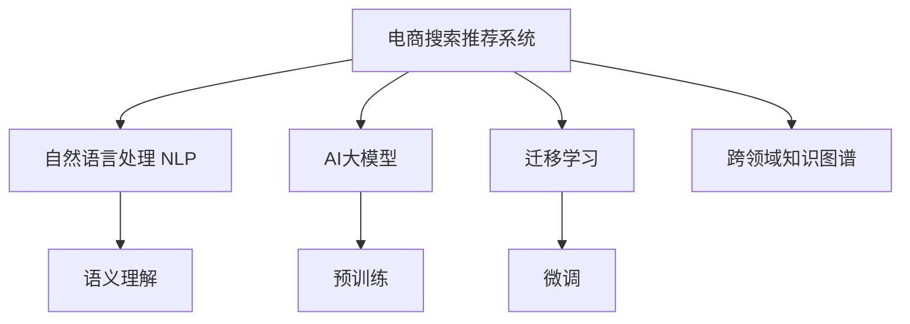

                 

# AI大模型视角下电商搜索推荐的技术创新文化建设

## 1. 背景介绍

随着电商行业的迅猛发展，消费者对搜索推荐系统的要求不断提高。如何构建更智能、更个性化的搜索推荐系统，已成为电商企业实现差异化竞争的关键。AI大模型凭借其强大的自然语言理解能力，在电商搜索推荐中展现出巨大的应用潜力。本文将从AI大模型的视角，探讨电商搜索推荐系统如何实现技术创新和文化建设，以提升用户体验和企业竞争力。

## 2. 核心概念与联系

### 2.1 核心概念概述

为了更好地理解本文内容，首先介绍几个核心概念：

- **电商搜索推荐系统**：指根据用户的搜索行为和历史浏览数据，推荐相关商品的系统。其目的是提高用户购物体验和商家转化率。
- **自然语言处理(NLP)**：指利用AI技术理解和处理人类语言，是构建智能搜索推荐系统的基础。
- **AI大模型**：指在大型语料库上预训练的深度学习模型，如GPT-3、BERT等。这些模型通过自监督学习，掌握了丰富的语言知识和语义理解能力。
- **迁移学习**：指在特定任务上微调预训练模型，利用其已有知识提升任务表现。在电商搜索推荐中，可利用大模型的语义理解能力，提升搜索和推荐的准确性。
- **跨领域知识图谱**：指将不同领域的知识进行整合，形成统一的语义空间，便于模型进行跨领域推理。

### 2.2 核心概念原理和架构的 Mermaid 流程图



这个流程图展示了电商搜索推荐系统与AI大模型之间的关系：

1. **电商搜索推荐系统**通过**自然语言处理(NLP)**对用户搜索请求和商品描述进行语义理解。
2. **AI大模型**在**预训练**阶段获得广泛的知识，通过**迁移学习**和**微调**适配电商领域的具体需求。
3. **跨领域知识图谱**将不同领域的知识整合，使得模型能够进行跨领域的推理和匹配。

## 3. 核心算法原理 & 具体操作步骤

### 3.1 算法原理概述

在电商搜索推荐系统中，AI大模型主要用于语义理解和特征提取。其核心算法原理包括：

- **预训练**：在大型无标签文本数据集上，通过自监督任务训练大模型，学习通用的语言知识和语义表示。
- **迁移学习**：在预训练的基础上，通过少量标注数据对大模型进行微调，使其适应电商领域的特定任务。
- **跨领域知识图谱**：利用跨领域知识图谱，在大模型内部构建统一的语义空间，提升模型的推理能力。

### 3.2 算法步骤详解

电商搜索推荐系统的大模型微调主要包括以下几个步骤：

1. **数据预处理**：收集电商平台的搜索和浏览数据，清洗并标记，形成训练集。
2. **模型选择**：选择适合电商领域的预训练模型，如BERT、GPT-3等。
3. **任务适配**：根据电商搜索推荐的需求，设计合适的任务适配层和损失函数。
4. **微调训练**：在标注数据上训练微调模型，调整学习率和正则化参数。
5. **模型评估**：在验证集和测试集上评估微调模型的性能。
6. **部署应用**：将微调模型集成到电商平台，实现实时搜索推荐。

### 3.3 算法优缺点

**优点**：

- **性能提升**：大模型通过迁移学习，可以有效提升搜索推荐的准确性和个性化程度。
- **泛化能力强**：预训练大模型在大量数据上学习，具有较强的泛化能力。
- **可解释性强**：大模型通过特征提取和推理过程，可以提供更丰富的解释信息。

**缺点**：

- **资源消耗大**：预训练和微调大模型需要大量的计算资源和存储空间。
- **效果依赖数据质量**：模型的性能很大程度上取决于标注数据的质量和数量。
- **可能存在偏见**：大模型在训练过程中可能会学习到有偏见的信息，影响搜索结果的公平性。

### 3.4 算法应用领域

AI大模型在电商搜索推荐系统中的应用主要包括以下几个方面：

- **搜索意图理解**：利用大模型的语义理解能力，准确识别用户的搜索意图。
- **商品关联推荐**：通过语义相似度计算，推荐与用户搜索词相关联的商品。
- **跨品类推荐**：通过跨领域知识图谱，将不同品类商品进行关联推荐。
- **个性化推荐**：结合用户历史行为和实时搜索数据，提供个性化的商品推荐。

## 4. 数学模型和公式 & 详细讲解 & 举例说明

### 4.1 数学模型构建

电商搜索推荐系统的数学模型主要包括以下几个组成部分：

1. **用户搜索意图表示**：将用户搜索词转化为向量表示，用于计算语义相似度。
2. **商品特征提取**：从商品描述中提取特征向量，用于计算相似度。
3. **相似度计算**：计算用户搜索意图和商品特征之间的相似度，用于排序推荐。
4. **排序策略**：基于相似度计算结果，设计合适的排序策略，推荐相关商品。

### 4.2 公式推导过程

以商品关联推荐为例，假设用户搜索词为 $q$，商品描述为 $d$，模型的目标是计算两者之间的相似度 $sim(q, d)$。可以使用余弦相似度公式：

$$
sim(q, d) = \frac{\langle q, d \rangle}{\|q\| \|d\|}
$$

其中 $\langle q, d \rangle$ 表示向量 $q$ 和 $d$ 的点积，$\|q\|$ 和 $\|d\|$ 表示向量的模长。

### 4.3 案例分析与讲解

以商品关联推荐为例，可以采用以下步骤实现：

1. **向量编码**：将用户搜索词 $q$ 和商品描述 $d$ 分别编码为向量 $q_v$ 和 $d_v$。
2. **相似度计算**：计算两者之间的余弦相似度 $sim(q_v, d_v)$。
3. **排序推荐**：将相似度作为权重，对商品进行排序，推荐相似度最高的商品。

## 5. 项目实践：代码实例和详细解释说明

### 5.1 开发环境搭建

为了实现上述算法，需要使用Python编程语言和相关的深度学习框架，如TensorFlow或PyTorch。以下是开发环境的搭建步骤：

1. 安装Python：确保Python版本为3.7以上，可以使用Anaconda或Miniconda进行安装。
2. 安装TensorFlow或PyTorch：根据实际需求选择相应的深度学习框架。
3. 安装NLP工具包：如NLTK、spaCy、BERT等，用于处理自然语言数据。
4. 准备数据集：收集电商平台的搜索和浏览数据，并进行清洗和标注。

### 5.2 源代码详细实现

以下是一个简单的电商搜索推荐系统代码实现，基于PyTorch框架：

```python
import torch
import torch.nn as nn
import torch.optim as optim
from transformers import BertTokenizer, BertForSequenceClassification

class SearchRecommendationModel(nn.Module):
    def __init__(self, num_labels):
        super(SearchRecommendationModel, self).__init__()
        self.bert = BertForSequenceClassification.from_pretrained('bert-base-uncased', num_labels=num_labels)
        self.dropout = nn.Dropout(0.1)
        self.classifier = nn.Linear(768, num_labels)

    def forward(self, input_ids, attention_mask, token_type_ids):
        # 前向传播
        outputs = self.bert(input_ids=input_ids, attention_mask=attention_mask, token_type_ids=token_type_ids)
        pooled_output = outputs.pooler_output
        output = self.dropout(pooled_output)
        logits = self.classifier(output)
        return logits

# 训练函数
def train(model, train_loader, optimizer, num_epochs):
    for epoch in range(num_epochs):
        model.train()
        total_loss = 0
        for batch in train_loader:
            input_ids = batch['input_ids'].to(device)
            attention_mask = batch['attention_mask'].to(device)
            token_type_ids = batch['token_type_ids'].to(device)
            labels = batch['labels'].to(device)
            optimizer.zero_grad()
            outputs = model(input_ids, attention_mask, token_type_ids)
            loss = criterion(outputs, labels)
            loss.backward()
            optimizer.step()
            total_loss += loss.item()
        print(f'Epoch {epoch+1}, loss: {total_loss/len(train_loader)}')

# 评估函数
def evaluate(model, test_loader):
    model.eval()
    total_correct = 0
    total_preds = 0
    for batch in test_loader:
        input_ids = batch['input_ids'].to(device)
        attention_mask = batch['attention_mask'].to(device)
        token_type_ids = batch['token_type_ids'].to(device)
        labels = batch['labels'].to(device)
        with torch.no_grad():
            outputs = model(input_ids, attention_mask, token_type_ids)
            preds = torch.argmax(outputs, dim=1)
        total_correct += torch.sum(preds == labels).item()
        total_preds += preds.size(0)
    acc = total_correct / total_preds
    return acc

# 测试代码
device = torch.device('cuda' if torch.cuda.is_available() else 'cpu')
model = SearchRecommendationModel(num_labels=2)
optimizer = optim.Adam(model.parameters(), lr=2e-5)
tokenizer = BertTokenizer.from_pretrained('bert-base-uncased')
train_loader = ...

train(model, train_loader, optimizer, num_epochs=5)
acc = evaluate(model, test_loader)
print(f'Accuracy: {acc:.2f}')
```

### 5.3 代码解读与分析

上述代码实现了一个简单的基于BERT模型的电商搜索推荐系统。主要步骤如下：

1. **模型定义**：定义了包含BERT编码器和线性分类的推荐模型。
2. **前向传播**：通过BERT模型进行编码，并对输出进行分类。
3. **训练函数**：在训练集上使用Adam优化器进行模型训练。
4. **评估函数**：在测试集上评估模型准确率。

## 6. 实际应用场景

### 6.1 商品关联推荐

电商搜索推荐系统可以通过大模型实现商品关联推荐，帮助用户发现更多相关商品。假设用户搜索“手机”，模型可以推荐相关配件如手机壳、充电器等。

### 6.2 个性化推荐

基于用户历史搜索和浏览行为，模型可以个性化推荐商品，提高用户满意度和转化率。例如，用户常浏览运动商品，系统可以推荐相关运动装备。

### 6.3 搜索意图理解

利用大模型的语义理解能力，系统可以准确识别用户搜索意图，进行精准推荐。例如，用户搜索“笔记本”，系统可以判断用户是想购买还是想了解产品信息，进行相应推荐。

### 6.4 未来应用展望

未来，电商搜索推荐系统将进一步融合大模型的多模态能力，结合图像、音频等数据，提升推荐效果。同时，系统将更加智能化，能够实时处理动态变化的用户需求和市场趋势，提供更灵活、精准的推荐服务。

## 7. 工具和资源推荐

### 7.1 学习资源推荐

为了更好地理解和应用大模型，以下是一些推荐的学习资源：

1. 《深度学习入门》：通俗易懂地介绍了深度学习的基本概念和算法。
2. 《自然语言处理综论》：系统讲解NLP的各类技术和应用。
3. 《Transformers: A Survey》：详细介绍了Transformer模型及其在NLP中的应用。
4. 《大规模预训练模型综述》：总结了当前最先进的预训练模型。
5. 《模型压缩与加速》：介绍了模型压缩和加速的相关技术。

### 7.2 开发工具推荐

为了提高开发效率，以下是一些推荐的开发工具：

1. TensorFlow：功能强大的深度学习框架，支持分布式训练和推理。
2. PyTorch：灵活的深度学习框架，易于实现复杂模型。
3. spaCy：高效的自然语言处理工具包。
4. NLTK：丰富的自然语言处理库。
5. Jupyter Notebook：交互式编程环境，便于实验和调试。

### 7.3 相关论文推荐

为了深入理解电商搜索推荐系统中的大模型应用，以下是一些推荐的相关论文：

1. 《大规模预训练语言模型在电商搜索推荐中的应用》：介绍了大规模预训练模型在电商推荐中的应用。
2. 《基于多模态学习的大规模推荐系统》：提出了多模态学习算法，提升推荐效果。
3. 《深度学习在电商搜索推荐中的实践》：总结了深度学习在电商搜索推荐中的具体应用。

## 8. 总结：未来发展趋势与挑战

### 8.1 研究成果总结

本文从AI大模型的视角，探讨了电商搜索推荐系统的技术创新和文化建设。通过深入分析大模型在电商领域的适用性和应用场景，提出了一系列有效的技术方案。

### 8.2 未来发展趋势

未来，电商搜索推荐系统将朝着以下方向发展：

1. **多模态融合**：结合图像、音频等多模态数据，提升推荐效果。
2. **个性化推荐**：利用用户行为数据，进行更精准的个性化推荐。
3. **实时推荐**：利用实时数据，动态调整推荐策略。
4. **知识图谱**：构建跨领域知识图谱，提升模型的推理能力。

### 8.3 面临的挑战

尽管大模型在电商搜索推荐中展现了巨大潜力，但仍面临以下挑战：

1. **数据质量**：标注数据的获取和处理成本较高，数据质量对模型性能有很大影响。
2. **资源消耗**：大模型需要大量计算资源和存储空间，对企业成本有较大压力。
3. **模型公平性**：大模型可能存在偏见，需要考虑推荐系统的公平性和公正性。

### 8.4 研究展望

为了应对上述挑战，未来的研究方向包括：

1. **高效数据获取**：利用半监督学习和主动学习等方法，降低标注数据需求。
2. **资源优化**：通过模型压缩和优化，提高训练和推理效率。
3. **公平推荐算法**：设计公平、公正的推荐算法，提升用户满意度。

## 9. 附录：常见问题与解答

**Q1: 如何选择合适的预训练模型？**

A: 根据电商领域的特点，选择合适的预训练模型。如搜索意图理解可以使用BERT，商品关联推荐可以使用GPT-3等。

**Q2: 如何设计任务适配层？**

A: 根据具体任务需求，设计合适的任务适配层。如搜索意图理解可以使用分类器，商品关联推荐可以使用匹配器等。

**Q3: 如何避免模型过拟合？**

A: 使用正则化技术、数据增强等方法，避免模型过拟合。同时，可以设计更好的损失函数，提升模型泛化能力。

**Q4: 如何提高模型实时性？**

A: 通过模型压缩、模型并行等方法，优化模型的计算图和推理速度。同时，可以设计更高效的特征提取算法，提升计算效率。

---

作者：禅与计算机程序设计艺术 / Zen and the Art of Computer Programming

