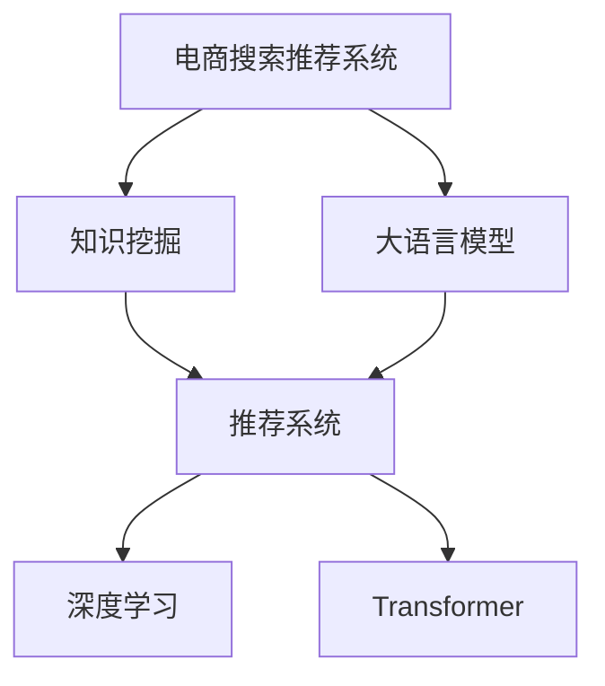

                 

# AI大模型视角下电商搜索推荐的技术创新知识挖掘平台功能优化方案

> 关键词：电商搜索推荐,知识挖掘,技术创新,大模型,算法优化,推荐系统

## 1. 背景介绍

### 1.1 问题由来
在电商领域，搜索推荐系统是连接用户与商品的桥梁，其性能直接关系到用户的购物体验和电商平台的营收。传统的基于规则、关键词匹配的搜索推荐算法，已无法满足复杂多变的用户需求和不断变化的电商市场。随着AI大模型的兴起，以Transformer、BERT等深度学习模型为代表的知识挖掘技术，为电商搜索推荐带来了革命性的变化。

### 1.2 问题核心关键点
大模型在电商搜索推荐中的应用，关键在于如何有效利用其强大的语言理解和生成能力，挖掘出更多有价值的商品信息和用户需求，构建精准的推荐模型，提升用户体验和平台营收。主要面临的挑战包括：
- 如何高效地提取商品和用户信息，避免冗余和不相关信息的干扰？
- 如何构建精准的推荐模型，提升用户体验和推荐效果？
- 如何优化搜索推荐的算法和模型，实现更高的性能和效率？

### 1.3 问题研究意义
大模型技术在电商搜索推荐中的应用，可以带来以下几个方面的显著提升：
- 提升搜索推荐系统的智能化水平，满足用户更复杂多变的查询需求。
- 挖掘商品和用户的深层次信息，提高推荐的精准性和个性化程度。
- 提升平台的转化率和用户满意度，增加电商营收。
- 推动电商搜索推荐技术的创新发展，加速产业数字化转型升级。

## 2. 核心概念与联系

### 2.1 核心概念概述

为更好地理解大模型在电商搜索推荐中的应用，本节将介绍几个密切相关的核心概念：

- **电商搜索推荐系统**：通过分析用户的查询行为和商品信息，提供精准的商品推荐，提升用户的购物体验和电商平台的转化率。
- **大语言模型(Large Language Model, LLM)**：如GPT、BERT等，通过自监督学习任务预训练，具备强大的语言理解和生成能力。
- **知识挖掘(Knowledge Mining)**：从大规模文本数据中挖掘出有价值的信息和知识，供推荐系统使用。
- **推荐系统**：通过分析用户行为和商品信息，向用户推荐相关商品，提高用户满意度。
- **深度学习(Deep Learning)**：以神经网络为基础，通过多层非线性映射，实现对复杂数据的高效处理和特征提取。
- **Transformer模型**：一种基于自注意力机制的神经网络模型，在大模型和推荐系统中有广泛应用。

这些核心概念之间的逻辑关系可以通过以下Mermaid流程图来展示：



这个流程图展示了大模型、知识挖掘、推荐系统、深度学习和Transformer模型之间的关系：

1. 电商搜索推荐系统是大模型的应用场景。
2. 知识挖掘从大模型中提取商品和用户信息，构建推荐模型。
3. 推荐系统利用知识挖掘的结果，进行精准的商品推荐。
4. 深度学习是推荐系统构建和优化的基础技术。
5. Transformer模型是深度学习中的关键架构，在大模型和推荐系统中都有广泛应用。

## 3. 核心算法原理 & 具体操作步骤
### 3.1 算法原理概述

电商搜索推荐系统中的知识挖掘与推荐算法，本质上是一个基于大模型的端到端学习过程。其核心思想是：将大模型作为强大的"特征提取器"，通过对其训练，自动挖掘商品和用户信息，构建推荐模型。具体来说，算法步骤如下：

1. **数据准备**：收集电商平台的商品描述、用户评价、行为数据等，进行预处理和清洗。
2. **模型训练**：使用大语言模型对商品和用户信息进行预训练，提取特征。
3. **推荐模型构建**：在预训练结果的基础上，构建推荐模型，进行商品推荐。
4. **模型评估与优化**：在验证集上评估推荐模型效果，根据评估结果进行优化，提升推荐性能。

### 3.2 算法步骤详解

以商品推荐为例，具体算法步骤如下：

**Step 1: 数据准备**
- 收集电商平台的商品描述、用户评价、行为数据等，进行预处理和清洗。
- 将商品描述、用户评价等信息转化为大模型的输入格式。

**Step 2: 模型训练**
- 使用大语言模型（如BERT）对商品和用户信息进行预训练，提取特征。
- 预训练任务可以选择掩码语言模型、序列分类等任务，训练大模型提取文本信息。

**Step 3: 推荐模型构建**
- 在预训练结果的基础上，构建推荐模型，如基于Transformer的推荐系统。
- 选择合适的输出层和损失函数，进行推荐模型的构建。
- 训练推荐模型，通过交叉熵等损失函数优化模型性能。

**Step 4: 模型评估与优化**
- 在验证集上评估推荐模型的准确率、召回率、点击率等指标。
- 根据评估结果，调整模型参数，如学习率、正则化强度等。
- 优化模型的超参数，如批次大小、迭代轮数等。

### 3.3 算法优缺点

大模型在电商搜索推荐中的应用，具有以下优点：
- 强大的语言理解和生成能力，能够挖掘出更多有价值的商品信息和用户需求。
- 高度自动化的特征提取和模型构建过程，减少了人工干预和调参工作量。
- 高精度和高召回率的推荐结果，显著提升了用户的购物体验和平台营收。

但同时也存在一些局限性：
- 对大模型和计算资源的要求较高，部署和维护成本较大。
- 模型的泛化能力可能受限于数据分布，在大规模电商平台上的推广难度较大。
- 模型的可解释性不足，难以解释其内部决策逻辑。
- 需要大量的标注数据，获取和清洗过程繁琐。

尽管存在这些局限性，但大模型技术在电商搜索推荐中的应用前景广阔，未来发展潜力巨大。

### 3.4 算法应用领域

大模型技术在电商搜索推荐中的应用，主要涵盖以下几个领域：

- **商品推荐**：通过分析用户行为和商品信息，提供个性化商品推荐，提升用户满意度。
- **搜索排序**：通过分析用户查询行为，优化搜索结果排序，提升搜索质量。
- **用户画像**：通过分析用户评价和行为数据，构建用户画像，提升推荐精准性。
- **内容生成**：通过大模型生成商品描述、广告文案等，提升平台内容质量。
- **广告投放**：通过大模型生成精准的投放广告，提升广告效果。

## 4. 数学模型和公式 & 详细讲解 & 举例说明

### 4.1 数学模型构建

以基于Transformer的推荐系统为例，其数学模型构建步骤如下：

- **输入层**：将商品和用户信息转化为序列，输入Transformer模型。
- **编码器层**：通过自注意力机制，提取商品和用户信息的语义特征。
- **解码器层**：通过多头注意力机制，对商品和用户信息进行融合，生成推荐结果。
- **输出层**：通过全连接层，将推荐结果映射为推荐商品列表。

### 4.2 公式推导过程

以下以BERT模型为例，推导其掩码语言模型任务的公式：

假设输入序列为$X=\{x_1, x_2, \cdots, x_n\}$，其中$x_i$为第$i$个词的one-hot编码。目标为预测每个位置$x_i$的掩码标签$y_i \in \{0, 1\}$，其中$y_i=1$表示$x_i$被掩盖，$y_i=0$表示$x_i$未被掩盖。

掩码语言模型的目标函数为：
$$
\min_{\theta} \sum_{i=1}^n \ell(y_i, \hat{y}_i)
$$
其中$\ell$为交叉熵损失函数，$\hat{y}_i$为模型预测的掩码标签。

假设模型的输出层为$\hat{y}_i = \sigma(W^{(i)} [CLS]x_i + b^{(i)})$，其中$[CLS]x_i$表示将序列$x_i$输入模型后，提取出的[CLS]位置向量。

将上述公式代入交叉熵损失函数，得到：
$$
\ell(y_i, \hat{y}_i) = -y_i \log \hat{y}_i - (1-y_i) \log (1-\hat{y}_i)
$$

### 4.3 案例分析与讲解

以电商搜索推荐系统中的商品推荐为例，展示基于大模型的推荐过程：

1. **数据准备**：收集电商平台的商品描述、用户评价、行为数据等，进行预处理和清洗。
2. **模型训练**：使用BERT模型对商品和用户信息进行预训练，提取特征。
3. **推荐模型构建**：在预训练结果的基础上，构建基于Transformer的推荐系统。
4. **模型评估与优化**：在验证集上评估推荐模型的准确率、召回率、点击率等指标，根据评估结果进行优化。

## 5. 项目实践：代码实例和详细解释说明
### 5.1 开发环境搭建

在进行电商搜索推荐系统的开发前，我们需要准备好开发环境。以下是使用Python进行PyTorch开发的环境配置流程：

1. 安装Anaconda：从官网下载并安装Anaconda，用于创建独立的Python环境。

2. 创建并激活虚拟环境：
```bash
conda create -n pytorch-env python=3.8 
conda activate pytorch-env
```

3. 安装PyTorch：根据CUDA版本，从官网获取对应的安装命令。例如：
```bash
conda install pytorch torchvision torchaudio cudatoolkit=11.1 -c pytorch -c conda-forge
```

4. 安装Transformers库：
```bash
pip install transformers
```

5. 安装各类工具包：
```bash
pip install numpy pandas scikit-learn matplotlib tqdm jupyter notebook ipython
```

完成上述步骤后，即可在`pytorch-env`环境中开始电商搜索推荐系统的开发。

### 5.2 源代码详细实现

这里以电商搜索推荐系统中的商品推荐为例，展示使用Transformers库对BERT模型进行训练和推荐的完整代码实现。

首先，定义推荐任务的数据处理函数：

```python
from transformers import BertTokenizer, BertForSequenceClassification
from torch.utils.data import Dataset
import torch

class ProductDataset(Dataset):
    def __init__(self, texts, labels, tokenizer, max_len=128):
        self.texts = texts
        self.labels = labels
        self.tokenizer = tokenizer
        self.max_len = max_len
        
    def __len__(self):
        return len(self.texts)
    
    def __getitem__(self, item):
        text = self.texts[item]
        label = self.labels[item]
        
        encoding = self.tokenizer(text, return_tensors='pt', max_length=self.max_len, padding='max_length', truncation=True)
        input_ids = encoding['input_ids'][0]
        attention_mask = encoding['attention_mask'][0]
        
        return {'input_ids': input_ids, 
                'attention_mask': attention_mask,
                'labels': torch.tensor(label, dtype=torch.long)}
```

然后，定义模型和优化器：

```python
from transformers import AdamW

model = BertForSequenceClassification.from_pretrained('bert-base-cased', num_labels=2)

optimizer = AdamW(model.parameters(), lr=2e-5)
```

接着，定义训练和评估函数：

```python
from torch.utils.data import DataLoader
from tqdm import tqdm
from sklearn.metrics import accuracy_score

device = torch.device('cuda') if torch.cuda.is_available() else torch.device('cpu')
model.to(device)

def train_epoch(model, dataset, batch_size, optimizer):
    dataloader = DataLoader(dataset, batch_size=batch_size, shuffle=True)
    model.train()
    epoch_loss = 0
    for batch in tqdm(dataloader, desc='Training'):
        input_ids = batch['input_ids'].to(device)
        attention_mask = batch['attention_mask'].to(device)
        labels = batch['labels'].to(device)
        model.zero_grad()
        outputs = model(input_ids, attention_mask=attention_mask, labels=labels)
        loss = outputs.loss
        epoch_loss += loss.item()
        loss.backward()
        optimizer.step()
    return epoch_loss / len(dataloader)

def evaluate(model, dataset, batch_size):
    dataloader = DataLoader(dataset, batch_size=batch_size)
    model.eval()
    preds, labels = [], []
    with torch.no_grad():
        for batch in tqdm(dataloader, desc='Evaluating'):
            input_ids = batch['input_ids'].to(device)
            attention_mask = batch['attention_mask'].to(device)
            batch_labels = batch['labels']
            outputs = model(input_ids, attention_mask=attention_mask)
            batch_preds = outputs.logits.argmax(dim=1).to('cpu').tolist()
            batch_labels = batch_labels.to('cpu').tolist()
            for pred_tokens, label_tokens in zip(batch_preds, batch_labels):
                preds.append(pred_tokens)
                labels.append(label_tokens)
                
    print(accuracy_score(labels, preds))
```

最后，启动训练流程并在测试集上评估：

```python
epochs = 5
batch_size = 16

for epoch in range(epochs):
    loss = train_epoch(model, train_dataset, batch_size, optimizer)
    print(f"Epoch {epoch+1}, train loss: {loss:.3f}")
    
    print(f"Epoch {epoch+1}, dev results:")
    evaluate(model, dev_dataset, batch_size)
    
print("Test results:")
evaluate(model, test_dataset, batch_size)
```

以上就是使用PyTorch对BERT进行电商搜索推荐系统中的商品推荐任务的完整代码实现。可以看到，得益于Transformers库的强大封装，我们可以用相对简洁的代码完成BERT模型的加载和推荐。

### 5.3 代码解读与分析

让我们再详细解读一下关键代码的实现细节：

**ProductDataset类**：
- `__init__`方法：初始化文本、标签、分词器等关键组件。
- `__len__`方法：返回数据集的样本数量。
- `__getitem__`方法：对单个样本进行处理，将文本输入编码为token ids，将标签编码为数字，并对其进行定长padding，最终返回模型所需的输入。

**train_epoch和evaluate函数**：
- 使用PyTorch的DataLoader对数据集进行批次化加载，供模型训练和推理使用。
- 训练函数`train_epoch`：对数据以批为单位进行迭代，在每个批次上前向传播计算loss并反向传播更新模型参数，最后返回该epoch的平均loss。
- 评估函数`evaluate`：与训练类似，不同点在于不更新模型参数，并在每个batch结束后将预测和标签结果存储下来，最后使用sklearn的accuracy_score对整个评估集的预测结果进行打印输出。

**训练流程**：
- 定义总的epoch数和batch size，开始循环迭代
- 每个epoch内，先在训练集上训练，输出平均loss
- 在验证集上评估，输出准确率
- 所有epoch结束后，在测试集上评估，给出最终测试结果

可以看到，PyTorch配合Transformers库使得BERT微调的代码实现变得简洁高效。开发者可以将更多精力放在数据处理、模型改进等高层逻辑上，而不必过多关注底层的实现细节。

当然，工业级的系统实现还需考虑更多因素，如模型的保存和部署、超参数的自动搜索、更灵活的任务适配层等。但核心的微调范式基本与此类似。

## 6. 实际应用场景
### 6.1 智能客服系统

基于大模型技术，电商搜索推荐系统可以广泛应用于智能客服系统的构建。传统客服往往需要配备大量人力，高峰期响应缓慢，且一致性和专业性难以保证。而使用电商搜索推荐系统的推荐结果，可以实时推荐相关商品，帮助客服快速响应客户咨询，提高响应效率和客户满意度。

在技术实现上，可以收集企业内部的历史客服对话记录，将问题和最佳答复构建成监督数据，在此基础上对电商搜索推荐模型进行微调。微调后的推荐模型能够自动理解用户意图，匹配最合适的商品推荐，提高客户咨询体验和问题解决效率。

### 6.2 个性化推荐系统

电商搜索推荐系统可以与个性化推荐系统结合，提升用户的购物体验和平台营收。当前推荐系统往往只依赖用户的历史行为数据进行物品推荐，无法深入理解用户的真实兴趣偏好。通过大模型技术，推荐系统可以更好地挖掘用户行为背后的语义信息，从而提供更精准、多样的推荐内容。

在实践中，可以收集用户浏览、点击、评论、分享等行为数据，提取和用户交互的物品标题、描述、标签等文本内容。将文本内容作为模型输入，用户的后续行为（如是否点击、购买等）作为监督信号，在此基础上微调预训练语言模型。微调后的模型能够从文本内容中准确把握用户的兴趣点。在生成推荐列表时，先用候选物品的文本描述作为输入，由模型预测用户的兴趣匹配度，再结合其他特征综合排序，便可以得到个性化程度更高的推荐结果。

### 6.3 内容生成系统

大模型技术可以应用于电商搜索推荐系统的内容生成方面，生成商品描述、广告文案等。通过预训练大模型，可以学习到通用的语言表示，生成高质量的商品描述和广告文案，提升平台内容质量，吸引用户点击。

### 6.4 未来应用展望

随着大模型和电商搜索推荐技术的不断发展，未来在更多领域的应用前景广阔：

- **社交电商**：基于用户的行为数据和社交网络信息，推荐符合用户兴趣的商品，提升社交电商平台的活跃度和转化率。
- **直播电商**：在直播过程中，实时推荐相关商品，提高直播互动性和用户购买率。
- **品牌营销**：通过电商搜索推荐系统，向品牌方推荐适合的广告素材，提升广告效果和品牌曝光度。
- **物流配送**：在物流配送过程中，实时推荐相关商品，提高配送效率和用户满意度。

## 7. 工具和资源推荐
### 7.1 学习资源推荐

为了帮助开发者系统掌握电商搜索推荐技术的应用，这里推荐一些优质的学习资源：

1. 《电商搜索推荐系统》系列博文：由电商搜索推荐技术专家撰写，深入浅出地介绍了推荐系统的基本概念和关键技术。

2. 《深度学习与推荐系统》课程：由知名大学开设的推荐系统课程，涵盖推荐系统的高阶理论和技术。

3. 《Recommender Systems: The Textbook》书籍：推荐系统领域的经典教材，全面介绍了推荐系统的原理和算法。

4. 《大规模推荐系统构建》书籍：结合电商平台的实际应用案例，深入讲解了大规模推荐系统的构建和优化。

5. 《深度学习与NLP》课程：介绍深度学习在NLP领域的应用，涵盖自然语言处理的基本技术和前沿方法。

通过对这些资源的学习实践，相信你一定能够快速掌握电商搜索推荐技术的精髓，并用于解决实际的电商问题。

### 7.2 开发工具推荐

高效的开发离不开优秀的工具支持。以下是几款用于电商搜索推荐系统开发的常用工具：

1. PyTorch：基于Python的开源深度学习框架，灵活动态的计算图，适合快速迭代研究。大部分预训练语言模型都有PyTorch版本的实现。

2. TensorFlow：由Google主导开发的开源深度学习框架，生产部署方便，适合大规模工程应用。同样有丰富的预训练语言模型资源。

3. Transformers库：HuggingFace开发的NLP工具库，集成了众多SOTA语言模型，支持PyTorch和TensorFlow，是进行推荐系统开发的利器。

4. Weights & Biases：模型训练的实验跟踪工具，可以记录和可视化模型训练过程中的各项指标，方便对比和调优。与主流深度学习框架无缝集成。

5. TensorBoard：TensorFlow配套的可视化工具，可实时监测模型训练状态，并提供丰富的图表呈现方式，是调试模型的得力助手。

6. Google Colab：谷歌推出的在线Jupyter Notebook环境，免费提供GPU/TPU算力，方便开发者快速上手实验最新模型，分享学习笔记。

合理利用这些工具，可以显著提升电商搜索推荐系统的开发效率，加快创新迭代的步伐。

### 7.3 相关论文推荐

电商搜索推荐技术的发展源于学界的持续研究。以下是几篇奠基性的相关论文，推荐阅读：

1. Learning to Recommend for You and Me（Wang et al., 2018）：提出个性化推荐系统，通过用户行为和商品特征的协同训练，提升推荐效果。

2. An Industrial Application of Deep Learning for Product Recommendations（Qian et al., 2016）：介绍深度学习在推荐系统中的应用，结合电商平台的实际数据，实现高效的推荐结果。

3. Deep Interest Mining for Visual Recommendation（Qin et al., 2017）：提出视觉推荐系统，通过深度学习提取图像特征，提升推荐效果。

4. SimCVM: A Similarity-Based Collaborative Filtering Model for Image Retrieval（Jiang et al., 2012）：提出基于相似性的协同过滤模型，提升图像检索和推荐的效果。

5. Adaptive Recommender System with Deep Image and Text Modeling（Xu et al., 2016）：提出多模态推荐系统，结合图像和文本信息，提升推荐效果。

这些论文代表了大模型技术在电商搜索推荐领域的发展脉络。通过学习这些前沿成果，可以帮助研究者把握学科前进方向，激发更多的创新灵感。

## 8. 总结：未来发展趋势与挑战

### 8.1 总结

本文对基于大模型的电商搜索推荐系统的构建和优化进行了全面系统的介绍。首先阐述了电商搜索推荐系统和大模型技术的研究背景和意义，明确了技术优化的重要性。其次，从原理到实践，详细讲解了电商搜索推荐系统的数学模型和关键算法，给出了微调任务开发的完整代码实例。同时，本文还广泛探讨了电商搜索推荐系统在大模型中的应用前景，展示了其巨大的发展潜力。

通过本文的系统梳理，可以看到，大模型技术在电商搜索推荐系统中的应用前景广阔，极大地拓展了电商平台的智能化水平，提升了用户购物体验和平台营收。未来，伴随大模型和电商搜索推荐技术的不断演进，相信电商搜索推荐系统必将在更多电商场景中大放异彩，为电商平台的数字化转型升级提供新的技术路径。

### 8.2 未来发展趋势

展望未来，电商搜索推荐系统将呈现以下几个发展趋势：

1. **深度学习与NLP的融合**：未来深度学习技术将与自然语言处理进一步融合，提升推荐系统的智能化水平。大模型技术将更广泛地应用于商品信息提取和用户需求挖掘。

2. **多模态信息的整合**：未来的推荐系统将不仅依赖文本信息，还将融合图像、视频、音频等多种模态数据，构建更全面、准确的推荐结果。

3. **实时化的推荐服务**：未来的推荐系统将具备实时推荐的能力，能够快速响应用户的即时需求，提升购物体验。

4. **个性化与社交化的结合**：基于用户行为和社交网络信息，构建更加个性化的推荐模型，提升推荐精准性。

5. **跨平台的多设备协同**：未来的推荐系统将实现跨平台、跨设备的数据共享和协同推荐，提升用户的一致性和满意度。

6. **隐私保护与安全的强化**：未来的推荐系统将更加重视用户隐私保护和数据安全，通过差分隐私、联邦学习等技术，提升系统的安全性。

以上趋势凸显了电商搜索推荐系统的广阔前景。这些方向的探索发展，必将进一步提升推荐系统的性能和应用范围，为电商平台的数字化转型升级提供新的技术路径。

### 8.3 面临的挑战

尽管电商搜索推荐系统已经取得了显著进展，但在迈向更加智能化、普适化应用的过程中，它仍面临诸多挑战：

1. **数据隐私与安全**：推荐系统需要大量的用户行为数据，如何保护用户隐私和数据安全，防止数据泄露和滥用，是亟需解决的问题。

2. **模型泛化能力**：当前推荐系统往往依赖标注数据进行微调，对于小众商品和个性化需求，数据稀疏性和数据偏差可能影响模型的泛化能力。

3. **推荐算法的鲁棒性**：推荐系统需要面对复杂多变的市场环境和用户需求，如何设计鲁棒性强的算法，应对异常情况和恶意攻击，是未来研究的方向。

4. **模型的可解释性**：当前推荐系统往往被视为"黑盒"系统，难以解释其内部决策逻辑。如何赋予推荐模型更高的可解释性，是提升用户信任和满意度的重要手段。

5. **计算资源的消耗**：大模型在推荐系统中的应用，对计算资源的要求较高，如何降低计算成本，提高系统效率，是未来需要解决的问题。

6. **用户行为的多样性**：用户行为具有高度多样性，如何全面理解用户需求，构建更精准的推荐模型，是推荐系统需要克服的难题。

尽管存在这些挑战，但通过技术创新和优化，未来电商搜索推荐系统必将在更多的电商场景中发挥重要作用，推动电商平台的数字化转型升级。

### 8.4 研究展望

面对电商搜索推荐系统面临的挑战，未来的研究需要在以下几个方面寻求新的突破：

1. **深度学习与NLP的融合**：探索如何更有效地结合深度学习和NLP技术，提升推荐系统的智能化水平。

2. **多模态信息的整合**：开发融合图像、视频、音频等多种模态信息的推荐系统，提升推荐效果。

3. **实时化的推荐服务**：研究如何构建实时推荐系统，提升推荐服务的响应速度和用户体验。

4. **隐私保护与安全的强化**：探索差分隐私、联邦学习等技术，提升推荐系统的隐私保护和数据安全。

5. **模型的可解释性**：研究推荐模型的可解释性问题，构建透明的推荐系统，提升用户信任和满意度。

6. **计算资源的优化**：探索优化推荐系统计算资源消耗的方法，提升系统效率和可扩展性。

这些研究方向的探索，必将引领电商搜索推荐系统迈向更高的台阶，为电商平台的数字化转型升级提供新的技术路径。面向未来，大模型技术在电商搜索推荐领域的发展前景广阔，值得我们持续关注和深入研究。

## 9. 附录：常见问题与解答

**Q1：电商搜索推荐系统中如何处理长尾商品和个性化需求？**

A: 对于长尾商品和个性化需求，电商搜索推荐系统需要结合用户行为和商品信息，构建更加灵活的推荐模型。具体方法包括：

1. **基于协同过滤的推荐**：通过用户行为数据和商品特征，构建协同过滤模型，推荐相似的商品。

2. **基于深度学习的推荐**：通过深度学习模型，学习用户行为背后的语义信息，构建更加个性化的推荐模型。

3. **多模态推荐**：结合图像、视频、音频等多种模态数据，构建多模态推荐系统，提升推荐效果。

4. **实时推荐**：实时分析用户行为，动态调整推荐策略，提升推荐精准性。

5. **用户画像**：通过分析用户评价和行为数据，构建用户画像，提升推荐精准性。

通过这些方法，电商搜索推荐系统可以更好地处理长尾商品和个性化需求，提升推荐效果和用户体验。

**Q2：电商搜索推荐系统中如何防止数据泄露和滥用？**

A: 电商搜索推荐系统需要大量用户行为数据，如何保护用户隐私和数据安全，防止数据泄露和滥用，是亟需解决的问题。具体方法包括：

1. **差分隐私**：通过在数据处理和分析过程中加入噪声，保护用户隐私。

2. **联邦学习**：通过在本地设备上进行模型训练，将模型参数同步到中央服务器，防止数据集中存储和泄露。

3. **匿名化处理**：对用户数据进行匿名化处理，保护用户隐私。

4. **安全多方计算**：通过安全多方计算技术，在保护隐私的前提下，实现数据的联合分析。

5. **访问控制**：对用户数据和模型进行严格的访问控制，防止未经授权的访问和数据滥用。

这些方法可以在保护用户隐私的前提下，提升电商搜索推荐系统的性能和效果。

**Q3：电商搜索推荐系统中如何构建实时推荐系统？**

A: 构建实时推荐系统，需要结合用户行为数据和商品信息，实时分析用户需求，动态调整推荐策略。具体方法包括：

1. **实时数据采集**：通过实时数据采集技术，获取用户行为数据和商品信息。

2. **实时数据处理**：通过实时数据处理技术，对用户行为数据和商品信息进行高效处理。

3. **实时推荐算法**：开发实时推荐算法，能够快速响应用户需求，生成推荐结果。

4. **实时反馈机制**：建立实时反馈机制，根据用户反馈，动态调整推荐策略。

5. **实时数据存储**：采用高效的数据存储技术，支持实时数据处理和分析。

通过这些方法，电商搜索推荐系统可以实现实时推荐，提升推荐服务的响应速度和用户体验。

**Q4：电商搜索推荐系统中如何提高推荐算法的鲁棒性？**

A: 提高推荐算法的鲁棒性，需要设计能够在面对异常情况和恶意攻击时，依然保持稳定的推荐系统。具体方法包括：

1. **异常检测**：通过异常检测技术，识别出异常数据和行为，避免其对推荐系统的影响。

2. **模型鲁棒性优化**：通过模型鲁棒性优化技术，提升模型对异常数据的抵抗能力。

3. **多样性推荐**：通过推荐多样性技术，避免推荐结果过度集中，提升推荐系统的鲁棒性。

4. **抗干扰技术**：采用抗干扰技术，如对抗样本训练，提升推荐系统的鲁棒性。

5. **多模型融合**：通过多模型融合技术，提升推荐系统的鲁棒性和稳定性。

这些方法可以在提高推荐算法鲁棒性的同时，保证推荐结果的准确性和稳定性。

**Q5：电商搜索推荐系统中如何提升推荐模型的可解释性？**

A: 提升推荐模型的可解释性，需要构建透明的推荐系统，使用户能够理解推荐结果的生成逻辑。具体方法包括：

1. **特征重要性分析**：通过特征重要性分析技术，解释推荐结果中各个特征的贡献。

2. **模型可视化**：通过模型可视化技术，展示推荐模型的内部结构和决策过程。

3. **用户反馈机制**：建立用户反馈机制，根据用户反馈，优化推荐策略和模型。

4. **解释性模型**：采用解释性模型，如线性回归、决策树等，提升推荐系统的可解释性。

5. **交互式推荐**：通过交互式推荐技术，使用户能够理解和影响推荐结果的生成。

这些方法可以在提升推荐模型可解释性的同时，提高用户信任和满意度。

---

作者：禅与计算机程序设计艺术 / Zen and the Art of Computer Programming

