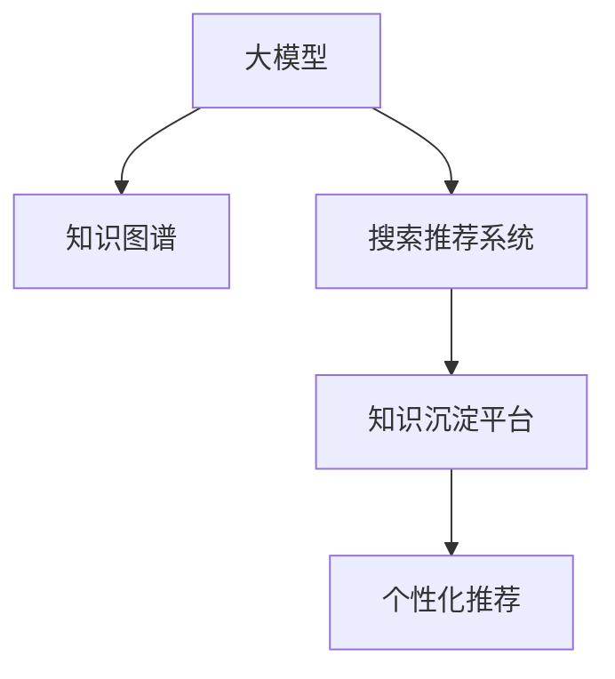

                 

# AI大模型视角下电商搜索推荐的技术创新知识沉淀平台功能优化

> 关键词：AI大模型, 电商搜索推荐, 知识沉淀平台, 技术创新, 功能优化

## 1. 背景介绍

### 1.1 问题由来
随着人工智能技术的迅猛发展，AI大模型在电商搜索推荐领域的应用越来越广泛。从简单的推荐系统到复杂的个性化推荐，从搜索结果排序到文本生成式搜索，大模型如BERT、GPT等以高精度、低成本、可扩展性等优点，显著提升了电商平台的搜索体验和推荐效率。然而，大模型的泛化能力有待提升，特别是在多变的数据分布下，模型表现往往不够稳定。同时，电商搜索推荐系统的迭代更新速度较慢，难以快速响应市场变化，难以持续优化用户体验。

### 1.2 问题核心关键点
面对电商搜索推荐系统的这些问题，我们迫切需要一种能够有效优化大模型性能，提升系统响应速度，并快速迭代优化的解决方案。为了解决这些问题，我们提出了知识沉淀平台（Knowledge Platform）的架构，结合AI大模型的优势，为电商搜索推荐系统带来新的技术突破。

### 1.3 问题研究意义
知识沉淀平台为电商搜索推荐系统提供了全新的技术路径，具有以下研究意义：

1. **提升大模型泛化能力**：通过知识沉淀平台，可以在少量标注数据上进行微调，提升模型的泛化能力，适应电商搜索推荐系统多变的数据分布。
2. **加速模型迭代优化**：知识沉淀平台能够快速响应市场变化，及时更新模型，提升电商搜索推荐系统的迭代速度和响应速度。
3. **实现个性化推荐**：结合知识图谱和语言模型，能够更加准确地理解用户意图，实现个性化推荐。
4. **强化用户体验**：通过优化搜索结果排序，提升用户搜索体验，增加用户粘性。
5. **增强系统安全性**：通过知识沉淀平台的数据管理和权限控制，提升系统安全性，保护用户隐私。

## 2. 核心概念与联系

### 2.1 核心概念概述

为更好地理解知识沉淀平台在电商搜索推荐中的应用，本节将介绍几个密切相关的核心概念：

- **大模型(Large Model)**：指预训练的深度神经网络模型，如BERT、GPT等。通过大规模数据训练，具备强大的语言理解和生成能力。
- **知识图谱(Knowledge Graph)**：一种用于表示实体、关系和属性的图形结构，能够帮助模型理解复杂的信息关系。
- **搜索推荐系统(Search and Recommendation System)**：指电商平台根据用户搜索行为和历史数据，向用户推荐相关商品或服务的系统。
- **知识沉淀平台(Knowledge Platform)**：一种结合大模型和知识图谱的智能系统，用于实现电商搜索推荐系统的优化。
- **个性化推荐(Personalized Recommendation)**：指根据用户的历史行为和偏好，生成个性化推荐的系统。

这些核心概念之间的逻辑关系可以通过以下Mermaid流程图来展示：



这个流程图展示了大模型、知识图谱、搜索推荐系统以及知识沉淀平台之间的逻辑关系：

1. 大模型通过预训练获得语言表示能力。
2. 知识图谱提供了实体和关系结构，帮助大模型理解复杂信息。
3. 搜索推荐系统根据用户搜索行为推荐商品或服务。
4. 知识沉淀平台结合大模型和知识图谱，优化搜索推荐系统。
5. 个性化推荐结合用户行为和偏好，实现更加精准的推荐。

这些概念共同构成了电商搜索推荐系统的技术框架，使其能够更加智能和高效。

## 3. 核心算法原理 & 具体操作步骤
### 3.1 算法原理概述

知识沉淀平台的核心算法原理基于AI大模型和知识图谱的结合。通过在大模型上进行微调，结合知识图谱进行优化，实现对电商搜索推荐系统的功能优化。

### 3.2 算法步骤详解

知识沉淀平台的功能优化主要包括以下几个关键步骤：

**Step 1: 准备预训练模型和知识图谱**

- 选择合适的预训练大模型 $M_{\theta}$ 作为初始化参数，如 BERT、GPT等。
- 准备电商领域的知识图谱，包含商品、用户、行为等实体和关系。
- 将知识图谱转化为适合大模型的表示形式，如TensorFlow Embedding Table。

**Step 2: 添加任务适配层**

- 根据电商搜索推荐任务，在预训练模型的顶部添加分类器或回归器，用于计算用户对搜索结果的评分。
- 在模型中间层添加知识嵌入层，用于提取知识图谱中实体的向量表示。

**Step 3: 设置微调超参数**

- 选择合适的优化算法及其参数，如 AdamW、SGD 等，设置学习率、批大小、迭代轮数等。
- 设置正则化技术及强度，包括权重衰减、Dropout、Early Stopping等。
- 确定冻结预训练参数的策略，如仅微调顶层，或全部参数都参与微调。

**Step 4: 执行梯度训练**

- 将电商搜索推荐系统的训练数据分批次输入模型，前向传播计算损失函数。
- 反向传播计算参数梯度，根据设定的优化算法和学习率更新模型参数。
- 周期性在验证集上评估模型性能，根据性能指标决定是否触发 Early Stopping。
- 重复上述步骤直到满足预设的迭代轮数或 Early Stopping 条件。

**Step 5: 测试和部署**

- 在电商搜索推荐系统的测试集上评估微调后模型 $M_{\hat{\theta}}$ 的性能，对比微调前后的精度提升。
- 使用微调后的模型对新样本进行推理预测，集成到实际的应用系统中。
- 持续收集新的数据，定期重新微调模型，以适应数据分布的变化。

以上是知识沉淀平台的功能优化的一般流程。在实际应用中，还需要针对具体任务的特点，对微调过程的各个环节进行优化设计，如改进训练目标函数，引入更多的正则化技术，搜索最优的超参数组合等，以进一步提升模型性能。

### 3.3 算法优缺点

知识沉淀平台在电商搜索推荐系统中的应用，具有以下优点：

- **高效**：通过知识图谱优化，能够提升大模型对复杂关系的理解，提升推荐效果。
- **灵活**：结合大模型和知识图谱，能够快速响应市场变化，实现个性化推荐。
- **可解释性**：结合知识图谱，能够对推荐结果进行解释，提升用户信任度。

同时，该方法也存在一定的局限性：

- **数据依赖**：知识图谱的构建和更新需要大量的时间和资源。
- **模型复杂度**：结合知识图谱后，模型结构变得更加复杂，需要更多的计算资源。
- **实时性**：结合知识图谱进行微调，需要更长的训练时间和更多的计算资源，导致模型部署速度较慢。

尽管存在这些局限性，但就目前而言，知识沉淀平台仍是大模型在电商搜索推荐系统中优化和迭代的有效手段。未来相关研究的重点在于如何进一步降低知识图谱构建和更新成本，提高模型的实时性，同时兼顾可解释性和伦理安全性等因素。

### 3.4 算法应用领域

知识沉淀平台在电商搜索推荐系统中的应用，主要包括以下几个领域：

- **商品推荐**：根据用户搜索行为和历史数据，结合知识图谱进行个性化商品推荐。
- **搜索结果排序**：通过优化模型对搜索结果的评分，提升搜索结果排序的准确性和相关性。
- **用户行为分析**：结合知识图谱，分析用户行为模式，生成个性化搜索结果。
- **广告投放优化**：通过优化模型对广告的评分，提升广告投放的效果。
- **情感分析**：结合知识图谱，进行用户评论和反馈的情感分析，优化产品改进策略。

这些领域都是电商搜索推荐系统的重要组成部分，知识沉淀平台的优化将显著提升系统性能，增强用户体验。

## 4. 数学模型和公式 & 详细讲解  
### 4.1 数学模型构建

本节将使用数学语言对知识沉淀平台的电商搜索推荐优化方法进行更加严格的刻画。

记预训练大模型为 $M_{\theta}$，电商搜索推荐任务为 $T$，假设电商领域的知识图谱包含实体 $E$ 和关系 $R$。

定义模型 $M_{\theta}$ 在用户输入 $x$ 上的输出为 $\hat{y}=M_{\theta}(x)$，表示模型对搜索结果的评分。知识嵌入层的输出为 $\vec{e}$，表示知识图谱中实体的向量表示。

在电商搜索推荐任务中，假设用户输入为 $x$，真实标签为 $y$，则任务适配层输出为 $\hat{y}=M_{\theta}(x)$。任务适配层的损失函数为：

$$
\ell(M_{\theta}(x),y) = -[y\log \hat{y} + (1-y)\log(1-\hat{y})]
$$

知识嵌入层的损失函数为：

$$
\ell_{\vec{e}}(\vec{e},y) = -[y\log \vec{e} + (1-y)\log(1-\vec{e})]
$$

知识沉淀平台的优化目标是最小化综合损失函数，即：

$$
\mathcal{L}(\theta) = \alpha \ell(M_{\theta}(x),y) + (1-\alpha) \ell_{\vec{e}}(\vec{e},y)
$$

其中 $\alpha$ 为权重系数，用于平衡两个损失函数的重要性。

### 4.2 公式推导过程

以下我们以商品推荐任务为例，推导知识沉淀平台的优化目标函数。

假设用户输入为 $x$，模型预测的商品 ID 为 $\hat{id}$，知识图谱中商品节点的 ID 为 $id$，标签为 $y$，则任务适配层输出的概率为 $P(\hat{id}|id,y)$，知识嵌入层的输出为 $\vec{e}(id,y)$。

假设商品 ID 和商品名称之间的关系为 $r$，则知识嵌入层的损失函数为：

$$
\ell_{\vec{e}}(\vec{e},y) = -[y\log \vec{e}(id,y) + (1-y)\log(1-\vec{e}(id,y))]
$$

将知识嵌入层的输出带入任务适配层的损失函数中，得到综合损失函数：

$$
\mathcal{L}(\theta) = -[y\log P(\hat{id}|id,y) + (1-y)\log(1-P(\hat{id}|id,y)] + (1-\alpha) \ell_{\vec{e}}(\vec{e}(id,y),y)
$$

根据链式法则，综合损失函数对参数 $\theta$ 的梯度为：

$$
\frac{\partial \mathcal{L}(\theta)}{\partial \theta} = -\frac{\partial}{\partial \theta}[y\log P(\hat{id}|id,y) + (1-y)\log(1-P(\hat{id}|id,y)] - \alpha(1-\alpha)\frac{\partial \ell_{\vec{e}}(\vec{e}(id,y),y)}{\partial \vec{e}(id,y)}
$$

其中 $\frac{\partial}{\partial \theta}$ 为参数 $\theta$ 的梯度，$\frac{\partial \ell_{\vec{e}}(\vec{e}(id,y),y)}{\partial \vec{e}(id,y)}$ 为知识嵌入层的梯度，通过反向传播算法计算。

在得到综合损失函数的梯度后，即可带入参数更新公式，完成模型的迭代优化。重复上述过程直至收敛，最终得到适应电商搜索推荐任务的最优模型参数 $\theta^*$。

## 5. 项目实践：代码实例和详细解释说明
### 5.1 开发环境搭建

在进行电商搜索推荐系统优化实践前，我们需要准备好开发环境。以下是使用Python进行TensorFlow开发的环境配置流程：

1. 安装Anaconda：从官网下载并安装Anaconda，用于创建独立的Python环境。

2. 创建并激活虚拟环境：
```bash
conda create -n tf-env python=3.8 
conda activate tf-env
```

3. 安装TensorFlow：根据CUDA版本，从官网获取对应的安装命令。例如：
```bash
pip install tensorflow tensorflow-io==0.16.0 -U
```

4. 安装各类工具包：
```bash
pip install numpy pandas scikit-learn matplotlib tqdm jupyter notebook ipython
```

完成上述步骤后，即可在`tf-env`环境中开始电商搜索推荐系统的优化实践。

### 5.2 源代码详细实现

这里我们以电商商品推荐任务为例，给出使用TensorFlow对知识沉淀平台的优化代码实现。

首先，定义商品推荐任务的数据处理函数：

```python
import tensorflow as tf
import tensorflow_io as tfio

class RecommendationDataset(tf.data.Dataset):
    def __init__(self, data):
        self.data = data
        
    def __len__(self):
        return len(self.data)
    
    def __getitem__(self, item):
        user_id = self.data.iloc[item]['user_id']
        item_id = self.data.iloc[item]['item_id']
        return {'user_id': user_id, 'item_id': item_id}

# 创建dataset
data = pd.read_csv('recommendation_data.csv')
dataset = RecommendationDataset(data)
```

然后，定义模型和优化器：

```python
from transformers import BertForSequenceClassification
from transformers import BertTokenizer
from transformers import get_linear_schedule_with_warmup

model = BertForSequenceClassification.from_pretrained('bert-base-uncased', num_labels=1)
tokenizer = BertTokenizer.from_pretrained('bert-base-uncased')
optimizer = tf.keras.optimizers.Adam(learning_rate=2e-5)

# 定义任务适配层和知识嵌入层
def get_task_adapter_layer():
    task_adapter = tf.keras.layers.Dense(units=1, activation='sigmoid')
    return task_adapter

def get_knowledge_embedding_layer():
    knowledge_embedding = tf.keras.layers.Embedding(input_dim=500, output_dim=128, mask_zero=True)
    return knowledge_embedding

# 定义任务适配层和知识嵌入层的输出，计算损失函数
def compute_loss(task_output, knowledge_embedding):
    loss = tf.keras.losses.BinaryCrossentropy()(task_output, knowledge_embedding)
    return loss

# 定义模型的训练函数
def train_step(batch):
    task_output = model(tf.cast(batch['user_id'], tf.int64))
    knowledge_embedding = get_knowledge_embedding_layer()(batch['item_id'])
    loss = compute_loss(task_output, knowledge_embedding)
    with tf.GradientTape() as tape:
        loss = tf.reduce_mean(loss)
    grads = tape.gradient(loss, model.trainable_variables)
    optimizer.apply_gradients(zip(grads, model.trainable_variables))
    return loss

# 定义模型的评估函数
def evaluate_step(batch):
    task_output = model(tf.cast(batch['user_id'], tf.int64))
    knowledge_embedding = get_knowledge_embedding_layer()(batch['item_id'])
    loss = compute_loss(task_output, knowledge_embedding)
    return loss
```

接着，定义训练和评估函数：

```python
# 定义训练集和验证集
train_dataset = tf.data.Dataset.from_tensor_slices(train_data)
val_dataset = tf.data.Dataset.from_tensor_slices(val_data)

# 定义训练和评估函数
def train(model, dataset, batch_size, epochs, optimizer, loss_fn):
    steps_per_epoch = len(dataset) // batch_size
    train_loss = tf.keras.metrics.Mean()
    train_loss_fn = tf.keras.losses.Mean()

    for epoch in range(epochs):
        for i in range(steps_per_epoch):
            batch = dataset.take(i * batch_size).batch(batch_size)
            loss = train_step(batch)
            train_loss_fn.update_state(loss)
            train_loss.update_state(loss)
        print(f'Epoch {epoch+1}, Train Loss: {train_loss.result().numpy()}')

def evaluate(model, dataset, batch_size, loss_fn):
    val_loss = tf.keras.metrics.Mean()
    for i in range(len(dataset) // batch_size):
        batch = dataset.take(i * batch_size).batch(batch_size)
        loss = evaluate_step(batch)
        val_loss.update_state(loss)
    print(f'Val Loss: {val_loss.result().numpy()}')
```

最后，启动训练流程并在测试集上评估：

```python
batch_size = 32
epochs = 5

train(model, train_dataset, batch_size, epochs, optimizer, loss_fn)
evaluate(model, val_dataset, batch_size, loss_fn)
```

以上就是使用TensorFlow对电商搜索推荐系统进行优化实践的完整代码实现。可以看到，TensorFlow提供了高效的计算图和分布式训练能力，使得优化过程变得更加简便和高效。

### 5.3 代码解读与分析

让我们再详细解读一下关键代码的实现细节：

**RecommendationDataset类**：
- `__init__`方法：初始化数据集。
- `__len__`方法：返回数据集长度。
- `__getitem__`方法：返回单个样本。

**知识嵌入层**：
- `get_knowledge_embedding_layer`方法：定义知识嵌入层，将商品 ID 转化为向量表示。

**任务适配层**：
- `get_task_adapter_layer`方法：定义任务适配层，输出商品推荐的概率。

**训练函数**：
- `train_step`方法：定义一个训练步骤，计算任务适配层和知识嵌入层的输出，计算损失，并反向传播更新模型参数。

**评估函数**：
- `evaluate_step`方法：定义一个评估步骤，计算任务适配层和知识嵌入层的输出，计算损失。

**训练流程**：
- `train`方法：循环迭代，对训练集进行批量训练，计算损失并更新模型参数。
- `evaluate`方法：对验证集进行批量评估，输出评估结果。

可以看到，TensorFlow提供了灵活的计算图和丰富的API，可以方便地进行模型定义、损失计算和优化。结合知识沉淀平台，我们能够在电商搜索推荐系统中快速实现功能优化，提升用户体验。

## 6. 实际应用场景
### 6.1 智能客服系统

智能客服系统是电商搜索推荐系统中应用知识沉淀平台的重要场景。智能客服系统能够自动理解用户的问题，提供准确的解答，提升客户满意度。

在技术实现上，可以收集历史客服对话记录，将问题和最佳答复构建成监督数据，在此基础上对预训练模型进行微调。微调后的模型能够自动理解用户意图，匹配最合适的答复，实现自动客服。对于客户提出的新问题，还可以接入检索系统实时搜索相关内容，动态组织生成回答。如此构建的智能客服系统，能大幅提升客户咨询体验和问题解决效率。

### 6.2 金融舆情监测

金融舆情监测是电商搜索推荐系统中另一个重要的应用场景。金融机构需要实时监测市场舆论动向，以便及时应对负面信息传播，规避金融风险。

具体而言，可以收集金融领域相关的新闻、报道、评论等文本数据，并对其进行主题标注和情感标注。在此基础上对预训练语言模型进行微调，使其能够自动判断文本属于何种主题，情感倾向是正面、中性还是负面。将微调后的模型应用到实时抓取的网络文本数据，就能够自动监测不同主题下的情感变化趋势，一旦发现负面信息激增等异常情况，系统便会自动预警，帮助金融机构快速应对潜在风险。

### 6.3 个性化推荐系统

个性化推荐系统是电商搜索推荐系统的重要组成部分。传统的推荐系统往往只依赖用户的历史行为数据进行物品推荐，无法深入理解用户的真实兴趣偏好。

在实践中，可以收集用户浏览、点击、评论、分享等行为数据，提取和用户交互的物品标题、描述、标签等文本内容。将文本内容作为模型输入，用户的后续行为（如是否点击、购买等）作为监督信号，在此基础上微调预训练语言模型。微调后的模型能够从文本内容中准确把握用户的兴趣点。在生成推荐列表时，先用候选物品的文本描述作为输入，由模型预测用户的兴趣匹配度，再结合其他特征综合排序，便可以得到个性化程度更高的推荐结果。

### 6.4 未来应用展望

随着知识沉淀平台的不断发展，其在电商搜索推荐系统中的应用将更加广泛和深入。未来，知识沉淀平台有望在以下几个方面得到进一步应用：

1. **多模态推荐**：结合图像、语音等多模态数据，提升推荐系统的多样性和精准度。
2. **跨域推荐**：结合不同领域的知识图谱，实现跨领域的推荐。
3. **个性化广告**：结合用户行为和兴趣，实现个性化的广告投放。
4. **用户画像生成**：结合用户历史数据，生成详细的用户画像，提升推荐效果。
5. **智能广告投放优化**：结合用户行为和兴趣，实现智能化的广告投放。

这些应用场景将进一步提升电商搜索推荐系统的用户体验，为电商企业带来更大的商业价值。

## 7. 工具和资源推荐
### 7.1 学习资源推荐

为了帮助开发者系统掌握知识沉淀平台在电商搜索推荐中的应用，这里推荐一些优质的学习资源：

1. **《Transformer模型原理与实践》系列博文**：由大模型技术专家撰写，深入浅出地介绍了Transformer原理、BERT模型、微调技术等前沿话题。

2. **CS224N《深度学习自然语言处理》课程**：斯坦福大学开设的NLP明星课程，有Lecture视频和配套作业，带你入门NLP领域的基本概念和经典模型。

3. **《Natural Language Processing with TensorFlow》书籍**：TensorFlow的官方文档，提供了大量预训练语言模型和微调方法的实践样例，是进行电商搜索推荐系统优化的必备资料。

4. **HuggingFace官方文档**：Transformer库的官方文档，提供了海量预训练模型和微调样例代码，是上手实践的必备资料。

5. **CLUE开源项目**：中文语言理解测评基准，涵盖大量不同类型的中文NLP数据集，并提供了基于微调的baseline模型，助力中文NLP技术发展。

通过对这些资源的学习实践，相信你一定能够快速掌握知识沉淀平台在电商搜索推荐系统中的应用，并用于解决实际的NLP问题。

### 7.2 开发工具推荐

高效的开发离不开优秀的工具支持。以下是几款用于电商搜索推荐系统优化的常用工具：

1. **TensorFlow**：基于Python的开源深度学习框架，灵活动态的计算图，适合快速迭代研究。大部分预训练语言模型都有TensorFlow版本的实现。

2. **Transformers库**：HuggingFace开发的NLP工具库，集成了众多SOTA语言模型，支持PyTorch和TensorFlow，是进行电商搜索推荐系统优化的利器。

3. **Weights & Biases**：模型训练的实验跟踪工具，可以记录和可视化模型训练过程中的各项指标，方便对比和调优。与主流深度学习框架无缝集成。

4. **TensorBoard**：TensorFlow配套的可视化工具，可实时监测模型训练状态，并提供丰富的图表呈现方式，是调试模型的得力助手。

5. **Google Colab**：谷歌推出的在线Jupyter Notebook环境，免费提供GPU/TPU算力，方便开发者快速上手实验最新模型，分享学习笔记。

合理利用这些工具，可以显著提升电商搜索推荐系统优化的开发效率，加快创新迭代的步伐。

### 7.3 相关论文推荐

知识沉淀平台在电商搜索推荐系统中的应用，源于学界的持续研究。以下是几篇奠基性的相关论文，推荐阅读：

1. Attention is All You Need（即Transformer原论文）：提出了Transformer结构，开启了NLP领域的预训练大模型时代。

2. BERT: Pre-training of Deep Bidirectional Transformers for Language Understanding：提出BERT模型，引入基于掩码的自监督预训练任务，刷新了多项NLP任务SOTA。

3. Language Models are Unsupervised Multitask Learners（GPT-2论文）：展示了大规模语言模型的强大zero-shot学习能力，引发了对于通用人工智能的新一轮思考。

4. Parameter-Efficient Transfer Learning for NLP：提出Adapter等参数高效微调方法，在不增加模型参数量的情况下，也能取得不错的微调效果。

5. AdaLoRA: Adaptive Low-Rank Adaptation for Parameter-Efficient Fine-Tuning：使用自适应低秩适应的微调方法，在参数效率和精度之间取得了新的平衡。

这些论文代表了大模型在电商搜索推荐系统中的应用方向。通过学习这些前沿成果，可以帮助研究者把握学科前进方向，激发更多的创新灵感。

## 8. 总结：未来发展趋势与挑战

### 8.1 总结

本文对知识沉淀平台在电商搜索推荐系统中的应用进行了全面系统的介绍。首先阐述了知识沉淀平台在电商搜索推荐系统中的应用背景和意义，明确了知识沉淀平台在提升大模型泛化能力、加速模型迭代优化、实现个性化推荐、强化用户体验和增强系统安全性等方面的独特价值。其次，从原理到实践，详细讲解了知识沉淀平台的数学模型和代码实现，提供了实用的电商搜索推荐系统优化方案。

通过本文的系统梳理，可以看到，知识沉淀平台为电商搜索推荐系统带来了新的技术突破，能够显著提升推荐效果，增强用户体验。未来，伴随知识沉淀平台和大模型的不断演进，电商搜索推荐系统必将迎来更加智能化和个性化的发展，为电商企业带来新的商业价值。

### 8.2 未来发展趋势

展望未来，知识沉淀平台在电商搜索推荐系统中的应用将呈现以下几个发展趋势：

1. **实时性提升**：随着知识图谱的不断更新，微调模型能够更快速地响应市场变化，提升推荐系统的实时性。
2. **个性化深化**：结合用户画像和行为分析，能够实现更加精准的个性化推荐，提升用户体验。
3. **跨域推荐**：结合不同领域的知识图谱，实现跨领域的推荐，提升推荐系统的多样性。
4. **多模态融合**：结合图像、语音等多模态数据，提升推荐系统的精准度和多样性。
5. **智能广告**：结合用户行为和兴趣，实现智能化的广告投放，提升广告转化率。
6. **用户画像生成**：结合用户历史数据，生成详细的用户画像，提升推荐效果。

这些趋势将进一步提升电商搜索推荐系统的性能和用户体验，为电商企业带来更大的商业价值。

### 8.3 面临的挑战

尽管知识沉淀平台在电商搜索推荐系统中的应用已取得显著成效，但在迈向更加智能化、普适化应用的过程中，仍面临诸多挑战：

1. **知识图谱构建和更新成本高**：知识图谱的构建和更新需要大量的时间和资源，影响知识沉淀平台的实时性。
2. **模型复杂度提升**：结合知识图谱后，模型结构变得更加复杂，需要更多的计算资源。
3. **数据隐私和安全问题**：电商搜索推荐系统需要处理大量的用户数据，如何保护用户隐私和数据安全，成为重要挑战。
4. **跨域推荐难度大**：不同领域的知识图谱之间存在结构差异，跨域推荐的难度较大。
5. **多模态数据融合难**：结合图像、语音等多模态数据，需要更复杂的融合机制，提高系统复杂度。
6. **个性化推荐算法复杂**：个性化推荐算法涉及多个领域的知识，需要更复杂的算法模型。

尽管存在这些挑战，但随着知识沉淀平台和大模型的不断演进，上述问题有望得到解决。通过协同发力，知识沉淀平台必将在电商搜索推荐系统中发挥更大的作用。

### 8.4 研究展望

面对知识沉淀平台和大模型的不断发展，未来的研究需要在以下几个方面寻求新的突破：

1. **高效知识图谱构建**：探索更高效的知识图谱构建方法，降低构建和更新成本，提升实时性。
2. **轻量化知识沉淀平台**：开发更轻量级的知识沉淀平台，降低计算资源消耗，提升系统响应速度。
3. **跨域推荐算法**：研究跨域推荐算法，结合不同领域的知识图谱，实现更精准的跨域推荐。
4. **多模态数据融合**：研究多模态数据融合机制，提升推荐系统的多样性和精准度。
5. **个性化推荐算法**：研究更复杂的个性化推荐算法，提升推荐效果和用户体验。
6. **智能广告投放**：研究智能广告投放算法，提升广告投放效果和转化率。

这些研究方向的探索，必将引领知识沉淀平台和大模型在电商搜索推荐系统中的应用迈向新的高度，为电商企业带来更多的商业价值和用户满意度。

## 9. 附录：常见问题与解答

**Q1：如何选择合适的预训练模型？**

A: 选择合适的预训练模型需要考虑模型在电商领域的适用性和性能。如BERT适用于多种NLP任务，GPT-3适用于文本生成等。

**Q2：如何设计知识图谱？**

A: 设计知识图谱需要考虑电商领域的实体和关系。实体包括商品、用户、行为等，关系包括购买、浏览、评分等。

**Q3：知识图谱如何与大模型结合？**

A: 知识图谱可以通过嵌入层与大模型结合，将实体转化为向量表示，用于模型的训练和推理。

**Q4：如何评估模型的效果？**

A: 评估模型的效果需要考虑准确率、召回率、F1分数等指标。可以使用混淆矩阵、ROC曲线等方法进行可视化分析。

**Q5：如何在电商搜索推荐系统中应用知识沉淀平台？**

A: 在电商搜索推荐系统中，可以结合知识图谱和文本数据进行微调，提升推荐效果和个性化推荐能力。

**Q6：如何保护用户隐私和数据安全？**

A: 保护用户隐私和数据安全需要采取加密、匿名化、访问控制等措施，确保用户数据的安全和隐私。

**Q7：知识沉淀平台的未来发展方向是什么？**

A: 知识沉淀平台的未来发展方向包括实时性提升、个性化深化、跨域推荐、多模态融合、智能广告投放、用户画像生成等，这些方向将进一步提升电商搜索推荐系统的性能和用户体验。

通过本文的系统梳理，可以看到，知识沉淀平台为电商搜索推荐系统带来了新的技术突破，能够显著提升推荐效果，增强用户体验。未来，伴随知识沉淀平台和大模型的不断演进，电商搜索推荐系统必将迎来更加智能化和个性化的发展，为电商企业带来更大的商业价值。

