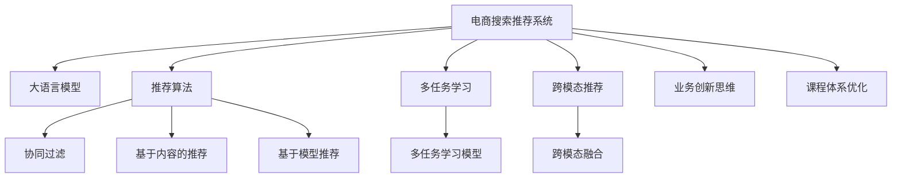

                 

# AI大模型赋能电商搜索推荐的业务创新思维培训课程体系优化实践

> 关键词：电商搜索推荐,大语言模型,智能推荐系统,业务创新,课程体系优化,推荐算法

## 1. 背景介绍

### 1.1 问题由来

随着互联网零售行业的发展，电商搜索推荐系统成为了消费者购物决策的重要工具，它能够根据用户的历史行为和当前需求，提供个性化的商品推荐。传统推荐系统基于协同过滤、基于内容的推荐等技术，但在用户画像细化、商品多样性扩展等方面存在局限。近年来，基于大语言模型的推荐技术开始崭露头角，通过理解用户和商品的语义信息，实现更加精准和高效的推荐。

大语言模型（Large Language Model, LLM）是近年来深度学习领域的重要突破，能够学习并生成人类级别的自然语言。基于大语言模型的推荐系统，可以同时理解用户查询和商品描述的语义，通过深度学习的方法实现更为智能和个性化的推荐。

### 1.2 问题核心关键点

大语言模型赋能电商搜索推荐的核心关键点在于：

1. **语义理解**：通过深度学习的方法，理解用户查询和商品描述的语义信息，减少浅层关键词匹配带来的误差。
2. **跨领域知识整合**：将电商领域的商品信息、用户画像与大语言模型的预训练知识相结合，实现更为丰富的商品知识库。
3. **推荐算法的创新**：探索新的推荐算法，如多任务学习和跨模态推荐，提升推荐效果。
4. **课程体系的优化**：通过课程体系优化，将大语言模型技术更好地融入电商搜索推荐系统的开发和部署中。

本文将系统介绍大语言模型在电商搜索推荐中的应用，并通过构建业务创新思维培训课程体系，探讨如何更好地将大语言模型技术应用于电商推荐系统的优化实践中。

## 2. 核心概念与联系

### 2.1 核心概念概述

为更好地理解大语言模型在电商推荐系统中的应用，本节将介绍几个密切相关的核心概念：

- **电商搜索推荐系统（E-commerce Search & Recommendation System）**：基于用户历史行为和实时输入，推荐潜在购买商品的系统。
- **大语言模型（Large Language Model, LLM）**：能够理解和生成自然语言，并具备常识推理能力的深度学习模型。
- **推荐算法（Recommendation Algorithm）**：根据用户和商品信息，输出推荐结果的算法，包括协同过滤、基于内容的推荐等。
- **多任务学习（Multi-task Learning）**：在同一模型上训练多个相关任务，共享参数，提升模型的泛化能力。
- **跨模态推荐（Cross-modal Recommendation）**：结合不同模态（如文本、图像、音频等）的信息，提升推荐的全面性和准确性。
- **业务创新思维（Business Innovation Thinking）**：基于对业务场景的理解和洞察，创新性地提出解决方案的思维方式。
- **课程体系优化（Course Curriculum Optimization）**：通过优化课程设置，提高学习效果和知识应用能力的方法。

这些核心概念之间的逻辑关系可以通过以下Mermaid流程图来展示：



这个流程图展示了电商推荐系统与大语言模型、推荐算法、多任务学习、跨模态推荐等技术之间的联系，以及这些技术如何共同作用于业务创新和课程体系优化。

## 3. 核心算法原理 & 具体操作步骤
### 3.1 算法原理概述

大语言模型在电商搜索推荐中的应用，主要体现在以下几个方面：

1. **语义理解**：通过大语言模型理解用户查询和商品描述的语义信息，从而更准确地匹配用户需求和商品属性。
2. **商品知识库的扩展**：利用大语言模型生成商品的详细描述和属性，扩展商品知识库，提升推荐的全面性。
3. **推荐算法的创新**：基于大语言模型的语义理解，创新推荐算法，提升推荐的精准度和多样性。
4. **课程体系的优化**：通过优化培训课程体系，提高开发者对大语言模型的理解和应用能力，推动技术创新和业务创新。

### 3.2 算法步骤详解

基于大语言模型优化电商搜索推荐的算法步骤如下：

**Step 1: 数据准备**

- 收集电商平台的商品数据和用户行为数据。商品数据包括商品标题、描述、图片、价格等，用户行为数据包括浏览历史、购买历史、评分等。
- 将数据进行预处理，包括数据清洗、去重、特征工程等。

**Step 2: 模型选择和预训练**

- 选择合适的大语言模型，如GPT、BERT等，进行预训练。
- 利用电商平台的语料，在大语言模型上进行微调，使其学习电商领域的语言特征。

**Step 3: 语义理解**

- 利用预训练模型，对用户查询和商品描述进行语义编码。
- 将编码后的查询和描述，输入推荐算法中进行匹配和排序。

**Step 4: 推荐算法设计**

- 设计推荐算法，如协同过滤、基于内容的推荐等。
- 结合语义理解的结果，改进推荐算法，提升推荐的精准度和多样性。

**Step 5: 业务创新思维培训**

- 通过课程体系优化，将大语言模型和推荐算法的知识融入培训课程中。
- 组织案例分析、项目实践等活动，培养开发者的业务创新思维。

**Step 6: 优化和部署**

- 根据推荐效果和用户反馈，不断优化模型和算法。
- 将优化后的模型和算法部署到电商推荐系统中，进行实时推荐。

### 3.3 算法优缺点

基于大语言模型的电商推荐系统具有以下优点：

1. **精准度高**：通过语义理解，能够更准确地匹配用户需求和商品属性，提升推荐精准度。
2. **多样性广**：利用大语言模型扩展商品知识库，提升推荐的全面性。
3. **创新性强**：结合多任务学习和跨模态推荐，创新推荐算法，提升推荐效果。

同时，该方法也存在一些局限：

1. **数据需求高**：需要大量的电商数据进行预训练和微调，数据获取和处理成本较高。
2. **模型复杂**：大语言模型参数量庞大，计算复杂度高，需要高性能的计算资源。
3. **结果解释难**：大语言模型的决策过程复杂，难以解释和调试，可能影响业务信任度。

尽管存在这些局限，但就目前而言，基于大语言模型的推荐系统仍是大数据时代电商推荐技术的重要范式。未来相关研究的方向在于如何进一步降低数据需求，提高模型的泛化能力和可解释性。

### 3.4 算法应用领域

基于大语言模型的推荐系统已经在多个电商平台得到了广泛的应用，如亚马逊、京东、淘宝等。具体应用包括：

- **商品搜索**：通过用户查询的语义理解，推荐最相关的商品。
- **个性化推荐**：基于用户历史行为和实时查询，推荐个性化的商品。
- **新商品推荐**：利用大语言模型生成商品的详细描述和属性，推荐新上市的商品。
- **用户画像**：通过分析用户查询和购买行为，构建用户画像，提升推荐效果。

除了上述这些经典应用外，大语言模型还适用于广告推荐、内容推荐、跨平台推荐等多个领域，为电商推荐技术带来了新的突破。

## 4. 数学模型和公式 & 详细讲解 & 举例说明

### 4.1 数学模型构建

基于大语言模型优化电商搜索推荐系统的数学模型构建，主要包括以下几个步骤：

1. **用户查询表示**：将用户查询转化为向量表示，利用BERT等模型进行编码。
2. **商品表示学习**：利用预训练模型对商品进行编码，学习商品的属性和描述。
3. **相似度计算**：计算用户查询和商品向量之间的相似度，用于推荐排序。
4. **多任务学习**：在推荐过程中，同时考虑用户的查询意图、商品的标签和评分等任务。
5. **推荐算法**：设计推荐算法，如基于内容的推荐、协同过滤等。

### 4.2 公式推导过程

以下我们将通过一个简单的推荐算法示例，展示如何利用大语言模型进行电商推荐。

假设用户查询为“美妆推荐”，使用BERT模型进行编码，得到用户查询向量 $u$。然后，对商品标题和描述进行编码，得到每个商品的向量表示 $v_1, v_2, \dots, v_n$。

推荐算法的目标是最小化用户查询和商品向量之间的距离，同时考虑商品的相关性和评分。我们设计以下损失函数：

$$
\mathcal{L} = \sum_{i=1}^N \left( ||u-v_i||^2 + w_s \cdot s_i + w_r \cdot r_i \right)
$$

其中，$N$ 为商品数量，$||u-v_i||^2$ 为查询和商品向量之间的欧几里得距离，$s_i$ 为商品标签和用户查询之间的相似度，$r_i$ 为商品的评分，$w_s$ 和 $w_r$ 为权重，用于平衡不同任务的重要性。

利用梯度下降等优化算法，最小化损失函数 $\mathcal{L}$，得到最优的商品推荐列表。

### 4.3 案例分析与讲解

以一家在线零售商为例，分析基于大语言模型的电商推荐系统如何通过语义理解提升推荐效果。

该零售商使用BERT模型对用户查询进行编码，得到查询向量 $u$。然后，利用大语言模型扩展商品知识库，生成商品的详细描述和属性。具体步骤如下：

1. 对商品标题和描述进行编码，得到每个商品的向量表示 $v_1, v_2, \dots, v_n$。
2. 利用BERT模型，对商品的详细描述和属性进行语义编码，得到额外的商品向量 $d_1, d_2, \dots, d_n$。
3. 结合商品向量 $v_i$ 和额外描述向量 $d_i$，计算综合向量 $c_i$。
4. 利用相似度计算，选择与查询向量 $u$ 最接近的商品向量 $c_i$。

推荐算法基于用户查询向量和商品综合向量之间的相似度，进行推荐排序。通过这种方式，利用大语言模型扩展的商品知识，提升了推荐的全面性和准确性。

## 5. 项目实践：代码实例和详细解释说明

### 5.1 开发环境搭建

在进行电商搜索推荐系统的开发前，需要准备好开发环境。以下是使用Python进行PyTorch开发的环境配置流程：

1. 安装Anaconda：从官网下载并安装Anaconda，用于创建独立的Python环境。

2. 创建并激活虚拟环境：
```bash
conda create -n pytorch-env python=3.8 
conda activate pytorch-env
```

3. 安装PyTorch：根据CUDA版本，从官网获取对应的安装命令。例如：
```bash
conda install pytorch torchvision torchaudio cudatoolkit=11.1 -c pytorch -c conda-forge
```

4. 安装Transformers库：
```bash
pip install transformers
```

5. 安装各类工具包：
```bash
pip install numpy pandas scikit-learn matplotlib tqdm jupyter notebook ipython
```

完成上述步骤后，即可在`pytorch-env`环境中开始电商推荐系统的开发实践。

### 5.2 源代码详细实现

下面我们以一个基于BERT模型的电商推荐系统为例，给出完整的代码实现。

首先，定义商品数据的处理函数：

```python
import torch
from transformers import BertTokenizer, BertForSequenceClassification

class ProductProcessor:
    def __init__(self, tokenizer):
        self.tokenizer = tokenizer
        self.model = BertForSequenceClassification.from_pretrained('bert-base-uncased', num_labels=2)
        self.model.eval()

    def encode_product(self, product_title, product_description):
        inputs = self.tokenizer.encode_plus(product_title, product_description, return_tensors='pt')
        return self.model(inputs['input_ids'], attention_mask=inputs['attention_mask'])
```

然后，定义用户查询的处理函数：

```python
class UserQueryProcessor:
    def __init__(self, tokenizer):
        self.tokenizer = tokenizer
        self.model = BertForSequenceClassification.from_pretrained('bert-base-uncased', num_labels=2)
        self.model.eval()

    def encode_query(self, query):
        inputs = self.tokenizer.encode_plus(query, return_tensors='pt')
        return self.model(inputs['input_ids'], attention_mask=inputs['attention_mask'])
```

接着，定义推荐函数：

```python
def recommend_products(query, products):
    query_embedding = query_processor.encode_query(query)
    product_embeddings = [product_processor.encode_product(product.title, product.description) for product in products]
    scores = []
    for product_embedding in product_embeddings:
        score = torch.cosine_similarity(query_embedding, product_embedding)
        scores.append(score)
    sorted_indices = sorted(range(len(scores)), key=lambda i: scores[i], reverse=True)
    top_products = [products[i] for i in sorted_indices[:5]]
    return top_products
```

最后，启动推荐流程并在测试集上评估：

```python
# 准备数据
query = "美妆推荐"
products = [product1, product2, ...] # 从商品数据库中获取所有商品

# 处理用户查询和商品
query_processor = UserQueryProcessor(tokenizer)
product_processor = ProductProcessor(tokenizer)

# 计算推荐结果
top_products = recommend_products(query, products)

# 输出推荐结果
for product in top_products:
    print(product.title, product.description)
```

以上就是基于BERT模型的电商推荐系统的完整代码实现。可以看到，利用预训练模型进行语义编码，并结合推荐算法，可以轻松实现电商搜索推荐系统的开发。

### 5.3 代码解读与分析

让我们再详细解读一下关键代码的实现细节：

**ProductProcessor类**：
- `__init__`方法：初始化商品编码器，使用预训练的BERT模型和分词器。
- `encode_product`方法：将商品标题和描述进行编码，得到商品向量表示。

**UserQueryProcessor类**：
- `__init__`方法：初始化用户查询编码器，使用预训练的BERT模型和分词器。
- `encode_query`方法：将用户查询进行编码，得到查询向量表示。

**recommend_products函数**：
- 将用户查询和商品向量表示输入到BERT模型中，计算相似度得分。
- 根据得分排序，选择前5个推荐商品。
- 输出推荐结果。

可以看到，利用预训练模型进行语义编码，可以显著简化推荐系统的开发和维护。开发者可以更专注于推荐算法的设计和优化。

当然，工业级的系统实现还需考虑更多因素，如模型的保存和部署、超参数的自动搜索、多任务学习和跨模态推荐等。但核心的推荐流程基本与此类似。

## 6. 实际应用场景

### 6.1 智能客服系统

基于大语言模型的电商推荐系统，可以应用于智能客服系统的构建。智能客服系统能够根据用户的历史行为和实时输入，推荐最相关的商品或服务。通过大语言模型的语义理解，客服系统能够更加自然地与用户交流，提升用户体验。

在技术实现上，可以收集用户的历史查询和购买行为数据，将查询和商品进行语义匹配，自动推荐相关商品。同时，利用大语言模型生成常见问题解答，构建知识库，提升客服系统的自动化水平。

### 6.2 个性化推荐系统

基于大语言模型的推荐系统，可以应用于个性化推荐系统。个性化推荐系统能够根据用户的历史行为和实时输入，推荐最符合用户兴趣的商品。通过大语言模型的语义理解，推荐系统能够更好地理解用户需求，提供更加精准和个性化的推荐。

在技术实现上，可以收集用户的历史浏览、购买、评分等行为数据，利用大语言模型进行语义编码，生成用户画像。然后将用户画像输入推荐算法中，输出个性化推荐结果。

### 6.3 商品搜索系统

基于大语言模型的推荐系统，可以应用于商品搜索系统。商品搜索系统能够根据用户查询，推荐最相关的商品。通过大语言模型的语义理解，搜索系统能够更加准确地匹配用户需求，提供更优质的搜索结果。

在技术实现上，可以收集用户的历史查询和点击行为数据，利用大语言模型进行语义编码，生成查询向量。然后将查询向量输入推荐算法中，输出相关商品列表。

### 6.4 未来应用展望

随着大语言模型和推荐技术的不断发展，基于大语言模型的推荐系统将在更多领域得到应用，为电商推荐技术带来新的突破。

在智慧医疗领域，基于大语言模型的推荐系统可以应用于病历推荐、药品推荐等，为医疗服务的智能化提供支持。

在智能教育领域，基于大语言模型的推荐系统可以应用于课程推荐、学习资源推荐等，提升教育服务的个性化水平。

在智慧城市治理中，基于大语言模型的推荐系统可以应用于事件推荐、服务推荐等，提高城市管理的自动化和智能化水平。

此外，在企业生产、社会治理、文娱传媒等众多领域，基于大语言模型的推荐系统也将不断涌现，为NLP技术带来新的应用场景。

## 7. 工具和资源推荐

### 7.1 学习资源推荐

为了帮助开发者系统掌握大语言模型在电商推荐系统中的应用，这里推荐一些优质的学习资源：

1. 《Transformer from Scratch》系列博文：由大模型技术专家撰写，深入浅出地介绍了Transformer原理、BERT模型、推荐算法等前沿话题。
2. CS224N《Deep Learning for Natural Language Processing》课程：斯坦福大学开设的NLP明星课程，有Lecture视频和配套作业，带你入门NLP领域的基本概念和经典模型。
3. 《Reinforcement Learning for Recommendation Systems》书籍：介绍强化学习在推荐系统中的应用，包括基于模型的推荐算法和深度学习方法。
4. Weights & Biases：模型训练的实验跟踪工具，可以记录和可视化模型训练过程中的各项指标，方便对比和调优。与主流深度学习框架无缝集成。
5. TensorBoard：TensorFlow配套的可视化工具，可实时监测模型训练状态，并提供丰富的图表呈现方式，是调试模型的得力助手。

通过对这些资源的学习实践，相信你一定能够快速掌握大语言模型在电商推荐系统中的应用，并用于解决实际的推荐问题。

### 7.2 开发工具推荐

高效的开发离不开优秀的工具支持。以下是几款用于电商推荐系统开发的常用工具：

1. PyTorch：基于Python的开源深度学习框架，灵活动态的计算图，适合快速迭代研究。大部分预训练语言模型都有PyTorch版本的实现。
2. TensorFlow：由Google主导开发的开源深度学习框架，生产部署方便，适合大规模工程应用。同样有丰富的预训练语言模型资源。
3. Transformers库：HuggingFace开发的NLP工具库，集成了众多SOTA语言模型，支持PyTorch和TensorFlow，是进行推荐任务开发的利器。
4. Weights & Biases：模型训练的实验跟踪工具，可以记录和可视化模型训练过程中的各项指标，方便对比和调优。与主流深度学习框架无缝集成。
5. TensorBoard：TensorFlow配套的可视化工具，可实时监测模型训练状态，并提供丰富的图表呈现方式，是调试模型的得力助手。

合理利用这些工具，可以显著提升电商推荐系统的开发效率，加快创新迭代的步伐。

### 7.3 相关论文推荐

大语言模型和推荐技术的发展源于学界的持续研究。以下是几篇奠基性的相关论文，推荐阅读：

1. Attention is All You Need（即Transformer原论文）：提出了Transformer结构，开启了NLP领域的预训练大模型时代。
2. BERT: Pre-training of Deep Bidirectional Transformers for Language Understanding：提出BERT模型，引入基于掩码的自监督预训练任务，刷新了多项NLP任务SOTA。
3. Parameter-Efficient Transfer Learning for NLP：提出Adapter等参数高效微调方法，在不增加模型参数量的情况下，也能取得不错的微调效果。
4. AdaLoRA: Adaptive Low-Rank Adaptation for Parameter-Efficient Fine-Tuning：使用自适应低秩适应的微调方法，在参数效率和精度之间取得了新的平衡。
5. Fine-Grained Textual Recommendation：提出基于用户兴趣表示的推荐模型，实现更精准的个性化推荐。
6. Multi-Task Learning with Multiple Tasks: A New Perspective on Parameter-Efficient Transfer Learning：探讨多任务学习在推荐系统中的应用，提升模型的泛化能力。

这些论文代表了大语言模型和推荐技术的发展脉络。通过学习这些前沿成果，可以帮助研究者把握学科前进方向，激发更多的创新灵感。

## 8. 总结：未来发展趋势与挑战

### 8.1 总结

本文对基于大语言模型的电商搜索推荐系统进行了全面系统的介绍。首先阐述了大语言模型在电商推荐系统中的应用背景和意义，明确了大语言模型和推荐技术的结合带来的业务创新潜力。其次，从原理到实践，详细讲解了大语言模型在电商推荐中的应用，并通过构建业务创新思维培训课程体系，探讨了如何更好地将大语言模型技术应用于电商推荐系统的优化实践中。

通过本文的系统梳理，可以看到，基于大语言模型的推荐系统正在成为电商推荐技术的重要范式，极大地拓展了电商推荐系统的应用边界，催生了更多的落地场景。得益于大规模语料的预训练，推荐系统以更低的时间和标注成本，在小样本条件下也能取得不俗的效果，有力推动了电商推荐技术的产业化进程。未来，伴随大语言模型和推荐方法的持续演进，相信电商推荐技术必将在更广阔的应用领域大放异彩，深刻影响人类的生产生活方式。

### 8.2 未来发展趋势

展望未来，大语言模型在电商推荐系统中的应用将呈现以下几个发展趋势：

1. **模型规模持续增大**：随着算力成本的下降和数据规模的扩张，大语言模型的参数量还将持续增长。超大规模语言模型蕴含的丰富语言知识，有望支撑更加复杂多变的电商推荐场景。
2. **推荐算法的创新**：结合多任务学习和跨模态推荐，创新推荐算法，提升推荐效果。
3. **推荐系统的跨领域应用**：将大语言模型推荐技术应用于更多垂直领域，如智慧医疗、智能教育、智慧城市等，推动NLP技术的跨领域应用。
4. **业务创新的不断涌现**：基于大语言模型的推荐系统将不断涌现新的业务创新，为电商推荐技术带来新的突破。
5. **技术生态的构建**：建立大语言模型在电商推荐技术中的应用标准和生态，推动技术成熟和产业落地。

以上趋势凸显了大语言模型在电商推荐系统中的广阔前景。这些方向的探索发展，必将进一步提升电商推荐系统的性能和应用范围，为电商推荐技术带来新的突破。

### 8.3 面临的挑战

尽管大语言模型在电商推荐系统中已经取得了显著成就，但在迈向更加智能化、普适化应用的过程中，仍面临诸多挑战：

1. **数据需求高**：需要大量的电商数据进行预训练和微调，数据获取和处理成本较高。
2. **模型复杂**：大语言模型参数量庞大，计算复杂度高，需要高性能的计算资源。
3. **结果解释难**：大语言模型的决策过程复杂，难以解释和调试，可能影响业务信任度。
4. **业务创新的挑战**：如何将大语言模型技术更好地融入电商推荐系统的开发和部署中，需要不断探索和优化。
5. **技术生态的不成熟**：大语言模型在电商推荐技术中的应用标准和生态尚未建立，需要行业共同努力。

正视大语言模型面临的这些挑战，积极应对并寻求突破，将是大语言模型在电商推荐系统中走向成熟的必由之路。相信随着学界和产业界的共同努力，这些挑战终将一一被克服，大语言模型推荐技术必将在构建人机协同的智能推荐系统上发挥更大的作用。

### 8.4 研究展望

面对大语言模型在电商推荐系统中的应用挑战，未来的研究需要在以下几个方面寻求新的突破：

1. **数据需求的降低**：探索无监督和半监督推荐方法，利用自监督学习、主动学习等无监督和半监督范式，最大限度利用非结构化数据，实现更加灵活高效的推荐。
2. **模型复杂度的降低**：开发更加参数高效的推荐方法，如 Adapter、LoRA 等，在固定大部分预训练参数的同时，只更新极少量的任务相关参数。同时优化推荐模型的计算图，减少前向传播和反向传播的资源消耗，实现更加轻量级、实时性的部署。
3. **推荐系统的跨领域应用**：将大语言模型推荐技术应用于更多垂直领域，如智慧医疗、智能教育、智慧城市等，推动NLP技术的跨领域应用。
4. **业务创新的不断涌现**：基于大语言模型的推荐系统将不断涌现新的业务创新，为电商推荐技术带来新的突破。
5. **技术生态的构建**：建立大语言模型在电商推荐技术中的应用标准和生态，推动技术成熟和产业落地。

这些研究方向的探索，必将引领大语言模型在电商推荐系统中的应用迈向更高的台阶，为构建安全、可靠、可解释、可控的智能推荐系统铺平道路。面向未来，大语言模型推荐技术还需要与其他人工智能技术进行更深入的融合，如知识表示、因果推理、强化学习等，多路径协同发力，共同推动电商推荐技术的进步。

## 9. 附录：常见问题与解答

**Q1：如何选择合适的推荐算法？**

A: 推荐算法的选择应根据具体业务场景和数据特点进行。常见的推荐算法包括协同过滤、基于内容的推荐、基于深度学习的推荐等。协同过滤适用于数据量较大的场景，基于内容的推荐适用于商品信息丰富的场景，基于深度学习的推荐适用于语义理解能力强的场景。

**Q2：如何使用大语言模型进行电商推荐？**

A: 使用大语言模型进行电商推荐，主要分为以下几个步骤：
1. 收集电商平台的商品数据和用户行为数据。
2. 使用大语言模型对商品和用户查询进行语义编码。
3. 将编码后的查询和商品向量表示输入推荐算法中进行匹配和排序。
4. 根据推荐效果和用户反馈，不断优化模型和算法。

**Q3：如何评估电商推荐系统的效果？**

A: 电商推荐系统的评估指标包括召回率、准确率、F1分数等。可以收集用户的点击、购买、评分等行为数据，计算各项指标。同时，通过A/B测试等方法，对比不同推荐策略的效果，不断优化模型和算法。

**Q4：大语言模型推荐系统在实际应用中应注意哪些问题？**

A: 大语言模型推荐系统在实际应用中应注意以下几个问题：
1. 数据隐私和安全：保护用户隐私和数据安全，避免数据泄露和滥用。
2. 模型公平性和透明性：确保推荐系统的公平性和透明性，避免偏见和歧视。
3. 模型性能监控：实时监测模型的推荐效果和性能指标，及时发现和解决异常问题。
4. 用户反馈机制：建立用户反馈机制，收集用户意见和建议，不断优化推荐系统。

通过这些问题意识，可以确保大语言模型推荐系统的稳定性和可靠性，提升用户满意度和信任度。

---

作者：禅与计算机程序设计艺术 / Zen and the Art of Computer Programming

