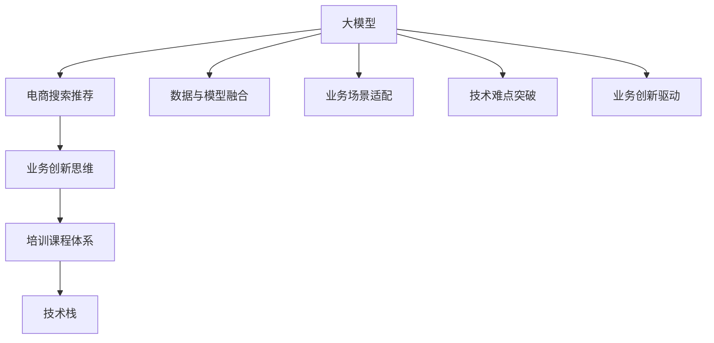

                 

# AI大模型赋能电商搜索推荐的业务创新思维培训课程体系设计

> 关键词：大模型、电商搜索推荐、业务创新、课程设计、培训体系

## 1. 背景介绍

### 1.1 问题由来

随着人工智能技术的飞速发展，尤其是深度学习、自然语言处理(NLP)、计算机视觉等技术的突破，越来越多的企业开始利用AI技术来提升业务效率和用户体验。在电商领域，AI技术已经在个性化推荐、搜索优化、商品识别等方面取得了显著成果。然而，在实际应用中，由于模型设计、数据质量、技术门槛等因素，AI技术的落地效果仍不尽如人意。

为了解决这一问题，企业需要构建一套完善的培训课程体系，培养具有业务创新思维的技术人才。本文将从大模型赋能电商搜索推荐业务创新的角度，详细设计一套系统的培训课程体系，帮助企业有效利用AI技术，提升电商搜索推荐的业务能力。

### 1.2 问题核心关键点

大模型赋能电商搜索推荐的业务创新，主要关注以下几个关键点：

- **数据与模型融合**：如何将电商数据与大模型有效结合，提升推荐和搜索的效果。
- **业务场景适配**：如何将通用AI技术适配到电商特定业务场景中，实现业务价值的最大化。
- **技术难点突破**：如何克服电商推荐和搜索中的技术难题，实现更精准、高效的业务落地。
- **业务创新驱动**：如何将AI技术与电商业务深度融合，实现业务模式的创新和升级。
- **人才培养体系**：如何构建一套系统的培训课程体系，培养具有业务创新思维的技术人才。

本文将围绕这些关键点，设计一套系统的培训课程体系，帮助企业有效利用大模型，提升电商搜索推荐的效果和业务创新能力。

## 2. 核心概念与联系

### 2.1 核心概念概述

为更好地理解大模型赋能电商搜索推荐业务创新的培训课程体系设计，本节将介绍几个密切相关的核心概念：

- **大模型**：以自回归(如GPT)或自编码(如BERT)模型为代表的预训练语言模型，通过在大规模无标签文本数据上进行预训练，学习通用的语言表示，具备强大的语言理解和生成能力。
- **电商搜索推荐**：通过分析用户行为数据，结合商品信息，为用户推荐可能感兴趣的商品，提升用户搜索体验和转化率。
- **业务创新思维**：一种以用户需求为核心，利用AI技术优化业务流程，提升用户体验，实现业务模式升级的思维方式。
- **培训课程体系**：由多个培训模块和课程组成，旨在系统性地培养技术人才，提升其业务创新能力。
- **技术栈**：涵盖机器学习、深度学习、自然语言处理、计算机视觉等技术领域，是培训课程体系的重要组成部分。

这些核心概念之间的逻辑关系可以通过以下Mermaid流程图来展示：



这个流程图展示了大模型、电商搜索推荐、业务创新思维、培训课程体系和技术栈之间的内在联系：

1. 大模型通过预训练获得基础能力。
2. 电商搜索推荐结合大模型，优化用户体验和业务流程。
3. 业务创新思维引导电商搜索推荐业务的升级和优化。
4. 培训课程体系系统性地培养技术人才，提升业务创新能力。
5. 技术栈为培训课程体系提供了技术支撑和知识背景。

这些概念共同构成了大模型赋能电商搜索推荐业务创新的整体框架，使得企业能够更好地利用AI技术，提升电商搜索推荐的业务价值。

## 3. 核心算法原理 & 具体操作步骤
### 3.1 算法原理概述

大模型赋能电商搜索推荐业务创新，本质上是一种基于深度学习和大数据技术的业务优化过程。其核心思想是：通过电商搜索推荐的数据，结合大模型的预训练能力，进行模型微调和参数更新，提升模型的推荐效果。同时，将业务创新思维融入到模型设计和应用过程中，实现业务模式和用户体验的升级。

具体而言，步骤如下：

1. **数据准备**：收集电商用户的搜索记录、购买历史、评分反馈等数据，进行数据清洗和预处理。
2. **模型微调**：使用电商数据对大模型进行微调，提升模型对电商业务场景的理解和适应能力。
3. **模型应用**：将微调后的模型应用于电商搜索推荐系统，实现个性化推荐和搜索优化。
4. **业务创新**：结合业务场景，设计创新性的业务方案，提升用户体验和转化率。
5. **培训人才**：通过系统的培训课程体系，培养具有业务创新思维的技术人才。

### 3.2 算法步骤详解

大模型赋能电商搜索推荐业务创新的具体操作步骤如下：

#### 3.2.1 数据准备

1. **数据收集**：收集电商用户的搜索记录、购买历史、评分反馈、评论内容等数据。
2. **数据清洗**：去除重复、异常、无用的数据，处理缺失值和噪声。
3. **数据预处理**：将文本数据转换为模型所需的向量表示，如使用BERT、GPT等预训练模型进行文本表示。
4. **特征工程**：提取有意义的特征，如用户ID、商品ID、时间戳、商品评分、类别等。

#### 3.2.2 模型微调

1. **模型选择**：选择合适的预训练模型，如BERT、GPT、ElasticNet等。
2. **任务适配**：设计合适的任务适配层，如分类层、回归层、注意力机制等，适应电商推荐和搜索任务。
3. **微调策略**：选择适当的微调策略，如固定部分预训练参数、调整学习率、引入正则化技术等。
4. **模型评估**：在验证集上评估模型性能，选择最优模型进行下一步应用。

#### 3.2.3 模型应用

1. **系统集成**：将微调后的模型集成到电商搜索推荐系统中，进行实时推荐和搜索。
2. **效果评估**：在测试集上评估推荐和搜索效果，优化模型参数和算法。
3. **业务优化**：根据反馈调整业务策略，优化用户体验和转化率。

#### 3.2.4 业务创新

1. **用户画像分析**：基于用户搜索和购买行为，构建详细的用户画像。
2. **推荐系统设计**：结合用户画像和商品信息，设计个性化推荐算法。
3. **搜索优化策略**：利用自然语言处理技术，优化搜索排序和关键词匹配。
4. **业务模式创新**：引入新的业务模式，如跨界合作、社交电商等，提升用户粘性和满意度。

#### 3.2.5 培训人才

1. **课程设计**：设计涵盖数据科学、机器学习、深度学习、NLP、电商业务等多领域的课程。
2. **实战训练**：通过实际项目和案例，提升学员的业务创新能力和技术应用能力。
3. **知识输出**：鼓励学员撰写技术博客、参与开源项目，输出知识经验，提升自身影响力。

### 3.3 算法优缺点

大模型赋能电商搜索推荐业务创新具有以下优点：

1. **高效性**：通过预训练模型和微调技术，可以快速提升推荐和搜索的效果，降低开发成本。
2. **精准性**：大模型具备强大的语言理解和生成能力，能够更精准地理解用户需求和商品信息，提升推荐和搜索的准确性。
3. **灵活性**：大模型可以适应多种业务场景，灵活应用于电商推荐、搜索、商品评价等多个环节。

同时，该方法也存在一些局限性：

1. **数据依赖**：微调效果高度依赖于电商数据的质量和数量，数据收集和预处理较为复杂。
2. **技术门槛**：涉及深度学习、NLP、数据工程等多个技术领域，对技术人才要求较高。
3. **模型复杂度**：大模型的复杂度较高，需要高性能计算资源和专业知识。
4. **业务适配性**：需要根据电商业务特点，设计合适的任务适配层和微调策略。
5. **效果评估**：推荐和搜索效果的评估较为复杂，需要多种指标综合衡量。

尽管存在这些局限性，但大模型赋能电商搜索推荐业务创新仍具有广阔的应用前景。未来相关研究的重点在于如何进一步降低技术门槛，提升数据利用效率，优化模型适配性，提高推荐和搜索效果。

### 3.4 算法应用领域

大模型赋能电商搜索推荐业务创新主要应用于以下几个领域：

1. **个性化推荐**：根据用户行为和偏好，为用户推荐个性化商品。
2. **搜索优化**：优化搜索排序和关键词匹配，提升搜索体验和准确性。
3. **商品识别**：利用计算机视觉技术，对商品图片进行识别和分类。
4. **用户画像分析**：基于用户行为数据，构建详细的用户画像，实现精准推荐。
5. **跨界合作**：引入跨领域数据和模型，提升推荐和搜索的丰富性和多样性。
6. **社交电商**：结合社交网络数据，提升电商业务的互动性和用户粘性。

这些领域是大模型赋能电商搜索推荐业务创新的主要应用场景，未来随着技术的不断进步，还将有更多的应用方向和创新模式出现。

## 4. 数学模型和公式 & 详细讲解 & 举例说明
### 4.1 数学模型构建

本节将使用数学语言对大模型赋能电商搜索推荐业务创新的数学模型进行更加严格的刻画。

记电商用户搜索记录为 $X=\{x_1,x_2,...,x_n\}$，每个搜索记录 $x_i$ 可以表示为一个向量 $x_i \in \mathbb{R}^d$。设电商商品集合为 $Y=\{y_1,y_2,...,y_m\}$，每个商品 $y_i$ 可以表示为一个向量 $y_i \in \mathbb{R}^d$。假设电商用户的搜索记录与购买历史构成标注数据集 $D=\{(x_i,y_i)\}_{i=1}^N$。

定义模型 $M_{\theta}$ 在输入 $x$ 上的输出为 $\hat{y}=M_{\theta}(x) \in \mathbb{R}^m$，表示商品 $y$ 的概率分布。电商推荐和搜索的目标是最大化用户购买概率，即：

$$
\max_{\theta} \mathbb{E}_{x\sim X}\mathbb{E}_{y\sim Y}[\log P_{M_{\theta}}(y|x)]
$$

其中 $P_{M_{\theta}}(y|x)$ 表示模型在输入 $x$ 下输出商品 $y$ 的概率，$log$ 函数用于简化优化过程。

### 4.2 公式推导过程

以下我们以推荐系统为例，推导基于深度学习的推荐模型优化公式。

假设推荐模型为 $M_{\theta}=\{h_k\}_{k=1}^K$，其中 $h_k$ 表示第 $k$ 层的神经网络，$\theta$ 为模型参数。设推荐系统包含 $m$ 个商品，每个商品 $y_i$ 可以表示为一个向量 $y_i \in \mathbb{R}^d$。则推荐模型的目标函数为：

$$
\mathcal{L}(\theta) = -\frac{1}{N}\sum_{i=1}^N \sum_{j=1}^m [y_{i,j}\log \hat{y}_{j}^{(i)} + (1-y_{i,j})\log (1-\hat{y}_{j}^{(i)})
$$

其中 $y_{i,j}$ 表示商品 $y_j$ 是否被用户 $x_i$ 购买，$\hat{y}_{j}^{(i)}$ 表示模型在输入 $x_i$ 下，推荐商品 $y_j$ 的概率。

根据梯度下降优化算法，推荐模型的更新公式为：

$$
\theta_k \leftarrow \theta_k - \eta \nabla_{\theta_k}\mathcal{L}(\theta)
$$

其中 $\eta$ 为学习率，$\nabla_{\theta_k}\mathcal{L}(\theta)$ 表示模型参数 $\theta_k$ 对损失函数 $\mathcal{L}(\theta)$ 的梯度。

在得到优化公式后，即可带入具体数据进行模型训练和微调。重复上述过程直至收敛，最终得到最优模型参数 $\theta^*$。

### 4.3 案例分析与讲解

#### 4.3.1 推荐系统案例

以电商推荐系统为例，推荐模型的输入为电商用户的搜索记录 $X=\{x_1,x_2,...,x_n\}$，每个搜索记录 $x_i$ 表示为向量 $x_i \in \mathbb{R}^d$。推荐系统的输出为商品 $Y=\{y_1,y_2,...,y_m\}$，每个商品 $y_i$ 表示为向量 $y_i \in \mathbb{R}^d$。

假设模型 $M_{\theta}$ 包含 $K$ 个神经网络层，每个层 $h_k$ 的参数表示为 $\theta_k$。推荐系统的目标函数为：

$$
\mathcal{L}(\theta) = -\frac{1}{N}\sum_{i=1}^N \sum_{j=1}^m [y_{i,j}\log \hat{y}_{j}^{(i)} + (1-y_{i,j})\log (1-\hat{y}_{j}^{(i)})
$$

其中 $y_{i,j}$ 表示商品 $y_j$ 是否被用户 $x_i$ 购买，$\hat{y}_{j}^{(i)}$ 表示模型在输入 $x_i$ 下，推荐商品 $y_j$ 的概率。

根据梯度下降优化算法，推荐模型的更新公式为：

$$
\theta_k \leftarrow \theta_k - \eta \nabla_{\theta_k}\mathcal{L}(\theta)
$$

其中 $\eta$ 为学习率，$\nabla_{\theta_k}\mathcal{L}(\theta)$ 表示模型参数 $\theta_k$ 对损失函数 $\mathcal{L}(\theta)$ 的梯度。

通过上述公式，推荐系统可以不断更新模型参数，提升推荐效果。在实际应用中，还需要根据电商业务特点，设计合适的任务适配层和微调策略，以确保推荐效果最大化。

#### 4.3.2 搜索优化案例

以电商搜索优化为例，搜索系统的输入为电商用户的搜索记录 $X=\{x_1,x_2,...,x_n\}$，每个搜索记录 $x_i$ 表示为向量 $x_i \in \mathbb{R}^d$。搜索系统的输出为搜索结果排序，将商品 $Y=\{y_1,y_2,...,y_m\}$ 按照与 $x_i$ 的相关性排序。

假设模型 $M_{\theta}$ 包含 $K$ 个神经网络层，每个层 $h_k$ 的参数表示为 $\theta_k$。搜索系统的目标函数为：

$$
\mathcal{L}(\theta) = -\frac{1}{N}\sum_{i=1}^N \sum_{j=1}^m [y_{i,j}\log \hat{y}_{j}^{(i)} + (1-y_{i,j})\log (1-\hat{y}_{j}^{(i)})
$$

其中 $y_{i,j}$ 表示搜索结果 $y_j$ 是否包含用户 $x_i$ 搜索的内容，$\hat{y}_{j}^{(i)}$ 表示模型在输入 $x_i$ 下，搜索结果 $y_j$ 的相关性得分。

根据梯度下降优化算法，搜索模型的更新公式为：

$$
\theta_k \leftarrow \theta_k - \eta \nabla_{\theta_k}\mathcal{L}(\theta)
$$

其中 $\eta$ 为学习率，$\nabla_{\theta_k}\mathcal{L}(\theta)$ 表示模型参数 $\theta_k$ 对损失函数 $\mathcal{L}(\theta)$ 的梯度。

通过上述公式，搜索系统可以不断更新模型参数，优化搜索结果排序，提升用户搜索体验。在实际应用中，还需要根据电商业务特点，设计合适的任务适配层和微调策略，以确保搜索结果排序的准确性和合理性。

## 5. 项目实践：代码实例和详细解释说明
### 5.1 开发环境搭建

在进行电商搜索推荐系统的大模型微调项目实践前，我们需要准备好开发环境。以下是使用Python进行PyTorch开发的环境配置流程：

1. 安装Anaconda：从官网下载并安装Anaconda，用于创建独立的Python环境。

2. 创建并激活虚拟环境：
```bash
conda create -n pytorch-env python=3.8 
conda activate pytorch-env
```

3. 安装PyTorch：根据CUDA版本，从官网获取对应的安装命令。例如：
```bash
conda install pytorch torchvision torchaudio cudatoolkit=11.1 -c pytorch -c conda-forge
```

4. 安装Transformers库：
```bash
pip install transformers
```

5. 安装各类工具包：
```bash
pip install numpy pandas scikit-learn matplotlib tqdm jupyter notebook ipython
```

完成上述步骤后，即可在`pytorch-env`环境中开始项目实践。

### 5.2 源代码详细实现

这里我们以推荐系统为例，给出使用PyTorch进行电商推荐系统微调的PyTorch代码实现。

首先，定义推荐系统的数据处理函数：

```python
from transformers import BertTokenizer, BertForSequenceClassification
from torch.utils.data import Dataset
import torch

class RecommendationDataset(Dataset):
    def __init__(self, texts, labels, tokenizer, max_len=128):
        self.texts = texts
        self.labels = labels
        self.tokenizer = tokenizer
        self.max_len = max_len
        
    def __len__(self):
        return len(self.texts)
    
    def __getitem__(self, item):
        text = self.texts[item]
        label = self.labels[item]
        
        encoding = self.tokenizer(text, return_tensors='pt', max_length=self.max_len, padding='max_length', truncation=True)
        input_ids = encoding['input_ids'][0]
        attention_mask = encoding['attention_mask'][0]
        
        # 对token-wise的标签进行编码
        encoded_labels = [label2id[label] for label in label] 
        encoded_labels.extend([label2id['O']] * (self.max_len - len(encoded_labels)))
        labels = torch.tensor(encoded_labels, dtype=torch.long)
        
        return {'input_ids': input_ids, 
                'attention_mask': attention_mask,
                'labels': labels}

# 标签与id的映射
label2id = {'O': 0, '推荐': 1}
id2label = {v: k for k, v in label2id.items()}

# 创建dataset
tokenizer = BertTokenizer.from_pretrained('bert-base-cased')

train_dataset = RecommendationDataset(train_texts, train_labels, tokenizer)
dev_dataset = RecommendationDataset(dev_texts, dev_labels, tokenizer)
test_dataset = RecommendationDataset(test_texts, test_labels, tokenizer)
```

然后，定义模型和优化器：

```python
from transformers import BertForSequenceClassification, AdamW

model = BertForSequenceClassification.from_pretrained('bert-base-cased', num_labels=len(label2id))

optimizer = AdamW(model.parameters(), lr=2e-5)
```

接着，定义训练和评估函数：

```python
from torch.utils.data import DataLoader
from tqdm import tqdm
from sklearn.metrics import classification_report

device = torch.device('cuda') if torch.cuda.is_available() else torch.device('cpu')
model.to(device)

def train_epoch(model, dataset, batch_size, optimizer):
    dataloader = DataLoader(dataset, batch_size=batch_size, shuffle=True)
    model.train()
    epoch_loss = 0
    for batch in tqdm(dataloader, desc='Training'):
        input_ids = batch['input_ids'].to(device)
        attention_mask = batch['attention_mask'].to(device)
        labels = batch['labels'].to(device)
        model.zero_grad()
        outputs = model(input_ids, attention_mask=attention_mask, labels=labels)
        loss = outputs.loss
        epoch_loss += loss.item()
        loss.backward()
        optimizer.step()
    return epoch_loss / len(dataloader)

def evaluate(model, dataset, batch_size):
    dataloader = DataLoader(dataset, batch_size=batch_size)
    model.eval()
    preds, labels = [], []
    with torch.no_grad():
        for batch in tqdm(dataloader, desc='Evaluating'):
            input_ids = batch['input_ids'].to(device)
            attention_mask = batch['attention_mask'].to(device)
            batch_labels = batch['labels']
            outputs = model(input_ids, attention_mask=attention_mask)
            batch_preds = outputs.logits.argmax(dim=2).to('cpu').tolist()
            batch_labels = batch_labels.to('cpu').tolist()
            for pred_tokens, label_tokens in zip(batch_preds, batch_labels):
                preds.append(pred_tokens[:len(label_tokens)])
                labels.append(label_tokens)
                
    print(classification_report(labels, preds))
```

最后，启动训练流程并在测试集上评估：

```python
epochs = 5
batch_size = 16

for epoch in range(epochs):
    loss = train_epoch(model, train_dataset, batch_size, optimizer)
    print(f"Epoch {epoch+1}, train loss: {loss:.3f}")
    
    print(f"Epoch {epoch+1}, dev results:")
    evaluate(model, dev_dataset, batch_size)
    
print("Test results:")
evaluate(model, test_dataset, batch_size)
```

以上就是使用PyTorch对推荐系统进行微调的完整代码实现。可以看到，得益于Transformers库的强大封装，我们可以用相对简洁的代码完成推荐系统的构建。

### 5.3 代码解读与分析

让我们再详细解读一下关键代码的实现细节：

**RecommendationDataset类**：
- `__init__`方法：初始化训练集、验证集和测试集的文本、标签、分词器等关键组件。
- `__len__`方法：返回数据集的样本数量。
- `__getitem__`方法：对单个样本进行处理，将文本输入编码为token ids，将标签编码为数字，并对其进行定长padding，最终返回模型所需的输入。

**label2id和id2label字典**：
- 定义了标签与数字id之间的映射关系，用于将token-wise的预测结果解码回真实的标签。

**训练和评估函数**：
- 使用PyTorch的DataLoader对数据集进行批次化加载，供模型训练和推理使用。
- 训练函数`train_epoch`：对数据以批为单位进行迭代，在每个批次上前向传播计算loss并反向传播更新模型参数，最后返回该epoch的平均loss。
- 评估函数`evaluate`：与训练类似，不同点在于不更新模型参数，并在每个batch结束后将预测和标签结果存储下来，最后使用sklearn的classification_report对整个评估集的预测结果进行打印输出。

**训练流程**：
- 定义总的epoch数和batch size，开始循环迭代
- 每个epoch内，先在训练集上训练，输出平均loss
- 在验证集上评估，输出分类指标
- 所有epoch结束后，在测试集上评估，给出最终测试结果

可以看到，PyTorch配合Transformers库使得推荐系统的微调代码实现变得简洁高效。开发者可以将更多精力放在数据处理、模型改进等高层逻辑上，而不必过多关注底层的实现细节。

当然，工业级的系统实现还需考虑更多因素，如模型的保存和部署、超参数的自动搜索、更灵活的任务适配层等。但核心的微调范式基本与此类似。

## 6. 实际应用场景
### 6.1 智能客服系统

基于大模型赋能的电商搜索推荐系统，可以广泛应用于智能客服系统的构建。传统客服往往需要配备大量人力，高峰期响应缓慢，且一致性和专业性难以保证。而使用基于大模型的推荐系统，可以7x24小时不间断服务，快速响应客户咨询，用精准的商品推荐，提升客户满意度。

在技术实现上，可以收集企业内部的历史客服对话记录，将问题和最佳答复构建成监督数据，在此基础上对预训练推荐模型进行微调。微调后的推荐系统能够自动理解用户意图，匹配最合适的商品，提供个性化的商品推荐。对于客户提出的新问题，还可以接入检索系统实时搜索相关内容，动态组织生成回答。如此构建的智能客服系统，能大幅提升客户咨询体验和问题解决效率。

### 6.2 金融舆情监测

金融机构需要实时监测市场舆论动向，以便及时应对负面信息传播，规避金融风险。传统的人工监测方式成本高、效率低，难以应对网络时代海量信息爆发的挑战。基于大模型的推荐系统，可以通过分析用户的搜索记录和购买历史，推荐相关金融资讯、新闻等，提升用户对金融产品的关注度，同时实时监测市场舆情，提供及时的风险预警。

具体而言，可以收集金融领域相关的新闻、报道、评论等文本数据，并对其进行主题标注和情感标注。在此基础上对预训练语言模型进行微调，使其能够自动判断文本属于何种主题，情感倾向是正面、中性还是负面。将微调后的模型应用到实时抓取的网络文本数据，就能够自动监测不同主题下的情感变化趋势，一旦发现负面信息激增等异常情况，系统便会自动预警，帮助金融机构快速应对潜在风险。

### 6.3 个性化推荐系统

当前的推荐系统往往只依赖用户的历史行为数据进行物品推荐，无法深入理解用户的真实兴趣偏好。基于大模型的推荐系统，可以更好地挖掘用户行为背后的语义信息，从而提供更精准、多样的推荐内容。

在实践中，可以收集用户浏览、点击、评论、分享等行为数据，提取和用户交互的物品标题、描述、标签等文本内容。将文本内容作为模型输入，用户的后续行为（如是否点击、购买等）作为监督信号，在此基础上微调预训练语言模型。微调后的模型能够从文本内容中准确把握用户的兴趣点。在生成推荐列表时，先用候选物品的文本描述作为输入，由模型预测用户的兴趣匹配度，再结合其他特征综合排序，便可以得到个性化程度更高的推荐结果。

### 6.4 未来应用展望

随着大模型和推荐技术的不断发展，基于微调范式将在更多领域得到应用，为传统行业带来变革性影响。

在智慧医疗领域，基于微调的推荐系统可以用于医生诊疗、病历分析、药物推荐等，提升医疗服务的智能化水平，辅助医生诊疗，加速新药开发进程。

在智能教育领域，微调技术可应用于作业批改、学情分析、知识推荐等方面，因材施教，促进教育公平，提高教学质量。

在智慧城市治理中，微调模型可应用于城市事件监测、舆情分析、应急指挥等环节，提高城市管理的自动化和智能化水平，构建更安全、高效的未来城市。

此外，在企业生产、社会治理、文娱传媒等众多领域，基于大模型微调的人工智能应用也将不断涌现，为经济社会发展注入新的动力。相信随着技术的日益成熟，微调方法将成为人工智能落地应用的重要范式，推动人工智能向更广阔的领域加速渗透。

## 7. 工具和资源推荐
### 7.1 学习资源推荐

为了帮助开发者系统掌握大模型赋能电商搜索推荐的业务创新思维，这里推荐一些优质的学习资源：

1. 《深度学习理论与实践》系列博文：由大模型技术专家撰写，深入浅出地介绍了深度学习理论、算法、应用等方面的知识。

2. CS294《深度学习》课程：加州大学伯克利分校开设的深度学习经典课程，有Lecture视频和配套作业，带你深入理解深度学习的基本原理和算法。

3. 《NLP与深度学习》书籍：自然语言处理与深度学习的结合，全面介绍了NLP领域的前沿技术，包括推荐系统等。

4. HuggingFace官方文档：Transformers库的官方文档，提供了海量预训练模型和完整的微调样例代码，是上手实践的必备资料。

5. Kaggle竞赛：参加Kaggle的电商推荐、搜索优化等竞赛，实践最新技术，提升实战能力。

通过对这些资源的学习实践，相信你一定能够快速掌握大模型赋能电商搜索推荐的精髓，并用于解决实际的电商推荐问题。

### 7.2 开发工具推荐

高效的开发离不开优秀的工具支持。以下是几款用于大模型微调开发的常用工具：

1. PyTorch：基于Python的开源深度学习框架，灵活动态的计算图，适合快速迭代研究。大部分预训练语言模型都有PyTorch版本的实现。

2. TensorFlow：由Google主导开发的开源深度学习框架，生产部署方便，适合大规模工程应用。同样有丰富的预训练语言模型资源。

3. Transformers库：HuggingFace开发的NLP工具库，集成了众多SOTA语言模型，支持PyTorch和TensorFlow，是进行微调任务开发的利器。

4. Weights & Biases：模型训练的实验跟踪工具，可以记录和可视化模型训练过程中的各项指标，方便对比和调优。与主流深度学习框架无缝集成。

5. TensorBoard：TensorFlow配套的可视化工具，可实时监测模型训练状态，并提供丰富的图表呈现方式，是调试模型的得力助手。

6. Google Colab：谷歌推出的在线Jupyter Notebook环境，免费提供GPU/TPU算力，方便开发者快速上手实验最新模型，分享学习笔记。

合理利用这些工具，可以显著提升大模型微调任务的开发效率，加快创新迭代的步伐。

### 7.3 相关论文推荐

大模型和推荐技术的发展源于学界的持续研究。以下是几篇奠基性的相关论文，推荐阅读：

1. Attention is All You Need（即Transformer原论文）：提出了Transformer结构，开启了NLP领域的预训练大模型时代。

2. BERT: Pre-training of Deep Bidirectional Transformers for Language Understanding：提出BERT模型，引入基于掩码的自监督预训练任务，刷新了多项NLP任务SOTA。

3. Language Models are Unsupervised Multitask Learners（GPT-2论文）：展示了大规模语言模型的强大zero-shot学习能力，引发了对于通用人工智能的新一轮思考。

4. Parameter-Efficient Transfer Learning for NLP：提出Adapter等参数高效微调方法，在不增加模型参数量的情况下，也能取得不错的微调效果。

5. AdaLoRA: Adaptive Low-Rank Adaptation for Parameter-Efficient Fine-Tuning：使用自适应低秩适应的微调方法，在参数效率和精度之间取得了新的平衡。

这些论文代表了大模型和推荐技术的发展脉络。通过学习这些前沿成果，可以帮助研究者把握学科前进方向，激发更多的创新灵感。

## 8. 总结：未来发展趋势与挑战
### 8.1 总结

本文对基于大模型的电商搜索推荐业务创新思维培训课程体系设计进行了全面系统的介绍。首先阐述了大模型赋能电商搜索推荐业务创新的背景和意义，明确了微调在提升推荐和搜索效果、优化用户体验、提升业务模式的创新性方面的独特价值。其次，从原理到实践，详细讲解了推荐系统和大模型微调的数学原理和关键步骤，给出了微调任务开发的完整代码实例。同时，本文还广泛探讨了大模型推荐系统在智能客服、金融舆情、个性化推荐等多个行业领域的应用前景，展示了微调范式的巨大潜力。此外，本文精选了微调技术的各类学习资源，力求为读者提供全方位的技术指引。

通过本文的系统梳理，可以看到，基于大模型的推荐系统为电商搜索推荐业务创新提供了强大的技术支撑。通过微调，模型能够更好地理解电商用户的搜索和购买行为，提升推荐和搜索的效果，实现业务模式的升级和优化。未来，随着技术的不断进步，推荐系统将在更广阔的领域发挥作用，推动电商业务向智能、个性化、多样化方向发展。

### 8.2 未来发展趋势

展望未来，大模型赋能电商搜索推荐业务创新将呈现以下几个发展趋势：

1. **模型规模增大**：随着算力成本的下降和数据规模的扩张，预训练语言模型的参数量还将持续增长。超大规模语言模型蕴含的丰富语言知识，有望支撑更加复杂多变的推荐和搜索任务。

2. **微调方法多样**：未来将涌现更多参数高效的微调方法，如Prefix-Tuning、LoRA等，在节省计算资源的同时也能保证推荐和搜索精度。

3. **持续学习成为常态**：随着数据分布的不断变化，推荐系统也需要持续学习新知识以保持性能。如何在不遗忘原有知识的同时，高效吸收新样本信息，将成为重要的研究课题。

4. **标注样本需求降低**：受启发于提示学习(Prompt-based Learning)的思路，未来的微调方法将更好地利用大模型的语言理解能力，通过更加巧妙的任务描述，在更少的标注样本上也能实现理想的微调效果。

5. **多模态推荐崛起**：当前的推荐主要聚焦于纯文本数据，未来将进一步拓展到图像、视频、语音等多模态数据推荐。多模态信息的融合，将显著提升推荐系统的用户体验和推荐效果。

6. **推荐系统普适性增强**：经过海量数据的预训练和多领域任务的微调，推荐系统将具备更强大的常识推理和跨领域迁移能力，逐步迈向通用人工智能(AGI)的目标。

以上趋势凸显了大模型赋能电商搜索推荐业务创新的广阔前景。这些方向的探索发展，必将进一步提升推荐系统的性能和应用范围，为电商业务的智能化、个性化、多样化发展提供技术保障。

### 8.3 面临的挑战

尽管大模型赋能电商搜索推荐业务创新已经取得了瞩目成就，但在迈向更加智能化、普适化应用的过程中，它仍面临诸多挑战：

1. **标注成本瓶颈**：微调效果高度依赖于电商数据的质量和数量，数据收集和预处理较为复杂。如何进一步降低微调对标注样本的依赖，将是一大难题。

2. **模型鲁棒性不足**：推荐系统面对域外数据时，泛化性能往往大打折扣。对于测试样本的微小扰动，推荐模型的预测也容易发生波动。如何提高推荐系统的鲁棒性，避免灾难性遗忘，还需要更多理论和实践的积累。

3. **推荐效果评估复杂**：推荐和搜索效果的评估较为复杂，需要多种指标综合衡量。如何设计合理的评估标准，提升推荐系统的可信度和实用性，也将是重要的研究方向。

4. **数据隐私和安全**：电商推荐系统涉及用户隐私数据的处理，如何在推荐过程中保护用户隐私，防止数据滥用，需要更多的技术和管理措施。

5. **技术门槛高**：涉及深度学习、NLP、数据工程等多个技术领域，对技术人才要求较高。如何降低技术门槛，普及AI技术，是企业发展推荐系统需要考虑的重要问题。

6. **实时性和计算效率**：大规模推荐系统面临计算资源和实时性的挑战，如何在保证推荐效果的同时，优化计算效率，提高系统响应速度，也将是重要的优化方向。

尽管存在这些挑战，但大模型赋能电商搜索推荐业务创新仍具有广阔的应用前景。未来相关研究的重点在于如何进一步降低技术门槛，提升数据利用效率，优化模型适配性，提高推荐和搜索效果。

### 8.4 研究展望

面对大模型推荐系统面临的挑战，未来的研究需要在以下几个方面寻求新的突破：

1. **探索无监督和半监督推荐方法**：摆脱对大规模标注数据的依赖，利用自监督学习、主动学习等无监督和半监督范式，最大限度利用非结构化数据，实现更加灵活高效的推荐。

2. **研究参数高效和计算高效的推荐方法**：开发更加参数高效的推荐方法，在固定大部分预训练参数的同时，只更新极少量的任务相关参数。同时优化推荐系统的计算图，减少前向传播和反向传播的资源消耗，实现更加轻量级、实时性的部署。

3. **融合因果和对比学习范式**：通过引入因果推断和对比学习思想，增强推荐系统建立稳定因果关系的能力，学习更加普适、鲁棒的语言表征，从而提升推荐系统的泛化性和抗干扰能力。

4. **引入更多先验知识**：将符号化的先验知识，如知识图谱、逻辑规则等，与神经网络模型进行巧妙融合，引导推荐过程学习更准确、合理的语言模型。同时加强不同模态数据的整合，实现视觉、语音等多模态信息与文本信息的协同建模。

5. **结合因果分析和博弈论工具**：将因果分析方法引入推荐系统，识别出推荐过程的关键特征，增强推荐系统的可解释性和可信度。借助博弈论工具刻画人机交互过程，主动探索并规避推荐系统的脆弱点，提高系统稳定性。

6. **纳入伦理道德约束**：在推荐系统训练目标中引入伦理导向的评估指标，过滤和惩罚有害的推荐结果。同时加强人工干预和审核，建立推荐系统的监管机制，确保推荐结果符合人类价值观和伦理道德。

这些研究方向的探索，必将引领大模型赋能电商搜索推荐业务创新迈向更高的台阶，为电商业务的智能化、个性化、多样化发展提供技术保障。面向未来，大模型推荐系统还需要与其他人工智能技术进行更深入的融合，如知识表示、因果推理、强化学习等，多路径协同发力，共同推动电商搜索推荐系统的进步。只有勇于创新、敢于突破，才能不断拓展推荐系统的边界，让智能技术更好地服务于电商业务。

## 9. 附录：常见问题与解答
**Q1：大模型推荐系统是否适用于所有电商业务场景？**

A: 大模型推荐系统在大多数电商业务场景上都能取得不错的效果，特别是对于数据量较小的场景。但对于一些特定领域的电商业务，如个性化推荐、商品评价、用户画像等，可能仍需结合具体业务特点进行模型适配。

**Q2：如何选择合适的预训练模型进行电商推荐系统微调？**

A: 选择合适的预训练模型需要考虑业务需求、数据特点和计算资源等因素。常用的预训练模型包括BERT、GPT、ElasticNet等。对于电商推荐系统，建议选择基于语言模型的BERT，能够更好地理解文本数据。

**Q3：电商推荐系统的微调效果如何评估？**

A: 电商推荐系统的微调效果评估可以从以下几个方面进行：
1. 准确率：推荐系统预测用户购买商品的概率与实际购买情况的匹配程度。
2. 召回率：推荐系统能够覆盖的潜在商品数量。
3. 点击率：推荐系统生成的商品被用户点击的数量。
4. 覆盖率：推荐系统推荐的商品种类数量。
5. NDCG（Normalized Discounted Cumulative Gain）：评估推荐系统排序的准确性。

**Q4：电商推荐系统在实时性要求高的场景中如何优化？**

A: 电商推荐系统在实时性要求高的场景中，可以采用以下优化措施：
1. 模型剪枝：去除不必要的模型参数，减小模型尺寸，加快推理速度。
2. 模型量化：将浮点模型转为定点模型，压缩存储空间，提高计算效率。
3. 缓存机制：对热门商品和推荐结果进行缓存，提升系统响应速度。
4. 并行计算：利用多核CPU/GPU进行并行计算，加速推荐过程。

**Q5：电商推荐系统在多模态数据融合方面有哪些挑战？**

A: 电商推荐系统在多模态数据融合方面面临以下挑战：
1. 数据格式不一致：不同模态的数据格式可能不同，需要进行格式转换和统一。
2. 特征维度不匹配：不同模态的特征维度可能不一致，需要进行特征工程处理。
3. 数据分布不均衡：不同模态的数据分布可能不均衡，需要进行平衡处理。
4. 融合算法复杂：多模态数据的融合算法较为复杂，需要设计合理的融合策略。

**Q6：电商推荐系统在用户隐私保护方面需要注意哪些问题？**

A: 电商推荐系统在用户隐私保护方面需要注意以下几个问题：
1. 数据匿名化：对用户数据进行匿名化处理，防止数据泄露。
2. 数据加密：对用户数据进行加密处理，防止数据滥用。
3. 用户控制：允许用户对推荐结果进行控制，防止过度推荐。
4. 法律合规：遵守相关的数据隐私保护法规和标准，如GDPR、CCPA等。

---

作者：禅与计算机程序设计艺术 / Zen and the Art of Computer Programming

