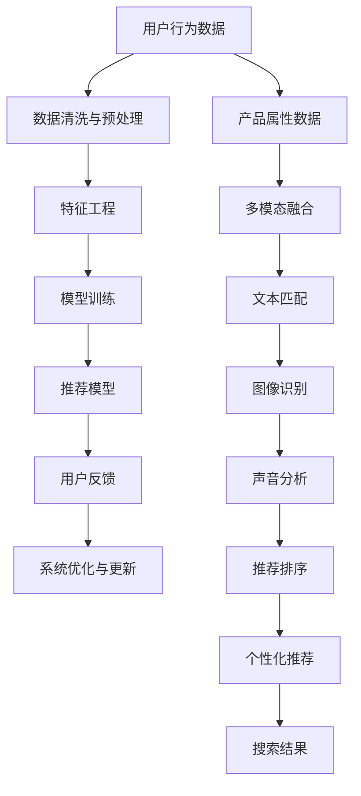

                 

# AI大模型重构电商搜索推荐系统的关键技术

> 关键词：大模型，电商搜索推荐系统，推荐算法，多模态融合，模型压缩，AI伦理

## 1. 背景介绍

随着人工智能(AI)技术的迅猛发展，越来越多的电商企业开始利用AI大模型重构搜索和推荐系统，以提升用户体验和平台效率。AI大模型融合了深度学习和数据科学的最佳实践，能够从海量数据中提取复杂的模式和规律，实现更精确的个性化推荐，满足用户的多样化需求。

本文章将全面介绍AI大模型在电商搜索推荐系统中的应用，以及如何利用大模型优化推荐算法，实现个性化推荐，优化搜索效果，同时探讨在大模型应用过程中可能面临的挑战和解决方案。

## 2. 核心概念与联系

### 2.1 核心概念概述

在进行深入探讨之前，首先明确几个核心概念及其相互关系：

- **大模型（Large Model）**：指使用深度神经网络模型（如Transformer），具有大规模参数量和复杂度的模型。大模型能够从大规模无标签数据中学习到丰富的特征表示，适用于各种复杂任务，包括自然语言处理、计算机视觉等。

- **电商搜索推荐系统**：指在电商平台上利用AI技术，帮助用户搜索、推荐产品和商品的系统。系统通过分析用户行为数据和产品特征，提供个性化的搜索结果和推荐，提高用户满意度和转化率。

- **推荐算法（Recommendation Algorithms）**：指通过分析用户的历史行为数据和产品属性，预测用户可能感兴趣的产品或商品，从而进行个性化推荐的技术手段。推荐算法可以基于协同过滤、内容过滤、混合推荐等方法。

- **多模态融合（Multi-modal Fusion）**：指将不同类型的数据（如图像、文本、语音）整合到一个系统中，提升系统的综合性能。多模态融合可以应用于电商搜索推荐系统的不同阶段，如搜索、排序、推荐等。

- **模型压缩（Model Compression）**：指在保持模型性能的前提下，减少模型大小和计算量的技术。模型压缩可以应用于电商搜索推荐系统，以降低系统成本和提升用户体验。

- **AI伦理（AI Ethics）**：指在使用AI技术时，需考虑技术对社会、伦理、法律等方面的影响。电商搜索推荐系统需保证推荐结果的公正性、透明性和可解释性，避免对用户产生负面影响。

这些核心概念通过数据处理、模型训练和应用部署等环节相联系，构成了一个完整的电商搜索推荐系统。

### 2.2 核心概念原理和架构的 Mermaid 流程图



这个流程图展示了电商搜索推荐系统从数据采集、处理到推荐排序的全流程。

## 3. 核心算法原理 & 具体操作步骤

### 3.1 算法原理概述

基于大模型的电商搜索推荐系统，主要依赖以下几个算法原理：

- **深度神经网络**：使用大型的深度神经网络（如Transformer）来建模用户行为和产品属性之间的关系，通过学习用户的历史行为数据和产品特征，预测用户可能感兴趣的产品。

- **协同过滤**：通过分析用户的行为数据，发现用户之间的相似性，推荐与相似用户喜欢的商品。协同过滤算法包括基于用户的协同过滤和基于项目的协同过滤。

- **内容过滤**：根据产品的内容信息（如描述、图片、视频等），推荐与用户兴趣相关的产品。内容过滤算法包括基于内容的协同过滤和基于关键词的推荐。

- **混合推荐**：结合协同过滤和内容过滤的优点，通过加权组合或融合不同算法的结果，提供更精确的推荐。

### 3.2 算法步骤详解

构建基于大模型的电商搜索推荐系统的具体步骤包括：

1. **数据采集与预处理**：
   - 收集用户行为数据，包括浏览历史、购买记录、评分反馈等。
   - 对数据进行清洗和预处理，去除噪声和异常值。

2. **特征工程**：
   - 设计特征工程流程，提取用户行为特征和产品属性特征。
   - 应用降维、归一化等技术，提升特征表示的质量。

3. **模型训练**：
   - 使用大模型进行训练，学习用户行为和产品属性之间的关系。
   - 调整模型参数，进行超参数调优。

4. **推荐模型**：
   - 将训练好的模型应用于推荐算法，进行个性化推荐。
   - 采用协同过滤、内容过滤或混合推荐算法，实现推荐。

5. **多模态融合**：
   - 将图像、文本、声音等多模态数据进行融合，提升推荐效果。
   - 应用多模态深度学习模型，如视觉Transformer(ViT)、多模态BERT等。

6. **模型评估与优化**：
   - 使用AUC、RMSE等指标评估推荐模型的性能。
   - 根据反馈数据，进行模型优化与更新。

### 3.3 算法优缺点

#### 优点：

- **高效性**：大模型可以处理大规模数据，高效地学习和理解用户行为和产品属性，提升推荐效果。
- **鲁棒性**：大模型具有较强的泛化能力，能够适应多种数据分布，提高系统的鲁棒性。
- **灵活性**：大模型可以灵活地与其他推荐算法结合，提升系统的综合性能。

#### 缺点：

- **资源消耗高**：大模型参数量庞大，计算资源消耗高，对硬件要求高。
- **可解释性差**：大模型通常被认为是“黑盒”模型，难以解释其内部工作机制。
- **易受数据影响**：大模型容易受到训练数据偏差的影响，导致推荐结果有偏差。

### 3.4 算法应用领域

基于大模型的电商搜索推荐系统广泛应用于以下领域：

- **电商零售**：通过个性化推荐，提升用户购买转化率。
- **视频推荐**：根据用户观看历史，推荐相关视频内容。
- **音乐推荐**：根据用户听歌历史，推荐相似歌曲或专辑。
- **新闻推荐**：根据用户阅读习惯，推荐相关新闻。

## 4. 数学模型和公式 & 详细讲解 & 举例说明

### 4.1 数学模型构建

构建基于大模型的电商搜索推荐系统，主要依赖以下几个数学模型：

- **用户行为模型**：
  $$
  P(y|x) = \frac{e^{W^T h(x)}}{\sum_{y'} e^{W^T h(x)}} \tag{1}
  $$
  其中 $W$ 是模型参数，$h(x)$ 是用户行为数据的表示。

- **产品属性模型**：
  $$
  P(p|o) = \frac{e^{W^T v(o)}}{\sum_{p'} e^{W^T v(o)}} \tag{2}
  $$
  其中 $W$ 是模型参数，$v(o)$ 是产品属性数据的表示。

### 4.2 公式推导过程

公式（1）和公式（2）分别描述了用户行为模型和产品属性模型的推导过程。通过学习用户行为和产品属性之间的关系，预测用户可能感兴趣的产品。

### 4.3 案例分析与讲解

以协同过滤算法为例，其核心思想是通过计算用户之间的相似性，推荐与相似用户喜欢的商品。具体步骤如下：

1. 计算用户之间的相似度。
2. 根据相似用户的历史行为，预测目标用户可能感兴趣的商品。
3. 选择相似度高的商品进行推荐。

协同过滤算法包括基于用户的协同过滤和基于项目的协同过滤两种方法。

## 5. 项目实践：代码实例和详细解释说明

### 5.1 开发环境搭建

在进行项目实践前，需要搭建相应的开发环境。具体步骤如下：

1. **安装Python**：
   ```bash
   sudo apt-get install python3
   ```

2. **安装依赖包**：
   ```bash
   pip install torch torchvision numpy pandas scikit-learn scipy
   ```

3. **安装PyTorch**：
   ```bash
   pip install torch torchvision
   ```

4. **安装TensorFlow**：
   ```bash
   pip install tensorflow
   ```

### 5.2 源代码详细实现

以下是基于大模型的电商搜索推荐系统的一个示例代码实现。

```python
import torch
import torch.nn as nn
import torch.optim as optim

class UserBehaviorModel(nn.Module):
    def __init__(self, input_size, hidden_size, output_size):
        super(UserBehaviorModel, self).__init__()
        self.fc1 = nn.Linear(input_size, hidden_size)
        self.fc2 = nn.Linear(hidden_size, output_size)
        
    def forward(self, x):
        x = torch.relu(self.fc1(x))
        x = self.fc2(x)
        return x

class ProductAttributeModel(nn.Module):
    def __init__(self, input_size, hidden_size, output_size):
        super(ProductAttributeModel, self).__init__()
        self.fc1 = nn.Linear(input_size, hidden_size)
        self.fc2 = nn.Linear(hidden_size, output_size)
        
    def forward(self, x):
        x = torch.relu(self.fc1(x))
        x = self.fc2(x)
        return x

# 构建模型
user_model = UserBehaviorModel(input_size=100, hidden_size=128, output_size=10)
product_model = ProductAttributeModel(input_size=50, hidden_size=128, output_size=10)

# 定义损失函数和优化器
criterion = nn.CrossEntropyLoss()
optimizer_user = optim.Adam(user_model.parameters(), lr=0.001)
optimizer_product = optim.Adam(product_model.parameters(), lr=0.001)

# 训练模型
for epoch in range(10):
    # 训练用户行为模型
    user_model.train()
    optimizer_user.zero_grad()
    output = user_model(inputs) # 假设inputs是用户行为数据
    loss = criterion(output, targets) # 假设targets是用户行为的标签
    loss.backward()
    optimizer_user.step()
    
    # 训练产品属性模型
    product_model.train()
    optimizer_product.zero_grad()
    output = product_model(inputs) # 假设inputs是产品属性数据
    loss = criterion(output, targets) # 假设targets是产品属性的标签
    loss.backward()
    optimizer_product.step()
```

### 5.3 代码解读与分析

在上述代码中，我们定义了两个基于深度神经网络的用户行为模型和产品属性模型，使用交叉熵损失函数和Adam优化器进行训练。

## 6. 实际应用场景

### 6.1 智能推荐

智能推荐系统是电商搜索推荐系统的核心功能之一。通过使用大模型，可以高效地分析用户行为和产品属性，实现个性化推荐。具体应用场景包括：

- **个性化推荐引擎**：根据用户的历史行为数据和产品属性，推荐用户可能感兴趣的商品。
- **广告投放**：根据用户的行为特征和兴趣标签，推荐相关的广告内容。
- **营销活动**：根据用户的历史数据，推荐合适的营销活动和优惠券。

### 6.2 实时搜索

实时搜索系统通过大模型处理用户的搜索请求，快速提供相关的搜索结果。具体应用场景包括：

- **智能搜索引擎**：使用大模型分析用户搜索词，匹配相关的商品或产品。
- **语音搜索**：使用大模型处理用户的语音输入，提供实时的搜索结果。

### 6.3 用户体验优化

通过优化电商搜索推荐系统的用户体验，提升用户满意度和转化率。具体应用场景包括：

- **搜索建议**：根据用户输入的搜索词，推荐相关的搜索结果。
- **商品排序**：根据用户的历史行为数据和产品属性，优化搜索结果的排序。

## 7. 工具和资源推荐

### 7.1 学习资源推荐

1. **《深度学习》教材**：这本书全面介绍了深度学习的基本概念和算法，是学习大模型的基础。
2. **Coursera深度学习课程**：由斯坦福大学开设的深度学习课程，适合初学者和进阶学习者。
3. **Transformers库文档**：Hugging Face提供的Transformer库文档，详细介绍了大模型的使用方法和API。
4. **TensorFlow官方文档**：Google提供的TensorFlow官方文档，包含丰富的使用示例和最佳实践。
5. **Kaggle竞赛平台**：Kaggle提供的数据集和竞赛平台，可以帮助你学习和实践大模型的应用。

### 7.2 开发工具推荐

1. **PyTorch**：由Facebook开发的深度学习框架，支持动态图和静态图，适用于研究和大规模应用。
2. **TensorFlow**：由Google开发的深度学习框架，支持分布式计算和硬件加速，适用于大规模工业应用。
3. **Jupyter Notebook**：适用于数据科学和深度学习的交互式环境，方便进行模型调试和实验。
4. **GitHub**：开源代码托管平台，可以方便地进行代码共享和版本控制。

### 7.3 相关论文推荐

1. **"Attention is All You Need"**：Transformer论文，提出了Transformer模型，开启了深度学习的新时代。
2. **"BERT: Pre-training of Deep Bidirectional Transformers for Language Understanding"**：BERT论文，提出了预训练BERT模型，改变了自然语言处理的研究范式。
3. **"Deep and Large Scale Representation Learning for Multi-Modal Document Image Recognition"**：多模态深度学习论文，介绍了多模态深度学习模型及其应用。
4. **"Neural Collaborative Filtering"**：协同过滤算法论文，介绍了协同过滤算法的基本原理和应用。
5. **"Deep Recommendation in Large-Scale Recommender Systems"**：深度推荐系统论文，介绍了深度学习在推荐系统中的应用。

## 8. 总结：未来发展趋势与挑战

### 8.1 研究成果总结

基于大模型的电商搜索推荐系统，通过深度神经网络和推荐算法，实现了高效的个性化推荐和实时搜索。通过多模态融合和模型压缩技术，提升了系统的性能和鲁棒性。

### 8.2 未来发展趋势

未来，基于大模型的电商搜索推荐系统将呈现以下几个发展趋势：

1. **多模态融合**：融合图像、文本、声音等多种数据，提升推荐效果。
2. **实时性提升**：通过优化模型结构和算法，提升系统的实时性，满足用户实时搜索的需求。
3. **模型压缩**：通过模型压缩技术，优化模型大小和计算量，降低系统成本。
4. **自动化调优**：通过自动化调优技术，提升模型的性能和稳定性。
5. **AI伦理**：在推荐过程中，考虑用户的隐私和权益，保证推荐结果的公正性和透明性。

### 8.3 面临的挑战

尽管基于大模型的电商搜索推荐系统取得了显著的成果，但仍面临以下挑战：

1. **数据质量**：数据采集和预处理过程中，可能存在噪声和异常值，影响模型的性能。
2. **模型复杂度**：大模型参数量大，计算资源消耗高，需要高性能硬件支持。
3. **模型解释性**：大模型通常被认为是“黑盒”模型，难以解释其内部工作机制。
4. **数据偏差**：模型容易受到训练数据偏差的影响，导致推荐结果有偏差。

### 8.4 研究展望

未来，需要进一步研究以下几个方面：

1. **数据增强**：通过数据增强技术，提升数据质量和模型泛化能力。
2. **模型解释性**：研究模型解释性技术，提升模型的可解释性和可信任度。
3. **公平性**：研究公平性评估指标，避免推荐结果中的偏见和歧视。
4. **多模态融合**：研究多模态融合技术，提升系统的综合性能。
5. **隐私保护**：研究隐私保护技术，保护用户数据安全。

## 9. 附录：常见问题与解答

**Q1: 如何评估电商搜索推荐系统的性能？**

A: 电商搜索推荐系统的性能可以通过以下几个指标进行评估：

- **点击率（CTR）**：用户点击推荐结果的比率。
- **转化率（CVR）**：用户购买推荐商品的比率。
- **平均点击率（APR）**：每个用户平均点击推荐结果的次数。
- **平均购买率（APR）**：每个用户平均购买推荐商品的次数。

**Q2: 大模型在电商搜索推荐系统中有哪些应用？**

A: 大模型在电商搜索推荐系统中的应用包括：

- **个性化推荐**：根据用户的历史行为数据和产品属性，推荐用户可能感兴趣的商品。
- **实时搜索**：通过大模型处理用户的搜索请求，快速提供相关的搜索结果。
- **用户画像构建**：通过分析用户行为数据，构建用户画像，进行精准营销。

**Q3: 如何优化电商搜索推荐系统的推荐效果？**

A: 优化电商搜索推荐系统的推荐效果，可以从以下几个方面入手：

- **数据增强**：通过数据增强技术，提升数据质量和模型泛化能力。
- **特征工程**：设计合理的特征工程流程，提取用户行为和产品属性的关键特征。
- **模型调优**：通过超参数调优和模型优化，提升模型性能。
- **多模态融合**：融合图像、文本、声音等多种数据，提升推荐效果。

**Q4: 电商搜索推荐系统面临的挑战有哪些？**

A: 电商搜索推荐系统面临的挑战包括：

- **数据质量**：数据采集和预处理过程中，可能存在噪声和异常值，影响模型的性能。
- **模型复杂度**：大模型参数量大，计算资源消耗高，需要高性能硬件支持。
- **模型解释性**：大模型通常被认为是“黑盒”模型，难以解释其内部工作机制。
- **数据偏差**：模型容易受到训练数据偏差的影响，导致推荐结果有偏差。

---

作者：禅与计算机程序设计艺术 / Zen and the Art of Computer Programming

