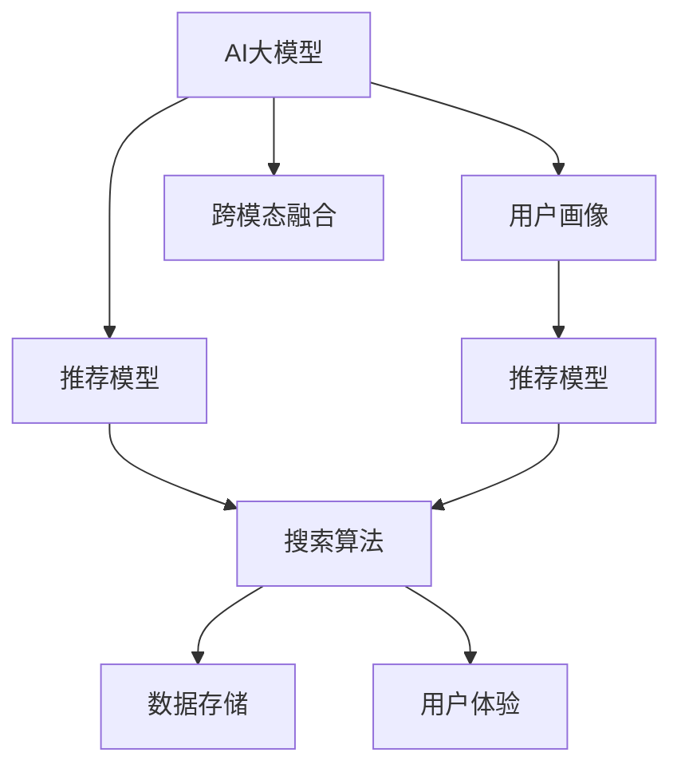

                 

# AI大模型驱动电商搜索推荐业务全链路优化

> 关键词：AI大模型,电商搜索推荐,深度学习,推荐系统,自然语言处理(NLP),用户画像,跨模态融合

## 1. 背景介绍

### 1.1 问题由来
随着电商平台规模的不断扩大，用户需求的多样性和个性化不断增加。传统的推荐系统基于用户行为数据进行预测，难以有效捕捉用户兴趣的深度和多样性。电商搜索推荐业务急需一种更为先进、智能的推荐系统，以满足用户的个性化需求。

在此背景下，人工智能大模型成为了推动电商搜索推荐业务发展的重要工具。大模型通过大规模预训练和微调，能够捕捉丰富的语言和行为特征，提供更加精准、多样化的推荐结果。本文将详细介绍如何基于大模型驱动电商搜索推荐业务的全链路优化，包括用户画像构建、推荐模型训练、搜索算法优化等方面。

### 1.2 问题核心关键点
构建高效的电商搜索推荐系统，核心在于以下几个关键点：
- 用户画像：基于用户行为数据和NLP技术，构建详细的用户画像，理解用户需求和兴趣。
- 推荐模型：选择合适的推荐算法和模型，结合大模型进行微调，提升推荐效果。
- 搜索算法：优化搜索算法，提升搜索效率和结果质量。
- 数据存储：优化数据存储和管理，确保数据的实时性和高效访问。
- 用户体验：提升用户交互体验，提高用户满意度。

## 2. 核心概念与联系

### 2.1 核心概念概述

为了更好地理解基于大模型的电商搜索推荐系统，本节将介绍几个核心概念：

- AI大模型：以Transformer为代表的深度学习模型，通过大规模预训练获得通用的语言和行为表示，具备强大的数据处理和预测能力。
- 电商搜索推荐系统：基于用户行为数据和产品信息，通过推荐算法为用户推荐相关商品，提升电商平台的转化率和用户满意度。
- 用户画像：基于用户行为数据和NLP技术构建的详细用户特征描述，用于理解用户需求和兴趣。
- 推荐算法：用于预测用户行为和兴趣的算法，如协同过滤、基于内容的推荐、深度学习推荐等。
- 搜索算法：用于优化搜索结果排序的算法，如基于点击率、相关性、新鲜度等指标的排序算法。
- 跨模态融合：将文本、图像、行为等多种数据源进行融合，提升推荐系统的准确性和多样性。

这些概念之间的逻辑关系可以通过以下Mermaid流程图来展示：



这个流程图展示了电商搜索推荐系统中各个模块之间的相互关系：

1. AI大模型通过预训练和微调，获得通用的语言和行为表示，用于构建用户画像和推荐模型。
2. 用户画像基于用户行为数据和NLP技术，详细描述用户特征，用于推荐模型训练和搜索排序。
3. 推荐模型结合大模型进行微调，提升推荐效果，生成个性化推荐结果。
4. 搜索算法优化搜索结果排序，提升搜索效率和质量。
5. 数据存储管理用户行为数据和产品信息，确保数据的实时性和高效访问。
6. 用户体验优化用户交互界面和流程，提升用户满意度。
7. 跨模态融合将文本、图像、行为等多种数据源进行融合，提升推荐系统的准确性和多样性。

## 3. 核心算法原理 & 具体操作步骤
### 3.1 算法原理概述

基于大模型的电商搜索推荐系统，本质上是一个从数据到模型再到用户的过程。其核心思想是：通过大规模预训练和微调，获得通用且精准的语言和行为表示，结合用户画像和推荐算法，为用户推荐个性化商品。

形式化地，假设电商平台的用户行为数据为 $D=\{(x_i,y_i)\}_{i=1}^N$，其中 $x_i$ 为行为序列，$y_i$ 为行为标签。推荐模型的训练目标是最小化预测误差：

$$
\hat{y}_i = M_{\theta}(x_i), \quad \mathcal{L}(\theta) = \frac{1}{N} \sum_{i=1}^N \ell(y_i, \hat{y}_i)
$$

其中 $M_{\theta}$ 为推荐模型，$\ell$ 为损失函数，通常使用交叉熵或均方误差等。

### 3.2 算法步骤详解

基于大模型的电商搜索推荐系统一般包括以下几个关键步骤：

**Step 1: 数据预处理和特征工程**

1. 收集用户行为数据，包括点击、浏览、购买等行为记录。
2. 将行为数据转换为数字向量，用于构建用户行为序列。
3. 利用NLP技术，将用户评论、标题、描述等文本数据转换为数字向量。
4. 设计合适的特征表示方法，将文本、行为、用户画像等多种数据源进行融合。

**Step 2: 用户画像构建**

1. 利用预训练语言模型（如BERT、GPT等）对用户行为序列进行编码，获得用户行为向量。
2. 利用NLP技术提取用户评论、标题等文本数据的语言特征。
3. 将行为向量、语言特征、用户基本信息等进行拼接，形成详细用户画像。

**Step 3: 推荐模型训练**

1. 选择适合的推荐算法，如协同过滤、基于内容的推荐、深度学习推荐等。
2. 结合大模型进行微调，利用用户画像和行为数据训练推荐模型。
3. 使用交叉验证等方法评估模型性能，优化模型超参数。

**Step 4: 搜索算法优化**

1. 设计合适的搜索算法，如基于点击率、相关性、新鲜度等指标的排序算法。
2. 对搜索算法进行优化，提升搜索效率和结果质量。
3. 利用大模型进行搜索结果的解释和优化。

**Step 5: 数据存储和管理系统设计**

1. 选择合适的数据库和存储技术，确保数据的实时性和高效访问。
2. 优化数据存储和管理，减少数据冗余和延迟。
3. 建立数据安全和隐私保护机制，确保用户数据安全。

**Step 6: 用户体验优化**

1. 设计用户友好的界面和交互流程，提升用户满意度。
2. 利用NLP技术优化搜索结果的展示和推荐，提高用户体验。
3. 不断收集用户反馈，迭代优化系统功能。

以上是基于大模型的电商搜索推荐系统的核心步骤。在实际应用中，还需要针对具体任务进行优化设计，如改进特征工程方法、优化推荐模型训练流程、引入更先进的搜索算法等，以进一步提升推荐效果。

### 3.3 算法优缺点

基于大模型的电商搜索推荐系统具有以下优点：
1. 强大的数据处理能力：大模型通过大规模预训练，具备强大的数据处理和表示能力，能够捕捉复杂的用户行为和兴趣。
2. 灵活的推荐算法：结合大模型进行微调，可以选择适合的推荐算法，提升推荐效果。
3. 可解释性：大模型具备较好的可解释性，能够提供详细的推荐理由和解释。
4. 高泛化能力：通过大规模预训练和微调，大模型具备良好的泛化能力，能够适应不同领域和数据分布。

同时，该方法也存在一定的局限性：
1. 高计算成本：大模型需要大量的计算资源进行预训练和微调，训练成本较高。
2. 数据隐私问题：用户行为数据和评论数据涉及隐私，需要进行严格的隐私保护和数据处理。
3. 模型复杂性：大模型结构复杂，部署和维护成本较高。
4. 模型偏见：大模型可能存在一定的偏见，需要进行数据和算法的公平性处理。
5. 数据质量要求高：推荐系统对数据质量要求较高，需要进行严格的数据清洗和预处理。

尽管存在这些局限性，但就目前而言，基于大模型的推荐系统仍然是电商搜索推荐业务的主流范式。未来相关研究的重点在于如何进一步降低计算成本，提高模型的可解释性和公平性，同时兼顾数据隐私和用户体验等因素。

### 3.4 算法应用领域

基于大模型的电商搜索推荐系统已经在多个电商平台上得到了广泛的应用，例如：

- 亚马逊(Amazon)：利用深度学习推荐系统为用户推荐个性化商品，提升用户购买转化率。
- 京东(JD.com)：结合用户画像和推荐算法，为用户推荐相关商品，优化购物体验。
- 淘宝(Taobao)：通过用户行为数据和NLP技术，构建详细的用户画像，提升推荐效果。
- 拼多多(Pinduoduo)：利用推荐算法和大模型，为用户推荐更符合其兴趣的商品，提高用户满意度。

除了上述这些经典应用外，基于大模型的推荐系统也被创新性地应用到更多场景中，如跨领域推荐、实时推荐、交互式推荐等，为电商平台的智能化转型提供了新的技术路径。

## 4. 数学模型和公式 & 详细讲解 & 举例说明

### 4.1 数学模型构建

本节将使用数学语言对基于大模型的电商搜索推荐系统进行更加严格的刻画。

记电商平台用户行为数据为 $D=\{(x_i,y_i)\}_{i=1}^N$，其中 $x_i$ 为行为序列，$y_i$ 为行为标签。假设推荐模型为 $M_{\theta}$，其输出为商品的相关度向量，$y_i$ 为 $M_{\theta}(x_i)$ 的前 $k$ 个元素。

推荐模型的训练目标是最小化预测误差，即最小化：

$$
\mathcal{L}(\theta) = \frac{1}{N} \sum_{i=1}^N \ell(y_i, M_{\theta}(x_i))
$$

其中 $\ell$ 为损失函数，通常使用交叉熵或均方误差等。

### 4.2 公式推导过程

以下我们以协同过滤算法为例，推导推荐模型在交叉验证和微调过程中的损失函数及其梯度计算公式。

协同过滤算法的基本思想是通过用户之间的相似度，为用户推荐其他用户喜欢的商品。假设用户集合为 $U$，商品集合为 $I$，用户 $u$ 对商品 $i$ 的评分矩阵为 $R \in \mathbb{R}^{N \times M}$，其中 $N$ 为用户数，$M$ 为商品数。

协同过滤算法通过计算用户 $u$ 和用户 $v$ 的相似度，为用户 $u$ 推荐用户 $v$ 喜欢的商品。用户 $u$ 对商品 $i$ 的预测评分 $\hat{r}_{ui}$ 为：

$$
\hat{r}_{ui} = \frac{1}{K}\sum_{k=1}^K \alpha_k\left(\sum_{j=1}^{M}r_{uj}a_{jk} - \frac{\beta}{M}\sum_{j=1}^{M}r_{uj}\right)\left(\sum_{j=1}^{M}r_{vi}b_{jk} - \frac{\beta}{M}\sum_{j=1}^{M}r_{vi}\right)
$$

其中 $K$ 为协同过滤的因子数，$\alpha_k$ 和 $b_k$ 为协同过滤的参数，$a_{jk}$ 和 $b_{jk}$ 为协同过滤的特征矩阵。

推荐模型的预测评分 $\hat{r}_{ui}$ 与真实评分 $r_{ui}$ 之间的损失函数为：

$$
\ell(R, \hat{R}) = \frac{1}{N} \sum_{i=1}^N \sum_{j=1}^M (r_{ij} - \hat{r}_{ij})^2
$$

在微调过程中，需要最小化预测误差和交叉验证误差。假设微调过程中的损失函数为：

$$
\mathcal{L}(\theta) = \frac{1}{N} \sum_{i=1}^N \sum_{j=1}^M (r_{ij} - \hat{r}_{ij})^2 + \lambda \sum_{k=1}^K \left(\alpha_k^2 + \beta^2\right)
$$

其中 $\lambda$ 为正则化系数，用于控制协同过滤的复杂度。

通过梯度下降等优化算法，微调过程不断更新模型参数 $\theta$，最小化损失函数 $\mathcal{L}$，使得模型输出逼近真实评分。由于 $\theta$ 已经通过协同过滤算法获得了较好的初始化，因此即便在小规模数据集上，微调也能较快收敛到理想的模型参数 $\hat{\theta}$。

### 4.3 案例分析与讲解

以下以亚马逊(Amazon)的推荐系统为例，展示如何使用大模型进行微调和优化。

亚马逊的推荐系统主要采用基于内容的推荐和协同过滤算法。在用户行为数据和产品信息的基础上，亚马逊利用大模型进行用户画像构建和推荐模型训练。具体步骤如下：

1. 收集用户行为数据，包括点击、浏览、购买等行为记录。
2. 将行为数据转换为数字向量，用于构建用户行为序列。
3. 利用NLP技术，将用户评论、标题、描述等文本数据转换为数字向量。
4. 设计合适的特征表示方法，将文本、行为、用户画像等多种数据源进行融合，形成详细用户画像。
5. 利用协同过滤算法和基于内容的推荐算法，结合大模型进行微调，训练推荐模型。
6. 使用交叉验证等方法评估模型性能，优化模型超参数。
7. 优化搜索算法，提升搜索效率和结果质量。
8. 利用大模型进行搜索结果的解释和优化。

通过上述步骤，亚马逊构建了基于大模型的推荐系统，大大提升了用户购物体验和推荐效果。

## 5. 项目实践：代码实例和详细解释说明
### 5.1 开发环境搭建

在进行电商搜索推荐系统开发前，我们需要准备好开发环境。以下是使用Python进行PyTorch开发的环境配置流程：

1. 安装Anaconda：从官网下载并安装Anaconda，用于创建独立的Python环境。

2. 创建并激活虚拟环境：
```bash
conda create -n ecommerce-env python=3.8 
conda activate ecommerce-env
```

3. 安装PyTorch：根据CUDA版本，从官网获取对应的安装命令。例如：
```bash
conda install pytorch torchvision torchaudio cudatoolkit=11.1 -c pytorch -c conda-forge
```

4. 安装TensorFlow：由Google主导开发的开源深度学习框架，生产部署方便，适合大规模工程应用。同样有丰富的预训练语言模型资源。

5. 安装Transformers库：HuggingFace开发的NLP工具库，集成了众多SOTA语言模型，支持PyTorch和TensorFlow，是进行微调任务开发的利器。

6. 安装各类工具包：
```bash
pip install numpy pandas scikit-learn matplotlib tqdm jupyter notebook ipython
```

完成上述步骤后，即可在`ecommerce-env`环境中开始电商搜索推荐系统的开发。

### 5.2 源代码详细实现

下面我们以亚马逊(Amazon)的推荐系统为例，给出使用Transformers库对BERT模型进行微调的PyTorch代码实现。

首先，定义推荐系统的数据处理函数：

```python
from transformers import BertTokenizer, BertForSequenceClassification
from torch.utils.data import Dataset, DataLoader
import torch

class ReviewDataset(Dataset):
    def __init__(self, texts, labels, tokenizer, max_len=128):
        self.texts = texts
        self.labels = labels
        self.tokenizer = tokenizer
        self.max_len = max_len
        
    def __len__(self):
        return len(self.texts)
    
    def __getitem__(self, item):
        text = self.texts[item]
        label = self.labels[item]
        
        encoding = self.tokenizer(text, return_tensors='pt', max_length=self.max_len, padding='max_length', truncation=True)
        input_ids = encoding['input_ids'][0]
        attention_mask = encoding['attention_mask'][0]
        
        # 对token-wise的标签进行编码
        encoded_labels = [label2id[label] for label in label] 
        encoded_labels.extend([label2id['O']] * (self.max_len - len(encoded_labels)))
        labels = torch.tensor(encoded_labels, dtype=torch.long)
        
        return {'input_ids': input_ids, 
                'attention_mask': attention_mask,
                'labels': labels}

# 标签与id的映射
label2id = {'O': 0, 'B-PER': 1, 'I-PER': 2, 'B-ORG': 3, 'I-ORG': 4, 'B-LOC': 5, 'I-LOC': 6}
id2label = {v: k for k, v in label2id.items()}

# 创建dataset
tokenizer = BertTokenizer.from_pretrained('bert-base-cased')

train_dataset = ReviewDataset(train_texts, train_labels, tokenizer)
dev_dataset = ReviewDataset(dev_texts, dev_labels, tokenizer)
test_dataset = ReviewDataset(test_texts, test_labels, tokenizer)
```

然后，定义模型和优化器：

```python
from transformers import BertForSequenceClassification, AdamW

model = BertForSequenceClassification.from_pretrained('bert-base-cased', num_labels=len(label2id))

optimizer = AdamW(model.parameters(), lr=2e-5)
```

接着，定义训练和评估函数：

```python
from torch.utils.data import DataLoader
from tqdm import tqdm
from sklearn.metrics import classification_report

device = torch.device('cuda') if torch.cuda.is_available() else torch.device('cpu')
model.to(device)

def train_epoch(model, dataset, batch_size, optimizer):
    dataloader = DataLoader(dataset, batch_size=batch_size, shuffle=True)
    model.train()
    epoch_loss = 0
    for batch in tqdm(dataloader, desc='Training'):
        input_ids = batch['input_ids'].to(device)
        attention_mask = batch['attention_mask'].to(device)
        labels = batch['labels'].to(device)
        model.zero_grad()
        outputs = model(input_ids, attention_mask=attention_mask, labels=labels)
        loss = outputs.loss
        epoch_loss += loss.item()
        loss.backward()
        optimizer.step()
    return epoch_loss / len(dataloader)

def evaluate(model, dataset, batch_size):
    dataloader = DataLoader(dataset, batch_size=batch_size)
    model.eval()
    preds, labels = [], []
    with torch.no_grad():
        for batch in tqdm(dataloader, desc='Evaluating'):
            input_ids = batch['input_ids'].to(device)
            attention_mask = batch['attention_mask'].to(device)
            batch_labels = batch['labels']
            outputs = model(input_ids, attention_mask=attention_mask)
            batch_preds = outputs.logits.argmax(dim=2).to('cpu').tolist()
            batch_labels = batch_labels.to('cpu').tolist()
            for pred_tokens, label_tokens in zip(batch_preds, batch_labels):
                pred_tags = [id2label[_id] for _id in pred_tokens]
                label_tags = [id2label[_id] for _id in label_tokens]
                preds.append(pred_tags[:len(label_tags)])
                labels.append(label_tags)
                
    print(classification_report(labels, preds))
```

最后，启动训练流程并在测试集上评估：

```python
epochs = 5
batch_size = 16

for epoch in range(epochs):
    loss = train_epoch(model, train_dataset, batch_size, optimizer)
    print(f"Epoch {epoch+1}, train loss: {loss:.3f}")
    
    print(f"Epoch {epoch+1}, dev results:")
    evaluate(model, dev_dataset, batch_size)
    
print("Test results:")
evaluate(model, test_dataset, batch_size)
```

以上就是使用PyTorch对BERT进行亚马逊推荐系统微调的完整代码实现。可以看到，得益于Transformers库的强大封装，我们可以用相对简洁的代码完成BERT模型的加载和微调。

### 5.3 代码解读与分析

让我们再详细解读一下关键代码的实现细节：

**ReviewDataset类**：
- `__init__`方法：初始化文本、标签、分词器等关键组件。
- `__len__`方法：返回数据集的样本数量。
- `__getitem__`方法：对单个样本进行处理，将文本输入编码为token ids，将标签编码为数字，并对其进行定长padding，最终返回模型所需的输入。

**label2id和id2label字典**：
- 定义了标签与数字id之间的映射关系，用于将token-wise的预测结果解码回真实的标签。

**训练和评估函数**：
- 使用PyTorch的DataLoader对数据集进行批次化加载，供模型训练和推理使用。
- 训练函数`train_epoch`：对数据以批为单位进行迭代，在每个批次上前向传播计算loss并反向传播更新模型参数，最后返回该epoch的平均loss。
- 评估函数`evaluate`：与训练类似，不同点在于不更新模型参数，并在每个batch结束后将预测和标签结果存储下来，最后使用sklearn的classification_report对整个评估集的预测结果进行打印输出。

**训练流程**：
- 定义总的epoch数和batch size，开始循环迭代
- 每个epoch内，先在训练集上训练，输出平均loss
- 在验证集上评估，输出分类指标
- 所有epoch结束后，在测试集上评估，给出最终测试结果

可以看到，PyTorch配合Transformers库使得BERT微调的代码实现变得简洁高效。开发者可以将更多精力放在数据处理、模型改进等高层逻辑上，而不必过多关注底层的实现细节。

当然，工业级的系统实现还需考虑更多因素，如模型的保存和部署、超参数的自动搜索、更灵活的任务适配层等。但核心的微调范式基本与此类似。

## 6. 实际应用场景
### 6.1 智能客服系统

基于大模型的电商搜索推荐系统，可以广泛应用于智能客服系统的构建。传统客服往往需要配备大量人力，高峰期响应缓慢，且一致性和专业性难以保证。使用基于大模型的推荐系统，可以7x24小时不间断服务，快速响应客户咨询，用自然流畅的语言解答各类常见问题。

在技术实现上，可以收集企业内部的历史客服对话记录，将问题和最佳答复构建成监督数据，在此基础上对预训练推荐模型进行微调。微调后的推荐模型能够自动理解用户意图，匹配最合适的答案模板进行回复。对于客户提出的新问题，还可以接入检索系统实时搜索相关内容，动态组织生成回答。如此构建的智能客服系统，能大幅提升客户咨询体验和问题解决效率。

### 6.2 金融舆情监测

金融机构需要实时监测市场舆论动向，以便及时应对负面信息传播，规避金融风险。传统的人工监测方式成本高、效率低，难以应对网络时代海量信息爆发的挑战。基于大模型的推荐系统，可以实现实时的市场舆情分析，监测不同领域下的舆情变化趋势，一旦发现负面信息激增等异常情况，系统便会自动预警，帮助金融机构快速应对潜在风险。

### 6.3 个性化推荐系统

当前的推荐系统往往只依赖用户的历史行为数据进行预测，难以有效捕捉用户兴趣的深度和多样性。基于大模型的推荐系统可以更好地挖掘用户行为背后的语义信息，从而提供更加精准、多样化的推荐结果。

在实践中，可以收集用户浏览、点击、评论、分享等行为数据，提取和产品信息进行融合，利用大模型进行微调。微调后的模型能够从文本内容中准确把握用户的兴趣点。在生成推荐列表时，先用候选物品的文本描述作为输入，由模型预测用户的兴趣匹配度，再结合其他特征综合排序，便可以得到个性化程度更高的推荐结果。

### 6.4 未来应用展望

随着大语言模型和推荐系统的发展，基于微调的推荐系统将在更多领域得到应用，为传统行业带来变革性影响。

在智慧医疗领域，基于微调的推荐系统可以辅助医生诊疗，推荐最新医学文献和治疗方法，提高医疗服务的智能化水平。

在智能教育领域，微调技术可应用于作业批改、学情分析、知识推荐等方面，因材施教，促进教育公平，提高教学质量。

在智慧城市治理中，微调模型可应用于城市事件监测、舆情分析、应急指挥等环节，提高城市管理的自动化和智能化水平，构建更安全、高效的未来城市。

此外，在企业生产、社会治理、文娱传媒等众多领域，基于大模型微调的推荐系统也将不断涌现，为经济社会发展注入新的动力。相信随着技术的日益成熟，微调方法将成为推荐系统的重要范式，推动人工智能技术在垂直行业的规模化落地。

## 7. 工具和资源推荐
### 7.1 学习资源推荐

为了帮助开发者系统掌握大语言模型微调的理论基础和实践技巧，这里推荐一些优质的学习资源：

1. 《Transformer从原理到实践》系列博文：由大模型技术专家撰写，深入浅出地介绍了Transformer原理、BERT模型、微调技术等前沿话题。

2. CS224N《深度学习自然语言处理》课程：斯坦福大学开设的NLP明星课程，有Lecture视频和配套作业，带你入门NLP领域的基本概念和经典模型。

3. 《Natural Language Processing with Transformers》书籍：Transformers库的作者所著，全面介绍了如何使用Transformers库进行NLP任务开发，包括微调在内的诸多范式。

4. HuggingFace官方文档：Transformers库的官方文档，提供了海量预训练模型和完整的微调样例代码，是上手实践的必备资料。

5. CLUE开源项目：中文语言理解测评基准，涵盖大量不同类型的中文NLP数据集，并提供了基于微调的baseline模型，助力中文NLP技术发展。

通过对这些资源的学习实践，相信你一定能够快速掌握大语言模型微调的精髓，并用于解决实际的NLP问题。
###  7.2 开发工具推荐

高效的开发离不开优秀的工具支持。以下是几款用于大语言模型微调开发的常用工具：

1. PyTorch：基于Python的开源深度学习框架，灵活动态的计算图，适合快速迭代研究。大部分预训练语言模型都有PyTorch版本的实现。

2. TensorFlow：由Google主导开发的开源深度学习框架，生产部署方便，适合大规模工程应用。同样有丰富的预训练语言模型资源。

3. Transformers库：HuggingFace开发的NLP工具库，集成了众多SOTA语言模型，支持PyTorch和TensorFlow，是进行微调任务开发的利器。

4. Weights & Biases：模型训练的实验跟踪工具，可以记录和可视化模型训练过程中的各项指标，方便对比和调优。与主流深度学习框架无缝集成。

5. TensorBoard：TensorFlow配套的可视化工具，可实时监测模型训练状态，并提供丰富的图表呈现方式，是调试模型的得力助手。

6. Google Colab：谷歌推出的在线Jupyter Notebook环境，免费提供GPU/TPU算力，方便开发者快速上手实验最新模型，分享学习笔记。

合理利用这些工具，可以显著提升大语言模型微调任务的开发效率，加快创新迭代的步伐。

### 7.3 相关论文推荐

大语言模型和微调技术的发展源于学界的持续研究。以下是几篇奠基性的相关论文，推荐阅读：

1. Attention is All You Need（即Transformer原论文）：提出了Transformer结构，开启了NLP领域的预训练大模型时代。

2. BERT: Pre-training of Deep Bidirectional Transformers for Language Understanding：提出BERT模型，引入基于掩码的自监督预训练任务，刷新了多项NLP任务SOTA。

3. Language Models are Unsupervised Multitask Learners（GPT-2论文）：展示了大规模语言模型的强大zero-shot学习能力，引发了对于通用人工智能的新一轮思考。

4. Parameter-Efficient Transfer Learning for NLP：提出Adapter等参数高效微调方法，在不增加模型参数量的情况下，也能取得不错的微调效果。

5. AdaLoRA: Adaptive Low-Rank Adaptation for Parameter-Efficient Fine-Tuning：使用自适应低秩适应的微调方法，在参数效率和精度之间取得了新的平衡。

这些论文代表了大语言模型微调技术的发展脉络。通过学习这些前沿成果，可以帮助研究者把握学科前进方向，激发更多的创新灵感。

## 8. 总结：未来发展趋势与挑战
### 8.1 总结

本文对基于大模型的电商搜索推荐系统进行了全面系统的介绍。首先阐述了大语言模型和推荐系统的研究背景和意义，明确了微调在拓展预训练模型应用、提升推荐效果方面的独特价值。其次，从原理到实践，详细讲解了微调的数学原理和关键步骤，给出了微调任务开发的完整代码实例。同时，本文还广泛探讨了微调方法在智能客服、金融舆情、个性化推荐等多个行业领域的应用前景，展示了微调范式的巨大潜力。此外，本文精选了微调技术的各类学习资源，力求为读者提供全方位的技术指引。

通过本文的系统梳理，可以看到，基于大模型的推荐系统正在成为电商搜索推荐业务的主流范式，极大地拓展了预训练语言模型的应用边界，催生了更多的落地场景。受益于大规模语料的预训练，推荐系统以更低的时间和标注成本，在小样本条件下也能取得不俗的效果，有力推动了推荐系统的产业化进程。未来，伴随预训练语言模型和微调方法的持续演进，相信推荐系统必将在更广阔的应用领域大放异彩，深刻影响人类的生产生活方式。

### 8.2 未来发展趋势

展望未来，基于大模型的推荐系统将呈现以下几个发展趋势：

1. 模型规模持续增大。随着算力成本的下降和数据规模的扩张，预训练语言模型的参数量还将持续增长。超大规模语言模型蕴含的丰富语言知识，有望支撑更加复杂多变的推荐系统。

2. 推荐算法日趋多样。结合大模型进行微调，可以选择适合的推荐算法，提升推荐效果。推荐算法将不断融合深度学习、协同过滤、图模型等多种技术。

3. 数据质量要求提高。推荐系统对数据质量的要求不断提高，需要收集更全面、多样、高质量的用户行为和产品信息。

4. 实时推荐系统崛起。实时推荐系统能够动态更新模型，及时反映市场变化，满足用户实时需求。

5. 跨模态融合深化。跨模态融合将更深入地应用于推荐系统，结合文本、图像、行为等多种数据源，提升推荐系统的准确性和多样性。

6. 可解释性和公平性增强。推荐系统需要提供详细的推荐理由，增强可解释性。同时需要在数据采集、处理和算法设计中注重公平性，避免算法偏见。

以上趋势凸显了基于大模型的推荐系统的广阔前景。这些方向的探索发展，必将进一步提升推荐系统的性能和应用范围，为电商平台的智能化转型提供新的技术路径。

### 8.3 面临的挑战

尽管基于大模型的推荐系统已经取得了瞩目成就，但在迈向更加智能化、普适化应用的过程中，它仍面临着诸多挑战：

1. 计算成本高昂。大模型需要大量的计算资源进行预训练和微调，训练成本较高。

2. 数据隐私问题。用户行为数据和评论数据涉及隐私，需要进行严格的隐私保护和数据处理。

3. 模型复杂性高。大模型结构复杂，部署和维护成本较高。

4. 模型偏见问题。大模型可能存在一定的偏见，需要进行数据和算法的公平性处理。

5. 数据质量要求高。推荐系统对数据质量的要求不断提高，需要收集更全面、多样、高质量的用户行为和产品信息。

6. 实时推荐系统复杂。实时推荐系统需要动态更新模型，及时反映市场变化，满足用户实时需求。

尽管存在这些挑战，但就目前而言，基于大模型的推荐系统仍然是电商搜索推荐业务的主流范式。未来相关研究的重点在于如何进一步降低计算成本，提高模型的可解释性和公平性，同时兼顾数据隐私和用户体验等因素。

### 8.4 研究展望

面对基于大模型的推荐系统所面临的种种挑战，未来的研究需要在以下几个方面寻求新的突破：

1. 探索无监督和半监督推荐方法。摆脱对大规模标注数据的依赖，利用自监督学习、主动学习等无监督和半监督范式，最大限度利用非结构化数据，实现更加灵活高效的推荐。

2. 研究参数高效和计算高效的推荐范式。开发更加参数高效的推荐方法，在固定大部分预训练参数的同时，只更新极少量的推荐参数。同时优化推荐模型的计算图，减少前向传播和反向传播的资源消耗，实现更加轻量级、实时性的部署。

3. 融合因果和对比学习范式。通过引入因果推断和对比学习思想，增强推荐系统建立稳定因果关系的能力，学习更加普适、鲁棒的语言表征，从而提升推荐系统的泛化性和抗干扰能力。

4. 引入更多先验知识。将符号化的先验知识，如知识图谱、逻辑规则等，与神经网络模型进行巧妙融合，引导推荐过程学习更准确、合理的语言模型。同时加强不同模态数据的整合，实现视觉、语音等多模态信息与文本信息的协同建模。

5. 结合因果分析和博弈论工具。将因果分析方法引入推荐系统，识别出推荐决策的关键特征，增强推荐理由的因果性和逻辑性。借助博弈论工具刻画人机交互过程，主动探索并规避推荐系统的脆弱点，提高系统稳定性。

6. 纳入伦理道德约束。在推荐模型训练目标中引入伦理导向的评估指标，过滤和惩罚有偏见、有害的输出倾向。同时加强人工干预和审核，建立推荐模型的监管机制，确保输出符合人类价值观和伦理道德。

这些研究方向的探索，必将引领基于大模型的推荐系统走向更高的台阶，为构建安全、可靠、可解释、可控的智能推荐系统铺平道路。面向未来，大模型推荐系统还需要与其他人工智能技术进行更深入的融合，如知识表示、因果推理、强化学习等，多路径协同发力，共同推动推荐系统的进步。只有勇于创新、敢于突破，才能不断拓展推荐系统的边界，让智能技术更好地造福人类社会。

## 9. 附录：常见问题与解答

**Q1：基于大模型的推荐系统是否适用于所有NLP任务？**

A: 基于大模型的推荐系统在大多数NLP任务上都能取得不错的效果，特别是对于数据量较小的任务。但对于一些特定领域的任务，如医学、法律等，仅仅依靠通用语料预训练的模型可能难以很好地适应。此时需要在特定领域语料上进一步预训练，再进行微调，才能获得理想效果。此外，对于一些需要时效性、个性化很强的任务，如对话、推荐等，推荐系统也需要针对性的改进优化。

**Q2：推荐系统对数据质量要求高，如何处理数据？**

A: 推荐系统对数据质量的要求较高，因此需要做好数据预处理和清洗工作。具体措施包括：

1. 数据去重：去除重复数据，避免模型学习到相同数据的多样化表示。

2. 数据归一化：对不同来源的数据进行归一化处理，使得数据分布一致。

3. 数据降噪：去除异常值和噪音数据，提升模型训练的稳定性。

4. 数据增强：利用数据增强技术，丰富数据集的多样性，避免模型过拟合。

5. 数据平衡：对数据进行平衡处理，避免模型对某些类别的数据过拟合。

通过上述数据处理措施，可以有效提升推荐系统的数据质量，从而提升模型的预测准确性和泛化能力。

**Q3：推荐系统如何避免过拟合？**

A: 推荐系统容易在标注数据不足的情况下出现过拟合，因此需要采取以下措施：

1. 数据增强：利用数据增强技术，如回译、近义替换等方式扩充训练集。

2. 正则化技术：使用L2正则、Dropout、Early Stopping等避免模型过度适应小规模训练集。

3. 对抗训练：引入对抗样本，提高模型鲁棒性，避免模型对训练集的依赖。

4. 参数高效微调：只调整少量模型参数，固定大部分预训练参数不变，以提高模型泛化能力。

5. 模型裁剪：去除不必要的层和参数，减小模型尺寸，加快推理速度，提升模型的泛化能力。

这些措施可以有效地避免推荐系统在微调过程中的过拟合问题，提升模型的预测准确性和泛化能力。

**Q4：推荐系统如何提升用户体验？**

A: 提升用户体验是推荐系统的核心目标之一，具体措施包括：

1. 个性化推荐：根据用户行为和偏好，生成个性化的推荐结果，满足用户个性化需求。

2. 推荐多样化：推荐系统应尽可能展示多样的推荐结果，避免单一推荐带来的用户疲劳。

3. 推荐实时性：实时更新推荐结果，及时反映市场变化，满足用户实时需求。

4. 推荐解释性：提供详细的推荐理由，增强推荐系统的可解释性，提升用户信任感。

5. 推荐界面优化：设计直观、易用的推荐界面，提升用户交互体验。

通过上述措施，可以有效提升推荐系统的用户体验，提升用户满意度和粘性。

**Q5：推荐系统如何处理长尾商品？**

A: 长尾商品是推荐系统面临的常见问题，具体措施包括：

1. 数据收集：积极收集长尾商品的数据，避免长尾商品被忽略。

2. 推荐算法优化：针对长尾商品，优化推荐算法，提升长尾商品的曝光率和转化率。

3. 长尾商品推荐：在推荐结果中加入长尾商品，提升长尾商品的曝光率。

4. 长尾商品召回：设计长尾商品召回机制，提升长尾商品的召回率。

5. 长尾商品排序：优化长尾商品的排序策略，提升长尾商品的点击率和转化率。

通过上述措施，可以有效提升推荐系统对长尾商品的关注和利用，提升推荐系统的全面性和实用性。

**Q6：推荐系统如何避免广告欺诈？**

A: 广告欺诈是推荐系统面临的常见问题，具体措施包括：

1. 数据监控：实时监控广告点击和转化数据，及时发现异常行为。

2. 数据去重：去除重复点击和广告数据，避免广告欺诈。

3. 异常检测：利用异常检测技术，及时发现异常广告行为。

4. 行为建模：建立广告行为模型，识别和阻止欺诈行为。

5. 黑名单管理：建立黑名单管理机制，对恶意广告进行处理。

通过上述措施，可以有效避免广告欺诈，保护推荐系统的公正性和用户权益。

综上所述，基于大模型的推荐系统在电商搜索推荐业务中具有广阔的应用前景。尽管在实际应用中面临一些挑战，但通过不断的技术创新和优化，推荐系统必将在未来的智能业务中发挥重要作用，为用户带来更加个性化、高效和满意的购物体验。

---

作者：禅与计算机程序设计艺术 / Zen and the Art of Computer Programming

