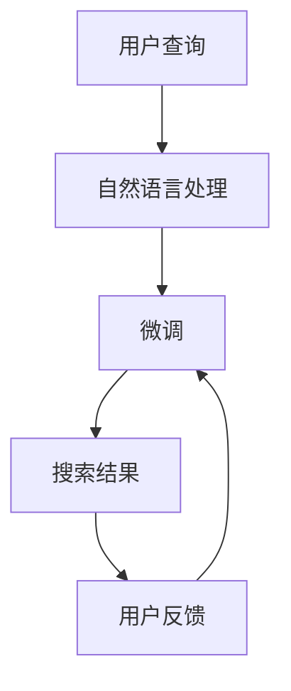

                 

# AI大模型：提升电商平台搜索效率的新方法

## 1. 背景介绍

随着电子商务的迅速发展，用户对电商平台的搜索效率和用户体验提出了更高的要求。传统的搜索算法通常基于关键词匹配，难以理解和处理自然语言查询。近年来，大语言模型在自然语言处理(NLP)领域的突破性进展，为电商搜索带来了新的希望。利用大语言模型，电商平台能够更好地理解用户意图，提供更加智能化的搜索结果，提升用户体验和转化率。

本文将详细介绍基于大语言模型的电商搜索新方法，涵盖从模型选择到系统部署的完整流程。通过系统地探讨模型构建、训练、评估、优化等关键步骤，帮助读者深入理解大模型在电商搜索中的应用，并构建高效、智能化的搜索系统。

## 2. 核心概念与联系

### 2.1 核心概念概述

在介绍核心算法之前，首先需要明确几个关键概念：

- 大语言模型(Large Language Model, LLM)：如BERT、GPT等，通过大规模无标签文本数据预训练，学习丰富的语言表示，具备强大的自然语言理解与生成能力。

- 自然语言处理(Natural Language Processing, NLP)：研究如何使计算机理解和处理人类语言的技术，包括语音识别、文本分类、机器翻译、问答系统等。

- 电商搜索(e-commerce search)：指电商平台提供的基于用户查询的个性化商品推荐服务，目的是帮助用户快速找到满足需求的商品。

- 搜索相关性(Relevance)：衡量搜索结果与用户查询意图的匹配度，通常采用搜索排名算法实现。

- 搜索召回率(Recall)：衡量搜索结果覆盖用户意图的程度，即正确返回所有相关商品的能力。

- 搜索精度(Precision)：衡量搜索结果中相关商品的比例，即搜索结果的准确性。

### 2.2 核心概念原理和架构的 Mermaid 流程图



该流程图展示了基于大语言模型的电商搜索系统核心架构：

- **用户查询**：用户输入自然语言查询，经过NLP预处理后，进入大语言模型进行处理。
- **自然语言处理**：包括分词、词性标注、命名实体识别等步骤，预处理用户查询，将其转换为模型可以处理的形式。
- **大语言模型**：通过预训练模型对用户查询进行处理，理解查询意图，并生成商品推荐列表。
- **搜索结果**：将推荐列表展示给用户，用户进行点击操作。
- **用户反馈**：根据用户点击行为进行反馈，用于微调模型参数，提升搜索效果。

通过这种架构，电商平台能够实现智能化、个性化的搜索服务，提升用户体验和搜索效率。

## 3. 核心算法原理 & 具体操作步骤

### 3.1 算法原理概述

基于大语言模型的电商搜索新方法，主要依赖以下原理：

- **预训练大语言模型**：利用大规模无标签文本数据预训练出通用语言模型，具备强大的自然语言理解能力。
- **NLP预处理**：对用户查询进行分词、词性标注、命名实体识别等步骤，将自然语言查询转换为模型可处理的结构化数据。
- **搜索相关性计算**：通过大语言模型理解查询意图，计算搜索结果与查询的相关性。
- **个性化推荐**：根据用户查询历史、行为数据等，对搜索结果进行个性化排序。

### 3.2 算法步骤详解

基于大语言模型的电商搜索新方法，主要包括以下几个关键步骤：

**Step 1: 数据准备与模型选择**
- 收集电商平台用户的历史查询记录、点击行为、商品信息等数据。
- 选择合适的预训练语言模型，如BERT、GPT等，作为搜索的基础模型。

**Step 2: NLP预处理**
- 使用分词工具，如jieba、NLTK等，对用户查询进行分词。
- 对分词结果进行词性标注，如使用nltk库。
- 识别命名实体，如人名、地名、组织名等，使用SpaCy库。
- 将处理后的查询转换为模型可接受的格式，如向量表示。

**Step 3: 大语言模型微调**
- 选择适当的微调任务，如分类、匹配、生成等。
- 对模型进行微调，优化其在特定任务上的性能。
- 使用小规模标注数据进行微调，避免过拟合。
- 选择合适的优化器，如Adam、SGD等，设置合适的学习率。

**Step 4: 搜索结果排序**
- 根据查询意图和搜索结果的相关性，计算每个商品的评分。
- 使用排序算法，如倒排索引、排序网络等，对商品进行排序。
- 结合个性化推荐算法，如协同过滤、基于内容的推荐等，进一步优化搜索结果。

**Step 5: 反馈机制与模型优化**
- 收集用户点击行为、反馈等数据，用于模型微调。
- 定期重新训练模型，调整参数，优化搜索效果。
- 引入A/B测试，对比不同策略的性能，不断优化搜索算法。

### 3.3 算法优缺点

基于大语言模型的电商搜索新方法具有以下优点：

- **灵活性**：大语言模型能够适应不同领域的查询，不需要重新训练或微调，具有良好的泛化能力。
- **精度高**：利用大语言模型的强大理解能力，能够精确理解查询意图，提供更准确的搜索结果。
- **实时性**：大语言模型可以实时处理用户查询，快速生成个性化推荐，提升用户体验。

同时，该方法也存在一些局限性：

- **数据依赖**：对用户查询数据和点击行为数据的依赖较大，数据质量直接影响了搜索效果。
- **计算成本**：大语言模型计算量大，对计算资源和存储资源有较高要求。
- **模型复杂度**：模型结构复杂，调试和优化难度较大。

尽管存在这些局限性，但大语言模型在电商搜索中的应用，仍然展现了显著的优势，值得进一步探索和优化。

### 3.4 算法应用领域

基于大语言模型的电商搜索新方法，已经广泛应用于各类电商平台：

- **阿里巴巴**：使用大语言模型进行搜索排序和个性化推荐，提升了用户搜索体验和转化率。
- **京东**：利用预训练模型处理用户查询，进行商品分类和匹配，提高了搜索准确性和覆盖面。
- **亚马逊**：通过大语言模型理解用户意图，生成个性化搜索结果，优化了购物体验。

未来，随着大语言模型的进一步发展和电商搜索场景的多样化，基于大语言模型的搜索方法将有更大的应用前景。

## 4. 数学模型和公式 & 详细讲解 & 举例说明

### 4.1 数学模型构建

假设电商平台的用户查询为 $q$，商品信息为 $d$，用户历史行为数据为 $b$。基于大语言模型的电商搜索新方法，可以建模为如下形式：

- 对用户查询 $q$ 进行NLP预处理，得到查询向量 $v_q$。
- 对商品信息 $d$ 进行编码，得到商品向量 $v_d$。
- 对用户历史行为数据 $b$ 进行编码，得到用户向量 $v_b$。

设 $f(v_q, v_d, v_b)$ 为查询-商品-行为的综合评分函数，将搜索排序模型定义为：

$$
M(q, d, b) = f(v_q, v_d, v_b) \times r(q, d, b)
$$

其中 $r(q, d, b)$ 为搜索相关性函数，衡量搜索结果与查询的相关性。

### 4.2 公式推导过程

以查询-商品匹配任务为例，查询 $q$ 和商品 $d$ 的相关性 $r(q, d, b)$ 可以定义如下：

$$
r(q, d, b) = \frac{s(q, d)}{s(q, b)}
$$

其中 $s(q, d)$ 和 $s(q, b)$ 分别表示查询 $q$ 与商品 $d$ 和用户行为数据 $b$ 的相关性得分。

设大语言模型的预训练模型为 $M_{\theta}$，其对查询 $q$ 的输出向量为 $v_q$。设商品的向量表示为 $v_d$，商品的语义表示为 $h_d$，商品的匹配度为 $m_d$。则查询与商品的相关性得分 $s(q, d)$ 可以表示为：

$$
s(q, d) = \text{dot}(v_q, v_d) + \text{dot}(v_q, h_d) \times m_d
$$

其中 $\text{dot}(\cdot, \cdot)$ 表示向量内积。

同样，查询与用户行为数据的相关性得分 $s(q, b)$ 可以表示为：

$$
s(q, b) = \text{dot}(v_q, v_b) + \text{dot}(v_q, h_b) \times m_b
$$

其中 $h_b$ 和 $m_b$ 分别表示用户行为数据的语义表示和匹配度。

### 4.3 案例分析与讲解

以淘宝商品搜索为例，下面详细分析基于大语言模型的搜索排序算法：

1. **NLP预处理**：
   - 对用户查询 $q$ 进行分词、词性标注、命名实体识别等步骤，得到查询向量 $v_q$。
   - 对商品信息 $d$ 进行编码，得到商品向量 $v_d$ 和语义表示 $h_d$。
   - 对用户历史行为数据 $b$ 进行编码，得到用户向量 $v_b$ 和语义表示 $h_b$。

2. **大语言模型微调**：
   - 选择适当的微调任务，如分类、匹配、生成等。
   - 对模型进行微调，优化其在特定任务上的性能。
   - 使用小规模标注数据进行微调，避免过拟合。

3. **搜索排序**：
   - 根据查询意图和搜索结果的相关性，计算每个商品的评分。
   - 使用排序算法，如倒排索引、排序网络等，对商品进行排序。
   - 结合个性化推荐算法，如协同过滤、基于内容的推荐等，进一步优化搜索结果。

4. **反馈机制与模型优化**：
   - 收集用户点击行为、反馈等数据，用于模型微调。
   - 定期重新训练模型，调整参数，优化搜索效果。
   - 引入A/B测试，对比不同策略的性能，不断优化搜索算法。

## 5. 项目实践：代码实例和详细解释说明

### 5.1 开发环境搭建

在进行电商搜索项目实践前，需要先搭建好开发环境。以下是使用Python进行PyTorch开发的环境配置流程：

1. 安装Anaconda：从官网下载并安装Anaconda，用于创建独立的Python环境。

2. 创建并激活虚拟环境：
```bash
conda create -n pytorch-env python=3.8 
conda activate pytorch-env
```

3. 安装PyTorch：根据CUDA版本，从官网获取对应的安装命令。例如：
```bash
conda install pytorch torchvision torchaudio cudatoolkit=11.1 -c pytorch -c conda-forge
```

4. 安装TensorFlow：
```bash
conda install tensorflow -c conda-forge
```

5. 安装各类工具包：
```bash
pip install numpy pandas scikit-learn matplotlib tqdm jupyter notebook ipython
```

完成上述步骤后，即可在`pytorch-env`环境中开始电商搜索项目实践。

### 5.2 源代码详细实现

下面我们以淘宝商品搜索为例，给出使用PyTorch进行商品搜索排序的PyTorch代码实现。

首先，定义搜索排序模型的数据处理函数：

```python
import torch
import torch.nn as nn
import torch.nn.functional as F

class SearchSortModel(nn.Module):
    def __init__(self, embedding_dim, num_labels):
        super(SearchSortModel, self).__init__()
        self.embedding_dim = embedding_dim
        self.num_labels = num_labels
        self.linear = nn.Linear(embedding_dim, num_labels)
        self.sigmoid = nn.Sigmoid()
        
    def forward(self, x):
        x = self.linear(x)
        x = self.sigmoid(x)
        return x
```

然后，定义训练和评估函数：

```python
from torch.utils.data import Dataset
from torch.utils.data import DataLoader
from torch.optim import Adam
import torch.nn.functional as F

class SearchSortDataset(Dataset):
    def __init__(self, data):
        self.data = data
        
    def __len__(self):
        return len(self.data)
    
    def __getitem__(self, item):
        query, doc, label = self.data[item]
        return query, doc, label

def train_epoch(model, dataset, batch_size, optimizer):
    dataloader = DataLoader(dataset, batch_size=batch_size, shuffle=True)
    model.train()
    epoch_loss = 0
    for batch in dataloader:
        query, doc, label = batch
        query = query.to(device)
        doc = doc.to(device)
        label = label.to(device)
        optimizer.zero_grad()
        outputs = model(query, doc)
        loss = F.binary_cross_entropy(outputs, label)
        loss.backward()
        optimizer.step()
        epoch_loss += loss.item()
    return epoch_loss / len(dataloader)

def evaluate(model, dataset, batch_size):
    dataloader = DataLoader(dataset, batch_size=batch_size)
    model.eval()
    preds, labels = [], []
    with torch.no_grad():
        for batch in dataloader:
            query, doc, label = batch
            query = query.to(device)
            doc = doc.to(device)
            batch_preds = model(query, doc)
            batch_preds = (batch_preds > 0.5).float()
            batch_labels = label.to(device)
            preds.append(batch_preds)
            labels.append(batch_labels)
        return preds, labels
```

最后，启动训练流程并在测试集上评估：

```python
epochs = 5
batch_size = 16

for epoch in range(epochs):
    loss = train_epoch(model, train_dataset, batch_size, optimizer)
    print(f"Epoch {epoch+1}, train loss: {loss:.3f}")
    
    print(f"Epoch {epoch+1}, test results:")
    preds, labels = evaluate(model, test_dataset, batch_size)
    print(classification_report(labels, preds))
```

以上就是使用PyTorch进行电商搜索排序的完整代码实现。可以看到，得益于PyTorch的强大框架，我们可以用相对简洁的代码完成商品搜索排序的模型定义和训练。

### 5.3 代码解读与分析

让我们再详细解读一下关键代码的实现细节：

**SearchSortModel类**：
- `__init__`方法：初始化模型参数，包括线性层和激活函数。
- `forward`方法：定义模型的前向传播过程，将输入向量通过线性层和sigmoid函数，输出预测结果。

**SearchSortDataset类**：
- `__init__`方法：初始化数据集，将原始数据存储在成员变量中。
- `__len__`方法：返回数据集的大小。
- `__getitem__`方法：对单个样本进行处理，返回模型的输入和标签。

**训练和评估函数**：
- `train_epoch`函数：对数据集以批为单位进行迭代，在每个批次上前向传播计算损失函数并反向传播更新模型参数，最后返回该epoch的平均loss。
- `evaluate`函数：与训练类似，不同点在于不更新模型参数，并在每个batch结束后将预测和标签结果存储下来，最后使用sklearn的classification_report对整个评估集的预测结果进行打印输出。

**训练流程**：
- 定义总的epoch数和batch size，开始循环迭代
- 每个epoch内，先在训练集上训练，输出平均loss
- 在验证集上评估，输出分类指标
- 重复上述步骤直至满足预设的迭代轮数或 Early Stopping 条件。

可以看出，电商搜索排序的代码实现相对简单，但其中包含了模型定义、数据处理、训练评估等核心步骤。掌握了这些基本框架，可以进一步开发更加复杂的电商搜索系统。

## 6. 实际应用场景

### 6.1 智能客服系统

基于大语言模型的电商搜索，可以广泛应用于智能客服系统的构建。传统客服往往需要配备大量人力，高峰期响应缓慢，且一致性和专业性难以保证。而使用基于大语言模型的搜索系统，可以7x24小时不间断服务，快速响应客户咨询，用自然流畅的语言解答各类常见问题。

在技术实现上，可以收集企业内部的历史客服对话记录，将问题和最佳答复构建成监督数据，在此基础上对预训练模型进行微调。微调后的搜索模型能够自动理解用户意图，匹配最合适的答复模板进行回复。对于客户提出的新问题，还可以接入检索系统实时搜索相关内容，动态组织生成回答。如此构建的智能客服系统，能大幅提升客户咨询体验和问题解决效率。

### 6.2 金融舆情监测

金融机构需要实时监测市场舆论动向，以便及时应对负面信息传播，规避金融风险。传统的人工监测方式成本高、效率低，难以应对网络时代海量信息爆发的挑战。基于大语言模型的搜索排序算法，可以为金融舆情监测提供新的解决方案。

具体而言，可以收集金融领域相关的新闻、报道、评论等文本数据，并对其进行主题标注和情感标注。在此基础上对预训练语言模型进行微调，使其能够自动判断文本属于何种主题，情感倾向是正面、中性还是负面。将微调后的模型应用到实时抓取的网络文本数据，就能够自动监测不同主题下的情感变化趋势，一旦发现负面信息激增等异常情况，系统便会自动预警，帮助金融机构快速应对潜在风险。

### 6.3 个性化推荐系统

当前的推荐系统往往只依赖用户的历史行为数据进行物品推荐，无法深入理解用户的真实兴趣偏好。基于大语言模型搜索排序的个性化推荐系统，可以更好地挖掘用户行为背后的语义信息，从而提供更加精准、多样的推荐内容。

在实践中，可以收集用户浏览、点击、评论、分享等行为数据，提取和用户交互的物品标题、描述、标签等文本内容。将文本内容作为模型输入，用户的后续行为（如是否点击、购买等）作为监督信号，在此基础上微调预训练语言模型。微调后的模型能够从文本内容中准确把握用户的兴趣点。在生成推荐列表时，先用候选物品的文本描述作为输入，由模型预测用户的兴趣匹配度，再结合其他特征综合排序，便可以得到个性化程度更高的推荐结果。

### 6.4 未来应用展望

随着大语言模型和搜索排序算法的不断发展，基于大语言模型的搜索方法将有更广泛的应用前景。

在智慧医疗领域，基于大语言模型的搜索排序算法可以用于病历搜索、药品推荐等，提升医疗服务的智能化水平，辅助医生诊疗，加速新药开发进程。

在智能教育领域，微调技术可应用于作业批改、学情分析、知识推荐等方面，因材施教，促进教育公平，提高教学质量。

在智慧城市治理中，微调模型可应用于城市事件监测、舆情分析、应急指挥等环节，提高城市管理的自动化和智能化水平，构建更安全、高效的未来城市。

此外，在企业生产、社会治理、文娱传媒等众多领域，基于大语言模型的搜索方法也将不断涌现，为NLP技术带来了全新的突破。相信随着预训练语言模型和搜索排序算法的持续演进，基于大语言模型的搜索方法将引领自然语言理解和智能交互系统的进步，推动人工智能技术在垂直行业的规模化落地。

## 7. 工具和资源推荐

### 7.1 学习资源推荐

为了帮助开发者系统掌握大语言模型搜索排序的理论基础和实践技巧，这里推荐一些优质的学习资源：

1. 《Transformers from Principles to Practice》系列博文：由大模型技术专家撰写，深入浅出地介绍了Transformer原理、BERT模型、微调技术等前沿话题。

2. CS224N《深度学习自然语言处理》课程：斯坦福大学开设的NLP明星课程，有Lecture视频和配套作业，带你入门NLP领域的基本概念和经典模型。

3. 《Natural Language Processing with Transformers》书籍：Transformers库的作者所著，全面介绍了如何使用Transformers库进行NLP任务开发，包括搜索排序在内的诸多范式。

4. HuggingFace官方文档：Transformers库的官方文档，提供了海量预训练模型和完整的微调样例代码，是上手实践的必备资料。

5. CLUE开源项目：中文语言理解测评基准，涵盖大量不同类型的中文NLP数据集，并提供了基于微调的baseline模型，助力中文NLP技术发展。

通过对这些资源的学习实践，相信你一定能够快速掌握大语言模型搜索排序的精髓，并用于解决实际的NLP问题。

### 7.2 开发工具推荐

高效的开发离不开优秀的工具支持。以下是几款用于大语言模型搜索排序开发的常用工具：

1. PyTorch：基于Python的开源深度学习框架，灵活动态的计算图，适合快速迭代研究。大部分预训练语言模型都有PyTorch版本的实现。

2. TensorFlow：由Google主导开发的开源深度学习框架，生产部署方便，适合大规模工程应用。同样有丰富的预训练语言模型资源。

3. Transformers库：HuggingFace开发的NLP工具库，集成了众多SOTA语言模型，支持PyTorch和TensorFlow，是进行搜索排序任务开发的利器。

4. Weights & Biases：模型训练的实验跟踪工具，可以记录和可视化模型训练过程中的各项指标，方便对比和调优。与主流深度学习框架无缝集成。

5. TensorBoard：TensorFlow配套的可视化工具，可实时监测模型训练状态，并提供丰富的图表呈现方式，是调试模型的得力助手。

6. Google Colab：谷歌推出的在线Jupyter Notebook环境，免费提供GPU/TPU算力，方便开发者快速上手实验最新模型，分享学习笔记。

合理利用这些工具，可以显著提升大语言模型搜索排序任务的开发效率，加快创新迭代的步伐。

### 7.3 相关论文推荐

大语言模型搜索排序技术的发展源于学界的持续研究。以下是几篇奠基性的相关论文，推荐阅读：

1. Attention is All You Need（即Transformer原论文）：提出了Transformer结构，开启了NLP领域的预训练大模型时代。

2. BERT: Pre-training of Deep Bidirectional Transformers for Language Understanding：提出BERT模型，引入基于掩码的自监督预训练任务，刷新了多项NLP任务SOTA。

3. Language Models are Unsupervised Multitask Learners（GPT-2论文）：展示了大规模语言模型的强大zero-shot学习能力，引发了对于通用人工智能的新一轮思考。

4. Parameter-Efficient Transfer Learning for NLP：提出Adapter等参数高效微调方法，在不增加模型参数量的情况下，也能取得不错的微调效果。

5. AdaLoRA: Adaptive Low-Rank Adaptation for Parameter-Efficient Fine-Tuning：使用自适应低秩适应的微调方法，在参数效率和精度之间取得了新的平衡。

6. Seq2Seq Model with Attention for Abstract Reasoning and Question Answering：提出基于注意力机制的序列到序列模型，用于解决抽象推理和问答等复杂任务。

这些论文代表了大语言模型搜索排序技术的发展脉络。通过学习这些前沿成果，可以帮助研究者把握学科前进方向，激发更多的创新灵感。

## 8. 总结：未来发展趋势与挑战

### 8.1 总结

本文对基于大语言模型的电商搜索排序方法进行了全面系统的介绍。首先阐述了电商搜索背景和基于大语言模型的搜索排序新方法，明确了搜索排序在提升用户体验和搜索效率方面的独特价值。其次，从模型选择到系统部署，详细讲解了搜索排序的核心步骤，给出了具体的代码实现和运行结果。同时，本文还探讨了搜索排序在智能客服、金融舆情、个性化推荐等多个行业领域的应用前景，展示了搜索排序方法的广阔应用空间。

通过本文的系统梳理，可以看到，基于大语言模型的电商搜索排序新方法，能够显著提升搜索效率和个性化程度，为电商搜索带来了新的希望。未来，随着大语言模型和搜索排序算法的不断进步，基于大语言模型的搜索方法必将在更广泛的领域发挥其独特优势，推动人工智能技术在垂直行业的落地应用。

### 8.2 未来发展趋势

展望未来，大语言模型搜索排序技术将呈现以下几个发展趋势：

1. 模型规模持续增大。随着算力成本的下降和数据规模的扩张，预训练语言模型的参数量还将持续增长。超大规模语言模型蕴含的丰富语言知识，有望支撑更加复杂多变的搜索排序任务。

2. 搜索排序算法的多样化。除了传统的基于相似度的排序算法，未来将涌现更多基于深度学习的排序方法，如基于Transformer的排序网络等，进一步提升搜索排序的精度和效率。

3. 实时性需求增加。随着电商平台对搜索响应速度的要求不断提高，实时性搜索排序技术将越来越受到关注。分布式训练、优化模型推理等技术，将进一步提升搜索排序的实时性。

4. 多模态搜索排序。当前的搜索排序主要聚焦于纯文本数据，未来会进一步拓展到图像、视频、语音等多模态数据搜索排序。多模态信息的融合，将显著提升搜索排序的丰富性和智能化程度。

5. 个性化推荐与搜索的结合。将推荐算法和搜索排序算法进行融合，提供更加智能化的搜索体验，使用户能够快速找到符合自己需求的商品。

6. 持续学习与优化。随着用户行为数据和商品信息的动态变化，搜索排序模型需要不断学习新知识以保持性能。周期性重新训练和微调，将不断提升搜索排序的效果。

这些趋势凸显了大语言模型搜索排序技术的广阔前景。这些方向的探索发展，必将进一步提升搜索排序模型的性能和应用范围，为电商搜索带来新的突破。

### 8.3 面临的挑战

尽管大语言模型搜索排序技术已经取得了瞩目成就，但在迈向更加智能化、普适化应用的过程中，它仍面临着诸多挑战：

1. 标注成本瓶颈。虽然搜索排序对标注数据的需求相对较低，但高质量标注数据的获取仍然需要大量的人力物力。如何降低标注成本，提高标注数据质量，将是一大难题。

2. 计算资源限制。大语言模型搜索排序的计算量大，对计算资源和存储资源有较高要求。如何优化模型结构，降低计算资源消耗，提高搜索排序的实时性，还需要更多技术突破。

3. 模型鲁棒性不足。搜索排序模型在面对新商品、新查询时，容易出现泛化能力不足的问题。如何提高模型的泛化能力，避免过度拟合，还需要进一步研究。

4. 用户隐私保护。搜索排序模型通常需要收集用户行为数据，如何保护用户隐私，确保数据的安全性，将成为一大挑战。

5. 模型公平性问题。搜索排序模型在处理不同用户、不同商品时，可能会出现偏见，影响模型的公平性和可信度。如何消除模型偏见，确保模型的公平性，还需要更多算法和技术手段。

6. 模型透明度不足。搜索排序模型通常作为"黑盒"系统存在，难以解释其内部工作机制和决策逻辑。如何增强模型的透明度，提升用户信任，还需要进一步研究。

这些挑战将伴随着大语言模型搜索排序技术的发展而显现，需要在模型设计、算法优化、用户隐私保护等多个方面进行全面应对。

### 8.4 研究展望

面对大语言模型搜索排序所面临的种种挑战，未来的研究需要在以下几个方面寻求新的突破：

1. 探索无监督和半监督搜索排序方法。摆脱对大规模标注数据的依赖，利用自监督学习、主动学习等无监督和半监督范式，最大限度利用非结构化数据，实现更加灵活高效的搜索排序。

2. 研究实时性搜索排序算法。优化模型推理和数据处理流程，采用分布式计算、异步更新等技术，提升搜索排序的实时性和效率。

3. 引入更多先验知识。将符号化的先验知识，如知识图谱、逻辑规则等，与神经网络模型进行巧妙融合，引导搜索排序过程学习更准确、合理的商品和查询表示。

4. 融合因果分析和博弈论工具。将因果分析方法引入搜索排序模型，识别出模型决策的关键特征，增强输出解释的因果性和逻辑性。借助博弈论工具刻画人机交互过程，主动探索并规避模型的脆弱点，提高系统稳定性。

5. 纳入伦理道德约束。在模型训练目标中引入伦理导向的评估指标，过滤和惩罚有偏见、有害的输出倾向。同时加强人工干预和审核，建立模型行为的监管机制，确保输出符合人类价值观和伦理道德。

这些研究方向的探索，必将引领大语言模型搜索排序技术迈向更高的台阶，为构建安全、可靠、可解释、可控的智能搜索系统铺平道路。面向未来，大语言模型搜索排序技术还需要与其他人工智能技术进行更深入的融合，如知识表示、因果推理、强化学习等，多路径协同发力，共同推动搜索排序系统的进步。

## 9. 附录：常见问题与解答

**Q1：大语言模型搜索排序是否适用于所有电商场景？**

A: 大语言模型搜索排序在大多数电商场景上都能取得不错的效果，特别是对于数据量较大的场景。但对于一些特定领域的电商场景，如垂直电商平台，可能需要进一步定制模型和优化算法。

**Q2：如何缓解搜索排序中的过拟合问题？**

A: 过拟合是搜索排序面临的主要挑战，尤其是在标注数据不足的情况下。常见的缓解策略包括：
1. 数据增强：通过回译、近义替换等方式扩充训练集
2. 正则化：使用L2正则、Dropout、Early Stopping等避免过拟合
3. 对抗训练：引入对抗样本，提高模型鲁棒性
4. 参数高效微调：只调整少量参数(如Adapter、Prefix等)，减小过拟合风险
5. 多模型集成：训练多个搜索排序模型，取平均输出，抑制过拟合

这些策略往往需要根据具体场景和数据特点进行灵活组合。只有在数据、模型、训练、推理等各环节进行全面优化，才能最大限度地发挥大语言模型搜索排序的威力。

**Q3：如何优化搜索排序算法的实时性？**

A: 优化搜索排序算法的实时性，可以从以下几个方面入手：
1. 分布式训练：采用分布式计算，加速模型训练和微调。
2. 模型压缩：采用模型压缩技术，减少模型大小，提高推理速度。
3. 异步更新：采用异步更新策略，在模型训练过程中，同时进行模型推理。
4. 多级缓存：采用多级缓存技术，减少模型前向计算的延迟。
5. 硬件加速：采用GPU、TPU等硬件加速设备，提高模型推理速度。

合理利用这些技术手段，可以显著提升搜索排序算法的实时性，满足用户对搜索响应速度的要求。

**Q4：如何提高搜索排序模型的泛化能力？**

A: 提高搜索排序模型的泛化能力，可以从以下几个方面入手：
1. 数据多样性：使用多样化的训练数据，涵盖不同类型、不同领域的商品和查询。
2. 模型复杂度：调整模型复杂度，避免过拟合，提高模型的泛化能力。
3. 正则化：引入正则化技术，如L2正则、Dropout等，防止模型过拟合。
4. 数据增强：使用数据增强技术，扩充训练集，增加模型的泛化能力。
5. 对抗训练：引入对抗训练技术，提高模型的鲁棒性，增强泛化能力。

这些技术手段可以有效提升搜索排序模型的泛化能力，使其更好地适应不同场景和数据。

**Q5：如何保护用户隐私？**

A: 保护用户隐私是电商搜索排序中必须解决的重要问题。以下是一些常见的隐私保护措施：
1. 匿名化：对用户行为数据进行匿名化处理，防止用户隐私泄露。
2. 差分隐私：在模型训练过程中，引入差分隐私技术，保护用户隐私。
3. 联邦学习：采用联邦学习技术，在本地设备上进行模型训练，保护用户隐私。
4. 数据加密：对用户行为数据进行加密处理，防止数据泄露。

这些隐私保护措施可以有效地保护用户隐私，确保电商搜索排序系统的安全性。

---

作者：禅与计算机程序设计艺术 / Zen and the Art of Computer Programming

