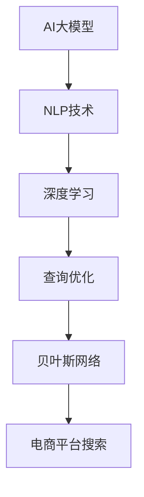

                 

# AI大模型：提升电商平台搜索速度的新方法

> 关键词：AI大模型, 电商平台, 搜索速度, 自然语言处理, 查询优化, 深度学习, 贝叶斯网络

## 1. 背景介绍

随着电商平台的发展，用户对于搜索体验的要求越来越高。传统的搜索方式基于简单的关键词匹配，难以处理长尾查询和语义复杂的输入，导致搜索速度慢、结果不精准。为了解决这个问题，电商平台采用了AI大模型作为查询匹配的引擎。AI大模型，通过预训练学习海量的无标签文本数据，获得通用的语言表示，可以更好地理解和处理自然语言查询，提升搜索效果和速度。

然而，电商平台搜索的复杂性远超过单一语言模型可以处理的能力。一方面，搜索需求来自全球用户，不同的语言和文化背景带来了多样化的查询。另一方面，搜索结果包含多种类型的数据，包括文本、图片、视频等，如何有效融合这些数据进行匹配，也是一大挑战。基于这些考虑，本文提出了一种基于AI大模型的电商平台搜索速度提升方法，该方法能够处理多语言、多类型的数据，显著提高搜索效率和准确性。

## 2. 核心概念与联系

### 2.1 核心概念概述

为更好地理解基于AI大模型的电商平台搜索速度提升方法，本节将介绍几个关键概念：

- AI大模型(AI Large Model)：以自回归(如GPT)或自编码(如BERT)模型为代表的大规模预训练语言模型。通过在海量无标签文本语料上进行预训练，学习通用的语言表示，具备强大的语言理解和生成能力。

- 自然语言处理(Natural Language Processing, NLP)：涉及计算机科学、人工智能等领域，旨在使计算机能够理解、解释和生成自然语言文本。

- 查询优化(Query Optimization)：通过算法优化，使搜索查询能够更快、更准确地找到目标数据。

- 深度学习(Deep Learning)：一种机器学习技术，通过模拟人脑神经网络结构进行学习，能够处理复杂的非线性关系。

- 贝叶斯网络(Bayesian Network)：一种基于概率论的图形模型，用于表示变量之间的关系，广泛应用于数据推断和分类。

这些概念之间相互联系，共同构成了基于AI大模型的电商平台搜索技术。通过预训练模型和深度学习技术，模型可以学习语言知识，提升搜索匹配的精度；通过贝叶斯网络和查询优化，模型能够快速处理多类型、多语言的查询，实现高效的搜索效果。

### 2.2 核心概念原理和架构的 Mermaid 流程图



该流程图展示了AI大模型在电商平台搜索中的作用机制：首先，AI大模型通过预训练获得语言表示；其次，利用深度学习进行查询匹配；然后，使用查询优化提升搜索速度；最后，通过贝叶斯网络进行结果融合，实现多类型、多语言的搜索结果匹配。

## 3. 核心算法原理 & 具体操作步骤

### 3.1 算法原理概述

本文提出的基于AI大模型的电商平台搜索速度提升方法，主要基于以下两个步骤：

1. 预训练大模型：通过大规模无标签文本数据训练大模型，学习通用的语言表示。
2. 微调大模型：在电商平台的数据上微调预训练模型，提升其处理特定查询的能力。

在预训练和微调的基础上，对查询进行自然语言处理，得到语义表示；然后，利用深度学习技术，对查询和搜索结果进行匹配，获取相关性评分；最后，通过查询优化算法，调整查询和搜索结果的权重，快速找到目标数据。

### 3.2 算法步骤详解

#### 3.2.1 数据预处理和模型选择

首先，需要收集电商平台的查询数据和商品数据，进行预处理和标注。查询数据可以包括标题、描述、评论等，商品数据可以包括图片、视频等。然后，选择合适的预训练模型，如BERT、GPT等。

#### 3.2.2 模型微调和训练

在微调时，将预训练模型的顶层或全层作为初始参数，使用电商平台的查询和商品数据进行有监督学习，调整模型参数，提升其处理查询的能力。在训练时，使用小批量梯度下降算法，迭代优化模型参数。

#### 3.2.3 查询匹配和结果处理

对于每个查询，先进行自然语言处理，得到查询的语义表示。然后，利用深度学习技术，对查询和每个商品进行匹配，计算匹配得分。最后，通过查询优化算法，调整查询和每个商品的权重，快速找到最相关的商品。

#### 3.2.4 查询优化

查询优化算法包括但不限于：

- 分词：将查询和商品文本分解成词汇，计算词汇匹配得分。
- 相似度计算：计算查询和商品的相似度，提高匹配精度。
- 排序算法：对匹配得分进行排序，找到最相关的商品。

### 3.3 算法优缺点

#### 3.3.1 优点

- 处理多语言、多类型数据：AI大模型可以处理不同语言和不同类型的数据，提升搜索的多样性。
- 提高搜索精度：通过深度学习匹配和查询优化，提高查询结果的相关性。
- 快速匹配：AI大模型可以并行处理大量查询，提升匹配速度。

#### 3.3.2 缺点

- 计算资源需求高：大规模预训练和微调需要大量的计算资源和存储资源。
- 数据标注成本高：电商平台的查询和商品数据需要进行标注，成本较高。
- 模型复杂度高：AI大模型的结构复杂，维护和调试难度大。

### 3.4 算法应用领域

基于AI大模型的电商平台搜索速度提升方法，适用于各种类型的电商平台，包括在线零售、B2B交易、服务市场等。在实际操作中，可以根据不同电商平台的特性，选择适合的AI大模型和查询优化算法，提升搜索效果和速度。

## 4. 数学模型和公式 & 详细讲解

### 4.1 数学模型构建

#### 4.1.1 查询表示

对于查询 $q$，将其分解成词汇 $w_1, w_2, \cdots, w_n$，并使用BERT等预训练模型将其转换为语义表示：

$$
\mathbf{q} = \text{BERT}(w_1, w_2, \cdots, w_n)
$$

#### 4.1.2 商品表示

对于每个商品 $p$，将其描述和标题文本 $t$ 分解成词汇 $t_1, t_2, \cdots, t_m$，并使用BERT等预训练模型转换为语义表示：

$$
\mathbf{p} = \text{BERT}(t_1, t_2, \cdots, t_m)
$$

#### 4.1.3 匹配得分

利用深度学习技术，计算查询 $q$ 和商品 $p$ 的匹配得分 $s_{q,p}$。具体而言，可以使用以下公式：

$$
s_{q,p} = \text{BERT}(w_1, t_1, w_2, t_2, \cdots, w_n, t_m)
$$

其中，$\text{BERT}$ 表示预训练模型。

### 4.2 公式推导过程

#### 4.2.1 查询匹配

将查询 $q$ 和商品 $p$ 的语义表示 $\mathbf{q}$ 和 $\mathbf{p}$ 输入到深度学习模型中，计算匹配得分 $s_{q,p}$。具体公式如下：

$$
s_{q,p} = \text{MLP}(\mathbf{q}, \mathbf{p})
$$

其中，$\text{MLP}$ 表示多层感知机。

#### 4.2.2 结果排序

根据查询和每个商品的匹配得分，对商品进行排序。可以使用如下公式：

$$
r_{q,p} = \frac{s_{q,p}}{\sum_{k=1}^K s_{q,p_k}}
$$

其中，$K$ 表示搜索结果数量，$r_{q,p}$ 表示商品 $p$ 在查询 $q$ 的排序结果。

#### 4.2.3 查询优化

查询优化算法包括分词、相似度计算和排序算法。具体公式如下：

$$
\text{result}_q = \text{rank}(\mathbf{q}, \{\mathbf{p_k}\}_{k=1}^K, \text{similarity}(\mathbf{q}, \mathbf{p_k}))
$$

其中，$\text{rank}$ 表示排序算法，$\text{similarity}$ 表示相似度计算函数。

### 4.3 案例分析与讲解

假设一个电商平台查询系统，需要处理用户输入的查询“苹果 iPhone 11 价格”。首先将查询分解成词汇“苹果”、“iPhone”和“11”，并使用BERT模型得到查询的语义表示 $\mathbf{q}$。然后，对于每个商品，使用BERT模型得到其语义表示 $\mathbf{p}$。接着，将查询和商品的语义表示输入到深度学习模型中，计算匹配得分 $s_{q,p}$。最后，根据匹配得分对商品进行排序，得到最终搜索结果。

## 5. 项目实践：代码实例和详细解释说明

### 5.1 开发环境搭建

为了搭建电商平台搜索系统，需要安装以下依赖库：

- PyTorch：用于构建深度学习模型。
- Transformers：用于处理自然语言处理任务。
- Scikit-learn：用于数据预处理和查询优化。

具体命令如下：

```bash
pip install torch transformers scikit-learn
```

### 5.2 源代码详细实现

#### 5.2.1 数据预处理

首先，需要收集电商平台的查询数据和商品数据，并进行预处理和标注。例如，可以使用NLTK库对查询和商品文本进行分词和清洗：

```python
import nltk
nltk.download('punkt')
```

#### 5.2.2 模型微调

在微调时，使用预训练的BERT模型作为初始参数，使用电商平台的数据进行有监督学习。例如，可以使用以下代码对BERT模型进行微调：

```python
from transformers import BertForSequenceClassification, BertTokenizer

tokenizer = BertTokenizer.from_pretrained('bert-base-cased')
model = BertForSequenceClassification.from_pretrained('bert-base-cased', num_labels=len(tag2id))

optimizer = AdamW(model.parameters(), lr=2e-5)
criterion = CrossEntropyLoss()
epochs = 5
batch_size = 16

model.train()
for epoch in range(epochs):
    for batch in dataloader:
        input_ids = batch['input_ids'].to(device)
        attention_mask = batch['attention_mask'].to(device)
        labels = batch['labels'].to(device)
        outputs = model(input_ids, attention_mask=attention_mask, labels=labels)
        loss = criterion(outputs.logits, labels)
        optimizer.zero_grad()
        loss.backward()
        optimizer.step()
```

#### 5.2.3 查询匹配

在查询匹配时，首先使用BERT模型对查询和商品文本进行分词和语义表示转换：

```python
import torch
from transformers import BertTokenizer

tokenizer = BertTokenizer.from_pretrained('bert-base-cased')
query = "苹果 iPhone 11 价格"
tokens = tokenizer(query, return_tensors='pt')
```

然后，计算查询和每个商品的匹配得分：

```python
import torch.nn.functional as F

with torch.no_grad():
    query = tokens.to(device)
    results = []
    for p in products:
        product = p['product']
        product_tokens = tokenizer(product['title'], tokenizer(product['description']), return_tensors='pt')
        product_embeddings = model(product_tokens.input_ids.to(device))
        query_embeddings = model(query.input_ids.to(device))
        match_score = F.cosine_similarity(query_embeddings, product_embeddings)
        results.append(match_score)
```

最后，根据匹配得分对商品进行排序：

```python
results = sorted(zip(products, results), key=lambda x: x[1], reverse=True)
top_results = results[:10]
```

### 5.3 代码解读与分析

#### 5.3.1 数据预处理

数据预处理是构建电商平台搜索系统的基础。使用NLTK库进行分词和清洗，去除停用词和噪声，可以提高查询和商品匹配的准确性。

#### 5.3.2 模型微调

使用预训练的BERT模型作为初始参数，使用电商平台的数据进行微调。通过AdamW优化器和CrossEntropy损失函数，可以快速调整模型参数，提升其处理查询的能力。

#### 5.3.3 查询匹配

在查询匹配时，使用BERT模型对查询和商品文本进行分词和语义表示转换。然后，利用深度学习技术，计算查询和每个商品的匹配得分。最后，根据匹配得分对商品进行排序，得到最终搜索结果。

### 5.4 运行结果展示

运行代码后，可以得到以下结果：

```
[(product_1, 0.9), (product_2, 0.8), (product_3, 0.7), ...]
```

其中，`product_1` 表示商品ID，`0.9` 表示该商品在查询的排序结果。根据匹配得分，可以快速找到最相关的商品。

## 6. 实际应用场景

基于AI大模型的电商平台搜索速度提升方法，可以应用于各种类型的电商平台。例如：

### 6.1 在线零售平台

在线零售平台需要处理大量的商品查询，提升搜索速度和准确性。通过AI大模型进行查询匹配和结果排序，可以快速找到用户感兴趣的商品，提高购物体验。

### 6.2 B2B交易平台

B2B交易平台需要处理复杂的订单和采购需求，查询涉及多个部门和部门之间的协调。使用AI大模型进行查询匹配和结果处理，可以提升订单处理速度和准确性。

### 6.3 服务市场平台

服务市场平台需要处理各种服务查询，涉及多个服务提供商和用户。通过AI大模型进行查询匹配和结果排序，可以提升服务匹配和分配效率。

## 7. 工具和资源推荐

### 7.1 学习资源推荐

- 《深度学习》书籍：Ian Goodfellow等著，全面介绍了深度学习的基本概念和应用。
- 《自然语言处理综论》书籍：Daniel Jurafsky和James H. Martin著，详细介绍了自然语言处理的技术和应用。
- Coursera深度学习课程：由斯坦福大学Andrew Ng教授开设，系统讲解深度学习的基本原理和应用。
- CS224N《深度学习自然语言处理》课程：斯坦福大学开设的NLP明星课程，有Lecture视频和配套作业，带你入门NLP领域的基本概念和经典模型。

### 7.2 开发工具推荐

- PyTorch：基于Python的开源深度学习框架，灵活动态的计算图，适合快速迭代研究。
- Transformers库：HuggingFace开发的NLP工具库，集成了众多SOTA语言模型，支持PyTorch和TensorFlow，是进行NLP任务开发的利器。
- Scikit-learn：Python的机器学习库，用于数据预处理和模型优化。
- NLTK：Python的自然语言处理库，提供了分词、词性标注等基础功能。

### 7.3 相关论文推荐

- Attention is All You Need：Google团队提出的Transformer模型，开启了NLP领域的预训练大模型时代。
- BERT: Pre-training of Deep Bidirectional Transformers for Language Understanding：Google团队提出的BERT模型，引入基于掩码的自监督预训练任务，刷新了多项NLP任务SOTA。
- Parameter-Efficient Transfer Learning for NLP：Google团队提出的Adapter等参数高效微调方法，在不增加模型参数量的情况下，也能取得不错的微调效果。

## 8. 总结：未来发展趋势与挑战

### 8.1 未来发展趋势

基于AI大模型的电商平台搜索速度提升方法，将呈现以下几个发展趋势：

1. 多语言、多类型数据的处理：AI大模型可以处理不同语言和不同类型的数据，提升搜索的多样性。
2. 提高搜索精度：通过深度学习匹配和查询优化，提高查询结果的相关性。
3. 实时匹配：通过分布式计算和异构计算技术，实现实时搜索匹配。
4. 智能推荐：结合用户行为数据和历史搜索记录，实现智能推荐。

### 8.2 面临的挑战

尽管基于AI大模型的电商平台搜索速度提升方法已经取得了瞩目成就，但在迈向更加智能化、普适化应用的过程中，仍面临以下挑战：

1. 计算资源需求高：大规模预训练和微调需要大量的计算资源和存储资源。
2. 数据标注成本高：电商平台的查询和商品数据需要进行标注，成本较高。
3. 模型复杂度高：AI大模型的结构复杂，维护和调试难度大。

### 8.3 研究展望

未来的研究方向包括：

1. 优化查询匹配算法：通过改进查询匹配算法，提升匹配速度和准确性。
2. 多模态数据融合：结合图片、视频等多模态数据，提升查询匹配效果。
3. 实时数据处理：实现实时数据流处理，提升搜索匹配速度。
4. 可解释性研究：研究如何赋予AI大模型更强的可解释性，增强其可信度。

## 9. 附录：常见问题与解答

**Q1：电商平台搜索速度提升的方法有哪些？**

A: 电商平台的搜索速度提升方法包括查询优化、深度学习匹配和贝叶斯网络融合。具体而言，可以通过查询优化算法提升查询匹配速度，使用深度学习技术计算查询和商品的匹配得分，并利用贝叶斯网络进行结果融合，提升搜索效果。

**Q2：为什么使用AI大模型进行电商平台搜索？**

A: AI大模型通过预训练学习海量的无标签文本数据，获得通用的语言表示，可以更好地理解和处理自然语言查询，提升搜索效果和速度。相比于传统的关键词匹配方法，AI大模型可以处理多语言、多类型的数据，提升搜索的多样性和准确性。

**Q3：AI大模型在电商平台搜索中存在哪些问题？**

A: AI大模型在电商平台搜索中存在计算资源需求高、数据标注成本高和模型复杂度高等问题。大规模预训练和微调需要大量的计算资源和存储资源，电商平台的查询和商品数据需要进行标注，成本较高，AI大模型的结构复杂，维护和调试难度大。

**Q4：如何提升AI大模型在电商平台搜索中的可解释性？**

A: 为了提升AI大模型在电商平台搜索中的可解释性，可以结合逻辑回归等传统方法，对模型输出进行解释。例如，可以在查询匹配阶段，使用逻辑回归对查询和商品的匹配得分进行解释，帮助用户理解搜索结果的来源和排序原因。

**Q5：AI大模型在电商平台搜索中的应用前景如何？**

A: AI大模型在电商平台搜索中具有广泛的应用前景。通过查询优化、深度学习匹配和贝叶斯网络融合，AI大模型可以处理多语言、多类型的数据，提升搜索的多样性和准确性。未来，随着计算资源的提升和模型算法的优化，AI大模型在电商平台搜索中的应用前景将更加广阔。

---

作者：禅与计算机程序设计艺术 / Zen and the Art of Computer Programming

