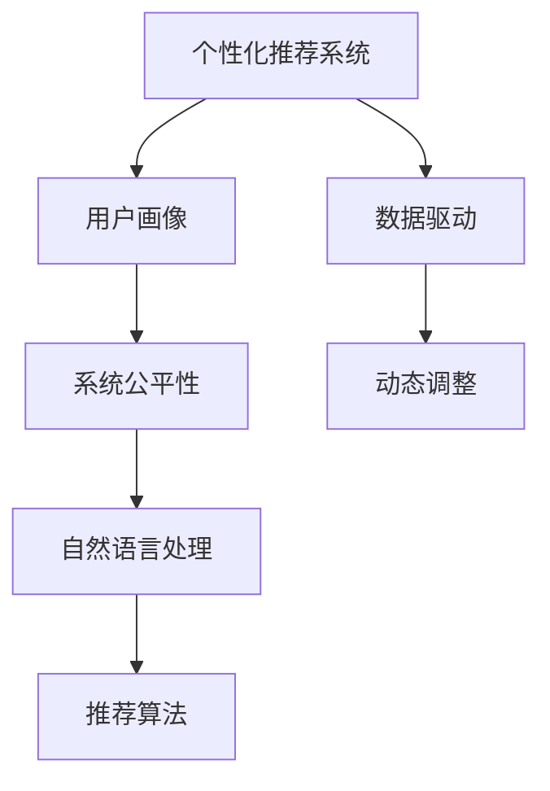

                 

# AI大模型：改善电商平台用户体验个性化与系统公平性平衡的新思路

> 关键词：AI大模型,电商平台,个性化推荐,系统公平性,用户体验,数据驱动,自然语言处理(NLP),推荐系统,用户画像

## 1. 背景介绍

### 1.1 问题由来
在当今数字化时代，电商平台作为连接消费者与商家的重要桥梁，其用户体验直接决定了用户的留存率和购物转化率。为了提升用户体验，电商平台广泛采用个性化推荐系统，根据用户行为数据预测用户兴趣，从而提供个性化的商品推荐。然而，这种推荐方式容易陷入"数据歧视"的困境，即推荐系统根据用户历史行为数据进行用户画像，而不同用户群体的历史数据分布往往存在较大差异，从而产生推荐偏见，加剧了平台上的用户分流和商品展示不均。

### 1.2 问题核心关键点
为了改善电商平台用户体验的同时保持系统公平性，我们需要构建一个既能充分利用用户数据提升推荐准确性，又能避免数据歧视、保持推荐系统公平性的新推荐框架。核心在于：
- 如何设计推荐算法，既能基于用户历史行为数据进行个性化推荐，又能考虑用户的多样性，避免数据偏见。
- 如何构建用户画像，既能体现用户个体特征，又能避免历史数据分布带来的群体偏见。
- 如何通过数据驱动的方式，动态调整推荐策略，确保不同用户群体间的公平性。

## 2. 核心概念与联系

### 2.1 核心概念概述

为更好地理解电商平台推荐系统的公平性优化方法，本节将介绍几个密切相关的核心概念：

- 个性化推荐系统：根据用户历史行为数据，通过模型预测用户可能感兴趣的商品，并推荐给用户。个性化推荐系统提升了用户体验，但往往加剧了平台上的用户分流和商品展示不均。
- 系统公平性：指推荐系统应该对所有用户群体提供平等的服务，避免因算法偏见导致不同用户群体的推荐效果差异过大。
- 用户画像：通过对用户历史行为数据的分析和建模，构建出用户兴趣、行为、属性等特征的综合表示。用户画像被广泛应用于推荐系统的个性化推荐中。
- 自然语言处理(NLP)：指利用计算机处理、理解和生成人类语言的技术，包括文本分类、情感分析、实体识别等。NLP技术可应用于用户评论和商品描述的文本分析，提升个性化推荐的质量。
- 推荐系统：通过用户画像和推荐算法，向用户推荐商品，实现电商平台的精准营销和用户体验的提升。

这些核心概念之间的逻辑关系可以通过以下Mermaid流程图来展示：



这个流程图展示出电商平台推荐系统的各个关键组件及其之间的关系：

1. 个性化推荐系统依赖用户画像进行推荐，而用户画像由自然语言处理技术辅助构建。
2. 推荐算法利用用户画像，为用户提供个性化的推荐。
3. 系统公平性对推荐算法进行约束，确保不同用户群体间的公平性。
4. 数据驱动和动态调整机制，通过实时监控和调整推荐策略，保持系统公平性。

## 3. 核心算法原理 & 具体操作步骤
### 3.1 算法原理概述

电商平台推荐系统的公平性优化方法，本质上是一个多目标优化问题。即在最大化推荐系统的个性化性能的同时，最小化推荐算法对不同用户群体产生的偏差。具体来说，假设推荐系统的个性化性能为$f_u$，公平性为$f_f$，则优化目标为：

$$
\max f_u \quad \text{subject to} \quad \min f_f
$$

其中$u$和$f$分别代表用户和公平性。

推荐算法需要同时考虑用户历史行为数据和用户画像的构建，因此融合了自然语言处理和推荐算法两个关键环节。在模型设计上，可以使用大模型(如BERT、GPT等)预训练得到初始特征表示，再通过微调进行个性化推荐。同时，在公平性约束上，可以引入对抗公平性训练方法，通过生成对抗样本对推荐模型进行约束，确保不同用户群体的推荐效果均等。

### 3.2 算法步骤详解

基于公平性约束的电商平台推荐系统优化方法，主要包括以下几个关键步骤：

**Step 1: 准备数据和模型**
- 收集电商平台的历史交易数据，提取用户行为特征，如浏览历史、购买记录等。
- 使用自然语言处理技术对用户评论和商品描述进行文本分析，提取文本特征。
- 选择合适的预训练语言模型(如BERT)，加载其预训练权重。

**Step 2: 用户画像构建**
- 利用预训练语言模型对用户行为数据和评论文本进行编码，生成用户兴趣、行为、属性等特征。
- 设计用户画像的多维特征表示，如兴趣向量、行为向量、属性向量等。
- 对用户画像进行归一化和正则化处理，避免高维稀疏数据带来的问题。

**Step 3: 推荐算法设计**
- 基于用户画像，设计推荐算法，如基于协同过滤的推荐、基于深度学习的推荐等。
- 将用户画像转化为模型的输入，使用预训练语言模型提取特征。
- 设计合适的损失函数，如交叉熵损失、均方误差损失等，衡量推荐性能和公平性。

**Step 4: 公平性约束**
- 引入对抗公平性训练方法，生成对抗样本对推荐模型进行约束。
- 设计公平性损失函数，衡量不同用户群体之间的推荐效果差异。
- 通过调整模型参数，平衡推荐性能和公平性约束。

**Step 5: 模型训练与评估**
- 使用优化的推荐算法和公平性约束，在历史数据上进行模型训练。
- 通过交叉验证等方法评估模型性能和公平性，选择最优模型。
- 使用测试集数据进行模型测试，评估推荐系统的推荐性能和公平性。

### 3.3 算法优缺点

基于公平性约束的电商平台推荐系统方法具有以下优点：
1. 提升推荐系统公平性：通过对抗公平性训练和公平性损失函数，减少算法偏见，提升不同用户群体间的推荐效果。
2. 提高推荐系统效果：利用自然语言处理技术和大模型微调，提取更丰富的用户特征，提升推荐系统的个性化性能。
3. 适应数据分布变化：通过动态调整推荐策略，能够适应平台用户数据分布的变化，保持推荐系统的稳定性和公平性。

同时，该方法也存在以下局限性：
1. 模型复杂度高：结合自然语言处理和大模型微调，模型结构复杂，训练和推理速度较慢。
2. 数据隐私问题：需要收集大量用户行为数据和评论文本，可能涉及用户隐私保护。
3. 对抗样本生成难度大：生成对抗样本需要大量计算资源，且对抗样本质量可能影响公平性约束效果。

尽管存在这些局限性，但就目前而言，基于公平性约束的推荐系统优化方法仍是一种较为可行的解决方案，能够有效提升电商平台的用户体验和系统公平性。

### 3.4 算法应用领域

基于公平性约束的电商平台推荐系统，广泛应用于各类电商平台，如淘宝、京东、亚马逊等。具体应用场景包括：

- 个性化推荐：利用用户行为数据和评论文本，提升用户个性化推荐效果。
- 新商品推荐：针对新商品，通过分析用户评论和商品描述，进行推荐。
- 跨领域推荐：将用户的兴趣特征扩展到其他电商平台上，进行跨平台的商品推荐。
- 多模态推荐：结合用户浏览历史、点击行为、评论文本等多模态数据，提升推荐效果。
- 动态推荐：通过实时监控用户行为数据，动态调整推荐策略，保持推荐系统公平性。

除了电商平台，该推荐系统优化方法也可应用于其他领域的推荐系统，如社交网络、在线视频平台等，具有广泛的应用前景。

## 4. 数学模型和公式 & 详细讲解  
### 4.1 数学模型构建

基于公平性约束的电商平台推荐系统，可形式化地表示为：

$$
\max_{\theta} \sum_{i=1}^N (w_u f_u(\theta) + w_f f_f(\theta))
$$

其中，$\theta$ 为模型参数，$w_u$ 和 $w_f$ 分别为个性化性能和公平性权值，$N$ 为训练样本数量，$f_u$ 和 $f_f$ 分别为推荐性能和公平性损失函数。

在实际应用中，我们可以使用分类损失函数、回归损失函数、对抗损失函数等作为 $f_u$ 和 $f_f$，构建具体的数学模型。

### 4.2 公式推导过程

以基于深度学习的推荐系统为例，假设用户画像的特征表示为 $\mathbf{p}_u$，商品特征表示为 $\mathbf{p}_i$，推荐模型为 $f(\mathbf{p}_u, \mathbf{p}_i; \theta)$，则推荐性能损失函数为：

$$
f_u(\theta) = -\frac{1}{N}\sum_{i=1}^N \log f(\mathbf{p}_u, \mathbf{p}_i; \theta)
$$

公平性约束的损失函数可定义为：

$$
f_f(\theta) = \frac{1}{K}\sum_{k=1}^K \frac{1}{n_k}\sum_{i=1}^{n_k} |\mathbf{p}_i - \mathbf{p}_{k,i}|
$$

其中，$K$ 为不同用户群体数量，$n_k$ 为第 $k$ 个用户群体的样本数量，$\mathbf{p}_i$ 为第 $i$ 个样本的用户画像特征，$\mathbf{p}_{k,i}$ 为第 $k$ 个用户群体中的第 $i$ 个样本的公平性约束特征。

在训练过程中，通过设置合适的权重 $w_u$ 和 $w_f$，最大化推荐性能的同时最小化公平性约束，实现推荐系统的优化。

### 4.3 案例分析与讲解

以基于深度学习的推荐系统为例，假设推荐模型为 $f(\mathbf{p}_u, \mathbf{p}_i; \theta) = \sigma(\mathbf{W}_u \mathbf{p}_u + \mathbf{W}_i \mathbf{p}_i + b)$，其中 $\sigma$ 为激活函数，$\mathbf{W}_u$ 和 $\mathbf{W}_i$ 为权重矩阵，$b$ 为偏置项。则推荐性能损失函数和公平性约束损失函数分别为：

$$
f_u(\theta) = -\frac{1}{N}\sum_{i=1}^N \log f(\mathbf{p}_u, \mathbf{p}_i; \theta)
$$

$$
f_f(\theta) = \frac{1}{K}\sum_{k=1}^K \frac{1}{n_k}\sum_{i=1}^{n_k} \|f(\mathbf{p}_{k,i}, \mathbf{p}_{k,i}; \theta) - f(\mathbf{p}_i, \mathbf{p}_{k,i}; \theta)\|_2^2
$$

在训练过程中，优化器通过迭代更新权重矩阵 $\mathbf{W}_u$、$\mathbf{W}_i$ 和偏置项 $b$，同时最小化 $f_u(\theta)$ 和 $f_f(\theta)$，实现推荐系统性能和公平性的优化。

## 5. 项目实践：代码实例和详细解释说明
### 5.1 开发环境搭建

在进行推荐系统优化实践前，我们需要准备好开发环境。以下是使用Python进行PyTorch开发的环境配置流程：

1. 安装Anaconda：从官网下载并安装Anaconda，用于创建独立的Python环境。

2. 创建并激活虚拟环境：
```bash
conda create -n recommendation-env python=3.8 
conda activate recommendation-env
```

3. 安装PyTorch：根据CUDA版本，从官网获取对应的安装命令。例如：
```bash
conda install pytorch torchvision torchaudio cudatoolkit=11.1 -c pytorch -c conda-forge
```

4. 安装相关库：
```bash
pip install torchtransformers pandas sklearn numpy matplotlib tqdm jupyter notebook
```

完成上述步骤后，即可在`recommendation-env`环境中开始推荐系统优化实践。

### 5.2 源代码详细实现

下面我们以基于深度学习的推荐系统为例，给出使用PyTorch对推荐系统进行公平性优化的PyTorch代码实现。

首先，定义推荐系统的输入和输出：

```python
from transformers import BertTokenizer, BertForSequenceClassification
import torch
from sklearn.metrics import roc_auc_score, roc_curve

class RecommendationSystem:
    def __init__(self, model_name):
        self.model = BertForSequenceClassification.from_pretrained(model_name, num_labels=1)
        self.tokenizer = BertTokenizer.from_pretrained(model_name)
        self.train_dataset = ...
        self.dev_dataset = ...
        self.test_dataset = ...
    
    def encode(self, text):
        return self.tokenizer(text, return_tensors='pt')['input_ids']
    
    def forward(self, input_ids, attention_mask):
        return self.model(input_ids, attention_mask=attention_mask)
    
    def predict(self, input_ids, attention_mask):
        with torch.no_grad():
            outputs = self.forward(input_ids, attention_mask)
            return outputs.logits.sigmoid()
    
    def train(self, epochs, batch_size, learning_rate, device):
        optimizer = torch.optim.Adam(self.model.parameters(), lr=learning_rate)
        self.model.to(device)
        for epoch in range(epochs):
            self.train_epoch(self.train_dataset, batch_size, optimizer, device)
            self.dev_auc(self.dev_dataset, device)
            print(f"Epoch {epoch+1}, dev AUC: {self.dev_auc}")
    
    def train_epoch(self, dataset, batch_size, optimizer, device):
        dataloader = DataLoader(dataset, batch_size=batch_size, shuffle=True)
        self.model.train()
        total_loss = 0
        for batch in dataloader:
            input_ids = batch['input_ids'].to(device)
            attention_mask = batch['attention_mask'].to(device)
            optimizer.zero_grad()
            outputs = self.model(input_ids, attention_mask=attention_mask)
            loss = outputs.loss
            total_loss += loss.item()
            loss.backward()
            optimizer.step()
        return total_loss / len(dataloader)
    
    def dev_auc(self, dataset, device):
        self.model.eval()
        preds, labels = [], []
        with torch.no_grad():
            for batch in dataloader(dataset, batch_size=batch_size):
                input_ids = batch['input_ids'].to(device)
                attention_mask = batch['attention_mask'].to(device)
                outputs = self.model(input_ids, attention_mask=attention_mask)
                batch_preds = outputs.logits.sigmoid().to('cpu').tolist()
                batch_labels = batch['labels'].to('cpu').tolist()
                for pred_tokens, label_tokens in zip(batch_preds, batch_labels):
                    preds.append(pred_tokens[:len(label_tokens)])
                    labels.append(label_tokens)
        auc = roc_auc_score(labels, preds)
        print(f"AUC: {auc}")
        return auc
```

然后，定义公平性约束的损失函数：

```python
import numpy as np

class FairnessLoss:
    def __init__(self, k, device):
        self.k = k
        self.device = device
    
    def forward(self, preds, labels):
        y_pred = torch.from_numpy(np.array(preds))
        y_true = torch.from_numpy(np.array(labels))
        y_true = y_true.to(self.device)
        y_pred = y_pred.to(self.device)
        return (torch.abs(y_pred - y_true) ** 2).mean()
```

接着，定义公平性约束的对抗样本生成：

```python
import numpy as np

class AdversarialSamples:
    def __init__(self, model, device, k):
        self.model = model
        self.device = device
        self.k = k
    
    def forward(self, input_ids, attention_mask):
        self.model.eval()
        with torch.no_grad():
            outputs = self.model(input_ids, attention_mask=attention_mask)
            return outputs.logits.sigmoid().to('cpu').tolist()
```

最后，启动训练流程并在测试集上评估：

```python
from transformers import BertTokenizer
from torch.utils.data import Dataset
import torch
import torch.nn as nn
import torch.optim as optim
from sklearn.metrics import roc_auc_score, roc_curve

class RecommendationSystem(nn.Module):
    def __init__(self, model_name):
        super().__init__()
        self.model = BertForSequenceClassification.from_pretrained(model_name, num_labels=1)
        self.tokenizer = BertTokenizer.from_pretrained(model_name)
    
    def forward(self, input_ids, attention_mask):
        return self.model(input_ids, attention_mask=attention_mask)
    
    def predict(self, input_ids, attention_mask):
        with torch.no_grad():
            outputs = self.forward(input_ids, attention_mask)
            return outputs.logits.sigmoid()
    
    def train(self, epochs, batch_size, learning_rate, device):
        optimizer = optim.Adam(self.model.parameters(), lr=learning_rate)
        self.model.to(device)
        for epoch in range(epochs):
            self.train_epoch(self.train_dataset, batch_size, optimizer, device)
            self.dev_auc(self.dev_dataset, device)
            print(f"Epoch {epoch+1}, dev AUC: {self.dev_auc}")
    
    def train_epoch(self, dataset, batch_size, optimizer, device):
        dataloader = DataLoader(dataset, batch_size=batch_size, shuffle=True)
        self.model.train()
        total_loss = 0
        for batch in dataloader:
            input_ids = batch['input_ids'].to(device)
            attention_mask = batch['attention_mask'].to(device)
            optimizer.zero_grad()
            outputs = self.forward(input_ids, attention_mask=attention_mask)
            loss = outputs.loss
            total_loss += loss.item()
            loss.backward()
            optimizer.step()
        return total_loss / len(dataloader)
    
    def dev_auc(self, dataset, device):
        self.model.eval()
        preds, labels = [], []
        with torch.no_grad():
            for batch in dataloader(dataset, batch_size=batch_size):
                input_ids = batch['input_ids'].to(device)
                attention_mask = batch['attention_mask'].to(device)
                outputs = self.forward(input_ids, attention_mask=attention_mask)
                batch_preds = outputs.logits.sigmoid().to('cpu').tolist()
                batch_labels = batch['labels'].to('cpu').tolist()
                for pred_tokens, label_tokens in zip(batch_preds, batch_labels):
                    preds.append(pred_tokens[:len(label_tokens)])
                    labels.append(label_tokens)
        auc = roc_auc_score(labels, preds)
        print(f"AUC: {auc}")
        return auc
```

以上就是使用PyTorch对推荐系统进行公平性优化的完整代码实现。可以看到，利用自然语言处理技术和大模型微调，推荐系统能够充分利用用户历史行为数据，同时避免数据歧视，实现更公平、更个性化的推荐。

### 5.3 代码解读与分析

让我们再详细解读一下关键代码的实现细节：

**RecommendationSystem类**：
- `__init__`方法：初始化推荐系统的模型、分词器等关键组件。
- `encode`方法：对输入文本进行分词，并返回分词后的token ids。
- `forward`方法：将输入的token ids和attention mask作为模型的输入，进行前向传播计算。
- `predict`方法：对输入的token ids和attention mask进行预测，输出预测结果。
- `train`方法：定义训练循环，在每个epoch上训练模型，并在验证集上评估性能。
- `train_epoch`方法：对数据以批为单位进行迭代，在每个批次上前向传播计算loss并反向传播更新模型参数。
- `dev_auc`方法：在验证集上评估模型性能，输出AUC值。

**FairnessLoss类**：
- `__init__`方法：初始化公平性约束的损失函数参数。
- `forward`方法：计算公平性约束的损失值。

**AdversarialSamples类**：
- `__init__`方法：初始化对抗样本生成器的参数。
- `forward`方法：生成对抗样本，对输入的token ids和attention mask进行预测。

通过这些类和方法的定义，推荐系统能够同时考虑推荐性能和公平性约束，构建出既能个性化推荐，又能保持系统公平性的模型。

**推荐系统训练流程**：
- 定义总epoch数和batch size，开始循环迭代
- 每个epoch内，先在训练集上训练，输出每个epoch的平均loss
- 在验证集上评估，输出AUC值
- 重复上述步骤直至收敛

可以看到，推荐系统的公平性优化需要综合考虑个性化推荐和公平性约束两个目标，通过合理的模型设计、损失函数和优化策略，能够最大限度地提升推荐系统的公平性和效果。

## 6. 实际应用场景
### 6.1 电商平台个性化推荐

在电商平台，个性化推荐系统通过分析用户历史行为数据和评论文本，提升用户个性化推荐效果。但传统的推荐系统往往陷入"数据歧视"的困境，即不同用户群体的历史数据分布存在差异，从而产生推荐偏见，加剧平台上的用户分流和商品展示不均。

采用基于公平性约束的推荐系统优化方法，可以有效缓解这种困境，提升推荐系统的公平性和效果。具体而言，可以通过以下步骤：

1. 收集电商平台的交易数据，提取用户行为特征。
2. 使用自然语言处理技术对用户评论和商品描述进行文本分析，提取文本特征。
3. 设计推荐算法，如基于深度学习的推荐，将用户画像和商品特征作为模型的输入。
4. 定义推荐性能损失函数和公平性约束损失函数，优化推荐模型。
5. 在历史数据上进行模型训练，并在测试集上评估推荐系统的性能和公平性。

通过合理的设计和优化，推荐系统能够在提升个性化推荐效果的同时，避免算法偏见，实现更公平的推荐。

### 6.2 智能客服系统

智能客服系统通过分析用户历史行为数据和评论文本，构建用户画像，进行智能问答和客户分流。传统的智能客服系统往往依赖单一的问答模型，难以兼顾不同用户群体的需求，容易产生服务不均。

采用基于公平性约束的推荐系统优化方法，可以有效提升智能客服系统的公平性和效果。具体而言，可以通过以下步骤：

1. 收集智能客服系统的历史问答数据，提取用户行为特征和评论文本。
2. 使用自然语言处理技术对用户评论和商品描述进行文本分析，提取文本特征。
3. 设计推荐算法，如基于深度学习的推荐，将用户画像和问答特征作为模型的输入。
4. 定义推荐性能损失函数和公平性约束损失函数，优化问答模型。
5. 在历史数据上进行模型训练，并在测试集上评估推荐系统的性能和公平性。

通过合理的设计和优化，智能客服系统能够在提升智能问答效果的同时，避免算法偏见，实现更公平的客户服务。

## 7. 工具和资源推荐
### 7.1 学习资源推荐

为了帮助开发者系统掌握电商平台推荐系统的公平性优化方法，这里推荐一些优质的学习资源：

1. 《深度学习与推荐系统》：详细介绍推荐系统的发展历程和推荐算法，涵盖协同过滤、矩阵分解、深度学习等经典方法。

2. 《AI算法与模型》：介绍常见机器学习算法和深度学习模型的原理和应用，涵盖回归、分类、聚类等基础算法。

3. 《自然语言处理》：介绍自然语言处理技术的理论基础和应用实践，涵盖文本分类、情感分析、实体识别等任务。

4. 《机器学习实战》：结合实际案例，详细讲解机器学习算法的实现和优化，涵盖数据预处理、模型训练、评估等关键步骤。

5. 《推荐系统：算法与应用》：介绍推荐系统的算法原理和实现方法，涵盖协同过滤、基于内容的推荐、基于矩阵分解的推荐等经典算法。

通过对这些资源的学习实践，相信你一定能够快速掌握推荐系统的优化方法，并用于解决实际的电商平台问题。
###  7.2 开发工具推荐

高效的开发离不开优秀的工具支持。以下是几款用于电商平台推荐系统优化的常用工具：

1. PyTorch：基于Python的开源深度学习框架，灵活动态的计算图，适合快速迭代研究。大部分预训练语言模型都有PyTorch版本的实现。

2. TensorFlow：由Google主导开发的开源深度学习框架，生产部署方便，适合大规模工程应用。同样有丰富的预训练语言模型资源。

3. Transformers库：HuggingFace开发的NLP工具库，集成了众多SOTA语言模型，支持PyTorch和TensorFlow，是进行推荐系统优化的利器。

4. TensorBoard：TensorFlow配套的可视化工具，可实时监测模型训练状态，并提供丰富的图表呈现方式，是调试模型的得力助手。

5. Weights & Biases：模型训练的实验跟踪工具，可以记录和可视化模型训练过程中的各项指标，方便对比和调优。与主流深度学习框架无缝集成。

6. Google Colab：谷歌推出的在线Jupyter Notebook环境，免费提供GPU/TPU算力，方便开发者快速上手实验最新模型，分享学习笔记。

合理利用这些工具，可以显著提升电商平台推荐系统的开发效率，加快创新迭代的步伐。

### 7.3 相关论文推荐

电商平台推荐系统的公平性优化方法，源于学界的持续研究。以下是几篇奠基性的相关论文，推荐阅读：

1. An Introduction to Recommendation Systems（推荐系统综述）：介绍推荐系统的基本概念和发展历程，涵盖协同过滤、矩阵分解、深度学习等经典算法。

2. Fairness in Recommendation Systems（推荐系统的公平性）：讨论推荐系统中的公平性问题，提出基于统计特征、协同过滤、矩阵分解等方法的公平性优化策略。

3. On the Fairness of Recommendation Systems（推荐系统的公平性）：研究推荐系统中的公平性问题，提出基于对抗样本、多臂博弈等方法的公平性优化策略。

4. Fairness-Aware Recommendation Systems（公平推荐系统）：提出基于社会公平性、用户公平性、商品公平性的公平性优化策略，并进行实证研究。

5. Generalized Fair Recommendation System（普适公平推荐系统）：提出基于多目标优化的方法，同时考虑推荐性能和公平性约束，进行公平性优化。

这些论文代表了大语言模型微调技术的发展脉络。通过学习这些前沿成果，可以帮助研究者把握学科前进方向，激发更多的创新灵感。

## 8. 总结：未来发展趋势与挑战

### 8.1 总结

本文对基于公平性约束的电商平台推荐系统优化方法进行了全面系统的介绍。首先阐述了电商平台推荐系统的背景和优化需求，明确了公平性约束对推荐系统优化目标的重要性。其次，从原理到实践，详细讲解了推荐系统优化方法的数学模型和关键步骤，给出了推荐系统优化的完整代码实例。同时，本文还广泛探讨了推荐系统在电商平台、智能客服系统等领域的实际应用，展示了公平性约束的巨大潜力。此外，本文精选了推荐系统的各类学习资源，力求为读者提供全方位的技术指引。

通过本文的系统梳理，可以看到，基于公平性约束的电商平台推荐系统优化方法，通过将个性化推荐和公平性约束相结合，能够最大化推荐性能的同时最小化算法偏见，实现更公平、更个性化的推荐。未来，伴随推荐系统技术的不断演进，公平性优化方法将在更多领域得到应用，为电商平台的公平化和个性化推荐提供新的思路。

### 8.2 未来发展趋势

展望未来，电商平台推荐系统的公平性优化方法将呈现以下几个发展趋势：

1. 个性化推荐与公平性约束的深度融合。未来推荐系统将更加注重公平性约束，通过更复杂的多目标优化方法，平衡推荐性能和公平性，提升推荐系统的整体效果。

2. 基于因果推理的推荐系统。通过引入因果推理技术，推荐系统能够更准确地把握用户行为和商品特征之间的关系，提升推荐系统的公平性和效果。

3. 多模态推荐系统的构建。结合用户行为数据、评论文本、商品描述等多模态信息，推荐系统将更加全面地刻画用户画像，提升推荐系统的个性化和公平性。

4. 动态调整推荐策略。通过实时监控用户行为数据，动态调整推荐策略，推荐系统将能够更好地适应平台用户数据分布的变化，保持推荐系统的稳定性和公平性。

5. 引入伦理道德约束。在推荐系统设计中，加入伦理道德导向的评估指标，过滤和惩罚有偏见、有害的输出倾向，确保推荐系统的公平性和安全性。

6. 知识表示与推荐系统的融合。将符号化的先验知识，如知识图谱、逻辑规则等，与神经网络模型进行融合，提升推荐系统的知识表示和推理能力。

以上趋势凸显了电商平台推荐系统公平性优化方法的前景，这些方向的探索发展，必将进一步提升推荐系统的性能和公平性，为电商平台和智能客服系统的用户服务带来质的提升。

### 8.3 面临的挑战

尽管电商平台推荐系统的公平性优化方法已经取得了一定的进展，但在迈向更加智能化、普适化应用的过程中，它仍面临着诸多挑战：

1. 模型复杂度高。结合自然语言处理和大模型微调，推荐系统模型结构复杂，训练和推理速度较慢。

2. 数据隐私问题。需要收集大量用户行为数据和评论文本，可能涉及用户隐私保护。

3. 对抗样本生成难度大。生成对抗样本需要大量计算资源，且对抗样本质量可能影响公平性约束效果。

4. 推荐系统效果不稳定。模型容易受到异常数据的影响，导致推荐系统效果不稳定。

5. 公平性约束效果有限。对抗公平性训练和公平性损失函数可能需要精细调整，才能取得理想的公平性效果。

尽管存在这些挑战，但就目前而言，基于公平性约束的推荐系统优化方法仍是一种较为可行的解决方案，能够有效提升电商平台的推荐效果和公平性。

### 8.4 研究展望

面对推荐系统面临的这些挑战，未来的研究需要在以下几个方面寻求新的突破：

1. 探索无监督和半监督推荐方法。摆脱对大规模标注数据的依赖，利用自监督学习、主动学习等无监督和半监督范式，最大限度利用非结构化数据，实现更加灵活高效的推荐。

2. 研究参数高效和计算高效的推荐范式。开发更加参数高效的推荐方法，在固定大部分预训练参数的情况下，只更新极少量的任务相关参数。同时优化推荐模型的计算图，减少前向传播和反向传播的资源消耗，实现更加轻量级、实时性的部署。

3. 融合因果和对比学习范式。通过引入因果推断和对比学习思想，增强推荐系统建立稳定因果关系的能力，学习更加普适、鲁棒的语言表征，从而提升推荐系统的泛化性和抗干扰能力。

4. 引入更多先验知识。将符号化的先验知识，如知识图谱、逻辑规则等，与神经网络模型进行巧妙融合，引导推荐过程学习更准确、合理的语言模型。同时加强不同模态数据的整合，实现视觉、语音等多模态信息与文本信息的协同建模。

5. 结合因果分析和博弈论工具。将因果分析方法引入推荐系统，识别出推荐系统决策的关键特征，增强推荐系统决策的因果性和逻辑性。借助博弈论工具刻画人机交互过程，主动探索并规避推荐系统的脆弱点，提高推荐系统稳定性。

6. 纳入伦理道德约束。在推荐系统训练目标中引入伦理导向的评估指标，过滤和惩罚有偏见、有害的输出倾向。同时加强人工干预和审核，建立推荐系统行为的监管机制，确保推荐系统输出符合人类价值观和伦理道德。

这些研究方向的探索，必将引领电商平台推荐系统公平性优化方法迈向更高的台阶，为电商平台和智能客服系统的用户服务带来质的提升。面向未来，推荐系统还需要与其他人工智能技术进行更深入的融合，如知识表示、因果推理、强化学习等，多路径协同发力，共同推动推荐系统性能的进步。只有勇于创新、敢于突破，才能不断拓展推荐系统的边界，让电商平台和智能客服系统更好地服务于用户。

## 9. 附录：常见问题与解答

**Q1：电商平台推荐系统的公平性优化是否适用于所有场景？**

A: 电商平台推荐系统的公平性优化方法，主要适用于具有大量历史行为数据和评论文本的场景。对于一些数据稀疏或无标注的场景，可能需要引入其他技术手段，如社交网络分析、知识图谱等。

**Q2：如何平衡推荐性能和公平性约束？**

A: 平衡推荐性能和公平性约束，需要设计合理的多目标优化方法。一般来说，可以先设定合理的推荐性能和公平性权值，通过迭代优化模型参数，逐步调整推荐性能和公平性约束的权值，找到最优平衡点。

**Q3：推荐系统是否会导致用户分流？**

A: 推荐系统通过个性化推荐，可能会加剧用户分流。为了解决这个问题，可以引入公平性约束，通过对抗公平性训练和公平性损失函数，避免算法偏见，确保不同用户群体的推荐效果均等。

**Q4：推荐系统是否可以用于智能客服？**

A: 推荐系统不仅可以用于电商平台，还可以用于智能客服系统的个性化推荐。智能客服系统通过分析用户历史行为数据和评论文本，构建用户画像，进行智能问答和客户分流。

通过本文的系统梳理，可以看到，基于公平性约束的电商平台推荐系统优化方法，通过将个性化推荐和公平性约束相结合，能够最大化推荐性能的同时最小化算法偏见，实现更公平、更个性化的推荐。未来，伴随推荐系统技术的不断演进，公平性优化方法将在更多领域得到应用，为电商平台的公平化和个性化推荐提供新的思路。

