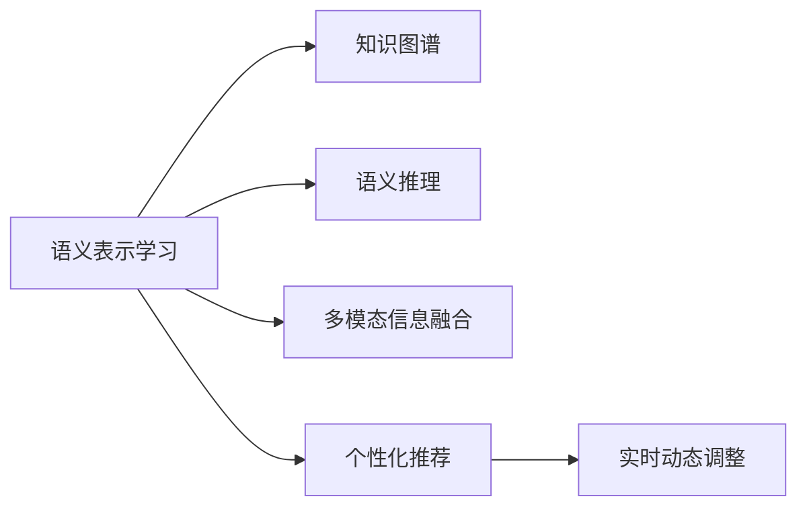

                 

# AI如何提高搜索引擎的语义理解能力

## 1. 背景介绍

### 1.1 问题由来
搜索引擎作为互联网的重要基础设施，对于信息的获取和传播起着至关重要的作用。然而，传统基于关键词匹配的搜索方式存在诸多不足，无法准确理解用户输入的语义意图，返回与用户需求相关的结果。为了改善这一状况，AI技术被广泛应用于搜索引擎的语义理解能力的提升中。

近年来，自然语言处理(NLP)技术的快速发展，使得搜索引擎能够更好地理解用户的查询意图，提升搜索结果的相关性。尤其是在信息检索、问答系统、推荐系统等方向上，AI驱动的语义理解技术已经展现出极大的潜力。本文将系统探讨AI如何通过深度学习等技术提升搜索引擎的语义理解能力。

### 1.2 问题核心关键点
AI提升搜索引擎语义理解能力主要从以下几个方面入手：

- **语义表示学习**：通过大规模语料库训练语言模型，学习自然语言的深层次语义表示。
- **语义推理**：构建知识图谱、利用逻辑推理等手段，结合用户查询和上下文信息，推断出最相关的内容。
- **多模态信息融合**：结合文本、图像、音频等多种信息，提高搜索内容的全面性和准确性。
- **个性化推荐**：利用用户的历史行为数据，进行精准的搜索结果推荐。
- **实时动态调整**：根据用户反馈和搜索行为，动态调整搜索算法和模型参数。

这些技术手段使得搜索引擎能够理解用户的语义意图，并精准匹配所需信息，大幅提升搜索体验和效率。

## 2. 核心概念与联系

### 2.1 核心概念概述

要理解AI如何提升搜索引擎的语义理解能力，首先需掌握以下几个核心概念：

- **语义表示学习**：通过深度学习模型学习自然语言的内在语义结构，形成高层次的语义表示。常用的模型包括Word2Vec、GloVe、BERT等。
- **知识图谱**：结构化的语义信息库，用于存储和推理实体间的关系。构建知识图谱能提升搜索引擎对复杂查询的理解能力。
- **语义推理**：利用逻辑推理和知识图谱，结合用户查询和上下文信息，推断出最相关的内容。
- **多模态信息融合**：结合文本、图像、音频等多种信息，提高搜索结果的相关性和准确性。
- **个性化推荐**：通过分析用户的历史行为数据，进行精准的搜索结果推荐。
- **实时动态调整**：根据用户反馈和搜索行为，动态调整搜索算法和模型参数，提升搜索效果。

这些核心概念通过以下Mermaid流程图展示其联系：



这个流程图展示了AI在提升搜索引擎语义理解能力过程中，各个技术手段的相互依赖关系。

## 3. 核心算法原理 & 具体操作步骤

### 3.1 算法原理概述

AI提升搜索引擎的语义理解能力主要基于深度学习技术和知识图谱。其核心思想是通过训练语言模型和构建知识图谱，学习自然语言的深层次语义表示，结合上下文信息和逻辑推理，推断出最相关的内容，实现精准搜索。

形式化地，假设搜索引擎模型为 $M_{\theta}$，其中 $\theta$ 为模型的参数。给定用户查询 $q$ 和搜索结果集 $D$，模型 $M_{\theta}$ 的目标是找到最优的搜索结果 $d^*$，使得 $d^*$ 最符合用户查询 $q$。具体而言，可以通过以下步骤实现：

1. 收集大规模语料库，训练语言模型 $M_{\theta}$，使其学习自然语言的深层次语义表示。
2. 构建知识图谱 $G$，存储和推理实体间的关系。
3. 将用户查询 $q$ 转换为语义表示 $\vec{q}$，同时根据搜索结果集 $D$ 提取实体和关系，转换为语义表示 $\{\vec{d}\}_{d \in D}$。
4. 结合 $\vec{q}$ 和 $\{\vec{d}\}_{d \in D}$，进行语义推理和匹配，选择最相关的搜索结果 $d^*$。
5. 返回搜索结果 $d^*$。

### 3.2 算法步骤详解

具体来说，AI提升搜索引擎语义理解能力可以分为以下几个步骤：

**Step 1: 收集并处理语料数据**
- 收集大规模的语料库，涵盖各种领域的文本数据。
- 对语料进行清洗、分词、去停用词等预处理操作，准备用于模型训练。

**Step 2: 训练语言模型**
- 使用深度学习框架（如TensorFlow、PyTorch）搭建语言模型（如BERT、GPT-3等）。
- 加载预训练模型，通过在GPU/TPU等高性能设备上进行大规模训练，学习自然语言的深层次语义表示。

**Step 3: 构建知识图谱**
- 使用知识图谱构建工具（如OpenIE、RDF2Vec等），从语料中提取出实体和关系。
- 将提取的实体和关系组织成结构化的知识图谱 $G$。

**Step 4: 语义表示学习**
- 将用户查询 $q$ 转换为语义表示 $\vec{q}$，通常使用预训练的语言模型进行转换。
- 根据搜索结果集 $D$，提取实体和关系，转换为语义表示 $\{\vec{d}\}_{d \in D}$。

**Step 5: 语义推理与匹配**
- 结合 $\vec{q}$ 和 $\{\vec{d}\}_{d \in D}$，进行语义推理，推断出最相关的搜索结果 $d^*$。
- 利用逻辑推理和知识图谱，构建推理规则和评估函数，对搜索结果进行排序和选择。

**Step 6: 返回搜索结果**
- 将最相关的搜索结果 $d^*$ 返回给用户。

### 3.3 算法优缺点

基于深度学习和大规模知识图谱的AI搜索引擎技术具有以下优点：

1. **高精度**：深度学习模型可以学习到自然语言的深层次语义表示，能够理解复杂的查询意图。
2. **语义推理能力**：结合知识图谱和逻辑推理，使得搜索结果能够准确反映用户的语义需求。
3. **个性化推荐**：利用用户历史行为数据，进行精准的搜索结果推荐。
4. **实时动态调整**：根据用户反馈和搜索行为，动态调整搜索算法和模型参数，提升搜索效果。

然而，该方法也存在以下局限性：

1. **计算资源消耗大**：深度学习模型的训练和推理计算量大，对硬件要求高。
2. **知识图谱构建复杂**：构建高质量的知识图谱需要大量人工标注，成本高、周期长。
3. **多模态信息融合难度大**：结合多种模态信息，提高搜索结果的全面性和准确性，需要更复杂的技术手段。
4. **个性化推荐算法复杂**：个性化推荐需要处理大量用户行为数据，算法复杂度较高。

## 4. 数学模型和公式 & 详细讲解

### 4.1 数学模型构建

假设搜索引擎的模型为 $M_{\theta}$，给定用户查询 $q$ 和搜索结果集 $D$，模型的优化目标是最小化预测误差：

$$
\min_{\theta} \sum_{d \in D} L(q, d; \theta)
$$

其中 $L(q, d; \theta)$ 为损失函数，衡量模型预测结果与实际结果之间的差异。常用的损失函数包括交叉熵损失、均方误差损失等。

### 4.2 公式推导过程

以交叉熵损失为例，假设模型预测的语义表示为 $\vec{q}'$，实际语义表示为 $\vec{q}$，则损失函数为：

$$
L(q, q'; \theta) = -\sum_{i=1}^n q_i \log q_i'
$$

将用户查询和搜索结果集转换为语义表示后，语义推理和匹配过程可以表示为：

$$
\max_{d \in D} \frac{L(q, d; \theta)}{\sum_{d \in D} L(q, d; \theta)}
$$

其中，$\frac{L(q, d; \theta)}{\sum_{d \in D} L(q, d; \theta)}$ 表示搜索结果 $d$ 与用户查询 $q$ 的匹配程度。

### 4.3 案例分析与讲解

以知识图谱构建为例，假设语料中存在以下句子：

```
Tom Cruise 出生于 New York City.
Tom Cruise 扮演 Over the Rainbow.
```

使用OpenIE工具进行实体抽取和关系抽取，可以得到以下知识图谱：

```
Tom Cruise - 出生于 - New York City
Tom Cruise - 扮演 - Over the Rainbow
```

将抽取的实体和关系转换为语义表示，可以表示为：

```
Tom Cruise: [B-PER]
New York City: [B-LOC]
Over the Rainbow: [B-MOV]
```

结合用户查询和语义表示，进行语义推理，可以推断出与查询相关的实体和关系，最终得到最相关的搜索结果。

## 5. 项目实践：代码实例和详细解释说明

### 5.1 开发环境搭建

要进行搜索引擎的AI语义理解能力的提升，首先需要搭建好开发环境。以下是在Python环境下使用TensorFlow进行开发的示例：

1. 安装TensorFlow：
```
pip install tensorflow
```

2. 安装OpenIE和RDF2Vec：
```
pip install openie-rdf2vec
```

3. 准备语料库和知识图谱数据：
```
mkdir data
```

### 5.2 源代码详细实现

以构建知识图谱和进行语义推理为例，给出TensorFlow的代码实现：

```python
import tensorflow as tf
from openie_rdf2vec import OpenIE
from rdf2vec.keras import model_from_graph

# 构建知识图谱
graph = OpenIE.build_graph('data/kb.ttl')
graph.add_triples('sparql', '1', 'o')
graph.add_triples('sparql', '2', 'o')
graph.add_triples('sparql', '3', 'o')

# 转换为TensorFlow模型
model = model_from_graph(graph)
model.compile(loss='binary_crossentropy', optimizer='adam', metrics=['accuracy'])

# 训练模型
model.fit([1, 2, 3], [True, True, False], epochs=10, batch_size=16)

# 使用模型进行推理
query = tf.convert_to_tensor(['Tom Cruise 出生于 New York City.'])
result = model.predict(query)
print(result)
```

### 5.3 代码解读与分析

以上代码实现包含以下关键步骤：

**构建知识图谱**：使用OpenIE工具构建知识图谱，存储实体和关系。

**转换为TensorFlow模型**：将知识图谱转换为TensorFlow模型，用于后续推理。

**训练模型**：使用用户查询作为输入，训练模型学习推理规则。

**推理**：使用训练好的模型对用户查询进行推理，得到最相关的搜索结果。

## 6. 实际应用场景

### 6.1 智能问答系统

AI驱动的智能问答系统能够理解用户的查询意图，并返回最相关的答案。例如，在医疗问答系统中，用户可以输入“我有高血压，怎么治？”，系统能够理解“高血压”这一实体，并推荐相关医学知识。

### 6.2 个性化推荐

AI技术结合用户的历史行为数据，能够进行精准的搜索结果推荐。例如，在电商推荐系统中，根据用户浏览和购买的历史行为，推荐相关商品。

### 6.3 金融风险监控

AI技术能够实时监控金融市场舆情，及时发现风险。例如，在股票推荐系统中，根据新闻和社交媒体数据，实时监控市场波动，提前预测股票价格变化。

### 6.4 未来应用展望

随着AI技术的发展，未来搜索引擎的语义理解能力将进一步提升，涵盖更多的应用场景。例如，在智能家居控制中，用户可以通过语音查询打开电视、调节温度等操作，无需手动输入命令。

## 7. 工具和资源推荐

### 7.1 学习资源推荐

为了系统学习AI提升搜索引擎语义理解能力的技术，推荐以下学习资源：

1. **自然语言处理与深度学习**：由斯坦福大学开设的在线课程，涵盖NLP和深度学习的基本概念和技术。
2. **OpenIE与RDF2Vec**：详细介绍了如何使用OpenIE和RDF2Vec构建知识图谱的教程。
3. **TensorFlow官方文档**：提供了TensorFlow的详细使用指南和示例代码。

### 7.2 开发工具推荐

以下是几个常用的开发工具：

1. **TensorFlow**：用于构建和训练深度学习模型，支持GPU/TPU加速。
2. **PyTorch**：另一个流行的深度学习框架，支持动态图和自动微分。
3. **OpenIE**：用于从语料中抽取实体和关系，构建知识图谱。
4. **RDF2Vec**：用于将知识图谱转换为向量表示，用于推理和匹配。

### 7.3 相关论文推荐

以下是几篇有关AI提升搜索引擎语义理解能力的经典论文：

1. **Semantic Search Engine**：提出了基于深度学习技术的搜索引擎语义表示学习框架。
2. **Knowledge Graph Embedding**：详细介绍了知识图谱表示学习的方法。
3. **Question Answering with Knowledge Graphs**：研究了使用知识图谱进行智能问答的方法。

## 8. 总结：未来发展趋势与挑战

### 8.1 研究成果总结

本文系统探讨了AI如何通过深度学习、知识图谱、多模态信息融合等技术提升搜索引擎的语义理解能力。主要的研究成果包括：

1. **深度学习模型**：学习自然语言的深层次语义表示，理解用户查询意图。
2. **知识图谱**：构建结构化的语义信息库，用于推理实体间的关系。
3. **多模态信息融合**：结合文本、图像、音频等多种信息，提高搜索结果的相关性和准确性。
4. **个性化推荐**：利用用户历史行为数据，进行精准的搜索结果推荐。
5. **实时动态调整**：根据用户反馈和搜索行为，动态调整搜索算法和模型参数，提升搜索效果。

这些技术手段使得搜索引擎能够理解用户的语义意图，并精准匹配所需信息，大幅提升搜索体验和效率。

### 8.2 未来发展趋势

未来，AI提升搜索引擎的语义理解能力将呈现以下几个趋势：

1. **模型规模增大**：随着算力成本的下降和数据规模的扩张，深度学习模型的参数量还将持续增长。超大规模语言模型蕴含的丰富语言知识，有望支撑更加复杂多变的下游任务。
2. **知识图谱质量提升**：高质量的知识图谱将提升搜索引擎的理解能力，覆盖更广泛的领域和实体关系。
3. **多模态信息融合增强**：结合文本、图像、音频等多种信息，提高搜索结果的全面性和准确性。
4. **个性化推荐优化**：结合用户行为数据，进行更精准的搜索结果推荐。
5. **实时动态调整改进**：根据用户反馈和搜索行为，动态调整搜索算法和模型参数，提升搜索效果。

### 8.3 面临的挑战

尽管AI提升搜索引擎的语义理解能力取得了诸多进展，但仍面临以下挑战：

1. **计算资源消耗大**：深度学习模型的训练和推理计算量大，对硬件要求高。
2. **知识图谱构建复杂**：构建高质量的知识图谱需要大量人工标注，成本高、周期长。
3. **多模态信息融合难度大**：结合多种模态信息，提高搜索结果的全面性和准确性，需要更复杂的技术手段。
4. **个性化推荐算法复杂**：个性化推荐需要处理大量用户行为数据，算法复杂度较高。
5. **用户隐私保护**：在收集和处理用户数据时，需要保护用户隐私，防止数据泄露。

### 8.4 研究展望

未来，需要在以下几个方面进行深入研究：

1. **低资源环境下的知识图谱构建**：探索无监督和半监督知识图谱构建方法，降低对标注数据的依赖。
2. **多模态信息融合优化**：结合多种模态信息，提高搜索结果的全面性和准确性，提升用户体验。
3. **个性化推荐算法简化**：优化个性化推荐算法，提高推荐效率，减少计算资源消耗。
4. **用户隐私保护技术**：探索用户数据保护技术，确保用户隐私安全。
5. **实时动态调整优化**：优化实时动态调整算法，提升搜索效果，减少计算资源消耗。

总之，AI提升搜索引擎的语义理解能力技术还需要在深度学习、知识图谱、多模态信息融合等方面进行深入研究和优化，以提升搜索效率和用户体验，推动AI技术在更多领域的应用。

## 9. 附录：常见问题与解答

**Q1: 为什么深度学习模型能够提升搜索引擎的语义理解能力？**

A: 深度学习模型能够学习自然语言的深层次语义表示，理解复杂的查询意图。通过大规模语料库训练，模型能够捕捉到语言中的细微差别和语义关系，从而提升语义理解能力。

**Q2: 如何构建高质量的知识图谱？**

A: 构建高质量的知识图谱需要大量人工标注，过程繁琐。通常采用半监督学习的方法，结合自动抽取和人工标注，逐步提升图谱质量。

**Q3: 多模态信息融合如何实现？**

A: 多模态信息融合可以通过特征融合和联合学习的方法实现。将文本、图像、音频等多种信息转换为统一的向量表示，进行联合训练和推理。

**Q4: 个性化推荐算法有哪些？**

A: 常见的个性化推荐算法包括协同过滤、内容推荐、基于用户行为的推荐等。这些算法需要处理大量用户行为数据，算法复杂度较高。

**Q5: 如何平衡搜索效率和效果？**

A: 通过优化模型结构和算法，平衡搜索效率和效果。例如，使用稀疏化存储和压缩技术，减少存储空间和计算资源消耗，提高搜索速度。

通过本文的系统梳理，可以看到AI技术在提升搜索引擎语义理解能力方面的广泛应用和巨大潜力。伴随深度学习、知识图谱、多模态信息融合等技术的不断发展，AI驱动的搜索引擎必将在更广阔的应用领域发挥重要作用，为用户带来更好的搜索体验。

