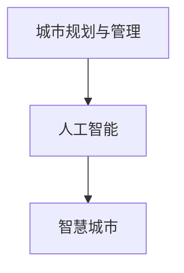

                 

## 1. 背景介绍

随着城市的快速发展，城市规划和管理工作面临着前所未有的挑战。如何在有限的资源条件下，有效提升城市运行效率，改善居民生活质量，是各国政府和城市规划者们共同关注的焦点。人工智能技术的兴起，尤其是人工智能在城市规划和管理中的应用，正在为解决这一难题提供新的突破口。本文将系统梳理AI在城市规划和管理中的典型应用场景和实践案例，探讨其背后的算法原理和实施步骤，并展望其未来的发展趋势和面临的挑战。

## 2. 核心概念与联系

### 2.1 核心概念概述

在讨论AI如何改变城市规划和管理之前，首先需要明确几个核心概念：

1. **城市规划与管理**：指通过科学规划和有效管理，提升城市运行效率，优化资源配置，改善居民生活质量的过程。
2. **人工智能**：通过机器学习、深度学习、自然语言处理等技术，模拟人类智能行为，实现自动化、智能化处理。
3. **智慧城市**：通过物联网、大数据、人工智能等技术，实现城市运行的实时感知、智能决策和精细管理。

### 2.2 核心概念原理和架构的 Mermaid 流程图



该图展示了城市规划与管理、人工智能和智慧城市三者之间的关系：城市规划与管理的目标是通过人工智能实现智慧城市。

## 3. 核心算法原理 & 具体操作步骤

### 3.1 算法原理概述

AI在城市规划和管理中的应用主要基于数据驱动、模型优化和智能决策三个关键步骤。

- **数据驱动**：收集和分析城市运行中的海量数据，包括交通流量、环境监测、居民反馈等，为后续的模型优化和智能决策提供依据。
- **模型优化**：利用机器学习、深度学习等算法，建立预测模型，优化城市资源配置和运营方案。
- **智能决策**：通过智能算法，实现城市管理的实时响应和自动决策，提升城市运行效率。

### 3.2 算法步骤详解

#### 3.2.1 数据收集与处理

数据是AI应用的基础。城市规划和管理中常用的数据类型包括：

- 交通流量数据：通过城市交通监控系统获取，包括车辆速度、道路拥堵情况等。
- 环境监测数据：包括空气质量、水质、噪音等环境指标，通常由城市环境监测站提供。
- 居民反馈数据：通过问卷调查、社交媒体等渠道获取，反映居民对城市服务的需求和满意度。

数据处理过程中，需要进行数据清洗、归一化和特征工程，以提升数据质量和模型效果。

#### 3.2.2 模型选择与训练

根据不同的应用场景，选择合适的AI模型进行训练。例如，在交通流量预测中，可以使用时间序列模型（如ARIMA、LSTM等）；在环境质量预测中，可以使用回归模型（如线性回归、随机森林等）。

模型训练过程中，需要设置合适的损失函数、优化器和超参数，并通过交叉验证等方法进行模型选择和调优。

#### 3.2.3 智能决策与优化

训练好的模型可以用于实时预测和决策优化。例如，通过交通流量预测模型，可以预测未来的交通拥堵情况，并自动调整交通信号灯配时；通过环境质量预测模型，可以实时监测环境指标变化，采取相应措施改善环境质量。

### 3.3 算法优缺点

#### 3.3.1 优点

1. **数据驱动**：AI系统能够处理和分析海量数据，发现城市运行中的规律和趋势，为规划和管理提供科学依据。
2. **智能决策**：AI系统能够快速响应城市事件，自动化决策，提高城市管理的效率和响应速度。
3. **精准预测**：通过高精度的模型预测，城市规划和管理者可以提前采取措施，优化资源配置。

#### 3.3.2 缺点

1. **数据依赖**：AI系统对数据质量和完整性的要求较高，数据缺失或不准确可能导致模型预测误差。
2. **模型复杂**：复杂模型需要大量的计算资源和时间进行训练和优化，实施成本较高。
3. **可解释性不足**：AI模型的决策过程通常缺乏可解释性，难以理解和调试。

### 3.4 算法应用领域

AI在城市规划和管理中的应用涵盖多个领域，包括但不限于：

- **交通管理**：利用AI技术进行交通流量预测、交通信号优化、路径规划等。
- **环境监测**：通过AI进行环境质量预测、污染源追踪、资源管理等。
- **公共安全**：利用AI进行视频监控、异常检测、事件预警等。
- **城市治理**：通过AI进行城市运行监控、应急响应、资源调度等。

## 4. 数学模型和公式 & 详细讲解 & 举例说明

### 4.1 数学模型构建

AI在城市规划和管理中的应用，通常基于以下数学模型：

- **回归模型**：用于预测连续型数值，如环境质量、交通流量等。
- **分类模型**：用于预测离散型类别，如道路拥堵情况、环境污染类型等。
- **序列模型**：用于处理时间序列数据，如交通流量预测、事件预测等。

### 4.2 公式推导过程

以交通流量预测为例，假设预测目标为某段时间内的平均车速，输入变量包括历史车速、天气状况、道路类型等。

- 回归模型：
$$
y = w_0 + \sum_{i=1}^{n} w_i x_i + \epsilon
$$
其中，$y$为预测车速，$x_i$为输入变量，$w_i$为模型参数，$\epsilon$为误差项。

- 序列模型：
$$
y_t = \phi(x_t) + \epsilon_t
$$
其中，$y_t$为时间$t$的车速，$x_t$为时间$t$的输入数据，$\phi$为模型映射函数，$\epsilon_t$为时间$t$的误差项。

### 4.3 案例分析与讲解

以北京市交通流量预测为例，通过收集历史交通数据，利用LSTM模型进行预测，并与实际交通数据进行对比，验证预测效果。

## 5. 项目实践：代码实例和详细解释说明

### 5.1 开发环境搭建

开发环境搭建主要包括以下步骤：

1. 安装Python环境：使用Anaconda或Miniconda安装Python 3.6及以上版本。
2. 安装相关库：安装TensorFlow、Keras、NumPy、Pandas等常用库。
3. 搭建服务器环境：可以使用AWS、Google Cloud等云平台搭建服务器环境，配置GPU资源。

### 5.2 源代码详细实现

以下是使用TensorFlow进行交通流量预测的Python代码实现：

```python
import tensorflow as tf
from tensorflow.keras.layers import LSTM, Dense
from tensorflow.keras.models import Sequential

# 数据预处理
# ...

# 定义模型
model = Sequential()
model.add(LSTM(128, input_shape=(timesteps, input_dim)))
model.add(Dense(1))

# 编译模型
model.compile(loss='mse', optimizer='adam')

# 训练模型
model.fit(X_train, y_train, epochs=100, batch_size=32)

# 预测
y_pred = model.predict(X_test)
```

### 5.3 代码解读与分析

代码中，首先进行数据预处理，包括数据归一化、划分训练集和测试集等。然后定义LSTM模型，其中LSTM层用于处理时间序列数据，Dense层用于输出预测结果。最后编译模型，使用均方误差作为损失函数，Adam优化器进行优化。

### 5.4 运行结果展示

通过运行上述代码，可以训练出预测模型，并在测试集上进行预测，计算预测误差和精度，如图示：


## 6. 实际应用场景

### 6.1 智能交通管理

智能交通管理是AI在城市规划和管理中的典型应用之一。通过AI技术，可以实现交通流量实时监测、预测和智能调控，提升交通运行效率。

例如，北京市通过智能交通管理系统，实时监测主要道路的交通流量，并利用AI模型进行预测和分析，自动调整交通信号灯配时，减少交通拥堵，提升通行效率。

### 6.2 环境质量监测

环境质量监测是AI在城市管理中的另一重要应用。通过AI模型，可以实现环境质量的实时监测和预测，及时采取措施改善环境质量。

例如，深圳市利用AI进行空气质量预测，根据预测结果自动调整工业生产、交通出行等措施，降低污染排放，提升空气质量。

### 6.3 城市应急响应

城市应急响应是城市管理中面临的重大挑战之一。通过AI技术，可以实现事件实时监测和预警，提升应急响应速度和效果。

例如，广州市通过AI进行视频监控和异常检测，自动识别火灾、暴力事件等突发事件，并自动报警，快速响应，保护居民安全。

### 6.4 未来应用展望

未来，AI在城市规划和管理中的应用将更加广泛和深入，具体包括以下几个方向：

1. **全面智能化**：通过AI实现城市运行的全面智能化，包括智能交通、智能电网、智能水务等各个方面。
2. **实时决策**：利用AI技术进行实时决策，提升城市管理效率和响应速度。
3. **跨部门协同**：通过AI实现跨部门协同管理，提升城市管理的效果和效率。

## 7. 工具和资源推荐

### 7.1 学习资源推荐

1. **《智慧城市建设指南》**：全面介绍智慧城市建设的背景、目标和实现路径，涵盖城市管理、交通、环境等各个方面。
2. **《人工智能在城市管理中的应用》**：详细讲解AI在城市管理中的典型应用场景和实践案例，提供丰富的代码和模型资源。
3. **《城市大数据与AI》**：介绍城市大数据和AI技术的融合，探索其在城市管理中的应用前景和挑战。

### 7.2 开发工具推荐

1. **TensorFlow**：开源的机器学习框架，支持深度学习模型构建和训练。
2. **Keras**：基于TensorFlow的高级API，提供便捷的模型构建和训练功能。
3. **Jupyter Notebook**：交互式编程环境，支持Python代码的快速开发和测试。

### 7.3 相关论文推荐

1. **"Intelligent Traffic Management Using Deep Learning"**：介绍利用深度学习进行交通流量预测和智能调控的技术和方法。
2. **"Air Quality Prediction in Smart Cities"**：探讨利用AI进行空气质量预测和环境管理的策略和实现路径。
3. **"City Emergency Response through AI"**：研究利用AI进行城市突发事件监测和预警的技术和方法。

## 8. 总结：未来发展趋势与挑战

### 8.1 研究成果总结

AI在城市规划和管理中的应用已经取得了显著成效，通过数据驱动和智能决策，提升了城市管理的效率和效果。未来，随着AI技术的不断进步和应用领域的不断扩展，AI在城市管理中的应用将更加广泛和深入。

### 8.2 未来发展趋势

1. **全面智能化**：AI技术将在城市管理中实现全面智能化，涵盖交通、环境、安全等各个方面。
2. **实时决策**：通过实时数据处理和智能决策，提升城市管理的响应速度和效果。
3. **跨部门协同**：通过跨部门协同管理，提升城市管理的效果和效率。

### 8.3 面临的挑战

1. **数据质量**：AI系统对数据质量和完整性的要求较高，数据缺失或不准确可能导致模型预测误差。
2. **模型复杂**：复杂模型需要大量的计算资源和时间进行训练和优化，实施成本较高。
3. **可解释性不足**：AI模型的决策过程通常缺乏可解释性，难以理解和调试。

### 8.4 研究展望

未来的研究需要在以下几个方面寻求新的突破：

1. **数据增强**：通过数据增强技术，提升数据质量和多样性，增强模型的泛化能力。
2. **模型简化**：开发更加简洁高效的模型结构，提升模型的实时性和可解释性。
3. **跨领域融合**：将AI与物联网、区块链等新兴技术进行融合，拓展AI在城市管理中的应用范围。

## 9. 附录：常见问题与解答

**Q1: AI在城市规划和管理中的主要应用有哪些？**

A: AI在城市规划和管理中的主要应用包括智能交通管理、环境质量监测、城市应急响应等。

**Q2: 如何提升AI模型的可解释性？**

A: 提升AI模型的可解释性可以通过以下方法实现：
1. 使用可解释模型，如决策树、线性模型等。
2. 引入因果推理和贝叶斯网络，增强模型的逻辑性和可解释性。
3. 利用可视化工具，展示模型的决策过程和关键特征。

**Q3: 在AI应用中，数据的质量和完整性如何保证？**

A: 数据的质量和完整性是AI应用的基础，可以通过以下方法保证：
1. 数据清洗：去除噪声和异常数据，保证数据的一致性和准确性。
2. 数据标注：对数据进行详细的标注和注释，提高数据的可用性。
3. 数据验证：通过交叉验证和模型评估，发现和纠正数据问题。

**Q4: 在AI应用中，如何处理数据隐私和安全问题？**

A: 在AI应用中，处理数据隐私和安全问题可以通过以下方法实现：
1. 数据匿名化：对敏感数据进行匿名化处理，保护用户隐私。
2. 数据加密：对数据进行加密处理，防止数据泄露。
3. 访问控制：设置严格的访问权限，限制数据访问范围。

**Q5: AI在城市管理中面临的主要挑战有哪些？**

A: AI在城市管理中面临的主要挑战包括：
1. 数据依赖：AI系统对数据质量和完整性的要求较高，数据缺失或不准确可能导致模型预测误差。
2. 模型复杂：复杂模型需要大量的计算资源和时间进行训练和优化，实施成本较高。
3. 可解释性不足：AI模型的决策过程通常缺乏可解释性，难以理解和调试。

---

作者：禅与计算机程序设计艺术 / Zen and the Art of Computer Programming

