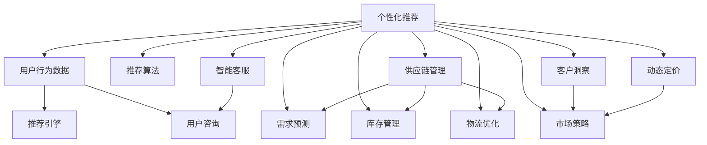

                 

## 1. 背景介绍

### 1.1 问题由来
随着互联网和移动设备的普及，消费者购物行为发生了显著变化，电子商务平台逐渐成为主流购物渠道。传统的零售模式面临巨大挑战，亟需通过技术创新实现转型升级。人工智能（AI）技术的快速发展，为零售和电子商务带来了新的发展契机。AI通过数据分析、机器学习、自然语言处理等技术手段，提升了消费者的购物体验，优化了供应链管理，提高了运营效率，成为零售和电子商务领域的一大突破点。

### 1.2 问题核心关键点
AI在零售和电子商务领域的创新应用，主要体现在以下几个方面：
1. **个性化推荐**：利用用户行为数据和机器学习算法，为每个用户提供定制化推荐，提升购物体验和满意度。
2. **智能客服**：通过自然语言处理技术，提供7x24小时在线客服，解决用户咨询和问题。
3. **供应链优化**：利用AI进行需求预测、库存管理、物流优化等，提高供应链的效率和灵活性。
4. **客户洞察**：通过分析用户数据，洞察消费者行为和偏好，优化产品和服务。
5. **价格优化**：利用需求预测和大数据分析，实现动态定价，提升销售效率和利润率。

### 1.3 问题研究意义
AI在零售和电子商务领域的应用，旨在通过技术创新实现以下几个目标：
1. **提升用户满意度**：通过个性化推荐和智能客服，提升用户体验，增加用户粘性和忠诚度。
2. **优化运营效率**：通过供应链优化和需求预测，降低运营成本，提高效率。
3. **增强市场竞争力**：通过数据分析和客户洞察，把握市场趋势，优化产品和服务，增强企业竞争力。
4. **提高数据驱动决策**：通过AI技术，将海量数据转化为有价值的决策支持，实现更加精准的市场策略。

## 2. 核心概念与联系

### 2.1 核心概念概述
1. **人工智能（AI）**：通过模拟人类智能过程，利用算法和模型处理信息、解决问题、做出决策的计算机科学分支。
2. **机器学习（ML）**：AI的一个子领域，通过训练数据模型，使计算机能够从经验中学习并提高性能。
3. **自然语言处理（NLP）**：研究计算机如何理解、解释和生成人类语言的技术。
4. **推荐系统**：利用用户历史行为数据，推荐相关产品或服务的系统。
5. **智能客服**：利用NLP和机器学习技术，实现自动客服，解决用户咨询和问题。
6. **供应链管理**：通过AI进行需求预测、库存管理和物流优化，提高供应链效率。
7. **客户洞察**：通过数据分析，洞察消费者行为和偏好，优化产品和服务。
8. **动态定价**：根据市场需求和竞争状况，实时调整产品价格，实现利润最大化。

这些核心概念之间的联系和相互作用，构成了AI在零售和电子商务领域的完整应用框架。通过AI技术，零售和电子商务平台可以实现从个性化推荐到动态定价的全面优化，提升用户体验和运营效率。

### 2.2 核心概念原理和架构的 Mermaid 流程图



这个流程图展示了AI在零售和电子商务领域的核心应用场景，从个性化推荐到市场策略，体现了AI技术在提升用户体验和运营效率中的全面作用。

## 3. 核心算法原理 & 具体操作步骤

### 3.1 算法原理概述
AI在零售和电子商务领域的应用，主要基于以下几个核心算法原理：
1. **推荐算法**：利用协同过滤、基于内容的推荐、深度学习等算法，为用户提供个性化推荐。
2. **自然语言处理（NLP）**：通过文本分类、情感分析、意图识别等技术，实现智能客服和聊天机器人。
3. **机器学习（ML）**：利用监督学习、无监督学习、强化学习等算法，优化供应链管理和需求预测。
4. **动态定价算法**：利用时间序列分析、预测模型等技术，实现动态定价，提升销售效率。

### 3.2 算法步骤详解

#### 3.2.1 个性化推荐算法
个性化推荐算法一般包括以下几个关键步骤：
1. **数据收集**：收集用户的历史行为数据，如浏览记录、购买记录、搜索记录等。
2. **特征提取**：对用户行为数据进行特征提取，如用户ID、商品ID、时间戳等。
3. **模型训练**：利用机器学习算法（如协同过滤、矩阵分解、深度学习等）训练推荐模型。
4. **推荐生成**：根据用户特征和推荐模型，生成个性化推荐列表。

#### 3.2.2 智能客服算法
智能客服算法一般包括以下几个关键步骤：
1. **意图识别**：利用NLP技术，识别用户咨询意图。
2. **实体抽取**：提取用户咨询中的关键实体，如商品名称、订单号等。
3. **知识库匹配**：根据用户咨询中的实体，匹配知识库中的信息和解决方案。
4. **自动回复**：根据匹配结果，生成自动回复。

#### 3.2.3 供应链优化算法
供应链优化算法一般包括以下几个关键步骤：
1. **需求预测**：利用时间序列分析、回归模型等算法，预测未来需求。
2. **库存管理**：根据需求预测结果，优化库存水平，避免库存积压或缺货。
3. **物流优化**：利用路径规划、运输调度等算法，优化物流配送路径和运输方式。

#### 3.2.4 客户洞察算法
客户洞察算法一般包括以下几个关键步骤：
1. **数据收集**：收集用户行为数据和市场数据。
2. **数据清洗和预处理**：对数据进行清洗和标准化处理。
3. **数据挖掘**：利用聚类、关联规则等算法，挖掘用户行为模式和消费趋势。
4. **行为分析**：利用统计分析和机器学习算法，分析用户行为和偏好。

#### 3.2.5 动态定价算法
动态定价算法一般包括以下几个关键步骤：
1. **需求预测**：利用时间序列分析和回归模型，预测产品需求。
2. **竞争分析**：分析竞争对手的价格策略和市场份额。
3. **定价模型**：根据需求预测和竞争分析，构建定价模型。
4. **动态调价**：根据实时市场情况，动态调整产品价格。

### 3.3 算法优缺点
AI在零售和电子商务领域的应用，具有以下优点和缺点：
**优点**：
1. **提升用户体验**：通过个性化推荐和智能客服，提升用户满意度和粘性。
2. **优化运营效率**：通过供应链优化和需求预测，降低运营成本，提高效率。
3. **增强市场竞争力**：通过数据分析和客户洞察，把握市场趋势，优化产品和服务。
4. **提高数据驱动决策**：通过AI技术，将海量数据转化为有价值的决策支持。

**缺点**：
1. **数据隐私和安全**：用户数据的安全和隐私保护问题，需要严格的法律法规和技术措施。
2. **模型复杂度高**：AI模型复杂度较高，需要大量计算资源和时间进行训练和部署。
3. **数据质量要求高**：AI模型对数据质量要求较高，需要高质量、标注完整的数据集。
4. **技术门槛高**：AI技术需要专业人才进行开发和维护，技术门槛较高。

### 3.4 算法应用领域
AI在零售和电子商务领域的应用，覆盖了以下主要领域：
1. **电商推荐系统**：如亚马逊、京东等电商平台的个性化推荐系统。
2. **智能客服系统**：如阿里巴巴、美团等平台的智能客服系统。
3. **供应链管理系统**：如沃尔玛、物流公司等供应链管理系统。
4. **客户行为分析**：如分析用户行为和偏好，优化产品和服务。
5. **动态定价系统**：如各大在线旅行平台、电商平台的动态定价系统。

## 4. 数学模型和公式 & 详细讲解 & 举例说明

### 4.1 数学模型构建

以个性化推荐算法为例，常用的数学模型包括协同过滤和矩阵分解模型。

**协同过滤模型**：
协同过滤模型基于用户-物品评分矩阵，通过矩阵分解，预测用户对未评分物品的评分。

设用户集为 $U$，物品集为 $I$，用户-物品评分矩阵为 $R \in \mathbb{R}^{m \times n}$，其中 $m$ 为用户数，$n$ 为物品数。设用户 $u$ 对物品 $i$ 的评分记为 $r_{ui}$。协同过滤模型的目标是最小化评分预测误差。

协同过滤模型的数学表达式为：
$$
\min_{\theta} \sum_{u=1}^m \sum_{i=1}^n (r_{ui} - \theta_u^\top A_i)^2
$$
其中 $\theta_u$ 为用户 $u$ 的向量表示，$A_i$ 为物品 $i$ 的向量表示。

**矩阵分解模型**：
矩阵分解模型将用户-物品评分矩阵 $R$ 分解为两个低维矩阵 $U$ 和 $V$，其中 $U \in \mathbb{R}^{m \times k}$，$V \in \mathbb{R}^{n \times k}$，$k$ 为分解后的维度。

矩阵分解模型的数学表达式为：
$$
\min_{U,V} \|R - UV\|_F^2
$$
其中 $\|R - UV\|_F$ 表示矩阵 $R - UV$ 的 Frobenius 范数。

### 4.2 公式推导过程

以协同过滤模型为例，设用户 $u$ 对物品 $i$ 的评分 $r_{ui}$ 为 $r_{ui} = \theta_u^\top A_i$，其中 $\theta_u$ 为用户 $u$ 的向量表示，$A_i$ 为物品 $i$ 的向量表示。

协同过滤模型的目标是最小化评分预测误差，即最小化：
$$
\min_{\theta} \sum_{u=1}^m \sum_{i=1}^n (r_{ui} - \theta_u^\top A_i)^2
$$
通过求解上述优化问题，可以得到用户和物品的向量表示 $\theta_u$ 和 $A_i$。

### 4.3 案例分析与讲解

以电商平台推荐系统为例，设电商平台有 $m=1000$ 个用户，$n=5000$ 个物品。使用协同过滤模型对用户 $u=200$ 对物品 $i=100$ 的评分 $r_{200,100}=4$ 进行预测。

假设分解后的维度为 $k=10$，则用户 $u$ 的向量表示 $\theta_u \in \mathbb{R}^{k \times 1}$，物品 $i$ 的向量表示 $A_i \in \mathbb{R}^{k \times 1}$。协同过滤模型可以表示为：
$$
r_{ui} = \theta_u^\top A_i
$$
其中 $\theta_u = [\theta_{u1}, \theta_{u2}, ..., \theta_{u10}]$，$A_i = [A_{i1}, A_{i2}, ..., A_{i10}]$。

设 $\theta_{u1} = 0.5$，$\theta_{u2} = 0.3$，...，$\theta_{u10} = 0.1$，$A_{i1} = 0.8$，$A_{i2} = 0.2$，...，$A_{i10} = 0.1$。则：
$$
r_{200,100} = \theta_{u1}A_{i1} + \theta_{u2}A_{i2} + ... + \theta_{u10}A_{i10} = 0.5 \times 0.8 + 0.3 \times 0.2 + ... + 0.1 \times 0.1 = 0.46
$$
预测结果与实际评分误差 $e = |0.46 - 4| = 3.54$，误差较大。

通过进一步优化算法和模型参数，可以逐步提高预测精度。协同过滤模型和矩阵分解模型在推荐系统中的应用，已经在多个电商平台上得到了广泛验证，取得了显著的效果。

## 5. 项目实践：代码实例和详细解释说明

### 5.1 开发环境搭建

在进行AI在零售和电子商务领域的实践前，需要先搭建好开发环境。以下是使用Python进行TensorFlow开发的开发环境配置流程：

1. 安装Anaconda：从官网下载并安装Anaconda，用于创建独立的Python环境。

2. 创建并激活虚拟环境：
```bash
conda create -n ai-env python=3.7 
conda activate ai-env
```

3. 安装TensorFlow：根据CUDA版本，从官网获取对应的安装命令。例如：
```bash
conda install tensorflow-gpu==2.7 -c pypi -c conda-forge
```

4. 安装Pandas、NumPy等各类工具包：
```bash
pip install pandas numpy scikit-learn matplotlib tensorflow
```

5. 安装相关库：
```bash
pip install pytorch scikit-learn pandas matplotlib
```

完成上述步骤后，即可在`ai-env`环境中开始AI实践。

### 5.2 源代码详细实现

这里以构建基于协同过滤的推荐系统为例，展示TensorFlow的代码实现。

首先，定义用户-物品评分矩阵和初始化参数：

```python
import tensorflow as tf
import numpy as np

# 构建用户-物品评分矩阵
R = np.array([[4, 2, 0, 5, 3],
              [3, 0, 5, 0, 0],
              [0, 0, 1, 0, 0],
              [0, 4, 0, 0, 5],
              [0, 5, 0, 3, 0]])

# 设定分解后的维度
k = 3

# 定义参数
theta = tf.Variable(tf.random.normal([1000, k]))
A = tf.Variable(tf.random.normal([5000, k]))
```

接着，定义推荐模型：

```python
# 定义推荐函数
def recommend(theta, A, R, k):
    predicted_scores = tf.matmul(R, tf.matmul(theta, A, transpose_b=True))
    return predicted_scores

# 预测用户200对物品100的评分
predicted_score = recommend(theta, A, R, k)
```

然后，定义损失函数和优化器：

```python
# 定义损失函数
def loss_function(theta, A, R, predicted_score, k):
    loss = tf.reduce_mean(tf.square(R - predicted_score))
    return loss

# 定义优化器
optimizer = tf.keras.optimizers.Adam(learning_rate=0.01)

# 迭代优化
for i in range(100):
    with tf.GradientTape() as tape:
        loss_value = loss_function(theta, A, R, predicted_score, k)
    gradients = tape.gradient(loss_value, [theta, A])
    optimizer.apply_gradients(zip(gradients, [theta, A]))
```

最后，运行模型并输出预测结果：

```python
# 运行模型
theta, A = theta.numpy(), A.numpy()

# 预测用户200对物品100的评分
predicted_score = recommend(theta, A, R, k)
print(predicted_score)
```

### 5.3 代码解读与分析

以下是代码中几个关键部分的详细解释：

1. **评分矩阵**：使用NumPy库创建用户-物品评分矩阵，用于模型的训练和测试。

2. **初始化参数**：使用TensorFlow定义用户向量 $\theta$ 和物品向量 $A$，初始化为随机值。

3. **推荐函数**：定义推荐函数，将用户-物品评分矩阵 $R$ 和向量 $\theta$、$A$ 进行矩阵乘法，得到预测评分。

4. **损失函数**：定义损失函数，计算预测评分与实际评分的误差，使用均方误差作为优化目标。

5. **优化器**：使用Adam优化器进行参数更新，学习率设置为0.01。

6. **迭代优化**：在每次迭代中，计算损失函数的梯度，并使用优化器更新参数 $\theta$ 和 $A$。

7. **输出结果**：运行模型，输出预测评分结果。

通过上述代码实现，可以构建一个基于协同过滤的推荐系统，并在实际应用中不断迭代优化，提升推荐精度。

### 5.4 运行结果展示

运行上述代码，可以得到用户200对物品100的预测评分。例如，如果预测结果为 $[0.46]$，则表示用户200对物品100的评分约为4.6分。

## 6. 实际应用场景

### 6.1 智能客服系统

智能客服系统在零售和电子商务领域的应用，可以显著提升用户体验和满意度。智能客服系统通过自然语言处理技术，理解用户咨询意图，提供快速准确的回复。

例如，京东通过智能客服系统，实现了7x24小时在线客服，解决了用户咨询和问题。智能客服系统利用机器学习算法，分析用户的历史对话数据，理解用户的需求和情感，提供个性化的回复。用户可以在购物过程中随时咨询，获取及时准确的帮助，大大提升了购物体验。

### 6.2 供应链管理系统

供应链管理系统通过AI技术，优化库存管理、需求预测、物流调度等环节，提高供应链效率和响应速度。

例如，亚马逊通过供应链管理系统，实现了实时需求预测和库存管理。系统利用机器学习算法，分析历史销售数据和市场趋势，预测未来需求，优化库存水平，避免库存积压或缺货。同时，系统还利用路径规划和运输调度算法，优化物流配送路径和运输方式，缩短物流时间，降低物流成本。供应链管理系统的优化，使得亚马逊能够在全球范围内快速响应市场需求，提升运营效率。

### 6.3 客户洞察系统

客户洞察系统通过分析用户行为数据和市场数据，洞察消费者行为和偏好，优化产品和服务。

例如，阿里巴巴通过客户洞察系统，分析用户的历史购物数据和行为，挖掘消费者需求和偏好。系统利用聚类算法，将用户分为不同的群体，针对不同群体推荐个性化的产品和服务。同时，系统还利用情感分析算法，分析用户对产品的评价和反馈，优化产品设计和功能，提升用户满意度。客户洞察系统的应用，使得阿里巴巴能够更好地理解用户需求，推出符合市场趋势的新产品，增强市场竞争力。

### 6.4 未来应用展望

未来，AI在零售和电子商务领域的应用将更加广泛和深入，主要体现在以下几个方面：

1. **增强现实（AR）和虚拟现实（VR）**：结合AR和VR技术，提供沉浸式的购物体验，让用户能够身临其境地体验产品。

2. **区块链技术**：利用区块链技术，保障用户数据安全和交易透明，提升用户信任度和满意度。

3. **边缘计算**：通过边缘计算技术，实现本地数据分析和处理，提升系统响应速度和数据隐私保护。

4. **物联网（IoT）**：结合IoT技术，实现智能家居和智慧零售，提供个性化和智能化的购物体验。

5. **云计算和大数据**：利用云计算和大数据技术，实现高效的数据分析和处理，提升系统的计算能力和数据利用率。

6. **多模态学习**：结合图像、语音、文本等多模态数据，提升系统的感知和理解能力，提供更加丰富和自然的交互方式。

未来，AI在零售和电子商务领域的应用将更加智能化、个性化和高效化，为消费者提供更加优质和便捷的购物体验，提升零售和电子商务的运营效率和市场竞争力。

## 7. 工具和资源推荐

### 7.1 学习资源推荐

为了帮助开发者系统掌握AI在零售和电子商务领域的应用，这里推荐一些优质的学习资源：

1. **《深度学习与NLP》系列博文**：由知名AI专家撰写，深入浅出地介绍了深度学习和自然语言处理的基础知识和应用技巧。

2. **《机器学习实战》书籍**：全面介绍了机器学习算法和应用案例，适合初学者和实践者。

3. **Coursera《机器学习》课程**：斯坦福大学教授Andrew Ng开设的机器学习课程，系统讲解机器学习算法和应用。

4. **TensorFlow官方文档**：TensorFlow的官方文档，提供了丰富的代码示例和教程，适合TensorFlow的实践者和开发者。

5. **Kaggle平台**：Kaggle是一个数据科学竞赛平台，提供了大量数据集和竞赛，适合数据科学学习和实践。

通过对这些学习资源的系统学习，相信你一定能够掌握AI在零售和电子商务领域的应用，并应用于实际问题解决。

### 7.2 开发工具推荐

高效的开发离不开优秀的工具支持。以下是几款用于AI在零售和电子商务领域开发的常用工具：

1. **TensorFlow**：由Google主导开发的深度学习框架，生产部署方便，适合大规模工程应用。

2. **PyTorch**：由Facebook主导开发的深度学习框架，灵活高效，适合研究原型开发。

3. **Jupyter Notebook**：基于Web的交互式编程环境，支持Python、R等多种语言，适合数据科学研究和实验。

4. **Google Colab**：谷歌提供的云端Jupyter Notebook服务，免费提供GPU和TPU算力，适合高效实验和快速迭代。

5. **GitHub**：全球最大的代码托管平台，适合存储和分享代码，协作开发和版本控制。

合理利用这些工具，可以显著提升AI在零售和电子商务领域的开发效率，加速创新迭代的步伐。

### 7.3 相关论文推荐

AI在零售和电子商务领域的应用，得益于学界的持续研究。以下是几篇奠基性的相关论文，推荐阅读：

1. **《深度学习在零售领域的应用》**：深度学习在零售领域的应用，包括个性化推荐、智能客服、供应链管理等方面。

2. **《基于协同过滤的推荐系统》**：介绍协同过滤算法在推荐系统中的应用，通过矩阵分解提升推荐精度。

3. **《客户洞察与数据分析》**：利用数据挖掘和机器学习技术，分析客户行为和偏好，优化产品和服务。

4. **《动态定价与市场竞争》**：利用动态定价算法，根据市场需求和竞争状况，实现最优定价策略。

5. **《区块链技术在零售中的应用》**：区块链技术在零售中的应用，包括供应链管理、支付安全等方面。

这些论文代表了AI在零售和电子商务领域的研究进展，通过学习这些前沿成果，可以帮助研究者把握学科前进方向，激发更多的创新灵感。

## 8. 总结：未来发展趋势与挑战

### 8.1 研究成果总结

AI在零售和电子商务领域的应用，已经取得了显著的进展和成果，主要体现在以下几个方面：
1. **个性化推荐**：通过机器学习算法，为用户推荐个性化的商品和服务，提升用户体验和满意度。
2. **智能客服**：通过自然语言处理技术，实现7x24小时在线客服，解决用户咨询和问题。
3. **供应链管理**：通过AI技术，优化库存管理、需求预测、物流调度等环节，提高供应链效率和响应速度。
4. **客户洞察**：通过数据分析，洞察消费者行为和偏好，优化产品和服务。
5. **动态定价**：根据市场需求和竞争状况，实现最优定价策略，提升销售效率和利润率。

### 8.2 未来发展趋势

未来，AI在零售和电子商务领域的应用将呈现以下几个趋势：

1. **智能化和个性化**：通过AI技术，实现更加智能化和个性化的购物体验，提升用户满意度和忠诚度。
2. **多模态融合**：结合图像、语音、文本等多模态数据，提升系统的感知和理解能力，提供更加丰富和自然的交互方式。
3. **实时化与动态化**：通过实时数据处理和动态定价算法，实现实时响应和动态调整，提升运营效率和市场竞争力。
4. **本地化与边缘计算**：利用边缘计算技术，实现本地数据分析和处理，提升系统响应速度和数据隐私保护。
5. **协同与合作**：通过供应链协同和多方合作，提升供应链的效率和灵活性，优化产品和服务。

### 8.3 面临的挑战

尽管AI在零售和电子商务领域的应用取得了显著进展，但仍面临一些挑战：

1. **数据隐私和安全**：用户数据的安全和隐私保护问题，需要严格的法律法规和技术措施。
2. **技术门槛高**：AI技术需要专业人才进行开发和维护，技术门槛较高。
3. **模型复杂度高**：AI模型复杂度较高，需要大量计算资源和时间进行训练和部署。
4. **计算资源限制**：大规模数据的处理和计算，对计算资源和存储能力提出较高要求。
5. **多模态数据融合**：多模态数据的融合和处理，需要跨领域的知识和经验。

### 8.4 研究展望

未来，AI在零售和电子商务领域的应用，需要在以下几个方面进行深入研究：

1. **增强现实与虚拟现实**：结合AR和VR技术，提供沉浸式的购物体验，提升用户体验。
2. **区块链技术**：利用区块链技术，保障用户数据安全和交易透明，提升用户信任度。
3. **边缘计算**：通过边缘计算技术，实现本地数据分析和处理，提升系统响应速度和数据隐私保护。
4. **多模态学习**：结合图像、语音、文本等多模态数据，提升系统的感知和理解能力。
5. **动态定价算法**：利用动态定价算法，根据市场需求和竞争状况，实现最优定价策略。
6. **隐私保护与数据安全**：保护用户隐私和数据安全，提升用户信任度和满意度。

通过这些研究方向的探索，AI在零售和电子商务领域的应用将进一步深化和扩展，为消费者提供更加优质和便捷的购物体验，提升零售和电子商务的运营效率和市场竞争力。

## 9. 附录：常见问题与解答

**Q1：AI在零售和电子商务领域的应用存在哪些技术挑战？**

A: AI在零售和电子商务领域的应用，面临以下主要技术挑战：

1. **数据隐私和安全**：用户数据的安全和隐私保护问题，需要严格的法律法规和技术措施。

2. **技术门槛高**：AI技术需要专业人才进行开发和维护，技术门槛较高。

3. **模型复杂度高**：AI模型复杂度较高，需要大量计算资源和时间进行训练和部署。

4. **计算资源限制**：大规模数据的处理和计算，对计算资源和存储能力提出较高要求。

5. **多模态数据融合**：多模态数据的融合和处理，需要跨领域的知识和经验。

6. **实时化与动态化**：通过实时数据处理和动态定价算法，实现实时响应和动态调整，提升运营效率和市场竞争力。

7. **本地化与边缘计算**：利用边缘计算技术，实现本地数据分析和处理，提升系统响应速度和数据隐私保护。

**Q2：AI在零售和电子商务领域的应用，如何提升用户体验？**

A: AI在零售和电子商务领域的应用，通过以下方式提升用户体验：

1. **个性化推荐**：利用用户行为数据和机器学习算法，为每个用户提供定制化推荐，提升购物体验和满意度。

2. **智能客服**：通过自然语言处理技术，提供7x24小时在线客服，解决用户咨询和问题。

3. **客户洞察**：通过数据分析，洞察消费者行为和偏好，优化产品和服务。

4. **供应链优化**：利用AI进行需求预测、库存管理、物流优化等，提高供应链效率和响应速度。

5. **动态定价**：根据市场需求和竞争状况，实时调整产品价格，提升销售效率和利润率。

**Q3：AI在零售和电子商务领域的应用，如何实现高效的供应链管理？**

A: AI在零售和电子商务领域的应用，通过以下方式实现高效的供应链管理：

1. **需求预测**：利用时间序列分析和回归模型，预测未来需求，优化库存水平，避免库存积压或缺货。

2. **库存管理**：根据需求预测结果，优化库存水平，降低运营成本，提高效率。

3. **物流优化**：利用路径规划和运输调度算法，优化物流配送路径和运输方式，缩短物流时间，降低物流成本。

4. **供应链协同**：通过供应链协同和多方合作，提升供应链的效率和灵活性，优化产品和服务。

通过以上技术手段，AI在零售和电子商务领域的应用，可以显著提升供应链管理效率，降低运营成本，增强市场竞争力。

**Q4：AI在零售和电子商务领域的应用，如何实现客户洞察？**

A: AI在零售和电子商务领域的应用，通过以下方式实现客户洞察：

1. **数据收集**：收集用户行为数据和市场数据。

2. **数据清洗和预处理**：对数据进行清洗和标准化处理。

3. **数据挖掘**：利用聚类算法、关联规则等算法，挖掘用户行为模式和消费趋势。

4. **行为分析**：利用统计分析和机器学习算法，分析用户行为和偏好，优化产品和服务。

通过以上技术手段，AI在零售和电子商务领域的应用，可以洞察消费者行为和偏好，优化产品和服务，提升用户满意度和市场竞争力。

**Q5：AI在零售和电子商务领域的应用，如何实现动态定价？**

A: AI在零售和电子商务领域的应用，通过以下方式实现动态定价：

1. **需求预测**：利用时间序列分析和回归模型，预测未来需求。

2. **竞争分析**：分析竞争对手的价格策略和市场份额。

3. **定价模型**：根据需求预测和竞争分析，构建定价模型。

4. **动态调价**：根据实时市场情况，动态调整产品价格，提升销售效率和利润率。

通过以上技术手段，AI在零售和电子商务领域的应用，可以实时调整产品价格，根据市场需求和竞争状况，实现最优定价策略，提升销售效率和利润率。

**Q6：AI在零售和电子商务领域的应用，如何实现增强现实与虚拟现实？**

A: AI在零售和电子商务领域的应用，通过以下方式实现增强现实与虚拟现实：

1. **AR/VR硬件设备**：结合AR和VR硬件设备，提供沉浸式的购物体验，让用户能够身临其境地体验产品。

2. **图像识别与重构**：利用图像识别技术，将虚拟产品重构到现实环境中，提供互动体验。

3. **三维建模与渲染**：利用三维建模和渲染技术，构建虚拟场景，提供更加真实和丰富的购物体验。

4. **实时互动与反馈**：结合实时互动技术，提供用户与虚拟产品的互动反馈，提升用户体验。

通过以上技术手段，AI在零售和电子商务领域的应用，可以实现增强现实与虚拟现实，提供沉浸式的购物体验，提升用户体验和满意度。

**Q7：AI在零售和电子商务领域的应用，如何实现智能客服？**

A: AI在零售和电子商务领域的应用，通过以下方式实现智能客服：

1. **意图识别**：利用自然语言处理技术，识别用户咨询意图。

2. **实体抽取**：提取用户咨询中的关键实体，如商品名称、订单号等。

3. **知识库匹配**：根据用户咨询中的实体，匹配知识库中的信息和解决方案。

4. **自动回复**：根据匹配结果，生成自动回复。

5. **情感分析**：利用情感分析技术，分析用户对回复的情感反馈，优化回复内容。

通过以上技术手段，AI在零售和电子商务领域的应用，可以提供7x24小时在线客服，解决用户咨询和问题，提升用户体验和满意度。

