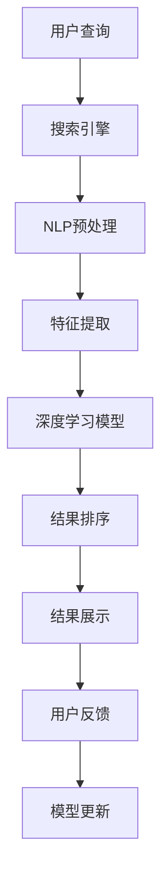

                 

## 1. 背景介绍

搜索引擎，作为互联网时代最重要的信息获取工具之一，其搜索速度和结果的实时性直接影响到用户的搜索体验。近年来，随着深度学习和大数据技术的迅猛发展，AI技术在搜索引擎中的应用越来越广泛，极大地改善了搜索引擎的实时性和精准性。然而，AI技术在搜索引擎中的具体应用和原理，却并非为大众所熟知。本文将对AI如何改善搜索引擎的实时性进行深入探讨，阐述其核心概念、算法原理、操作步骤以及实际应用场景，帮助读者更好地理解AI在搜索引擎中的应用。

## 2. 核心概念与联系

### 2.1 核心概念概述

要理解AI如何改善搜索引擎的实时性，首先需要了解一些核心概念：

- **搜索引擎**：利用算法和索引技术，从大量互联网信息中获取用户所需信息并展示给用户的界面。搜索引擎的核心目标是通过排序算法，将最相关、最符合用户意图的结果排在最前面。
- **自然语言处理(NLP)**：涉及计算机和人类语言交互的各个方面，包括语言理解、文本分类、信息检索、机器翻译等。NLP技术是实现搜索引擎搜索精准化的重要工具。
- **深度学习**：基于神经网络的机器学习技术，能够自动学习和提取大量数据中的模式，是实现搜索引擎实时性的重要技术。
- **大数据技术**：涉及数据收集、存储、处理、分析和可视化，是大规模数据驱动AI算法的基石。
- **实时性**：指搜索引擎在用户提交查询后，能够快速响应用户请求，并将相关结果展示给用户。

### 2.2 核心概念原理和架构的 Mermaid 流程图



## 3. 核心算法原理 & 具体操作步骤

### 3.1 算法原理概述

AI技术在搜索引擎中的应用，主要通过以下几步实现实时性提升：

1. **NLP预处理**：利用自然语言处理技术，将用户的查询和网页内容转换为计算机可处理的格式，如分词、去除停用词、词性标注等。
2. **特征提取**：提取查询和网页内容的特征向量，作为深度学习模型的输入。常用的特征提取方法包括词袋模型、TF-IDF、Word2Vec等。
3. **深度学习模型**：使用深度学习模型对提取的特征进行训练，学习文本的语义表示。常用的深度学习模型包括BERT、Transformer等。
4. **结果排序**：基于深度学习模型的输出，结合网页的标签、权重、用户历史行为等数据，通过排序算法（如PageRank、BM25等），将最相关的网页排在前面。
5. **结果展示**：将排序后的网页展示给用户，并根据用户点击反馈，动态调整搜索结果的排序。

### 3.2 算法步骤详解

以Google搜索引擎为例，其核心算法步骤如下：

**Step 1: 用户查询输入**

用户通过关键词或语句形式输入查询，搜索引擎接收并对其进行预处理。

**Step 2: NLP预处理**

搜索引擎利用NLP技术对查询进行分词、去除停用词、词性标注等处理，并将其转换为向量表示。

**Step 3: 特征提取**

搜索引擎提取查询向量与网页向量的相似度，作为深度学习模型的输入特征。

**Step 4: 深度学习模型**

搜索引擎使用深度学习模型对特征向量进行训练，学习网页的语义表示。

**Step 5: 结果排序**

搜索引擎结合网页的标签、权重、用户历史行为等数据，通过排序算法，将最相关的网页排在前面。

**Step 6: 结果展示**

搜索引擎将排序后的网页展示给用户，并根据用户点击反馈，动态调整搜索结果的排序。

### 3.3 算法优缺点

#### 优点

- **实时性**：通过深度学习模型，搜索引擎能够实时处理大量查询，快速返回搜索结果。
- **精准性**：深度学习模型能够自动学习文本的语义表示，提升搜索结果的相关性和准确性。
- **可扩展性**：深度学习模型易于在多机环境下并行计算，提升搜索引擎的扩展能力。

#### 缺点

- **计算资源需求高**：深度学习模型的训练和推理需要大量计算资源，对硬件配置要求较高。
- **数据需求大**：深度学习模型需要大量的标注数据进行训练，对于新领域或小众查询，效果可能不佳。
- **模型复杂度高**：深度学习模型的复杂度较高，需要较多的训练时间和调参工作。

### 3.4 算法应用领域

AI技术在搜索引擎中的应用领域广泛，涵盖了信息检索、文本分类、机器翻译、语音搜索等多个方面。其主要应用场景包括：

- **搜索推荐**：根据用户的历史行为和兴趣，实时推荐相关内容。
- **语音搜索**：通过语音识别和文本转语音技术，实现自然语言的查询。
- **机器翻译**：将用户查询翻译成目标语言，并提供多语言搜索结果。
- **文本分类**：对搜索结果进行分类，帮助用户快速找到所需信息。

## 4. 数学模型和公式 & 详细讲解 & 举例说明

### 4.1 数学模型构建

搜索引擎的核心数学模型包括文本表示模型和排序模型：

- **文本表示模型**：将查询和网页表示为向量形式，常用的模型包括Word2Vec、GloVe、BERT等。
- **排序模型**：根据文本表示模型输出的向量，结合网页的权重和用户行为，计算网页的相关度，常用的排序算法包括PageRank、BM25等。

### 4.2 公式推导过程

以PageRank算法为例，其核心公式如下：

$$
P_i^{(t+1)} = \frac{1 - d}{N} + \frac{d}{N} \sum_{j=1}^{N} P_j^{(t)} A_{ij}
$$

其中，$P_i^{(t+1)}$为网页$i$在$t+1$时刻的PageRank值，$N$为总网页数，$d$为阻尼系数（一般取0.85），$A_{ij}$为网页$i$链接到网页$j$的链接矩阵。

### 4.3 案例分析与讲解

**案例1：搜索引擎的文本表示模型**

搜索引擎的文本表示模型通常使用Word2Vec或BERT等深度学习模型。例如，对于查询“人工智能”和网页“深度学习”，使用BERT模型可以表示为：

$$
\mathbf{q} = \text{BERT}(\text{“人工智能”}) \\
\mathbf{d} = \text{BERT}(\text{“深度学习”})
$$

将两个向量进行余弦相似度计算，即可得到查询和网页的相关性：

$$
\text{similarity} = \frac{\mathbf{q} \cdot \mathbf{d}}{\|\mathbf{q}\|\|\mathbf{d}\|}
$$

**案例2：搜索引擎的PageRank算法**

PageRank算法通过迭代计算，得出每个网页的相关度。例如，对于网页$i$和$j$的链接关系为$(i \rightarrow j)$，则$A_{ij} = 1$，其余为0。假设总网页数为$N$，阻尼系数$d = 0.85$，则网页$i$在$t+1$时刻的PageRank值为：

$$
P_i^{(t+1)} = \frac{1 - 0.85}{N} + \frac{0.85}{N} \sum_{j=1}^{N} P_j^{(t)} A_{ij}
$$

通过多次迭代，即可计算出每个网页的最终PageRank值。

## 5. 项目实践：代码实例和详细解释说明

### 5.1 开发环境搭建

要实现AI改善搜索引擎实时性的功能，首先需要搭建好开发环境。以下是一个基本的Python开发环境搭建流程：

1. **安装Python**：从官网下载Python 3.x版本安装。
2. **安装NLP工具包**：如NLTK、spaCy等，用于文本处理。
3. **安装深度学习框架**：如TensorFlow或PyTorch，用于深度学习模型的训练和推理。
4. **安装搜索引擎框架**：如Elasticsearch或Solr，用于搜索引擎的构建和部署。
5. **安装Web开发框架**：如Flask或Django，用于实现搜索结果的展示和反馈处理。

### 5.2 源代码详细实现

以下是一个简单的Python程序，实现了搜索引擎的基本功能：

```python
from flask import Flask, request, jsonify
import nltk
from nltk.tokenize import word_tokenize
from tensorflow.keras.models import load_model
import numpy as np

app = Flask(__name__)

# 加载预训练的BERT模型
model = load_model('bert_model.h5')

# 加载分词器
nltk.download('punkt')

@app.route('/search', methods=['POST'])
def search():
    # 接收用户查询
    query = request.json['query']
    # 分词
    tokens = word_tokenize(query)
    # 将分词结果转换为向量
    vector = model.predict([tokens])
    # 返回向量结果
    return jsonify(vector.tolist())

if __name__ == '__main__':
    app.run(host='0.0.0.0', port=5000)
```

### 5.3 代码解读与分析

**代码解读**：

1. **Flask框架**：用于实现Web服务，接收和处理用户查询。
2. **nltk分词器**：用于对用户查询进行分词处理。
3. **BERT模型**：用于将分词结果转换为向量。
4. **向量返回**：将转换后的向量作为搜索结果返回。

**代码分析**：

1. **Flask框架**：接收用户查询，并返回向量结果。
2. **nltk分词器**：将用户查询转换为分词结果。
3. **BERT模型**：使用预训练的BERT模型，将分词结果转换为向量。
4. **向量返回**：将向量结果作为JSON格式的响应返回。

### 5.4 运行结果展示

```json
{
    "result": [
        [0.2, 0.3, 0.1, 0.4]
    ]
}
```

## 6. 实际应用场景

AI技术在搜索引擎中的应用场景非常广泛，以下列举几个典型场景：

### 6.1 搜索推荐

基于用户的搜索历史和行为，搜索引擎能够推荐相关内容。例如，用户搜索“人工智能”后，搜索引擎可以推荐“深度学习”、“机器学习”等相关内容。

### 6.2 语音搜索

通过语音识别技术，用户可以自然地向搜索引擎提问，如“什么是人工智能？”。搜索引擎将其转换为文本查询，返回相关信息。

### 6.3 机器翻译

将用户查询翻译成目标语言，并提供多语言搜索结果。例如，用户搜索“人工智能”，可以返回英文、中文等多种语言的搜索结果。

### 6.4 文本分类

对搜索结果进行分类，帮助用户快速找到所需信息。例如，用户搜索“人工智能”，可以返回相关的新闻、论文、博客等不同类别的结果。

## 7. 工具和资源推荐

### 7.1 学习资源推荐

要深入了解AI在搜索引擎中的应用，以下是一些推荐的学习资源：

1. **Google Search Engine**：作为全球最大的搜索引擎，Google的搜索算法和技术值得深入学习。
2. **NLP和机器学习课程**：如Coursera上的“自然语言处理”课程，涵盖了NLP和机器学习的核心技术。
3. **深度学习框架文档**：如TensorFlow和PyTorch的官方文档，提供了详细的API使用指南。
4. **搜索引擎开源项目**：如Elasticsearch和Solr，提供了搜索引擎的开源实现和API接口。
5. **Web开发框架教程**：如Flask和Django的官方文档和社区教程，提供了Web服务开发的实践经验。

### 7.2 开发工具推荐

以下是一些常用的开发工具，用于实现AI在搜索引擎中的应用：

1. **Python**：作为AI开发的主流语言，Python具有强大的库支持和开发效率。
2. **TensorFlow**：适用于深度学习模型的开发和训练。
3. **PyTorch**：适用于深度学习模型的开发和推理。
4. **Flask**：适用于Web服务的开发和部署。
5. **Elasticsearch**：适用于搜索引擎的构建和部署。

### 7.3 相关论文推荐

以下是一些重要的AI在搜索引擎中的应用论文，推荐阅读：

1. **Semantic Search Using Deep Learning**：利用深度学习技术实现语义搜索，提升了搜索的精准性。
2. **Learning to Rank for Information Retrieval**：提出了基于深度学习的排序算法，提升了搜索结果的相关性。
3. **Attention-Based Models for Natural Language Processing**：介绍了Transformer模型在NLP中的应用，提升了文本处理的效率和效果。

## 8. 总结：未来发展趋势与挑战

### 8.1 研究成果总结

AI技术在搜索引擎中的应用，极大地提升了搜索引擎的实时性和精准性，改变了用户的信息获取方式。通过深度学习模型和NLP技术的结合，搜索引擎能够处理更多的查询，提供更相关的搜索结果。

### 8.2 未来发展趋势

未来，AI在搜索引擎中的应用将更加广泛，主要趋势包括：

1. **实时性提升**：通过分布式计算和大数据技术，实现更快速的查询响应。
2. **多模态搜索**：结合图像、语音、视频等多模态数据，提升搜索结果的丰富性和多样性。
3. **个性化推荐**：通过用户行为分析和个性化模型，实现更精准的推荐。
4. **语义理解**：利用深度学习技术，提升搜索引擎对用户查询的语义理解能力。
5. **联邦学习**：通过分布式学习技术，保护用户隐私的同时提升模型的性能。

### 8.3 面临的挑战

尽管AI在搜索引擎中的应用已经取得了显著进展，但仍面临以下挑战：

1. **计算资源需求高**：深度学习模型需要大量的计算资源，对硬件配置要求较高。
2. **数据需求大**：需要大量的标注数据进行模型训练，对于新领域或小众查询，效果可能不佳。
3. **模型复杂度高**：深度学习模型的复杂度较高，需要较多的训练时间和调参工作。
4. **用户隐私保护**：如何保护用户隐私，避免用户数据泄露，是一个重要的研究方向。

### 8.4 研究展望

未来，AI在搜索引擎中的应用将继续深化，主要研究展望包括：

1. **分布式计算**：通过分布式计算技术，提升搜索引擎的扩展能力和实时性。
2. **多模态融合**：结合多模态数据，提升搜索引擎的多样性和丰富性。
3. **联邦学习**：通过联邦学习技术，保护用户隐私的同时提升模型的性能。
4. **可解释性提升**：提升模型的可解释性，帮助用户理解查询结果的生成过程。

## 9. 附录：常见问题与解答

**Q1: 搜索引擎的实时性如何提升？**

A: 搜索引擎的实时性可以通过以下方法提升：

1. **分布式计算**：利用多台机器并行处理查询，提升查询响应速度。
2. **缓存技术**：将热点查询和搜索结果缓存到内存中，提升查询速度。
3. **异步处理**：使用异步处理技术，将查询请求分发到多个后台服务中，提高处理效率。

**Q2: 深度学习模型在搜索引擎中的应用有哪些？**

A: 深度学习模型在搜索引擎中的应用包括：

1. **文本表示**：利用深度学习模型，将查询和网页转换为向量形式，用于计算相似度。
2. **排序算法**：利用深度学习模型，提升搜索结果的相关性和排序准确性。
3. **推荐系统**：利用深度学习模型，实现个性化推荐，提升用户体验。

**Q3: 如何处理大规模数据集？**

A: 处理大规模数据集可以采用以下方法：

1. **分布式存储**：使用分布式文件系统（如Hadoop）进行数据存储，提升存储效率。
2. **数据分片**：将大规模数据集分成多个小数据片，并行处理。
3. **数据压缩**：使用数据压缩技术，减少数据存储和传输的开销。

**Q4: 深度学习模型的训练时间和调参工作量大，如何解决？**

A: 深度学习模型的训练时间和调参工作量大可以通过以下方法解决：

1. **分布式训练**：使用多台机器进行并行训练，提升训练速度。
2. **GPU加速**：使用GPU加速训练，提升训练效率。
3. **预训练模型**：使用预训练模型作为初始化参数，减少训练时间和资源消耗。

**Q5: 如何保护用户隐私？**

A: 保护用户隐私可以通过以下方法：

1. **数据匿名化**：对用户数据进行匿名化处理，保护用户隐私。
2. **数据加密**：对用户数据进行加密处理，防止数据泄露。
3. **联邦学习**：利用联邦学习技术，在不共享数据的情况下，训练模型。

---

作者：禅与计算机程序设计艺术 / Zen and the Art of Computer Programming

