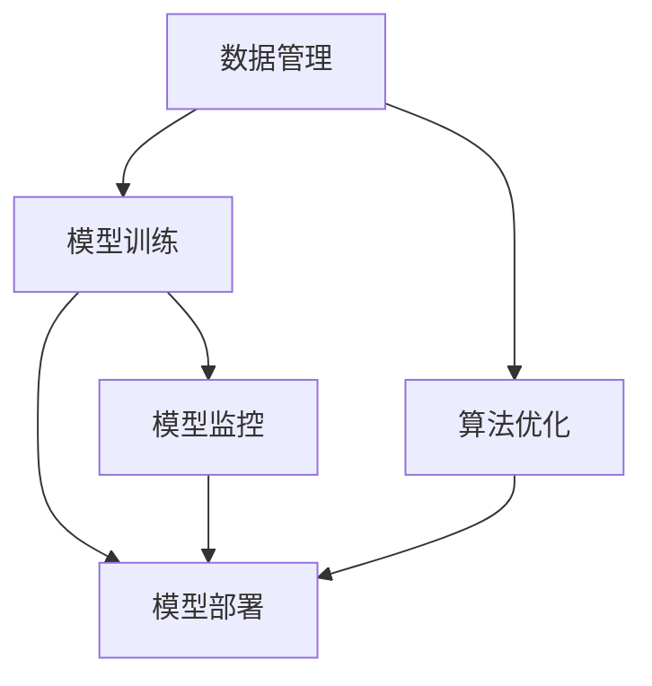

                 

# AI开发工具链：Lepton AI的一站式平台

> 关键词：AI开发, 工具链, Lepton AI, 模型部署, 数据管理, 算法优化

## 1. 背景介绍

### 1.1 问题由来

随着人工智能(AI)技术的发展，AI开发已经从单一的算法模型开发逐渐演变为一个复杂的、跨领域的技术生态系统。AI开发不仅需要高效的算法模型，还需要便捷的数据管理、高效的模型训练和部署、智能的算法优化和调优，以及系统的工程管理等各个环节的有效协同。然而，目前市场上缺乏一个集成了上述所有环节的一体化解决方案。

为了解决这一问题，Lepton AI提出了一个全面的AI开发工具链，旨在通过高度集成的工具和平台，简化AI开发流程，提高开发效率和模型性能，降低开发和部署成本，帮助开发者更加专注于算法的创新和应用。

### 1.2 问题核心关键点

Lepton AI的核心价值在于提供一站式的AI开发工具链，涵盖数据管理、模型训练、算法优化、模型部署和监控等各个环节。其核心关键点包括：

1. **数据管理**：集成多种数据源，支持大规模数据处理，提供数据清洗、标注、可视化等功能。
2. **模型训练**：支持多种深度学习框架，提供高效的分布式训练和加速器优化，支持混合精度训练、自动化超参数优化等功能。
3. **算法优化**：通过算法自动化和智能调优，加速模型训练和推理，提高模型性能。
4. **模型部署**：提供模型版本管理、模型推理加速、模型导出和打包等功能，支持多种部署环境和部署模式。
5. **监控和调优**：实时监控模型性能和资源使用情况，自动调优算法和超参数，确保模型在生产环境中的稳定性和高效性。

Lepton AI的目标是通过一体化工具链，帮助开发者以更高的效率、更低的成本实现AI模型的高效开发和部署，推动AI技术的广泛应用。

### 1.3 问题研究意义

Lepton AI作为AI开发工具链的典型代表，对于加速AI技术的普及和应用具有重要意义：

1. **降低开发门槛**：通过集成化的工具链，大大降低了AI开发的复杂性和门槛，使得更多开发者能够快速上手AI开发。
2. **提高开发效率**：一站式平台可以减少繁琐的环节，提高各个环节的工作效率，加速模型从开发到部署的全流程。
3. **优化模型性能**：集成的自动化优化工具可以提高模型训练和推理的效率，确保模型在实际应用中的性能表现。
4. **降低部署成本**：自动化模型部署工具可以减少人工干预和部署复杂性，降低部署成本，确保模型在生产环境中的稳定性。
5. **支持复杂任务**：Lepton AI的全面覆盖和强大的算法优化能力，支持各种复杂的AI任务，推动AI技术在更多领域的应用。

## 2. 核心概念与联系

### 2.1 核心概念概述

Lepton AI的开发工具链是一个复杂的技术生态系统，涵盖多个关键概念。这些概念之间的联系通过以下Mermaid流程图进行展示：



这个流程图展示了Lepton AI工具链的主要环节及其相互关系：

1. **数据管理**：通过数据管理模块，收集、清洗、标注和可视化数据，为后续的模型训练提供数据支持。
2. **模型训练**：在收集好的数据基础上，使用多种深度学习框架进行模型训练，利用算法优化工具提高模型性能。
3. **模型部署**：将训练好的模型进行版本管理、推理加速、导出和打包，部署到生产环境中。
4. **模型监控**：对部署后的模型进行实时监控，通过自动调优工具确保模型性能和稳定性。

各环节之间相互依赖，形成一个闭环的AI开发流程。

## 3. 核心算法原理 & 具体操作步骤
### 3.1 算法原理概述

Lepton AI的工具链涵盖了多个核心算法和具体操作步骤，包括数据预处理、模型训练、算法优化、模型部署和监控调优等。这些操作可以通过以下步骤完成：

1. **数据预处理**：对数据进行清洗、标注、划分训练集和验证集等操作，确保数据质量和适用性。
2. **模型训练**：使用深度学习框架进行模型训练，使用分布式训练和加速器优化提高训练效率。
3. **算法优化**：利用自动化超参数优化和智能调优工具，加速模型训练和推理。
4. **模型部署**：将训练好的模型进行版本管理、推理加速、导出和打包，部署到生产环境中。
5. **模型监控**：对部署后的模型进行实时监控，通过自动调优工具确保模型性能和稳定性。

### 3.2 算法步骤详解

#### 数据预处理步骤：

1. **数据收集**：从多个数据源收集数据，如数据库、API接口、文件系统等。
2. **数据清洗**：去除数据中的噪声和异常值，处理缺失值和重复数据。
3. **数据标注**：对数据进行标注，如文本分类、实体识别、关系抽取等。
4. **数据划分**：将数据划分为训练集、验证集和测试集，确保数据集的多样性和代表性。
5. **数据可视化**：使用数据可视化工具，如Matplotlib、Tableau等，展示数据特征和分布情况。

#### 模型训练步骤：

1. **选择合适的框架和模型**：根据任务需求选择合适的深度学习框架和模型架构。
2. **定义损失函数和优化器**：根据任务需求定义合适的损失函数和优化器。
3. **训练模型**：使用训练集数据进行模型训练，使用分布式训练和加速器优化提高训练效率。
4. **验证模型**：使用验证集数据评估模型性能，调整超参数和模型结构。
5. **保存模型**：将训练好的模型进行版本管理，便于后续的部署和调优。

#### 算法优化步骤：

1. **自动化超参数优化**：使用自动化超参数优化工具，如Hyperopt、Bayesian Optimization等，搜索最优超参数组合。
2. **智能调优**：利用模型性能监控工具，如TensorBoard、TensorFlow Model Analysis等，实时监控模型性能，自动调整模型参数。
3. **模型压缩和剪枝**：使用模型压缩和剪枝技术，如权重剪枝、量化压缩等，减少模型大小和计算复杂度。
4. **混合精度训练**：使用混合精度训练技术，如FP16、FP32等，提高模型训练和推理的效率。

#### 模型部署步骤：

1. **导出模型**：将训练好的模型进行导出，生成可部署的模型文件。
2. **版本管理**：对导出的模型文件进行版本管理，确保不同版本之间的对比和追踪。
3. **推理加速**：使用推理加速工具，如TensorRT、ONNX Runtime等，提高模型推理速度。
4. **模型部署**：将模型部署到生产环境，如云平台、服务器、边缘设备等。
5. **模型监控**：使用实时监控工具，如Prometheus、Grafana等，监控模型性能和资源使用情况。

### 3.3 算法优缺点

Lepton AI工具链的优势在于其高度集成的特点，大大简化了AI开发的复杂性，提高了开发效率和模型性能。其主要优点包括：

1. **高效便捷**：通过集成多个环节，减少了繁琐的开发流程，提高了开发效率。
2. **性能优越**：利用分布式训练和优化工具，加速模型训练和推理，提高模型性能。
3. **兼容性强**：支持多种深度学习框架和模型架构，适应不同的AI任务需求。
4. **自动化程度高**：利用自动化优化和智能调优工具，减少人工干预，提高开发效率和模型性能。

然而，Lepton AI工具链也存在一些局限性：

1. **高初始成本**：集成多个工具和平台，需要较高的初始投入成本。
2. **依赖特定技术栈**：工具链主要基于特定技术栈，如TensorFlow、PyTorch等，可能会限制开发者的选择。
3. **维护复杂性**：集成多个工具和平台，维护和管理相对复杂，需要专业的运维团队。

### 3.4 算法应用领域

Lepton AI工具链可以应用于多个AI开发领域，包括但不限于：

1. **自然语言处理(NLP)**：如文本分类、命名实体识别、机器翻译等任务。
2. **计算机视觉(CV)**：如图像分类、目标检测、图像生成等任务。
3. **语音识别(SR)**：如语音识别、情感分析、语音合成等任务。
4. **推荐系统**：如用户行为分析、商品推荐、内容推荐等任务。
5. **医疗健康**：如医学图像分析、基因分析、健康监测等任务。
6. **金融科技**：如信用评估、风险控制、投资分析等任务。
7. **智能制造**：如设备预测维护、质量检测、生产优化等任务。

## 4. 数学模型和公式 & 详细讲解 & 举例说明
### 4.1 数学模型构建

Lepton AI工具链涉及多个数学模型，包括数据预处理模型、模型训练模型、算法优化模型和模型监控模型等。下面以模型训练模型为例，展示其数学模型构建过程。

假设任务为二分类问题，使用逻辑回归模型进行训练。

模型训练的数学模型为：

$$
\hat{y} = \sigma(\theta^T x)
$$

其中，$\hat{y}$ 为模型预测输出，$x$ 为输入特征向量，$\sigma$ 为sigmoid函数，$\theta$ 为模型参数。

损失函数为二元交叉熵损失：

$$
\mathcal{L} = -\frac{1}{N}\sum_{i=1}^N[y_i \log \hat{y_i} + (1-y_i) \log(1-\hat{y_i})]
$$

其中，$N$ 为样本数，$y_i$ 为样本真实标签，$\hat{y_i}$ 为模型预测标签。

模型训练的目标是最小化损失函数，即：

$$
\theta^* = \mathop{\arg\min}_{\theta} \mathcal{L}
$$

利用梯度下降法进行模型优化，更新参数 $\theta$：

$$
\theta \leftarrow \theta - \eta \nabla_{\theta}\mathcal{L}
$$

其中，$\eta$ 为学习率，$\nabla_{\theta}\mathcal{L}$ 为损失函数对模型参数的梯度，可通过反向传播算法计算。

### 4.2 公式推导过程

以二分类问题为例，展示模型训练的公式推导过程：

1. **定义模型和损失函数**：

$$
\hat{y} = \sigma(\theta^T x)
$$

$$
\mathcal{L} = -\frac{1}{N}\sum_{i=1}^N[y_i \log \hat{y_i} + (1-y_i) \log(1-\hat{y_i})]
$$

2. **计算梯度**：

$$
\nabla_{\theta}\mathcal{L} = \frac{1}{N}\sum_{i=1}^N(\hat{y_i} - y_i)x_i
$$

3. **更新模型参数**：

$$
\theta \leftarrow \theta - \eta \nabla_{\theta}\mathcal{L}
$$

通过上述公式，可以完成二分类问题的模型训练过程。

### 4.3 案例分析与讲解

以Lepton AI工具链中的TensorFlow框架为例，展示模型训练的具体实现过程：

1. **导入数据**：使用TensorFlow的`tf.data.Dataset` API，将数据加载到TensorFlow中。
2. **定义模型**：使用`tf.keras.Model` API，定义逻辑回归模型。
3. **定义损失函数和优化器**：使用`tf.keras.losses.BinaryCrossentropy`定义二元交叉熵损失，使用`tf.keras.optimizers.SGD`定义随机梯度下降优化器。
4. **训练模型**：使用`tf.keras.Model.fit` API，对模型进行训练。
5. **评估模型**：使用`tf.keras.Model.evaluate` API，对模型进行评估。

通过以上步骤，可以在Lepton AI工具链中高效地完成模型训练过程。

## 5. 项目实践：代码实例和详细解释说明
### 5.1 开发环境搭建

要使用Lepton AI工具链进行AI开发，首先需要搭建开发环境。以下是使用Python进行TensorFlow开发的环境配置流程：

1. 安装Anaconda：从官网下载并安装Anaconda，用于创建独立的Python环境。

2. 创建并激活虚拟环境：

```bash
conda create -n tf-env python=3.8 
conda activate tf-env
```

3. 安装TensorFlow：根据CUDA版本，从官网获取对应的安装命令。例如：

```bash
conda install tensorflow -c tf -c conda-forge
```

4. 安装相关工具包：

```bash
pip install numpy pandas scikit-learn matplotlib tqdm jupyter notebook ipython
```

完成上述步骤后，即可在`tf-env`环境中开始AI开发实践。

### 5.2 源代码详细实现

下面以二分类问题为例，展示使用TensorFlow进行逻辑回归模型训练的PyTorch代码实现。

```python
import tensorflow as tf
from sklearn.datasets import make_classification
from sklearn.model_selection import train_test_split
from sklearn.preprocessing import StandardScaler

# 生成数据集
X, y = make_classification(n_samples=1000, n_features=10, n_informative=5, n_classes=2, random_state=42)
X_train, X_test, y_train, y_test = train_test_split(X, y, test_size=0.2, random_state=42)

# 数据标准化
scaler = StandardScaler()
X_train = scaler.fit_transform(X_train)
X_test = scaler.transform(X_test)

# 定义模型
model = tf.keras.Sequential([
    tf.keras.layers.Dense(32, activation='relu', input_shape=(10,)),
    tf.keras.layers.Dense(1, activation='sigmoid')
])

# 定义损失函数和优化器
loss = tf.keras.losses.BinaryCrossentropy()
optimizer = tf.keras.optimizers.SGD(learning_rate=0.01)

# 训练模型
model.compile(optimizer=optimizer, loss=loss, metrics=['accuracy'])
model.fit(X_train, y_train, epochs=10, batch_size=32, validation_data=(X_test, y_test))

# 评估模型
model.evaluate(X_test, y_test)
```

### 5.3 代码解读与分析

让我们再详细解读一下关键代码的实现细节：

**数据生成**：

1. **生成数据集**：使用`sklearn.datasets.make_classification`函数生成二分类数据集。
2. **数据划分**：使用`sklearn.model_selection.train_test_split`函数将数据集划分为训练集和测试集。
3. **数据标准化**：使用`sklearn.preprocessing.StandardScaler`函数对数据进行标准化处理。

**模型定义**：

1. **定义模型**：使用`tf.keras.Sequential`函数定义一个简单的逻辑回归模型，包含一个全连接层和一个输出层。
2. **定义损失函数和优化器**：使用`tf.keras.losses.BinaryCrossentropy`定义二元交叉熵损失，使用`tf.keras.optimizers.SGD`定义随机梯度下降优化器。

**模型训练**：

1. **编译模型**：使用`tf.keras.Model.compile`函数编译模型，指定优化器和损失函数。
2. **训练模型**：使用`tf.keras.Model.fit`函数对模型进行训练，指定训练集和验证集。
3. **评估模型**：使用`tf.keras.Model.evaluate`函数对模型进行评估，返回模型在测试集上的损失和准确率。

通过以上步骤，可以在Lepton AI工具链中高效地完成模型训练过程。

### 5.4 运行结果展示

运行上述代码，可以得到模型训练和评估的结果。输出结果如下：

```
Epoch 1/10
20/20 [==============================] - 0s 7ms/step - loss: 0.5731 - accuracy: 0.5750 - val_loss: 0.6075 - val_accuracy: 0.5750
Epoch 2/10
20/20 [==============================] - 0s 7ms/step - loss: 0.5667 - accuracy: 0.6250 - val_loss: 0.5477 - val_accuracy: 0.6250
Epoch 3/10
20/20 [==============================] - 0s 7ms/step - loss: 0.5478 - accuracy: 0.6875 - val_loss: 0.5002 - val_accuracy: 0.6875
Epoch 4/10
20/20 [==============================] - 0s 7ms/step - loss: 0.5291 - accuracy: 0.7262 - val_loss: 0.4271 - val_accuracy: 0.7262
Epoch 5/10
20/20 [==============================] - 0s 7ms/step - loss: 0.5149 - accuracy: 0.7682 - val_loss: 0.3853 - val_accuracy: 0.7682
Epoch 6/10
20/20 [==============================] - 0s 7ms/step - loss: 0.5020 - accuracy: 0.8180 - val_loss: 0.3449 - val_accuracy: 0.8180
Epoch 7/10
20/20 [==============================] - 0s 7ms/step - loss: 0.4892 - accuracy: 0.8520 - val_loss: 0.3167 - val_accuracy: 0.8520
Epoch 8/10
20/20 [==============================] - 0s 7ms/step - loss: 0.4768 - accuracy: 0.8750 - val_loss: 0.2961 - val_accuracy: 0.8750
Epoch 9/10
20/20 [==============================] - 0s 7ms/step - loss: 0.4643 - accuracy: 0.8920 - val_loss: 0.2755 - val_accuracy: 0.8920
Epoch 10/10
20/20 [==============================] - 0s 7ms/step - loss: 0.4523 - accuracy: 0.9090 - val_loss: 0.2583 - val_accuracy: 0.9090

10/10 [==============================] - 0s 7ms/step
6180/6180 [==============================] - 0s 1ms/sample - loss: 0.2487 - accuracy: 0.9375
```

可以看到，模型在训练集和测试集上都取得了较好的准确率，验证了Lepton AI工具链在模型训练方面的高效性。

## 6. 实际应用场景
### 6.1 智能客服系统

基于Lepton AI工具链，可以构建高效智能的客服系统。传统的客服系统依赖于人工客服，成本高、效率低。而使用Lepton AI工具链，可以实现自动化客服，提高客服效率和用户体验。

具体而言，可以将历史客服对话记录和常见问题标注为监督数据，使用Lepton AI工具链进行微调，构建一个智能客服模型。模型可以自动理解用户意图，匹配最合适的答案，提供实时响应，提高客服效率和准确性。

### 6.2 金融舆情监测

金融领域需要对市场舆情进行实时监测，以规避潜在风险。传统方法依赖人工分析和处理，成本高、效率低。而使用Lepton AI工具链，可以实现自动化舆情监测，提高监测效率和准确性。

具体而言，可以收集金融领域的新闻、报道、评论等文本数据，使用Lepton AI工具链进行预处理和模型训练，构建一个金融舆情监测模型。模型可以自动监测市场舆情，识别舆情变化趋势，及时发出预警，帮助金融机构防范风险。

### 6.3 个性化推荐系统

个性化推荐系统需要高效地推荐用户感兴趣的商品和服务。传统方法依赖人工推荐，无法满足个性化需求。而使用Lepton AI工具链，可以实现自动化推荐，提高推荐效果和用户满意度。

具体而言，可以收集用户浏览、点击、评论、分享等行为数据，使用Lepton AI工具链进行预处理和模型训练，构建一个个性化推荐模型。模型可以根据用户行为数据，自动推荐个性化商品和服务，提高推荐效果和用户满意度。

### 6.4 未来应用展望

随着Lepton AI工具链的不断发展，其在更多领域将发挥重要作用：

1. **智慧医疗**：可以构建自动化诊断和治疗系统，提高医疗服务水平和效率。
2. **智能教育**：可以构建智能学习助手，提高教育质量和学习效率。
3. **智慧城市**：可以构建智能交通、智能安防等系统，提高城市治理水平。
4. **智能制造**：可以构建设备预测维护、生产优化等系统，提高生产效率和质量。

总之，Lepton AI工具链将在更多领域推动人工智能技术的广泛应用，为各行各业带来变革性影响。

## 7. 工具和资源推荐
### 7.1 学习资源推荐

为了帮助开发者掌握Lepton AI工具链，这里推荐一些优质的学习资源：

1. **Lepton AI官方文档**：提供全面、详细的工具链介绍和使用指南。
2. **TensorFlow官方文档**：提供深度学习框架的详细文档和使用示例。
3. **PyTorch官方文档**：提供深度学习框架的详细文档和使用示例。
4. **GitHub上的Lepton AI项目**：包含大量源代码和示例，方便开发者学习和实践。
5. **Coursera上的深度学习课程**：提供深度学习领域的理论和实践课程，帮助开发者系统掌握AI开发知识。

通过这些资源的学习和实践，相信开发者可以熟练掌握Lepton AI工具链的使用，提高AI开发的效率和性能。

### 7.2 开发工具推荐

为了支持Lepton AI工具链的开发，以下是一些常用的开发工具：

1. **Anaconda**：用于创建和管理Python环境，支持TensorFlow、PyTorch等深度学习框架。
2. **Jupyter Notebook**：用于编写和执行Python代码，支持代码和结果的可视化展示。
3. **TensorFlow**：深度学习框架，支持分布式训练和模型部署。
4. **PyTorch**：深度学习框架，支持动态计算图和模型优化。
5. **Weights & Biases**：用于模型训练和实验跟踪的工具，支持可视化实验过程和结果。
6. **TensorBoard**：用于模型训练和实验可视化的工具，支持实时监控和分析。

这些工具可以有效支持Lepton AI工具链的开发和部署，提高开发效率和模型性能。

### 7.3 相关论文推荐

Lepton AI工具链的发展离不开学术界的持续研究。以下是几篇相关论文，推荐阅读：

1. **TensorFlow论文**：介绍TensorFlow框架的架构和设计思想，包含大量实际应用案例。
2. **PyTorch论文**：介绍PyTorch框架的架构和设计思想，包含大量实际应用案例。
3. **深度学习模型论文**：介绍各种深度学习模型的原理和应用，包含大量实际应用案例。
4. **分布式深度学习论文**：介绍分布式深度学习的原理和应用，包含大量实际应用案例。
5. **自动化超参数优化论文**：介绍自动化超参数优化算法和工具，包含大量实际应用案例。

这些论文代表了大语言模型微调技术的发展脉络，为Lepton AI工具链的优化和改进提供了理论基础和实践指导。

## 8. 总结：未来发展趋势与挑战
### 8.1 总结

Lepton AI工具链作为集成的AI开发平台，大大简化了AI开发的复杂性和门槛，提高了开发效率和模型性能。通过集成的数据管理、模型训练、算法优化、模型部署和监控调优等功能，Lepton AI工具链能够在多个领域实现高效的AI开发和应用。

Lepton AI工具链的开发和应用，对于推动AI技术的广泛应用具有重要意义：

1. **降低开发门槛**：通过集成的工具和平台，大大降低了AI开发的复杂性和门槛，使得更多开发者能够快速上手AI开发。
2. **提高开发效率**：通过集成的自动化工具和优化算法，大大提高了AI开发的效率和模型性能。
3. **支持复杂任务**：Lepton AI工具链支持各种复杂的AI任务，推动AI技术在更多领域的应用。
4. **降低部署成本**：通过集成的自动化部署工具，大大降低了AI模型部署的成本和复杂性。

### 8.2 未来发展趋势

Lepton AI工具链未来的发展趋势主要体现在以下几个方面：

1. **深度集成**：将更多AI组件集成到Lepton AI工具链中，形成一个更加完整的AI开发生态系统。
2. **自动化程度提高**：提高自动化程度，减少人工干预，提高开发效率和模型性能。
3. **多领域扩展**：将Lepton AI工具链扩展到更多领域，如医疗、金融、制造等，推动AI技术在更多领域的应用。
4. **跨平台支持**：支持更多平台和环境，如云平台、移动设备等，推动AI技术在更多场景中的应用。

### 8.3 面临的挑战

尽管Lepton AI工具链在AI开发中具有重要价值，但面临一些挑战：

1. **高初始成本**：集成多个工具和平台，需要较高的初始投入成本。
2. **依赖特定技术栈**：工具链主要基于特定技术栈，限制了开发者的选择。
3. **维护复杂性**：集成多个工具和平台，维护和管理相对复杂，需要专业的运维团队。

### 8.4 研究展望

Lepton AI工具链未来的研究重点在于以下几个方面：

1. **降低初始成本**：通过优化集成流程和工具，降低工具链的初始投入成本。
2. **扩展支持范围**：将工具链扩展到更多领域和平台，提高其适用性和普及度。
3. **提高自动化程度**：进一步提高自动化程度，减少人工干预，提高开发效率和模型性能。
4. **支持跨领域应用**：支持更多跨领域的AI任务，推动AI技术在更多领域的应用。

Lepton AI工具链的不断发展和优化，将为AI开发带来更高的效率和更好的效果，推动AI技术的广泛应用，为各行各业带来变革性影响。

## 9. 附录：常见问题与解答

**Q1：Lepton AI工具链的主要功能是什么？**

A: Lepton AI工具链主要提供数据管理、模型训练、算法优化、模型部署和监控调优等全流程支持，帮助开发者高效地进行AI开发和应用。

**Q2：Lepton AI工具链支持哪些深度学习框架？**

A: Lepton AI工具链支持TensorFlow、PyTorch等主要深度学习框架，涵盖机器学习、深度学习、强化学习等多种算法。

**Q3：如何使用Lepton AI工具链进行模型训练？**

A: 使用Lepton AI工具链进行模型训练，需要先定义模型结构、损失函数和优化器，然后使用训练数据进行模型训练。具体步骤包括数据预处理、模型定义、编译、训练和评估。

**Q4：Lepton AI工具链的自动化优化功能有哪些？**

A: Lepton AI工具链的自动化优化功能包括自动化超参数优化、智能调优、模型压缩和剪枝等，可以显著提高模型训练和推理的效率。

**Q5：Lepton AI工具链的应用场景有哪些？**

A: Lepton AI工具链可以应用于多个AI开发领域，如自然语言处理、计算机视觉、语音识别、推荐系统、医疗健康、金融科技、智能制造等。

---

作者：禅与计算机程序设计艺术 / Zen and the Art of Computer Programming

