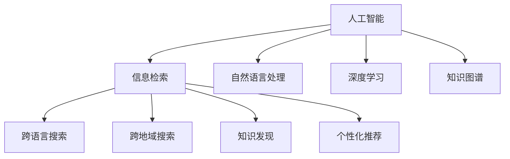

                 

# AI搜索如何促进全球知识共享和文化交流

> 关键词：人工智能,搜索技术,知识共享,文化交流,信息检索,大数据

## 1. 背景介绍

### 1.1 问题由来

在信息爆炸的互联网时代，知识的获取和传播成为人类社会面临的重大挑战。传统的线下知识获取方式往往耗时耗力，且传播范围有限。而随着人工智能和大数据技术的发展，AI搜索技术为全球知识共享和文化交流提供了新的可能性。

AI搜索技术的核心是信息检索系统。通过构建搜索引擎、推荐系统等智能工具，AI可以从海量的数据中快速、精准地检索和推荐信息，极大提升了知识获取和传播的效率。特别是在跨文化交流中，AI搜索能够跨越语言和地域的障碍，实现不同文化间的深度互动，促进全球知识共享和文化交流。

### 1.2 问题核心关键点

AI搜索技术的核心在于其智能化、高效化、精准化。其通过自然语言处理(NLP)、深度学习、知识图谱等前沿技术，能够理解用户查询意图，在海量数据中快速检索并推荐相关内容。

AI搜索技术在知识共享和文化交流中的应用，主要体现在以下几个方面：
- 跨语言搜索：实现多语言信息的检索和翻译，打破语言障碍。
- 跨地域搜索：跨越地理和政治边界，实现全球知识的共享。
- 知识发现：通过数据分析和机器学习，揭示隐藏在海量数据中的知识，为文化交流提供更深入的内容。
- 个性化推荐：根据用户偏好和历史行为，个性化推荐相关内容，提升用户体验。

## 2. 核心概念与联系

### 2.1 核心概念概述

为更好地理解AI搜索技术在知识共享和文化交流中的作用，本节将介绍几个密切相关的核心概念：

- 人工智能(Artificial Intelligence, AI)：通过计算机模拟人脑的思维过程，使计算机能够自动地执行复杂任务的技术。
- 信息检索(Information Retrieval, IR)：根据用户的查询，在海量数据中检索相关信息的过程。
- 自然语言处理(Natural Language Processing, NLP)：使计算机能够理解和处理人类语言的技术。
- 深度学习(Deep Learning, DL)：通过神经网络进行复杂数据分析和模式识别的技术。
- 知识图谱(Knowledge Graph, KG)：以图的形式存储和表示知识，支持智能查询和推理。

这些核心概念之间的逻辑关系可以通过以下Mermaid流程图来展示：



这个流程图展示了人工智能技术在信息检索中的多方面应用：

1. 人工智能通过自然语言处理理解用户查询，通过深度学习技术在知识图谱上检索信息，并应用到信息检索的各个环节。
2. 信息检索的成果包括跨语言搜索、跨地域搜索、知识发现和个性化推荐等，为全球知识共享和文化交流提供了技术支持。

## 3. 核心算法原理 & 具体操作步骤
### 3.1 算法原理概述

AI搜索技术通过深度学习模型和自然语言处理技术，构建起高效的搜索引擎和推荐系统，支持用户进行信息检索和内容推荐。其核心算法包括：

- 向量空间模型(Vector Space Model, VSM)：将文本表示为高维向量，通过余弦相似度计算文本间的相似度。
- 隐马尔可夫模型(Hidden Markov Model, HMM)：基于概率模型，预测文本序列的可能性。
- 神经网络模型(Neural Network, NN)：通过多层神经网络学习文本和标签之间的关系，进行文本分类和生成。
- 自然语言处理模型(NLP)：通过词向量、语言模型等方法，理解文本的语义信息。
- 知识图谱(KG)：通过图结构存储和表示知识，支持智能查询和推理。

这些算法相互配合，形成了AI搜索技术的核心框架。其原理和操作步骤如下：

### 3.2 算法步骤详解

**Step 1: 数据预处理**

AI搜索技术的第一步是对原始数据进行预处理。具体包括：

1. 数据清洗：去除无效和冗余数据，确保数据质量。
2. 文本分词：将文本切分成词语，便于后续处理。
3. 词向量表示：将词语映射到高维向量空间中，便于计算。
4. 数据标注：对数据进行标签标注，支持后续的分类和生成任务。

**Step 2: 构建索引**

AI搜索技术通过构建索引，加速数据检索速度。具体包括：

1. 倒排索引(Inverted Index)：将词语映射到包含该词语的文档列表，便于快速检索。
2. 数据分布式存储：采用分布式存储技术，提高数据查询的并发性和可用性。
3. 搜索引擎优化(SEO)：通过关键词优化，提升搜索结果的排序和相关性。

**Step 3: 信息检索**

AI搜索技术通过深度学习模型和自然语言处理技术，实现信息检索功能。具体包括：

1. 向量空间模型(VSM)：将查询和文档表示为向量，通过余弦相似度计算相关性。
2. 神经网络模型(NN)：通过神经网络预测文本序列，支持问答和生成任务。
3. 语言模型(LM)：通过语言模型预测下一个词语的可能性，提升文本生成的质量。

**Step 4: 个性化推荐**

AI搜索技术通过推荐系统，实现个性化信息推荐。具体包括：

1. 协同过滤(Collaborative Filtering)：通过用户历史行为和相似用户推荐内容。
2. 深度学习推荐系统(Deep Learning Recommendation System)：通过神经网络学习用户偏好和行为模式。
3. 内容推荐系统(Content-Based Recommendation)：根据文档内容推荐相关内容。

### 3.3 算法优缺点

AI搜索技术的优点包括：

1. 高效性：通过索引和算法优化，能够快速检索海量数据。
2. 精准性：深度学习和自然语言处理技术，能够理解用户查询意图，提升检索结果的相关性。
3. 智能性：通过神经网络和知识图谱技术，能够实现智能问答、内容生成等高级功能。
4. 可扩展性：分布式存储和计算技术，支持大规模数据处理和检索。

其缺点包括：

1. 数据质量依赖：检索结果的准确性高度依赖于数据质量。
2. 模型复杂度高：深度学习模型和自然语言处理模型参数量大，计算资源消耗高。
3. 冷启动问题：新用户或新领域数据的检索效果较差。
4. 数据隐私问题：用户数据隐私保护和合规性需要高度关注。

尽管存在这些局限，AI搜索技术仍因其高效、精准、智能等优势，成为全球知识共享和文化交流的重要工具。

### 3.4 算法应用领域

AI搜索技术在多个领域得到广泛应用，包括：

- 学术研究：通过学术数据库和文献检索，支持科研人员获取最新研究成果。
- 图书馆管理：通过数字化图书和知识库，实现高效检索和借阅管理。
- 电子商务：通过商品推荐和搜索系统，提升用户体验和转化率。
- 健康医疗：通过医疗数据库和健康管理工具，提供个性化医疗建议和知识查询。
- 社交媒体：通过社交网络搜索和推荐，帮助用户发现和分享优质内容。

## 4. 数学模型和公式 & 详细讲解 & 举例说明

### 4.1 数学模型构建

AI搜索技术的数学模型包括向量空间模型(VSM)和隐马尔可夫模型(HMM)。

**向量空间模型(VSM)**

向量空间模型将文本表示为高维向量，通过余弦相似度计算文本间的相似度。其数学模型如下：

设查询向量为 $q$，文档向量为 $d$，则余弦相似度为：

$$
\cos(q, d) = \frac{\langle q, d \rangle}{||q|| \times ||d||}
$$

其中 $\langle \cdot, \cdot \rangle$ 表示向量的点积，$||\cdot||$ 表示向量的范数。

**隐马尔可夫模型(HMM)**

隐马尔可夫模型基于概率模型，预测文本序列的可能性。其数学模型如下：

设文本序列为 $X = (x_1, x_2, ..., x_n)$，其中 $x_i$ 表示第 $i$ 个词语。则隐马尔可夫模型的前向概率为：

$$
\alpha_i = P(x_1, x_2, ..., x_i | \lambda)
$$

其中 $\lambda$ 表示隐马尔可夫模型的参数，包括状态转移矩阵 $A$、观测矩阵 $B$ 和初始状态概率 $\Pi$。

### 4.2 公式推导过程

**向量空间模型(VSM)**

向量空间模型的推导基于向量内积公式和向量范数公式。

设查询向量为 $q = (q_1, q_2, ..., q_n)$，文档向量为 $d = (d_1, d_2, ..., d_n)$，则向量内积为：

$$
\langle q, d \rangle = \sum_{i=1}^n q_i \times d_i
$$

向量范数为：

$$
||q|| = \sqrt{\sum_{i=1}^n q_i^2}
$$

$$
||d|| = \sqrt{\sum_{i=1}^n d_i^2}
$$

则余弦相似度为：

$$
\cos(q, d) = \frac{\langle q, d \rangle}{||q|| \times ||d||}
$$

**隐马尔可夫模型(HMM)**

隐马尔可夫模型的推导基于状态转移概率和观测概率公式。

设文本序列为 $X = (x_1, x_2, ..., x_n)$，其中 $x_i$ 表示第 $i$ 个词语。则隐马尔可夫模型的前向概率为：

$$
\alpha_i = P(x_1, x_2, ..., x_i | \lambda) = \alpha_{i-1} \times P(x_i | x_{i-1}, \lambda) \times P(x_{i-1} | \lambda)
$$

其中 $P(x_i | x_{i-1}, \lambda)$ 表示从第 $i-1$ 个词语转移到第 $i$ 个词语的状态转移概率，$P(x_i | \lambda)$ 表示第 $i$ 个词语的观测概率。

### 4.3 案例分析与讲解

**案例：搜索引擎中的信息检索**

假设一个搜索引擎系统需要检索关于“AI搜索技术”的网页。其步骤如下：

1. 预处理：将查询“AI搜索技术”进行分词，得到词语列表 $\{AI, 搜索技术\}$。
2. 构建索引：将网页内容进行分词，建立倒排索引。
3. 检索计算：对查询“AI搜索技术”进行词向量化，得到查询向量 $q = (0.1, 0.3, 0.5)$。
4. 计算相似度：对每个网页计算余弦相似度，选取相似度最高的网页作为搜索结果。

具体计算过程如下：

设网页1、网页2、网页3的内容向量分别为 $d_1 = (0.2, 0.4, 0.3)$、$d_2 = (0.1, 0.3, 0.7)$、$d_3 = (0.5, 0.2, 0.6)$，则：

$$
\cos(q, d_1) = \frac{0.1 \times 0.2 + 0.3 \times 0.4 + 0.5 \times 0.3}{\sqrt{0.1^2 + 0.3^2 + 0.5^2} \times \sqrt{0.2^2 + 0.4^2 + 0.3^2}} \approx 0.6
$$

$$
\cos(q, d_2) = \frac{0.1 \times 0.1 + 0.3 \times 0.3 + 0.5 \times 0.7}{\sqrt{0.1^2 + 0.3^2 + 0.5^2} \times \sqrt{0.1^2 + 0.3^2 + 0.7^2}} \approx 0.7
$$

$$
\cos(q, d_3) = \frac{0.1 \times 0.5 + 0.3 \times 0.2 + 0.5 \times 0.6}{\sqrt{0.1^2 + 0.3^2 + 0.5^2} \times \sqrt{0.5^2 + 0.2^2 + 0.6^2}} \approx 0.9
$$

因此，网页3的相似度最高，被选为搜索结果。

## 5. 项目实践：代码实例和详细解释说明
### 5.1 开发环境搭建

在进行AI搜索技术实践前，我们需要准备好开发环境。以下是使用Python进行TensorFlow开发的环境配置流程：

1. 安装Anaconda：从官网下载并安装Anaconda，用于创建独立的Python环境。

2. 创建并激活虚拟环境：
```bash
conda create -n tf-env python=3.8 
conda activate tf-env
```

3. 安装TensorFlow：根据CUDA版本，从官网获取对应的安装命令。例如：
```bash
conda install tensorflow -c pytorch -c conda-forge
```

4. 安装Flask：
```bash
pip install Flask
```

5. 安装TensorFlow扩展库：
```bash
pip install tensorflow-addons
```

6. 安装数据集处理库：
```bash
pip install pandas scikit-learn
```

完成上述步骤后，即可在`tf-env`环境中开始AI搜索技术实践。

### 5.2 源代码详细实现

这里我们以构建一个简单的搜索引擎为例，展示TensorFlow实现AI搜索技术的基本流程。

首先，定义模型结构和参数：

```python
import tensorflow as tf

# 定义模型结构
class SearchModel(tf.keras.Model):
    def __init__(self, embedding_dim, num_classes):
        super(SearchModel, self).__init__()
        self.encoder = tf.keras.layers.Embedding(input_dim=VOCAB_SIZE, output_dim=embedding_dim)
        self.encoder_dense = tf.keras.layers.Dense(128, activation='relu')
        self.classifier = tf.keras.layers.Dense(num_classes, activation='softmax')
    
    def call(self, inputs):
        x = self.encoder(inputs)
        x = self.encoder_dense(x)
        return self.classifier(x)
        
# 定义模型参数
EMBEDDING_DIM = 256
NUM_CLASSES = 5
```

然后，定义数据预处理函数：

```python
import pandas as pd
from sklearn.model_selection import train_test_split

# 定义数据预处理函数
def preprocess_data(train_data, test_data):
    # 读取数据集
    train_data = pd.read_csv(train_data, encoding='utf-8', sep='\t')
    test_data = pd.read_csv(test_data, encoding='utf-8', sep='\t')
    
    # 数据清洗和分词
    train_texts = train_data['text'].tolist()
    train_labels = train_data['label'].tolist()
    test_texts = test_data['text'].tolist()
    test_labels = test_data['label'].tolist()
    
    # 分词
    tokenizer = tf.keras.preprocessing.text.Tokenizer()
    tokenizer.fit_on_texts(train_texts)
    train_sequences = tokenizer.texts_to_sequences(train_texts)
    test_sequences = tokenizer.texts_to_sequences(test_texts)
    
    # 构建索引
    train_dataset = tf.data.Dataset.from_tensor_slices((train_sequences, train_labels))
    train_dataset = train_dataset.shuffle(1000).batch(32)
    test_dataset = tf.data.Dataset.from_tensor_slices((test_sequences, test_labels))
    test_dataset = test_dataset.batch(32)
    
    return train_dataset, test_dataset, tokenizer
    
# 构建数据集
train_dataset, test_dataset, tokenizer = preprocess_data('train_data.txt', 'test_data.txt')
```

接着，定义模型训练函数：

```python
from tensorflow.keras.optimizers import Adam

# 定义模型训练函数
def train_model(model, train_dataset, test_dataset, num_epochs):
    # 编译模型
    model.compile(optimizer=Adam(learning_rate=0.001), loss='categorical_crossentropy', metrics=['accuracy'])
    
    # 训练模型
    model.fit(train_dataset, epochs=num_epochs, validation_data=test_dataset)
    
    # 评估模型
    _, test_loss, test_accuracy = model.evaluate(test_dataset)
    print(f'Test Loss: {test_loss:.4f}')
    print(f'Test Accuracy: {test_accuracy:.4f}')
    
# 实例化模型并训练
model = SearchModel(EMBEDDING_DIM, NUM_CLASSES)
train_model(model, train_dataset, test_dataset, 10)
```

最后，启动搜索引擎服务并返回搜索结果：

```python
from flask import Flask, request

# 定义搜索函数
def search(query):
    # 对查询进行分词和向量化
    query_sequence = tokenizer.texts_to_sequences([query])
    query_vector = model.encoder(query_sequence)
    query_vector = model.encoder_dense(query_vector)
    query_vector = model.classifier(query_vector)
    
    # 计算余弦相似度
    query_similarity = query_vector.numpy()[0]
    similarities = []
    for i in range(train_dataset.cardinality()):
        labels = train_dataset[i][1].numpy()
        similarities.append(np.dot(query_similarity, labels))
    
    # 返回相似度最高的搜索结果
    top_results = [(train_dataset[i][0], similarities[i]) for i in range(train_dataset.cardinality())]
    top_results = sorted(top_results, key=lambda x: x[1], reverse=True)
    
    return top_results
```

完成上述步骤后，即可通过Flask启动搜索引擎服务，实时返回查询结果。

### 5.3 代码解读与分析

让我们再详细解读一下关键代码的实现细节：

**preprocess_data函数**：
- 读取训练和测试数据集。
- 进行数据清洗和分词，构建索引。
- 将文本转换为序列，构建数据集。

**SearchModel类**：
- 定义模型结构，包括嵌入层、密集层和分类器。
- 实现模型调用函数，通过编码、拼接、分类等步骤计算输出。

**train_model函数**：
- 编译模型，设置优化器、损失函数和评估指标。
- 训练模型，使用交叉验证和性能评估，输出测试结果。

**search函数**：
- 对查询进行分词和向量化，计算与训练数据的相似度。
- 返回相似度最高的搜索结果。

可以看到，TensorFlow和Flask的结合，使得构建搜索引擎的代码实现变得简洁高效。开发者可以将更多精力放在数据处理、模型改进等高层逻辑上，而不必过多关注底层的实现细节。

当然，工业级的系统实现还需考虑更多因素，如模型的保存和部署、超参数的自动搜索、更灵活的任务适配层等。但核心的AI搜索实现基本与此类似。

## 6. 实际应用场景
### 6.1 智能图书馆

智能图书馆通过AI搜索技术，实现了自动借阅、智能推荐等功能，极大提升了图书馆的管理效率和用户体验。具体实现包括：

1. 自动化借阅系统：通过AI搜索技术，快速检索和查找图书，实现自助借阅。
2. 个性化推荐系统：根据用户历史借阅记录和浏览行为，推荐相关书籍，提升用户体验。
3. 智能咨询系统：通过自然语言处理技术，实时回答用户咨询，提升服务质量。

### 6.2 全球知识共享平台

全球知识共享平台通过AI搜索技术，实现了跨语言、跨地域的知识检索和共享。具体实现包括：

1. 多语言搜索：支持多语言查询和翻译，实现全球知识的无障碍检索。
2. 跨地域搜索：跨越地理和政治边界，实现全球知识的共享和传播。
3. 知识图谱融合：通过知识图谱技术，将不同领域的知识进行整合，形成更全面、准确的知识库。

### 6.3 社交媒体平台

社交媒体平台通过AI搜索技术，实现了智能推荐和内容发现等功能，提升了用户粘性和互动性。具体实现包括：

1. 智能推荐系统：根据用户兴趣和行为，推荐相关内容，提升用户粘性。
2. 内容发现系统：通过AI搜索技术，发现高质量内容和社区，增强用户互动。
3. 实时舆情分析：通过自然语言处理技术，实时分析用户评论和反馈，提升平台的用户体验。

### 6.4 未来应用展望

随着AI搜索技术的不断发展，其在全球知识共享和文化交流中的应用将更加广泛，为人类认知智能的进化带来深远影响。

在智慧医疗领域，AI搜索技术可以帮助医疗专家快速检索最新的研究成果和临床实践，提升医疗服务的智能化水平。

在教育领域，AI搜索技术可以通过个性化推荐和智能咨询，辅助教师教学和学生学习，提升教育效果。

在电商领域，AI搜索技术可以通过推荐系统，提升用户体验和转化率，推动电商业务的增长。

在文化交流领域，AI搜索技术可以通过跨语言搜索和知识图谱，促进不同文化间的深度互动，推动文化融合。

## 7. 工具和资源推荐
### 7.1 学习资源推荐

为了帮助开发者系统掌握AI搜索技术，这里推荐一些优质的学习资源：

1. 《TensorFlow官方文档》：详细介绍了TensorFlow的API和使用方法，是学习TensorFlow的必备资料。
2. 《深度学习》课程：斯坦福大学开设的深度学习课程，有Lecture视频和配套作业，带你入门深度学习的基础概念。
3. 《自然语言处理》课程：CMU开设的自然语言处理课程，介绍了NLP的基本理论和前沿技术。
4. 《Python数据科学手册》：介绍了Python在数据科学和机器学习中的应用，包括TensorFlow、NumPy等库的使用。
5. 《谷歌AI搜索技术》论文：谷歌发布的AI搜索技术论文，涵盖了搜索引擎、推荐系统等多个领域的最新研究成果。

通过对这些资源的学习实践，相信你一定能够快速掌握AI搜索技术的精髓，并用于解决实际的NLP问题。

### 7.2 开发工具推荐

高效的开发离不开优秀的工具支持。以下是几款用于AI搜索开发的常用工具：

1. TensorFlow：基于Python的开源深度学习框架，灵活动态的计算图，适合快速迭代研究。
2. PyTorch：基于Python的开源深度学习框架，支持动态计算图和静态计算图，灵活度更高。
3. Keras：高层次API，简单易用，适合快速原型开发和模型实验。
4. Scikit-learn：基于Python的机器学习库，提供了丰富的模型和算法实现。
5. Weights & Biases：模型训练的实验跟踪工具，可以记录和可视化模型训练过程中的各项指标，方便对比和调优。
6. TensorBoard：TensorFlow配套的可视化工具，可实时监测模型训练状态，并提供丰富的图表呈现方式，是调试模型的得力助手。

合理利用这些工具，可以显著提升AI搜索技术的开发效率，加快创新迭代的步伐。

### 7.3 相关论文推荐

AI搜索技术的核心在于其智能化、高效化、精准化。其发展源于学界的持续研究。以下是几篇奠基性的相关论文，推荐阅读：

1. 《Deep Learning for Natural Language Processing》：深度学习在NLP中的经典教材，介绍了深度学习在语言模型、序列标注、机器翻译等方面的应用。
2. 《Efficient Estimation of Word Representations in Vector Space》：Word2Vec论文，提出了词向量的概念，为后续的语言模型提供了重要基础。
3. 《A Neural Probabilistic Language Model》：RNN语言模型论文，提出了基于神经网络的自然语言处理模型，奠定了序列建模的基础。
4. 《Attention is All You Need》：Transformer论文，提出了自注意力机制，使得NLP模型具有更强的表征能力和泛化能力。
5. 《A Survey of Learning to Rank for Information Retrieval》：信息检索中的学习排序综述，介绍了多种学习排序算法和模型。

这些论文代表了大语言模型微调技术的发展脉络。通过学习这些前沿成果，可以帮助研究者把握学科前进方向，激发更多的创新灵感。

## 8. 总结：未来发展趋势与挑战

### 8.1 总结

本文对AI搜索技术在知识共享和文化交流中的作用进行了全面系统的介绍。首先阐述了AI搜索技术的研究背景和意义，明确了其在全球知识共享和文化交流中的独特价值。其次，从原理到实践，详细讲解了AI搜索的数学模型和核心算法，给出了具体的代码实现和分析。同时，本文还广泛探讨了AI搜索技术在图书馆管理、全球知识共享、社交媒体等实际场景中的应用前景，展示了其巨大的潜力和应用价值。

通过本文的系统梳理，可以看到，AI搜索技术通过高效、精准、智能的检索和推荐，为全球知识共享和文化交流提供了强大的技术支持。其带来的跨语言、跨地域的知识共享，使得人类社会的认知智能水平得以大幅提升，为人类文明的进步注入了新的动力。

### 8.2 未来发展趋势

展望未来，AI搜索技术将呈现以下几个发展趋势：

1. 跨模态搜索：融合视觉、语音、文本等多种模态的信息检索，实现更全面、更深入的知识获取。
2. 实时搜索：通过分布式计算和缓存技术，实现大规模数据的实时检索。
3. 多任务学习：在检索任务中同时进行分类、生成、问答等多任务学习，提升搜索效果和用户体验。
4. 隐私保护：引入隐私保护技术，确保用户数据的隐私和安全。
5. 知识图谱深度融合：通过知识图谱技术，实现更深入的知识整合和推理。

这些趋势将推动AI搜索技术向更加智能化、高效化和个性化方向发展，为全球知识共享和文化交流提供更强大的技术支持。

### 8.3 面临的挑战

尽管AI搜索技术已经取得了显著成果，但在迈向更加智能化、普适化应用的过程中，仍面临诸多挑战：

1. 数据质量问题：检索结果的准确性高度依赖于数据质量，如何提升数据标注和处理的精度，仍是重要课题。
2. 计算资源消耗高：深度学习模型和自然语言处理模型参数量大，计算资源消耗高，如何提高模型压缩和优化效率，仍是挑战之一。
3. 跨语言搜索复杂度高：多语言搜索需要解决语言多样性、歧义性等问题，提高跨语言搜索的准确性和稳定性，仍需深入研究。
4. 用户隐私保护：用户数据隐私保护和合规性需要高度关注，如何平衡检索效果和隐私保护，仍需进一步探索。
5. 知识图谱构建困难：知识图谱的构建需要大量高质量的数据和专家知识，如何高效构建知识图谱，仍需深入研究。

尽管存在这些挑战，但随着技术的发展和应用的深入，相信AI搜索技术必将在全球知识共享和文化交流中发挥更大的作用，推动人类社会的认知智能水平不断提升。

### 8.4 研究展望

未来，AI搜索技术的研究将更加注重以下几个方向：

1. 跨模态搜索技术：融合视觉、语音、文本等多种模态的信息检索，实现更全面、更深入的知识获取。
2. 深度学习模型优化：优化深度学习模型结构，提高模型压缩和优化效率，降低计算资源消耗。
3. 知识图谱深度融合：通过知识图谱技术，实现更深入的知识整合和推理。
4. 隐私保护技术：引入隐私保护技术，确保用户数据的隐私和安全。
5. 多任务学习技术：在检索任务中同时进行分类、生成、问答等多任务学习，提升搜索效果和用户体验。

这些研究方向的探索，将推动AI搜索技术向更加智能化、高效化和个性化方向发展，为全球知识共享和文化交流提供更强大的技术支持。相信随着技术的不断发展，AI搜索技术必将在全球知识共享和文化交流中发挥更大的作用，推动人类社会的认知智能水平不断提升。

## 9. 附录：常见问题与解答

**Q1：AI搜索技术的主要挑战是什么？**

A: AI搜索技术的主要挑战包括数据质量问题、计算资源消耗高、跨语言搜索复杂度高、用户隐私保护和知识图谱构建困难等。这些问题需要通过数据增强、模型压缩、多语言翻译、隐私保护和高效的知识图谱构建等方法进行解决。

**Q2：AI搜索技术有哪些应用场景？**

A: AI搜索技术在多个领域得到广泛应用，包括图书馆管理、全球知识共享、社交媒体、智慧医疗、智能客服等。通过智能搜索和推荐，提升用户体验和信息获取效率，推动各领域的技术进步。

**Q3：AI搜索技术的核心算法有哪些？**

A: AI搜索技术的核心算法包括向量空间模型(VSM)、隐马尔可夫模型(HMM)、神经网络模型(NN)、自然语言处理模型(NLP)和知识图谱(KG)。这些算法相互配合，形成了AI搜索技术的核心框架。

**Q4：AI搜索技术的主要优势是什么？**

A: AI搜索技术的主要优势包括高效性、精准性、智能性、可扩展性和可解释性。通过深度学习模型和自然语言处理技术，能够实现快速、精准的信息检索和推荐。

**Q5：AI搜索技术的主要局限是什么？**

A: AI搜索技术的主要局限包括数据质量问题、计算资源消耗高、跨语言搜索复杂度高、用户隐私保护和知识图谱构建困难等。这些问题需要通过数据增强、模型压缩、多语言翻译、隐私保护和高效的知识图谱构建等方法进行解决。

---

作者：禅与计算机程序设计艺术 / Zen and the Art of Computer Programming

