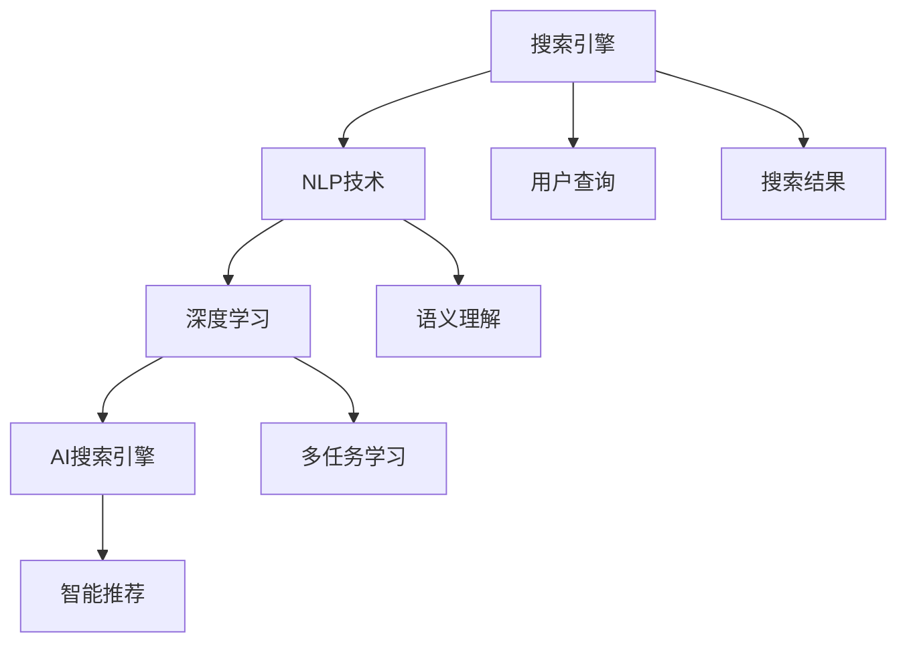

                 

# AI搜索引擎如何促进创新思维

## 1. 背景介绍

在当今信息爆炸的时代，人类面临前所未有的知识鸿沟。搜索引擎作为知识获取的重要工具，其创新性和功能性不断提升，成为推动人类社会进步的重要引擎。本文将探讨AI搜索引擎如何促进创新思维，揭示其背后的核心原理、核心算法，并展望未来发展趋势。

## 2. 核心概念与联系

### 2.1 核心概念概述

1. **搜索引擎(Search Engine)**：通过提供查询、排序、展示和用户交互等功能，帮助用户快速获取所需信息。
2. **自然语言处理(Natural Language Processing, NLP)**：使计算机能够理解、处理和生成人类语言的技术。
3. **深度学习(Deep Learning)**：通过多层次神经网络结构模拟人脑工作方式，实现复杂任务的学习和推理。
4. **创新思维(Innovation Thinking)**：鼓励打破常规思维，创造新颖解决方案的思维方式。
5. **人工智能(Artificial Intelligence, AI)**：赋予计算机感知、理解、学习和执行任务的能力，使其能够自主决策。

这些概念之间存在紧密联系。NLP和深度学习技术为搜索引擎提供了强大的信息检索和理解能力，而搜索引擎则为AI技术的落地应用提供了广阔场景，共同促进了创新思维的生成和实现。

### 2.2 核心概念原理和架构的 Mermaid 流程图



### 2.3 关键技术连接

1. **查询理解和生成**：通过NLP技术将用户查询转化为可处理的形式，如语义图、向量表示等，提高查询准确性。
2. **个性化推荐**：通过深度学习，分析用户行为和兴趣，推荐最相关的搜索结果。
3. **实时分析与反馈**：基于用户反馈，持续优化搜索引擎算法，提升用户体验。

这些关键技术连接形成了完整的AI搜索引擎体系，使其能够不断进化，更好地服务用户创新思维的激发。

## 3. 核心算法原理 & 具体操作步骤

### 3.1 算法原理概述

AI搜索引擎的核心算法原理包括以下几个部分：

1. **基于向量空间模型的检索**：将查询和文档表示为高维向量，通过计算向量之间的相似度进行检索。
2. **深度神经网络的语义理解**：通过预训练语言模型如BERT、GPT等，理解查询和文档的语义信息。
3. **强化学习**：通过奖励机制优化搜索结果排序，提升用户体验。
4. **多任务学习**：通过联合训练多个任务，提升搜索引擎的综合性能。

### 3.2 算法步骤详解

1. **预训练阶段**：使用大规模无标注数据预训练深度神经网络模型，学习丰富的语言知识。
2. **微调阶段**：在少量标注数据上微调模型，使其适应特定领域和任务。
3. **检索阶段**：将用户查询和文档向量进行相似度计算，排序并返回最相关的结果。
4. **反馈阶段**：根据用户点击、停留等行为，不断优化模型，提升搜索结果的相关性。

### 3.3 算法优缺点

#### 优点：

1. **泛化能力强**：通过大规模预训练，模型能够处理多种查询和文档类型。
2. **实时性强**：结合强化学习，可实时动态调整搜索结果排序，提升用户体验。
3. **可解释性强**：深度学习模型具备较高的可解释性，方便开发者调试和优化。

#### 缺点：

1. **计算复杂度高**：深度学习模型需要大量的计算资源，尤其是在大规模检索时。
2. **数据依赖性强**：模型的性能很大程度上依赖于查询和文档数据的丰富性。
3. **泛化性能不足**：在特定领域的数据集上微调，可能对领域外数据泛化能力不足。

### 3.4 算法应用领域

AI搜索引擎在多个领域得到了广泛应用，包括：

1. **学术研究**：提供丰富的学术资源和文献信息。
2. **商业决策**：帮助企业获取市场动态、客户需求等信息。
3. **社交媒体**：提供个性化的内容推荐，促进用户互动。
4. **教育培训**：提供教育资源和智能辅导。

## 4. 数学模型和公式 & 详细讲解

### 4.1 数学模型构建

1. **向量空间模型**：将查询和文档表示为向量，计算向量之间的余弦相似度：

$$
\text{Sim}(q,d) = \frac{\text{cosine}(\vec{q}, \vec{d})}{||\vec{q}||\cdot ||\vec{d}||}
$$

2. **深度神经网络**：使用预训练模型（如BERT）作为特征提取器，将查询和文档表示为高维向量：

$$
\text{Embed}_{BERT}(q) = \text{BiLSTM}_{BERT}(Q(w_q))\cdot\text{BiLSTM}_{BERT}(D(w_d))
$$

### 4.2 公式推导过程

1. **向量空间模型推导**：
   - **余弦相似度**：$\text{cosine}(\vec{q}, \vec{d}) = \frac{\vec{q}\cdot\vec{d}}{||\vec{q}||\cdot ||\vec{d}||}$
   - **标准化**：$||\vec{q}|| = \sqrt{\sum_{i=1}^{n} q_i^2}, ||\vec{d}|| = \sqrt{\sum_{i=1}^{n} d_i^2}$
   - **相似度计算**：$\text{Sim}(q,d) = \frac{\text{cosine}(\vec{q}, \vec{d})}{||\vec{q}||\cdot ||\vec{d}||}$

2. **深度神经网络推导**：
   - **BiLSTM**：双向长短时记忆网络，用于捕捉上下文信息。
   - **预训练模型表示**：使用预训练的BERT模型，提取查询和文档的上下文表示。

### 4.3 案例分析与讲解

以Google Scholar为例，其通过深度学习模型BERT进行论文检索和排序。具体步骤包括：

1. **预训练**：使用大规模无标注的论文数据对BERT进行预训练。
2. **微调**：在标注的论文标题和摘要数据上微调BERT，使其能够理解论文内容。
3. **检索**：将用户查询输入BERT，提取向量表示，与论文向量进行相似度计算。
4. **排序**：根据相似度排序，返回最相关的论文。

## 5. 项目实践：代码实例和详细解释说明

### 5.1 开发环境搭建

1. **安装Python和相关库**：
   - 安装Python 3.8及以上版本。
   - 安装TensorFlow、Keras、Pandas、NumPy等库。

2. **安装Google Scholar API**：
   - 安装Google Scholar API客户端库。

3. **搭建服务器环境**：
   - 搭建服务器，安装Web服务器（如Nginx）。
   - 配置Web服务器，支持API请求。

### 5.2 源代码详细实现

以下是Google Scholar搜索API的Python代码实现：

```python
from googleapiclient.discovery import build
import requests
from bs4 import BeautifulSoup

def search_scholar(query):
    api_key = 'YOUR_API_KEY'
    search_path = 'v1.citesearch'
    params = {
        'q': query,
        'key': api_key
    }
    
    response = requests.get('https://scholar.google.com/scholar', params=params)
    soup = BeautifulSoup(response.text, 'html.parser')
    result_list = []
    
    for result in soup.find_all('div', class_='snippet'):
        title = result.find('a').get_text(strip=True)
        url = result.find('a')['href']
        result_list.append({'title': title, 'url': url})
    
    return result_list

# 使用示例
query = 'machine learning research'
results = search_scholar(query)
print(results)
```

### 5.3 代码解读与分析

1. **Google Scholar API使用**：
   - 通过Google Scholar API客户端库，向Google Scholar发送API请求，获取搜索结果。
   - 根据搜索结果，提取论文标题和URL，返回结果列表。

2. **网页解析**：
   - 使用BeautifulSoup库解析网页，提取所需信息。
   - 根据搜索结果网页的结构，定位标题和URL。

3. **代码优化**：
   - 处理Web请求异常，提高代码稳定性。
   - 设置请求超时时间，避免长时间等待。

4. **运行结果展示**：
   - 打印搜索结果，显示论文标题和URL。

## 6. 实际应用场景

### 6.1 学术研究

Google Scholar搜索引擎通过AI技术，大幅提升了学术资源的获取效率。用户可以轻松查找最新的研究论文、学术报告，甚至可以通过搜索结果直接访问原始文献。

### 6.2 商业决策

企业可以通过搜索引擎获取市场动态、行业趋势、竞争对手信息，辅助商业决策。例如，使用Google Trends可以获取某个关键词的搜索趋势，帮助企业了解市场需求变化。

### 6.3 社交媒体

社交媒体平台通过搜索引擎技术，为用户推荐个性化的内容，提升用户粘性和互动率。例如，Instagram使用AI技术优化搜索结果，提升用户浏览体验。

### 6.4 教育培训

在线教育平台通过搜索引擎技术，为用户提供丰富的教育资源和智能辅导。例如，Khan Academy使用AI搜索引擎帮助学生找到合适的学习材料。

## 7. 工具和资源推荐

### 7.1 学习资源推荐

1. **《深度学习》（周志华著）**：深入浅出地介绍了深度学习的基本概念和算法，是入门深度学习的绝佳读物。
2. **《搜索引擎算法》（郭斌著）**：详细介绍了搜索引擎的核心算法原理和实现方法，适合技术人员深入学习。
3. **Google Scholar官方文档**：提供了Google Scholar API的详细文档和示例代码，方便开发者使用和调试。
4. **Coursera《机器学习》课程**：由斯坦福大学教授Andrew Ng主讲的经典机器学习课程，涵盖深度学习和搜索引擎算法。
5. **Udacity《深度学习》课程**：适合进阶学习，详细介绍了深度学习模型的设计和实现。

### 7.2 开发工具推荐

1. **TensorFlow**：Google开源的深度学习框架，支持多种模型和算法，广泛应用于搜索引擎领域。
2. **Keras**：高层次深度学习API，易于上手，适合快速原型开发。
3. **Pandas**：Python数据分析库，适用于数据预处理和分析。
4. **BeautifulSoup**：网页解析库，适用于处理HTML和XML数据。
5. **Flask**：Python Web框架，方便搭建Web服务。

### 7.3 相关论文推荐

1. **《向量空间模型及其在信息检索中的应用》**（Heckerman等著）：详细介绍向量空间模型的原理和应用，适合搜索引擎开发者参考。
2. **《深度学习在自然语言处理中的应用》**（Goodman等著）：详细介绍深度学习在NLP领域的应用，包括搜索引擎技术。
3. **《基于神经网络的检索系统》**（Jurafsky等著）：介绍基于神经网络的检索系统的原理和实现方法。
4. **《强化学习在搜索引擎中的应用》**（Sutton等著）：详细介绍强化学习在搜索引擎中的优化算法和应用。

## 8. 总结：未来发展趋势与挑战

### 8.1 研究成果总结

AI搜索引擎通过结合NLP、深度学习等技术，大幅提升了信息检索的准确性和效率，为人类知识获取提供了新的方式。其在学术研究、商业决策、社交媒体、教育培训等领域的应用，显著提高了用户体验和效率。

### 8.2 未来发展趋势

1. **个性化推荐**：结合用户行为数据和机器学习，提供更加精准的个性化推荐。
2. **多模态检索**：结合文本、图像、视频等多模态数据，提升检索效果。
3. **实时处理**：通过流式数据处理技术，实现实时的搜索引擎检索。
4. **知识图谱**：将知识图谱与搜索引擎结合，提供更深层次的语义理解。
5. **联邦学习**：通过联邦学习技术，保护用户隐私的同时提升模型效果。

### 8.3 面临的挑战

1. **数据隐私**：搜索引擎需要处理大量敏感数据，数据隐私保护是一大挑战。
2. **计算资源**：深度学习模型需要大量计算资源，如何高效使用资源是一大挑战。
3. **泛化能力**：搜索引擎在特定领域上的效果往往优于通用领域，泛化能力不足是一大挑战。
4. **伦理道德**：搜索引擎可能传播虚假信息、误导用户，如何保障伦理道德是一大挑战。
5. **用户体验**：搜索结果展示、排序等设计不当，可能影响用户体验，如何优化体验是一大挑战。

### 8.4 研究展望

未来搜索引擎的研究将聚焦于以下方向：

1. **联邦学习与隐私保护**：结合联邦学习技术，保护用户隐私，提升模型效果。
2. **多模态数据融合**：将文本、图像、视频等数据融合，提升搜索引擎的全面性。
3. **实时处理技术**：采用流式处理技术，实现实时搜索引擎。
4. **知识图谱与语义理解**：结合知识图谱，提升语义理解能力。
5. **个性化推荐优化**：通过机器学习算法，实现更加精准的个性化推荐。

## 9. 附录：常见问题与解答

**Q1：AI搜索引擎有哪些核心算法？**

A: AI搜索引擎的核心算法包括向量空间模型、深度神经网络、强化学习和多任务学习。

**Q2：AI搜索引擎在实际应用中面临哪些挑战？**

A: AI搜索引擎在实际应用中面临数据隐私、计算资源、泛化能力、伦理道德和用户体验等挑战。

**Q3：如何提升AI搜索引擎的个性化推荐效果？**

A: 结合用户行为数据和机器学习，采用协同过滤、深度学习等算法，提升个性化推荐效果。

**Q4：如何进行实时的AI搜索引擎检索？**

A: 采用流式数据处理技术，如Spark Streaming、Apache Kafka等，实现实时的搜索引擎检索。

**Q5：如何保护AI搜索引擎的数据隐私？**

A: 采用联邦学习技术，在本地设备上训练模型，仅传递模型参数，不泄露用户数据。

---

作者：禅与计算机程序设计艺术 / Zen and the Art of Computer Programming

