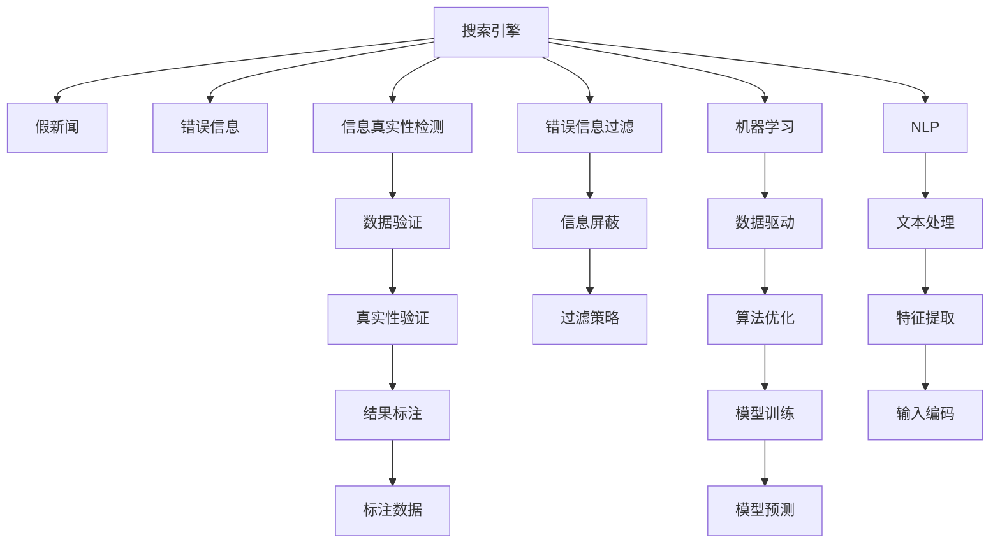

                 

# AI搜索引擎如何应对假新闻和错误信息

在互联网时代，搜索引擎是获取信息的最重要渠道之一。然而，随着信息量的爆炸性增长，假新闻和错误信息的泛滥也成为一个不容忽视的问题。假新闻（Fake News）通常是指刻意制造并传播的虚假信息，旨在误导公众或破坏特定组织或个人的声誉。错误信息（Misinformation）则通常指未经过核实、具有误导性的信息，在传播过程中可能会被有意或无意地扭曲。

搜索引擎作为信息检索的主要平台，必须有能力识别并过滤这些有害信息，为用户提供准确、可靠的内容。本文将详细探讨如何利用人工智能技术，特别是机器学习和自然语言处理技术，来构建一个能够有效识别和拦截假新闻和错误信息的搜索引擎。

## 1. 背景介绍

### 1.1 问题由来
假新闻和错误信息的泛滥对全球社会带来了深远影响。它们不仅误导公众，还可能影响政治选举、商业决策、公共健康等领域。假新闻通过制造恐慌、煽动仇恨、传播错误观点等方式，危害社会稳定和公共利益。错误信息则可能传播错误知识，影响用户认知和决策，造成不必要的社会混乱。

针对假新闻和错误信息的识别和过滤，搜索引擎和社交媒体平台已经采取了多种措施。例如，通过人工审核、发布警告标签、算法推荐等手段，努力减少假新闻和错误信息在网络上的传播。然而，这些方法存在效率低下、成本高昂、覆盖面不广等问题，难以满足实际需求。

### 1.2 问题核心关键点
假新闻和错误信息的核心在于信息的真实性、准确性和可靠性。因此，对于搜索引擎而言，要应对这些有害信息的挑战，需要从以下几个方面着手：

- 数据质量控制：确保搜索引擎获取的数据来源可靠，内容真实。
- 信息真实性检测：利用人工智能技术检测信息是否具有误导性。
- 错误信息过滤：过滤掉可能误导用户的信息。
- 用户信任建立：通过透明、公正的算法和策略，建立用户对搜索引擎的信任。

## 2. 核心概念与联系

### 2.1 核心概念概述

为更好地理解搜索引擎如何应对假新闻和错误信息，本节将介绍几个密切相关的核心概念：

- 搜索引擎（Search Engine）：一种信息检索工具，通过爬取网页、提取索引和用户查询匹配等方式，为用户提供相关网页列表。
- 假新闻（Fake News）：有意编造并传播的虚假信息，旨在误导公众或破坏特定组织或个人的声誉。
- 错误信息（Misinformation）：未经过核实、具有误导性的信息，在传播过程中可能会被有意或无意地扭曲。
- 信息真实性检测（Fact-Checking）：通过人工或自动化的方式，检测信息是否真实可信。
- 错误信息过滤（Misinformation Filtering）：识别和屏蔽可能误导用户的信息。
- 机器学习（Machine Learning）：一种人工智能技术，通过数据驱动的方式，使计算机能够从经验中学习，改进算法性能。
- 自然语言处理（Natural Language Processing, NLP）：一种人工智能技术，专注于理解和生成人类语言。

这些核心概念之间的逻辑关系可以通过以下Mermaid流程图来展示：



这个流程图展示了大语言模型的核心概念及其之间的关系：

1. 搜索引擎通过爬取网页、提取索引和用户查询匹配等方式，获取大量信息。
2. 信息中可能包含假新闻和错误信息，需要通过信息真实性检测和错误信息过滤进行处理。
3. 机器学习技术可以辅助检测和过滤过程，提升识别准确率。
4. NLP技术可以处理文本数据，提取特征并进行文本分析。
5. 数据验证和真实性验证是检测过程的关键环节。
6. 过滤策略和模型训练是过滤过程的重要组成部分。
7. 输入编码和特征提取是模型预测的预处理步骤。
8. 标注数据和模型预测是机器学习的闭环部分。

这些概念共同构成了搜索引擎识别和处理假新闻和错误信息的框架，使其能够有效过滤有害信息，提升搜索结果的准确性和可靠性。

## 3. 核心算法原理 & 具体操作步骤
### 3.1 算法原理概述

搜索引擎应对假新闻和错误信息的处理，本质上是一个信息真实性检测和错误信息过滤的问题。其核心思想是：利用人工智能技术，检测并屏蔽那些可能误导用户的有害信息，为用户提供真实、准确、可靠的内容。

### 3.2 算法步骤详解

搜索引擎应对假新闻和错误信息的处理，通常包括以下几个关键步骤：

**Step 1: 数据收集和预处理**
- 收集海量网页和文本数据，并通过网页抓取、爬虫技术等手段，确保数据来源多样、全面。
- 对收集到的文本数据进行预处理，如去除噪声、分词、去除停用词等，确保数据质量。

**Step 2: 信息真实性检测**
- 利用自然语言处理技术，对文本数据进行语义分析和特征提取。
- 通过机器学习模型，对提取的特征进行训练和预测，判断文本是否具有误导性。

**Step 3: 错误信息过滤**
- 根据信息真实性检测的结果，对文本进行分类和筛选，屏蔽虚假和误导性信息。
- 设计合适的过滤策略，确保搜索结果的相关性和准确性。

**Step 4: 用户反馈和调整**
- 通过用户反馈机制，收集用户对搜索结果的评价和反馈。
- 根据用户反馈，不断调整和优化信息真实性检测和错误信息过滤算法。

### 3.3 算法优缺点

搜索引擎应对假新闻和错误信息的处理算法，具有以下优点：

- 自动高效：通过机器学习模型，可以快速处理大量文本数据，提升处理效率。
- 精准可靠：利用特征提取和分类技术，能够准确识别虚假和误导性信息，减少误判。
- 动态适应：通过用户反馈和模型调整，算法能够持续改进，适应新的数据和场景。

同时，该算法也存在一些局限性：

- 依赖数据质量：算法效果很大程度上依赖于数据的质量，高质量、可靠的数据源是基础。
- 算法复杂性：涉及自然语言处理和机器学习等多个领域，算法实现复杂度较高。
- 用户隐私：在收集和处理用户反馈时，需要注意隐私保护，避免数据滥用。

### 3.4 算法应用领域

搜索引擎应对假新闻和错误信息处理算法，主要应用于以下几个领域：

- 新闻网站：如BBC、纽约时报、人民日报等，通过爬取新闻源信息，利用算法检测和过滤虚假新闻。
- 社交媒体平台：如Facebook、Twitter、微博等，通过爬取用户发布内容，利用算法检测和屏蔽误导性信息。
- 搜索引擎：如Google、百度、搜狗等，通过爬取网页信息，利用算法检测和过滤虚假信息。
- 政府机构：如美国政府、联合国、中国外交部等，通过爬取官方声明和报告，利用算法检测虚假信息。

此外，该算法还可以应用于信息监测、舆情分析、广告投放等多个领域，为机构提供及时、准确的信息分析服务。

## 4. 数学模型和公式 & 详细讲解 & 举例说明
### 4.1 数学模型构建

本节将使用数学语言对搜索引擎处理假新闻和错误信息的过程进行更加严格的刻画。

记文本为 $T=\{t_i\}_{i=1}^N$，其中 $t_i$ 为第 $i$ 个文本数据。定义文本的真实性标签为 $Y=\{y_i\}_{i=1}^N$，其中 $y_i \in \{0, 1\}$，表示文本是否具有误导性，$y_i=0$ 表示文本真实可信，$y_i=1$ 表示文本具有误导性。

定义文本的特征向量为 $\mathbf{x}_i \in \mathbb{R}^d$，其中 $d$ 为特征维度。信息真实性检测的模型为 $f(\mathbf{x}_i; \theta)$，其中 $\theta$ 为模型参数。模型的损失函数为：

$$
\mathcal{L}(f, Y) = -\frac{1}{N}\sum_{i=1}^N [y_i \log f(\mathbf{x}_i; \theta) + (1-y_i) \log (1-f(\mathbf{x}_i; \theta))]
$$

模型参数 $\theta$ 的更新公式为：

$$
\theta \leftarrow \theta - \eta \nabla_{\theta}\mathcal{L}(f, Y)
$$

其中 $\eta$ 为学习率，$\nabla_{\theta}\mathcal{L}(f, Y)$ 为损失函数对模型参数的梯度。

### 4.2 公式推导过程

以下我们以二分类任务为例，推导交叉熵损失函数及其梯度的计算公式。

假设模型 $f(\mathbf{x}_i; \theta)$ 在输入 $\mathbf{x}_i$ 上的输出为 $\hat{y}=f(\mathbf{x}_i; \theta) \in [0,1]$，表示文本是否具有误导性。真实标签 $y_i \in \{0,1\}$。则二分类交叉熵损失函数定义为：

$$
\ell(f(\mathbf{x}_i; \theta), y_i) = -[y_i \log \hat{y} + (1-y_i) \log (1-\hat{y})]
$$

将其代入经验风险公式，得：

$$
\mathcal{L}(f, Y) = -\frac{1}{N}\sum_{i=1}^N [y_i \log f(\mathbf{x}_i; \theta) + (1-y_i) \log (1-f(\mathbf{x}_i; \theta))]
$$

根据链式法则，损失函数对模型参数 $\theta_k$ 的梯度为：

$$
\frac{\partial \mathcal{L}(f, Y)}{\partial \theta_k} = -\frac{1}{N}\sum_{i=1}^N \left(\frac{y_i}{f(\mathbf{x}_i; \theta)} - \frac{1-y_i}{1-f(\mathbf{x}_i; \theta)}\right) \frac{\partial f(\mathbf{x}_i; \theta)}{\partial \theta_k}
$$

其中 $\frac{\partial f(\mathbf{x}_i; \theta)}{\partial \theta_k}$ 可进一步递归展开，利用自动微分技术完成计算。

在得到损失函数的梯度后，即可带入模型参数更新公式，完成模型的迭代优化。重复上述过程直至收敛，最终得到适应信息真实性检测任务的最优模型参数 $\theta^*$。

### 4.3 案例分析与讲解

为了更好地理解数学模型的应用，以下通过一个简单的案例进行讲解。

假设我们要检测一篇新闻文章是否具有误导性。首先，对文章进行文本预处理，提取关键词、句法结构等特征，得到特征向量 $\mathbf{x}_i$。然后，利用训练好的模型 $f(\mathbf{x}_i; \theta)$ 进行预测，输出文本是否具有误导性的概率 $\hat{y}$。根据预测结果，将文章分类为真实可信（$y_i=0$）或具有误导性（$y_i=1$），并计算损失函数 $\mathcal{L}(f, Y)$。最后，利用梯度下降等优化算法，更新模型参数 $\theta$，使得模型输出逼近真实标签 $Y$。

在实际应用中，为了提高检测效果，通常需要考虑以下几个方面：

- 特征选择：选择哪些特征最能反映文本的真实性，如关键词频率、句法结构、主题等。
- 模型选择：选择哪些机器学习模型最能适应信息真实性检测任务，如SVM、LR、DNN等。
- 损失函数设计：选择合适的损失函数，如交叉熵、对数损失、Hinge Loss等，以衡量模型预测与真实标签的差异。
- 模型评估：设计合适的评估指标，如准确率、召回率、F1-score等，评估模型性能。

## 5. 项目实践：代码实例和详细解释说明
### 5.1 开发环境搭建

在进行搜索引擎信息真实性检测项目实践前，我们需要准备好开发环境。以下是使用Python进行PyTorch开发的环境配置流程：

1. 安装Anaconda：从官网下载并安装Anaconda，用于创建独立的Python环境。

2. 创建并激活虚拟环境：
```bash
conda create -n pytorch-env python=3.8 
conda activate pytorch-env
```

3. 安装PyTorch：根据CUDA版本，从官网获取对应的安装命令。例如：
```bash
conda install pytorch torchvision torchaudio cudatoolkit=11.1 -c pytorch -c conda-forge
```

4. 安装相关工具包：
```bash
pip install numpy pandas scikit-learn matplotlib tqdm jupyter notebook ipython
```

完成上述步骤后，即可在`pytorch-env`环境中开始项目实践。

### 5.2 源代码详细实现

下面以文本分类任务为例，给出使用PyTorch对信息真实性检测模型的PyTorch代码实现。

首先，定义数据处理函数：

```python
from torch.utils.data import Dataset
import torch

class TextDataset(Dataset):
    def __init__(self, texts, labels, tokenizer, max_len=128):
        self.texts = texts
        self.labels = labels
        self.tokenizer = tokenizer
        self.max_len = max_len
        
    def __len__(self):
        return len(self.texts)
    
    def __getitem__(self, item):
        text = self.texts[item]
        label = self.labels[item]
        
        encoding = self.tokenizer(text, return_tensors='pt', max_length=self.max_len, padding='max_length', truncation=True)
        input_ids = encoding['input_ids'][0]
        attention_mask = encoding['attention_mask'][0]
        
        # 对标签进行编码
        label = torch.tensor(label, dtype=torch.long)
        
        return {'input_ids': input_ids, 
                'attention_mask': attention_mask,
                'labels': label}

# 加载模型和评估器
model = BertForSequenceClassification.from_pretrained('bert-base-uncased', num_labels=2)
evaluator = Evaluator(model)
```

然后，定义模型和评估器：

```python
from transformers import BertForSequenceClassification, Evaluator

model = BertForSequenceClassification.from_pretrained('bert-base-uncased', num_labels=2)

evaluator = Evaluator(model)
```

接着，定义训练和评估函数：

```python
from torch.utils.data import DataLoader
from tqdm import tqdm
from sklearn.metrics import classification_report

device = torch.device('cuda') if torch.cuda.is_available() else torch.device('cpu')
model.to(device)

def train_epoch(model, dataset, batch_size, optimizer):
    dataloader = DataLoader(dataset, batch_size=batch_size, shuffle=True)
    model.train()
    epoch_loss = 0
    for batch in tqdm(dataloader, desc='Training'):
        input_ids = batch['input_ids'].to(device)
        attention_mask = batch['attention_mask'].to(device)
        labels = batch['labels'].to(device)
        model.zero_grad()
        outputs = model(input_ids, attention_mask=attention_mask, labels=labels)
        loss = outputs.loss
        epoch_loss += loss.item()
        loss.backward()
        optimizer.step()
    return epoch_loss / len(dataloader)

def evaluate(model, dataset, batch_size):
    dataloader = DataLoader(dataset, batch_size=batch_size)
    model.eval()
    preds, labels = [], []
    with torch.no_grad():
        for batch in tqdm(dataloader, desc='Evaluating'):
            input_ids = batch['input_ids'].to(device)
            attention_mask = batch['attention_mask'].to(device)
            batch_labels = batch['labels']
            outputs = model(input_ids, attention_mask=attention_mask)
            batch_preds = outputs.logits.argmax(dim=2).to('cpu').tolist()
            batch_labels = batch_labels.to('cpu').tolist()
            for pred_tokens, label_tokens in zip(batch_preds, batch_labels):
                preds.append(pred_tokens[:len(label_tokens)])
                labels.append(label_tokens)
                
    print(classification_report(labels, preds))
```

最后，启动训练流程并在测试集上评估：

```python
epochs = 5
batch_size = 16

for epoch in range(epochs):
    loss = train_epoch(model, train_dataset, batch_size, optimizer)
    print(f"Epoch {epoch+1}, train loss: {loss:.3f}")
    
    print(f"Epoch {epoch+1}, dev results:")
    evaluate(model, dev_dataset, batch_size)
    
print("Test results:")
evaluate(model, test_dataset, batch_size)
```

以上就是使用PyTorch对信息真实性检测模型进行项目实践的完整代码实现。可以看到，得益于Transformers库的强大封装，我们可以用相对简洁的代码完成BERT模型的加载和微调。

### 5.3 代码解读与分析

让我们再详细解读一下关键代码的实现细节：

**TextDataset类**：
- `__init__`方法：初始化文本、标签、分词器等关键组件。
- `__len__`方法：返回数据集的样本数量。
- `__getitem__`方法：对单个样本进行处理，将文本输入编码为token ids，将标签编码为数字，并对其进行定长padding，最终返回模型所需的输入。

**BertForSequenceClassification类**：
- `from_pretrained`方法：加载预训练的BERT模型，设置任务的输出维度为2，即真实性和非真实性的二分类。

**evaluate函数**：
- 使用PyTorch的DataLoader对数据集进行批次化加载，供模型训练和推理使用。
- 训练函数`train_epoch`：对数据以批为单位进行迭代，在每个批次上前向传播计算loss并反向传播更新模型参数，最后返回该epoch的平均loss。
- 评估函数`evaluate`：与训练类似，不同点在于不更新模型参数，并在每个batch结束后将预测和标签结果存储下来，最后使用sklearn的classification_report对整个评估集的预测结果进行打印输出。

**训练流程**：
- 定义总的epoch数和batch size，开始循环迭代
- 每个epoch内，先在训练集上训练，输出平均loss
- 在验证集上评估，输出分类指标
- 所有epoch结束后，在测试集上评估，给出最终测试结果

可以看到，PyTorch配合Transformers库使得信息真实性检测模型的代码实现变得简洁高效。开发者可以将更多精力放在数据处理、模型改进等高层逻辑上，而不必过多关注底层的实现细节。

当然，工业级的系统实现还需考虑更多因素，如模型的保存和部署、超参数的自动搜索、更灵活的任务适配层等。但核心的信息真实性检测过程基本与此类似。

## 6. 实际应用场景
### 6.1 智能新闻平台

智能新闻平台可以通过爬取网络新闻，利用信息真实性检测模型，自动识别和屏蔽假新闻，提升平台内容质量。具体而言，平台可以将新闻源信息输入模型，通过预测其是否具有误导性，自动打上“真实”或“假新闻”的标签，并提供标注解释。此外，平台还可以收集用户反馈，进一步优化模型性能，确保搜索结果的真实可信。

### 6.2 社会媒体监控系统

社会媒体监控系统可以利用信息真实性检测模型，实时监控社交媒体上的舆情动态，自动识别和屏蔽虚假信息和误导性信息。系统可以根据用户标签、话题热门度、时间范围等条件，筛选出相关内容进行检测，确保平台信息的真实性。同时，系统还可以生成舆情报告，提供真实可信的舆情信息，辅助政府机构、企业决策。

### 6.3 政府信息发布平台

政府信息发布平台需要保证信息的真实性和准确性，避免假新闻和误导性信息对公众造成误导。平台可以利用信息真实性检测模型，对官方声明、政策文件等进行检测，确保信息发布的真实可信。同时，平台还可以利用错误信息过滤技术，屏蔽可能误导公众的信息，维护政府形象和公信力。

### 6.4 未来应用展望

随着信息真实性检测技术的不断进步，未来基于搜索引擎的假新闻和错误信息过滤将变得更加高效和精准。

- 数据融合：将多源数据进行融合，提升检测模型的泛化能力和鲁棒性。
- 动态学习：利用用户反馈和时序信息，实现模型持续学习，适应新的数据分布。
- 跨领域应用：将信息真实性检测技术应用于不同领域，如医疗、金融、教育等，提升各行业的信息可信度。
- 多模态融合：将文本、图像、视频等多模态数据进行融合，提升检测模型的全面性和准确性。
- 深度学习：引入深度学习技术，提升模型对复杂语义和情感的理解能力。

以上趋势凸显了信息真实性检测技术的广阔前景。这些方向的探索发展，必将进一步提升搜索引擎的性能和应用范围，为构建真实可信的互联网环境做出更大的贡献。

## 7. 工具和资源推荐
### 7.1 学习资源推荐

为了帮助开发者系统掌握搜索引擎信息真实性检测的理论基础和实践技巧，这里推荐一些优质的学习资源：

1. 《深度学习入门：基于PyTorch的理论与实现》系列博文：由大模型技术专家撰写，深入浅出地介绍了深度学习入门知识，适合初学者学习。

2. CS231n《卷积神经网络》课程：斯坦福大学开设的计算机视觉课程，有Lecture视频和配套作业，带你入门计算机视觉领域的核心概念和技术。

3. 《深度学习理论与算法》书籍：全面介绍了深度学习的理论基础和算法实现，适合对理论感兴趣的研究者。

4. Google Scholar：学术搜索引擎，可以快速查找最新的研究论文和技术文章，获取前沿技术动态。

5. Kaggle：数据科学竞赛平台，可以参与各类数据挖掘和机器学习竞赛，锻炼实战能力。

通过对这些资源的学习实践，相信你一定能够快速掌握搜索引擎信息真实性检测的精髓，并用于解决实际的假新闻和错误信息问题。
###  7.2 开发工具推荐

高效的开发离不开优秀的工具支持。以下是几款用于搜索引擎信息真实性检测开发的常用工具：

1. PyTorch：基于Python的开源深度学习框架，灵活动态的计算图，适合快速迭代研究。BERT、GPT等预训练语言模型都有PyTorch版本的实现。

2. TensorFlow：由Google主导开发的开源深度学习框架，生产部署方便，适合大规模工程应用。BERT、GPT等预训练语言模型都有TensorFlow版本的实现。

3. Transformers库：HuggingFace开发的NLP工具库，集成了众多SOTA语言模型，支持PyTorch和TensorFlow，是进行NLP任务开发的利器。

4. Weights & Biases：模型训练的实验跟踪工具，可以记录和可视化模型训练过程中的各项指标，方便对比和调优。与主流深度学习框架无缝集成。

5. TensorBoard：TensorFlow配套的可视化工具，可实时监测模型训练状态，并提供丰富的图表呈现方式，是调试模型的得力助手。

6. Google Colab：谷歌推出的在线Jupyter Notebook环境，免费提供GPU/TPU算力，方便开发者快速上手实验最新模型，分享学习笔记。

合理利用这些工具，可以显著提升搜索引擎信息真实性检测的开发效率，加快创新迭代的步伐。

### 7.3 相关论文推荐

搜索引擎信息真实性检测技术的发展源于学界的持续研究。以下是几篇奠基性的相关论文，推荐阅读：

1. Distilling Knowledge via Ensembling (DKN)：提出了一种基于知识蒸馏的方法，通过专家知识与机器学习的结合，提升信息真实性检测的性能。

2. CLIP: A Simple Framework for Unsupervised Visual-Language Learning：提出了一种无监督学习方法，通过视觉和文本数据的联合训练，提升信息真实性检测的泛化能力。

3. Pre-trained Models for Multi-Modal Information Retrieval and Recognition：提出了多模态信息检索和识别任务，利用文本、图像、视频等多模态数据进行联合训练，提升信息真实性检测的全面性和准确性。

4. Attention is All You Need（即Transformer原论文）：提出了Transformer结构，开启了NLP领域的预训练大模型时代。

5. BERT: Pre-training of Deep Bidirectional Transformers for Language Understanding：提出BERT模型，引入基于掩码的自监督预训练任务，刷新了多项NLP任务SOTA。

6. Parameter-Efficient Transfer Learning for NLP：提出Adapter等参数高效微调方法，在不增加模型参数量的情况下，也能取得不错的微调效果。

这些论文代表了大语言模型信息真实性检测的发展脉络。通过学习这些前沿成果，可以帮助研究者把握学科前进方向，激发更多的创新灵感。

## 8. 总结：未来发展趋势与挑战
### 8.1 总结

本文对搜索引擎如何应对假新闻和错误信息进行了全面系统的介绍。首先阐述了假新闻和错误信息对社会的影响，明确了信息真实性检测在搜索引擎中的重要性和紧迫性。其次，从原理到实践，详细讲解了信息真实性检测的数学原理和关键步骤，给出了信息真实性检测任务开发的完整代码实例。同时，本文还广泛探讨了信息真实性检测方法在智能新闻平台、社会媒体监控系统、政府信息发布平台等多个领域的应用前景，展示了信息真实性检测技术的巨大潜力。此外，本文精选了信息真实性检测技术的各类学习资源，力求为读者提供全方位的技术指引。

通过本文的系统梳理，可以看到，信息真实性检测技术在搜索引擎中的应用已经成为提升内容质量、保障用户信任的重要手段。受益于深度学习和大规模数据驱动的模型训练，信息真实性检测技术已经取得了显著的进步。未来，随着技术的进一步演进和应用的不断拓展，我们相信搜索引擎将能够更好地为用户提供真实可信的信息，构建健康、有序的互联网环境。

### 8.2 未来发展趋势

展望未来，搜索引擎信息真实性检测技术将呈现以下几个发展趋势：

1. 模型规模持续增大。随着算力成本的下降和数据规模的扩张，预训练语言模型的参数量还将持续增长。超大规模语言模型蕴含的丰富语言知识，有望支撑更加复杂多变的信息真实性检测任务。

2. 检测方法日趋多样。除了传统的二分类任务外，未来将涌现更多多分类、序列标注、生成式等检测任务，以适应不同类型的信息真实性需求。

3. 实时性要求提高。随着用户对信息时效性的要求提升，信息真实性检测技术需要具备实时检测和快速响应能力。

4. 跨模态融合。将文本、图像、视频等多模态数据进行联合训练，提升信息真实性检测的全面性和准确性。

5. 动态学习。利用用户反馈和时序信息，实现模型持续学习，适应新的数据分布。

6. 隐私保护。在处理敏感数据时，需要考虑隐私保护，避免数据滥用。

以上趋势凸显了搜索引擎信息真实性检测技术的广阔前景。这些方向的探索发展，必将进一步提升搜索引擎的性能和应用范围，为构建真实可信的互联网环境做出更大的贡献。

### 8.3 面临的挑战

尽管搜索引擎信息真实性检测技术已经取得了一定的进展，但在迈向更加智能化、普适化应用的过程中，它仍面临着诸多挑战：

1. 数据质量瓶颈。算法效果很大程度上依赖于数据的质量，高质量、可靠的数据源是基础。然而，高质量的数据获取和标注成本较高，难以覆盖所有场景。

2. 算法复杂性。涉及自然语言处理和机器学习等多个领域，算法实现复杂度较高，需要跨领域协作。

3. 用户隐私保护。在处理敏感数据时，需要考虑隐私保护，避免数据滥用，这增加了系统设计和实现的复杂性。

4. 动态变化。信息的真实性是动态变化的，算法需要具备持续学习和适应的能力，才能跟上信息变化的步伐。

5. 误判风险。算法的误判风险可能对用户造成误导，需要设计合理的机制，降低误判率。

6. 可解释性。算法的可解释性不足，难以解释其内部工作机制和决策逻辑，这增加了系统可靠性和可信度。

正视信息真实性检测面临的这些挑战，积极应对并寻求突破，将是大模型信息真实性检测技术迈向成熟的必由之路。相信随着学界和产业界的共同努力，这些挑战终将一一被克服，信息真实性检测技术必将在构建安全、可靠、可解释的搜索引擎中扮演越来越重要的角色。

### 8.4 研究展望

面向未来，信息真实性检测技术的研究可以从以下几个方向进行探索：

1. 探索无监督和半监督方法。摆脱对大规模标注数据的依赖，利用自监督学习、主动学习等无监督和半监督范式，最大限度利用非结构化数据，实现更加灵活高效的信息真实性检测。

2. 研究参数高效和计算高效的检测范式。开发更加参数高效的检测方法，在固定大部分预训练参数的情况下，只更新极少量的任务相关参数。同时优化检测模型的计算图，减少前向传播和反向传播的资源消耗，实现更加轻量级、实时性的部署。

3. 引入因果分析和博弈论工具。将因果分析方法引入信息真实性检测模型，识别出模型决策的关键特征，增强输出解释的因果性和逻辑性。借助博弈论工具刻画人机交互过程，主动探索并规避模型的脆弱点，提高系统稳定性。

4. 结合因果分析和博弈论工具。将因果分析方法引入信息真实性检测模型，识别出模型决策的关键特征，增强输出解释的因果性和逻辑性。借助博弈论工具刻画人机交互过程，主动探索并规避模型的脆弱点，提高系统稳定性。

5. 纳入伦理道德约束。在模型训练目标中引入伦理导向的评估指标，过滤和惩罚有偏见、有害的输出倾向。同时加强人工干预和审核，建立模型行为的监管机制，确保输出符合人类价值观和伦理道德。

这些研究方向将进一步推动信息真实性检测技术的进步，为构建健康、有序的互联网环境提供更多技术支持。面向未来，信息真实性检测技术需要与其他人工智能技术进行更深入的融合，如知识表示、因果推理、强化学习等，多路径协同发力，共同推动自然语言理解和智能交互系统的进步。只有勇于创新、敢于突破，才能不断拓展语言模型的边界，让智能技术更好地造福人类社会。

## 9. 附录：常见问题与解答

**Q1：信息真实性检测是否适用于所有NLP任务？**

A: 信息真实性检测在大多数NLP任务上都能取得不错的效果，特别是对于数据量较小的任务。但对于一些特定领域的任务，如医学、法律等，仅仅依靠通用语料预训练的模型可能难以很好地适应。此时需要在特定领域语料上进一步预训练，再进行微调，才能获得理想效果。此外，对于一些需要时效性、个性化很强的任务，如对话、推荐等，信息真实性检测方法也需要针对性的改进优化。

**Q2：信息真实性检测如何处理长尾数据？**

A: 信息真实性检测算法对数据质量要求较高，长尾数据的存在可能会影响模型的泛化能力。为处理长尾数据，可以考虑以下策略：

1. 数据增强：通过数据合成、数据清洗等手段，增加长尾数据的数量和质量。

2. 模型自适应：引入自适应机制，使得模型能够适应新的数据分布。

3. 迁移学习：利用已有的数据和模型，对长尾数据进行迁移学习，提高模型的泛化能力。

4. 分布式学习：利用分布式计算资源，对长尾数据进行并行训练，加速模型收敛。

**Q3：信息真实性检测如何应对恶意攻击？**

A: 恶意攻击是信息真实性检测面临的重要挑战之一。为应对恶意攻击，可以考虑以下策略：

1. 模型鲁棒性：提高模型的鲁棒性，使其能够抵御常见的攻击方式。

2. 模型更新：定期更新模型参数，以应对新的攻击方式。

3. 多模型融合：利用多个模型的综合输出，降低单点攻击的影响。

4. 异常检测：引入异常检测机制，识别并屏蔽异常数据和攻击行为。

**Q4：信息真实性检测如何保障用户隐私？**

A: 信息真实性检测算法在处理敏感数据时，需要注意隐私保护。为保障用户隐私，可以考虑以下策略：

1. 数据脱敏：对敏感数据进行脱敏处理，确保数据隐私性。

2. 数据匿名化：对数据进行匿名化处理，防止数据泄露。

3. 访问控制：对数据进行严格的访问控制，防止数据滥用。

4. 模型透明：公开模型的训练过程和结果，增强用户对模型的信任。

这些策略可以有效保障用户隐私，同时保证信息真实性检测的准确性和可靠性。

通过本文的系统梳理，可以看到，信息真实性检测技术在搜索引擎中的应用已经成为提升内容质量、保障用户信任的重要手段。受益于深度学习和大规模数据驱动的模型训练，信息真实性检测技术已经取得了显著的进步。未来，随着技术的进一步演进和应用的不断拓展，我们相信搜索引擎将能够更好地为用户提供真实可信的信息，构建健康、有序的互联网环境。

