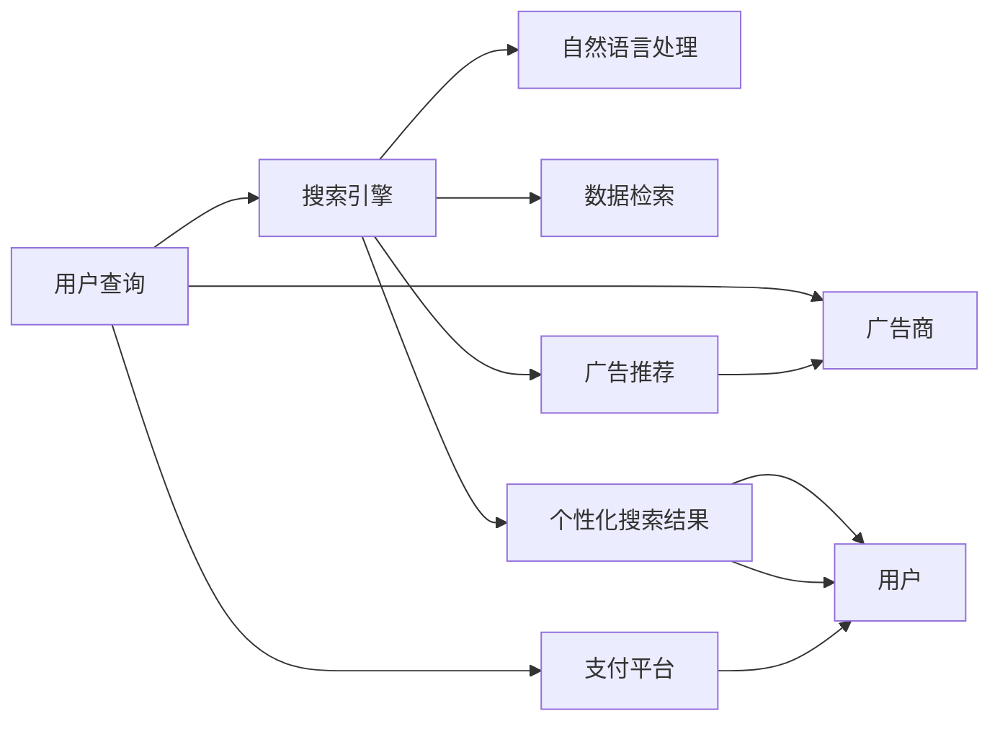

                 

# AI搜索引擎的商业模式：订阅制 vs 广告收入

> 关键词：AI搜索引擎, 商业模式, 订阅制, 广告收入, 用户数据, 隐私保护, 支付习惯, 技术栈

## 1. 背景介绍

在互联网的浪潮中，搜索引擎早已成为人们获取信息的重要工具。然而，随着AI技术的进步和应用，传统的搜索方式和商业模式正在面临颠覆性的变革。AI搜索引擎不仅能够提供更精准、更智能的搜索结果，还在探索新的商业模式，以实现可持续发展的目标。

### 1.1 传统搜索引擎的商业模式

传统的搜索引擎大多采用广告收入作为主要盈利模式。用户通过关键词搜索获取信息的同时，搜索引擎向用户展示广告商投放的广告，从而获得广告收入。这种模式依赖于大量用户的点击行为，广告商在支付一定的费用后，能够在目标受众中展示产品或服务。

### 1.2 AI技术的引入

随着深度学习、自然语言处理等AI技术的发展，AI搜索引擎开始具备更强的数据理解和处理能力。通过预训练和微调，AI搜索引擎能够更准确地理解用户查询的意图，并提供更精准、更个性化的搜索结果。AI技术的应用，不仅提升了搜索质量，还在商业模式上提供了新的选择。

## 2. 核心概念与联系

### 2.1 核心概念概述

- **AI搜索引擎**：使用AI技术，如深度学习、自然语言处理等，进行数据处理和信息检索的搜索引擎。
- **订阅制**：用户按月或按年支付费用，获取搜索引擎提供的高级功能和服务。
- **广告收入**：搜索引擎通过向用户展示广告，获取广告商支付的费用。
- **用户数据**：用户在搜索引擎上的搜索行为、点击记录等数据。
- **隐私保护**：确保用户数据的安全和隐私，避免数据泄露或滥用。
- **支付习惯**：用户对于支付费用的态度和习惯，包括支付方式、支付频率等。
- **技术栈**：搜索引擎后端的技术架构，包括AI模型、数据库、缓存、分布式系统等。

### 2.2 核心概念原理和架构的 Mermaid 流程图



该流程图展示了AI搜索引擎的基本工作流程：用户输入查询后，搜索引擎先进行自然语言处理，然后从数据库中检索相关数据，并根据用户行为和偏好，生成个性化搜索结果。同时，广告系统会根据用户行为向用户展示广告，支付平台则负责用户与广告商之间的交易。

## 3. 核心算法原理 & 具体操作步骤

### 3.1 算法原理概述

AI搜索引擎的算法核心在于如何利用AI技术提升搜索质量，同时探索新的商业模式。以下是几种常见的算法和技术：

1. **预训练与微调**：使用大规模无标签数据进行预训练，再通过少量有标签数据进行微调，使模型能够更好地理解用户查询意图。
2. **自然语言处理**：利用深度学习模型处理和理解自然语言，提升搜索结果的相关性和个性化。
3. **分布式系统**：使用分布式计算和存储技术，提升搜索引擎的并发能力和扩展性。
4. **个性化推荐**：根据用户的历史行为和兴趣，推荐个性化的搜索结果和广告。

### 3.2 算法步骤详解

1. **数据预处理**：收集和处理大规模无标签数据，用于预训练模型。
2. **模型训练**：使用预训练模型，在少量有标签数据上进行微调，提升模型性能。
3. **特征提取**：将用户查询转化为模型能够理解的形式，提取关键特征。
4. **搜索结果排序**：根据查询特征和文档特征，对搜索结果进行排序，提升用户体验。
5. **个性化推荐**：根据用户行为和偏好，推荐相关广告和搜索结果，提高转化率和广告收入。

### 3.3 算法优缺点

#### 优点

- **提升搜索质量**：通过预训练和微调，模型能够更好地理解用户查询意图，提供更精准的搜索结果。
- **多样化收入来源**：除了广告收入，还可以探索订阅制等其他盈利模式，减少对广告收入的依赖。
- **用户隐私保护**：在用户数据处理过程中，注重隐私保护，避免数据泄露和滥用。

#### 缺点

- **技术门槛高**：AI搜索引擎需要高水平的技术支撑，对于技术团队的要求较高。
- **用户习惯改变**：用户对于付费模式的接受程度可能较低，需要时间适应。
- **数据需求大**：预训练和微调需要大量数据，对数据收集和处理能力提出了较高要求。

### 3.4 算法应用领域

AI搜索引擎的算法和技术被广泛应用于多个领域，如智能推荐、医疗信息检索、教育资源搜索等。通过AI技术，搜索引擎能够在这些领域提供更精准、更高效的服务。

## 4. 数学模型和公式 & 详细讲解 & 举例说明

### 4.1 数学模型构建

假设用户查询为 $Q$，搜索引擎返回的文档集合为 $\{D_1, D_2, ..., D_n\}$。模型的目标是找到与查询 $Q$ 最相关的文档。

- **用户查询表示**：将用户查询 $Q$ 转化为向量 $Q_v$，用于模型输入。
- **文档表示**：将每个文档 $D_i$ 转化为向量 $D_{vi}$，用于模型输出。
- **相似度计算**：计算用户查询 $Q$ 与每个文档 $D_i$ 的相似度 $sim(Q, D_i)$。
- **排序与推荐**：根据相似度排序，推荐与用户查询最相关的文档。

### 4.2 公式推导过程

设 $Q_v$ 和 $D_{vi}$ 为 $d$ 维向量，相似度 $sim(Q, D_i)$ 可以通过余弦相似度计算：

$$
sim(Q, D_i) = \frac{Q_v \cdot D_{vi}}{\|Q_v\| \cdot \|D_{vi}\|}
$$

其中 $\cdot$ 表示向量点积，$\|\cdot\|$ 表示向量范数。

### 4.3 案例分析与讲解

假设用户查询为 "人工智能"，搜索引擎返回的三个文档为 "人工智能发展史"、"人工智能应用领域"、"人工智能未来展望"。假设这三个文档的向量表示分别为 $D_{vi}$，通过计算相似度，可以得出：

$$
sim(Q, D_1) = \frac{Q_v \cdot D_{v1}}{\|Q_v\| \cdot \|D_{v1}\|}
$$
$$
sim(Q, D_2) = \frac{Q_v \cdot D_{v2}}{\|Q_v\| \cdot \|D_{v2}\|}
$$
$$
sim(Q, D_3) = \frac{Q_v \cdot D_{v3}}{\|Q_v\| \cdot \|D_{v3}\|}
$$

根据相似度排序，可以推荐与用户查询最相关的文档，从而提升搜索质量。

## 5. 项目实践：代码实例和详细解释说明

### 5.1 开发环境搭建

为了开发AI搜索引擎，需要搭建一个支持深度学习、自然语言处理和分布式计算的环境。以下是搭建环境的基本步骤：

1. **选择平台**：选择Python、TensorFlow、PyTorch等平台。
2. **安装依赖**：安装TensorFlow、PyTorch、NLTK等依赖包。
3. **配置环境**：配置CPU、GPU、内存等资源，以支持大规模数据处理和模型训练。
4. **搭建服务器**：搭建分布式服务器，支持高并发和扩展性。

### 5.2 源代码详细实现

以下是一个简单的AI搜索引擎的代码实现，包括查询处理、文档检索和相似度计算：

```python
import tensorflow as tf
import numpy as np

# 定义查询向量和文档向量
Q_v = np.array([0.5, 0.5, 0.5])
D_v1 = np.array([0.3, 0.4, 0.3])
D_v2 = np.array([0.2, 0.6, 0.2])
D_v3 = np.array([0.4, 0.3, 0.3])

# 计算相似度
sim_Q_D1 = np.dot(Q_v, D_v1) / (np.linalg.norm(Q_v) * np.linalg.norm(D_v1))
sim_Q_D2 = np.dot(Q_v, D_v2) / (np.linalg.norm(Q_v) * np.linalg.norm(D_v2))
sim_Q_D3 = np.dot(Q_v, D_v3) / (np.linalg.norm(Q_v) * np.linalg.norm(D_v3))

# 排序推荐
top3_docs = np.argsort([sim_Q_D1, sim_Q_D2, sim_Q_D3])[::-1]
recommended_docs = ["D_{}".format(i+1) for i in top3_docs]

print("Recommended Docs:", recommended_docs)
```

### 5.3 代码解读与分析

这段代码首先定义了查询向量 $Q_v$ 和三个文档向量 $D_{v1}$、$D_{v2}$、$D_{v3}$。然后，通过余弦相似度公式计算了查询与每个文档的相似度，并根据相似度排序，推荐了最相关的三个文档。

## 6. 实际应用场景

### 6.1 智能推荐

AI搜索引擎可以通过用户的历史行为和偏好，推荐个性化的搜索结果和广告。例如，电商网站可以根据用户的浏览历史和购买记录，推荐相关商品，提升转化率。

### 6.2 医疗信息检索

AI搜索引擎可以应用于医疗信息检索，根据用户的查询，推荐相关的医学文献、症状治疗方案等信息。这对于提升医疗服务质量和效率具有重要意义。

### 6.3 教育资源搜索

AI搜索引擎可以推荐相关的教育资源，如课程、教材、论文等，帮助学生和教师快速获取所需信息，提升学习效果。

## 7. 工具和资源推荐

### 7.1 学习资源推荐

为了深入了解AI搜索引擎的开发和优化，以下是一些推荐的学习资源：

1. **《深度学习》一书**：详细介绍了深度学习的基本原理和应用，包括自然语言处理和分布式计算。
2. **CS229课程**：斯坦福大学的机器学习课程，涵盖深度学习、优化算法等内容。
3. **Kaggle平台**：提供大量的数据集和竞赛项目，有助于实践和提升技术能力。

### 7.2 开发工具推荐

以下是一些常用的AI搜索引擎开发工具：

1. **TensorFlow**：开源的深度学习框架，支持分布式计算和优化。
2. **PyTorch**：开源的深度学习框架，支持动态计算图和灵活的模型构建。
3. **NLTK**：自然语言处理工具包，提供文本处理、分词、词性标注等功能。

### 7.3 相关论文推荐

以下是一些推荐的相关论文，涵盖AI搜索引擎的算法和应用：

1. **"Deep Learning for NLP"**：深度学习在自然语言处理中的应用，包括搜索引擎的优化。
2. **"Personalized Information Retrieval Using Deep Learning"**：基于深度学习的个性化信息检索技术。
3. **"Efficient Computation of Similarity Between Vectors"**：高效计算向量相似度的方法，适用于搜索引擎中的排序算法。

## 8. 总结：未来发展趋势与挑战

### 8.1 研究成果总结

AI搜索引擎的商业模式研究已经取得了诸多进展，但仍需解决以下问题：

1. **提升搜索质量**：预训练和微调技术在提升搜索结果的相关性和个性化方面取得了显著效果。
2. **多样化的收入来源**：除了广告收入，订阅制等新的商业模式正在逐步探索和应用。
3. **隐私保护**：用户数据的隐私保护成为搜索引擎关注的重点，技术方案和安全策略亟待完善。

### 8.2 未来发展趋势

未来的AI搜索引擎将呈现以下发展趋势：

1. **深度学习模型的优化**：深度学习模型将不断优化，提升搜索质量，降低计算成本。
2. **个性化推荐的发展**：个性化推荐技术将进一步提升用户体验，优化广告收入。
3. **订阅制模式的推广**：订阅制模式将逐渐被用户接受，成为搜索引擎的重要盈利方式。
4. **跨领域的整合**：AI搜索引擎将与其他AI技术进行整合，提升整体性能和应用范围。

### 8.3 面临的挑战

尽管AI搜索引擎在商业模式上取得了进展，但仍面临以下挑战：

1. **技术门槛高**：AI搜索引擎需要高水平的技术支撑，对技术团队的要求较高。
2. **用户习惯的改变**：用户对于付费模式的接受程度可能较低，需要时间适应。
3. **数据需求大**：预训练和微调需要大量数据，对数据收集和处理能力提出了较高要求。
4. **隐私保护**：用户数据的隐私保护成为搜索引擎关注的重点，技术方案和安全策略亟待完善。

### 8.4 研究展望

未来，AI搜索引擎的研究可以从以下方向进行：

1. **跨领域的整合**：AI搜索引擎将与其他AI技术进行整合，提升整体性能和应用范围。
2. **深度学习模型的优化**：深度学习模型将不断优化，提升搜索质量，降低计算成本。
3. **个性化推荐的发展**：个性化推荐技术将进一步提升用户体验，优化广告收入。
4. **订阅制模式的推广**：订阅制模式将逐渐被用户接受，成为搜索引擎的重要盈利方式。

## 9. 附录：常见问题与解答

**Q1: 传统搜索引擎和AI搜索引擎在算法上有哪些区别？**

A: 传统搜索引擎主要依赖于关键词匹配算法，如PageRank、TF-IDF等，而AI搜索引擎则使用深度学习模型进行自然语言处理和数据分析，提升搜索质量和个性化推荐。

**Q2: 如何平衡用户隐私保护和广告收入？**

A: 可以通过加密技术、差分隐私等方法保护用户数据隐私，同时利用用户数据进行个性化推荐，提升广告收入。

**Q3: 订阅制模式的优势和劣势是什么？**

A: 订阅制模式的优势在于用户可以享受高级功能和服务，提升用户体验。劣势在于用户需要支付固定的费用，可能存在一定的流失率。

---

作者：禅与计算机程序设计艺术 / Zen and the Art of Computer Programming

