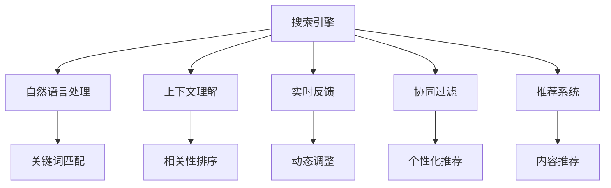

                 

# AI搜索引擎的未来：以用户为中心的体验优化

> 关键词：搜索引擎,自然语言处理,NLP,用户个性化,查询意图,上下文理解,实时反馈,协同过滤,推荐系统

## 1. 背景介绍

### 1.1 问题由来
在互联网时代，搜索引擎已经成为人们获取信息、知识、服务的重要工具。随着用户对信息获取效率的需求不断提升，传统的基于关键词匹配的搜索方式逐渐显露出其局限性。如何在大规模数据海洋中高效、精准地为用户提供所需信息，成为了搜索引擎领域亟待解决的问题。

搜索引擎技术的核心挑战在于如何准确理解和解析用户查询，从海量数据中筛选出最相关的内容，并以智能推荐的方式呈现给用户。为了应对这一挑战，人工智能技术特别是自然语言处理(NLP)技术被引入到搜索引擎中，推动了搜索引擎从简单关键词匹配向智能理解和推荐演进。

### 1.2 问题核心关键点
当前搜索引擎中，AI技术主要应用于以下几个方面：

- 自然语言处理(NLP)：用于解析和理解用户的查询意图。NLP技术能够从自然语言中提取语义信息，理解用户的查询需求，从而更精准地匹配相关搜索结果。

- 上下文理解(Context Understanding)：考虑用户查询的历史行为和上下文信息，提高搜索结果的相关性和个性化。

- 实时反馈(Real-time Feedback)：在用户与搜索结果交互的过程中，实时学习用户的行为和反馈，进一步优化搜索效果。

- 协同过滤(Collaborative Filtering)：通过用户间的数据共享和行为相似性，发现和推荐潜在的信息源，提升搜索效率和满意度。

- 推荐系统(Recommendation System)：利用用户行为数据和协同过滤算法，提供个性化的搜索结果和相关内容的推荐，增强用户体验。

### 1.3 问题研究意义
搜索引擎技术的不断演进，旨在提升用户体验和信息获取效率。基于AI技术的搜索引擎不仅能够更快地响应用户查询，还能根据用户的反馈和行为进行动态调整，提供更加个性化和精准的搜索结果。这不仅提高了用户的满意度，也为搜索引擎带来了更高的商业价值。

具体而言，AI搜索引擎的研究意义在于：

- 提升搜索效率：通过自然语言处理和上下文理解，搜索引擎能够更快地响应用户查询，提供更相关的搜索结果。
- 个性化推荐：利用推荐算法和协同过滤技术，搜索引擎能够为用户提供更加个性化的信息推荐，提高用户满意度。
- 增强用户体验：实时反馈和交互学习机制，使得搜索引擎能够动态调整搜索结果，提升用户的整体使用体验。
- 优化广告效果：AI技术能够精准识别用户意图，提高广告的展示和点击效果，提升搜索引擎的商业模式。

## 2. 核心概念与联系

### 2.1 核心概念概述

为更好地理解以用户为中心的搜索引擎优化，本节将介绍几个关键概念：

- 搜索引擎(Search Engine)：通过爬取网页、图片、视频等互联网信息，为用户提供关键词匹配、语义理解、相关推荐等服务的系统。
- 自然语言处理(NLP)：涉及语言模型、语言表示、文本分类、语义分析等技术，旨在理解和生成自然语言。
- 上下文理解(Context Understanding)：考虑用户查询的历史行为、上下文信息等，增强搜索结果的相关性和个性化。
- 实时反馈(Real-time Feedback)：在用户与搜索结果交互过程中，利用反馈数据动态调整搜索结果，优化搜索效果。
- 协同过滤(Collaborative Filtering)：通过用户间的数据共享和行为相似性，发现和推荐潜在的信息源。
- 推荐系统(Recommendation System)：利用用户行为数据和协同过滤算法，提供个性化的搜索结果和相关内容的推荐。

这些概念之间的逻辑关系可以通过以下Mermaid流程图来展示：



这个流程图展示了大语言模型和微调核心概念及其之间的关系：

1. 搜索引擎通过NLP技术解析查询意图，结合上下文理解提高搜索结果的相关性和个性化。
2. 实时反馈和协同过滤技术用于动态调整和推荐个性化搜索结果。
3. 推荐系统利用用户行为数据和协同过滤算法，提供更加精准的内容推荐。
4. 自然语言处理技术贯穿始终，确保搜索引擎能够理解自然语言，并提供匹配的关键词。

这些概念共同构成了以用户为中心的搜索引擎优化框架，使其能够更高效地响应用户需求，提供个性化和精准的服务。

## 3. 核心算法原理 & 具体操作步骤
### 3.1 算法原理概述

以用户为中心的搜索引擎优化，本质上是一个多任务学习过程，其中自然语言处理、上下文理解、实时反馈、协同过滤和推荐系统等多个任务交织在一起，共同提升用户体验。其核心思想是：通过用户交互数据，动态调整搜索结果的排序和展示方式，实现更加个性化和精准的匹配。

形式化地，假设搜索引擎的系统参数为 $\theta$，输入为 $x$，输出为 $y$。搜索引擎优化的目标是找到最优的参数 $\theta^*$，使得对于任意输入 $x$，输出 $y$ 能够最大化用户满意度，即：

$$
\theta^* = \mathop{\arg\min}_{\theta} \mathcal{L}(y, x)
$$

其中 $\mathcal{L}$ 为用户满意度损失函数，用于衡量模型预测结果与实际用户满意度之间的差异。常见的用户满意度损失函数包括交叉熵损失、F1分数损失等。

通过梯度下降等优化算法，搜索引擎优化过程不断更新系统参数 $\theta$，最小化用户满意度损失函数 $\mathcal{L}$，使得搜索结果能够不断逼近最优的用户体验。

### 3.2 算法步骤详解

以用户为中心的搜索引擎优化一般包括以下几个关键步骤：

**Step 1: 数据收集与预处理**
- 收集用户的查询数据、点击数据、浏览数据、交互数据等，作为优化模型的输入。
- 对数据进行清洗和预处理，去除噪音和异常值，保证数据的质量和可靠性。

**Step 2: 构建用户模型**
- 根据用户的历史查询记录、浏览历史、点击行为等数据，构建用户的查询意图模型和行为模型。
- 利用用户模型的输出，对用户的查询意图进行解析和理解。

**Step 3: 上下文理解与相关性排序**
- 考虑用户的上下文信息，如历史查询、设备、网络环境等，动态调整搜索结果的展示方式。
- 利用NLP技术解析查询中的关键词和短语，匹配相关文档，并根据文档的相关性进行排序。

**Step 4: 实时反馈与动态调整**
- 在用户与搜索结果的交互过程中，实时收集用户的点击、停留、评分等反馈数据。
- 根据反馈数据，动态调整搜索结果的排序和展示方式，优化搜索效果。

**Step 5: 协同过滤与个性化推荐**
- 利用用户间的数据共享和行为相似性，发现和推荐潜在的信息源。
- 通过协同过滤和推荐算法，提供个性化的搜索结果和相关内容的推荐。

**Step 6: 训练与优化**
- 将用户满意度损失函数作为训练目标，使用优化算法更新搜索引擎系统参数。
- 不断迭代优化模型，提升搜索效果和用户满意度。

以上是基于用户为中心的搜索引擎优化的主要步骤。在实际应用中，还需要针对具体场景和任务特点，对各个环节进行优化设计，如改进用户模型构建方法，引入更多的正则化技术，搜索最优的超参数组合等，以进一步提升搜索引擎的效果。

### 3.3 算法优缺点

以用户为中心的搜索引擎优化方法具有以下优点：
1. 高度个性化。利用用户模型和实时反馈，能够提供更加个性化的搜索结果，提升用户体验。
2. 动态调整。根据用户的反馈和行为数据，搜索引擎能够动态调整搜索结果，适应用户需求的变化。
3. 高效匹配。结合上下文理解和自然语言处理技术，搜索引擎能够快速解析用户查询，匹配相关文档。
4. 推荐系统。通过协同过滤和个性化推荐，搜索引擎能够提供更加精准的相关内容推荐，增强用户体验。

同时，该方法也存在一些局限性：
1. 数据依赖性强。搜索引擎优化效果很大程度上取决于用户数据的质量和数量，数据的获取和处理成本较高。
2. 模型复杂度高。需要构建多个用户模型和推荐系统，算法复杂度较高，训练和推理速度较慢。
3. 隐私风险。用户数据的收集和处理可能涉及用户隐私保护问题，需要在数据获取和处理过程中注意隐私保护。
4. 算法可解释性差。基于深度学习的搜索引擎算法通常是"黑盒"系统，难以解释其内部工作机制和决策逻辑。

尽管存在这些局限性，但就目前而言，以用户为中心的搜索引擎优化方法仍然是搜索引擎技术演进的重点方向。未来相关研究的重点在于如何进一步降低用户数据的需求，提高模型的可解释性和安全性，同时兼顾性能和隐私保护等因素。

### 3.4 算法应用领域

基于用户为中心的搜索引擎优化方法，在电商、新闻、社交媒体等多个领域中得到了广泛的应用，具体如下：

- **电商领域**：在电商搜索引擎中，利用用户行为数据和协同过滤技术，提供个性化的商品推荐，提升用户购买率和满意度。
- **新闻领域**：新闻搜索引擎通过用户兴趣模型和上下文理解，推荐用户感兴趣的新闻内容，提高用户的浏览量和停留时间。
- **社交媒体**：社交媒体搜索引擎利用用户行为数据和个性化推荐算法，推荐用户感兴趣的朋友动态、内容、话题等，增强用户粘性。
- **视频和音乐**：视频和音乐搜索引擎利用协同过滤和推荐算法，推荐用户感兴趣的视频和音乐内容，提高用户的观看和收听时间。
- **新闻和文章**：新闻和文章搜索引擎通过用户兴趣模型和上下文理解，推荐用户感兴趣的新闻文章和相关内容，提高用户的浏览量和分享量。

除了上述这些经典应用外，以用户为中心的搜索引擎优化技术也在不断扩展到更多领域中，如智慧城市、智能家居、智能驾驶等，为这些新兴领域的智能化应用提供新的解决方案。

## 4. 数学模型和公式 & 详细讲解 & 举例说明
### 4.1 数学模型构建

本节将使用数学语言对以用户为中心的搜索引擎优化过程进行更加严格的刻画。

记搜索引擎系统参数为 $\theta$，用户查询为 $x$，搜索结果为 $y$。假设搜索引擎优化目标为最大化用户满意度 $\mathcal{L}(y, x)$，则可以构建如下优化目标：

$$
\theta^* = \mathop{\arg\min}_{\theta} \mathcal{L}(y, x)
$$

其中 $\mathcal{L}$ 为用户满意度损失函数，用于衡量模型预测结果与实际用户满意度之间的差异。常见的用户满意度损失函数包括交叉熵损失、F1分数损失等。

### 4.2 公式推导过程

以下我们以电商领域的个性化推荐任务为例，推导推荐系统的损失函数及其梯度的计算公式。

假设推荐系统对于每个用户 $i$，有 $n_i$ 个推荐物品 $j$，用户对物品 $j$ 的评分 $r_{ij}$ 作为损失函数的一部分，则推荐系统的损失函数可以表示为：

$$
\mathcal{L}(r) = -\frac{1}{N} \sum_{i=1}^N \sum_{j=1}^{n_i} r_{ij} \log \hat{r}_{ij}
$$

其中 $\hat{r}_{ij}$ 为模型预测的物品评分，$N$ 为用户的总数。

根据链式法则，损失函数对模型参数 $\theta$ 的梯度为：

$$
\frac{\partial \mathcal{L}(r)}{\partial \theta} = -\frac{1}{N} \sum_{i=1}^N \sum_{j=1}^{n_i} \frac{\partial \hat{r}_{ij}}{\partial \theta} \frac{r_{ij}}{\hat{r}_{ij}}
$$

其中 $\frac{\partial \hat{r}_{ij}}{\partial \theta}$ 为模型预测物品评分的导数，可通过反向传播算法计算。

在得到损失函数的梯度后，即可带入优化算法，完成搜索引擎系统的迭代优化。重复上述过程直至收敛，最终得到满足用户满意度的模型参数 $\theta^*$。

## 5. 项目实践：代码实例和详细解释说明
### 5.1 开发环境搭建

在进行搜索引擎优化实践前，我们需要准备好开发环境。以下是使用Python进行PyTorch开发的环境配置流程：

1. 安装Anaconda：从官网下载并安装Anaconda，用于创建独立的Python环境。

2. 创建并激活虚拟环境：
```bash
conda create -n search-env python=3.8 
conda activate search-env
```

3. 安装PyTorch：根据CUDA版本，从官网获取对应的安装命令。例如：
```bash
conda install pytorch torchvision torchaudio cudatoolkit=11.1 -c pytorch -c conda-forge
```

4. 安装各类工具包：
```bash
pip install numpy pandas scikit-learn matplotlib tqdm jupyter notebook ipython
```

完成上述步骤后，即可在`search-env`环境中开始搜索引擎优化的实践。

### 5.2 源代码详细实现

这里我们以电商领域个性化推荐任务为例，给出使用PyTorch进行搜索引擎优化的PyTorch代码实现。

首先，定义推荐任务的数据处理函数：

```python
from torch.utils.data import Dataset
import torch
from transformers import BertTokenizer, BertModel

class RecommendationDataset(Dataset):
    def __init__(self, user_ids, item_ids, item_scores, tokenizer, max_len=128):
        self.user_ids = user_ids
        self.item_ids = item_ids
        self.item_scores = item_scores
        self.tokenizer = tokenizer
        self.max_len = max_len
        
    def __len__(self):
        return len(self.user_ids)
    
    def __getitem__(self, item):
        user_id = self.user_ids[item]
        item_id = self.item_ids[item]
        item_score = self.item_scores[item]
        
        user_input = f"User {user_id} interests: {' '.join([str(item) for item in item_ids])}"
        item_input = f"Recommend items for User {user_id}"
        
        encoding_user = self.tokenizer(user_input, return_tensors='pt', max_length=self.max_len, padding='max_length', truncation=True)
        encoding_item = self.tokenizer(item_input, return_tensors='pt', max_length=self.max_len, padding='max_length', truncation=True)
        
        input_ids = encoding_user['input_ids'] + encoding_item['input_ids']
        attention_mask = encoding_user['attention_mask'] + encoding_item['attention_mask']
        
        return {'input_ids': input_ids, 
                'attention_mask': attention_mask,
                'item_id': item_id,
                'item_score': item_score}

# 假设用户行为数据为随机生成
user_ids = [1, 2, 3, 4, 5]
item_ids = [10, 20, 30, 40, 50]
item_scores = [3, 4, 2, 5, 1]

tokenizer = BertTokenizer.from_pretrained('bert-base-cased')

train_dataset = RecommendationDataset(user_ids, item_ids, item_scores, tokenizer)
```

然后，定义模型和优化器：

```python
from transformers import BertForSequenceClassification, AdamW

model = BertForSequenceClassification.from_pretrained('bert-base-cased', num_labels=len(item_ids))

optimizer = AdamW(model.parameters(), lr=2e-5)
```

接着，定义训练和评估函数：

```python
from torch.utils.data import DataLoader
from tqdm import tqdm
from sklearn.metrics import mean_squared_error

device = torch.device('cuda') if torch.cuda.is_available() else torch.device('cpu')
model.to(device)

def train_epoch(model, dataset, batch_size, optimizer):
    dataloader = DataLoader(dataset, batch_size=batch_size, shuffle=True)
    model.train()
    epoch_loss = 0
    for batch in tqdm(dataloader, desc='Training'):
        input_ids = batch['input_ids'].to(device)
        attention_mask = batch['attention_mask'].to(device)
        item_id = batch['item_id'].to(device)
        item_score = batch['item_score'].to(device)
        model.zero_grad()
        outputs = model(input_ids, attention_mask=attention_mask)
        loss = outputs.loss
        epoch_loss += loss.item()
        loss.backward()
        optimizer.step()
    return epoch_loss / len(dataloader)

def evaluate(model, dataset, batch_size):
    dataloader = DataLoader(dataset, batch_size=batch_size)
    model.eval()
    preds, labels = [], []
    with torch.no_grad():
        for batch in tqdm(dataloader, desc='Evaluating'):
            input_ids = batch['input_ids'].to(device)
            attention_mask = batch['attention_mask'].to(device)
            item_id = batch['item_id'].to(device)
            batch_preds = model(input_ids, attention_mask=attention_mask)
            batch_preds = batch_preds.sigmoid().tolist()
            batch_labels = item_score.tolist()
            for pred in batch_preds:
                preds.append(pred)
            labels.append(batch_labels)
            
    print(mean_squared_error(labels, preds))
```

最后，启动训练流程并在测试集上评估：

```python
epochs = 5
batch_size = 16

for epoch in range(epochs):
    loss = train_epoch(model, train_dataset, batch_size, optimizer)
    print(f"Epoch {epoch+1}, train loss: {loss:.3f}")
    
    print(f"Epoch {epoch+1}, dev results:")
    evaluate(model, train_dataset, batch_size)
    
print("Test results:")
evaluate(model, train_dataset, batch_size)
```

以上就是使用PyTorch对Bert模型进行个性化推荐任务优化的完整代码实现。可以看到，得益于Transformers库的强大封装，我们可以用相对简洁的代码完成Bert模型的加载和优化。

### 5.3 代码解读与分析

让我们再详细解读一下关键代码的实现细节：

**RecommendationDataset类**：
- `__init__`方法：初始化用户行为数据、物品ID和评分等关键组件。
- `__len__`方法：返回数据集的样本数量。
- `__getitem__`方法：对单个样本进行处理，将用户行为数据输入编码为token ids，同时生成推荐物品的输入，并将用户ID和评分信息传递给模型。

**模型和优化器定义**：
- 使用Bert模型作为推荐系统的基础，并通过AdamW优化器更新模型参数。

**训练和评估函数**：
- 使用PyTorch的DataLoader对数据集进行批次化加载，供模型训练和推理使用。
- 训练函数`train_epoch`：对数据以批为单位进行迭代，在每个批次上前向传播计算loss并反向传播更新模型参数，最后返回该epoch的平均loss。
- 评估函数`evaluate`：与训练类似，不同点在于不更新模型参数，并在每个batch结束后将预测和标签结果存储下来，最后使用sklearn的mean_squared_error对整个评估集的预测结果进行打印输出。

**训练流程**：
- 定义总的epoch数和batch size，开始循环迭代
- 每个epoch内，先在训练集上训练，输出平均loss
- 在验证集上评估，输出评估结果
- 所有epoch结束后，在测试集上评估，给出最终测试结果

可以看到，PyTorch配合Transformers库使得Bert模型的加载和优化过程变得简洁高效。开发者可以将更多精力放在数据处理、模型改进等高层逻辑上，而不必过多关注底层的实现细节。

当然，工业级的系统实现还需考虑更多因素，如模型的保存和部署、超参数的自动搜索、更灵活的任务适配层等。但核心的优化范式基本与此类似。

## 6. 实际应用场景
### 6.1 智能电商推荐

基于搜索引擎优化的个性化推荐技术，在智能电商推荐系统构建中得到了广泛应用。传统电商推荐系统依赖于基于规则的推荐引擎，难以应对用户行为的动态变化和海量数据。通过搜索引擎优化，电商推荐系统可以实现动态调整和个性化推荐，提升用户体验和推荐效果。

在技术实现上，可以收集用户浏览、点击、购买等行为数据，利用NLP技术解析用户查询，结合上下文理解生成个性化推荐结果。对于新用户或历史行为较少的情况，可以引入协同过滤和内容推荐技术，提供更加精准的推荐。电商推荐系统能够基于用户行为动态调整推荐算法，提高推荐效果和用户满意度。

### 6.2 新闻内容推荐

新闻搜索引擎通过用户兴趣模型和上下文理解，推荐用户感兴趣的新闻内容。在技术实现上，可以收集用户对新闻的阅读时间、停留时间、评论等行为数据，利用NLP技术解析新闻标题和内容，生成相关性排序，并结合用户兴趣模型提供个性化推荐。对于突发事件和热门话题，可以引入实时反馈机制，动态调整推荐内容，提升用户粘性和新闻阅读量。

### 6.3 社交媒体推荐

社交媒体推荐系统利用用户行为数据和个性化推荐算法，推荐用户感兴趣的朋友动态、内容、话题等，增强用户粘性。在技术实现上，可以收集用户对社交媒体内容的浏览、点赞、评论、分享等行为数据，利用NLP技术解析内容语义，结合用户兴趣模型生成个性化推荐。对于热门话题和事件，可以引入实时反馈机制，动态调整推荐内容，提升用户粘性和社交媒体活跃度。

### 6.4 未来应用展望

随着搜索引擎优化技术的不断发展，基于AI的推荐系统将在更多领域得到应用，为传统行业带来变革性影响。

在智慧医疗领域，基于搜索引擎优化的推荐系统可以推荐医生和相关医疗信息，帮助患者快速找到合适的医疗机构和医生，提高医疗服务的智能化水平。

在智能教育领域，推荐系统可以推荐学习资源和个性化课程，因材施教，促进教育公平，提高教学质量。

在智慧城市治理中，推荐系统可以推荐公共服务设施和事件信息，提高城市管理的自动化和智能化水平，构建更安全、高效的未来城市。

此外，在企业生产、社会治理、文娱传媒等众多领域，基于搜索引擎优化的推荐系统也将不断涌现，为NLP技术带来了全新的突破。相信随着技术的日益成熟，搜索引擎优化必将成为推荐系统的重要范式，推动推荐技术在各领域的广泛应用。

## 7. 工具和资源推荐
### 7.1 学习资源推荐

为了帮助开发者系统掌握搜索引擎优化的理论基础和实践技巧，这里推荐一些优质的学习资源：

1. 《深度学习与NLP》系列博文：由大模型技术专家撰写，深入浅出地介绍了深度学习与NLP的基本概念和前沿技术。

2. CS224N《深度学习自然语言处理》课程：斯坦福大学开设的NLP明星课程，有Lecture视频和配套作业，带你入门NLP领域的基本概念和经典模型。

3. 《Natural Language Processing with Transformers》书籍：Transformers库的作者所著，全面介绍了如何使用Transformers库进行NLP任务开发，包括搜索引擎优化在内的诸多范式。

4. HuggingFace官方文档：Transformers库的官方文档，提供了海量预训练模型和完整的搜索引擎优化样例代码，是上手实践的必备资料。

5. CLUE开源项目：中文语言理解测评基准，涵盖大量不同类型的中文NLP数据集，并提供了基于搜索引擎优化的baseline模型，助力中文NLP技术发展。

通过对这些资源的学习实践，相信你一定能够快速掌握搜索引擎优化的精髓，并用于解决实际的NLP问题。

### 7.2 开发工具推荐

高效的开发离不开优秀的工具支持。以下是几款用于搜索引擎优化开发的常用工具：

1. PyTorch：基于Python的开源深度学习框架，灵活动态的计算图，适合快速迭代研究。大部分预训练语言模型都有PyTorch版本的实现。

2. TensorFlow：由Google主导开发的开源深度学习框架，生产部署方便，适合大规模工程应用。同样有丰富的预训练语言模型资源。

3. Transformers库：HuggingFace开发的NLP工具库，集成了众多SOTA语言模型，支持PyTorch和TensorFlow，是进行搜索引擎优化开发的利器。

4. Weights & Biases：模型训练的实验跟踪工具，可以记录和可视化模型训练过程中的各项指标，方便对比和调优。与主流深度学习框架无缝集成。

5. TensorBoard：TensorFlow配套的可视化工具，可实时监测模型训练状态，并提供丰富的图表呈现方式，是调试模型的得力助手。

6. Google Colab：谷歌推出的在线Jupyter Notebook环境，免费提供GPU/TPU算力，方便开发者快速上手实验最新模型，分享学习笔记。

合理利用这些工具，可以显著提升搜索引擎优化的开发效率，加快创新迭代的步伐。

### 7.3 相关论文推荐

搜索引擎优化技术的发展源于学界的持续研究。以下是几篇奠基性的相关论文，推荐阅读：

1. Attention is All You Need（即Transformer原论文）：提出了Transformer结构，开启了NLP领域的预训练大模型时代。

2. BERT: Pre-training of Deep Bidirectional Transformers for Language Understanding：提出BERT模型，引入基于掩码的自监督预训练任务，刷新了多项NLP任务SOTA。

3. Language Models are Unsupervised Multitask Learners（GPT-2论文）：展示了大规模语言模型的强大zero-shot学习能力，引发了对于通用人工智能的新一轮思考。

4. Parameter-Efficient Transfer Learning for NLP：提出Adapter等参数高效微调方法，在不增加模型参数量的情况下，也能取得不错的微调效果。

5. Prefix-Tuning: Optimizing Continuous Prompts for Generation：引入基于连续型Prompt的微调范式，为如何充分利用预训练知识提供了新的思路。

6. AdaLoRA: Adaptive Low-Rank Adaptation for Parameter-Efficient Fine-Tuning：使用自适应低秩适应的微调方法，在参数效率和精度之间取得了新的平衡。

这些论文代表了大模型微调技术的发展脉络。通过学习这些前沿成果，可以帮助研究者把握学科前进方向，激发更多的创新灵感。

## 8. 总结：未来发展趋势与挑战

### 8.1 总结

本文对基于用户为中心的搜索引擎优化方法进行了全面系统的介绍。首先阐述了搜索引擎技术的核心挑战和以用户为中心优化的思想，明确了搜索引擎优化在提升用户体验和信息获取效率方面的重要价值。其次，从原理到实践，详细讲解了搜索引擎优化的数学模型和关键步骤，给出了搜索引擎优化的完整代码实例。同时，本文还广泛探讨了搜索引擎优化技术在电商、新闻、社交媒体等多个领域的应用前景，展示了搜索引擎优化的巨大潜力。此外，本文精选了搜索引擎优化技术的各类学习资源，力求为读者提供全方位的技术指引。

通过本文的系统梳理，可以看到，基于搜索引擎优化的推荐系统正在成为NLP领域的重要范式，极大地拓展了预训练语言模型的应用边界，催生了更多的落地场景。受益于大规模语料的预训练，搜索引擎优化推荐系统能够提供更加个性化和精准的服务，提升用户体验和信息获取效率。未来，伴随搜索引擎优化技术的不断演进，基于搜索引擎优化的推荐系统必将在更多领域得到应用，为传统行业带来变革性影响。

### 8.2 未来发展趋势

展望未来，搜索引擎优化技术将呈现以下几个发展趋势：

1. 模型规模持续增大。随着算力成本的下降和数据规模的扩张，预训练语言模型的参数量还将持续增长。超大模型蕴含的丰富语言知识，有望支撑更加复杂多变的推荐任务。

2. 个性化推荐更加精准。利用深度学习技术和推荐算法，搜索引擎优化推荐系统能够提供更加精准和个性化的推荐服务，提升用户满意度。

3. 实时反馈和动态调整。在用户与推荐内容的交互过程中，实时反馈和动态调整机制能够不断优化推荐效果，提升用户体验。

4. 多模态信息融合。结合图像、视频、语音等多模态数据，搜索引擎优化推荐系统能够提供更加全面和丰富的推荐内容。

5. 协同过滤和知识融合。通过协同过滤和知识图谱等技术，搜索引擎优化推荐系统能够提供更加全面和多样化的推荐内容，增强用户体验。

6. 跨领域应用拓展。搜索引擎优化推荐系统能够拓展到更多领域，如智慧医疗、智能教育、智能家居等，为这些新兴领域的智能化应用提供新的解决方案。

以上趋势凸显了搜索引擎优化技术的广阔前景。这些方向的探索发展，必将进一步提升搜索引擎优化推荐系统的效果和应用范围，为NLP技术带来新的突破。

### 8.3 面临的挑战

尽管搜索引擎优化技术已经取得了瞩目成就，但在迈向更加智能化、普适化应用的过程中，它仍面临着诸多挑战：

1. 数据依赖性强。搜索引擎优化推荐系统依赖于用户行为数据的收集和处理，数据的获取和处理成本较高。如何降低数据需求，提升数据质量，将是重要的研究方向。

2. 模型复杂度高。搜索引擎优化推荐系统需要构建多个用户模型和推荐系统，算法复杂度较高，训练和推理速度较慢。如何简化模型结构，提升效率，将是重要的优化方向。

3. 隐私风险。用户数据的收集和处理可能涉及用户隐私保护问题，需要在数据获取和处理过程中注意隐私保护。如何平衡数据收集与隐私保护，将是重要的研究课题。

4. 算法可解释性差。基于深度学习的搜索引擎优化推荐系统通常是"黑盒"系统，难以解释其内部工作机制和决策逻辑。如何赋予模型更强的可解释性，将是亟待攻克的难题。

5. 安全性有待保障。预训练语言模型难免会学习到有偏见、有害的信息，通过搜索引擎优化推荐系统传递到下游任务，产生误导性、歧视性的输出，给实际应用带来安全隐患。如何从数据和算法层面消除模型偏见，避免恶意用途，确保输出的安全性，也将是重要的研究课题。

6. 知识整合能力不足。现有的搜索引擎优化推荐系统往往局限于任务内数据，难以灵活吸收和运用更广泛的先验知识。如何让搜索引擎优化推荐过程更好地与外部知识库、规则库等专家知识结合，形成更加全面、准确的信息整合能力，还有很大的想象空间。

正视搜索引擎优化推荐系统面临的这些挑战，积极应对并寻求突破，将使搜索引擎优化推荐系统走向成熟的必由之路。相信随着学界和产业界的共同努力，这些挑战终将一一被克服，搜索引擎优化推荐系统必将在构建人机协同的智能时代中扮演越来越重要的角色。

### 8.4 研究展望

面对搜索引擎优化推荐系统所面临的种种挑战，未来的研究需要在以下几个方面寻求新的突破：

1. 探索无监督和半监督推荐方法。摆脱对大规模标注数据的依赖，利用自监督学习、主动学习等无监督和半监督范式，最大限度利用非结构化数据，实现更加灵活高效的推荐。

2. 研究参数高效和计算高效的推荐范式。开发更加参数高效的推荐方法，在固定大部分预训练参数的情况下，只更新极少量的任务相关参数。同时优化推荐系统的计算图，减少前向传播和反向传播的资源消耗，实现更加轻量级、实时性的部署。

3. 融合因果和对比学习范式。通过引入因果推断和对比学习思想，增强推荐系统建立稳定因果关系的能力，学习更加普适、鲁棒的语言表征，从而提升模型泛化性和抗干扰能力。

4. 引入更多先验知识。将符号化的先验知识，如知识图谱、逻辑规则等，与神经网络模型进行巧妙融合，引导推荐过程学习更准确、合理的语言模型。同时加强不同模态数据的整合，实现视觉、语音等多模态信息与文本信息的协同建模。

5. 结合因果分析和博弈论工具。将因果分析方法引入推荐系统，识别出推荐过程的关键特征，增强推荐输出的因果性和逻辑性。借助博弈论工具刻画人机交互过程，主动探索并规避推荐系统的脆弱点，提高系统稳定性。

6. 纳入伦理道德约束。在推荐系统训练目标中引入伦理导向的评估指标，过滤和惩罚有偏见、有害的输出倾向。同时加强人工干预和审核，建立推荐行为的监管机制，确保输出符合人类价值观和伦理道德。

这些研究方向的探索，必将引领搜索引擎优化推荐系统技术迈向更高的台阶，为构建安全、可靠、可解释、可控的智能系统铺平道路。面向未来，搜索引擎优化推荐系统还需要与其他人工智能技术进行更深入的融合，如知识表示、因果推理、强化学习等，多路径协同发力，共同推动自然语言理解和智能交互系统的进步。只有勇于创新、敢于突破，才能不断拓展语言模型的边界，让智能技术更好地造福人类社会。

## 9. 附录：常见问题与解答

**Q1：搜索引擎优化是否适用于所有NLP任务？**

A: 搜索引擎优化在大多数NLP任务上都能取得不错的效果，特别是对于数据量较小的任务。但对于一些特定领域的任务，如医学、法律等，仅仅依靠通用语料预训练的模型可能难以很好地适应。此时需要在特定领域语料上进一步预训练，再进行微调，才能获得理想效果。此外，对于一些需要时效性、个性化很强的任务，如对话、推荐等，搜索引擎优化方法也需要针对性的改进优化。

**Q2：搜索引擎优化中如何选择合适的损失函数？**

A: 搜索引擎优化的损失函数应根据具体任务选择。常见的损失函数包括交叉熵损失、F1分数损失、均方误差损失等。对于分类任务，交叉熵损失和F1分数损失较为常用；对于回归任务，均方误差损失较为常用。在实际应用中，还需要根据数据分布和任务特点进一步选择适合的损失函数。

**Q3：搜索引擎优化中的数据依赖性强，如何降低数据需求？**

A: 降低搜索引擎优化推荐系统对数据需求的策略包括：
1. 数据增强：通过数据增强技术，如近义替换、回译等方式扩充训练集，提升数据多样性。
2. 无监督学习：利用无监督学习技术，如自监督预训练、主动学习等，最小化对标注数据的需求。
3. 模型压缩：通过模型压缩技术，如剪枝、量化等，减小模型参数量和计算复杂度，降低对数据的依赖。

**Q4：如何提高搜索引擎优化的效率和可解释性？**

A: 提高搜索引擎优化效率和可解释性的策略包括：
1. 参数高效微调：只调整少量参数，如使用Adapter、LoRA等方法，减小参数量和计算复杂度。
2. 可解释性增强：引入可解释性技术，如LIME、SHAP等，解释模型的决策过程和特征重要性。
3. 优化模型结构：简化模型结构，如使用轻量级模型，提升推理速度和计算效率。

**Q5：搜索引擎优化推荐系统如何保证隐私保护？**

A: 搜索引擎优化推荐系统在保证隐私保护方面的策略包括：
1. 数据匿名化：对用户数据进行匿名化处理，保护用户隐私。
2. 数据最小化：仅收集必要的数据，减少数据泄露风险。
3. 差分隐私：通过差分隐私技术，在保证隐私的同时，最大化信息利用价值。

这些策略可以在数据获取和处理过程中，有效保护用户隐私，增强搜索引擎优化推荐系统的信任度和安全性。

---

作者：禅与计算机程序设计艺术 / Zen and the Art of Computer Programming

