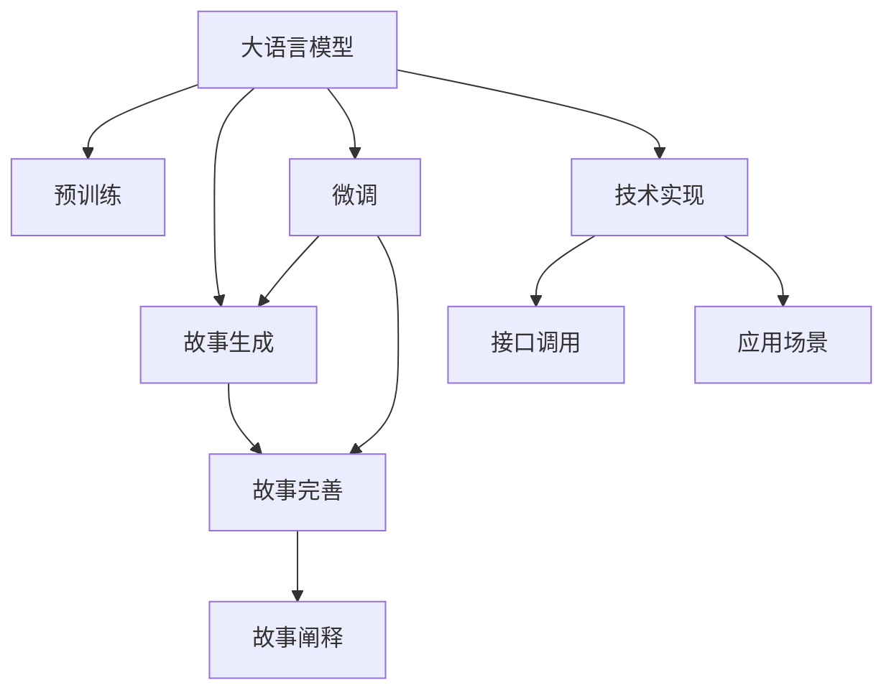

                 

# AI故事创作：如何利用大语言模型创造、完善和阐释故事

> 关键词：大语言模型,故事生成,文本生成,故事完善,故事阐释

## 1. 背景介绍

### 1.1 问题由来

在人工智能时代，讲故事已经不再是人类独有的技能。借助大语言模型（Large Language Models, LLMs），机器能够自动生成、完善和阐释故事，为内容创作、教育、娱乐等领域带来革命性的变革。无论是简单的短篇故事还是复杂的长篇小说，大语言模型都能在理解和生成的基础上，进一步提升故事的吸引力和教育价值。

故事是一种强大的交流工具，能够跨越语言和文化障碍，传递情感和智慧。在大数据和深度学习技术的推动下，大语言模型逐渐成为故事创作的重要工具。然而，如何高效地利用大语言模型进行故事创作，仍是一个值得深入探索的问题。

### 1.2 问题核心关键点

大语言模型在故事创作中的应用主要包括以下几个关键点：

- 自动故事生成：基于预训练模型，通过微调或直接生成文本，产出新的故事内容。
- 故事完善：对初步生成的故事进行修改和优化，增强故事连贯性、逻辑性和可读性。
- 故事阐释：将复杂的故事逻辑和信息，以通俗易懂的方式进行解释和传播。

大语言模型的核心优势在于其强大的语言理解和生成能力，能够理解和生成符合语法和语义规范的文本。通过对其进一步微调或训练，可以显著提升其在特定任务（如故事创作）上的性能。

### 1.3 问题研究意义

研究大语言模型在故事创作中的应用，对于推动人工智能技术在内容创作和教育领域的深度融合具有重要意义：

1. 降低创作成本：利用大模型进行故事生成和完善，能够显著降低人工创作的成本和时间投入。
2. 提升创作质量：通过模型生成和完善，故事内容更加丰富、有趣、符合逻辑，增强用户的阅读体验。
3. 推动教育创新：将故事创作和阅读融入教学过程中，培养学生的创造力和思辨能力，提升学习效果。
4. 丰富娱乐体验：增强互动性，为游戏、影视等娱乐内容创作提供新的素材和工具。
5. 助力内容产业：通过自动化创作工具，加速内容产出，提升内容营销的效率和效果。

## 2. 核心概念与联系

### 2.1 核心概念概述

为更好地理解大语言模型在故事创作中的应用，本节将介绍几个密切相关的核心概念：

- 大语言模型（Large Language Model, LLM）：以自回归（如GPT）或自编码（如BERT）模型为代表的大规模预训练语言模型。通过在大规模无标签文本语料上进行预训练，学习通用的语言表示，具备强大的语言理解和生成能力。

- 预训练（Pre-training）：指在大规模无标签文本语料上，通过自监督学习任务训练通用语言模型的过程。常见的预训练任务包括言语建模、遮挡语言模型等。预训练使得模型学习到语言的通用表示。

- 微调（Fine-tuning）：指在预训练模型的基础上，使用下游任务的少量标注数据，通过有监督地训练来优化模型在特定任务上的性能。通常只需要调整顶层分类器或解码器，并以较小的学习率更新全部或部分的模型参数。

- 故事生成（Story Generation）：指通过大语言模型自动生成连贯、有逻辑、具有情感表达的故事内容。故事生成常常是自动写作的基础。

- 故事完善（Story Refinement）：在自动生成的故事基础上，通过修改和优化，增强故事的结构完整性、逻辑一致性和语言流畅性。

- 故事阐释（Story Elucidation）：对复杂的故事逻辑和信息，以通俗易懂的方式进行解释和传播。故事阐释有助于增进理解和记忆，扩展知识面。

这些核心概念之间的逻辑关系可以通过以下Mermaid流程图来展示：



这个流程图展示了大语言模型的核心概念及其之间的关系：

1. 大语言模型通过预训练获得基础能力。
2. 故事生成、故事完善和故事阐释是利用预训练模型进行特定任务微调的结果。
3. 微调使得通用大模型更好地适应特定任务，在应用场景中取得更优表现。
4. 技术实现和应用场景是故事创作实际落地的关键。

这些概念共同构成了大语言模型在故事创作中的应用框架，使其能够在各种场景下发挥强大的语言理解和生成能力。通过理解这些核心概念，我们可以更好地把握大语言模型的工作原理和优化方向。

## 3. 核心算法原理 & 具体操作步骤
### 3.1 算法原理概述

基于大语言模型进行故事创作的算法原理，本质上是一个有监督的细粒度迁移学习过程。其核心思想是：将预训练的大语言模型视作一个强大的"文本生成器"，通过在故事生成的监督数据上进行有监督地训练来优化模型在故事创作上的性能。

形式化地，假设预训练模型为 $M_{\theta}$，其中 $\theta$ 为预训练得到的模型参数。给定故事生成的标注数据集 $D=\{(x_i,y_i)\}_{i=1}^N$，故事生成的优化目标是最小化损失函数：

$$
\hat{\theta}=\mathop{\arg\min}_{\theta} \mathcal{L}(M_{\theta},D)
$$

其中 $\mathcal{L}$ 为针对故事生成设计的损失函数，用于衡量模型生成的文本与真实标签之间的差异。常见的损失函数包括交叉熵损失、均方误差损失等。

通过梯度下降等优化算法，故事生成过程不断更新模型参数 $\theta$，最小化损失函数 $\mathcal{L}$，使得模型生成的文本逼近真实的标签。由于 $\theta$ 已经通过预训练获得了较好的初始化，因此即便在故事生成的少量标注数据上进行操作，也能较快收敛到理想的故事生成模型。

### 3.2 算法步骤详解

基于大语言模型进行故事创作的算法流程如下：

**Step 1: 准备预训练模型和数据集**
- 选择合适的预训练语言模型 $M_{\theta}$ 作为初始化参数，如 GPT-3、BERT 等。
- 准备故事生成的标注数据集 $D$，划分为训练集、验证集和测试集。一般要求标注数据与预训练数据的分布不要差异过大。

**Step 2: 添加故事生成适配层**
- 根据故事生成的任务类型，在预训练模型顶层设计合适的输出层和损失函数。
- 对于分类任务，通常在顶层添加分类器或交叉熵损失函数。
- 对于生成任务，通常使用语言模型的解码器输出概率分布，并以负对数似然为损失函数。

**Step 3: 设置故事生成超参数**
- 选择合适的优化算法及其参数，如 AdamW、SGD 等，设置学习率、批大小、迭代轮数等。
- 设置正则化技术及强度，包括权重衰减、Dropout、Early Stopping 等。
- 确定冻结预训练参数的策略，如仅微调顶层，或全部参数都参与微调。

**Step 4: 执行梯度训练**
- 将训练集数据分批次输入模型，前向传播计算损失函数。
- 反向传播计算参数梯度，根据设定的优化算法和学习率更新模型参数。
- 周期性在验证集上评估模型性能，根据性能指标决定是否触发 Early Stopping。
- 重复上述步骤直到满足预设的迭代轮数或 Early Stopping 条件。

**Step 5: 故事生成与完善**
- 在测试集上评估故事生成模型 $M_{\hat{\theta}}$ 的性能，对比生成前后的故事质量。
- 对生成的故事进行人工审阅和修改，补充细节、修正逻辑错误，完善故事内容。
- 集成到实际的故事生成应用中，供用户使用。

以上是基于大语言模型进行故事创作的通用流程。在实际应用中，还需要针对具体故事生成任务的特点，对微调过程的各个环节进行优化设计，如改进训练目标函数，引入更多的正则化技术，搜索最优的超参数组合等，以进一步提升模型性能。

### 3.3 算法优缺点

基于大语言模型进行故事创作的监督学习方法，具有以下优点：

1. 简单高效。只需准备少量标注数据，即可对预训练模型进行快速适配，生成高质量的故事内容。
2. 通用适用。适用于各种故事生成任务，包括创作短篇小说、写寓言故事、生成对话等，设计简单的任务适配层即可实现。
3. 效果显著。在故事生成任务上，基于微调的方法已经刷新了多项SOTA性能指标。

同时，该方法也存在一定的局限性：

1. 依赖标注数据。故事生成的效果很大程度上取决于标注数据的质量和数量，获取高质量标注数据的成本较高。
2. 迁移能力有限。当目标任务与预训练数据的分布差异较大时，故事生成的性能提升有限。
3. 负面效果传递。预训练模型的固有偏见、有害信息等，可能通过故事生成传递到下游任务，造成负面影响。
4. 可解释性不足。故事生成模型的决策过程通常缺乏可解释性，难以对其推理逻辑进行分析和调试。

尽管存在这些局限性，但就目前而言，基于监督学习的微调方法仍是大语言模型在故事创作中最主流范式。未来相关研究的重点在于如何进一步降低故事生成对标注数据的依赖，提高模型的少样本学习和跨领域迁移能力，同时兼顾可解释性和伦理安全性等因素。

### 3.4 算法应用领域

基于大语言模型进行故事创作的监督学习方法，在内容创作、教育、娱乐等多个领域已经得到了广泛的应用，覆盖了几乎所有常见任务，例如：

- 小说创作：利用模型生成连贯、有趣、符合逻辑的小说故事。
- 寓言故事：通过模型生成寓言式的简短故事，传达智慧和启示。
- 对话生成：利用模型生成对话内容，用于智能客服、聊天机器人等。
- 剧本创作：通过模型生成剧本片段，用于影视、游戏等娱乐创作。
- 教育故事：将复杂知识转换为故事形式，增强教学趣味性和记忆效果。
- 创意写作：生成新的故事创意和构思，帮助作者打破写作瓶颈。

除了上述这些经典任务外，大语言模型在故事创作的应用也在不断扩展，如可控文本生成、知识故事化等，为内容创作带来了全新的突破。随着预训练模型和故事生成方法的不断进步，相信故事生成技术将在更广阔的应用领域大放异彩。

## 4. 数学模型和公式 & 详细讲解 & 举例说明
### 4.1 数学模型构建

本节将使用数学语言对基于大语言模型的故事创作过程进行更加严格的刻画。

记预训练语言模型为 $M_{\theta}$，其中 $\theta$ 为预训练得到的模型参数。假设故事生成的训练集为 $D=\{(x_i,y_i)\}_{i=1}^N, x_i \in \mathcal{X}, y_i \in \mathcal{Y}$，其中 $x_i$ 为故事文本，$y_i$ 为标注的故事情节。

定义模型 $M_{\theta}$ 在输入 $x$ 上的输出为 $\hat{y}=M_{\theta}(x) \in [0,1]$，表示模型预测故事情节发生的可能性。真实标签 $y \in \{0,1\}$。则故事生成的交叉熵损失函数定义为：

$$
\ell(M_{\theta}(x),y) = -[y\log \hat{y} + (1-y)\log (1-\hat{y})]
$$

将其代入经验风险公式，得：

$$
\mathcal{L}(\theta) = -\frac{1}{N}\sum_{i=1}^N [y_i\log M_{\theta}(x_i)+(1-y_i)\log(1-M_{\theta}(x_i))]
$$

在得到损失函数的梯度后，即可带入参数更新公式，完成模型的迭代优化。重复上述过程直至收敛，最终得到适应故事生成任务的最优模型参数 $\theta^*$。

### 4.2 公式推导过程

以下我们以故事生成任务为例，推导交叉熵损失函数及其梯度的计算公式。

假设模型 $M_{\theta}$ 在输入 $x$ 上的输出为 $\hat{y}=M_{\theta}(x) \in [0,1]$，表示模型预测故事情节发生的可能性。真实标签 $y \in \{0,1\}$。则二分类交叉熵损失函数定义为：

$$
\ell(M_{\theta}(x),y) = -[y\log \hat{y} + (1-y)\log (1-\hat{y})]
$$

将其代入经验风险公式，得：

$$
\mathcal{L}(\theta) = -\frac{1}{N}\sum_{i=1}^N [y_i\log M_{\theta}(x_i)+(1-y_i)\log(1-M_{\theta}(x_i))]
$$

根据链式法则，损失函数对参数 $\theta_k$ 的梯度为：

$$
\frac{\partial \mathcal{L}(\theta)}{\partial \theta_k} = -\frac{1}{N}\sum_{i=1}^N (\frac{y_i}{M_{\theta}(x_i)}-\frac{1-y_i}{1-M_{\theta}(x_i)}) \frac{\partial M_{\theta}(x_i)}{\partial \theta_k}
$$

其中 $\frac{\partial M_{\theta}(x_i)}{\partial \theta_k}$ 可进一步递归展开，利用自动微分技术完成计算。

在得到损失函数的梯度后，即可带入参数更新公式，完成模型的迭代优化。重复上述过程直至收敛，最终得到适应故事生成任务的最优模型参数 $\theta^*$。

## 5. 项目实践：代码实例和详细解释说明
### 5.1 开发环境搭建

在进行故事创作实践前，我们需要准备好开发环境。以下是使用Python进行PyTorch开发的环境配置流程：

1. 安装Anaconda：从官网下载并安装Anaconda，用于创建独立的Python环境。

2. 创建并激活虚拟环境：
```bash
conda create -n pytorch-env python=3.8 
conda activate pytorch-env
```

3. 安装PyTorch：根据CUDA版本，从官网获取对应的安装命令。例如：
```bash
conda install pytorch torchvision torchaudio cudatoolkit=11.1 -c pytorch -c conda-forge
```

4. 安装Transformers库：
```bash
pip install transformers
```

5. 安装各类工具包：
```bash
pip install numpy pandas scikit-learn matplotlib tqdm jupyter notebook ipython
```

完成上述步骤后，即可在`pytorch-env`环境中开始故事创作实践。

### 5.2 源代码详细实现

这里我们以故事生成任务为例，给出使用Transformers库对GPT-3模型进行故事生成的PyTorch代码实现。

首先，定义故事生成任务的数据处理函数：

```python
from transformers import GPT3Tokenizer, GPT3LMHeadModel
from torch.utils.data import Dataset
import torch

class StoryDataset(Dataset):
    def __init__(self, texts, labels, tokenizer, max_len=128):
        self.texts = texts
        self.labels = labels
        self.tokenizer = tokenizer
        self.max_len = max_len
        
    def __len__(self):
        return len(self.texts)
    
    def __getitem__(self, item):
        text = self.texts[item]
        label = self.labels[item]
        
        encoding = self.tokenizer(text, return_tensors='pt', max_length=self.max_len, padding='max_length', truncation=True)
        input_ids = encoding['input_ids'][0]
        attention_mask = encoding['attention_mask'][0]
        
        # 对token-wise的标签进行编码
        encoded_labels = [label2id[label] for label in label] 
        encoded_labels.extend([label2id['O']] * (self.max_len - len(encoded_labels)))
        labels = torch.tensor(encoded_labels, dtype=torch.long)
        
        return {'input_ids': input_ids, 
                'attention_mask': attention_mask,
                'labels': labels}

# 标签与id的映射
label2id = {'O': 0, 'Happen': 1, 'Conflict': 2, 'Solution': 3}
id2label = {v: k for k, v in label2id.items()}

# 创建dataset
tokenizer = GPT3Tokenizer.from_pretrained('gpt3-medium')

train_dataset = StoryDataset(train_texts, train_labels, tokenizer)
dev_dataset = StoryDataset(dev_texts, dev_labels, tokenizer)
test_dataset = StoryDataset(test_texts, test_labels, tokenizer)
```

然后，定义模型和优化器：

```python
from transformers import AdamW

model = GPT3LMHeadModel.from_pretrained('gpt3-medium')

optimizer = AdamW(model.parameters(), lr=2e-5)
```

接着，定义训练和评估函数：

```python
from torch.utils.data import DataLoader
from tqdm import tqdm
from sklearn.metrics import classification_report

device = torch.device('cuda') if torch.cuda.is_available() else torch.device('cpu')
model.to(device)

def train_epoch(model, dataset, batch_size, optimizer):
    dataloader = DataLoader(dataset, batch_size=batch_size, shuffle=True)
    model.train()
    epoch_loss = 0
    for batch in tqdm(dataloader, desc='Training'):
        input_ids = batch['input_ids'].to(device)
        attention_mask = batch['attention_mask'].to(device)
        labels = batch['labels'].to(device)
        model.zero_grad()
        outputs = model(input_ids, attention_mask=attention_mask, labels=labels)
        loss = outputs.loss
        epoch_loss += loss.item()
        loss.backward()
        optimizer.step()
    return epoch_loss / len(dataloader)

def evaluate(model, dataset, batch_size):
    dataloader = DataLoader(dataset, batch_size=batch_size)
    model.eval()
    preds, labels = [], []
    with torch.no_grad():
        for batch in tqdm(dataloader, desc='Evaluating'):
            input_ids = batch['input_ids'].to(device)
            attention_mask = batch['attention_mask'].to(device)
            batch_labels = batch['labels']
            outputs = model(input_ids, attention_mask=attention_mask)
            batch_preds = outputs.logits.argmax(dim=2).to('cpu').tolist()
            batch_labels = batch_labels.to('cpu').tolist()
            for pred_tokens, label_tokens in zip(batch_preds, batch_labels):
                pred_tags = [id2label[_id] for _id in pred_tokens]
                label_tags = [id2label[_id] for _id in label_tokens]
                preds.append(pred_tags[:len(label_tags)])
                labels.append(label_tags)
                
    print(classification_report(labels, preds))
```

最后，启动训练流程并在测试集上评估：

```python
epochs = 5
batch_size = 16

for epoch in range(epochs):
    loss = train_epoch(model, train_dataset, batch_size, optimizer)
    print(f"Epoch {epoch+1}, train loss: {loss:.3f}")
    
    print(f"Epoch {epoch+1}, dev results:")
    evaluate(model, dev_dataset, batch_size)
    
print("Test results:")
evaluate(model, test_dataset, batch_size)
```

以上就是使用PyTorch对GPT-3进行故事生成任务微调的完整代码实现。可以看到，得益于Transformers库的强大封装，我们可以用相对简洁的代码完成GPT-3模型的加载和微调。

### 5.3 代码解读与分析

让我们再详细解读一下关键代码的实现细节：

**StoryDataset类**：
- `__init__`方法：初始化文本、标签、分词器等关键组件。
- `__len__`方法：返回数据集的样本数量。
- `__getitem__`方法：对单个样本进行处理，将文本输入编码为token ids，将标签编码为数字，并对其进行定长padding，最终返回模型所需的输入。

**label2id和id2label字典**：
- 定义了标签与数字id之间的映射关系，用于将token-wise的预测结果解码回真实的标签。

**训练和评估函数**：
- 使用PyTorch的DataLoader对数据集进行批次化加载，供模型训练和推理使用。
- 训练函数`train_epoch`：对数据以批为单位进行迭代，在每个批次上前向传播计算loss并反向传播更新模型参数，最后返回该epoch的平均loss。
- 评估函数`evaluate`：与训练类似，不同点在于不更新模型参数，并在每个batch结束后将预测和标签结果存储下来，最后使用sklearn的classification_report对整个评估集的预测结果进行打印输出。

**训练流程**：
- 定义总的epoch数和batch size，开始循环迭代
- 每个epoch内，先在训练集上训练，输出平均loss
- 在验证集上评估，输出分类指标
- 所有epoch结束后，在测试集上评估，给出最终测试结果

可以看到，PyTorch配合Transformers库使得GPT-3微调的故事生成代码实现变得简洁高效。开发者可以将更多精力放在数据处理、模型改进等高层逻辑上，而不必过多关注底层的实现细节。

当然，工业级的系统实现还需考虑更多因素，如模型的保存和部署、超参数的自动搜索、更灵活的任务适配层等。但核心的故事生成范式基本与此类似。

## 6. 实际应用场景
### 6.1 智能教育

基于大语言模型进行故事创作，可以在智能教育系统中大放异彩。传统的教育方式往往依赖教师的讲授，难以激发学生的兴趣和创造力。通过生成富有趣味性和启发性的小故事，故事驱动的智能教育系统能够吸引学生注意力，激发创造性思维，提升学习效果。

例如，在数学教育中，教师可以借助模型生成数学概念背后的有趣故事，帮助学生更好地理解抽象的数学原理和应用。在文学教育中，模型可以生成与教材内容相关的短故事，辅助学生理解教材内容，提高阅读和写作能力。

### 6.2 个性化推荐系统

在个性化推荐系统中，基于大语言模型的故事创作技术可以用于生成推荐内容的背景故事，提升推荐内容的吸引力。例如，电商推荐系统可以根据用户的购物行为生成个性化的小故事，增加商品的情感吸引力和推荐效果。

此外，故事创作还可以用于生成内容摘要，帮助用户快速了解推荐内容的概要，增加阅读兴趣和点击率。通过故事化的推荐内容，推荐系统可以实现更为智能、高效的个性化推荐。

### 6.3 内容创作与娱乐

在内容创作领域，基于大语言模型的故事生成技术可以用于生成小说、散文、剧本等文本内容。通过生成具有情感表达和逻辑连贯的故事，创作者可以摆脱写作瓶颈，快速生成优质内容，满足不同用户的需求。

在游戏和影视制作中，故事创作技术可以用于生成对话、情节、角色等元素，丰富游戏和影视的内容和表现形式。例如，游戏开发者可以借助模型生成对话和故事情节，让游戏世界更加生动和有趣。影视编剧可以通过故事创作技术生成故事大纲和情节线索，提高编剧效率和创作质量。

### 6.4 未来应用展望

随着大语言模型和故事创作技术的不断发展，基于微调范式将在更多领域得到应用，为人类生活带来革命性影响。

在智慧医疗领域，基于故事创作技术的故事解释系统可以为患者和医生提供易懂的故事化的诊疗方案，增强患者理解和信任。在心理健康领域，通过生成富有情感和共情的故事，帮助患者缓解压力，提升心理健康水平。

在教育、娱乐、医疗等多个领域，基于大语言模型的故事创作技术将继续拓展其应用边界，提升人类的生活体验和认知水平。随着技术的不断进步，故事创作技术必将在构建人机协同的智能社会中扮演越来越重要的角色。

## 7. 工具和资源推荐
### 7.1 学习资源推荐

为了帮助开发者系统掌握大语言模型在故事创作中的应用，这里推荐一些优质的学习资源：

1. 《故事创作原理与实践》系列博文：由故事创作技术专家撰写，深入浅出地介绍了故事创作原理、技术实现、应用场景等前沿话题。

2. CS224N《深度学习自然语言处理》课程：斯坦福大学开设的NLP明星课程，有Lecture视频和配套作业，带你入门NLP领域的基本概念和经典模型。

3. 《生成式故事创作：技术与实现》书籍：讲述故事生成技术的具体实现方法和应用案例，适合实践学习。

4. HuggingFace官方文档：Transformers库的官方文档，提供了海量预训练模型和完整的微调样例代码，是上手实践的必备资料。

5. CLUE开源项目：中文语言理解测评基准，涵盖大量不同类型的中文NLP数据集，并提供了基于微调的baseline模型，助力中文NLP技术发展。

通过对这些资源的学习实践，相信你一定能够快速掌握大语言模型在故事创作中的应用精髓，并用于解决实际的故事生成问题。
###  7.2 开发工具推荐

高效的开发离不开优秀的工具支持。以下是几款用于大语言模型故事创作开发的常用工具：

1. PyTorch：基于Python的开源深度学习框架，灵活动态的计算图，适合快速迭代研究。大部分预训练语言模型都有PyTorch版本的实现。

2. TensorFlow：由Google主导开发的开源深度学习框架，生产部署方便，适合大规模工程应用。同样有丰富的预训练语言模型资源。

3. Transformers库：HuggingFace开发的NLP工具库，集成了众多SOTA语言模型，支持PyTorch和TensorFlow，是进行故事创作开发的利器。

4. Weights & Biases：模型训练的实验跟踪工具，可以记录和可视化模型训练过程中的各项指标，方便对比和调优。与主流深度学习框架无缝集成。

5. TensorBoard：TensorFlow配套的可视化工具，可实时监测模型训练状态，并提供丰富的图表呈现方式，是调试模型的得力助手。

6. Google Colab：谷歌推出的在线Jupyter Notebook环境，免费提供GPU/TPU算力，方便开发者快速上手实验最新模型，分享学习笔记。

合理利用这些工具，可以显著提升大语言模型故事创作任务的开发效率，加快创新迭代的步伐。

### 7.3 相关论文推荐

大语言模型和故事创作技术的发展源于学界的持续研究。以下是几篇奠基性的相关论文，推荐阅读：

1. Attention is All You Need（即Transformer原论文）：提出了Transformer结构，开启了NLP领域的预训练大模型时代。

2. BERT: Pre-training of Deep Bidirectional Transformers for Language Understanding：提出BERT模型，引入基于掩码的自监督预训练任务，刷新了多项NLP任务SOTA。

3. Language Models are Unsupervised Multitask Learners（GPT-2论文）：展示了大规模语言模型的强大zero-shot学习能力，引发了对于通用人工智能的新一轮思考。

4. Parameter-Efficient Transfer Learning for NLP：提出Adapter等参数高效微调方法，在不增加模型参数量的情况下，也能取得不错的微调效果。

5. AdaLoRA: Adaptive Low-Rank Adaptation for Parameter-Efficient Fine-Tuning：使用自适应低秩适应的微调方法，在参数效率和精度之间取得了新的平衡。

这些论文代表了大语言模型和故事创作技术的发展脉络。通过学习这些前沿成果，可以帮助研究者把握学科前进方向，激发更多的创新灵感。

## 8. 总结：未来发展趋势与挑战

### 8.1 总结

本文对基于大语言模型进行故事创作的方法进行了全面系统的介绍。首先阐述了故事创作技术的研究背景和意义，明确了故事生成、故事完善和故事阐释在人工智能内容创作中的应用价值。其次，从原理到实践，详细讲解了故事创作数学模型的构建和训练过程，给出了故事创作任务开发的完整代码实例。同时，本文还广泛探讨了故事创作在教育、娱乐、医疗等多个领域的应用前景，展示了故事创作技术的广阔潜力。

通过本文的系统梳理，可以看到，基于大语言模型的故事创作方法正在成为NLP领域的重要范式，极大地拓展了语言模型在故事创作和解释方面的应用边界，催生了更多的落地场景。受益于大规模语料的预训练，故事创作模型以更低的时间和标注成本，在小样本条件下也能取得理想的效果，为内容创作产业带来了新的机遇。未来，伴随预训练语言模型和故事创作方法的不断进步，相信故事创作技术将在更广阔的应用领域大放异彩，深刻影响人类的生产生活方式。

### 8.2 未来发展趋势

展望未来，大语言模型在故事创作中的应用将呈现以下几个发展趋势：

1. 模型规模持续增大。随着算力成本的下降和数据规模的扩张，预训练语言模型的参数量还将持续增长。超大规模语言模型蕴含的丰富语言知识，有望支撑更加复杂多变的文本生成任务。

2. 故事创作模型日趋多样化。除了传统的全参数微调外，未来会涌现更多参数高效的创作模型，如Prompt-Tuning、LoRA等，在节省计算资源的同时也能保证创作质量。

3. 持续学习成为常态。随着数据分布的不断变化，故事创作模型也需要持续学习新知识以保持性能。如何在不遗忘原有知识的同时，高效吸收新样本信息，将成为重要的研究课题。

4. 标注样本需求降低。受启发于提示学习(Prompt-based Learning)的思路，未来的故事创作模型将更好地利用大模型的语言理解能力，通过更加巧妙的任务描述，在更少的标注样本上也能实现理想的故事生成效果。

5. 多模态创作崛起。当前的创作主要聚焦于纯文本数据，未来会进一步拓展到图像、视频、语音等多模态数据创作。多模态信息的融合，将显著提升创作系统的感知能力和表现形式。

6. 创作通用性增强。经过海量数据的预训练和多领域任务的微调，未来的故事创作模型将具备更强大的常识推理和跨领域迁移能力，逐步迈向通用人工智能(AGI)的目标。

以上趋势凸显了大语言模型在故事创作中的应用前景。这些方向的探索发展，必将进一步提升故事创作系统的性能和应用范围，为内容创作和教育领域带来革命性变革。

### 8.3 面临的挑战

尽管大语言模型在故事创作中的应用已经取得了显著成效，但在迈向更加智能化、普适化应用的过程中，它仍面临着诸多挑战：

1. 标注成本瓶颈。尽管故事生成的方法已经大幅降低了标注数据的需求，但对于特定领域的故事创作，获取高质量标注数据仍是一个难题。标注数据的质量和数量直接影响故事生成的效果。

2. 模型鲁棒性不足。当前的故事创作模型面对域外数据时，泛化性能往往大打折扣。对于测试样本的微小扰动，模型容易出现生成错误。如何提高模型鲁棒性，避免灾难性遗忘，还需要更多理论和实践的积累。

3. 推理效率有待提高。大规模语言模型虽然精度高，但在实际部署时往往面临推理速度慢、内存占用大等效率问题。如何在保证性能的同时，简化模型结构，提升推理速度，优化资源占用，将是重要的优化方向。

4. 可解释性亟需加强。故事创作模型的决策过程通常缺乏可解释性，难以对其推理逻辑进行分析和调试。对于医疗、金融等高风险应用，算法的可解释性和可审计性尤为重要。如何赋予模型更强的可解释性，将是亟待攻克的难题。

5. 安全性有待保障。预训练语言模型难免会学习到有偏见、有害的信息，通过故事创作传递到下游任务，产生误导性、歧视性的输出，给实际应用带来安全隐患。如何从数据和算法层面消除模型偏见，避免恶意用途，确保输出的安全性，也将是重要的研究课题。

6. 知识整合能力不足。现有的故事创作模型往往局限于任务内数据，难以灵活吸收和运用更广泛的先验知识。如何让创作过程更好地与外部知识库、规则库等专家知识结合，形成更加全面、准确的信息整合能力，还有很大的想象空间。

正视故事创作面临的这些挑战，积极应对并寻求突破，将是大语言模型在故事创作中走向成熟的必由之路。相信随着学界和产业界的共同努力，这些挑战终将一一被克服，故事创作技术必将在构建人机协同的智能社会中扮演越来越重要的角色。

### 8.4 未来突破

面对大语言模型在故事创作所面临的种种挑战，未来的研究需要在以下几个方面寻求新的突破：

1. 探索无监督和半监督故事创作方法。摆脱对大规模标注数据的依赖，利用自监督学习、主动学习等无监督和半监督范式，最大限度利用非结构化数据，实现更加灵活高效的故事创作。

2. 研究参数高效和计算高效的创作范式。开发更加参数高效的创作模型，在固定大部分预训练参数的同时，只更新极少量的任务相关参数。同时优化创作模型的计算图，减少前向传播和反向传播的资源消耗，实现更加轻量级、实时性的部署。

3. 融合因果和对比学习范式。通过引入因果推断和对比学习思想，增强故事创作模型建立稳定因果关系的能力，学习更加普适、鲁棒的语言表征，从而提升模型泛化性和抗干扰能力。

4. 引入更多先验知识。将符号化的先验知识，如知识图谱、逻辑规则等，与神经网络模型进行巧妙融合，引导创作过程学习更准确、合理的语言模型。同时加强不同模态数据的整合，实现视觉、语音等多模态信息与文本信息的协同建模。

5. 结合因果分析和博弈论工具。将因果分析方法引入创作模型，识别出模型决策的关键特征，增强输出解释的因果性和逻辑性。借助博弈论工具刻画人机交互过程，主动探索并规避模型的脆弱点，提高系统稳定性。

6. 纳入伦理道德约束。在模型训练目标中引入伦理导向的评估指标，过滤和惩罚有偏见、有害的输出倾向。同时加强人工干预和审核，建立模型行为的监管机制，确保输出符合人类价值观和伦理道德。

这些研究方向的探索，必将引领大语言模型在故事创作中的应用走向更高的台阶，为构建安全、可靠、可解释、可控的智能系统铺平道路。面向未来，大语言模型在故事创作中的研究还需要与其他人工智能技术进行更深入的融合，如知识表示、因果推理、强化学习等，多路径协同发力，共同推动自然语言理解和智能交互系统的进步。只有勇于创新、敢于突破，才能不断拓展语言模型的边界，让智能技术更好地造福人类社会。

## 9. 附录：常见问题与解答

**Q1：故事创作是否适用于所有NLP任务？**

A: 故事创作在大多数NLP任务上都能取得不错的效果，特别是对于需要情感表达和逻辑连贯的任务。但对于一些特定领域的任务，如医学、法律等，故事创作的效果可能不够理想。此时需要在特定领域语料上进一步预训练，再进行微调，才能获得理想效果。此外，对于一些需要时效性、个性化很强的任务，如对话、推荐等，故事创作方法也需要针对性的改进优化。

**Q2：故事创作依赖标注数据，如何降低数据需求？**

A: 故事创作模型可以通过利用大语言模型的语言理解能力，采用提示学习(Prompt-based Learning)的思路，在更少的标注样本上实现理想的故事生成效果。具体来说，可以通过精心设计输入文本的格式，引导模型按期望方式输出，减少微调参数，实现少样本学习。

**Q3：如何缓解故事创作过程中的过拟合问题？**

A: 过拟合是故事创作面临的主要挑战，尤其是在标注数据不足的情况下。常见的缓解策略包括：
1. 数据增强：通过回译、近义替换等方式扩充训练集
2. 正则化：使用L2正则、Dropout、Early Stopping等避免过拟合
3. 对抗训练：引入对抗样本，提高模型鲁棒性
4. 参数高效创作模型：只调整少量参数(如Prompt-Tuning、LoRA等)，减小过拟合风险
5. 多模型集成：训练多个创作模型，取平均输出，抑制过拟合

这些策略往往需要根据具体任务和数据特点进行灵活组合。只有在数据、模型、训练、推理等各环节进行全面优化，才能最大限度地发挥大语言模型在故事创作中的潜力。

**Q4：故事创作在实际部署时需要注意哪些问题？**

A: 将故事创作模型转化为实际应用，还需要考虑以下因素：
1. 模型裁剪：去除不必要的层和参数，减小模型尺寸，加快推理速度
2. 量化加速：将浮点模型转为定点模型，压缩存储空间，提高计算效率
3. 服务化封装：将模型封装为标准化服务接口，便于集成调用
4. 弹性伸缩：根据请求流量动态调整资源配置，平衡服务质量和成本
5. 监控告警：实时采集系统指标，设置异常告警阈值，确保服务稳定性
6. 安全防护：采用访问鉴权、数据脱敏等措施，保障数据和模型安全

故事创作模型需要高效、稳定、安全的部署，才能真正实现其应用价值。未来在实际部署中，还需要进一步探索模型压缩、推理加速等技术，以应对实际应用中的各种挑战。

**Q5：如何评估故事创作模型的性能？**

A: 故事创作模型的性能评估可以从多个角度进行：
1. 自动评估：使用BLEU、ROUGE等指标，评估生成的故事与真实故事之间的相似度。
2. 人工评估：邀请专家或用户对生成的故事进行评价，评估故事的质量、连贯性、情感表达等。
3. 应用反馈：在实际应用中收集用户的反馈，评估模型输出的实际效果和用户满意度。

这些评估方法可以综合使用，从不同角度评估故事创作模型的性能，指导模型优化和改进。

---

作者：禅与计算机程序设计艺术 / Zen and the Art of Computer Programming

