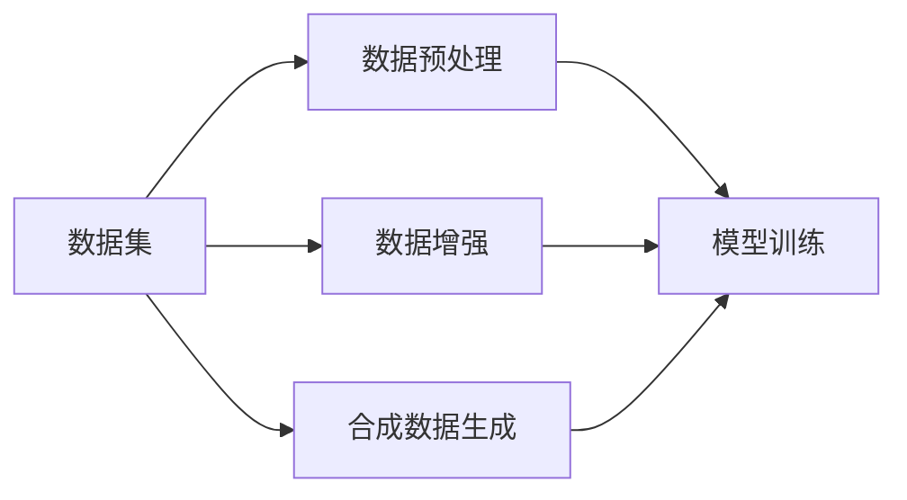

                 

## 1. 背景介绍

在AI技术的快速发展过程中，数据集的处理和生成成为了一个至关重要的问题。数据集的质量、数量和处理方式，直接影响到了模型的训练效果和应用表现。本文将深入探讨AI数据集处理的核心概念、关键算法和具体应用，帮助开发者更好地理解数据在AI项目中的作用，并掌握从数据加载到合成生成的全流程技术。

## 2. 核心概念与联系

### 2.1 核心概念概述

为更好地理解AI数据集处理，我们需要介绍几个核心概念及其相互之间的关系：

- **数据集（Dataset）**：由大量样本组成的集合，每个样本包含输入和标签。数据集是机器学习和深度学习模型的训练和评估基础。

- **数据预处理（Data Preprocessing）**：在模型训练前，对原始数据进行一系列处理，包括数据清洗、特征提取、归一化、标准化等，以便提高模型训练效果和泛化能力。

- **数据增强（Data Augmentation）**：通过对训练样本进行随机变换，生成新的训练样本，以增加数据集的多样性，防止过拟合。

- **合成数据生成（Synthetic Data Generation）**：在无法获得足够标注数据时，通过生成算法自动生成合成数据，以扩展数据集规模。

- **自动生成（Automatic Data Generation）**：利用生成模型生成高质量的数据，以自动化方式扩充数据集。

这些概念构成了AI数据集处理的框架，通过数据预处理、数据增强和自动生成技术，我们可以构建更加丰富、多样、高质量的数据集，为模型训练提供坚实的基础。

### 2.2 核心概念原理和架构的 Mermaid 流程图



## 3. 核心算法原理 & 具体操作步骤

### 3.1 算法原理概述

AI数据集处理的根本目的是通过数据预处理、增强和生成，构建适合模型训练的样本集合。这通常包括以下步骤：

1. **数据预处理**：清洗原始数据，提取有用特征，标准化数据格式，以保证数据的一致性和质量。
2. **数据增强**：通过随机变换生成新的训练样本，增加数据多样性，提升模型的泛化能力。
3. **合成数据生成**：利用生成模型自动生成合成数据，扩充数据集规模，特别是在标注数据稀缺的情况下。

这些步骤通过协同工作，为模型训练提供更加丰富、均衡、多样化的数据集。

### 3.2 算法步骤详解

#### 3.2.1 数据预处理

数据预处理通常包括以下步骤：

1. **数据清洗**：去除缺失值、异常值，处理重复数据。
2. **特征提取**：通过算法从原始数据中提取有用的特征，如文本数据的词袋模型、TF-IDF等。
3. **数据归一化**：将数据缩放到统一范围，防止某些特征值过大或过小影响模型。
4. **数据标准化**：将数据转换为标准正态分布，以加快模型收敛。

这些预处理步骤可以显著提高模型训练效果和泛化能力。

#### 3.2.2 数据增强

数据增强的常用方法包括：

1. **随机旋转、翻转**：在图像数据中，通过随机旋转和水平/垂直翻转生成新的图像样本。
2. **随机裁剪、缩放**：对图像进行随机裁剪和缩放，生成新的图像样本。
3. **颜色抖动、噪声添加**：通过颜色抖动和噪声添加，生成新的图像样本。
4. **文本噪声、词替换**：在文本数据中，通过添加噪声、替换词汇等方式生成新的文本样本。

这些方法可以增加数据多样性，提升模型对不同数据模式的适应能力。

#### 3.2.3 合成数据生成

合成数据生成的方法主要包括：

1. **生成对抗网络（GANs）**：通过训练生成器和判别器生成合成数据，如GAN、DCGAN等。
2. **变分自编码器（VAEs）**：通过训练变分自编码器生成合成数据，如VAE、β-VAE等。
3. **协同生成模型（CoGANs）**：通过协同训练多个生成器，生成高质量的合成数据。

这些方法可以自动生成高质量的合成数据，特别是在标注数据稀缺的情况下，极大地扩展了数据集的规模。

### 3.3 算法优缺点

**数据预处理**：

优点：提高数据一致性，提升模型训练效果。

缺点：需要消耗一定的时间和计算资源，特别是在大规模数据集上。

**数据增强**：

优点：增加数据多样性，提升模型泛化能力，防止过拟合。

缺点：需要谨慎选择增强策略，否则可能生成噪声数据。

**合成数据生成**：

优点：扩充数据集规模，特别是在标注数据稀缺的情况下，提升模型泛化能力。

缺点：生成的数据可能质量不一，需要仔细验证和筛选。

### 3.4 算法应用领域

AI数据集处理技术广泛应用于以下几个领域：

- **计算机视觉**：通过图像增强和合成，提升模型的视觉识别能力。
- **自然语言处理**：通过文本清洗和生成，提升模型的语言理解和生成能力。
- **推荐系统**：通过数据增强和合成，提升模型的个性化推荐能力。
- **医疗健康**：通过数据清洗和增强，提升模型的疾病诊断能力。
- **智能制造**：通过数据预处理和增强，提升模型的工业质量控制能力。

## 4. 数学模型和公式 & 详细讲解 & 举例说明

### 4.1 数学模型构建

#### 4.1.1 数据预处理的数学模型

假设原始数据集为 $\{(x_i,y_i)\}_{i=1}^N$，其中 $x_i$ 为输入，$y_i$ 为标签。数据预处理的数学模型可以表示为：

$$
x'_i = f(x_i)
$$

其中 $f$ 表示预处理函数，$x'_i$ 为预处理后的数据。

#### 4.1.2 数据增强的数学模型

数据增强的数学模型可以表示为：

$$
x''_i = g(x'_i)
$$

其中 $g$ 表示增强函数，$x''_i$ 为增强后的数据。

#### 4.1.3 合成数据生成的数学模型

合成数据生成的数学模型可以表示为：

$$
x'''_i = h(x_i)
$$

其中 $h$ 表示生成函数，$x'''_i$ 为生成后的数据。

### 4.2 公式推导过程

#### 4.2.1 数据预处理公式推导

以图像数据为例，假设原始图像为 $I \in \mathbb{R}^{m \times n \times 3}$，预处理函数 $f$ 为图像旋转和翻转。具体公式如下：

$$
I' = f(I) = \begin{cases}
R(I) & \text{if angle is 0 to 180} \\
F(I) & \text{if angle is 180 to 360}
\end{cases}
$$

其中 $R$ 表示旋转函数，$F$ 表示翻转函数。

#### 4.2.2 数据增强公式推导

以图像数据为例，假设增强函数 $g$ 为随机裁剪和缩放。具体公式如下：

$$
I'' = g(I') = \begin{cases}
C(I') & \text{if random crop} \\
S(I') & \text{if random scaling}
\end{cases}
$$

其中 $C$ 表示随机裁剪函数，$S$ 表示随机缩放函数。

#### 4.2.3 合成数据生成公式推导

以生成对抗网络（GANs）为例，假设生成器函数 $h$ 为GAN。具体公式如下：

$$
I''' = h(I) = G(Z)
$$

其中 $G$ 表示生成器函数，$Z$ 为随机噪声向量。

### 4.3 案例分析与讲解

#### 4.3.1 图像数据预处理案例

假设有一张原始图像 $I \in \mathbb{R}^{256 \times 256 \times 3}$，需要进行旋转和翻转预处理。具体步骤如下：

1. 随机生成一个旋转角度 $0 \leq \theta \leq 180^\circ$。
2. 对图像 $I$ 进行旋转，得到 $I' = R(I)$。
3. 随机生成一个翻转角度 $180^\circ \leq \phi \leq 360^\circ$。
4. 对图像 $I'$ 进行翻转，得到 $I'' = F(I')$。

#### 4.3.2 图像数据增强案例

假设有一张原始图像 $I \in \mathbb{R}^{256 \times 256 \times 3}$，需要进行随机裁剪和缩放增强。具体步骤如下：

1. 随机生成一个裁剪比例 $0.8 \leq p \leq 1.2$。
2. 对图像 $I$ 进行随机裁剪，得到 $I' = C(I)$。
3. 随机生成一个缩放比例 $0.8 \leq s \leq 1.2$。
4. 对图像 $I'$ 进行随机缩放，得到 $I'' = S(I')$。

#### 4.3.3 合成数据生成案例

假设有一张原始图像 $I \in \mathbb{R}^{256 \times 256 \times 3}$，需要进行GAN生成。具体步骤如下：

1. 生成一个随机噪声向量 $Z \in \mathbb{R}^{100}$。
2. 使用生成器函数 $G$，将噪声向量 $Z$ 映射为图像 $I''' = G(Z)$。

## 5. 项目实践：代码实例和详细解释说明

### 5.1 开发环境搭建

在进行数据集处理实践前，我们需要准备好开发环境。以下是使用Python进行TensorFlow开发的环境配置流程：

1. 安装Anaconda：从官网下载并安装Anaconda，用于创建独立的Python环境。

2. 创建并激活虚拟环境：
```bash
conda create -n tf-env python=3.8 
conda activate tf-env
```

3. 安装TensorFlow：根据CUDA版本，从官网获取对应的安装命令。例如：
```bash
conda install tensorflow -c pytorch -c conda-forge
```

4. 安装各类工具包：
```bash
pip install numpy pandas scikit-learn matplotlib tqdm jupyter notebook ipython
```

完成上述步骤后，即可在`tf-env`环境中开始数据集处理实践。

### 5.2 源代码详细实现

下面我们以图像数据增强为例，给出使用TensorFlow进行数据增强的PyTorch代码实现。

首先，定义图像数据增强函数：

```python
import tensorflow as tf
import numpy as np

def augment_images(images):
    for i in range(len(images)):
        image = images[i]
        rotated = tf.image.rot90(image)
        flipped = tf.image.flip_left_right(image)
        scaled = tf.image.random_resized_crop(image, size=[256, 256], area=[0.8, 1.2], method='tf_bilinear')
        augmented_images = np.append(rotated.numpy(), flipped.numpy(), scaled.numpy(), axis=0)
        images[i] = augmented_images
    return images
```

然后，定义数据增强后的数据集：

```python
from tensorflow.keras.preprocessing.image import ImageDataGenerator

data_generator = ImageDataGenerator(
    rotation_range=180,
    horizontal_flip=True,
    vertical_flip=True,
    zoom_range=[0.8, 1.2],
    rescale=1. / 255
)

# 假设原始数据集为train_images
augmented_images = []
for image in train_images:
    augmented = data_generator.flow(image, batch_size=1)
    for batch in augmented:
        augmented_images.append(batch)
```

最后，训练模型并使用增强后的数据集：

```python
from tensorflow.keras.models import Sequential
from tensorflow.keras.layers import Dense, Flatten, Conv2D, MaxPooling2D

model = Sequential([
    Conv2D(32, (3, 3), activation='relu', input_shape=(256, 256, 3)),
    MaxPooling2D((2, 2)),
    Flatten(),
    Dense(64, activation='relu'),
    Dense(10, activation='softmax')
])

model.compile(optimizer='adam', loss='categorical_crossentropy', metrics=['accuracy'])

# 假设训练数据为train_images，标签为train_labels
model.fit(train_images, train_labels, epochs=10, batch_size=32)

# 使用增强后的数据集进行模型训练
model.fit(augmented_images, train_labels, epochs=10, batch_size=32)
```

### 5.3 代码解读与分析

让我们再详细解读一下关键代码的实现细节：

**augment_images函数**：
- 定义了图像数据增强的函数，通过旋转、翻转、缩放等方式，生成新的增强图像。
- 使用TensorFlow的ImageDataGenerator生成器，随机生成增强图像。

**ImageDataGenerator**：
- 定义了图像增强的参数，包括旋转角度、翻转、缩放等。
- 使用生成器生成增强后的图像数据。

**model.fit函数**：
- 使用训练数据和标签，训练模型。
- 使用增强后的数据集进行模型训练，以提升模型的泛化能力。

可以看到，TensorFlow提供了一个简洁易用的API，帮助开发者实现图像数据增强功能。开发者可以将更多的精力放在模型设计和算法改进上，而不必过多关注底层的实现细节。

当然，工业级的系统实现还需考虑更多因素，如模型的保存和部署、超参数的自动搜索、更灵活的数据增强策略等。但核心的数据增强范式基本与此类似。

## 6. 实际应用场景

### 6.1 图像识别

图像识别是AI数据集处理的重要应用场景之一。通过数据增强和合成，可以显著提升图像识别模型的泛化能力。

在实际应用中，可以使用数据增强技术对图像进行随机变换，如旋转、翻转、缩放、裁剪等，生成更多的训练样本。同时，可以使用GAN等生成模型生成合成图像，扩充数据集规模。对于标注数据稀缺的问题，GAN生成可以自动生成高质量的合成图像，进一步提升模型的泛化能力。

### 6.2 自然语言处理

自然语言处理（NLP）也是AI数据集处理的重要应用场景之一。通过数据预处理和增强，可以显著提升模型的语言理解能力和生成能力。

在实际应用中，可以对文本数据进行清洗、分词、归一化等预处理操作，以提高数据一致性和质量。同时，可以使用数据增强技术，如文本噪声、词替换等，生成更多的训练样本。对于标注数据稀缺的问题，可以使用合成数据生成技术，自动生成高质量的合成文本数据，进一步提升模型的泛化能力。

### 6.3 推荐系统

推荐系统是AI数据集处理的另一个重要应用场景。通过数据增强和合成，可以显著提升推荐模型的个性化推荐能力。

在实际应用中，可以使用数据增强技术，如生成假用户行为数据、生成假物品特征等，增加数据集的多样性。同时，可以使用生成模型，如GAN、VAE等，自动生成高质量的合成数据。对于标注数据稀缺的问题，生成模型可以自动生成高质量的合成数据，进一步提升模型的个性化推荐能力。

## 7. 工具和资源推荐

### 7.1 学习资源推荐

为了帮助开发者系统掌握AI数据集处理的核心技术，这里推荐一些优质的学习资源：

1. 《Python深度学习》：由TensorFlow官方提供，涵盖了深度学习核心技术，包括数据集处理、模型训练、优化等。

2. 《深度学习入门》：由《机器学习实战》作者编写，适合初学者入门，涵盖了数据预处理、数据增强、模型训练等基础技术。

3. 《TensorFlow实战》：由Google TensorFlow团队编写，涵盖了TensorFlow核心技术和应用，包括数据集处理、模型训练、优化等。

4. 《深度学习与TensorFlow》：由TensorFlow官方提供，涵盖了深度学习核心技术，包括数据集处理、模型训练、优化等。

5. 《Kaggle官方教程》：Kaggle官方提供的数据集处理教程，涵盖数据清洗、特征工程、模型训练等技术。

通过对这些资源的学习实践，相信你一定能够快速掌握AI数据集处理的精髓，并用于解决实际的AI问题。

### 7.2 开发工具推荐

高效的开发离不开优秀的工具支持。以下是几款用于AI数据集处理开发的常用工具：

1. TensorFlow：由Google主导开发的开源深度学习框架，支持大规模工程应用，适合构建复杂的AI系统。

2. PyTorch：由Facebook主导开发的开源深度学习框架，灵活动态的计算图，适合快速迭代研究。

3. OpenCV：开源计算机视觉库，提供了丰富的图像处理和增强功能。

4. scikit-learn：开源机器学习库，提供了丰富的数据预处理和特征工程功能。

5. FastAPI：基于PyTorch和TensorFlow的Web框架，适合快速搭建API接口。

6. Jupyter Notebook：开源的交互式编程环境，适合数据探索和实验。

合理利用这些工具，可以显著提升AI数据集处理的开发效率，加快创新迭代的步伐。

### 7.3 相关论文推荐

AI数据集处理技术的发展源于学界的持续研究。以下是几篇奠基性的相关论文，推荐阅读：

1. ImageNet Large Scale Visual Recognition Challenge（ImageNet挑战）：提出大规模图像识别任务，推动了图像数据增强技术的发展。

2. Augmented Reality Using Machine Learning（基于机器学习的增强现实）：提出数据增强技术在增强现实领域的应用，推动了数据增强技术的发展。

3. Generative Adversarial Nets（生成对抗网络）：提出GAN模型，推动了合成数据生成技术的发展。

4. Semantic Image Segmentation with Deep Convolutional Nets, Atrous Convolution, and Fully Connected CRFs（深度卷积网络、空洞卷积和全连接CRF语义分割）：提出空洞卷积网络，推动了数据增强技术的发展。

5. Synthetic Images from Real Images Using Deep Generative Models（使用深度生成模型从真实图像生成合成图像）：提出GAN模型，推动了合成数据生成技术的发展。

这些论文代表了大数据集处理技术的发展脉络。通过学习这些前沿成果，可以帮助研究者把握学科前进方向，激发更多的创新灵感。

## 8. 总结：未来发展趋势与挑战

### 8.1 总结

本文对AI数据集处理的核心概念、关键算法和具体应用进行了全面系统的介绍。首先阐述了数据预处理、数据增强和合成数据生成的基本原理，明确了数据在AI项目中的重要性。其次，从原理到实践，详细讲解了AI数据集处理的数学模型和操作步骤，给出了数据集处理任务的完整代码实例。同时，本文还广泛探讨了AI数据集处理技术在图像识别、自然语言处理、推荐系统等多个领域的应用前景，展示了数据处理范式的巨大潜力。此外，本文精选了数据集处理技术的各类学习资源，力求为读者提供全方位的技术指引。

通过本文的系统梳理，可以看到，AI数据集处理技术在大规模模型训练、数据稀缺场景下的泛化能力提升等方面发挥了重要作用。通过数据预处理、增强和生成，为模型训练提供更加丰富、均衡、多样化的数据集，极大地提升了模型训练效果和应用表现。未来，伴随预训练模型和数据集处理技术的持续演进，相信AI技术将在更广阔的应用领域大放异彩。

### 8.2 未来发展趋势

展望未来，AI数据集处理技术将呈现以下几个发展趋势：

1. **自动化数据处理**：利用自动化工具和算法，实现数据集处理的自动化，减少人工干预。例如，使用自动化数据清洗工具、自动化数据增强算法等，提高数据处理效率。

2. **自适应数据处理**：根据数据集的特点和模型的需求，自适应地调整数据处理策略。例如，根据数据集的多样性，动态调整数据增强的策略，提升数据处理的效果。

3. **跨模态数据处理**：将不同模态的数据进行融合，如将图像、文本、语音等数据进行联合处理，提升数据处理的综合效果。

4. **合成数据生成的多样化**：除了GAN、VAE等生成模型，未来将涌现更多高质量的合成数据生成技术，如变分自编码器、协同生成模型等，进一步提升合成数据的质量和多样性。

5. **数据处理的分布式化**：利用分布式计算框架，如Apache Spark、Dask等，实现大规模数据处理的分布式化，提升数据处理的速度和效率。

这些趋势凸显了AI数据集处理技术的广阔前景。这些方向的探索发展，必将进一步提升AI系统的性能和应用范围，为人类认知智能的进化带来深远影响。

### 8.3 面临的挑战

尽管AI数据集处理技术已经取得了瞩目成就，但在迈向更加智能化、普适化应用的过程中，它仍面临着诸多挑战：

1. **数据质量控制**：数据集处理的效果很大程度上取决于原始数据的质量。如何高效、准确地清洗、处理原始数据，以确保数据集的质量，仍然是一个重要的挑战。

2. **数据增强的有效性**：数据增强策略的选择和参数设置，直接影响到数据增强的效果。如何在不同任务和数据集上，选择最有效的数据增强策略，仍然是一个重要的研究方向。

3. **合成数据的质量和多样性**：合成数据生成的质量和多样性，直接影响到模型的泛化能力。如何生成高质量、多样化的合成数据，提升模型的泛化能力，仍然是一个重要的研究方向。

4. **计算资源消耗**：数据预处理、增强和生成等步骤，需要消耗大量的计算资源。如何在保持数据处理效果的同时，降低计算资源消耗，仍然是一个重要的研究方向。

5. **模型的适应性**：不同的数据集和任务，对数据集处理的适应性不同。如何在不同的任务和数据集上，灵活调整数据处理策略，提升模型的适应性，仍然是一个重要的研究方向。

6. **隐私和安全**：数据集处理过程中，如何保护用户隐私和数据安全，仍然是一个重要的研究方向。

这些挑战需要学界和产业界共同努力，积极应对并寻求突破，才能使AI数据集处理技术迈向更高的台阶。

### 8.4 研究展望

面向未来，AI数据集处理技术需要在以下几个方面寻求新的突破：

1. **自动化数据处理工具**：开发自动化数据处理工具和算法，实现数据集处理的自动化，减少人工干预。例如，开发自动化数据清洗工具、自动化数据增强算法等，提高数据处理效率。

2. **自适应数据处理策略**：研究自适应数据处理策略，根据数据集的特点和模型的需求，自适应地调整数据处理策略。例如，根据数据集的多样性，动态调整数据增强的策略，提升数据处理的效果。

3. **跨模态数据处理技术**：研究跨模态数据处理技术，将不同模态的数据进行联合处理，提升数据处理的综合效果。例如，将图像、文本、语音等数据进行联合处理，提升数据处理的综合效果。

4. **合成数据生成的多样化**：研究更多高质量的合成数据生成技术，如变分自编码器、协同生成模型等，进一步提升合成数据的质量和多样性。

5. **数据处理的分布式化**：研究分布式数据处理技术，利用分布式计算框架，实现大规模数据处理的分布式化，提升数据处理的速度和效率。例如，利用Apache Spark、Dask等分布式计算框架，实现大规模数据处理的分布式化。

这些研究方向将进一步提升AI系统的性能和应用范围，为人类认知智能的进化带来深远影响。面向未来，AI数据集处理技术还需要与其他AI技术进行更深入的融合，如知识表示、因果推理、强化学习等，多路径协同发力，共同推动AI技术的进步。只有勇于创新、敢于突破，才能不断拓展AI数据集处理的边界，让AI技术更好地造福人类社会。

## 9. 附录：常见问题与解答

**Q1：数据集处理的流程包括哪些步骤？**

A: 数据集处理的流程通常包括以下步骤：

1. **数据收集**：收集原始数据，包括文本、图像、视频等。
2. **数据清洗**：去除缺失值、异常值，处理重复数据。
3. **特征提取**：通过算法从原始数据中提取有用的特征，如文本数据的词袋模型、TF-IDF等。
4. **数据归一化**：将数据缩放到统一范围，防止某些特征值过大或过小影响模型。
5. **数据标准化**：将数据转换为标准正态分布，以加快模型收敛。
6. **数据增强**：通过随机变换生成新的训练样本，增加数据多样性，提升模型的泛化能力。
7. **合成数据生成**：利用生成模型自动生成合成数据，扩充数据集规模，特别是在标注数据稀缺的情况下。

这些步骤通过协同工作，为模型训练提供更加丰富、均衡、多样化的数据集。

**Q2：数据增强的方法有哪些？**

A: 数据增强的方法主要包括：

1. **随机旋转、翻转**：在图像数据中，通过随机旋转和水平/垂直翻转生成新的图像样本。
2. **随机裁剪、缩放**：对图像进行随机裁剪和缩放，生成新的图像样本。
3. **颜色抖动、噪声添加**：通过颜色抖动和噪声添加，生成新的图像样本。
4. **文本噪声、词替换**：在文本数据中，通过添加噪声、替换词汇等方式生成新的文本样本。

这些方法可以增加数据多样性，提升模型对不同数据模式的适应能力。

**Q3：合成数据生成的常见方法有哪些？**

A: 合成数据生成的常见方法主要包括：

1. **生成对抗网络（GANs）**：通过训练生成器和判别器生成合成数据，如GAN、DCGAN等。
2. **变分自编码器（VAEs）**：通过训练变分自编码器生成合成数据，如VAE、β-VAE等。
3. **协同生成模型（CoGANs）**：通过协同训练多个生成器，生成高质量的合成数据。

这些方法可以自动生成高质量的合成数据，特别是在标注数据稀缺的情况下，极大地扩展了数据集的规模。

**Q4：数据预处理对模型训练有什么影响？**

A: 数据预处理对模型训练有以下影响：

1. **提高数据一致性**：数据预处理可以提高数据一致性，使得不同样本之间的特征具有可比性，有利于模型的训练和泛化。
2. **提升模型训练效果**：通过数据归一化、标准化等操作，可以提升模型的训练效果，加快模型收敛。
3. **减少过拟合风险**：数据预处理可以减少过拟合风险，特别是在数据量较小的情况下，预处理可以提高模型的泛化能力。

因此，数据预处理是模型训练中不可或缺的一部分，可以提高模型的性能和泛化能力。

**Q5：数据增强的目的是什么？**

A: 数据增强的目的是通过随机变换生成新的训练样本，增加数据集的多样性，提升模型的泛化能力，防止过拟合。

数据增强可以模拟真实世界中的数据变化，使得模型在面对实际数据时，能够更好地适应不同的数据模式。特别是当标注数据稀缺时，数据增强可以显著提升模型的泛化能力，帮助模型更好地适应实际应用场景。

**Q6：合成数据生成的目的是什么？**

A: 合成数据生成的目的是在标注数据稀缺的情况下，通过生成算法自动生成高质量的合成数据，以扩展数据集规模。

合成数据生成可以帮助模型在更广泛的数据集上进行训练，提升模型的泛化能力和鲁棒性。特别是在标注数据稀缺的任务中，合成数据生成可以极大地扩展数据集规模，提升模型的性能。

---

作者：禅与计算机程序设计艺术 / Zen and the Art of Computer Programming

