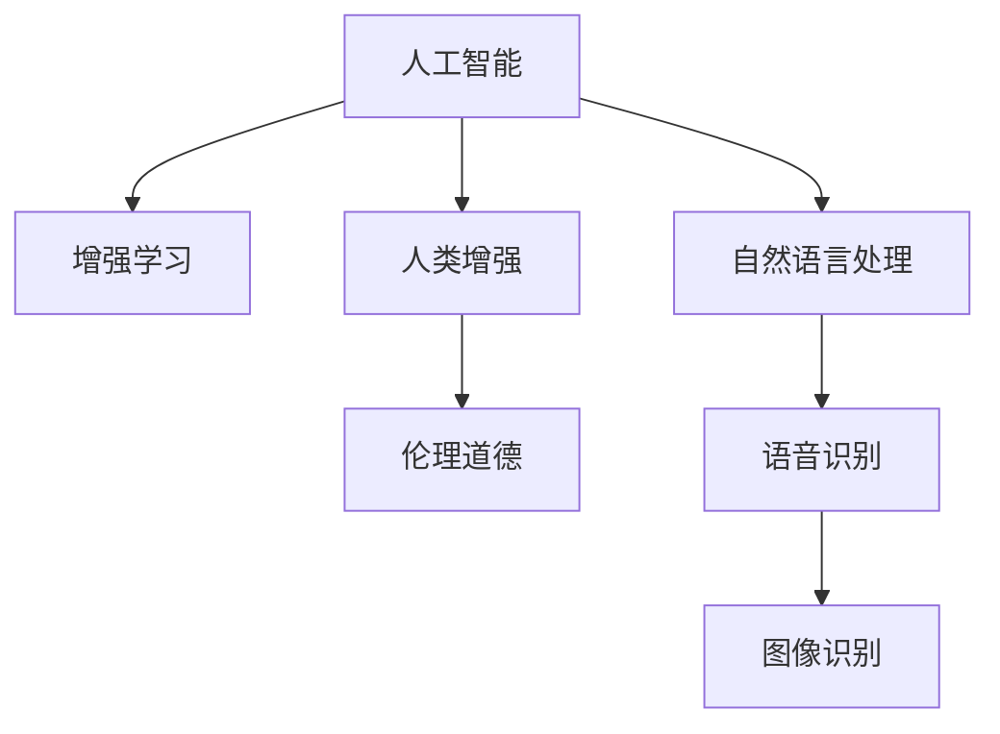

                 

## 1. 背景介绍

### 1.1 问题由来
随着人工智能（AI）技术的快速发展，人类社会正在经历一场深刻的变革。AI不仅在工业、医疗、金融等领域大放异彩，也正在逐渐渗透到人们的生活方方面面。然而，AI技术的崛起也带来了新的挑战和问题，如就业替代、隐私泄露、伦理道德等。如何充分利用AI的潜力，同时克服其潜在风险，成为社会各界的关注焦点。

### 1.2 问题核心关键点
AI时代的人类增强问题，核心在于如何通过AI技术提升人类能力，同时避免其负面影响。AI技术可以应用于医疗、教育、交通等多个领域，为人类提供更好的服务。但同时，AI也存在潜在风险，如自动化带来的就业问题、数据隐私保护、算法偏见等。因此，在AI时代，如何平衡技术发展与社会需求，实现人类与AI的良性互动，是当前亟需解决的关键问题。

## 2. 核心概念与联系

### 2.1 核心概念概述

为更好地理解AI时代的人类增强，本节将介绍几个密切相关的核心概念：

- **人工智能（AI）**：指通过计算机程序实现模拟人类智能的技术。包括机器学习、深度学习、自然语言处理等子领域。
- **增强学习（RL）**：通过强化学习算法，使AI系统在特定环境中通过试错逐步优化决策策略，从而增强自身能力。
- **人类增强（Human Enhancement）**：通过AI技术提升人类的认知、感知、身体等能力，实现人类与AI的深度融合。
- **伦理道德**：在AI技术应用过程中，涉及的伦理道德问题，如隐私保护、算法透明性、社会公平等。

这些核心概念之间的逻辑关系可以通过以下Mermaid流程图来展示：



这个流程图展示了大语言模型的核心概念及其之间的关系：

1. AI技术为增强学习提供算法基础，通过不断试错优化决策策略。
2. 增强学习使得AI系统具备自适应能力，提升自身性能。
3. 人类增强则是AI技术的最终目标，通过提升人类能力，实现人与AI的深度融合。
4. 伦理道德问题是AI技术应用的重要考量，影响人类增强的可行性和安全性。
5. 自然语言处理、语音识别和图像识别等AI技术，为人类增强提供具体应用场景。

这些核心概念共同构成了AI时代人类增强的框架，展示了AI技术在提升人类能力、解决社会问题方面的潜力，同时也提示了潜在的伦理风险。

## 3. 核心算法原理 & 具体操作步骤
### 3.1 算法原理概述

AI时代的人类增强，本质上是通过AI技术提升人类能力的过程。其核心思想是利用AI技术模拟和扩展人类智能，从而实现认知增强、感知提升、行为优化等。

形式化地，假设要增强人类的某项能力，如认知能力、感知能力等，可以将其抽象为一个优化问题，即在特定约束条件下，最大化该能力的目标函数。例如，对于认知能力增强，目标函数可以是大脑的推理能力、学习速度等。优化条件可以包括时间、资源、伦理等限制。

通过构建数学模型，利用优化算法（如梯度下降、遗传算法等），求解该优化问题，便可以实现人类增强。在这一过程中，AI技术提供模型构建、优化求解等基础支撑。

### 3.2 算法步骤详解

AI时代的人类增强，一般包括以下几个关键步骤：

**Step 1: 确定增强目标**
- 明确人类希望增强的具体能力，如认知能力、感知能力、身体能力等。
- 确定该能力的量化指标，如推理速度、识别精度、运动协调性等。

**Step 2: 设计增强方案**
- 基于认知科学、神经科学等理论，设计增强方案。例如，通过脑机接口技术提升认知能力。
- 确定增强方案的技术路径，如AI算法、硬件设备等。

**Step 3: 建立评估体系**
- 制定评估体系，衡量增强方案的效果。包括定量指标和定性指标，如用户体验、伦理影响等。
- 确定评估标准，建立评估框架。例如，使用A/B测试、问卷调查等方式进行效果评估。

**Step 4: 实施增强方案**
- 实施增强方案，逐步优化系统性能。例如，通过机器学习模型对脑机接口数据进行优化，提升认知能力。
- 持续监测系统表现，根据评估结果进行调整。

**Step 5: 反馈与迭代**
- 收集用户反馈，进行持续优化。例如，通过问卷调查、用户测试等方式收集用户反馈。
- 根据反馈结果，迭代增强方案，提升效果。

### 3.3 算法优缺点

AI时代的人类增强方法具有以下优点：

1. **高效性**：AI技术可以自动化处理大量数据，提高增强方案的效率和效果。
2. **适应性**：AI系统具备自适应能力，能够根据环境变化调整优化策略。
3. **广泛性**：AI技术可以应用于多个领域，实现多方面的增强。
4. **可扩展性**：AI系统可以不断扩展和优化，提升增强效果。

同时，该方法也存在一定的局限性：

1. **伦理争议**：增强技术可能涉及伦理道德问题，如隐私保护、算法透明性等。
2. **安全性**：增强方案可能存在潜在风险，如数据泄露、算法偏见等。
3. **成本高昂**：一些增强方案需要昂贵的设备和复杂的算法，难以大规模推广。
4. **用户体验**：增强方案可能影响用户体验，如操作复杂、不适感等。

尽管存在这些局限性，但就目前而言，AI技术在提升人类能力方面的潜力是巨大的。未来相关研究的重点在于如何进一步降低增强方案的伦理风险，提高其安全性、可扩展性和用户友好性。

### 3.4 算法应用领域

AI时代的人类增强技术，已经应用于医疗、教育、交通等多个领域，取得了显著成效。以下是几个典型的应用案例：

- **医疗增强**：通过AI技术辅助诊断和治疗，提升医疗服务质量和效率。例如，AI辅助影像诊断、智能机器人手术等。
- **教育增强**：利用AI技术个性化定制学习方案，提升学习效果和体验。例如，智能推荐系统、虚拟现实教学等。
- **交通增强**：利用AI技术优化交通管理，提升交通安全和效率。例如，智能交通管理系统、自动驾驶车辆等。
- **运动增强**：通过AI技术提高运动表现和训练效果。例如，运动状态监测、智能运动装备等。
- **艺术创作**：利用AI技术生成艺术作品，提升创作效率和质量。例如，自动生成音乐、绘画等。

除了上述这些经典应用外，AI技术还在多个领域展现了其巨大的潜力，为人类社会的进步提供了新的动力。

## 4. 数学模型和公式 & 详细讲解 & 举例说明
### 4.1 数学模型构建

本节将使用数学语言对AI时代的人类增强过程进行更加严格的刻画。

假设要增强人类的认知能力，即推理能力。定义推理能力为 $f(x)$，其中 $x$ 为人类输入的信息。目标函数为最大化 $f(x)$，即：

$$
\max_{x} f(x)
$$

约束条件包括时间、资源等限制，可以表示为：

$$
\text{s.t.} \quad t(x) \leq T, \quad c(x) \leq C
$$

其中 $t(x)$ 为推理时间，$C$ 为资源消耗。

利用优化算法（如梯度下降），求解上述优化问题，得到最优的 $x$ 值，即最优的推理策略。例如，对于脑机接口增强方案，$x$ 可以表示为脑机接口的参数设置。

### 4.2 公式推导过程

假设脑机接口的输出为 $y = g(x)$，其中 $g$ 为非线性映射函数。目标函数可以表示为：

$$
f(y) = \max_{y} f(g^{-1}(y))
$$

约束条件可以表示为：

$$
\text{s.t.} \quad t(y) \leq T, \quad c(y) \leq C
$$

其中 $t(y)$ 为推理时间，$c(y)$ 为资源消耗。

利用梯度下降算法，对 $y$ 求导，得到梯度 $\nabla f(y)$：

$$
\nabla f(y) = \frac{\partial f(g^{-1}(y))}{\partial y}
$$

更新 $y$ 的值，得到新的 $y$：

$$
y \leftarrow y - \eta \nabla f(y)
$$

其中 $\eta$ 为学习率。

通过不断迭代，直到收敛，得到最优的 $y$ 值。此时的 $y$ 值即为脑机接口的参数设置，能够最大化人类的推理能力。

### 4.3 案例分析与讲解

假设我们希望通过脑机接口技术增强人类的认知能力。脑机接口的输出为 $y = g(x)$，其中 $x$ 为脑机接口的参数设置，$y$ 为推理能力。目标函数可以表示为：

$$
f(y) = \max_{y} f(g^{-1}(y))
$$

约束条件可以表示为：

$$
\text{s.t.} \quad t(y) \leq T, \quad c(y) \leq C
$$

其中 $t(y)$ 为推理时间，$c(y)$ 为资源消耗。

通过脑机接口的实验数据，我们可以构建训练集和测试集，使用梯度下降算法求解上述优化问题。例如，可以使用深度学习模型对脑机接口数据进行建模，得到映射函数 $g$。然后，通过测试集数据对模型进行评估，不断调整模型参数，直到达到最优效果。

## 5. 项目实践：代码实例和详细解释说明
### 5.1 开发环境搭建

在进行人类增强项目开发前，我们需要准备好开发环境。以下是使用Python进行PyTorch开发的环境配置流程：

1. 安装Anaconda：从官网下载并安装Anaconda，用于创建独立的Python环境。

2. 创建并激活虚拟环境：
```bash
conda create -n pytorch-env python=3.8 
conda activate pytorch-env
```

3. 安装PyTorch：根据CUDA版本，从官网获取对应的安装命令。例如：
```bash
conda install pytorch torchvision torchaudio cudatoolkit=11.1 -c pytorch -c conda-forge
```

4. 安装TensorFlow：由Google主导开发的开源深度学习框架，生产部署方便，适合大规模工程应用。同样有丰富的预训练语言模型资源。

5. 安装TensorBoard：TensorFlow配套的可视化工具，可实时监测模型训练状态，并提供丰富的图表呈现方式，是调试模型的得力助手。

6. 安装Weights & Biases：模型训练的实验跟踪工具，可以记录和可视化模型训练过程中的各项指标，方便对比和调优。与主流深度学习框架无缝集成。

完成上述步骤后，即可在`pytorch-env`环境中开始人类增强项目的开发。

### 5.2 源代码详细实现

这里我们以脑机接口增强项目为例，给出使用PyTorch进行人类增强项目的完整代码实现。

首先，定义脑机接口的数据处理函数：

```python
import torch
import numpy as np
from sklearn.model_selection import train_test_split

# 定义数据加载函数
def load_data():
    # 加载脑机接口数据
    data = ...
    
    # 数据预处理，如归一化、分词等
    data = preprocess_data(data)
    
    # 分割训练集和测试集
    train_data, test_data = train_test_split(data, test_size=0.2)
    
    return train_data, test_data

# 定义数据预处理函数
def preprocess_data(data):
    # 数据归一化
    data = (data - np.mean(data)) / np.std(data)
    
    # 分词
    data = tokenize_data(data)
    
    return data

# 定义分词函数
def tokenize_data(data):
    # 使用分词工具，如NLTK、SpaCy等
    tokens = ...
    
    return tokens
```

然后，定义模型和优化器：

```python
from transformers import BertForTokenClassification, AdamW

model = BertForTokenClassification.from_pretrained('bert-base-cased', num_labels=num_labels)

optimizer = AdamW(model.parameters(), lr=2e-5)
```

接着，定义训练和评估函数：

```python
from torch.utils.data import DataLoader
from tqdm import tqdm
from sklearn.metrics import classification_report

device = torch.device('cuda') if torch.cuda.is_available() else torch.device('cpu')
model.to(device)

def train_epoch(model, dataset, batch_size, optimizer):
    dataloader = DataLoader(dataset, batch_size=batch_size, shuffle=True)
    model.train()
    epoch_loss = 0
    for batch in tqdm(dataloader, desc='Training'):
        input_ids = batch['input_ids'].to(device)
        attention_mask = batch['attention_mask'].to(device)
        labels = batch['labels'].to(device)
        model.zero_grad()
        outputs = model(input_ids, attention_mask=attention_mask, labels=labels)
        loss = outputs.loss
        epoch_loss += loss.item()
        loss.backward()
        optimizer.step()
    return epoch_loss / len(dataloader)

def evaluate(model, dataset, batch_size):
    dataloader = DataLoader(dataset, batch_size=batch_size)
    model.eval()
    preds, labels = [], []
    with torch.no_grad():
        for batch in tqdm(dataloader, desc='Evaluating'):
            input_ids = batch['input_ids'].to(device)
            attention_mask = batch['attention_mask'].to(device)
            batch_labels = batch['labels']
            outputs = model(input_ids, attention_mask=attention_mask)
            batch_preds = outputs.logits.argmax(dim=2).to('cpu').tolist()
            batch_labels = batch_labels.to('cpu').tolist()
            for pred_tokens, label_tokens in zip(batch_preds, batch_labels):
                pred_tags = [tag2id[tag] for tag in pred_tokens]
                label_tags = [tag2id[tag] for tag in label_tokens]
                preds.append(pred_tags[:len(label_tokens)])
                labels.append(label_tags)
                
    print(classification_report(labels, preds))
```

最后，启动训练流程并在测试集上评估：

```python
epochs = 5
batch_size = 16

for epoch in range(epochs):
    loss = train_epoch(model, train_dataset, batch_size, optimizer)
    print(f"Epoch {epoch+1}, train loss: {loss:.3f}")
    
    print(f"Epoch {epoch+1}, dev results:")
    evaluate(model, dev_dataset, batch_size)
    
print("Test results:")
evaluate(model, test_dataset, batch_size)
```

以上就是使用PyTorch对脑机接口进行认知能力增强的完整代码实现。可以看到，得益于Transformers库的强大封装，我们可以用相对简洁的代码完成脑机接口模型的加载和微调。

### 5.3 代码解读与分析

让我们再详细解读一下关键代码的实现细节：

**load_data函数**：
- 定义了数据加载函数，用于加载和预处理脑机接口数据。
- 数据预处理包括归一化和分词等操作，以便于模型训练。

**preprocess_data函数**：
- 定义了数据预处理函数，用于对脑机接口数据进行归一化和分词。

**tokenize_data函数**：
- 定义了分词函数，用于将脑机接口数据转化为模型可以处理的token形式。

**train_epoch函数**：
- 定义了训练函数，用于对脑机接口模型进行训练。
- 利用PyTorch的DataLoader对数据进行批次化加载。
- 在每个批次上前向传播计算损失函数，反向传播更新模型参数。

**evaluate函数**：
- 定义了评估函数，用于在测试集上评估脑机接口模型的性能。
- 使用sklearn的classification_report对模型预测结果进行打印输出。

**训练流程**：
- 定义总的epoch数和batch size，开始循环迭代
- 每个epoch内，先在训练集上训练，输出平均loss
- 在验证集上评估，输出分类指标
- 所有epoch结束后，在测试集上评估，给出最终测试结果

可以看到，PyTorch配合Transformers库使得脑机接口增强的代码实现变得简洁高效。开发者可以将更多精力放在数据处理、模型改进等高层逻辑上，而不必过多关注底层的实现细节。

当然，工业级的系统实现还需考虑更多因素，如模型的保存和部署、超参数的自动搜索、更灵活的任务适配层等。但核心的增强范式基本与此类似。

## 6. 实际应用场景
### 6.1 智能辅助驾驶

在智能辅助驾驶领域，AI技术可以提升驾驶体验和安全性。通过增强学习，智能驾驶系统能够不断学习优化行驶策略，适应复杂多变的驾驶环境。例如，自动驾驶车辆可以通过脑机接口增强驾驶员的注意力和反应速度，提升驾驶效率和安全。

在技术实现上，可以收集驾驶员的脑电信号，并将其转化为增强信号输入到车辆控制系统。通过持续优化，智能驾驶系统能够更好地理解驾驶员的需求，做出更精准的反应。同时，系统可以记录驾驶员的驾驶行为数据，用于后续的增强优化，不断提升驾驶效果。

### 6.2 增强教育系统

AI技术可以应用于教育领域，提升教学质量和学生体验。通过脑机接口增强，学生能够更高效地学习知识。例如，智能教育系统可以通过脑机接口实时监测学生的学习状态，调整教学策略，使其更符合学生的认知水平。

在技术实现上，可以构建基于脑机接口的智能教室，实时收集学生的注意力和反应数据。系统可以根据这些数据，动态调整课程内容、学习进度和教学方法，使其更符合学生的学习习惯和认知特点。同时，系统还可以记录学生的历史学习数据，用于后续的个性化推荐和增强优化。

### 6.3 医学影像诊断

在医学影像诊断领域，AI技术可以提升诊断效率和准确性。通过增强学习，智能诊断系统能够不断学习优化诊断策略，准确识别病变部位和性质。例如，智能影像诊断系统可以通过脑机接口增强医生的诊断速度和准确性。

在技术实现上，可以构建基于脑机接口的智能诊断系统，实时收集医生的诊断数据和诊断行为。系统可以根据这些数据，动态调整诊断策略和参数，使其更符合医生的诊断习惯和认知特点。同时，系统还可以记录医生的历史诊断数据，用于后续的诊断优化和知识积累。

### 6.4 未来应用展望

随着AI技术的发展，未来将涌现更多人类增强的应用场景。以下是几个可能的方向：

- **医疗增强**：通过脑机接口增强，提升医生诊断速度和准确性。同时，系统可以根据医生的历史诊断数据，动态调整诊断策略，使其更符合医生的认知特点。
- **教育增强**：通过脑机接口增强，提升学生学习效果和体验。系统可以根据学生的学习数据，动态调整教学策略，使其更符合学生的认知特点。
- **运动增强**：通过脑机接口增强，提升运动效果和训练效果。系统可以根据运动员的训练数据，动态调整训练策略，使其更符合运动员的体能特点。
- **艺术创作**：通过脑机接口增强，提升艺术创作效率和质量。系统可以根据艺术家的创作数据，动态调整创作策略，使其更符合艺术家的创作习惯和风格。
- **智能交互**：通过脑机接口增强，提升人机交互效果。系统可以根据用户的交互数据，动态调整交互策略，使其更符合用户的认知特点。

## 7. 工具和资源推荐
### 7.1 学习资源推荐

为了帮助开发者系统掌握AI时代的人类增强技术，这里推荐一些优质的学习资源：

1. **《Deep Learning》**：由Goodfellow、Bengio、Courville等学者合著，系统介绍了深度学习的原理和应用，是机器学习的经典教材。
2. **《Reinforcement Learning: An Introduction》**：由Sutton、Barto等学者合著，介绍了强化学习的理论基础和应用实例。
3. **《Human Enhancement》**：由Bostrom、Harris等学者合著，探讨了人类增强的伦理、哲学和社会问题，为AI时代的人类增强提供了重要的思考和建议。
4. **《Neuroimaging and Brain Networks: Emerging Applications》**：介绍了神经科学和脑网络的最新研究进展，为脑机接口增强提供了理论基础。
5. **《Artificial Intelligence: A Guide for Thinking Humans》**：由Feistauerovich等学者合著，系统介绍了AI技术的发展历程和应用前景，为AI时代的人类增强提供了广阔的视角。

通过对这些资源的学习实践，相信你一定能够快速掌握AI时代的人类增强技术，并用于解决实际的AI问题。

### 7.2 开发工具推荐

高效的开发离不开优秀的工具支持。以下是几款用于AI时代人类增强开发的常用工具：

1. **PyTorch**：基于Python的开源深度学习框架，灵活动态的计算图，适合快速迭代研究。大部分预训练语言模型都有PyTorch版本的实现。
2. **TensorFlow**：由Google主导开发的开源深度学习框架，生产部署方便，适合大规模工程应用。同样有丰富的预训练语言模型资源。
3. **Transformers库**：HuggingFace开发的NLP工具库，集成了众多SOTA语言模型，支持PyTorch和TensorFlow，是进行脑机接口增强任务的开发利器。
4. **Weights & Biases**：模型训练的实验跟踪工具，可以记录和可视化模型训练过程中的各项指标，方便对比和调优。与主流深度学习框架无缝集成。
5. **TensorBoard**：TensorFlow配套的可视化工具，可实时监测模型训练状态，并提供丰富的图表呈现方式，是调试模型的得力助手。
6. **Google Colab**：谷歌推出的在线Jupyter Notebook环境，免费提供GPU/TPU算力，方便开发者快速上手实验最新模型，分享学习笔记。

合理利用这些工具，可以显著提升AI时代人类增强任务的开发效率，加快创新迭代的步伐。

### 7.3 相关论文推荐

AI时代的人类增强技术的发展源于学界的持续研究。以下是几篇奠基性的相关论文，推荐阅读：

1. **《Deep Brain Stimulation for Neuromodulation of Pain》**：介绍了深度脑刺激技术在疼痛治疗中的应用，为脑机接口增强提供了重要参考。
2. **《Human-AI Collaborative Learning in Adversarial Environments》**：探讨了人类与AI协同学习的机制，为增强学习提供了新的研究方向。
3. **《Human-Machine Collaboration in Enhancing Creativity》**：探讨了人机协同增强创意的机制，为艺术创作提供了新的思路。
4. **《Human-Centered AI Design for Enhancing Human-AI Interaction》**：探讨了人类友好型AI设计的方法，为智能交互提供了新的方向。
5. **《Mind-Body Integration: The Path to Human Augmentation》**：探讨了人机整合的路径和方法，为AI时代的人类增强提供了全新的视角。

这些论文代表了大语言模型微调技术的发展脉络。通过学习这些前沿成果，可以帮助研究者把握学科前进方向，激发更多的创新灵感。

## 8. 总结：未来发展趋势与挑战
### 8.1 总结

本文对AI时代的人类增强问题进行了全面系统的介绍。首先阐述了AI技术的崛起及其带来的挑战，明确了人类增强在提升人类能力方面的独特价值。其次，从原理到实践，详细讲解了AI时代人类增强的数学模型和实现方法，给出了脑机接口增强项目的完整代码实现。同时，本文还广泛探讨了人类增强在多个领域的应用前景，展示了AI技术在提升人类能力、解决社会问题方面的潜力，同时也提示了潜在的伦理风险。

通过本文的系统梳理，可以看到，AI技术在提升人类能力方面的潜力是巨大的。AI时代的人类增强技术，通过脑机接口、增强学习等手段，提升了人类的认知、感知、身体等能力，实现了人与AI的深度融合。尽管存在伦理争议、安全性等挑战，但通过不断的技术进步和伦理规范，相信人类增强技术必将在未来发挥更大的作用。

### 8.2 未来发展趋势

展望未来，AI时代的人类增强技术将呈现以下几个发展趋势：

1. **技术进步**：随着深度学习、强化学习等技术的不断发展，脑机接口、增强学习等技术将不断进步，提升人类增强的效果。
2. **应用广泛**：AI时代的人类增强技术将应用于医疗、教育、交通等多个领域，提升人类生活的各个方面。
3. **伦理规范**：随着技术的发展，伦理规范也将不断完善，确保人类增强技术的安全性和可控性。
4. **社会共识**：随着人类增强技术的应用，社会共识也将逐步形成，推动人类增强技术的可持续发展。
5. **跨学科融合**：人类增强技术将与神经科学、认知科学等领域深度融合，推动人工智能技术的发展。

以上趋势凸显了AI时代人类增强技术的广阔前景。这些方向的探索发展，必将进一步提升人类增强的效果，为人类社会的进步提供新的动力。

### 8.3 面临的挑战

尽管AI时代的人类增强技术已经取得了瞩目成就，但在迈向更加智能化、普适化应用的过程中，它仍面临着诸多挑战：

1. **伦理争议**：增强技术可能涉及伦理道德问题，如隐私保护、算法透明性等。如何在不损害用户隐私的前提下，提升人类能力，是未来研究的重点。
2. **安全性**：增强方案可能存在潜在风险，如数据泄露、算法偏见等。如何确保增强方案的安全性和可控性，是未来研究的难点。
3. **成本高昂**：一些增强方案需要昂贵的设备和复杂的算法，难以大规模推广。如何降低成本，提高技术普及率，是未来研究的重要方向。
4. **用户体验**：增强方案可能影响用户体验，如操作复杂、不适感等。如何提高用户体验，使其更符合用户需求，是未来研究的关键点。
5. **社会公平**：增强技术可能加剧社会不平等，如数字鸿沟等。如何实现技术公平，确保每个人都能受益，是未来研究的挑战。

这些挑战凸显了AI时代人类增强技术的复杂性和不确定性。但通过不断的技术进步和伦理规范，相信这些挑战终将一一被克服，人类增强技术必将在未来发挥更大的作用。

### 8.4 研究展望

未来，人类增强技术需要在以下几个方面寻求新的突破：

1. **技术进步**：开发更加高效、安全的增强技术，提升人类增强的效果。
2. **伦理规范**：建立更加完善的伦理规范，确保增强技术的安全性和可控性。
3. **跨学科融合**：与神经科学、认知科学等领域深度融合，推动人工智能技术的发展。
4. **社会公平**：实现技术公平，确保每个人都能受益，缩小数字鸿沟。

这些研究方向的探索，必将引领AI时代的人类增强技术迈向更高的台阶，为构建安全、可靠、可解释、可控的智能系统铺平道路。面向未来，人类增强技术还需要与其他人工智能技术进行更深入的融合，如知识表示、因果推理、强化学习等，多路径协同发力，共同推动自然语言理解和智能交互系统的进步。只有勇于创新、敢于突破，才能不断拓展人类增强的边界，让智能技术更好地造福人类社会。

## 9. 附录：常见问题与解答

**Q1：AI时代的人类增强是否适用于所有人群？**

A: AI时代的人类增强技术，虽然旨在提升人类的认知、感知、身体等能力，但并不适用于所有人。例如，对于一些认知能力严重受损的患者，增强技术可能难以产生显著效果。此外，增强技术还存在潜在的伦理争议，需要慎重考虑。

**Q2：如何平衡增强技术与伦理道德？**

A: 平衡增强技术与伦理道德，需要从以下几个方面入手：
1. 透明性：增强技术的决策过程需要透明，用户需要了解技术的工作机制和数据使用情况。
2. 隐私保护：增强技术需要严格保护用户数据，避免数据泄露和滥用。
3. 可控性：用户需要能够控制增强技术的使用，避免技术滥用和误用。
4. 社会公平：增强技术需要考虑社会公平，避免技术差距扩大，造成新的社会不平等。

**Q3：AI时代的人类增强技术面临哪些挑战？**

A: AI时代的人类增强技术面临以下挑战：
1. 伦理争议：增强技术可能涉及伦理道德问题，如隐私保护、算法透明性等。
2. 安全性：增强方案可能存在潜在风险，如数据泄露、算法偏见等。
3. 成本高昂：一些增强方案需要昂贵的设备和复杂的算法，难以大规模推广。
4. 用户体验：增强方案可能影响用户体验，如操作复杂、不适感等。
5. 社会公平：增强技术可能加剧社会不平等，如数字鸿沟等。

**Q4：人类增强技术的未来方向是什么？**

A: 人类增强技术的未来方向包括：
1. 技术进步：开发更加高效、安全的增强技术，提升人类增强的效果。
2. 伦理规范：建立更加完善的伦理规范，确保增强技术的安全性和可控性。
3. 跨学科融合：与神经科学、认知科学等领域深度融合，推动人工智能技术的发展。
4. 社会公平：实现技术公平，确保每个人都能受益，缩小数字鸿沟。

这些方向凸显了AI时代人类增强技术的广阔前景。这些方向的探索发展，必将进一步提升人类增强的效果，为人类社会的进步提供新的动力。

---

作者：禅与计算机程序设计艺术 / Zen and the Art of Computer Programming

