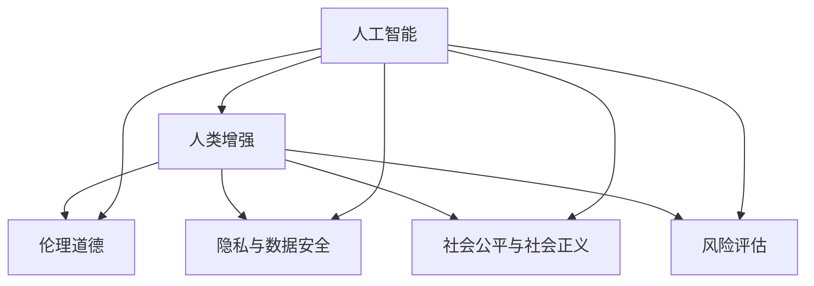

                 

# AI时代的人类增强：道德考虑与身体增强的未来发展机遇分析挑战

> 关键词：人工智能,人类增强,伦理道德,技术前沿,未来机遇,挑战

## 1. 背景介绍

### 1.1 问题由来
随着人工智能技术的迅猛发展，其在人类增强领域的应用前景愈发广阔。从智能假肢到脑机接口，从AI医疗到增强现实，众多前沿技术正逐步走进公众视野，开启人类能力新纪元。然而，在带来巨大机遇的同时，人类增强技术也伴随着诸多道德、伦理、法律以及技术上的挑战。如何在保障安全和伦理的前提下，促进这些技术的发展和应用，是当前学界和业界共同面临的重大问题。

### 1.2 问题核心关键点
人类增强技术主要关注如何通过AI、生物工程、神经科学等多学科融合，提升人类的体能、智力和感知能力。关键问题包括：

- 如何设计安全、有效的增强设备或算法？
- 如何保障用户隐私、数据安全与伦理道德？
- 如何确保技术的普及不会加剧社会不平等？
- 如何预测并应对技术发展带来的潜在风险？

这些关键问题需要在技术发展的同时，从伦理道德、法律政策等多个维度进行深入探讨和慎重决策。本文将全面梳理人类增强技术的核心概念、伦理挑战及其未来发展机遇，助力构建更为公平、可持续的技术生态。

## 2. 核心概念与联系

### 2.1 核心概念概述

为更好地理解人类增强技术及其相关问题，本文将介绍几个核心概念及其相互联系：

- **人工智能(AI)：** 一种通过算法和机器学习使计算机具备类人智能的技术。
- **人类增强(Human Augmentation)：** 利用科技手段提升人类体能、智力和感知能力的实践。
- **伦理道德(Ethics)：** 涉及如何区分对错、选择价值、指导行动的原则和规范。
- **隐私与数据安全(Privacy & Data Security)：** 保障个人数据不被未授权使用或泄露，保护用户隐私的措施。
- **社会公平与社会正义(Social Equity & Justice)：** 旨在减少贫富差距，推动所有社会成员平等受益的方针。
- **风险评估(Risk Assessment)：** 对技术发展可能带来的潜在危害进行全面评估和管理。

这些概念通过技术、伦理、法律等多方面的互动与结合，共同构成了人类增强技术的研究框架。理解并协调这些概念，是推动技术进步和应用的关键。

### 2.2 核心概念原理和架构的 Mermaid 流程图



## 3. 核心算法原理 & 具体操作步骤
### 3.1 算法原理概述

人类增强技术的核心算法原理主要围绕两大方向展开：

1. **生物增强算法**：通过生物工程、基因编辑等手段，直接对人类身体进行改造，提升某些能力。
2. **AI增强算法**：利用AI技术，通过数据分析、模型训练等方式，间接增强人类能力。

其中，AI增强算法包括但不限于：

- 机器学习模型：通过深度学习、强化学习等方法，训练出能够识别、分析、预测特定任务的高效算法。
- 自然语言处理(NLP)：利用AI提升语言理解和生成能力，增强人际交流和信息处理。
- 计算机视觉(CV)：通过图像识别、物体检测等技术，增强视觉感知和分析能力。
- 智能假肢与脑机接口(BMI)：结合生物神经信号与AI算法，实现对假肢的精确控制和大脑的直接交互。

这些算法原理通过数据采集、模型训练、输出优化等步骤，逐步构建起提升人类能力的架构。

### 3.2 算法步骤详解

以AI增强算法为例，其通常包括以下几个关键步骤：

1. **数据收集与预处理**：收集与人类增强相关的数据，如健康指标、运动数据、脑电波等。对数据进行清洗、标注和归一化处理。
2. **模型选择与训练**：选择适合的AI算法，如深度神经网络、卷积神经网络、递归神经网络等，对数据进行训练和调优。
3. **模型评估与优化**：使用验证集对模型进行评估，根据评估结果进行参数调整和模型优化。
4. **模型应用与反馈**：将训练好的模型应用于具体场景，收集反馈数据，进一步迭代优化模型。

### 3.3 算法优缺点

**优点**：
- **高效性**：AI算法能够快速处理大量数据，提供实时决策支持。
- **可扩展性**：通过模型训练和优化，AI算法能够不断提升性能，适应更多应用场景。
- **通用性**：AI算法可以应用于多种人类增强任务，具备广泛适用性。

**缺点**：
- **依赖数据质量**：模型训练效果依赖于数据质量，低质量数据可能导致误判。
- **算法复杂性**：AI算法的实现和优化复杂，需要专业知识和技能。
- **隐私风险**：数据采集和处理过程中可能涉及用户隐私，数据泄露风险较高。
- **伦理问题**：AI算法的决策过程可能缺乏透明度，引发伦理争议。

### 3.4 算法应用领域

人类增强技术在多个领域展现了巨大的应用潜力：

1. **医疗健康**：通过AI辅助诊断、智能假肢等手段，提升医疗服务质量和患者生活质量。
2. **体育训练**：利用AI进行运动数据分析和体能训练优化，提升运动员竞赛成绩。
3. **教育培训**：借助AI进行个性化教学和智能辅导，提升教学效果和学习效率。
4. **娱乐体验**：通过虚拟现实(VR)、增强现实(AR)等技术，增强用户的沉浸式体验。
5. **家庭生活**：使用智能家居设备和AI助手，提升家庭生活便利性和安全性。
6. **社会治理**：应用AI进行数据分析和预测，提升公共安全和社会管理效率。

## 4. 数学模型和公式 & 详细讲解 & 举例说明

### 4.1 数学模型构建

以AI增强算法的核心模型——卷积神经网络(CNN)为例，其数学模型构建如下：

设输入样本为 $X=\{x_1, x_2, ..., x_n\}$，其中 $x_i \in \mathbb{R}^m$，表示输入特征向量。网络参数为 $W=\{w_1, w_2, ..., w_k\}$，表示权重矩阵和偏置项。卷积神经网络的输出为 $Y=\{y_1, y_2, ..., y_n\}$，其中 $y_i \in \mathbb{R}^t$，表示模型预测的标签向量。

模型训练目标为最小化损失函数 $\mathcal{L}(Y, \hat{Y})$，其中 $\hat{Y}$ 为模型预测结果。常用的损失函数包括交叉熵损失、均方误差损失等。

### 4.2 公式推导过程

以交叉熵损失函数为例，其数学推导如下：

设真实标签为 $Y_i \in \{0, 1\}$，模型预测结果为 $\hat{Y}_i \in [0, 1]$。则交叉熵损失函数为：

$$
\mathcal{L}(Y, \hat{Y}) = -\frac{1}{n} \sum_{i=1}^n [Y_i\log\hat{Y}_i + (1-Y_i)\log(1-\hat{Y}_i)]
$$

### 4.3 案例分析与讲解

以AI在体育训练中的应用为例，通过运动数据的采集和分析，AI算法可以实时监测运动员的动作质量和体力消耗，提供个性化训练方案，优化训练效果。

假设输入数据为运动员的动作序列，输出为动作评分和训练建议。通过训练好的卷积神经网络模型，可以将动作序列转化为特征向量，利用softmax函数进行分类预测，得到动作评分。同时，根据评分结果调整训练计划，生成个性化的训练建议。

## 5. 项目实践：代码实例和详细解释说明

### 5.1 开发环境搭建

在进行项目实践前，首先需要搭建开发环境。以Python和TensorFlow为例，环境搭建步骤如下：

1. 安装Python：从官网下载安装Python 3.7及以上版本。
2. 安装TensorFlow：通过pip安装TensorFlow，或从TensorFlow官网下载源码编译安装。
3. 安装必要的第三方库：如numpy、pandas、scikit-learn等。

### 5.2 源代码详细实现

以下是一个简单的AI增强算法——卷积神经网络在图像识别任务上的实现示例：

```python
import tensorflow as tf
from tensorflow.keras import layers

# 定义模型
model = tf.keras.Sequential([
    layers.Conv2D(32, 3, activation='relu', input_shape=(28, 28, 1)),
    layers.MaxPooling2D(),
    layers.Flatten(),
    layers.Dense(10, activation='softmax')
])

# 编译模型
model.compile(optimizer='adam', loss='categorical_crossentropy', metrics=['accuracy'])

# 训练模型
model.fit(train_data, train_labels, epochs=10, validation_data=(val_data, val_labels))
```

### 5.3 代码解读与分析

- **数据准备**：输入数据为28x28的灰度图像，标签为0-9之间的整数。
- **模型构建**：使用TensorFlow的Sequential模型，定义了一个包含卷积、池化、全连接的神经网络。
- **模型编译**：设置优化器为Adam，损失函数为交叉熵，评估指标为准确率。
- **模型训练**：使用训练数据对模型进行10轮训练，每轮训练后评估验证集上的准确率。

## 6. 实际应用场景

### 6.1 医疗健康

AI在医疗健康领域的应用广泛，涵盖从疾病预测到手术辅助等多个方面。通过智能假肢和脑机接口，AI技术可以显著提升残疾人士的生活质量。

### 6.2 体育训练

AI在体育训练中的应用，能够为运动员提供个性化训练方案，提升训练效果。通过对运动数据的深度学习分析，AI算法能够识别出运动员的动作模式和体能状况，从而优化训练计划。

### 6.3 教育培训

AI在教育培训中的应用，可以提供个性化辅导和智能推荐。通过对学生学习行为的分析，AI算法能够生成个性化的学习路径和教学建议，提高学习效果。

### 6.4 娱乐体验

通过虚拟现实(VR)、增强现实(AR)等技术，AI技术可以增强用户的娱乐体验。例如，在电影和游戏中，AI可以生成逼真的场景和角色，提升用户体验。

### 6.5 家庭生活

智能家居设备和AI助手在家庭生活中的应用，提升了日常生活的便利性和安全性。例如，通过语音助手，用户可以控制家电、查询信息，极大提高了生活质量。

### 6.6 社会治理

AI在社会治理中的应用，能够提升公共安全和社会管理效率。例如，通过数据分析和模式识别，AI可以实时监测和预测犯罪行为，提升社会治理水平。

## 7. 工具和资源推荐

### 7.1 学习资源推荐

- **《深度学习》书籍**：Ian Goodfellow所著，全面介绍了深度学习的基本原理和算法。
- **Coursera《机器学习》课程**：由Andrew Ng教授主讲，覆盖了机器学习的基础和实践。
- **GitHub《AI开源项目》**：展示了最新的AI技术和项目，是学习和应用的好资源。

### 7.2 开发工具推荐

- **Jupyter Notebook**：一个强大的数据科学开发环境，支持Python、R等多种语言。
- **TensorFlow**：Google开源的深度学习框架，支持分布式计算和GPU加速。
- **PyTorch**：Facebook开源的深度学习框架，支持动态图和静态图计算。

### 7.3 相关论文推荐

- **《Deep Blue》论文**：AlphaGo的研究论文，展示了AI在复杂决策游戏中的应用潜力。
- **《Super-Mouse》论文**：智能假肢的研究论文，介绍了AI在残疾人士生活质量提升中的应用。
- **《AI for Healthcare》报告**：关于AI在医疗健康领域应用的全面综述。

## 8. 总结：未来发展趋势与挑战

### 8.1 研究成果总结

本文从核心概念、算法原理、项目实践等多个维度，全面介绍了AI增强技术的现状和应用前景。通过数据采集、模型训练、输出优化等步骤，AI算法在医疗健康、体育训练、教育培训等多个领域展现了巨大的应用潜力。然而，在技术进步的同时，也需要关注伦理道德、隐私安全、社会公平等方面的挑战，确保技术的发展能够惠及全人类。

### 8.2 未来发展趋势

未来，AI增强技术将呈现以下几个发展趋势：

1. **技术融合**：AI增强技术将与其他前沿科技（如基因编辑、脑机接口等）深度融合，推动人类能力的多维度提升。
2. **算法优化**：深度学习算法、强化学习算法等将不断优化，提升AI系统的性能和稳定性。
3. **数据扩展**：通过数据增强、合成数据等方法，扩展数据集规模，提升模型的泛化能力。
4. **伦理规范**：逐步制定和完善AI伦理规范，确保技术应用符合人类价值观和伦理道德。
5. **法规监管**：通过法律法规，规范AI技术的应用和推广，保障公众利益。

### 8.3 面临的挑战

尽管AI增强技术前景广阔，但也面临诸多挑战：

1. **伦理困境**：AI增强技术可能引发伦理争议，如隐私侵犯、数据滥用等。
2. **技术瓶颈**：现有技术在实现某些增强功能时面临技术难题，如基因编辑技术的局限性。
3. **社会不平等**：AI增强技术的普及可能导致社会不平等加剧，增加社会矛盾。
4. **数据隐私**：数据采集和处理过程中可能涉及用户隐私，数据泄露风险较高。
5. **安全性**：AI系统的安全性问题需要特别关注，防止被恶意攻击。

### 8.4 研究展望

未来，需要在技术进步的同时，注重伦理道德和社会公平的研究，确保AI增强技术的可持续发展。具体方向包括：

1. **伦理规范制定**：制定AI伦理规范，明确技术应用的原则和限制。
2. **隐私保护技术**：采用隐私保护技术，如差分隐私、联邦学习等，保障用户隐私安全。
3. **技术普及与公平**：通过政策引导和技术支持，促进AI技术的普及，减少社会不平等。
4. **风险评估与管理**：建立风险评估机制，对AI技术进行全面评估和管理，确保其安全性。
5. **跨学科合作**：加强科技界、伦理界、法律界等多领域的合作，推动AI技术的健康发展。

## 9. 附录：常见问题与解答

**Q1：什么是人类增强技术？**

A：人类增强技术是通过科技手段，提升人类的体能、智力和感知能力的实践。具体技术包括生物增强和AI增强两大方向。

**Q2：AI增强算法在人类增强中的应用前景如何？**

A：AI增强算法在医疗健康、体育训练、教育培训等多个领域展现出了巨大的应用前景。通过数据分析和模型训练，AI算法可以显著提升人类能力和生活质量。

**Q3：在人类增强技术的发展过程中，如何平衡技术进步与伦理道德？**

A：在技术发展过程中，需要注重伦理道德的研究，制定和完善AI伦理规范。通过法律法规、技术手段和公众教育，确保技术应用符合人类价值观和伦理道德。

**Q4：人类增强技术在未来发展过程中，可能面临哪些技术挑战？**

A：未来技术发展面临的挑战包括：技术融合难题、算法优化瓶颈、数据扩展局限、社会不平等问题、数据隐私风险和技术安全性问题。需要通过多学科合作和政策引导，逐步解决这些问题。

**Q5：人类增强技术对未来社会有何影响？**

A：人类增强技术在提升人类能力的同时，也可能带来社会不平等、隐私风险等问题。需要通过政策引导和技术手段，确保技术的可持续发展，避免负面影响。

---

作者：禅与计算机程序设计艺术 / Zen and the Art of Computer Programming

