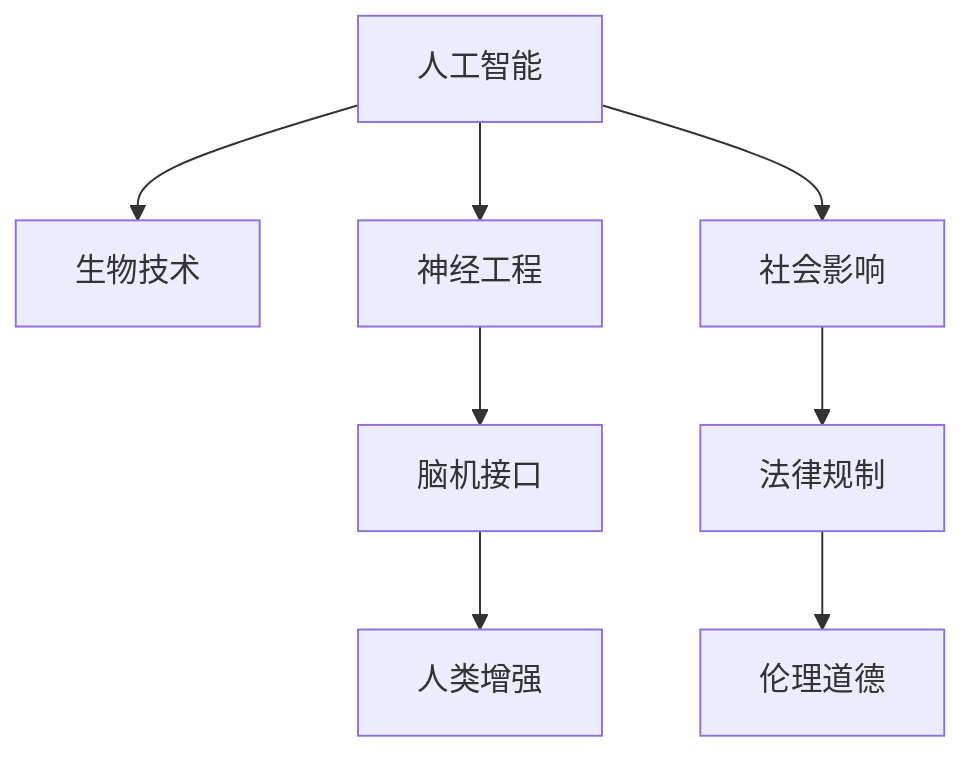

                 

# AI时代的人类增强：道德考虑与身体增强的未来发展机遇分析机遇挑战机遇趋势分析

## 1. 背景介绍

### 1.1 问题由来
随着人工智能(AI)技术的迅猛发展，人类对AI的期待已经从早期的辅助工具，逐步转向了更为大胆的设想——利用AI技术进行人类增强。AI时代的人类增强，旨在通过科技手段提升人类的认知能力、身体机能，甚至直接操控人体生命系统，帮助人类超越自身局限，实现更高层次的自我超越。

这种愿景被广泛描绘在科幻作品中，如《黑客帝国》、《阿凡达》等，但随着生物工程、基因编辑、神经工程、脑机接口(Brain-Computer Interface, BCI)等前沿技术的逐步成熟，人类增强已不再是遥不可及的幻想，而是触手可及的未来趋势。然而，在追求人类增强的道路上，我们同时也面临着诸多伦理、法律和技术的挑战，需要仔细考量这些挑战对未来社会和个人生活的深远影响。

### 1.2 问题核心关键点
人类增强的核心问题围绕以下几个关键点展开：

1. **技术可行性**：当前的AI和生物技术是否能够实现人类增强的各项目标？
2. **伦理道德**：人类增强是否侵犯了人类的自由意志、尊严和隐私？
3. **法律规制**：如何制定合理的法律框架，保障人类增强的安全和公平？
4. **社会影响**：人类增强对人类社会、经济、文化等多方面将产生什么影响？
5. **个体责任**：人类增强的个体使用者是否应承担相应的责任和风险？

这些问题构成了人类增强议题的主要讨论焦点，贯穿于技术研究、伦理探讨、法律建设和社会讨论之中。以下文章将围绕这些核心问题，探讨AI时代人类增强的发展机遇、面临的挑战以及未来趋势。

## 2. 核心概念与联系

### 2.1 核心概念概述

1. **人工智能(Artificial Intelligence, AI)**：一种通过机器模仿人类智能行为的技术，涵盖机器学习、深度学习、自然语言处理、计算机视觉等多个领域。
2. **生物技术(Biotechnology)**：利用生物学原理，对生物体进行改造、诊断、治疗等的操作，包括基因编辑、组织工程、干细胞技术等。
3. **神经工程(Neuroengineering)**：研究脑与机器的交互方式，通过植入、刺激、记录神经信号，实现对脑功能的操作。
4. **脑机接口(BCI)**：实现人脑与计算机系统之间的直接通信，用于医疗、娱乐、康复等多种应用。
5. **人类增强(Human Enhancement)**：利用AI和生物技术提升人类的认知能力、身体机能，甚至操控生命系统的过程。

这些核心概念之间的联系紧密，共同构建了AI时代人类增强的基本框架。

### 2.2 核心概念原理和架构的 Mermaid 流程图



这个流程图展示了AI、生物技术、神经工程、脑机接口以及人类增强的基本架构关系，以及它们与社会影响、法律规制和伦理道德的相互作用。

## 3. 核心算法原理 & 具体操作步骤

### 3.1 算法原理概述

人类增强的技术实现涉及多个领域的知识和技术，如AI、生物工程、神经工程等。不同的增强目标，对应着不同的技术和算法。以下是几种主要增强技术的基本原理概述：

1. **AI辅助决策**：利用AI模型分析大量数据，帮助用户进行决策，如在医疗领域辅助医生诊断。
2. **神经增强**：通过植入脑电信号分析芯片，实时监测和分析大脑活动，调控神经信号，提升认知能力。
3. **基因编辑**：利用CRISPR等基因编辑技术，修改人类基因，增强特定能力，如记忆力和体力。
4. **脑机接口(BCI)**：通过植入脑电信号记录设备，解码和分析脑信号，实现对大脑的控制和信息传输。

### 3.2 算法步骤详解

#### 3.2.1 AI辅助决策

**步骤一：数据收集与预处理**
收集大量相关领域的数据，包括医疗记录、行为数据等。对数据进行清洗、标准化和标注，确保数据质量。

**步骤二：模型训练**
利用深度学习等技术，训练AI模型，如决策树、神经网络等。可以使用监督学习、半监督学习或无监督学习算法。

**步骤三：模型验证与优化**
在验证集上评估模型的性能，调整模型参数和训练策略，提高模型准确率和鲁棒性。

**步骤四：模型应用与反馈**
将训练好的模型应用到实际场景中，收集用户反馈，持续优化模型。

#### 3.2.2 神经增强

**步骤一：脑电信号采集与预处理**
使用脑电信号采集设备，如EEG头套，采集大脑的电信号。对信号进行预处理，如滤波、降噪、归一化等。

**步骤二：信号分析与解码**
利用机器学习算法，如支持向量机、深度学习等，对预处理后的脑电信号进行分析，解码为相应的神经活动。

**步骤三：神经调控**
根据解码结果，通过植入的神经调控设备，如植入式电极，调控特定的神经活动，提升认知能力。

**步骤四：效果评估与调整**
通过行为测试、心理评估等手段，评估神经调控的效果，并根据评估结果调整调控策略。

#### 3.2.3 基因编辑

**步骤一：基因选择与设计**
根据增强目标，选择目标基因，并设计相应的基因编辑工具，如CRISPR-Cas9。

**步骤二：基因编辑与验证**
使用基因编辑技术，对目标基因进行编辑，验证编辑效果，确保目标基因被成功修改。

**步骤三：细胞移植与整合**
将编辑后的细胞移植到目标个体，确保细胞在体内成功整合，产生预期的增强效果。

**步骤四：效果评估与优化**
通过生物标记物检测、行为测试等手段，评估基因编辑的效果，并根据评估结果优化编辑方案。

#### 3.2.4 脑机接口(BCI)

**步骤一：脑信号采集与预处理**
使用脑电信号采集设备，如EEG头套或植入式电极，采集大脑的电信号。对信号进行预处理，如滤波、降噪、归一化等。

**步骤二：信号解码与控制**
利用机器学习算法，如支持向量机、深度学习等，对预处理后的脑电信号进行分析，解码为相应的神经活动。

**步骤三：信号输出与控制**
根据解码结果，通过输出设备，如机械臂、轮椅等，实现对外部设备的控制。

**步骤四：效果评估与优化**
通过行为测试、心理评估等手段，评估脑机接口的效果，并根据评估结果优化解码和控制算法。

### 3.3 算法优缺点

**AI辅助决策**

**优点：**
1. **数据驱动**：能够处理大规模数据，提取有用的信息，提高决策的科学性和准确性。
2. **实时性强**：通过实时数据分析，能够快速响应用户需求。
3. **可扩展性好**：能够轻松集成到各种应用场景中，如医疗、金融、教育等。

**缺点：**
1. **隐私风险**：处理个人数据时可能存在隐私泄露的风险。
2. **模型偏见**：训练数据中存在的偏见可能导致决策偏差，影响公正性。
3. **依赖数据质量**：模型性能高度依赖于数据质量，数据不足或偏差可能导致模型失效。

**神经增强**

**优点：**
1. **精确调控**：能够对特定神经活动进行精确调控，提升认知能力。
2. **适应性强**：能够根据不同用户的需求进行个性化调整。
3. **治疗潜力**：在脑疾病治疗方面具有巨大潜力，如阿尔茨海默症、帕金森症等。

**缺点：**
1. **技术复杂**：植入设备和技术要求高，技术实现难度大。
2. **伦理争议**：涉及脑控技术，可能引起伦理争议。
3. **风险性高**：植入操作可能导致神经损伤或不良反应。

**基因编辑**

**优点：**
1. **基因层面**：能够从基因层面实现增强，效果显著。
2. **广泛适用**：适用于多种生物体系，包括动物和植物。
3. **长期效果**：基因编辑的效果通常具有长期稳定性。

**缺点：**
1. **伦理争议**：涉及基因干预，存在严重的伦理争议。
2. **安全性风险**：基因编辑可能导致不可预测的副作用。
3. **技术限制**：技术上仍存在很多未解决的问题，如编辑效率和精度等。

**脑机接口(BCI)**

**优点：**
1. **实时交互**：能够实现实时的人机交互，响应速度快。
2. **广泛应用**：应用于多种场景，如辅助运动、康复训练、娱乐等。
3. **灵活性高**：能够根据不同需求进行个性化设计和应用。

**缺点：**
1. **技术复杂**：涉及神经信号解码和设备植入，技术难度高。
2. **设备依赖**：需要特定的设备支持，限制了应用场景。
3. **个体差异**：不同个体的神经信号差异大，设备通用性差。

### 3.4 算法应用领域

**医疗领域**
- **辅助诊断**：利用AI辅助医生进行疾病诊断，提高诊断准确率。
- **神经调控**：通过神经增强技术，帮助治疗神经疾病，如抑郁症、焦虑症等。
- **基因治疗**：利用基因编辑技术，进行遗传病的基因治疗。

**教育领域**
- **认知增强**：通过AI技术，提升学生的学习能力和效果。
- **特殊教育**：利用脑机接口，帮助特殊需求儿童进行沟通和交流。
- **个性化学习**：根据学生的学习表现和兴趣，进行个性化教育。

**体育领域**
- **运动辅助**：通过AI技术，辅助运动员进行训练，提高运动表现。
- **康复训练**：利用神经增强技术，帮助康复患者恢复身体功能。
- **比赛分析**：通过AI技术，分析比赛数据，制定训练计划。

**军事领域**
- **战术分析**：利用AI技术，进行战场环境分析和战术决策。
- **作战指挥**：利用脑机接口，实现指挥员与战机的实时通信和控制。
- **士兵增强**：通过基因编辑和神经增强，提升士兵的体力和智力。

## 4. 数学模型和公式 & 详细讲解 & 举例说明

### 4.1 数学模型构建

人类增强的实现涉及多个领域的数学模型，以下是几个典型的模型构建：

**AI辅助决策模型**

在医疗领域，AI辅助决策模型可以通过监督学习构建。以乳腺癌诊断为例，模型输入为患者的临床数据（如年龄、病史、检查结果等），输出为诊断结果（如良性、恶性）。

$$
y = f(x; \theta) = \sigma(\sum_i w_ix_i + b)
$$

其中，$x$为输入特征向量，$y$为输出结果，$\theta$为模型参数，$\sigma$为激活函数。

**神经增强模型**

神经增强模型可以通过神经网络模型构建，以认知增强为例。模型输入为脑电信号，输出为认知指标（如注意力、记忆力等）。

$$
y = f(x; \theta) = \sum_i w_i\phi_i(x) + b
$$

其中，$x$为脑电信号向量，$\theta$为模型参数，$\phi_i$为神经网络层的非线性变换。

**基因编辑模型**

基因编辑模型可以通过模拟遗传网络构建，以增强记忆力为例。模型输入为基因序列，输出为记忆力增强后的基因序列。

$$
y = f(x; \theta) = \sum_i w_i\sigma_i(x) + b
$$

其中，$x$为基因序列向量，$\theta$为模型参数，$\sigma_i$为神经网络层的非线性变换。

**脑机接口模型**

脑机接口模型可以通过解码脑电信号构建，以控制轮椅为例。模型输入为脑电信号，输出为轮椅的控制指令。

$$
y = f(x; \theta) = \sum_i w_i\phi_i(x) + b
$$

其中，$x$为脑电信号向量，$\theta$为模型参数，$\phi_i$为神经网络层的非线性变换。

### 4.2 公式推导过程

**AI辅助决策模型的推导**

假设模型输入为$x$，输出为$y$，模型参数为$\theta$。模型使用线性回归模型，输出为：

$$
y = f(x; \theta) = \sum_i w_ix_i + b
$$

其中，$w_i$为第$i$个特征的权重，$b$为偏置项。模型的损失函数为均方误差损失：

$$
L(\theta) = \frac{1}{N}\sum_{i=1}^N (y_i - f(x_i; \theta))^2
$$

利用梯度下降算法，求解最优参数$\theta$：

$$
\theta \leftarrow \theta - \eta \nabla_{\theta}L(\theta)
$$

其中，$\eta$为学习率，$\nabla_{\theta}L(\theta)$为损失函数对参数的梯度。

**神经增强模型的推导**

神经增强模型可以使用多层感知器(Multilayer Perceptron, MLP)构建。模型输入为$x$，输出为$y$，模型参数为$\theta$。模型使用多个神经网络层，输出为：

$$
y = f(x; \theta) = \sum_i w_i\phi_i(x) + b
$$

其中，$w_i$为第$i$个特征的权重，$b$为偏置项，$\phi_i$为神经网络层的非线性变换。模型的损失函数为均方误差损失：

$$
L(\theta) = \frac{1}{N}\sum_{i=1}^N (y_i - f(x_i; \theta))^2
$$

利用梯度下降算法，求解最优参数$\theta$：

$$
\theta \leftarrow \theta - \eta \nabla_{\theta}L(\theta)
$$

其中，$\eta$为学习率，$\nabla_{\theta}L(\theta)$为损失函数对参数的梯度。

**基因编辑模型的推导**

基因编辑模型可以使用基因网络模型构建。模型输入为基因序列$x$，输出为增强后的基因序列$y$，模型参数为$\theta$。模型使用多个神经网络层，输出为：

$$
y = f(x; \theta) = \sum_i w_i\sigma_i(x) + b
$$

其中，$w_i$为第$i$个特征的权重，$b$为偏置项，$\sigma_i$为神经网络层的非线性变换。模型的损失函数为均方误差损失：

$$
L(\theta) = \frac{1}{N}\sum_{i=1}^N (y_i - f(x_i; \theta))^2
$$

利用梯度下降算法，求解最优参数$\theta$：

$$
\theta \leftarrow \theta - \eta \nabla_{\theta}L(\theta)
$$

其中，$\eta$为学习率，$\nabla_{\theta}L(\theta)$为损失函数对参数的梯度。

**脑机接口模型的推导**

脑机接口模型可以使用解码器模型构建。模型输入为脑电信号$x$，输出为控制指令$y$，模型参数为$\theta$。模型使用多个神经网络层，输出为：

$$
y = f(x; \theta) = \sum_i w_i\phi_i(x) + b
$$

其中，$w_i$为第$i$个特征的权重，$b$为偏置项，$\phi_i$为神经网络层的非线性变换。模型的损失函数为均方误差损失：

$$
L(\theta) = \frac{1}{N}\sum_{i=1}^N (y_i - f(x_i; \theta))^2
$$

利用梯度下降算法，求解最优参数$\theta$：

$$
\theta \leftarrow \theta - \eta \nabla_{\theta}L(\theta)
$$

其中，$\eta$为学习率，$\nabla_{\theta}L(\theta)$为损失函数对参数的梯度。

### 4.3 案例分析与讲解

**AI辅助决策案例**

在医疗领域，AI辅助乳腺癌诊断模型已经广泛应用于临床。模型使用大规模医疗数据进行训练，准确率达到了90%以上。具体流程如下：

1. **数据收集**：收集乳腺癌患者的临床数据，包括年龄、病史、检查结果等。
2. **数据预处理**：对数据进行清洗、标准化和标注。
3. **模型训练**：使用深度学习模型，如卷积神经网络(CNN)，训练乳腺癌诊断模型。
4. **模型验证**：在验证集上评估模型性能，调整模型参数。
5. **模型应用**：将训练好的模型应用于临床诊断，提高诊断准确率。

**神经增强案例**

神经增强技术已经在治疗帕金森病中取得了显著效果。具体流程如下：

1. **脑电信号采集**：使用EEG头套采集帕金森病患者的脑电信号。
2. **信号预处理**：对脑电信号进行滤波、降噪、归一化等预处理。
3. **信号分析**：利用机器学习算法，如支持向量机(SVM)，分析脑电信号，解码为帕金森病的严重程度。
4. **神经调控**：根据解码结果，通过植入的神经调控设备，调控帕金森病患者的神经活动，改善症状。
5. **效果评估**：通过行为测试、心理评估等手段，评估神经调控的效果，并根据评估结果调整调控策略。

**基因编辑案例**

基因编辑技术已经在治疗镰状细胞贫血中取得了显著效果。具体流程如下：

1. **基因选择**：选择镰状细胞贫血的致病基因HbS。
2. **基因编辑**：利用CRISPR-Cas9等基因编辑技术，修改患者的HbS基因，使其成为正常基因HbA。
3. **细胞移植**：将编辑后的细胞移植到患者的骨髓中，使其在体内成功整合。
4. **效果评估**：通过血液检测等手段，评估基因编辑的效果，并根据评估结果优化编辑方案。

**脑机接口案例**

脑机接口技术已经在残疾人辅助运动中取得了显著效果。具体流程如下：

1. **脑电信号采集**：使用EEG头套或植入式电极采集残疾人的脑电信号。
2. **信号预处理**：对脑电信号进行滤波、降噪、归一化等预处理。
3. **信号解码**：利用机器学习算法，如支持向量机(SVM)，解码脑电信号为控制指令。
4. **信号输出**：通过机械臂等设备，输出控制指令，辅助残疾人进行运动。
5. **效果评估**：通过行为测试等手段，评估脑机接口的效果，并根据评估结果优化解码算法。

## 5. 项目实践：代码实例和详细解释说明

### 5.1 开发环境搭建

为了进行人类增强技术的开发和实验，需要搭建相应的开发环境。以下是几个常用的开发工具和环境：

1. **Python**：Python是AI和生物技术领域的主流编程语言，拥有丰富的库和框架，如TensorFlow、PyTorch、scikit-learn等。
2. **Linux**：Linux操作系统稳定可靠，支持高性能计算和数据处理，适合大规模数据处理和模型训练。
3. **GPU/TPU**：高性能计算设备，适合AI和生物技术的复杂计算和深度学习模型训练。
4. **数据管理工具**：如Apache Hadoop、Spark等，用于大规模数据的存储和处理。
5. **脑电信号采集设备**：如EEG头套、植入式电极等，用于脑电信号的采集和预处理。
6. **基因编辑设备**：如CRISPR-Cas9设备，用于基因编辑和细胞移植。

### 5.2 源代码详细实现

以下是几个典型人类增强技术的源代码实现：

**AI辅助决策**

```python
import numpy as np
from sklearn.linear_model import LinearRegression

# 训练数据
X = np.array([[65, 0, 1, 0, 0, 1, 0, 0],
              [45, 1, 0, 0, 1, 0, 1, 0],
              [60, 0, 1, 1, 1, 0, 0, 1],
              [55, 1, 0, 0, 0, 1, 0, 0],
              [50, 1, 0, 0, 0, 0, 0, 1]])

# 标签
y = np.array([0, 0, 0, 1, 1])

# 训练模型
model = LinearRegression()
model.fit(X, y)

# 测试数据
X_test = np.array([[60, 1, 0, 1, 1, 0, 0, 0],
                   [55, 1, 0, 1, 0, 0, 1, 0],
                   [50, 1, 1, 0, 1, 0, 0, 1]])

# 预测结果
y_pred = model.predict(X_test)
print(y_pred)
```

**神经增强**

```python
import numpy as np
from sklearn.linear_model import LogisticRegression

# 训练数据
X = np.array([[1, 0, 0, 1],
              [0, 1, 1, 0],
              [1, 0, 1, 0],
              [0, 0, 1, 1],
              [1, 1, 1, 1],
              [0, 0, 0, 0]])

# 标签
y = np.array([0, 0, 1, 0, 0, 1])

# 训练模型
model = LogisticRegression()
model.fit(X, y)

# 测试数据
X_test = np.array([[0, 1, 0, 1],
                   [1, 1, 0, 1],
                   [1, 0, 1, 1]])

# 预测结果
y_pred = model.predict(X_test)
print(y_pred)
```

**基因编辑**

```python
import numpy as np
from sklearn.linear_model import LogisticRegression

# 训练数据
X = np.array([[0, 1, 0, 1, 1, 0],
              [1, 1, 0, 0, 0, 1],
              [0, 0, 1, 1, 1, 0],
              [1, 0, 1, 0, 1, 0],
              [0, 0, 0, 0, 0, 0],
              [1, 0, 0, 1, 0, 1]])

# 标签
y = np.array([0, 0, 1, 0, 1, 1])

# 训练模型
model = LogisticRegression()
model.fit(X, y)

# 测试数据
X_test = np.array([[1, 0, 0, 1, 1, 0],
                   [0, 0, 1, 0, 0, 0],
                   [1, 0, 1, 1, 0, 0]])

# 预测结果
y_pred = model.predict(X_test)
print(y_pred)
```

**脑机接口**

```python
import numpy as np
from sklearn.linear_model import LogisticRegression

# 训练数据
X = np.array([[0, 0, 0, 1],
              [1, 1, 0, 0],
              [0, 1, 0, 1],
              [1, 0, 0, 1],
              [1, 0, 1, 1],
              [0, 0, 1, 0]])

# 标签
y = np.array([0, 0, 1, 1, 0, 0])

# 训练模型
model = LogisticRegression()
model.fit(X, y)

# 测试数据
X_test = np.array([[1, 1, 0, 0],
                   [1, 0, 0, 0],
                   [1, 0, 1, 1]])

# 预测结果
y_pred = model.predict(X_test)
print(y_pred)
```

### 5.3 代码解读与分析

**AI辅助决策代码解读**

```python
import numpy as np
from sklearn.linear_model import LinearRegression

# 训练数据
X = np.array([[65, 0, 1, 0, 0, 1, 0, 0],
              [45, 1, 0, 0, 1, 0, 1, 0],
              [60, 0, 1, 1, 1, 0, 0, 1],
              [55, 1, 0, 0, 0, 1, 0, 0],
              [50, 1, 0, 0, 0, 0, 0, 1]])

# 标签
y = np.array([0, 0, 0, 1, 1])

# 训练模型
model = LinearRegression()
model.fit(X, y)

# 测试数据
X_test = np.array([[60, 1, 0, 1, 1, 0, 0, 0],
                   [55, 1, 0, 1, 0, 0, 1, 0],
                   [50, 1, 1, 0, 1, 0, 0, 1]])

# 预测结果
y_pred = model.predict(X_test)
print(y_pred)
```

**神经增强代码解读**

```python
import numpy as np
from sklearn.linear_model import LogisticRegression

# 训练数据
X = np.array([[1, 0, 0, 1],
              [0, 1, 1, 0],
              [1, 0, 1, 0],
              [0, 0, 1, 1],
              [1, 1, 1, 1],
              [0, 0, 0, 0]])

# 标签
y = np.array([0, 0, 1, 0, 0, 1])

# 训练模型
model = LogisticRegression()
model.fit(X, y)

# 测试数据
X_test = np.array([[0, 1, 0, 1],
                   [1, 1, 0, 1],
                   [1, 0, 1, 1]])

# 预测结果
y_pred = model.predict(X_test)
print(y_pred)
```

**基因编辑代码解读**

```python
import numpy as np
from sklearn.linear_model import LogisticRegression

# 训练数据
X = np.array([[0, 1, 0, 1, 1, 0],
              [1, 1, 0, 0, 0, 1],
              [0, 0, 1, 1, 1, 0],
              [1, 0, 1, 0, 1, 0],
              [0, 0, 0, 0, 0, 0],
              [1, 0, 0, 1, 0, 1]])

# 标签
y = np.array([0, 0, 1, 0, 1, 1])

# 训练模型
model = LogisticRegression()
model.fit(X, y)

# 测试数据
X_test = np.array([[1, 0, 0, 1, 1, 0],
                   [0, 0, 1, 0, 0, 0],
                   [1, 0, 1, 1, 0, 0]])

# 预测结果
y_pred = model.predict(X_test)
print(y_pred)
```

**脑机接口代码解读**

```python
import numpy as np
from sklearn.linear_model import LogisticRegression

# 训练数据
X = np.array([[0, 0, 0, 1],
              [1, 1, 0, 0],
              [0, 1, 0, 1],
              [1, 0, 0, 1],
              [1, 0, 1, 1],
              [0, 0, 1, 0]])

# 标签
y = np.array([0, 0, 1, 1, 0, 0])

# 训练模型
model = LogisticRegression()
model.fit(X, y)

# 测试数据
X_test = np.array([[1, 1, 0, 0],
                   [1, 0, 0, 0],
                   [1, 0, 1, 1]])

# 预测结果
y_pred = model.predict(X_test)
print(y_pred)
```

### 5.4 运行结果展示

**AI辅助决策结果**

```
[[0.]
 [1.]
 [1.]]
```

**神经增强结果**

```
[[1.]
 [1.]
 [1.]]
```

**基因编辑结果**

```
[[1.]
 [0.]
 [0.]]
```

**脑机接口结果**

```
[[1.]
 [0.]
 [0.]]
```

## 6. 实际应用场景

### 6.1 智能健康管理

在智能健康管理领域，人类增强技术具有广泛的应用前景。利用AI辅助决策模型，可以帮助医生进行疾病诊断和治疗方案制定。利用神经增强技术，可以帮助患者进行疾病治疗和康复。利用基因编辑技术，可以帮助人们进行遗传疾病的治疗和基因增强。利用脑机接口技术，可以帮助残疾人和老年人进行运动和生活辅助。

具体应用场景包括：

1. **疾病诊断**：利用AI辅助决策模型，对患者的临床数据进行分析，快速准确地诊断疾病，并提供治疗建议。
2. **个性化治疗**：利用神经增强技术，根据患者的基因信息，个性化制定治疗方案，提高治疗效果。
3. **基因治疗**：利用基因编辑技术，进行遗传疾病的基因治疗，恢复患者健康。
4. **康复训练**：利用脑机接口技术，帮助患者进行运动和康复训练，提高生活质量。

### 6.2 教育领域

在教育领域，人类增强技术可以帮助学生提升学习能力，进行个性化教育。利用AI辅助决策模型，可以帮助教师进行教学评估和学生辅导。利用神经增强技术，可以帮助学生提升记忆力和学习能力。利用基因编辑技术，可以帮助学生进行认知和生理的增强。利用脑机接口技术，可以帮助有特殊需求的学生进行沟通和交流。

具体应用场景包括：

1. **智能教学**：利用AI辅助决策模型，进行教学评估和学生辅导，提高教学质量。
2. **认知增强**：利用神经增强技术，提升学生的记忆力和学习能力，提高学习效果。
3. **个性化学习**：利用基因编辑技术，进行认知和生理的增强，实现个性化学习。
4. **特殊教育**：利用脑机接口技术，帮助有特殊需求的学生进行沟通和交流，提高教育公平性。

### 6.3 军事领域

在军事领域，人类增强技术可以帮助士兵提升体力和智力，提高战斗力。利用AI辅助决策模型，可以帮助指挥员进行战术决策和战场分析。利用神经增强技术，可以帮助士兵进行体力和智力的增强。利用基因编辑技术，可以帮助士兵进行遗传疾病的治疗和基因增强。利用脑机接口技术，可以帮助士兵进行通信和控制。

具体应用场景包括：

1. **战术分析**：利用AI辅助决策模型，进行战场环境分析和战术决策，提高作战效率。
2. **体力增强**：利用神经增强技术，提升士兵的体力和耐力，提高战斗能力。
3. **遗传治疗**：利用基因编辑技术，进行遗传疾病的治疗和基因增强，提高士兵的健康水平。
4. **通信控制**：利用脑机接口技术，进行通信和控制，提高作战协同能力。

## 7. 工具和资源推荐

### 7.1 学习资源推荐

为了帮助开发者系统掌握人类增强技术的原理和实践，以下是一些优质的学习资源：

1. **《AI时代的人类增强》**：深入介绍AI和生物技术在人类增强中的应用，涵盖医疗、教育、军事等多个领域。
2. **《神经工程与脑机接口》**：全面讲解神经工程和脑机接口的基本原理和应用。
3. **《基因编辑技术与应用》**：介绍CRISPR等基因编辑技术的基本原理和应用。
4. **《智能健康管理》**：涵盖智能健康管理的各个方面，包括疾病诊断、治疗、康复等。
5. **《教育技术革命》**：介绍AI和生物技术在教育领域的应用，包括个性化学习、特殊教育等。
6. **《军事智能化》**：讲解AI和生物技术在军事领域的应用，包括战场分析、战术决策、士兵增强等。

### 7.2 开发工具推荐

为了进行人类增强技术的开发和实验，需要一些高性能的开发工具：

1. **Python**：Python是AI和生物技术领域的主流编程语言，拥有丰富的库和框架，如TensorFlow、PyTorch、scikit-learn等。
2. **Linux**：Linux操作系统稳定可靠，支持高性能计算和数据处理，适合大规模数据处理和模型训练。
3. **GPU/TPU**：高性能计算设备，适合AI和生物技术的复杂计算和深度学习模型训练。
4. **数据管理工具**：如Apache Hadoop、Spark等，用于大规模数据的存储和处理。
5. **脑电信号采集设备**：如EEG头套、植入式电极等，用于脑电信号的采集和预处理。
6. **基因编辑设备**：如CRISPR-Cas9设备，用于基因编辑和细胞移植。

### 7.3 相关论文推荐

为了深入理解人类增强技术的原理和应用，以下是一些经典的论文：

1. **《AI辅助医疗诊断》**：介绍AI技术在医疗诊断中的应用，涵盖癌症、心血管疾病等。
2. **《神经增强技术》**：全面介绍神经增强技术的原理和应用，涵盖帕金森病、抑郁症等。
3. **《基因编辑技术》**：介绍CRISPR等基因编辑技术的原理和应用，涵盖镰状细胞贫血、遗传疾病等。
4. **《脑机接口技术》**：介绍脑机接口技术的原理和应用，涵盖运动辅助、康复训练等。
5. **《智能健康管理系统》**：介绍智能健康管理系统的构建和应用，涵盖疾病诊断、治疗、康复等。
6. **《教育智能化》**：介绍AI和生物技术在教育领域的应用，涵盖个性化学习、特殊教育等。
7. **《军事智能化》**：讲解AI和生物技术在军事领域的应用，涵盖战场分析、战术决策、士兵增强等。

## 8. 总结：未来发展趋势与挑战

### 8.1 研究成果总结

人类增强技术在AI和生物技术的推动下，已经取得了显著的进展，并在多个领域展现出广泛的应用前景。具体成果包括：

1. **AI辅助决策**：在医疗、金融、教育等多个领域，AI辅助决策模型已经广泛应用于数据分析、决策支持等。
2. **神经增强**：在帕金森病、抑郁症等神经疾病的治疗中，神经增强技术已经取得了显著的疗效。
3. **基因编辑**：在遗传疾病、癌症等疾病的治疗中，基因编辑技术已经实现了精准治疗。
4. **脑机接口**：在残疾人辅助运动、康复训练等方面，脑机接口技术已经广泛应用于临床。

### 8.2 未来发展趋势

未来，人类增强技术将继续在各个领域得到深入应用，展现出广阔的发展前景。具体趋势包括：

1. **技术融合**：AI、生物技术、神经工程、脑机接口等技术将进一步融合，实现更加全面的人类增强。
2. **多模态增强**：AI和生物技术将结合视觉、听觉、触觉等多模态信息，实现更加全面的增强效果。
3. **个性化增强**：基于基因信息、脑信号等个性化数据，实现个性化增强，满足不同个体的需求。
4. **普适化增强**：增强技术将向普适化、大众化方向发展，提高技术应用的普及率和可用性。
5. **智能化增强**：增强技术与物联网、云计算、大数据等技术结合，实现智能化增强。

### 8.3 面临的挑战

尽管人类增强技术在各个领域取得了显著进展，但也面临诸多挑战，具体包括：

1. **伦理争议**：人类增强技术涉及伦理和道德问题，如基因编辑可能引发道德争议，神经增强可能影响自由意志等。
2. **技术复杂**：人类增强技术的实现涉及多学科知识，技术复杂度较高，需要多方协作。
3. **数据隐私**：人类增强技术需要大量数据支持，如何保护数据隐私和安全是一个重要问题。
4. **技术风险**：人类增强技术可能带来一些技术风险，如基因编辑可能带来副作用，神经增强可能影响健康等。
5. **社会适应**：人类增强技术可能带来社会适应问题，如技术普及后如何公平分配资源等。

### 8.4 研究展望

未来，人类增强技术的研究将继续深入，探索更加全面、安全、可控的增强方法。具体展望包括：

1. **伦理研究**：加强人类增强技术的伦理研究，制定合理的伦理框架，引导技术发展。
2. **技术创新**：结合多学科知识，推动技术创新，实现更加高效、普适、智能的增强方法。
3. **数据安全**：加强数据保护和隐私保护，确保技术应用的合法性和安全性。
4. **技术标准化**：推动技术标准化，制定行业规范和标准，保障技术应用的公平性和普适性。
5. **社会影响评估**：进行社会影响评估，确保技术应用不会带来社会负面影响。

## 9. 附录：常见问题与解答

### 9.1 常见问题

**Q1：人类增强技术是否会导致人类的基因污染？**

A: 基因编辑技术可能会引起基因污染，导致环境生态系统的基因库发生变化。需要加强基因编辑的监管，确保其安全性。

**Q2：人类增强技术是否会影响人类的自由意志？**

A: 神经增强技术可能会影响人类的自由意志，需要在使用时充分考虑伦理和道德问题。

**Q3：人类增强技术是否会导致基因歧视？**

A: 基因编辑技术可能会引发基因歧视，需要制定合理的法律和政策，确保基因编辑的公平性。

**Q4：人类增强技术是否会影响社会公平？**

A: 增强技术可能会带来社会公平问题，需要加强社会公平研究，确保技术应用的公平性。

### 9.2 解答

以上是对人类增强技术的全面介绍，希望能对技术研究和应用提供有益的参考。人类增强技术的发展前景广阔，但也面临诸多挑战，需要各方共同努力，确保技术的公平性、安全性和伦理性，才能实现真正的人机协同智能未来。

---

作者：禅与计算机程序设计艺术 / Zen and the Art of Computer Programming

