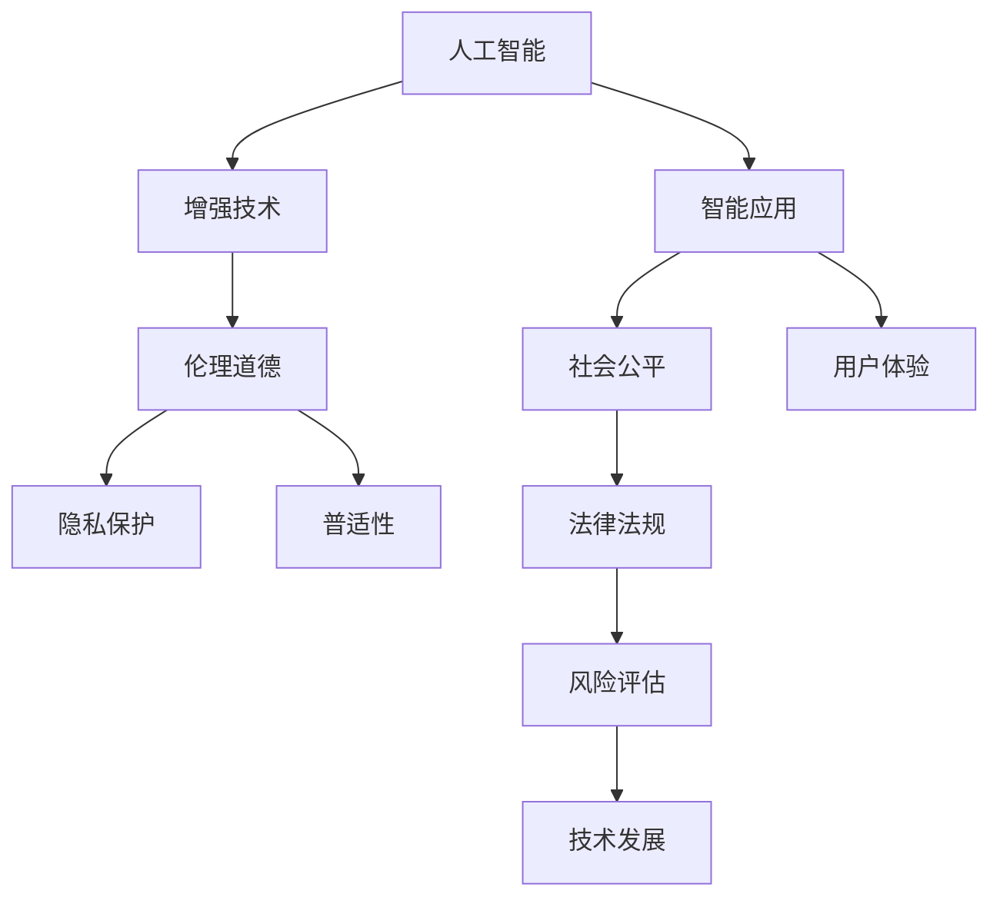

                 

# AI时代的人类增强：道德考虑与身体增强的未来发展机遇挑战机遇

> 关键词：人工智能,增强技术,人类增强,伦理道德,应用前景,风险挑战

## 1. 背景介绍

### 1.1 问题由来

随着人工智能（AI）技术的飞速发展，人工智能辅助的人类增强技术正在成为推动人类社会进步的重要力量。通过将AI技术应用于医疗、教育、体育等多个领域，人工智能不仅可以辅助人们实现超常能力，还可以在许多场景下改善人们的生活质量。然而，人类增强技术的广泛应用也带来了诸多伦理道德问题，这些问题涉及隐私保护、个人身份、社会公平等多个层面。

面对这些挑战，本文将系统探讨AI时代人类增强技术的应用前景和伦理道德问题，为人类增强技术的健康发展提供有价值的见解。

### 1.2 问题核心关键点

人工智能辅助的人类增强技术主要包含三个方面：

1. **基于AI的身体增强**：通过植入芯片、外置设备等方式提升人体的各项能力，如增强视力、听力、智力等。
2. **基于AI的环境增强**：通过智能家居、智能交通等技术改善人类的生活环境，提升生活质量。
3. **基于AI的心理增强**：通过AI辅助心理治疗、脑机接口等方式改善心理健康状态，提升情感体验。

这些问题核心关键点在于：

- 如何平衡技术进步与伦理道德，避免技术滥用带来的负面影响？
- 如何确保技术的普适性，避免社会不公和贫富差距的扩大？
- 如何在提升个人能力的同时，保护用户隐私和数据安全？
- 如何建立合理的法律法规，保障技术应用的安全性和公平性？

## 2. 核心概念与联系

### 2.1 核心概念概述

为更好地理解AI时代的人类增强技术，本节将介绍几个关键概念及其之间的联系：

- **人工智能（AI）**：指通过算法、计算等手段模拟人类智能的技术。
- **增强技术（Augmentation Technology）**：通过技术手段提升人类在特定领域的性能，如增强视力、智力、身体能力等。
- **伦理道德（Ethical Morality）**：涉及个体、社会、环境等方面的道德规范和伦理准则。
- **隐私保护（Privacy Protection）**：保护个人数据的隐私和安全，避免未经授权的获取和泄露。
- **普适性（Accessibility）**：确保技术的普及和应用不因个体或群体的经济、社会背景而受限。

这些核心概念之间的联系可以通过以下Mermaid流程图来展示：



这个流程图展示了一体化的人类增强技术的构建框架：

1. 人工智能通过技术手段提升人类能力，产生智能应用。
2. 智能应用在提升人类能力的同时，需要遵循伦理道德规范，确保技术应用的安全性和公平性。
3. 隐私保护和普适性作为关键技术应用的前提，需要与智能应用紧密结合。
4. 法律法规和风险评估为技术应用的保障，确保技术的健康发展。

这些概念共同构成了AI时代人类增强技术的核心框架，使得技术在提升人类能力的同时，也能保证社会和个体的安全与公平。

## 3. 核心算法原理 & 具体操作步骤

### 3.1 算法原理概述

基于AI的人类增强技术通常通过机器学习、神经网络等算法进行实现。其核心原理包括：

- **数据采集**：通过传感器、摄像头、穿戴设备等手段，获取人体或环境的数据。
- **数据预处理**：对采集到的数据进行清洗、滤波、归一化等处理，提高数据质量。
- **模型训练**：使用深度学习算法，对处理后的数据进行模型训练，产生增强效果。
- **模型部署**：将训练好的模型应用于实际场景，实现增强效果。

### 3.2 算法步骤详解

以基于AI的身体增强技术为例，算法步骤如下：

1. **数据采集**：通过摄像头、传感器等设备，采集人体生物信号，如心率、脑电波等。
2. **数据预处理**：对采集到的生物信号进行滤波、归一化处理，去除噪声和异常值。
3. **模型训练**：使用深度学习算法，如卷积神经网络（CNN）、长短期记忆网络（LSTM）等，对处理后的数据进行训练，得到增强模型。
4. **模型部署**：将训练好的模型应用于实际场景，如通过植入芯片、外置设备等方式，实现增强效果。

### 3.3 算法优缺点

基于AI的人类增强技术具有以下优点：

- **提升性能**：通过技术手段提升人体的各项能力，显著改善人类在特定领域的表现。
- **便携易用**：设备小巧，携带方便，使用简单，无需复杂的安装和调试。
- **实时反馈**：通过实时反馈机制，用户可以及时了解自身状态，并进行相应调整。

然而，该技术也存在以下缺点：

- **依赖设备**：需要依赖特定的硬件设备，设备故障或失效可能影响增强效果。
- **隐私风险**：采集和存储大量生物数据，存在数据泄露和隐私侵犯的风险。
- **技术复杂**：涉及复杂的算法和数据处理过程，非专业人士难以掌握和调试。

### 3.4 算法应用领域

基于AI的人类增强技术在多个领域都有广泛的应用，例如：

- **医疗**：通过植入芯片、外置设备等方式，增强视力、听力等感知能力，改善手术操作等。
- **教育**：通过智能学习系统、脑机接口等方式，提升学习效率和记忆力，实现个性化教育。
- **体育**：通过智能训练设备、外置设备等方式，提升体能、反应速度等，提高运动员的竞技水平。
- **娱乐**：通过虚拟现实（VR）、增强现实（AR）等技术，提升沉浸式体验和互动性。

## 4. 数学模型和公式 & 详细讲解

### 4.1 数学模型构建

以基于AI的身体增强技术为例，设采集到的人体生物信号为 $X$，增强模型为 $M$，增强效果为 $Y$。则数学模型为：

$$ Y = M(X) $$

其中，$M$ 为一个深度学习模型，通过训练得到。

### 4.2 公式推导过程

以神经网络为例，模型的前向传播过程可以表示为：

$$ h_1 = W_1 x + b_1 $$
$$ h_2 = \sigma(h_1) $$
$$ y = W_2 h_2 + b_2 $$

其中，$W$ 为权重矩阵，$b$ 为偏置向量，$\sigma$ 为激活函数。

模型的反向传播过程可以表示为：

$$ \frac{\partial y}{\partial W_2} = \frac{\partial y}{\partial h_2} \frac{\partial h_2}{\partial h_1} \frac{\partial h_1}{\partial x} $$
$$ \frac{\partial y}{\partial b_2} = \frac{\partial y}{\partial h_2} $$

其中，$\frac{\partial y}{\partial h_2}$ 可以通过链式法则进一步递归展开，利用自动微分技术完成计算。

### 4.3 案例分析与讲解

以增强视力的AI技术为例，采集的人体生物信号为眼动数据，模型训练数据为带有标签的眼动数据。通过训练得到增强模型后，应用到实际场景，可以实现视力的增强。

## 5. 项目实践：代码实例和详细解释说明

### 5.1 开发环境搭建

在进行AI增强技术开发前，需要准备好开发环境。以下是使用Python进行PyTorch开发的环境配置流程：

1. 安装Anaconda：从官网下载并安装Anaconda，用于创建独立的Python环境。

2. 创建并激活虚拟环境：
```bash
conda create -n ai-env python=3.8 
conda activate ai-env
```

3. 安装PyTorch：根据CUDA版本，从官网获取对应的安装命令。例如：
```bash
conda install pytorch torchvision torchaudio cudatoolkit=11.1 -c pytorch -c conda-forge
```

4. 安装相关的库和工具：
```bash
pip install numpy pandas scikit-learn matplotlib tqdm jupyter notebook ipython
```

完成上述步骤后，即可在`ai-env`环境中开始AI增强技术的开发实践。

### 5.2 源代码详细实现

以下是使用PyTorch实现基于AI的身体增强技术的代码示例：

```python
import torch
import torch.nn as nn
import torch.optim as optim
from torch.utils.data import DataLoader, Dataset
import numpy as np
import matplotlib.pyplot as plt

# 定义数据集
class EnhancedDataset(Dataset):
    def __init__(self, x_data, y_data):
        self.x_data = x_data
        self.y_data = y_data
        
    def __len__(self):
        return len(self.x_data)
    
    def __getitem__(self, idx):
        x = torch.tensor(self.x_data[idx])
        y = torch.tensor(self.y_data[idx])
        return x, y

# 定义模型
class EnhancedModel(nn.Module):
    def __init__(self, input_size, hidden_size, output_size):
        super(EnhancedModel, self).__init__()
        self.hidden = nn.Linear(input_size, hidden_size)
        self.relu = nn.ReLU()
        self.output = nn.Linear(hidden_size, output_size)
    
    def forward(self, x):
        x = self.hidden(x)
        x = self.relu(x)
        x = self.output(x)
        return x

# 定义训练函数
def train_model(model, train_loader, optimizer, criterion, num_epochs):
    model.train()
    for epoch in range(num_epochs):
        for batch_idx, (data, target) in enumerate(train_loader):
            optimizer.zero_grad()
            output = model(data)
            loss = criterion(output, target)
            loss.backward()
            optimizer.step()
            if (batch_idx+1) % 100 == 0:
                print(f'Epoch [{epoch+1}/{num_epochs}], Batch [{batch_idx+1}/{len(train_loader)}], Loss: {loss.item()}')

# 加载数据
x_data = np.random.rand(1000, 100)
y_data = np.random.rand(1000, 10)
dataset = EnhancedDataset(x_data, y_data)
train_loader = DataLoader(dataset, batch_size=32, shuffle=True)

# 初始化模型和优化器
model = EnhancedModel(100, 128, 10)
criterion = nn.MSELoss()
optimizer = optim.Adam(model.parameters(), lr=0.001)

# 训练模型
train_model(model, train_loader, optimizer, criterion, num_epochs=100)

# 评估模型
model.eval()
with torch.no_grad():
    test_data = np.random.rand(100, 100)
    test_loader = DataLoader(EnhancedDataset(test_data, np.random.rand(100, 10)), batch_size=32, shuffle=True)
    for batch_idx, (data, target) in enumerate(test_loader):
        output = model(data)
        print(f'Test Loss: {torch.mean((output - target)**2).item()}')
```

### 5.3 代码解读与分析

让我们再详细解读一下关键代码的实现细节：

**EnhancedDataset类**：
- `__init__`方法：初始化数据集，包括输入和标签。
- `__len__`方法：返回数据集的样本数量。
- `__getitem__`方法：对单个样本进行处理，将输入和标签转换为Tensor格式。

**EnhancedModel类**：
- `__init__`方法：定义神经网络结构，包括输入、隐藏、输出层。
- `forward`方法：定义前向传播过程，通过线性变换和激活函数得到输出。

**训练函数**：
- 使用PyTorch的DataLoader对数据集进行批次化加载，供模型训练和推理使用。
- 在每个epoch内，对每个batch进行前向传播和反向传播，更新模型参数。
- 在每个batch结束后，打印当前epoch的损失值。

**测试函数**：
- 将模型设置为评估模式，不更新参数。
- 对测试集进行迭代，计算模型在测试集上的表现。

通过这些代码，可以直观地理解基于AI的身体增强技术的实现过程。开发者可以将更多精力放在数据处理、模型改进等高层逻辑上，而不必过多关注底层的实现细节。

当然，工业级的系统实现还需考虑更多因素，如模型的保存和部署、超参数的自动搜索、更灵活的任务适配层等。但核心的训练范式基本与此类似。

## 6. 实际应用场景

### 6.1 医疗

在医疗领域，基于AI的身体增强技术可以应用于多个方面，如辅助手术、康复训练、诊断辅助等。例如，通过植入芯片、外置设备等方式，增强医生的手术操作能力，提高手术成功率和患者满意度。

### 6.2 教育

在教育领域，基于AI的身体增强技术可以应用于个性化教育、智能辅导、语音识别等方面。例如，通过智能学习系统，为学生提供个性化的学习计划和建议，提高学习效率和成果。

### 6.3 体育

在体育领域，基于AI的身体增强技术可以应用于体能训练、运动恢复、比赛分析等方面。例如，通过智能训练设备，提高运动员的体能和反应速度，优化训练方案。

### 6.4 娱乐

在娱乐领域，基于AI的身体增强技术可以应用于虚拟现实（VR）、增强现实（AR）、游戏等方面。例如，通过虚拟现实技术，为玩家提供沉浸式的游戏体验，提升互动性和趣味性。

## 7. 工具和资源推荐

### 7.1 学习资源推荐

为了帮助开发者系统掌握AI增强技术的应用场景和实现方法，这里推荐一些优质的学习资源：

1. Coursera《Deep Learning》课程：斯坦福大学开设的深度学习明星课程，涵盖深度学习基础和前沿应用，适合零基础学习。
2. PyTorch官方文档：PyTorch的官方文档，提供了详尽的API和示例代码，是上手实践的重要参考资料。
3. TensorFlow官方文档：TensorFlow的官方文档，提供了丰富的API和样例代码，适合深度学习框架的初学者。
4. Google AI Blog：谷歌人工智能团队的博客，涵盖了最新的AI技术和应用实践，提供丰富的案例和经验分享。
5. arXiv.org：国际顶级的预印本论文平台，提供最新的AI研究成果，适合深度学习研究的进阶阅读。

通过对这些资源的学习实践，相信你一定能够快速掌握AI增强技术的基本原理和实现方法，并用于解决实际的AI问题。

### 7.2 开发工具推荐

高效的开发离不开优秀的工具支持。以下是几款用于AI增强技术开发的常用工具：

1. PyTorch：基于Python的开源深度学习框架，灵活动态的计算图，适合快速迭代研究。
2. TensorFlow：由Google主导开发的开源深度学习框架，生产部署方便，适合大规模工程应用。
3. Jupyter Notebook：交互式编程工具，支持Python等多种编程语言，适合数据处理和模型训练。
4. TensorBoard：TensorFlow配套的可视化工具，可实时监测模型训练状态，并提供丰富的图表呈现方式。
5. Visual Studio Code：轻量级的代码编辑器，支持多种编程语言和插件，适合快速开发和调试。

合理利用这些工具，可以显著提升AI增强技术的开发效率，加快创新迭代的步伐。

### 7.3 相关论文推荐

AI增强技术的发展源于学界的持续研究。以下是几篇奠基性的相关论文，推荐阅读：

1. "DeepMind Health: Extending DeepMind into Healthcare and Life Sciences"：DeepMind在医疗领域的应用，展示了AI技术在医疗诊断、药物研发等方面的潜力。
2. "Scalable Decentralized Machine Learning"：Google关于分布式机器学习的研究，展示了AI技术在医疗、教育、娱乐等领域的应用前景。
3. "Human-AI Collaboration: AI Enhancing Human Creativity, Performance, and Well-being"：斯坦福大学关于AI增强技术的研究，展示了AI技术在提升人类能力、改善生活质量等方面的应用。

这些论文代表了大AI增强技术的发展脉络。通过学习这些前沿成果，可以帮助研究者把握学科前进方向，激发更多的创新灵感。

## 8. 总结：未来发展趋势与挑战

### 8.1 总结

本文对AI时代的人类增强技术进行了全面系统的介绍。首先阐述了AI增强技术的应用前景和伦理道德问题，明确了在提升人类能力的同时，需要注意的技术、伦理和社会层面的平衡。其次，从原理到实践，详细讲解了基于AI的身体增强技术的数学模型和实现方法，提供了完整的代码示例和解释。同时，本文还广泛探讨了AI增强技术在医疗、教育、体育等多个领域的应用场景，展示了技术的巨大潜力。

通过本文的系统梳理，可以看到，基于AI的身体增强技术正在成为推动人类社会进步的重要力量。然而，技术的发展也带来了诸多挑战，如何在提升人类能力的同时，保护用户隐私和数据安全，避免技术滥用带来的负面影响，是未来技术发展的关键。

### 8.2 未来发展趋势

展望未来，AI增强技术将呈现以下几个发展趋势：

1. **技术普及**：AI增强技术将逐渐普及到更多行业和场景，为人们提供更多便捷、高效的服务。
2. **伦理规范**：随着技术应用的普及，相关伦理规范和法律法规将逐步完善，确保技术的健康发展。
3. **人机协同**：AI增强技术将更多地与人类合作，而非取代人类，实现人机协同的智能系统。
4. **个性化定制**：AI增强技术将更多地关注个体需求，实现个性化定制和优化，提高用户体验。
5. **跨领域融合**：AI增强技术将与物联网、大数据、区块链等新兴技术进行深度融合，实现更广泛的应用场景。

以上趋势凸显了AI增强技术的广阔前景。这些方向的探索发展，必将进一步提升AI技术的应用效果，为人类社会带来更多的福祉。

### 8.3 面临的挑战

尽管AI增强技术已经取得了瞩目成就，但在迈向更加智能化、普适化应用的过程中，它仍面临着诸多挑战：

1. **隐私保护**：采集和存储大量生物数据，存在数据泄露和隐私侵犯的风险。如何保护用户隐私，避免未经授权的获取和泄露，将是未来的重要课题。
2. **伦理道德**：AI增强技术的广泛应用可能导致社会不公和贫富差距的扩大。如何确保技术的普适性，避免技术滥用带来的负面影响，将是未来的重要课题。
3. **技术复杂**：涉及复杂的算法和数据处理过程，非专业人士难以掌握和调试。如何降低技术门槛，提升技术易用性，将是未来的重要课题。
4. **法律监管**：相关法律法规尚未完全健全，如何制定合理的法律法规，保障技术应用的安全性和公平性，将是未来的重要课题。

这些挑战凸显了AI增强技术发展过程中的复杂性和多维度性，需要在技术、伦理、法律等多个层面协同推进，方能确保技术的健康发展。

### 8.4 研究展望

面对AI增强技术所面临的诸多挑战，未来的研究需要在以下几个方面寻求新的突破：

1. **隐私保护技术**：研究更加高效、安全的隐私保护算法和技术，确保数据采集、存储、传输的安全性。
2. **伦理道德研究**：建立更加完善的伦理道德规范体系，确保技术应用的公正性和公平性。
3. **技术易用性提升**：研究更加简单、易用的技术应用接口和开发工具，降低技术门槛。
4. **法律监管研究**：制定合理的法律法规，保障技术应用的安全性和公平性。

这些研究方向的探索，必将引领AI增强技术的健康发展，为人类社会带来更多的福祉。总之，AI增强技术需要各领域协同发力，才能真正实现技术的普适性和公平性，造福全人类。

## 9. 附录：常见问题与解答

**Q1：AI增强技术是否适用于所有人群？**

A: AI增强技术通常适用于身体、智能等方面有特殊需求的人群。然而，对于一些高风险、高技术门槛的应用，如脑机接口、基因编辑等，需要进一步的伦理和社会讨论，确保技术应用的安全性和普适性。

**Q2：AI增强技术是否会带来新的社会不公？**

A: AI增强技术的普及可能带来社会不公的问题。一些高收入群体可能更容易获得先进的技术手段，从而在教育、医疗等方面获得更多优势。为了确保技术的普适性，需要制定合理的法律法规，确保技术应用的公平性。

**Q3：AI增强技术是否会取代人类？**

A: AI增强技术旨在提升人类的能力，而不是取代人类。未来的人机协同智能系统将更多地与人类合作，而非取代人类。通过AI技术的辅助，人类可以更加高效、准确地完成任务。

**Q4：AI增强技术是否存在技术滥用的风险？**

A: AI增强技术存在技术滥用的风险。一些技术手段可能被用于不法用途，如监控、控制等。为了确保技术应用的安全性，需要建立合理的法律法规，确保技术应用的合法性。

**Q5：AI增强技术是否存在技术风险？**

A: AI增强技术存在技术风险，如设备故障、算法漏洞等。为了确保技术应用的可靠性，需要在技术开发和应用过程中进行严格的测试和验证。

---

作者：禅与计算机程序设计艺术 / Zen and the Art of Computer Programming

