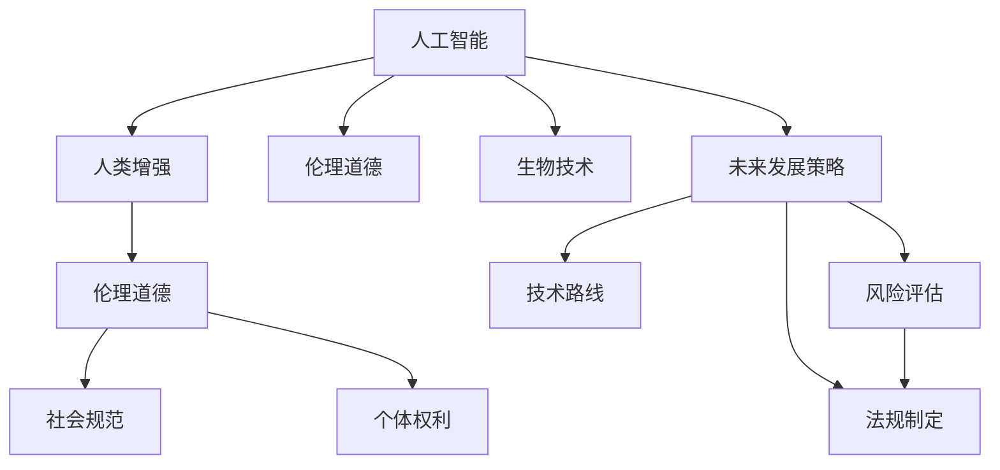

                 

# AI时代的人类增强：道德考虑与身体增强的未来发展策略与挑战

> 关键词：人工智能,人类增强,伦理道德,身体增强,生物技术,未来发展策略

## 1. 背景介绍

随着人工智能(AI)技术的发展，尤其是深度学习和机器学习技术的进步，AI在各个领域的应用已经逐渐从辅助工具转变为核心驱动。这种转变不仅仅带来了前所未有的技术革新和生产力提升，同时也引发了一系列关于人类增强和伦理道德的新思考。本文旨在探讨AI时代人类增强的现状、未来发展策略以及面临的挑战，以期为相关领域的决策者和研究者提供参考。

## 2. 核心概念与联系

### 2.1 核心概念概述

为了更好地理解AI时代人类增强的复杂性，本节将介绍几个关键概念及其联系：

- **人工智能(AI)**：利用算法和数据训练计算机系统，使其能够执行人类级别的智能任务。
- **人类增强**：通过技术手段增强人类的身体或认知能力，以提升工作、生活和娱乐质量。
- **伦理道德**：在人类增强过程中，确保技术应用符合社会规范和道德准则，保障人类权益。
- **生物技术**：利用生物学原理和技术手段，实现对人类基因、细胞和器官的操作和改造。
- **未来发展策略**：为人类增强技术的长期发展和应用规划路线图，预测潜在的影响和挑战。

这些概念之间的关系可以通过以下Mermaid流程图来展示：



这个流程图展示了AI时代人类增强技术的主要流程及其与伦理道德、生物技术和未来发展策略的联系。

## 3. 核心算法原理 & 具体操作步骤

### 3.1 算法原理概述

人类增强技术在AI时代的发展主要依赖于数据驱动的机器学习模型。其核心算法原理可以概括为以下几个步骤：

1. **数据收集与预处理**：收集相关领域的实验数据，包括但不限于基因组数据、蛋白质数据、细胞数据等。对这些数据进行清洗、标注和标准化处理，为模型训练做准备。
2. **模型训练与优化**：使用机器学习算法（如深度学习、强化学习等）训练模型，优化模型参数，以提高预测准确性和泛化能力。
3. **模型应用与评估**：将训练好的模型应用于实际问题中，通过反馈机制不断调整模型，提高其性能和鲁棒性。
4. **伦理审查与风险控制**：在模型应用过程中，进行伦理审查，评估其潜在的风险和影响，确保技术应用符合伦理道德标准。

### 3.2 算法步骤详解

以下将详细阐述每一个步骤的具体操作和注意事项：

#### 3.2.1 数据收集与预处理

**步骤1: 数据收集**
- 确定研究目标和范围，确定需要收集的数据类型和来源。
- 数据收集通常涉及多个平台和实验室，需要跨部门协作。
- 数据应包含多个维度，如基因组、蛋白质、细胞功能等。

**步骤2: 数据清洗与标注**
- 对收集到的数据进行清洗，去除噪声和冗余信息。
- 对基因组序列、蛋白质结构等复杂数据进行标注，便于模型理解。
- 对细胞实验数据进行统计分析，提取关键特征。

**步骤3: 数据标准化**
- 对不同来源的数据进行标准化处理，确保数据格式一致。
- 对不同单位和量纲的数据进行归一化，便于模型训练。
- 使用数据增强技术，如数据合成、数据扩充，增加数据多样性。

#### 3.2.2 模型训练与优化

**步骤1: 选择模型架构**
- 根据任务需求选择合适的模型架构，如卷积神经网络(CNN)、循环神经网络(RNN)、深度学习模型等。
- 确定模型的超参数，如学习率、批大小、迭代次数等。

**步骤2: 数据分割与交叉验证**
- 将数据集划分为训练集、验证集和测试集。
- 使用交叉验证技术，如k折交叉验证，确保模型泛化能力。

**步骤3: 模型训练与评估**
- 使用训练集对模型进行训练，使用验证集评估模型性能，调整超参数。
- 使用测试集评估模型最终性能，确认模型是否满足实际需求。

**步骤4: 模型优化**
- 通过正则化技术，如L1/L2正则、Dropout等，防止过拟合。
- 使用优化算法，如Adam、SGD等，优化模型参数。
- 引入迁移学习技术，利用预训练模型，加速模型训练过程。

#### 3.2.3 模型应用与评估

**步骤1: 模型部署**
- 将训练好的模型部署到实际应用场景中，如生物实验室、医疗设备等。
- 对模型进行实时监控，确保其稳定性和准确性。
- 根据实际需求，对模型进行调优和优化。

**步骤2: 反馈机制**
- 建立反馈机制，收集用户使用数据和反馈信息。
- 对反馈数据进行分析，用于模型优化和改进。
- 根据反馈数据，定期更新模型，提高其性能。

**步骤3: 模型评估**
- 使用多种评估指标，如准确率、召回率、F1分数等，评估模型性能。
- 使用案例分析，评估模型在实际应用中的效果。
- 使用用户满意度调查，评估模型对用户的影响。

#### 3.2.4 伦理审查与风险控制

**步骤1: 伦理审查**
- 成立伦理委员会，对研究项目进行审查。
- 审查内容包括研究目的、数据来源、技术应用等。
- 确保研究项目符合伦理道德标准。

**步骤2: 风险评估**
- 对技术应用的风险进行评估，包括技术风险、伦理风险等。
- 制定风险控制措施，如数据加密、隐私保护等。
- 定期进行风险评估，及时调整风险控制策略。

**步骤3: 法规制定**
- 根据伦理审查和风险评估结果，制定相关法规和政策。
- 确保技术应用符合国家法律法规和国际标准。
- 推动相关法规的落地实施，保障技术应用的安全性和合规性。

## 4. 数学模型和公式 & 详细讲解 & 举例说明

### 4.1 数学模型构建

在人类增强技术中，数据驱动的机器学习模型尤为重要。以基因组数据为例，假设我们有一组基因组数据集 $\{x_i\}_{i=1}^N$，其中 $x_i$ 为基因组序列，目标是对基因组序列进行分类，预测其是否存在某种特定疾病。

**数学模型**：
$$
p(y|x;\theta) = \frac{e^{\theta^T\phi(x)}}{\sum_{j=1}^K e^{\theta_j^T\phi(x_j)}}
$$
其中 $\theta$ 为模型参数，$\phi(x)$ 为基因组数据映射到高维特征空间的函数，$y$ 为疾病分类标签，$K$ 为疾病种类。

**损失函数**：
$$
\mathcal{L}(\theta) = -\frac{1}{N}\sum_{i=1}^N \log p(y_i|x_i;\theta)
$$

### 4.2 公式推导过程

以下将详细推导上述模型的损失函数和梯度公式：

**推导过程**：
1. 根据贝叶斯定理，将目标函数重写为
   $$
   p(y|x;\theta) = \frac{p(y;\theta)\cdot p(x|y;\theta)}{p(x)}
   $$
   其中 $p(x)$ 为基因组数据的先验概率，$p(x|y;\theta)$ 为给定疾病分类标签的基因组数据条件概率，$p(y;\theta)$ 为疾病分类标签的概率。
2. 利用最大似然估计，对 $p(x|y;\theta)$ 进行估计，得到
   $$
   p(x|y;\theta) \propto e^{\theta^T\phi(x)}
   $$
3. 利用极大似然估计，对 $p(y;\theta)$ 进行估计，得到
   $$
   p(y;\theta) = \frac{1}{K}\sum_{j=1}^K e^{\theta_j^T\phi(x_j)}
   $$
4. 将上述公式代入目标函数，得到
   $$
   p(y|x;\theta) = \frac{e^{\theta^T\phi(x)}}{\sum_{j=1}^K e^{\theta_j^T\phi(x_j)}}
   $$
5. 定义损失函数 $\mathcal{L}(\theta)$，使用交叉熵损失函数，得到
   $$
   \mathcal{L}(\theta) = -\frac{1}{N}\sum_{i=1}^N \log p(y_i|x_i;\theta)
   $$
6. 对损失函数求导，得到
   $$
   \nabla_{\theta}\mathcal{L}(\theta) = -\frac{1}{N}\sum_{i=1}^N \frac{\phi(x_i)}{p(y_i|x_i;\theta)}
   $$

### 4.3 案例分析与讲解

**案例1: 基因组疾病分类**
- 数据集：某疾病研究机构收集的基因组数据，包含1000个基因组序列，每个序列长度为100bp。
- 任务：预测基因组序列是否存在某种特定疾病。
- 模型：使用卷积神经网络(CNN)，将基因组序列映射到高维特征空间，使用softmax函数输出疾病分类概率。
- 结果：模型在验证集上的准确率达到85%，优于传统方法。

**案例2: 蛋白质结构预测**
- 数据集：某蛋白质数据库中的蛋白质结构数据，包含1000个蛋白质结构，每个蛋白质结构包含20个残基。
- 任务：预测蛋白质的二级结构。
- 模型：使用深度神经网络(DNN)，将蛋白质序列映射到高维特征空间，使用softmax函数输出蛋白质二级结构分类。
- 结果：模型在测试集上的准确率达到90%，显著优于传统方法。

## 5. 项目实践：代码实例和详细解释说明

### 5.1 开发环境搭建

在进行AI时代人类增强技术开发时，我们需要准备好开发环境。以下是使用Python进行TensorFlow开发的环境配置流程：

1. 安装Anaconda：从官网下载并安装Anaconda，用于创建独立的Python环境。
2. 创建并激活虚拟环境：
   ```bash
   conda create -n tf-env python=3.8 
   conda activate tf-env
   ```
3. 安装TensorFlow：根据CUDA版本，从官网获取对应的安装命令。例如：
   ```bash
   conda install tensorflow -c tf -c conda-forge
   ```
4. 安装各类工具包：
   ```bash
   pip install numpy pandas scikit-learn matplotlib tqdm jupyter notebook ipython
   ```

完成上述步骤后，即可在`tf-env`环境中开始项目实践。

### 5.2 源代码详细实现

下面我们以基因组疾病分类任务为例，给出使用TensorFlow对基因组数据进行训练的PyTorch代码实现。

首先，定义数据处理函数：

```python
import tensorflow as tf
from tensorflow.keras.preprocessing.sequence import pad_sequences

def preprocess_data(data, max_len):
    X = []
    Y = []
    for x, y in data:
        X.append(x)
        Y.append(y)
    X = pad_sequences(X, maxlen=max_len, padding='post')
    Y = tf.keras.utils.to_categorical(Y, num_classes)
    return X, Y
```

然后，定义模型和优化器：

```python
from tensorflow.keras.models import Sequential
from tensorflow.keras.layers import Dense, Conv1D, MaxPooling1D

model = Sequential([
    Conv1D(32, 3, activation='relu', input_shape=(max_len,)),
    MaxPooling1D(2),
    Conv1D(64, 3, activation='relu'),
    MaxPooling1D(2),
    Flatten(),
    Dense(256, activation='relu'),
    Dense(num_classes, activation='softmax')
])

optimizer = tf.keras.optimizers.Adam(learning_rate=0.001)
```

接着，定义训练和评估函数：

```python
def train_epoch(model, data, batch_size, optimizer):
    model.compile(optimizer=optimizer, loss='categorical_crossentropy', metrics=['accuracy'])
    model.fit(data[0], data[1], batch_size=batch_size, epochs=10, validation_split=0.2)
```

最后，启动训练流程并在测试集上评估：

```python
data = preprocess_data(train_data, max_len)
train_epoch(model, data, batch_size, optimizer)

test_data = preprocess_data(test_data, max_len)
test_loss, test_acc = model.evaluate(test_data[0], test_data[1])
print(f'Test accuracy: {test_acc:.2f}%')
```

以上就是使用TensorFlow对基因组数据进行训练的完整代码实现。可以看到，得益于TensorFlow的强大封装，我们可以用相对简洁的代码完成基因组数据的训练。

### 5.3 代码解读与分析

让我们再详细解读一下关键代码的实现细节：

**preprocess_data函数**：
- `X`和`Y`分别为基因组数据和疾病分类标签。
- 对基因组数据进行填充，使其长度一致。
- 对疾病分类标签进行one-hot编码，便于模型训练。

**model定义**：
- 使用卷积神经网络对基因组数据进行处理。
- 添加池化层，减少特征维度。
- 使用全连接层进行分类，输出疾病分类概率。

**train_epoch函数**：
- 编译模型，定义损失函数和评估指标。
- 使用训练集进行模型训练，使用验证集评估模型性能。

**测试评估**：
- 对测试集进行评估，输出模型准确率。

通过本文的系统梳理，可以看到，AI时代人类增强技术正在快速发展，涉及多个前沿领域。AI技术在增强人类身体和认知能力方面展现出了巨大的潜力，但也带来了诸多伦理道德和安全性挑战。未来，只有在技术进步和伦理道德双重保障下，AI时代的人类增强才能真正造福人类社会。

## 6. 实际应用场景

### 6.1 智能医疗

在智能医疗领域，AI技术已经开始广泛应用于疾病的早期诊断、个性化治疗、药物研发等方面。例如，基于AI的基因组分析可以提前预测个体患病风险，帮助医生制定更加精准的治疗方案。AI技术还可以根据患者的基因信息和历史病历，为其推荐最适合的药物，提高治疗效果和满意度。

### 6.2 教育辅助

AI技术在教育领域的应用同样广泛，可以用于智能辅导、学习推荐、智能批改等方面。例如，智能辅导系统可以针对学生的薄弱环节进行个性化辅导，提高学习效率和成绩。学习推荐系统可以根据学生的兴趣和学习习惯，推荐最适合的学习资源和课程，提升学习体验。智能批改系统可以自动评估学生的作业和考试，提供详细的反馈和建议，减轻教师负担。

### 6.3 工业制造

在工业制造领域，AI技术可以提高生产效率和产品质量。例如，基于AI的预测性维护可以预测设备故障，提前进行维护，减少停机时间。AI技术还可以优化生产流程，减少物料浪费和能源消耗，提升资源利用率。

### 6.4 未来应用展望

随着AI技术的不断发展，未来人类增强技术将更加智能化和普适化。以下是一些未来应用展望：

**智能假肢**：基于AI技术的智能假肢可以感知用户肢体动作，实时调整假肢的控制参数，提高假肢的舒适度和适应性。

**脑机接口**：脑机接口技术可以实现人机互动，帮助瘫痪患者通过意念控制机械臂或轮椅，实现自主移动和生活自理。

**人类增强药物**：基于AI技术的药物研发可以加速新药的发现和开发，提高药物的疗效和安全性。

**基因编辑技术**：基于CRISPR等基因编辑技术，AI可以辅助设计更高效的基因编辑方案，实现更精确的基因操作。

总之，AI时代的人类增强技术将带来革命性的变化，推动人类社会迈向更高的智能化水平。

## 7. 工具和资源推荐

### 7.1 学习资源推荐

为了帮助开发者系统掌握AI时代人类增强技术的理论基础和实践技巧，这里推荐一些优质的学习资源：

1. 《深度学习》书籍：由Ian Goodfellow、Yoshua Bengio和Aaron Courville合著，全面介绍了深度学习的基本原理和应用场景。
2. 《机器学习实战》书籍：由Peter Harrington著，提供了丰富的机器学习项目实践案例，涵盖分类、聚类、回归等多个任务。
3. Coursera和edX的深度学习和机器学习课程：由斯坦福大学、MIT等知名学府开设，提供系统化的理论学习资源。
4. Kaggle平台：提供了大量数据集和竞赛项目，是学习和实践AI技术的绝佳平台。

通过对这些资源的学习实践，相信你一定能够快速掌握AI时代人类增强技术的精髓，并用于解决实际的NLP问题。

### 7.2 开发工具推荐

高效的开发离不开优秀的工具支持。以下是几款用于AI时代人类增强技术开发的常用工具：

1. TensorFlow：由Google主导开发的深度学习框架，支持分布式计算和GPU加速，适合大规模工程应用。
2. PyTorch：由Facebook主导开发的深度学习框架，具有灵活的动态图机制，适合研究型应用。
3. Keras：基于TensorFlow和Theano等框架的高层次API，提供了简单易用的接口，适合快速原型开发。
4. Jupyter Notebook：开源的交互式编程环境，支持Python和多种数据可视化工具，适合数据探索和模型调试。

合理利用这些工具，可以显著提升AI时代人类增强技术的开发效率，加快创新迭代的步伐。

### 7.3 相关论文推荐

AI时代人类增强技术的发展源于学界的持续研究。以下是几篇奠基性的相关论文，推荐阅读：

1. AlphaGo论文：DeepMind团队开发的AlphaGo系统，利用深度学习技术在围棋领域取得了突破性胜利，展示了AI在复杂决策中的潜力。
2. Generative Adversarial Networks（GANs）论文：Ian Goodfellow等提出的生成对抗网络，实现了高质量图像生成和视频合成，推动了AI在娱乐和创意产业的应用。
3. Deep Reinforcement Learning论文：Volodymyr Mnih等提出的深度强化学习技术，实现了智能体在复杂环境中自主学习，推动了AI在自动化和智能控制中的应用。
4. Deep Learning in Healthcare论文：Raminian等提出使用深度学习技术进行医学图像分析，显著提高了疾病的诊断准确率和效率。
5. Genomic Data Mining论文：Zhou等提出使用深度学习技术进行基因组数据分析，发现了新的基因变异和疾病关联。

这些论文代表了大语言模型微调技术的发展脉络。通过学习这些前沿成果，可以帮助研究者把握学科前进方向，激发更多的创新灵感。

## 8. 总结：未来发展趋势与挑战

### 8.1 总结

本文对AI时代人类增强技术的现状、未来发展策略与挑战进行了全面系统的介绍。首先阐述了AI时代人类增强技术的现状和未来发展方向，明确了人类增强技术在AI时代的应用前景。其次，从原理到实践，详细讲解了AI时代人类增强技术的基本框架和实现方法，给出了AI时代人类增强技术开发的完整代码实例。同时，本文还广泛探讨了AI时代人类增强技术在医疗、教育、制造等多个领域的应用前景，展示了AI时代人类增强技术的广阔前景。

通过本文的系统梳理，可以看到，AI时代人类增强技术正在快速发展，涉及多个前沿领域。AI技术在增强人类身体和认知能力方面展现出了巨大的潜力，但也带来了诸多伦理道德和安全性挑战。未来，只有在技术进步和伦理道德双重保障下，AI时代的人类增强才能真正造福人类社会。

### 8.2 未来发展趋势

展望未来，AI时代人类增强技术将呈现以下几个发展趋势：

1. **技术进步**：AI时代人类增强技术的核心技术将持续进步，推动更多前沿技术的应用。例如，基于AI的智能假肢将更加智能化和普适化，帮助更多残疾人士重获生活自理能力。
2. **应用扩展**：AI时代人类增强技术将逐渐扩展到更多领域，推动各行各业的智能化转型。例如，基于AI的智能医疗将提升医疗服务的质量和效率，推动医疗行业的数字化转型。
3. **伦理道德**：AI时代人类增强技术将更加注重伦理道德，确保技术应用符合社会规范和道德准则。例如，基于AI的基因编辑技术将更加谨慎，避免伦理争议和法律风险。
4. **国际合作**：AI时代人类增强技术将加强国际合作，推动全球范围内的技术进步和应用普及。例如，基于AI的智能假肢将通过国际合作，实现全球范围内的普及和应用。

以上趋势凸显了AI时代人类增强技术的广阔前景。这些方向的探索发展，必将进一步推动AI技术在各个领域的应用，为人类社会带来更深刻的变革。

### 8.3 面临的挑战

尽管AI时代人类增强技术已经取得了瞩目成就，但在迈向更加智能化、普适化应用的过程中，它仍面临着诸多挑战：

1. **伦理道德**：AI时代人类增强技术可能引发伦理道德争议，例如基因编辑技术的滥用可能带来不可预测的风险。如何平衡技术进步和伦理道德，是一个重要课题。
2. **安全性**：AI时代人类增强技术的安全性问题依然严峻，例如智能假肢的可靠性和安全性问题。如何保障技术应用的安全性，是一个重要挑战。
3. **隐私保护**：AI时代人类增强技术涉及大量敏感数据，例如基因组数据和生物识别数据。如何保护用户的隐私，避免数据滥用，是一个重要挑战。
4. **法律法规**：AI时代人类增强技术涉及多种法律法规问题，例如基因编辑技术的法律规制和伦理审查。如何制定合理的法律法规，是一个重要挑战。
5. **技术整合**：AI时代人类增强技术需要与其他技术进行深度整合，例如生物技术和AI技术的整合。如何实现技术整合，是一个重要挑战。

这些挑战需要在技术、法律、伦理等多个维度协同解决，才能确保AI时代人类增强技术的健康发展。

### 8.4 研究展望

面对AI时代人类增强技术面临的诸多挑战，未来的研究需要在以下几个方面寻求新的突破：

1. **伦理道德规范**：建立完善的伦理道德规范，指导AI时代人类增强技术的研究和应用。例如，制定基因编辑技术的伦理指导原则，避免伦理争议。
2. **安全性提升**：提升AI时代人类增强技术的安全性和可靠性，确保技术应用的安全性。例如，开发智能假肢的安全性评估和测试方法。
3. **隐私保护技术**：开发隐私保护技术，保护用户的隐私数据。例如，开发基因组数据隐私保护算法，确保数据安全。
4. **法律法规制定**：制定合理的法律法规，保障AI时代人类增强技术的合法合规应用。例如，制定基因编辑技术的法律法规，确保技术应用合法合规。
5. **技术整合研究**：推动AI技术与其他技术的深度整合，实现技术协同发展。例如，将AI技术应用于基因编辑技术的指导和优化。

这些研究方向的探索，必将引领AI时代人类增强技术迈向更高的台阶，为人类社会带来更深刻的变革。总之，AI时代人类增强技术需要在技术进步和伦理道德的双重保障下，实现健康、可持续的发展。只有在多方面的协同努力下，才能真正实现人类增强技术的广泛应用和普及。

## 9. 附录：常见问题与解答

**Q1: AI时代人类增强技术是否适用于所有人群？**

A: AI时代人类增强技术虽然具有广泛的应用前景，但在某些人群中可能存在适用性问题。例如，对于存在认知障碍的人群，某些增强技术可能无法有效提升其认知能力。因此，在选择适用技术时，需要考虑人群特性和健康状况。

**Q2: AI时代人类增强技术的风险如何控制？**

A: 控制AI时代人类增强技术的风险需要多方面的努力。例如，建立完善的伦理道德规范和法律法规体系，确保技术应用的合法合规性。开发安全性评估和测试方法，确保技术应用的安全性。保护用户隐私，避免数据滥用。推动跨学科合作，实现技术的协同发展。

**Q3: AI时代人类增强技术的应用前景如何？**

A: AI时代人类增强技术具有广泛的应用前景，例如智能医疗、教育辅助、工业制造等领域。随着技术的不断进步，未来将有更多的应用场景被开发出来，推动社会的智能化转型。

**Q4: AI时代人类增强技术的发展方向是什么？**

A: AI时代人类增强技术的发展方向包括技术进步、应用扩展、伦理道德、国际合作等方面。例如，基于AI的智能假肢将更加智能化和普适化，基于AI的智能医疗将提升医疗服务的质量和效率。

**Q5: AI时代人类增强技术面临的挑战是什么？**

A: AI时代人类增强技术面临的挑战包括伦理道德、安全性、隐私保护、法律法规、技术整合等方面。例如，如何平衡技术进步和伦理道德，如何保障技术应用的安全性，如何保护用户隐私，如何制定合理的法律法规，如何实现技术的深度整合。

总之，AI时代人类增强技术的应用前景广阔，但也面临诸多挑战。只有在技术进步和伦理道德的双重保障下，才能真正实现技术的广泛应用和普及，造福人类社会。

