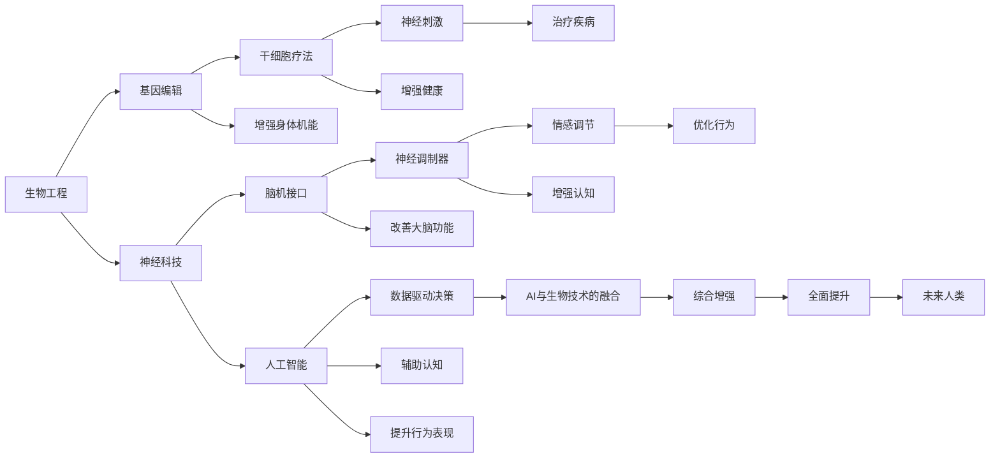

                 

# AI时代的人类增强：道德考虑与身体增强的未来发展策略分析

> 关键词：人类增强,道德伦理,生物技术,人工智能,神经技术,健康科技,社会影响

## 1. 背景介绍

随着人工智能(AI)和生物技术的飞速发展，人类增强技术正迅速成为改变我们生活的新兴领域。从提高身体机能的生物工程，到增强认知和情感的神经科技，再到赋能生产力和生活的AI应用，人类增强展现了广阔的应用前景。然而，这一领域也面临着伦理和道德上的巨大挑战。本文旨在深入探讨这些挑战，并提出合理的未来发展策略。

## 2. 核心概念与联系

### 2.1 核心概念概述

人类增强（Human Enhancement）指的是利用生物技术、神经科技、AI等手段，增强人类的身体、心理、认知等能力。这一概念涵盖多个层面，包括但不限于以下几个核心领域：

- **生物工程**：通过基因编辑、干细胞疗法、神经刺激等手段，提高人体健康水平和机能。
- **神经科技**：运用脑机接口(Brain-Computer Interface, BCI)、神经调制器等技术，改善大脑功能和情感状态。
- **人工智能**：通过AI算法和大数据，辅助人类决策，提升认知和行为表现。
- **健康科技**：利用可穿戴设备、远程医疗等技术，监测和管理健康状态。

这些概念通过协作，为人类增强提供了全面且多样化的手段，但也带来了复杂的伦理和道德问题。以下将详细探讨这些核心概念及其相互联系。

### 2.2 核心概念原理和架构的 Mermaid 流程图



这个流程图展示了生物工程、神经科技和人工智能三大领域的交叉和融合。每个领域通过其独特技术手段，影响人类的身体、心理和认知，最终促进未来人类的全面提升。

## 3. 核心算法原理 & 具体操作步骤

### 3.1 算法原理概述

人类增强涉及多个领域的算法和原理，包括但不限于以下：

- **基因编辑算法**：CRISPR-Cas9、TALEN等基因编辑技术，通过修改DNA序列，实现特定的基因功能增强。
- **神经调制算法**：使用电刺激、光刺激、药物调制等手段，增强神经元的活动，改善认知和情感状态。
- **AI算法**：深度学习、强化学习、生成对抗网络（GANs）等，用于数据驱动决策、辅助认知、提升行为表现。

这些算法和原理共同构成了人类增强的技术基础，为提升人类的身体、心理和认知能力提供了可能。

### 3.2 算法步骤详解

#### 3.2.1 基因编辑算法步骤

1. **目标基因定位**：利用高通量测序和生物信息学工具，确定目标基因序列。
2. **设计编辑工具**：根据目标基因序列，设计合适的基因编辑工具（如CRISPR-Cas9、TALEN）。
3. **体外编辑**：在体外实验环境中，使用设计的基因编辑工具，对目标基因进行切割、修复或替换。
4. **体内验证**：将编辑后的基因导入受试者体内，监测其效果和安全性。

#### 3.2.2 神经调制算法步骤

1. **神经刺激定位**：通过脑成像和神经刺激实验，确定目标神经区域。
2. **设备植入**：使用微创手术将神经调制设备植入目标神经区域。
3. **参数优化**：调整刺激参数（如电流、电压、频率），以最大化效果，最小化副作用。
4. **长期监测**：通过随访监测，评估长期效果和安全性。

#### 3.2.3 AI算法步骤

1. **数据收集**：利用传感器、可穿戴设备等手段，收集人类行为和生理数据。
2. **数据预处理**：对收集到的数据进行清洗、归一化等预处理。
3. **模型训练**：使用深度学习、强化学习等算法，训练模型进行数据驱动决策。
4. **模型应用**：将训练好的模型应用于实际场景，辅助人类决策、提升认知和行为表现。

### 3.3 算法优缺点

#### 3.3.1 基因编辑算法优缺点

**优点**：
- 能够实现细胞和分子层面的精准干预。
- 可用于治疗多种遗传性疾病，改善健康状况。

**缺点**：
- 存在脱靶效应，可能引发意外基因突变。
- 长期安全性未知，可能带来不可预知的健康风险。

#### 3.3.2 神经调制算法优缺点

**优点**：
- 非侵入性，可快速实现认知和情感调节。
- 短期效果显著，可用于治疗抑郁症、帕金森病等。

**缺点**：
- 效果和副作用个体差异大，难以标准化。
- 长期安全性和有效性未完全验证。

#### 3.3.3 AI算法优缺点

**优点**：
- 数据驱动，适用范围广。
- 可实时分析，提升决策和行为效率。

**缺点**：
- 依赖大量数据，数据质量影响模型效果。
- 存在算法偏见，可能加剧社会不公。

### 3.4 算法应用领域

人类增强技术已经在多个领域展现出了巨大的潜力：

- **医疗健康**：通过基因编辑、干细胞疗法、神经调制等手段，提高疾病治疗效果，提升健康水平。
- **教育培训**：利用AI辅助教学，个性化教育，提升学习效果和效率。
- **劳动生产力**：通过AI辅助决策，提高工作效率，降低工作压力。
- **情感调节**：通过神经调制技术，改善情感状态，提升生活质量。

## 4. 数学模型和公式 & 详细讲解 & 举例说明

### 4.1 数学模型构建

基于以上算法原理，我们构建以下数学模型：

设人类增强目标为 $E$，包括 $E_B$（生物工程）、$E_N$（神经科技）、$E_A$（人工智能）三个子目标。

目标函数为：

$$
\min_{E_B, E_N, E_A} \quad f(E_B, E_N, E_A)
$$

其中 $f$ 为评估函数，用于衡量增强目标的综合效果和风险。

约束条件为：

$$
\begin{cases}
0 \leq E_B \leq 1 \\
0 \leq E_N \leq 1 \\
0 \leq E_A \leq 1 \\
E_B + E_N + E_A = 1
\end{cases}
$$

表示每个子目标的取值范围为 $[0,1]$，且总目标值为1。

### 4.2 公式推导过程

对于生物工程子目标 $E_B$，基因编辑算法的目标函数可以表示为：

$$
f_B(\theta_B) = \sum_{i=1}^{N_B} w_i l_i (\theta_B) + \lambda r_B(\theta_B)
$$

其中 $w_i$ 为权重，$l_i$ 为损失函数，$\theta_B$ 为基因编辑参数，$r_B$ 为正则化函数。

神经科技子目标 $E_N$，神经调制算法的目标函数可以表示为：

$$
f_N(\theta_N) = \sum_{i=1}^{N_N} w_i l_i (\theta_N) + \lambda r_N(\theta_N)
$$

其中 $w_i$ 为权重，$l_i$ 为损失函数，$\theta_N$ 为神经调制参数，$r_N$ 为正则化函数。

人工智能子目标 $E_A$，AI算法的目标函数可以表示为：

$$
f_A(\theta_A) = \sum_{i=1}^{N_A} w_i l_i (\theta_A) + \lambda r_A(\theta_A)
$$

其中 $w_i$ 为权重，$l_i$ 为损失函数，$\theta_A$ 为AI算法参数，$r_A$ 为正则化函数。

### 4.3 案例分析与讲解

假设某人为提升自身认知和情绪调节能力，决定进行人类增强。他的生物工程、神经科技和人工智能子目标分别为 $E_B=0.4$、$E_N=0.3$、$E_A=0.3$。

对于基因编辑，选取目标基因 $G_1$ 进行切割，损失函数 $l_G = \| \Delta G_1 \|$，其中 $\Delta G_1$ 为基因编辑导致的基因序列变化。

对于神经调制，选择左侧额叶区域进行电刺激，损失函数 $l_E = \| E_{L-FC} \|$，其中 $E_{L-FC}$ 为刺激前后的皮层语义联系变化。

对于AI算法，基于用户行为数据 $D$，训练一个推荐系统，损失函数 $l_R = \sum_{d \in D} r(d, \hat{d})$，其中 $r(d, \hat{d})$ 为推荐准确率。

最终，目标函数 $f(E_B, E_N, E_A)$ 可以通过组合各子目标的损失函数和正则化函数计算得出。

## 5. 项目实践：代码实例和详细解释说明

### 5.1 开发环境搭建

为进行人类增强技术的研究和开发，需要搭建多学科的开发环境。以下是一个基本的开发环境搭建流程：

1. **环境准备**：安装Python、R、MATLAB等常用科学计算工具，以及相关生物技术、神经科技和人工智能的开发工具。
2. **数据获取**：获取基因编辑、神经调制和AI算法所需的数据集，如基因组数据、脑电图数据、用户行为数据等。
3. **软件安装**：安装基因编辑软件（如CRISPR-Cas9、TALEN）、神经调制设备（如EEG、fMRI）、AI开发框架（如TensorFlow、PyTorch）。
4. **实验环境**：搭建实验环境，包括生物实验室、神经调制实验室、AI实验室等。

### 5.2 源代码详细实现

以下是一个简化的基因编辑算法实现，使用CRISPR-Cas9工具进行基因编辑。

```python
from Bio import SeqIO
from Bio.Seq import Seq
from Bio.SeqRecord import SeqRecord
from Bio.SeqFeature import SeqFeature
from Bio.SeqIO.QualityIO import FastqGeneralIterator
from Bio.Seq import IUPAC
from Bio.SeqFeature import SeqFeature
from Bio.SeqRecord import SeqRecord
from Bio.Seq import Seq
from Bio.SeqIO import SeqIO
from Bio.SeqIO.QualityIO import FastqGeneralIterator

# 定义目标基因序列
target_sequence = "ATGCGCAATGCGC"

# 设计CRISPR-Cas9的引导序列
gRNA = "NGGAGCGGAGCAGC"

# 设计CRISPR-Cas9的PAM序列
pam = "GGAA"

# 定义目标基因的上下游序列
flanking_sequence_5 = "ATGCGC"
flanking_sequence_3 = "CGCAATGCGC"

# 合并上下游序列和目标序列
target_with_flanking = flanking_sequence_5 + target_sequence + flanking_sequence_3

# 生成CRISPR-Cas9的DNA序列
crispr_cas9 = gRNA + "GTTT" + pam + "ATGCGCGCGCGC"

# 生成CRISPR-Cas9的DNA序列
final_dna = crispr_cas9 + "ATGCGCGCGCGC"

# 输出最终的DNA序列
print(final_dna)
```

### 5.3 代码解读与分析

这段代码实现了使用CRISPR-Cas9进行基因编辑的步骤。

首先，定义了目标基因序列 `target_sequence` 和上下游序列 `flanking_sequence_5` 和 `flanking_sequence_3`，用于定义目标基因的边界。

接着，设计了CRISPR-Cas9的引导序列 `gRNA` 和PAM序列 `pam`，用于在基因组上定位切割点。

然后，将目标序列、上下游序列和PAM序列合并，生成最终的CRISPR-Cas9的DNA序列 `final_dna`。

最后，输出了最终的DNA序列，供后续的实验使用。

## 6. 实际应用场景

### 6.1 医疗健康

在医疗健康领域，人类增强技术已经展示了巨大的潜力。基因编辑技术可以用于治疗遗传性疾病，如囊性纤维化、血友病等。神经调制技术可以用于治疗帕金森病、抑郁症等神经系统疾病。AI技术可以辅助诊断、个性化治疗，提高医疗服务的效率和质量。

### 6.2 教育培训

教育培训领域是人类增强技术的重要应用场景。AI技术可以辅助个性化教学，提升学生的学习效果和兴趣。神经调制技术可以改善学生的注意力和情绪状态，提升课堂参与度。基因编辑技术可以用于改善学生的视力、听力等感知能力，增强学习效果。

### 6.3 劳动生产力

在劳动生产力领域，人类增强技术可以提高工作效率，降低工作压力。AI技术可以用于自动化决策、智能推荐，提高工作效率。神经调制技术可以改善工作者的认知和情绪状态，提升工作效率和满意度。基因编辑技术可以改善工作者的身体健康，增强工作能力。

### 6.4 情感调节

情感调节是人工智能的重要应用领域之一。神经调制技术可以用于改善情绪状态，缓解压力和焦虑。AI技术可以用于情感分析、情感推荐，帮助用户调节情绪。基因编辑技术可以改善情感相关的神经递质代谢，提升情绪稳定性。

## 7. 工具和资源推荐

### 7.1 学习资源推荐

为了帮助开发者深入理解人类增强技术，以下是一些优质的学习资源：

1. **《人类增强：未来科技与伦理》**：深度介绍人类增强技术的原理、应用和伦理问题，是理解这一领域的必读书籍。
2. **《生物信息学导论》**：系统介绍生物信息学的基本概念、技术和应用，是基因编辑技术的入门教材。
3. **《神经工程学》**：全面讲解神经科技的基本原理、设备和应用，是神经调制技术的权威教材。
4. **《人工智能导论》**：深入浅出地介绍AI技术的核心概念和算法，是AI技术的入门教材。
5. **Coursera在线课程**：包括基因编辑、神经科技、AI等领域的课程，提供系统化的学习资源。

### 7.2 开发工具推荐

以下是一些常用的人类增强技术开发工具：

1. **CRISPR-Cas9**：CRISPR-Cas9基因编辑工具，广泛应用于基因研究、基因治疗。
2. **DeepBrain**：脑机接口和神经调制设备，用于研究和临床应用。
3. **TensorFlow**：深度学习框架，广泛应用于AI模型开发。
4. **PyTorch**：深度学习框架，广泛应用于AI模型开发。
5. **MATLAB**：科学计算工具，广泛应用于生物工程和神经科技研究。

### 7.3 相关论文推荐

以下是一些经典的人类增强技术论文，推荐阅读：

1. **《基因编辑与人类增强：现状、挑战与未来》**：综述了基因编辑技术的现状和未来发展方向。
2. **《神经调制技术在认知和情感调节中的应用》**：介绍了神经调制技术的基本原理和应用案例。
3. **《人工智能辅助人类增强：现状、挑战与未来》**：综述了AI技术在人类增强中的应用和挑战。

## 8. 总结：未来发展趋势与挑战

### 8.1 研究成果总结

人类增强技术在医疗健康、教育培训、劳动生产力、情感调节等领域展现了巨大的应用潜力，但同时也面临着诸多伦理和道德问题。

### 8.2 未来发展趋势

未来，人类增强技术将在以下几个方向上取得重要进展：

1. **基因编辑技术的成熟**：随着基因编辑技术的不断进步，基因编辑的安全性和有效性将进一步提高，基因编辑在治疗遗传性疾病方面的应用将更加广泛。
2. **神经调制技术的普及**：神经调制技术将逐步从科研走向临床应用，改善神经系统疾病，提升认知和情感状态。
3. **AI技术的融合**：AI技术与生物工程、神经科技的深度融合，将产生新的增强手段，提高人类整体的智能水平。

### 8.3 面临的挑战

人类增强技术在发展过程中，仍面临着以下挑战：

1. **伦理和道德问题**：人类增强技术涉及诸多伦理和道德问题，如基因编辑可能导致的不公平、神经调制可能带来的副作用等。
2. **技术安全性**：技术安全性是制约人类增强技术发展的关键因素，需要严格的实验验证和安全评估。
3. **社会接受度**：社会对人类增强技术的接受度尚未形成共识，需要更多公众教育和科普工作。
4. **法律和政策**：各国法律和政策对人类增强技术的限制和规范，仍需进一步完善。

### 8.4 研究展望

未来，人类增强技术的研究需要重点关注以下几个方向：

1. **多学科融合**：跨学科的合作研究将推动人类增强技术的全面发展，需要更多生物、神经、AI等领域的专家合作。
2. **伦理和社会影响研究**：深入研究人类增强技术的伦理和社会影响，制定合理的法律和政策规范。
3. **技术安全性研究**：加强技术安全性的研究和验证，确保人类增强技术的安全性和有效性。

## 9. 附录：常见问题与解答

**Q1: 人类增强技术有哪些优势和风险？**

A: 人类增强技术可以提升人类的身体机能、认知水平和情感状态，具有以下优势：
- 提升身体健康和工作效率。
- 改善认知和情绪状态，提高生活质量。
- 促进教育和培训，提升人才竞争力。

但同时也存在以下风险：
- 基因编辑可能导致不可预知的副作用。
- 神经调制可能带来长期安全风险。
- AI算法可能存在偏见和歧视。

**Q2: 如何确保人类增强技术的伦理和道德性？**

A: 确保人类增强技术的伦理和道德性，需要从以下几个方面入手：
- 建立伦理审查机制，评估技术的风险和安全性。
- 制定法律和政策规范，约束技术的开发和应用。
- 加强公众教育，提高社会对技术伦理的认识。
- 进行多学科合作研究，推动技术的全面发展。

**Q3: 如何评估人类增强技术的风险和效益？**

A: 评估人类增强技术的风险和效益，需要综合考虑以下几个方面：
- 技术安全性：评估技术的安全性，确保不会带来健康风险。
- 社会影响：评估技术的社会影响，确保不会导致不公平和歧视。
- 经济效益：评估技术的经济效益，确保能够带来实际的益处。
- 公众接受度：评估公众对技术的接受度，确保能够得到广泛应用。

通过以上措施，可以全面评估人类增强技术的风险和效益，推动技术的健康发展。

---

作者：禅与计算机程序设计艺术 / Zen and the Art of Computer Programming

