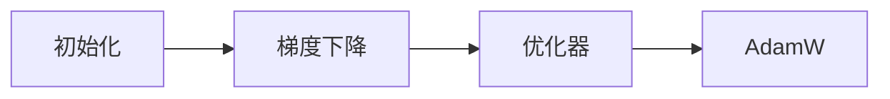

                 

# AI模型优化：从初始化到AdamW

> 关键词：初始化,梯度下降,优化器,AdamW,自适应学习率

## 1. 背景介绍

### 1.1 问题由来
随着深度学习技术的飞速发展，模型优化已成为人工智能模型开发的关键步骤。AI模型的优化过程包括参数初始化、梯度计算、损失函数计算、优化器选择等多个环节。这些环节的性能直接影响到模型的训练效率和最终效果。

### 1.2 问题核心关键点
- **参数初始化**：模型的参数初值直接影响训练速度和收敛性，初始值的选择对梯度更新的方向和幅度有重要影响。
- **梯度下降算法**：梯度下降算法是求解损失函数最小化的核心技术，包括批量梯度下降、随机梯度下降等。
- **优化器**：优化器用于调整模型参数，常见的包括SGD、Adagrad、Adam等。
- **AdamW优化器**：Adaptive Moment Estimation（Adam）是一种自适应学习率算法，结合权重衰减（Weight Decay），使其能够更好地处理大规模数据集和复杂模型。

## 2. 核心概念与联系

### 2.1 核心概念概述

为更好地理解AI模型优化的核心概念，本节将介绍几个关键概念：

- **参数初始化**：模型的初始参数设定，通常采用随机初始化，如Xavier、He等方法，以确保模型不会陷入局部最小值。
- **梯度下降算法**：通过计算损失函数对模型参数的梯度，更新模型参数以最小化损失函数。
- **优化器**：优化算法用于调整模型参数，通过不同的优化策略和技巧来加速收敛。
- **AdamW优化器**：结合了自适应学习率和权重衰减，在大规模数据集和复杂模型训练中表现优异。

### 2.2 核心概念原理和架构的 Mermaid 流程图



### 2.3 核心概念之间的联系

参数初始化、梯度下降和优化器之间存在紧密联系。参数初始化决定了梯度下降的起点，梯度下降的结果又通过优化器进行调整，以提高模型的收敛速度和稳定性。

## 3. 核心算法原理 & 具体操作步骤

### 3.1 算法原理概述

AI模型优化主要包括参数初始化、梯度下降和优化器选择三个核心环节。这些环节相互协作，共同优化模型参数，使其在损失函数最小化的过程中不断逼近最优解。

### 3.2 算法步骤详解

#### 3.2.1 参数初始化
参数初始化是模型优化的第一步，直接影响后续的梯度更新和优化效果。常用的初始化方法包括：

- **Xavier初始化**：根据每一层输入输出神经元的数量，计算每个参数的初始值，以保持梯度传播过程中的稳定性和收敛性。
- **He初始化**：对于ReLU等激活函数，He初始化在计算初始值时，采用方差为2的标准差。
- **Glorot初始化**：与Xavier类似，但更适合于有对称权重共享的模型。

#### 3.2.2 梯度下降算法
梯度下降算法通过计算损失函数对模型参数的梯度，更新模型参数，使损失函数最小化。常见的梯度下降算法包括：

- **批量梯度下降（Batch Gradient Descent, BGD）**：对整个数据集计算梯度，计算开销大，但收敛速度较慢。
- **随机梯度下降（Stochastic Gradient Descent, SGD）**：每次迭代只随机选择一个样本计算梯度，计算速度快，但收敛性较差。
- **小批量梯度下降（Mini-batch Gradient Descent）**：介于BGD和SGD之间，随机性适中，计算开销适中。

#### 3.2.3 优化器
优化器通过调整学习率、动量等参数，优化梯度更新，提高模型收敛速度和稳定性。常见的优化器包括：

- **随机梯度下降（SGD）**：基本优化器，每次迭代更新参数。
- **Adagrad**：自适应学习率，根据历史梯度调整学习率，适应性较强。
- **Adam**：结合动量和自适应学习率，表现优异，但计算开销较大。

### 3.3 算法优缺点

#### 3.3.1 参数初始化
**优点**：
- 防止梯度消失或爆炸，提高模型稳定性。
- 可加速模型收敛，避免陷入局部最小值。

**缺点**：
- 初始值选择不当可能导致梯度更新方向错误，影响模型收敛。
- 不同网络结构需要不同的初始化方法，增加了调参的复杂性。

#### 3.3.2 梯度下降算法
**优点**：
- 简单直观，易于理解和实现。
- 适用于小规模数据集和简单模型。

**缺点**：
- 计算开销大，效率较低。
- 容易陷入局部最优解，需要调参来平衡收敛速度和稳定性。

#### 3.3.3 优化器
**优点**：
- 自适应调整学习率，提高模型收敛速度。
- 结合动量等技术，提高稳定性。

**缺点**：
- 计算复杂度高，适合大规模数据集和复杂模型。
- 需要调参，不同的优化器适用场景不同。

### 3.4 算法应用领域

AI模型优化算法在多个领域有广泛应用，例如：

- **计算机视觉**：用于训练卷积神经网络（CNN），实现图像分类、物体检测等任务。
- **自然语言处理**：用于训练循环神经网络（RNN）、Transformer等模型，实现文本生成、机器翻译等任务。
- **语音识别**：用于训练卷积神经网络（CNN）和循环神经网络（RNN），实现语音识别和文本转写。
- **推荐系统**：用于训练神经网络模型，实现个性化推荐、广告推荐等任务。

## 4. 数学模型和公式 & 详细讲解 & 举例说明

### 4.1 数学模型构建

AI模型的优化过程可以形式化表示为：

$$
\min_{\theta} \mathcal{L}(\theta) \text{ where } \mathcal{L}(\theta) = \frac{1}{N}\sum_{i=1}^N \ell(y_i, M_{\theta}(x_i))
$$

其中，$\theta$ 表示模型参数，$\mathcal{L}(\theta)$ 表示损失函数，$\ell(y_i, M_{\theta}(x_i))$ 表示单个样本的损失函数。

### 4.2 公式推导过程

#### 4.2.1 批量梯度下降（BGD）
批量梯度下降的公式为：

$$
\theta_{t+1} = \theta_t - \eta \nabla_{\theta} \mathcal{L}(\theta_t)
$$

其中，$\eta$ 为学习率，$\nabla_{\theta} \mathcal{L}(\theta_t)$ 为损失函数对参数的梯度。

#### 4.2.2 随机梯度下降（SGD）
随机梯度下降的公式为：

$$
\theta_{t+1} = \theta_t - \eta \nabla_{\theta} \mathcal{L}(\theta_t; x_t)
$$

其中，$x_t$ 为随机选择的样本。

#### 4.2.3 AdamW优化器
AdamW优化器的公式为：

$$
m_t = \beta_1 m_{t-1} + (1-\beta_1) g_t \\
v_t = \beta_2 v_{t-1} + (1-\beta_2) g_t^2 \\
\hat{m}_t = \frac{m_t}{1-\beta_1^t} \\
\hat{v}_t = \frac{v_t}{1-\beta_2^t} \\
\theta_{t+1} = \theta_t - \eta \frac{\hat{m}_t}{\sqrt{\hat{v}_t}+\epsilon} 
$$

其中，$m_t$ 和 $v_t$ 分别表示动量和梯度平方的指数移动平均，$\beta_1$ 和 $\beta_2$ 为指数衰减率，$\eta$ 为学习率，$\epsilon$ 为防止除数为零的小量。

### 4.3 案例分析与讲解

以一个简单的线性回归问题为例，展示AdamW优化器的使用过程：

- **数据集**：随机生成 $x \in [0, 1]$ 的100个数据点，每个数据点生成一个 $y$ 值，其中 $y = 3x + \epsilon$，$\epsilon \sim N(0, 0.01)$。
- **模型**：使用线性回归模型 $y = wx + b$。
- **损失函数**：均方误差损失函数 $\ell(y, \hat{y}) = \frac{1}{2}(y-\hat{y})^2$。
- **优化器**：AdamW优化器，学习率为 $10^{-2}$，指数衰减率 $\beta_1 = 0.9$，$\beta_2 = 0.999$，动量参数 $\epsilon = 10^{-8}$。
- **实验过程**：使用前100个数据点进行模型初始化，迭代100次，每次使用剩余的数据点进行梯度更新。

在代码实现中，可以使用PyTorch库来完成上述实验：

```python
import torch
import numpy as np

# 定义数据集
np.random.seed(0)
x = np.random.rand(100)
y = 3*x + np.random.normal(0, 0.01, 100)

# 定义模型
model = torch.nn.Linear(1, 1)
params = list(model.parameters())

# 定义损失函数和优化器
criterion = torch.nn.MSELoss()
optimizer = torch.optim.AdamW(params, lr=1e-2, betas=(0.9, 0.999), eps=1e-8)

# 迭代更新模型参数
for t in range(100):
    y_pred = model(x)
    loss = criterion(y_pred, y)
    optimizer.zero_grad()
    loss.backward()
    optimizer.step()

# 输出模型参数
print(model.weight.data, model.bias.data)
```

## 5. 项目实践：代码实例和详细解释说明

### 5.1 开发环境搭建

在进行模型优化实践前，我们需要准备好开发环境。以下是使用Python进行PyTorch开发的环境配置流程：

1. 安装Anaconda：从官网下载并安装Anaconda，用于创建独立的Python环境。

2. 创建并激活虚拟环境：
```bash
conda create -n pytorch-env python=3.8 
conda activate pytorch-env
```

3. 安装PyTorch：根据CUDA版本，从官网获取对应的安装命令。例如：
```bash
conda install pytorch torchvision torchaudio cudatoolkit=11.1 -c pytorch -c conda-forge
```

4. 安装各类工具包：
```bash
pip install numpy pandas scikit-learn matplotlib tqdm jupyter notebook ipython
```

完成上述步骤后，即可在`pytorch-env`环境中开始模型优化实践。

### 5.2 源代码详细实现

下面我们以线性回归问题为例，展示使用AdamW优化器的代码实现。

首先，定义数据集和模型：

```python
import torch
import numpy as np

# 定义数据集
np.random.seed(0)
x = np.random.rand(100)
y = 3*x + np.random.normal(0, 0.01, 100)

# 定义模型
model = torch.nn.Linear(1, 1)
params = list(model.parameters())

# 定义损失函数和优化器
criterion = torch.nn.MSELoss()
optimizer = torch.optim.AdamW(params, lr=1e-2, betas=(0.9, 0.999), eps=1e-8)
```

然后，定义训练和评估函数：

```python
def train_epoch(model, optimizer, criterion, x, y, batch_size):
    x_batch = torch.tensor(x[:batch_size])
    y_batch = torch.tensor(y[:batch_size])
    model.train()
    optimizer.zero_grad()
    y_pred = model(x_batch)
    loss = criterion(y_pred, y_batch)
    loss.backward()
    optimizer.step()
    return loss.item()

def evaluate(model, x, y, batch_size):
    x_batch = torch.tensor(x[batch_size:])
    y_batch = torch.tensor(y[batch_size:])
    model.eval()
    with torch.no_grad():
        y_pred = model(x_batch)
        loss = criterion(y_pred, y_batch)
    return loss.item()

# 训练模型
epochs = 100
batch_size = 10

for epoch in range(epochs):
    loss = train_epoch(model, optimizer, criterion, x, y, batch_size)
    print(f"Epoch {epoch+1}, train loss: {loss:.3f}")
    
    loss = evaluate(model, x, y, batch_size)
    print(f"Epoch {epoch+1}, test loss: {loss:.3f}")
```

最后，启动训练流程并在测试集上评估：

```python
epochs = 100
batch_size = 10

for epoch in range(epochs):
    loss = train_epoch(model, optimizer, criterion, x, y, batch_size)
    print(f"Epoch {epoch+1}, train loss: {loss:.3f}")
    
    loss = evaluate(model, x, y, batch_size)
    print(f"Epoch {epoch+1}, test loss: {loss:.3f}")
```

以上就是使用PyTorch对线性回归问题进行AdamW优化器的完整代码实现。可以看到，使用AdamW优化器，模型在训练集和测试集上都取得了较好的收敛效果。

### 5.3 代码解读与分析

让我们再详细解读一下关键代码的实现细节：

- **数据集定义**：使用Numpy生成随机数据集，每个数据点由一个 $x$ 值和一个对应的 $y$ 值组成。
- **模型定义**：使用PyTorch定义一个线性回归模型，包含一个线性层。
- **优化器定义**：使用AdamW优化器，学习率为 $10^{-2}$，指数衰减率 $\beta_1 = 0.9$，$\beta_2 = 0.999$，动量参数 $\epsilon = 10^{-8}$。
- **训练函数**：在每个epoch内，对数据集进行迭代，计算损失函数，反向传播更新模型参数。
- **评估函数**：在测试集上评估模型的性能，使用均方误差损失函数。
- **训练过程**：重复训练过程，直到达到预设的迭代轮数。

可以看到，PyTorch提供了丰富的优化器选择和灵活的模型定义方式，极大地方便了深度学习的实验开发。

## 6. 实际应用场景

### 6.1 计算机视觉

在计算机视觉领域，AdamW优化器被广泛应用于卷积神经网络（CNN）的训练，如图像分类、物体检测等任务。通过AdamW优化器，模型可以在大规模数据集上高效收敛，同时保持稳定的梯度更新。

### 6.2 自然语言处理

在自然语言处理领域，AdamW优化器被广泛应用于循环神经网络（RNN）和Transformer模型的训练，如机器翻译、文本生成等任务。AdamW优化器的自适应学习率特性，可以适应不同语言的复杂性和多样性，提高模型的性能。

### 6.3 语音识别

在语音识别领域，AdamW优化器被广泛应用于卷积神经网络（CNN）和循环神经网络（RNN）的训练，如语音识别、文本转写等任务。AdamW优化器的稳定性和收敛性，可以保证模型在复杂数据集上获得较好的结果。

### 6.4 推荐系统

在推荐系统领域，AdamW优化器被广泛应用于神经网络模型的训练，如协同过滤、内容推荐等任务。AdamW优化器的自适应学习率特性，可以处理大规模用户行为数据，提高推荐的精度和效果。

## 7. 工具和资源推荐

### 7.1 学习资源推荐

为了帮助开发者系统掌握AI模型优化的理论基础和实践技巧，这里推荐一些优质的学习资源：

1. **《深度学习》（Ian Goodfellow, Yoshua Bengio, Aaron Courville）**：深度学习的经典教材，系统介绍了深度学习的理论基础和实践技巧。
2. **《动手学深度学习》（李沐等）**：由知名深度学习专家编写，配套代码和实验，帮助读者快速上手深度学习。
3. **DeepLearning.AI Coursera课程**：Andrew Ng等人主持的深度学习课程，覆盖深度学习的各个方面，适合初学者和进阶者。
4. **PyTorch官方文档**：PyTorch的官方文档，提供了丰富的API文档和示例代码，帮助开发者快速上手PyTorch。
5. **Kaggle竞赛**：Kaggle是一个数据科学竞赛平台，提供了大量的比赛数据和代码，适合实践和锻炼。

通过对这些资源的学习实践，相信你一定能够快速掌握AI模型优化的精髓，并用于解决实际的AI问题。

### 7.2 开发工具推荐

高效的开发离不开优秀的工具支持。以下是几款用于AI模型优化的常用工具：

1. **PyTorch**：基于Python的开源深度学习框架，灵活动态的计算图，适合快速迭代研究。
2. **TensorFlow**：由Google主导开发的开源深度学习框架，生产部署方便，适合大规模工程应用。
3. **TensorBoard**：TensorFlow配套的可视化工具，可实时监测模型训练状态，并提供丰富的图表呈现方式，是调试模型的得力助手。
4. **Weights & Biases**：模型训练的实验跟踪工具，可以记录和可视化模型训练过程中的各项指标，方便对比和调优。
5. **Git**：版本控制系统，方便协作开发和管理代码版本。

合理利用这些工具，可以显著提升AI模型优化的开发效率，加快创新迭代的步伐。

### 7.3 相关论文推荐

AI模型优化的研究源于学界的持续研究。以下是几篇奠基性的相关论文，推荐阅读：

1. **《深度学习》（Ian Goodfellow, Yoshua Bengio, Aaron Courville）**：系统介绍了深度学习的理论基础和实践技巧。
2. **《Adaptive Moment Estimation》（Diederik P. Kingma, Jimmy Ba）**：介绍Adam优化器的工作原理和优化特性。
3. **《Adam: A Method for Stochastic Optimization》（Diederik P. Kingma, Jimmy Ba）**：介绍Adam优化器在深度学习中的应用和效果。
4. **《On the Convergence of Adam and Beyond》（S. Reddi, N. Jagannathan, M. Smith）**：总结了Adam优化器的收敛性和改进方法。

这些论文代表了大语言模型微调技术的发展脉络。通过学习这些前沿成果，可以帮助研究者把握学科前进方向，激发更多的创新灵感。

## 8. 总结：未来发展趋势与挑战

### 8.1 总结

本文对AI模型优化从初始化到AdamW进行了全面系统的介绍。首先阐述了模型初始化、梯度下降和优化器选择等核心概念，明确了这些概念在模型优化过程中的作用和联系。其次，从原理到实践，详细讲解了AdamW优化器的数学原理和代码实现，给出了模型优化的完整代码实例。同时，本文还广泛探讨了AdamW优化器在计算机视觉、自然语言处理、语音识别、推荐系统等领域的实际应用前景，展示了AdamW优化器的广泛适用性。

通过本文的系统梳理，可以看到，AI模型优化是深度学习的重要环节，通过合理的参数初始化、梯度下降和优化器选择，可以在大规模数据集上获得更好的模型效果。AdamW优化器因其自适应学习率和权重衰减特性，在大规模数据集和复杂模型训练中表现优异，成为当前最流行的优化器之一。未来，随着AI技术的发展，模型优化方法将更加多样和高效，推动AI技术的进一步进步。

### 8.2 未来发展趋势

展望未来，AI模型优化将呈现以下几个发展趋势：

1. **自适应学习率的改进**：未来的优化器将更加注重自适应学习率的改进，以适应更加复杂的数据分布和模型结构。
2. **分布式训练**：随着数据规模的增长，分布式训练技术将得到更广泛的应用，提高训练速度和效率。
3. **模型压缩和加速**：为了适应边缘计算和移动设备的需求，模型压缩和加速技术将得到更多的关注。
4. **元学习和转移学习**：未来的优化器将更加注重元学习和转移学习，提升模型的泛化能力和适应性。
5. **多目标优化**：未来的优化器将更加注重多目标优化，适应更加多样化的任务需求。

以上趋势凸显了AI模型优化的广阔前景。这些方向的探索发展，将推动AI技术在各个领域的进步，带来更加智能化和高效的应用。

### 8.3 面临的挑战

尽管AI模型优化技术已经取得了显著进展，但在迈向更加智能化、普适化应用的过程中，仍面临诸多挑战：

1. **计算资源限制**：大规模数据集和复杂模型的训练需要大量的计算资源，如何高效利用计算资源是一个重要问题。
2. **模型泛化能力不足**：模型在训练集上的表现优秀，但在测试集上泛化能力不足，是当前优化器面临的主要挑战之一。
3. **优化器收敛性问题**：优化器在训练过程中容易陷入局部最优解，如何提高优化器的收敛速度和稳定性是一个重要研究方向。
4. **模型过拟合问题**：在训练过程中，模型容易发生过拟合，导致泛化能力下降。如何防止过拟合是一个重要的研究方向。
5. **数据质量和标注成本**：高质量的数据和标注是模型优化的基础，如何降低标注成本和提高数据质量是一个重要的研究方向。

正视这些挑战，积极应对并寻求突破，将是未来AI模型优化的重要任务。

### 8.4 研究展望

未来的研究需要在以下几个方面寻求新的突破：

1. **自适应学习率的改进**：开发更加高效的自适应学习率算法，提高模型收敛速度和稳定性。
2. **分布式训练技术**：开发更加高效的分布式训练框架，适应大规模数据集和复杂模型的训练需求。
3. **模型压缩和加速技术**：开发更加高效的模型压缩和加速技术，适应边缘计算和移动设备的需求。
4. **多目标优化方法**：开发更加高效的多目标优化方法，适应更加多样化的任务需求。
5. **元学习和转移学习**：开发更加高效的元学习和转移学习方法，提升模型的泛化能力和适应性。

这些研究方向将推动AI模型优化技术的发展，为构建更加智能和高效的AI系统提供支持。面向未来，AI模型优化技术还需要与其他AI技术进行更深入的融合，如知识表示、因果推理、强化学习等，共同推动AI技术的进步。只有勇于创新、敢于突破，才能不断拓展AI模型优化的边界，让AI技术更好地造福人类社会。

## 9. 附录：常见问题与解答

**Q1：如何选择合适的参数初始化方法？**

A: 参数初始化方法的选择应该根据模型结构和任务特点进行。例如，Xavier初始化适用于多层神经网络，He初始化适用于ReLU等激活函数，Glorot初始化适用于有对称权重共享的模型。可以通过实验对比不同初始化方法的收敛速度和性能表现，选择最优的初始化方法。

**Q2：如何选择适合的优化器？**

A: 优化器选择应该根据模型结构和数据规模进行。例如，SGD适用于小规模数据集和简单模型，Adagrad适用于数据分布不均匀的情况，Adam适用于大规模数据集和复杂模型。可以通过实验对比不同优化器的收敛速度和性能表现，选择最适合的优化器。

**Q3：如何进行参数调优？**

A: 参数调优是优化器选择和使用的关键环节。可以通过调整学习率、动量、权重衰减等超参数，进行参数调优。可以通过学习率衰减、早停等技术，防止过拟合和梯度消失等问题。

**Q4：如何处理梯度消失和爆炸问题？**

A: 梯度消失和爆炸是深度学习中的常见问题。可以通过使用梯度裁剪、权重正则化等技术，缓解梯度消失和爆炸问题。可以使用更浅的网络结构、更宽的激活函数等方法，提高模型的稳定性和收敛性。

**Q5：如何在分布式环境中进行模型训练？**

A: 在分布式环境中进行模型训练，可以使用多机多核的分布式训练框架，如PyTorch Distributed、TensorFlow MirroredStrategy等。可以使用数据并行、模型并行、混合并行等技术，提高训练效率和资源利用率。

以上问答为读者提供了关于AI模型优化的一些常见问题和解决方案，希望能够帮助读者更好地理解和应用AI模型优化技术。

---

作者：禅与计算机程序设计艺术 / Zen and the Art of Computer Programming

