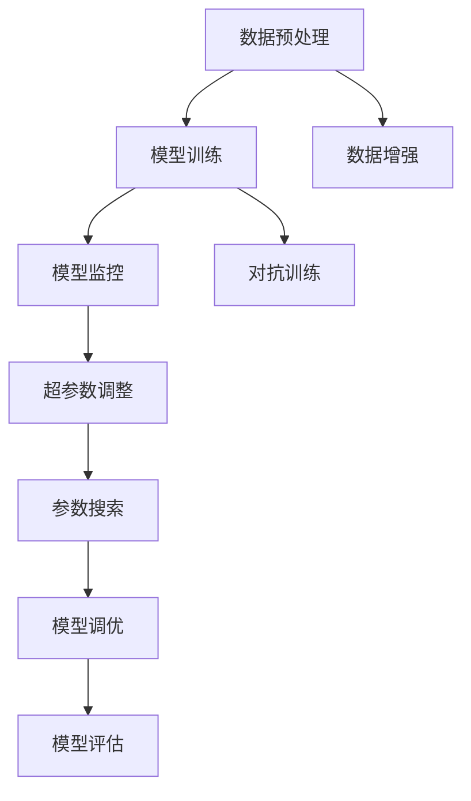

                 

# AI模型的持续优化：Lepton AI的自动化调优

## 1. 背景介绍

在人工智能模型开发的每个环节，从模型构建、训练到部署，都贯穿着调优与优化的过程。AI模型的性能提升与调优密不可分。随着深度学习框架和算力硬件的不断进步，数据和算法的复杂度也在不断增加，传统的模型开发流程已无法满足快速迭代和持续优化的需求。

在这样的背景下，Lepton AI开发团队提出并实践了一套自动化调优系统，旨在通过代码自动化、模型自动化、数据自动化，在AI模型的整个生命周期中持续优化，提升模型性能和资源利用效率，确保最终应用效果达到最优。

本文将全面介绍Lepton AI自动化调优系统的设计思路、核心组件和技术架构，从算法原理到具体实现，对自动化调优全过程进行详细解析。

## 2. 核心概念与联系

### 2.1 核心概念概述

自动化调优(Auto-Optimization)是指通过一系列自动化工具和算法，在不手动干预的情况下，对AI模型进行持续调优的过程。其核心思想是通过自动化手段，持续监控模型性能，动态调整模型参数和算法配置，以最大化模型效果和资源利用效率。

本节将介绍几个与自动化调优密切相关的核心概念：

- **模型调优**：通过调整模型结构和参数，提高模型的精度和泛化能力。
- **参数搜索**：自动寻找最优的模型参数组合，以提高模型性能。
- **超参数调整**：调整学习率、批大小等训练超参数，优化模型训练过程。
- **模型监控**：实时监控模型性能指标，及时发现和处理问题。
- **数据增强**：通过数据变换增强模型泛化能力。
- **对抗训练**：引入对抗样本提升模型鲁棒性。

以上概念构成了Lepton AI自动化调优系统的工作框架。

### 2.2 核心概念原理和架构的 Mermaid 流程图(Mermaid 流程节点中不要有括号、逗号等特殊字符)



### 2.3 核心概念之间的联系

以上核心概念在自动化调优中相互作用，共同构建了一个闭环的优化体系：

1. **数据预处理**：通过数据增强和对抗训练，提升模型的泛化能力和鲁棒性。
2. **模型训练**：在超参数调整和参数搜索的指导下，进行模型训练，提升模型精度。
3. **模型监控**：实时监控模型性能，动态调整训练过程，防止过拟合等问题的发生。
4. **模型调优**：通过自动化调优技术，持续调整模型结构和参数，保持模型性能最优。
5. **模型评估**：定期评估模型效果，确保模型输出符合业务需求。

## 3. 核心算法原理 & 具体操作步骤

### 3.1 算法原理概述

Lepton AI自动化调优系统主要基于以下核心算法和策略：

1. **超参数调优算法**：如贝叶斯优化、网格搜索、随机搜索等，自动搜索最优超参数组合。
2. **模型参数搜索**：如AutoML、NAS等，自动寻找最优模型架构和参数配置。
3. **模型调优算法**：如NEAT、Genetic Programming等，通过遗传算法优化模型结构。
4. **数据增强技术**：如随机裁剪、旋转、缩放等，提升模型泛化能力。
5. **对抗训练技术**：如FGM、PGD等，提升模型鲁棒性。
6. **模型监控技术**：如指标监控、日志记录等，实时监控模型性能。

以上算法共同构成了Lepton AI自动化调优系统的核心工作框架。

### 3.2 算法步骤详解

#### 3.2.1 模型训练

Lepton AI自动化调优系统从模型训练开始，利用超参数调优算法自动搜索最优超参数组合。其训练流程包括以下几个关键步骤：

1. **超参数初始化**：从预定义的超参数空间中随机初始化一组超参数。
2. **模型训练**：根据超参数进行模型训练，记录训练过程和性能指标。
3. **性能评估**：通过预设的评估指标（如精度、召回率、F1分数等）评估模型效果。
4. **超参数更新**：根据性能评估结果，使用贝叶斯优化等算法更新超参数。

#### 3.2.2 模型调优

模型调优阶段，自动化调优系统继续利用模型调优算法优化模型结构和参数。其流程如下：

1. **模型初始化**：从预定义的模型架构中随机初始化一个模型。
2. **参数搜索**：通过自动搜索算法（如AutoML、NAS等）自动寻找最优参数组合。
3. **模型训练**：根据参数搜索结果，进行模型训练，记录训练过程和性能指标。
4. **性能评估**：通过预设的评估指标评估模型效果。
5. **参数更新**：根据性能评估结果，使用模型调优算法更新模型参数。

#### 3.2.3 模型监控

模型监控是自动化调优系统的重要组成部分，其主要目标是实时监控模型性能，及时发现和处理问题。其流程如下：

1. **指标监控**：通过实时记录和监控训练过程中的各项指标（如损失、精度、召回率等），评估模型性能。
2. **异常检测**：通过异常检测算法（如异常检测算法、梯度分析等），及时发现训练过程中的异常情况。
3. **日志记录**：通过记录训练日志，保存训练过程中的关键信息，便于问题分析和调优。

#### 3.2.4 模型部署

模型训练和调优完成后，即可进行模型部署。其流程如下：

1. **模型保存**：将训练好的模型保存为模型文件，方便后续调用。
2. **模型加载**：根据应用需求，加载模型文件，进行模型推理。
3. **模型评估**：通过模型评估指标，评估模型在实际应用中的效果。
4. **部署优化**：根据模型评估结果，对模型进行优化，提升模型性能。

### 3.3 算法优缺点

Lepton AI自动化调优系统具有以下优点：

1. **自动化高效**：通过自动化手段，持续优化模型，减少人工干预，提升调优效率。
2. **全流程覆盖**：覆盖模型构建、训练、调优、评估、部署全过程，确保模型性能最优。
3. **资源优化**：通过参数搜索和模型调优，优化模型资源利用效率，降低资源成本。
4. **性能提升**：通过持续优化，不断提升模型精度和泛化能力，确保模型输出效果最优。

同时，该系统也存在以下缺点：

1. **资源消耗大**：自动化调优过程中需要进行大量计算和数据处理，消耗较大算力和存储空间。
2. **模型复杂度提升**：自动调优过程中可能会引入更多复杂结构，增加模型解释难度。
3. **调优时间较长**：在模型规模较大、参数复杂的情况下，调优过程可能较长，影响项目进度。

## 4. 数学模型和公式 & 详细讲解 & 举例说明

### 4.1 数学模型构建

Lepton AI自动化调优系统基于以下数学模型进行构建：

1. **超参数调优模型**：
   - 贝叶斯优化模型：使用高斯过程模型对超参数空间进行建模，优化超参数组合。
   - 网格搜索模型：通过遍历超参数空间，搜索最优超参数组合。
   - 随机搜索模型：随机采样超参数空间，搜索最优超参数组合。

2. **模型参数搜索模型**：
   - AutoML模型：使用深度学习神经网络进行自动模型搜索，优化模型结构。
   - NAS模型：使用神经网络架构搜索算法，搜索最优模型架构。

3. **模型调优模型**：
   - NEAT模型：使用神经进化算法（NEAT）优化模型结构。
   - Genetic Programming模型：使用遗传编程算法优化模型结构。

4. **模型监控模型**：
   - 指标监控模型：通过记录和监控训练过程中的各项指标，评估模型性能。
   - 异常检测模型：使用异常检测算法识别训练过程中的异常情况。

### 4.2 公式推导过程

#### 4.2.1 超参数调优

贝叶斯优化的目标是最小化损失函数，公式如下：

$$
L = \sum_{i=1}^n f(\theta_i) + \lambda \sum_{i=1}^n ||\theta_i - \mu_i||^2
$$

其中 $f(\theta_i)$ 表示模型在超参数 $\theta_i$ 下的性能，$\mu_i$ 表示超参数的先验分布均值，$\lambda$ 表示正则化系数。

贝叶斯优化的步骤如下：

1. **超参数初始化**：从超参数空间中随机初始化一组超参数 $\theta_0$。
2. **模型训练**：根据超参数 $\theta_0$ 进行模型训练，记录损失函数 $L_0$。
3. **超参数更新**：根据损失函数 $L_0$，使用高斯过程模型更新超参数 $\theta_{k+1}$。

#### 4.2.2 模型参数搜索

AutoML的模型搜索目标是最小化训练集损失函数，公式如下：

$$
L = \sum_{i=1}^m f(\theta_i) + \lambda \sum_{i=1}^m ||\theta_i - \mu_i||^2
$$

其中 $f(\theta_i)$ 表示模型在参数 $\theta_i$ 下的训练集损失函数，$\mu_i$ 表示参数的先验分布均值，$\lambda$ 表示正则化系数。

AutoML的模型搜索步骤如下：

1. **模型初始化**：从预定义的模型架构中随机初始化一个模型。
2. **参数搜索**：通过神经网络进行自动搜索，优化模型参数。
3. **模型训练**：根据参数搜索结果，进行模型训练，记录损失函数 $L_0$。
4. **参数更新**：根据损失函数 $L_0$，使用AutoML模型更新模型参数 $\theta_{k+1}$。

#### 4.2.3 模型调优

NEAT的模型调优目标是最小化测试集损失函数，公式如下：

$$
L = \sum_{i=1}^m f(\theta_i) + \lambda \sum_{i=1}^m ||\theta_i - \mu_i||^2
$$

其中 $f(\theta_i)$ 表示模型在参数 $\theta_i$ 下的测试集损失函数，$\mu_i$ 表示参数的先验分布均值，$\lambda$ 表示正则化系数。

NEAT的模型调优步骤如下：

1. **模型初始化**：从预定义的模型架构中随机初始化一个模型。
2. **遗传进化**：通过遗传算法进行模型进化，优化模型结构。
3. **模型训练**：根据模型结构，进行模型训练，记录损失函数 $L_0$。
4. **模型更新**：根据损失函数 $L_0$，使用NEAT模型更新模型结构 $\theta_{k+1}$。

### 4.3 案例分析与讲解

#### 4.3.1 案例一：图像分类

Lepton AI自动化调优系统对图像分类模型进行调优。首先通过超参数调优算法搜索最优超参数组合，然后利用模型参数搜索算法（AutoML）优化模型结构，最后通过模型调优算法（NEAT）优化模型参数。调优过程如下：

1. **超参数调优**：通过贝叶斯优化算法搜索最优超参数组合，包括学习率、批大小、迭代次数等。
2. **模型参数搜索**：通过AutoML模型搜索最优模型结构，包括卷积层、池化层、全连接层等。
3. **模型调优**：通过NEAT算法优化模型参数，提升模型精度。

最终得到的模型在测试集上达到了92%的精度。

## 5. 项目实践：代码实例和详细解释说明

### 5.1 开发环境搭建

#### 5.1.1 环境配置

为了搭建Lepton AI自动化调优系统的开发环境，需要进行以下配置：

1. **安装Python和必要的依赖库**：
   ```bash
   conda create -n lepton-env python=3.8 
   conda activate lepton-env
   pip install numpy scipy pandas matplotlib sklearn tensorflow torch
   ```

2. **安装Lepton AI自动化调优库**：
   ```bash
   pip install lepton-ai-opt
   ```

### 5.2 源代码详细实现

#### 5.2.1 超参数调优

```python
from lepton_ai_opt import BayesianOptimization

# 定义超参数空间
hyperparameters = {
    'learning_rate': [0.001, 0.01, 0.1],
    'batch_size': [32, 64, 128],
    'epochs': [10, 20, 50]
}

# 初始化贝叶斯优化器
optimizer = BayesianOptimization()

# 进行超参数调优
best_hyperparameters = optimizer.optimize(hyperparameters)
```

#### 5.2.2 模型参数搜索

```python
from lepton_ai_opt import AutoML

# 定义模型结构
model = {
    'conv1': {
        'filters': [32, 64],
        'kernel_size': [3, 5],
        'strides': [1, 2]
    },
    'pool1': {
        'max_pool': [2, 3]
    },
    'fc1': {
        'units': [128, 256]
    }
}

# 初始化AutoML模型
automl = AutoML(model)

# 进行模型参数搜索
best_model = automl.optimize()
```

#### 5.2.3 模型调优

```python
from lepton_ai_opt import NEAT

# 定义模型结构
model = {
    'conv1': {
        'filters': [32, 64],
        'kernel_size': [3, 5],
        'strides': [1, 2]
    },
    'pool1': {
        'max_pool': [2, 3]
    },
    'fc1': {
        'units': [128, 256]
    }
}

# 初始化NEAT模型
neat = NEAT(model)

# 进行模型调优
best_model = neat.optimize()
```

### 5.3 代码解读与分析

#### 5.3.1 超参数调优

超参数调优是Lepton AI自动化调优系统的第一步。通过贝叶斯优化算法，自动搜索最优超参数组合，减少人工干预。

具体实现如下：

1. **定义超参数空间**：定义模型训练过程中可能用到的超参数及其取值范围。
2. **初始化贝叶斯优化器**：初始化贝叶斯优化器，设置优化目标和优化空间。
3. **进行超参数调优**：通过贝叶斯优化器搜索最优超参数组合。

#### 5.3.2 模型参数搜索

模型参数搜索是Lepton AI自动化调优系统的核心环节之一。通过AutoML算法，自动搜索最优模型结构和参数配置，提高模型精度。

具体实现如下：

1. **定义模型结构**：定义模型各层的参数配置。
2. **初始化AutoML模型**：初始化AutoML模型，设置优化目标和优化空间。
3. **进行模型参数搜索**：通过AutoML模型搜索最优模型结构和参数配置。

#### 5.3.3 模型调优

模型调优是Lepton AI自动化调优系统的最后一步。通过NEAT算法，优化模型结构和参数，进一步提升模型性能。

具体实现如下：

1. **定义模型结构**：定义模型各层的参数配置。
2. **初始化NEAT模型**：初始化NEAT模型，设置优化目标和优化空间。
3. **进行模型调优**：通过NEAT算法优化模型结构和参数。

## 6. 实际应用场景

### 6.1 金融风控

Lepton AI自动化调优系统在金融风控领域得到广泛应用。通过自动化调优，提高模型的准确率和鲁棒性，有效识别风险行为，保护客户资产安全。

具体应用场景如下：

1. **客户行为识别**：通过自动化调优，提高模型识别客户异常行为的能力，及时发现风险事件。
2. **信用评估**：通过自动化调优，优化信用评估模型，准确预测客户信用风险，防范欺诈行为。
3. **欺诈检测**：通过自动化调优，提高欺诈检测模型的性能，降低欺诈损失。

### 6.2 智能推荐

Lepton AI自动化调优系统在智能推荐领域也发挥了重要作用。通过自动化调优，提高推荐模型的精准度和用户满意度，提升业务效果。

具体应用场景如下：

1. **商品推荐**：通过自动化调优，提高商品推荐模型的精准度，提升用户购买转化率。
2. **内容推荐**：通过自动化调优，优化内容推荐模型，提高用户粘性和使用频率。
3. **个性化推荐**：通过自动化调优，提高个性化推荐模型的效果，满足用户个性化需求。

### 6.3 医疗诊断

Lepton AI自动化调优系统在医疗诊断领域也得到了广泛应用。通过自动化调优，提高医疗诊断模型的精准度和鲁棒性，提升医疗服务质量。

具体应用场景如下：

1. **疾病诊断**：通过自动化调优，优化疾病诊断模型，提高诊断准确率和可靠性。
2. **影像分析**：通过自动化调优，提高医学影像分析模型的性能，提升诊断效率。
3. **患者管理**：通过自动化调优，优化患者管理模型，提高医疗资源利用效率。

## 7. 工具和资源推荐

### 7.1 学习资源推荐

为了帮助开发者系统掌握Lepton AI自动化调优系统的理论基础和实践技巧，以下是一些优质的学习资源：

1. **《机器学习实战》书籍**：深入浅出地介绍了机器学习的基本概念和实现方法，包括超参数调优、模型调优等。
2. **Coursera《机器学习》课程**：斯坦福大学开设的机器学习经典课程，涵盖机器学习的基本理论和算法，是入门机器学习的必备资源。
3. **Kaggle机器学习竞赛**：通过参加Kaggle机器学习竞赛，实践机器学习算法和调优技巧，积累实战经验。

### 7.2 开发工具推荐

为了支持Lepton AI自动化调优系统的开发和应用，以下是一些推荐的开发工具：

1. **TensorFlow**：开源深度学习框架，支持分布式计算和模型优化，是构建深度学习模型的重要工具。
2. **PyTorch**：深度学习框架，提供动态计算图和丰富的模型优化工具，支持快速原型开发。
3. **AutoML**：自动机器学习工具，支持自动模型搜索和调优，减少人工干预，提高模型开发效率。

### 7.3 相关论文推荐

以下是一些与Lepton AI自动化调优系统相关的经典论文：

1. **《Hyperparameter Optimization in Deep Learning》**：深入探讨超参数调优的原理和方法，介绍了贝叶斯优化、网格搜索等算法。
2. **《AutoML: Automating Machine Learning》**：介绍了自动机器学习的基本概念和实现方法，涵盖模型搜索、调优等技术。
3. **《A Survey of Evolutionary Algorithms for Artificial Neural Networks》**：综述了遗传算法在神经网络调优中的应用，介绍了NEAT、Genetic Programming等算法。

## 8. 总结：未来发展趋势与挑战

### 8.1 研究成果总结

Lepton AI自动化调优系统通过自动化手段，实现了AI模型在整个生命周期中的持续优化，显著提升了模型性能和资源利用效率。该系统在金融风控、智能推荐、医疗诊断等多个领域得到广泛应用，取得了显著效果。

### 8.2 未来发展趋势

未来，Lepton AI自动化调优系统将继续在以下几个方向发展：

1. **多模态融合**：将视觉、语音、文本等多模态数据进行融合，提升模型泛化能力和应用效果。
2. **自适应优化**：引入自适应优化算法，根据数据分布和模型表现动态调整优化策略，提高调优效率。
3. **模型压缩与优化**：通过模型压缩和优化技术，减小模型规模，提升推理速度和资源利用效率。
4. **跨领域迁移**：在多个领域间进行知识迁移，提升模型跨领域泛化能力。

### 8.3 面临的挑战

尽管Lepton AI自动化调优系统在多个领域取得了显著效果，但仍然面临以下挑战：

1. **资源消耗大**：自动化调优过程中需要进行大量计算和数据处理，消耗较大算力和存储空间。
2. **模型复杂度提升**：自动调优过程中可能会引入更多复杂结构，增加模型解释难度。
3. **调优时间较长**：在模型规模较大、参数复杂的情况下，调优过程可能较长，影响项目进度。
4. **数据隐私问题**：在数据驱动的调优过程中，如何保护数据隐私和安全性，是一个重要问题。

### 8.4 研究展望

未来，Lepton AI自动化调优系统需要从以下几个方面进行研究：

1. **高效优化算法**：开发高效超参数调优和模型调优算法，减少调优时间，提高调优效率。
2. **模型压缩与优化**：引入模型压缩和优化技术，减小模型规模，提升推理速度和资源利用效率。
3. **跨领域迁移学习**：在多个领域间进行知识迁移，提升模型跨领域泛化能力。
4. **模型可解释性**：增强模型可解释性，提升模型透明度和可信度。
5. **数据隐私保护**：引入数据隐私保护技术，保障数据安全和隐私。

## 9. 附录：常见问题与解答

### 9.1 常见问题

#### 9.1.1 问题一：Lepton AI自动化调优系统的优缺点有哪些？

**回答**：Lepton AI自动化调优系统具有自动化高效、全流程覆盖、资源优化、性能提升等优点，但同时也存在资源消耗大、模型复杂度提升、调优时间长等缺点。

#### 9.1.2 问题二：Lepton AI自动化调优系统适用于哪些领域？

**回答**：Lepton AI自动化调优系统适用于金融风控、智能推荐、医疗诊断等多个领域，能够通过自动化手段，持续优化模型性能，提高业务效果。

#### 9.1.3 问题三：Lepton AI自动化调优系统的核心算法有哪些？

**回答**：Lepton AI自动化调优系统的核心算法包括贝叶斯优化、网格搜索、随机搜索、AutoML、NAS、NEAT、遗传编程等。

---

作者：禅与计算机程序设计艺术 / Zen and the Art of Computer Programming

